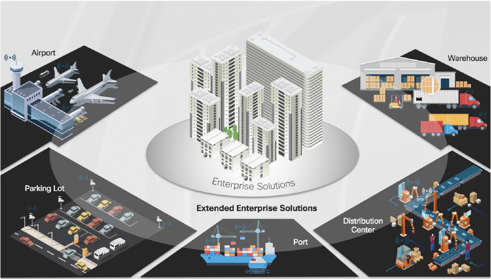

[](https://developer.cisco.com/codeexchange/github/repo/DNACENSolutions/dnac_ansible_workflows)
[](https://developer.cisco.com/codeexchange/devenv/DNACENSolutions/dnac_ansible_workflows/)

# Catalyst Center Cisco Validated Playbooks
This repository provides Cisco-validated Ansible playbooks to automate Catalyst Center configurations, accelerating your network automation journey. 
It includes:

## Ready-to-use playbooks: 
Streamline Catalyst Center provisioning with ready-to-use Ansible playbooks. Automate configurations and simplify network management tasks.

## Input validation schemas: 
Yamale-based input validation schemas ensure user input accuracy for the playbooks by validating user input before execution. This significantly reduces the potential for human error and ensures consistent, reliable results. Prevent costly mistakes and maintain configuration integrity with automated input checks.

## Comprehensive guides: 
Comprehensive guides provide detailed instructions and practical examples for various Catalyst Center configuration use cases. Learn how to  deploy, update, and maintain your network infrastructure with step-by-step guidance and best practices.  These resources empower you to effectively manage your network throughout its lifecycle.

## Sample inputs: 
Jumpstart your automation journey with sample input files that demonstrate proper formatting and supported values. Quickly create your own input configurations by adapting these examples, saving time and reducing errors. Use these pre-populated templates as a foundation for customizing your Catalyst Center deployments.

## Sample Jinja Based template:
Enhance scalability and flexibility with Jinja-based template support.  These templates empower you to dynamically generate input configurations, adapting to various deployments with ease.  Simplify complex configurations and streamline repetitive tasks by leveraging the power of Jinja templating within your Ansible playbooks.

### Embrace infrastructure as code and manage your entire Catalyst Center configuration through Git. This repository provides the tools and guidance to make Git your single source of truth, ensuring:

Complete version control: Track every change and easily revert to previous states.
Increased collaboration: Simplify teamwork with a centralized and transparent platform.
Improved reliability: Reduce errors and ensure consistent configurations across your network.
Simplified deployments: Automate updates and rollbacks with confidence.
# Enterprise Usecases


# Table of Contents
- [Prerequisites](#prerequisites)
- [Installation](#installation)
- [Usage](#usage)
- [Examples](#examples)
- [Update](#update)
- [Contributing](#contributing)
- [License](#license)
- Cisco Validated Playbooks usage guides

## Day0 Configurations (Access and Integrations)
- [Catalyst Center Role Based Access Control and Users Management](./workflows/users_and_roles/README.md)
- [Catalyst Center ISE and AAA Servers Integration](./workflows/ise_radius_integration/#readme)

## Day1 Configurations (Design and Discovery)
- [Catalyst Center Site Hierarchy and Floor Maps design](./workflows/sites/#readme)
- [Catalyst Center Device Credentials configurations and assignment](./workflows/device_credentials/#readme)
- [Catalyst Center Network Settings (Servers, Banners, TZ, SNMP, Logging, Telemetry Management](./workflows/network_settings/#readme)
- [Catalyst Center Network Settings Global Ip Pools and Site Pools reservation Management](./workflows/network_settings/#readme)
- [Catalyst Center Devces Discovery](./workflows/device_discovery/#readme)
- [Catalyst Center Device Inventory and device management](./workflows/inventory#readme)
- [Catalyst Center Plug and Play Device Onboarding](./workflows/plug_and_play/README.md)
- [Catalyst Center Device Provisioning and Re-Provisioning Management](./workflows/provision/README.md)

## Day2 Configurations (Underlay automation and SD Access fabric)
- [Catalyst Cennter Underlay Automation (LAN Automation) Management](./workflows/lan_automation/#readme)
- [Catalyst Center SDA Fabric Site and Fabric Zones](./workflows/sda_fabric_sites_zones/README.md)
- [Catalyst Center SDA Fabric Transits (IP and SDA) Management](./workflows/sda_fabric_transits/README.md)
- [Catalyst Center Virtual Networks and L3 Anycast Gateways and L2 Vlans](./workflows/sda_virtual_networks_l2l3_gateways/README.md)
- [Catalyst Center SDA Fabric Device assignment to fabric sites and zones](./workflows/sda_fabric_device_roles/README.md)
- [Catalyst Center SDA Fabric Devices and Host Onboarding](./workflows/sda_hostonboarding/README.md)
- [Catalyst Center SDA Extranet Policies Management](./workflows/sda_fabric_extranet_policy/README.md)

## DayN Operation (Software Upgrade, Compliance, Events, Provisioning, backups and Assurance)
- [Catalyst Center Devces Software image management (SWIM)](./workflows/swim/README.md)
- [Catalyst Center Device compliance and remidiation](./workflows/network_compliance/README.md)
- [Catalyst Center Notification Destination and Events Subscription](./workflows/events_and_notifications/README.md)
- [Catalyst Center Devices Replacement Management](./workflows/device_replacement_rma/README.md)
- [Catalyst Center Access Point Provisioning and Access Point Configuration Management](./workflows/wireless_ap_config/README.md)
- [Device Configuration Customization using Catalyst Center Templates](./workflows/device_templates/README.md)
- [Catalyst Center managed network devices configurations backup management](./workflows/device_config_backup/README.md)

# Prerequisites
Before using these Ansible workflows, ensure that you have the following prerequisites:

- Ansible installed on your machine
- Access to a Cisco Catalyst Center instance
- Proper network connectivity to interact with the Catalyst Center APIs


# Installation
Python 3.7+ is required to install iac-validate. Don't have Python 3.7 or later? 
See Python 3 Installation & Setup Guide https://realpython.com/installing-python/
Create your python virtual environment using commend:
```bash
    python3 -m venv python3env --prompt "AnsiblePython3 VENV"
    source python3env
```

## Clone this repository to your local machine:
Clone the repo or pull a branch and use directly
```bash
    git clone https://github.com/DNACENSolutions/dnac_ansible_workflows.git
```


## Navigate to the project directory:    
```bash
    cd dnac_ansible_workflows
```

## Install the required dependencies:
```bash
    pip install -r requirements.txt
```
## Install the collection (Galaxy link):
```bash
    ansible-galaxy collection install cisco.dnac --force
```
## Create your inventory
### Inventory:
This folder contains inventory file for your dev, lab, sandbox or production env which will be utilised by swim playbooks.

Create your inventory file in below template format to utilize the swim playbooks.

The template for the inventory file is:
```bash
    cat inventory/demo_lab/001-dnac_inventory_template.yml
```

Setup up your ansible python interpretor following suitable method for your environment : https://docs.ansible.com/ansible/latest/reference_appendices/interpreter_discovery.html
    
### Hairarchical variable files for inputs

The second folder of the workflows contains playbook and var files for workflows.
Example:
```bash
    workflows/swim
    playbooks/
        swim_workflow_playbook.yml
    vars/
        vars_swim.yml
```
### Var files:
    Update var file with your  details and parameter to control playbook

### Playbook: 
    The playbooks can be directly used without any change when inventory and var files created in the above templates.

# Executing playbook (Sample):

## Create a basic inventory file with Cisco Catalyst Center Inputs in inventory folder. for example demo_inv.yml
```yaml
---
#Inventory file for demo_lab
catalyst_center_hosts:
    hosts:
    <dnac hostname >:
    dnac_debug: false
    dnac_host: <Cisco Catalyst Center IP Address> #(Mandatory) Cisco Catalyst Center Ip address
    dnac_password: <Cisco Catalyst Center UI admin Password> #(Mandatory) 
    dnac_port: 443 #(Mandatory) 
    dnac_username: <Cisco Catalyst Center UI admin username> #(Mandatory) 
    dnac_verify: false #(Mandatory) 
    dnac_version: <Cisco Catalyst Center Release version> #(Mandatory)  Example: 2.3.5.3
```

Here are a few examples of Cisco Validated Playbooks in the repo. For details documentation of the playbook usage refer the guide inside the corresponding module.

## Example 1: 
Swim upgrade, this include uploading the images, golden tagging the image filtered location and device family and distributed and activating images on the networkk devices.
```bash
    ansible-playbook -i ./inventory_dnaccluster ./workflows/swim/playbook/swim_workflow_playbook.yml --extra-vars VARS_FILE_PATH=< Vars File PATH (Full Path or relative path from playbook)> -vvvv
```
    
## Example 2: 
Create Sites, buildings floors using playbook : workflows/sites/playbook/site_hierarchy_playbook.yml
    
```bash
 ansible-playbook -i ./inventory_dnaccluster ./workflows/sites/playbook/site_hierarchy_playbook.yml --extra-vars VARS_FILE_PATH=./../vars/site_hierarchy_design_vars_.yml
```
    
Feel free to explore the playbooks/ directory for more examples and use cases.

# Attention macOS users:

If you're using macOS you may receive this error when running your playbook:
```bash
objc[34120]: +[__NSCFConstantString initialize] may have been in progress in another thread when fork() was called.
objc[34120]: +[__NSCFConstantString initialize] may have been in progress in another thread when fork() was called. We can't safely call it or ignore it in the fork() child process. Crashing instead. Set a breakpoint on objc_initializeAfterForkError to debug.
ERROR! A worker was found in a dead state
```

If that's the case try setting this environment variable:
```bash
    export OBJC_DISABLE_INITIALIZE_FORK_SAFETY=YES
```

# Update
Getting the latest/nightly collection build

Clone the dnacenter-ansible repository.
```bash
 git clone git@github.com:DNACENSolutions/dnac_ansible_workflows.git
```
    
Go to the dnacenter-ansible directory
```bash
 cd dnac_ansible_workflows
```
    
Pull the latest master from the repo
```bash
    git pull origin master
```
    
# Contributing
Contributions are welcome! To contribute to this project, follow these steps:
    Fork the repository.
    Create a new branch for your feature or bug fix.
    Make your changes and commit them with descriptive commit messages.
    Push your changes to your fork.
    Submit a pull request to the main branch of this repository.

# Code of Conduct
This collection follows the Ansible project's Code of Conduct. Please read and familiarize yourself with this document.

# Releasing, Versioning and Deprecation:
 Version (Beta) : More enhancement might follow based on usage feedback
