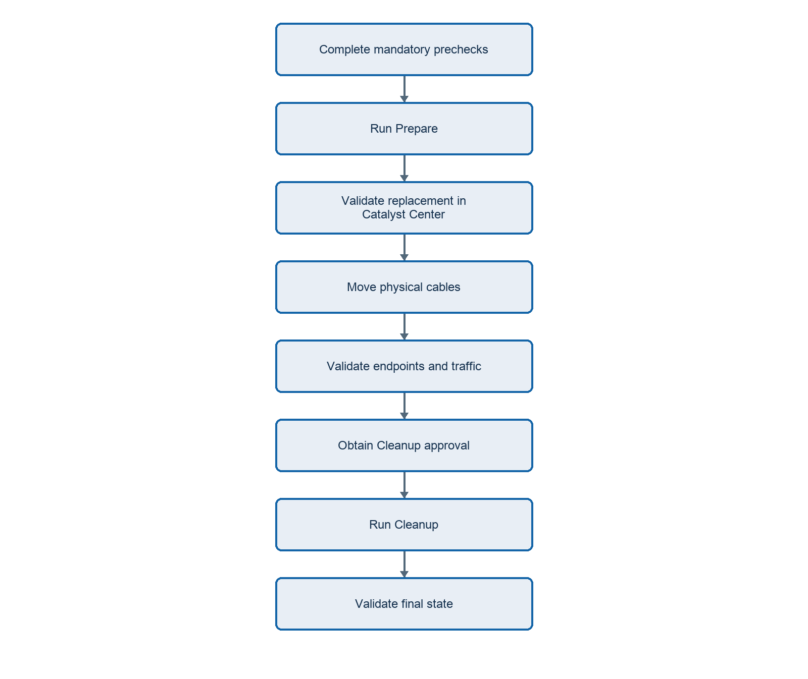

# SDA Access Switch Refresh

## Overview

The SDA Access Switch Refresh workflow replaces one or more existing fabric edge access switches with replacement switches while preserving supported Cisco Catalyst Center intent.

The workflow is designed for hardware-refresh scenarios such as replacing an existing Catalyst access switch with a newer model. It supports both like-to-like and like-to-unlike replacements and can process multiple switch pairs as one stage-batched operation.

The workflow has two separate phases:

- **Prepare** onboards and configures replacement switches while the old switches remain available.
- **Cleanup** removes old switches only after the customer validates the replacements and approves destructive cleanup.



> **Important:** The workflow migrates Catalyst Center host-port intent. It does not move physical cables. The operator must move endpoint, access point, phone, server, and uplink cables during the approved change window.

## Workflow Capabilities

Onboard replacement switches through Discovery or LAN Automation.

Add or merge replacements in Catalyst Center inventory and assign inventory role ACCESS.

Provision replacements to the selected site.

Add replacements to the SDA fabric as EDGE_NODE.

Migrate supported host-port and port-channel intent using explicit interface mappings.

Remove old switches only after replacement validation and Cleanup approval.

## Table of Contents

- [Prerequisites](#prerequisites)
- [Installation](#installation)
- [Workflow Structure](#workflow-structure)
- [Mandatory Input Information](#mandatory-input-information)
- [Configure the Variables File](#configure-the-variables-file)
- [Validate the Input](#validate-the-input)
- [Executing the Prepare Playbook](#executing-the-prepare-playbook)
- [Physical Cutover and Traffic Validation](#physical-cutover-and-traffic-validation)
- [Executing the Cleanup Playbook](#executing-the-cleanup-playbook)
- [Attention macOS Users](#attention-macos-users)
- [Troubleshooting and Stop Conditions](#troubleshooting-and-stop-conditions)
- [Success Criteria](#success-criteria)

## Prerequisites

Before running the workflow, confirm the following requirements.

## Catalyst Center and Fabric

Access to a supported Cisco Catalyst Center instance and API connectivity from the Ansible runner.

The configured catalystcenter_version matches the deployed Catalyst Center release supported by the collection.

The target site exists and is enabled as an SDA fabric site.

Required virtual networks, IP pools, authentication templates, and existing host-port intent are present.

Each old switch is present exactly once, Reachable, Managed, provisioned to the intended site, and an SDA EDGE_NODE.

The automation account can use Discovery or LAN Automation, inventory, provisioning, fabric-device, and host-port APIs.

## Select the Onboarding Method

| Requirement | Discovery | LAN Automation |
| --- | --- | --- |
| Replacement management IP | Already configured and reachable | Assigned or reserved during onboarding |
| Underlay connectivity | Must already work | Built by LAN Automation |
| Physical seed connection | Not required | Required |
| Replacement serial number | Recommended | Required |
| LAN Automation IP pools | Not required | Required |
| PnP-ready device | Not required | Required |

> **Note:** Selection rule: Use Discovery when management routing and SSH already work. Use LAN Automation when Catalyst Center must discover the device through a seed port and build the underlay.

## Replacement Device Prechecks

```bash
show ip interface brief
show ip route <catalyst_center_address>
ping <catalyst_center_address> source <management_address>
show ip ssh
show run | section line vty
show privilege
show snmp user
show netconf-yang status
show isis neighbors
```

For LAN Automation, also verify the physical seed port, replacement serial, PnP state, and available main and physical-link IP pools.

## Installation

## Step 1: Clone the Repository

```bash
git clone https://github.com/cisco-en-programmability/catalyst-center-ansible-iac.git
cd catalyst-center-ansible-iac
```

## Step 2: Create a Python Virtual Environment

```bash
python3.12 -m venv .venv312
source .venv312/bin/activate
python -m pip install --upgrade pip
```

## Step 3: Install Dependencies and the Collection

```bash
python -m pip install "ansible-core>=2.16" -r requirements.txt
python -m pip install "catalystcentersdk>=3.1.6.0.2"
ansible-galaxy collection install "ansible.utils:>=2.0.0,<7.0"
ansible-galaxy collection build --force
ansible-galaxy collection install cisco-catalystcenter-*.tar.gz --force
```

## Step 4: Configure Ansible

Confirm ansible.cfg enables the required Jinja2 extensions and rejects duplicate YAML dictionary keys:

```ini
[defaults]
jinja2_extensions=jinja2.ext.loopcontrols,jinja2.ext.do
duplicate_dict_key=error
```

## Step 5: Verify the Environment

```bash
python --version
ansible --version
ansible-galaxy collection list | grep -E "cisco.catalystcenter|ansible.utils"
python -c "import catalystcentersdk; print(catalystcentersdk.__version__)"
```

## Workflow Structure

| Path | Purpose |
| --- | --- |
| playbooks/switch_refresh_prepare.yml | Runs the non-destructive replacement Prepare phase. |
| playbooks/switch_refresh_cleanup_old.yml | Runs destructive old-switch Cleanup after approval. |
| playbooks/vars/switch_refresh_usecase.yml | Contains Catalyst Center access, replacement batches, and mappings. |
| roles/switch_refresh/ | Performs orchestration, validation, and safety checks. |
| roles/switch_refresh/README.md | Provides the complete role schema and advanced recovery reference. |

## Mandatory Input Information

| Required value | Why it is required |
| --- | --- |
| Catalyst Center address, API version, and credentials | Connects the workflow to the correct controller. |
| Exact fabric site hierarchy | Validates old devices and places replacements in the correct fabric. |
| One unique identifier for every old switch | Resolves the old source device. Use only one of hostname, management IP, serial, or MAC. |
| Replacement management IPs | Authoritative target set for onboarding, inventory, provisioning, fabric, and migration. |
| Replacement serials | Required for LAN Automation and recommended for verification. |
| Source-to-destination interface mappings | Moves intent to the correct replacement interfaces. |
| CLI credentials | Required for Discovery and replacement inventory management. |
| Seed device, seed ports, and IP pools | Required only for LAN Automation. |
| Known-good endpoint and traffic tests | Proves service after cable movement. |

## Configure the Variables File

Edit playbooks/vars/switch_refresh_usecase.yml. Choose one onboarding template and replace every angle-bracket placeholder. Keep credentials in Ansible Vault.

## Create the Vault File

```yaml
vault_catalystcenter_username: "<username>"
vault_catalystcenter_password: "<password>"
vault_switch_cli_username: "<username>"
vault_switch_cli_password: "<password>"
vault_switch_enable_password: "<enable_password>"
```

```bash
ansible-vault encrypt group_vars/all/vault.yml
```

## Discovery Input Example

```yaml
---
catalystcenter_host: "<catalyst_center_fqdn_or_ip>"
catalystcenter_username: "{{ vault_catalystcenter_username }}"
catalystcenter_password: "{{ vault_catalystcenter_password }}"
catalystcenter_version: "<catalyst_center_version>"
catalystcenter_verify: true

switch_refresh_work_dir: /var/tmp/catalystcenter_switch_refresh
switch_refresh_onboarding_method: discovery

switch_refresh_inventory_credentials:
  username: "{{ vault_switch_cli_username }}"
  password: "{{ vault_switch_cli_password }}"
  enable_password: "{{ vault_switch_enable_password }}"
  cli_transport: ssh
  type: NETWORK_DEVICE

switch_refresh_batches:
  - name: "<refresh_batch_name>"
    fabric_site_name_hierarchy: "<fabric_site_hierarchy>"
    onboarding_method: discovery

    new_devices:
      device_ips:
        - "<replacement_1_management_ip>"
        - "<replacement_2_management_ip>"
      discovery_config:
        - discovery_name: "<discovery_name>"
          discovery_type: MULTI RANGE
          ip_address_list:
            - "<replacement_1_management_ip>"
            - "<replacement_2_management_ip>"
          protocol_order: ssh
          retry: 2
          use_global_credentials: true

    device_mapping:
      - old:
          hostname: "<old_switch_1_fqdn>"
        new_device_management_ip: "<replacement_1_management_ip>"
        port_assignment_interface_mappings:
          - source_interface_name: GigabitEthernet1/0/5
            destination_interface_name: GigabitEthernet1/0/4
        port_channel_interface_mappings: []

      - old:
          hostname: "<old_switch_2_fqdn>"
        new_device_management_ip: "<replacement_2_management_ip>"
        port_assignment_interface_mappings:
          - source_interface_name: GigabitEthernet2/0/6
            destination_interface_name: GigabitEthernet2/0/5
        port_channel_interface_mappings: []
```

## LAN Automation Input Example

```yaml
---
catalystcenter_host: "<catalyst_center_fqdn_or_ip>"
catalystcenter_username: "{{ vault_catalystcenter_username }}"
catalystcenter_password: "{{ vault_catalystcenter_password }}"
catalystcenter_version: "<catalyst_center_version>"
catalystcenter_verify: true

switch_refresh_work_dir: /var/tmp/catalystcenter_switch_refresh
switch_refresh_onboarding_method: lan_automation

switch_refresh_inventory_credentials:
  username: "{{ vault_switch_cli_username }}"
  password: "{{ vault_switch_cli_password }}"
  enable_password: "{{ vault_switch_enable_password }}"
  cli_transport: ssh
  type: NETWORK_DEVICE

switch_refresh_batches:
  - name: "<refresh_batch_name>"
    fabric_site_name_hierarchy: "<fabric_site_hierarchy>"
    onboarding_method: lan_automation

    new_devices:
      device_ips:
        - "<replacement_1_management_ip>"
        - "<replacement_2_management_ip>"
      lan_automation_config:
        - lan_automation:
            discovered_device_site_name_hierarchy: "<fabric_site_hierarchy>"
            primary_device_management_ip_address: "<seed_management_ip>"
            primary_device_interface_names:
              - "<seed_interface_to_replacement_1>"
              - "<seed_interface_to_replacement_2>"
            ip_pools:
              - ip_pool_name: "<lan_automation_main_pool>"
                ip_pool_role: MAIN_POOL
              - ip_pool_name: "<lan_automation_physical_link_pool>"
                ip_pool_role: PHYSICAL_LINK_POOL
            multicast_enabled: true
            redistribute_isis_to_bgp: false
            discovery_level: 1
            discovery_timeout: 40
            discovery_devices:
              - device_serial_number: "<replacement_1_serial>"
                device_host_name: "<replacement_1_temporary_hostname>"
                device_site_name_hierarchy: "<fabric_site_hierarchy>"
                device_management_ip_address: "<replacement_1_management_ip>"
              - device_serial_number: "<replacement_2_serial>"
                device_host_name: "<replacement_2_temporary_hostname>"
                device_site_name_hierarchy: "<fabric_site_hierarchy>"
                device_management_ip_address: "<replacement_2_management_ip>"
            launch_and_wait: true
            pnp_authorization: true

    device_mapping:
      - old:
          hostname: "<old_switch_1_fqdn>"
        new_device_management_ip: "<replacement_1_management_ip>"
        port_assignment_interface_mappings:
          - source_interface_name: GigabitEthernet1/0/5
            destination_interface_name: GigabitEthernet1/0/4
        port_channel_interface_mappings: []

      - old:
          hostname: "<old_switch_2_fqdn>"
        new_device_management_ip: "<replacement_2_management_ip>"
        port_assignment_interface_mappings:
          - source_interface_name: GigabitEthernet2/0/6
            destination_interface_name: GigabitEthernet2/0/5
        port_channel_interface_mappings: []
```

> **Note:** Input consistency: The replacement IP set under new_devices.device_ips must match every onboarding and device_mapping target. For identical interface names, use empty mapping lists. For unlike platforms, map every changed interface explicitly.

## Validate the Input

```bash
python -c "import yaml; yaml.safe_load(open('playbooks/vars/switch_refresh_usecase.yml')); print('YAML valid')"
ansible-playbook --syntax-check playbooks/switch_refresh_prepare.yml
ansible-playbook --syntax-check playbooks/switch_refresh_cleanup_old.yml
```

Correct every YAML, schema, and syntax error before a live run.

## Executing the Prepare Playbook

```bash
ansible-playbook playbooks/switch_refresh_prepare.yml --ask-vault-pass
```

Prepare must finish with failed=0 and unreachable=0. Then validate actual Catalyst Center state before moving cables.

## Prepare Validation

Exactly one inventory record exists for every replacement IP.

Every replacement is Reachable or Ping Reachable, Managed, and inventory role ACCESS.

Every replacement is provisioned to the intended site.

Every replacement is an SDA EDGE_NODE in the expected fabric.

Host-port and port-channel intent exists only on the mapped replacement interfaces.

For LAN Automation, PnP completed, no LAN Automation session remains active, and underlay neighbors and routes are healthy.

## Physical Cutover and Traffic Validation

Keep the old switch powered and available.

Move one cable or approved cable group at a time to the exact mapped replacement interface.

Wait for link, authentication, IP learning, and policy programming.

Verify the expected MAC and IP binding on the replacement port.

Test the default gateway, required VN paths, shared services, and an application.

Move affected cables back to the old switch immediately when validation fails.

> **Note:** Expected downtime: A single-homed endpoint normally experiences an interruption while its cable is moved and the replacement port converges. The workflow does not create endpoint redundancy.

## Executing the Cleanup Playbook

Cleanup is destructive. Run it only after every intended cable has moved, all validation passes, fabric health is acceptable, and explicit Cleanup approval is recorded.

```bash
ansible-playbook playbooks/switch_refresh_cleanup_old.yml --ask-vault-pass
```

## Final Validation

| Replacement switches | Old switches |
| --- | --- |
| Present exactly once, Reachable, Managed, and role ACCESS. | Host-port intent removed. |
| Provisioned to the intended site and fabric EDGE_NODE. | Removed from the SDA fabric. |
| Mapped host-port and port-channel intent remains present. | Unprovisioned and absent from inventory. |
| Endpoints are learned and required traffic tests pass. | Old IP, UUID, and serial identities are absent. |

## Attention macOS Users

If Ansible workers terminate with an Objective-C initializeAfterForkError or A worker was found in a dead state, set this environment variable in the shell used to run the playbook:

```bash
export OBJC_DISABLE_INITIALIZE_FORK_SAFETY=YES
```

## Troubleshooting and Stop Conditions

| Condition | Required action |
| --- | --- |
| Input or syntax validation fails | Correct the input before any live run. |
| Old switch does not resolve exactly once | Correct the identifier and use only one identifier. |
| Replacement is unreachable or not Managed | Restore reachability and collection. Do not bypass validation. |
| LAN Automation remains active | Resolve or stop the session before inventory or provisioning. |
| Generated host-port intent is empty or incorrect | Correct old intent or mappings and rerun Prepare before cutover. |
| Endpoint authentication, addressing, policy, or traffic fails | Move affected cables back and troubleshoot. |
| Cleanup approval is missing | Keep the old switch in fabric and inventory. |

## Success Criteria

Every replacement is Reachable, Managed, ACCESS, provisioned to the intended site, and an SDA EDGE_NODE.

Required host-port and port-channel intent exists only on mapped replacement interfaces.

Connected endpoints authenticate and pass approved traffic and application tests.

Every old switch is absent from the fabric and inventory after approved Cleanup.

Validation evidence and generated payloads are retained with the change record.
