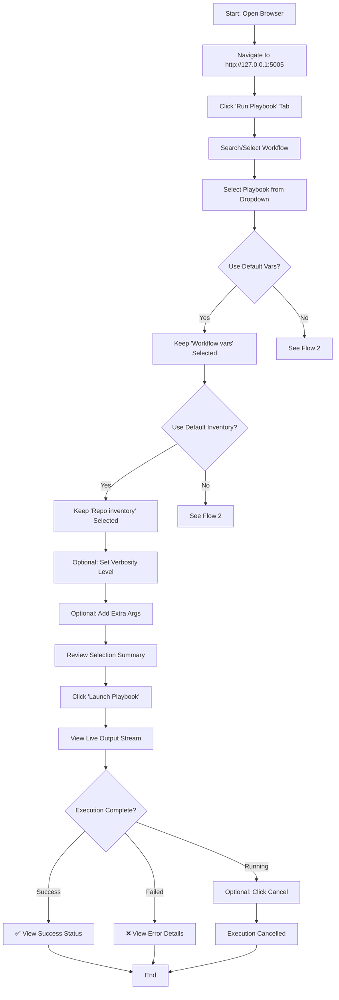
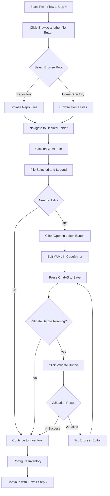
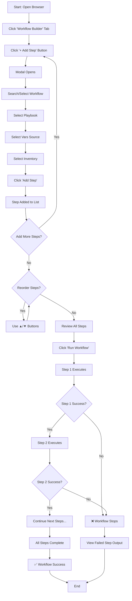
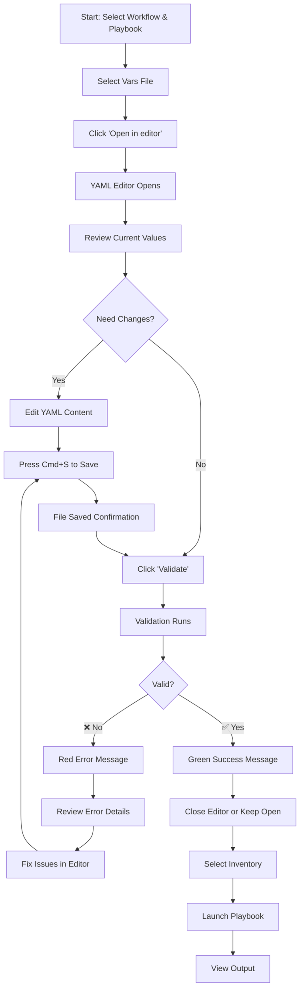

# Ansible Workflow Runner

A lightweight web UI for browsing, editing, and executing Ansible playbooks from the `dnac_ansible_workflows` repository.

## Table of Contents

- [Features](#features)
- [Prerequisites](#prerequisites)
- [Quick Start](#quick-start)
- [User Flows](#user-flows)
  - [Flow 1: Run a Playbook with Default Settings](#flow-1-run-a-playbook-with-default-settings)
  - [Flow 2: Run a Playbook with Custom Vars](#flow-2-run-a-playbook-with-custom-vars)
  - [Flow 3: Build and Execute a Multi-Step Workflow](#flow-3-build-and-execute-a-multi-step-workflow)
  - [Flow 4: Validate and Edit Vars Before Running](#flow-4-validate-and-edit-vars-before-running)
- [Architecture](#architecture)
- [API Reference](#api-reference)
- [Keyboard Shortcuts](#keyboard-shortcuts)

---

## Features

- **🚀 Run Playbook** — Select workflow and playbook, then launch with repo defaults or custom file paths
- **📝 YAML Editor** — Load and edit vars files in-browser with syntax highlighting (CodeMirror)
- **✅ Schema Validation** — Validate repo or custom vars files against their schema before running
- **📂 Custom File Browser** — Browse YAML vars or inventory files from the repo or your home directory
- **📡 Live Output** — Stream ansible-playbook output in real time with ANSI color support
- **🔗 Workflow Builder** — Chain multiple playbook runs into a sequential workflow; reorder steps with up/down controls
- **📊 Job History** — View past executions with status, duration, timestamps, and clickable detailed log links
- **📄 Job Detail Pages** — Open a shareable page for a single job with full Ansible output and raw log access
- **🛑 Cancel Support** — Stop running playbooks or entire workflows mid-execution

---

## Prerequisites

Before running the Ansible Workflow Runner, ensure you have:

- **Python 3.9+** installed
- **Ansible** installed and `ansible-playbook` in your PATH
- **Flask** and **Yamale** Python packages (installed via requirements.txt)
- A configured **inventory file** (e.g., `inventory/demo_lab/hosts.yaml`)
- Access to the **dnac_ansible_workflows** repository

---

## Quick Start

```bash
# Navigate to the repository root
cd /path/to/dnac_ansible_workflows

# Create a virtual environment (recommended)
python3 -m venv tools/ansible_runner/.venv

# Activate the virtual environment
source tools/ansible_runner/.venv/bin/activate  # On macOS/Linux
# OR
tools\ansible_runner\.venv\Scripts\activate     # On Windows

# Install dependencies
pip install -r tools/ansible_runner/requirements.txt

# Start the server
python tools/ansible_runner/app.py

# Open in browser
open http://127.0.0.1:5005
```

**Alternative Quick Start (using existing Python):**
```bash
cd /path/to/dnac_ansible_workflows
pip install flask yamale
python tools/ansible_runner/app.py
```

---

## User Flows

### Flow 1: Run a Playbook with Default Settings

**Use Case:** Execute a workflow playbook using the default vars and inventory files from the repository.



**Step-by-Step Instructions:**

1. **Open the Application**
   - Navigate to `http://127.0.0.1:5005` in your browser
   - You'll see the main dashboard with workflow statistics

2. **Select Workflow**
   - Click the **"Run Playbook"** tab
   - Use the search box to filter workflows (e.g., type "network_settings")
   - Select your desired workflow from the dropdown

3. **Select Playbook**
   - The playbook dropdown auto-populates with available playbooks
   - Select the playbook you want to run

4. **Configure Vars (Default)**
   - Keep **"Workflow vars"** button selected (default)
   - The default vars file from the workflow will be used

5. **Configure Inventory (Default)**
   - Keep **"Repo inventory"** button selected (default)
   - Select an inventory file from the dropdown (e.g., `inventory/demo_lab/hosts.yaml`)

6. **Optional Settings**
   - Set **Verbosity**: Choose from `-v`, `-vv`, `-vvv`, `-vvvv` for more detailed output
   - Add **Extra Arguments**: e.g., `--check --diff` for dry-run mode

7. **Launch**
   - Review the selection summary at the bottom
   - Click **"Launch playbook"**
   - Watch the live output stream with color-coded Ansible output

8. **Monitor Execution**
   - View real-time output in the terminal section
   - Status badge shows: Running → Completed/Failed
   - Click **"Cancel"** if needed to stop execution

---

### Flow 2: Run a Playbook with Custom Vars

**Use Case:** Execute a workflow playbook using a custom vars file from your home directory or a different location.



**Step-by-Step Instructions:**

1. **Switch to Custom Vars**
   - After selecting workflow and playbook, click **"Browse another file"** under Vars File Source

2. **Browse for File**
   - Choose browse root: **Repository** or **Home**
   - Navigate through folders by clicking on directory names
   - Use breadcrumbs at the top to go back to parent folders
   - Click on a YAML file to select it

3. **Edit Vars (Optional)**
   - Click **"Open in editor"** button next to the selected file
   - The YAML editor opens with syntax highlighting
   - Make your changes
   - Press `Cmd+S` (Mac) or `Ctrl+S` (Windows/Linux) to save

4. **Validate Vars (Recommended)**
   - Click the **"✓ Validate"** button
   - If validation passes: ✅ Green success message
   - If validation fails: ❌ Red error message with details
   - Fix any errors and save again

5. **Continue with Inventory**
   - Select inventory (default or browse for custom)
   - Proceed to launch as in Flow 1

---

### Flow 3: Build and Execute a Multi-Step Workflow

**Use Case:** Chain multiple playbook executions into a sequential workflow (e.g., configure network settings, then deploy fabric, then verify).



**Step-by-Step Instructions:**

1. **Open Workflow Builder**
   - Click the **"Workflow Builder"** tab

2. **Add First Step**
   - Click **"+ Add Step"**
   - In the modal:
     - Search/select workflow
     - Select playbook
     - Choose vars source (workflow default or browse)
     - Select inventory
   - Click **"Add Step"**

3. **Add More Steps**
   - Repeat step 2 for each playbook you want to run
   - Steps will execute in the order they appear

4. **Reorder Steps (Optional)**
   - Use **▲** button to move a step up
   - Use **▼** button to move a step down
   - Use **✕** button to remove a step

5. **Execute Workflow**
   - Review all steps in the list
   - Click **"Run Workflow"**
   - Each step executes sequentially
   - If any step fails, the workflow stops
   - View combined output in the terminal below

6. **Monitor Progress**
   - Each step shows status: ⏳ Pending → 🔄 Running → ✅ Completed / ❌ Failed
   - Click **"Cancel Workflow"** to stop execution
   - Remaining steps will be marked as ⚪ Cancelled

---

### Flow 4: Validate and Edit Vars Before Running

**Use Case:** Review and modify vars file, validate against schema, then execute playbook.



**Step-by-Step Instructions:**

1. **Load Vars in Editor**
   - After selecting workflow, playbook, and vars file
   - Click **"Open in editor"** button (📝 icon)
   - The CodeMirror editor opens with YAML syntax highlighting

2. **Review and Edit**
   - Review the current configuration
   - Make necessary changes (e.g., update IP addresses, credentials, settings)
   - The editor shows line numbers and auto-indents

3. **Save Changes**
   - Press `Cmd+S` (Mac) or `Ctrl+S` (Windows/Linux)
   - Or click the **"Save"** button in the editor header
   - Toast notification confirms save

4. **Validate Against Schema**
   - Click the **"✓ Validate"** button
   - The system runs Yamale validation against the workflow's schema
   - Results appear below the vars file selector

5. **Handle Validation Results**
   - **✅ Success**: Green message "Validation completed"
   - **❌ Failure**: Red message with specific errors
     - Example: `line 15: 'ip_address' is required`
     - Fix the errors in the editor
     - Save and validate again

6. **Proceed to Launch**
   - Once validation passes, continue with inventory selection
   - Launch the playbook with confidence

---

## Architecture

```
tools/ansible_runner/
├── app.py              # Flask backend — API + process management
├── requirements.txt    # Python dependencies (flask, yamale)
├── README.md           # This file
├── .venv/              # Virtual environment (created by user)
└── templates/
    ├── index.html      # Main runner frontend (Tailwind + CodeMirror)
    └── job.html        # Dedicated job log page
```

### Backend (`app.py`)
- **Workflow Discovery**: Scans `workflows/` directory for playbooks, vars, schemas
- **File Browser**: Serves YAML files from repo and home directory with path validation
- **File Operations**: Read/write YAML files with security checks
- **Schema Validation**: Uses Yamale to validate vars against workflow schemas
- **Process Management**: Runs `ansible-playbook` via subprocess with live streaming
- **Job Tracking**: Manages job lifecycle (queued → running → completed/failed/cancelled)
- **SSE Streaming**: Server-Sent Events for real-time output with ANSI color preservation

### Frontend (`index.html`)
- **Single HTML File**: No build step required, runs directly in browser
- **Tailwind CSS**: Modern UI styling via CDN
- **CodeMirror 5**: YAML editor with syntax highlighting via CDN
- **Vanilla JavaScript**: All interactivity without frameworks
- **Three Main Tabs**:
  1. **Run Playbook**: Single playbook execution with guided form
  2. **Workflow Builder**: Multi-step workflow creation and execution
  3. **Job History**: View past executions with status, timing, and direct log links

---

## API Reference

| Method | Endpoint | Description |
|--------|----------|-------------|
| `GET` | `/` | Serve the main HTML interface |
| `GET` | `/jobs/<id>` | Serve the dedicated job detail page |
| `GET` | `/api/workflows` | List all workflow directories with their playbooks, vars, and schemas |
| `GET` | `/api/inventories` | List all inventory YAML files from `inventory/` directory |
| `GET` | `/api/fs?root=<repo\|home>&path=<path>` | Browse YAML files under the repo or home directory |
| `GET` | `/api/file?path=<rel>` | Read a file's content (repo or home directory) |
| `PUT` | `/api/file` | Save file content: `{path, content}` |
| `POST` | `/api/validate` | Validate vars against schema: `{schema, data}` |
| `POST` | `/api/run` | Start a playbook run: `{inventory, playbook, vars_file, verbosity, extra_args, label}` |
| `GET` | `/api/run/<id>/stream` | SSE stream of job output (real-time, supports `start=<line>` offset) |
| `POST` | `/api/run/<id>/cancel` | Cancel a running job |
| `GET` | `/api/jobs` | List all jobs with status, duration, and timing |
| `GET` | `/api/jobs/<id>` | Get a single job with metadata and captured log lines |
| `GET` | `/api/jobs/<id>/log` | Open the captured job log as plain text |

---

## Keyboard Shortcuts

| Shortcut | Action |
|----------|--------|
| `Cmd+S` / `Ctrl+S` | Save the file currently open in the editor |
| `Escape` | Close modal dialogs |
| `Cmd+1` / `Ctrl+1` | Switch to Run Playbook tab |
| `Cmd+2` / `Ctrl+2` | Switch to Workflow Builder tab |
| `Cmd+3` / `Ctrl+3` | Switch to Job History tab |

---

## Troubleshooting

### Server won't start
- **Issue**: `ModuleNotFoundError: No module named 'flask'`
- **Solution**: Install dependencies: `pip install -r tools/ansible_runner/requirements.txt`

### Ansible playbook not found
- **Issue**: `ansible-playbook: command not found`
- **Solution**: Install Ansible: `pip install ansible` or `brew install ansible`

### Validation fails
- **Issue**: Schema validation errors
- **Solution**: Review the error message, fix the vars file, and validate again

### Can't access custom files
- **Issue**: "Access denied" when browsing files
- **Solution**: Ensure files are within the repository or your home directory

---

## License

This tool is part of the `dnac_ansible_workflows` repository. Refer to the main repository license.
