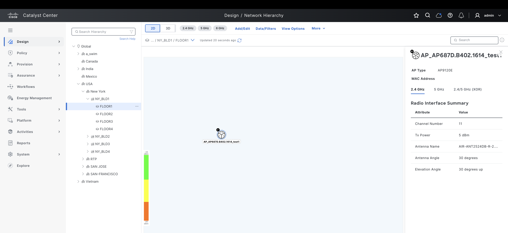
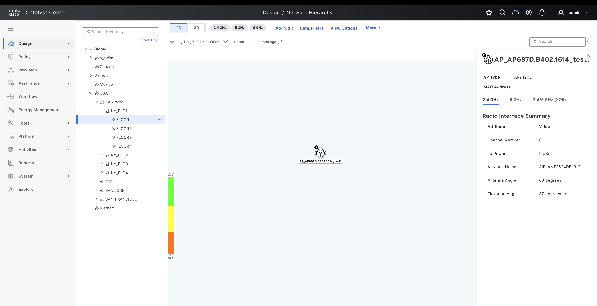
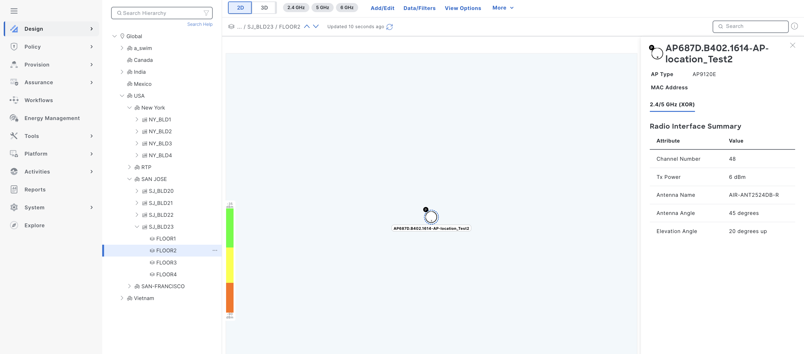
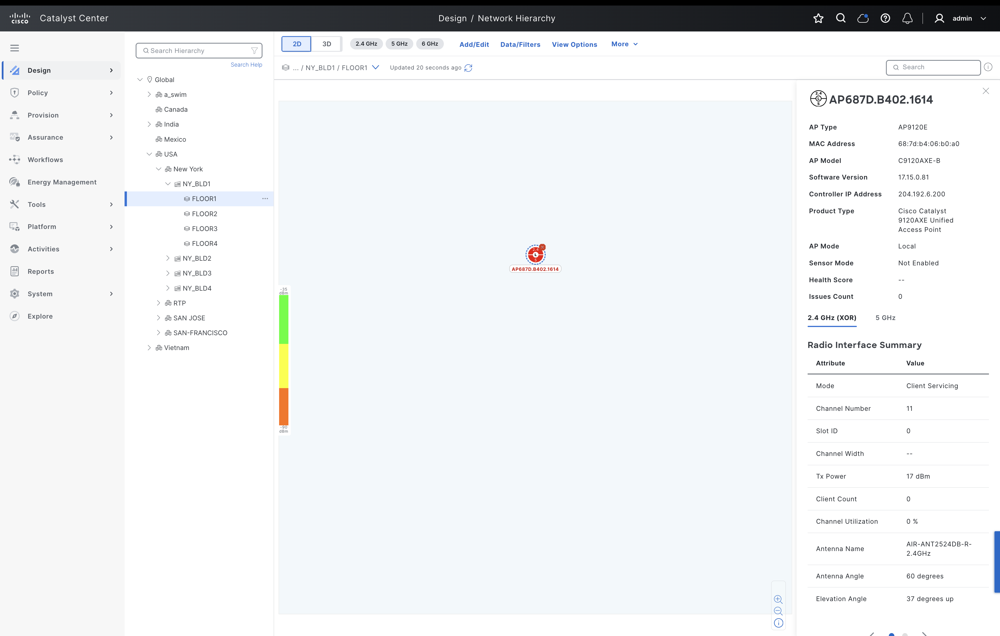
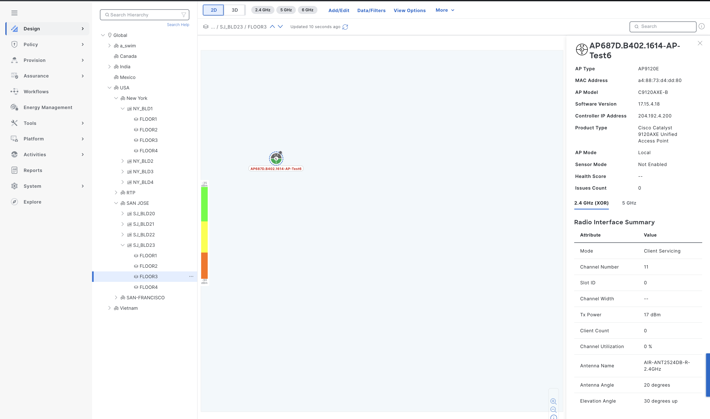
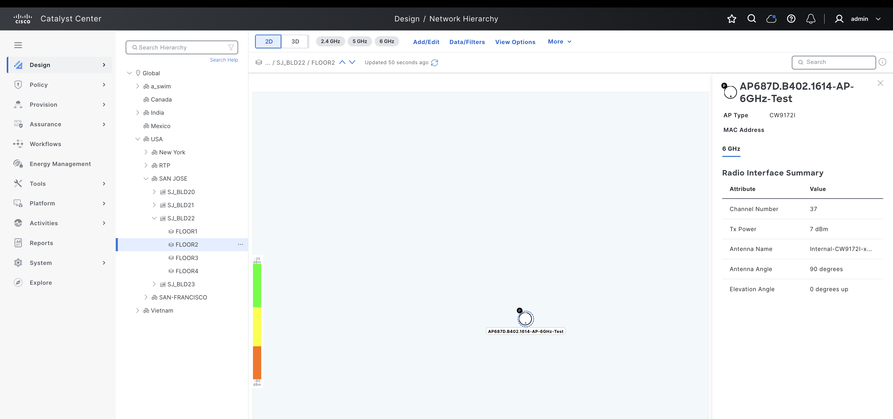
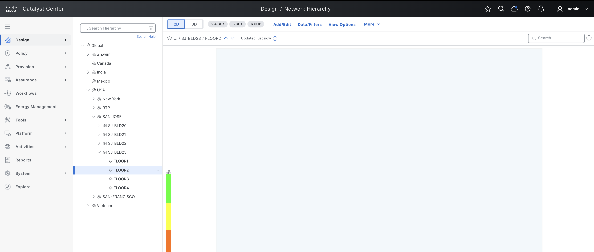
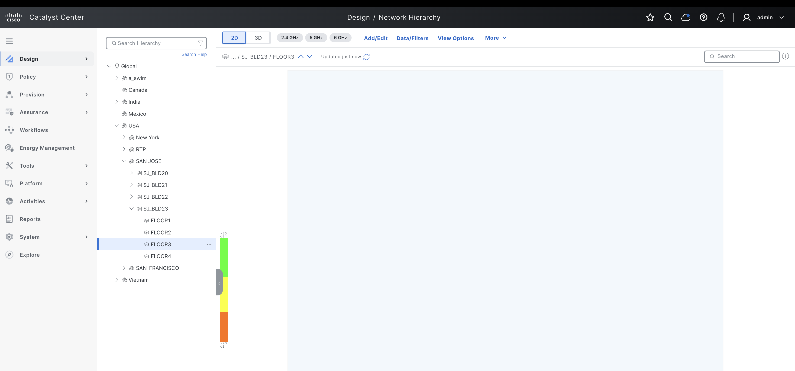

# Cisco Catalyst Center Access Point Location Management Playbooks

## Table of Contents

- [Overview](#overview)
- [Features](#features)
- [Prerequisites](#prerequisites)
- [Workflow Structure](#workflow-structure)
- [Schema Parameters](#schema-parameters)
- [Getting Started](#getting-started)
- [Operations](#operations)
- [Examples](#examples)
- [Troubleshooting](#troubleshooting)
- [Best Practices](#best-practices)

---

## Overview

This module provides a comprehensive toolkit for managing Access Point planned and real positions in *Cisco Catalyst Center*. It supports creating, updating, assigning, and deleting AP positions on floor plans with precise coordinates and radio configurations. 

---

## Features

Key features include:

- **Planned Access Point Management**:  
  - **Create** planned AP positions with X, Y, Z coordinates on floor plans.
  - **Update** existing planned AP positions with new coordinates or radio settings.
  - **Delete** planned AP positions from floor maps.
  - **Assign** real access points to planned positions.

- **Real Access Point Management**:  
  - **Create** real AP positions directly on floor plans.
  - **Update** real AP positions and radio configurations.
  - **Delete** real AP positions from floor maps.

- **Radio Configuration**:  
  - **Configure** radio bands (2.4GHz, 5GHz, 6GHz).
  - **Set** channel assignments and transmit power levels.
  - **Configure** antenna properties including azimuth and elevation.
  - **Support** for dual-band and tri-band configurations.

- **Position Management**:  
  - **Define** precise X, Y coordinates (0.0-100.0, 0.0-100.0 respectively).
  - **Set** height/elevation (Z-axis: 3.0-10.0 meters).
  - **Visualize** AP placement on Catalyst Center floor maps.

- **Bulk Operations**:  
  - **Create** and **delete** multiple AP positions in a single operation.
  - **Manage** up to 100 access points per floor hierarchy.

---

## Prerequisites

### Software Requirements

| Component | Version |
|-----------|---------|
| Ansible | 6.40.0 |
| Python | 3.9+ |
| Cisco Catalyst Center SDK | 2.10.4 |

**Version Added**: `6.40.0`  
*Note*: This version refers to the Cisco Catalyst Center Ansible collection.

### Required Collections

```bash
ansible-galaxy collection install cisco.dnac
ansible-galaxy collection install ansible.utils
pip install dnacentersdk
pip install yamale
```

### Access Requirements

Before managing Access Point locations, ensure the following components exist in *Cisco Catalyst Center*:  
- **Site Hierarchy**: Complete site hierarchy including floor must be created.
- **Floor Plans**: Floor maps must be uploaded to Catalyst Center.
- **Access Points**: Access points must be added to inventory (for real AP operations).
- **AP Models**: Valid AP models must be available in the system.
- **Antenna Models**: Antenna models must be configured in Catalyst Center.


---

## Workflow Structure

```
access_point_location/
├── playbook/
│   ├── access_point_location_playbook.yml          # Main operations (state: merged)
│   └── delete_access_point_location_playbook.yml   # Deletion (state: deleted)
├── vars/
│   ├── access_point_location_inputs.yml            # Complete workflow
│   └── delete_access_point_location_inputs.yml     # Deletion examples
├── schema/
│   ├── access_point_location_schema.yml               #configuration validation
|   └── delete_access_point_location_schema.yml        # Configuration validation
└── ReadMe.md
```

---

## Schema Parameters

#### Schema for Access Point Location Management

The following schema outlines the structure for configuring Access Point locations in *Cisco Catalyst Center*. Parameters are listed with their requirements and descriptions.

| **Parameter**                   | **Type** | **Required** | **Default Value** | **Description**                                                                 |
|---------------------------------|----------|--------------|-------------------|---------------------------------------------------------------------------------|
| `accesspoint_location_details`  | List     | Yes          | `N/A`             | List of floor hierarchies with access point configurations.                     |

##### Access Point Location Configuration (`accesspoint_location_type`)

| **Parameter**          | **Type** | **Required** | **Default Value** | **Description**                                                                 |
|------------------------|----------|--------------|-------------------|---------------------------------------------------------------------------------|
| `floor_site_hierarchy` | String   | Yes          | `N/A`             | Complete floor site hierarchy path (e.g., "Global/USA/Building/Floor1").       |
| `access_points`        | List     | Yes          | `N/A`             | List of access points to configure on this floor. See *Access Point Details*.  |

##### Access Point Details (`access_point_type`)

| **Parameter**  | **Type** | **Required** | **Default Value** | **Description** |
|----------------|----------|--------------|-------------------|------------------------------------------------------------------------------|
| `accesspoint_name`  | String   | Yes          | `N/A`        | Name of the access point.  |
| `action`            | enum     | Conditional  | `N/A`        | Action to perform: "assign_planned_ap" or "manage_real_ap".  |
| `mac_address`       | String   | Conditional  | `N/A`        | MAC address of the real AP. Required when assigning or creating real AP.  |
| `accesspoint_model` | String   | Conditional  | `N/A`        | AP model (e.g.,"AP9120E"). Required when creating planned and real ap positions. |
| `position`          | Dict     | Conditional  | `N/A`        | Position coordinates. See *Position Configuration*. |
| `radios`            | List     | Conditional  | `N/A`        | Radio configurations. See *Radio Configuration*. |

##### Position Configuration (`position_type`)

| **Parameter** | **Type** | **Required** | **Default Value** | **Description**                                                                |
|---------------|----------|-------------|-------------------|---------------------------------------------------------------------------------|
| `x_position`  | Number  | Yes          | `N/A`             | X-axis coordinate on floor plan (range: 0.0-100.0).                             |
| `y_position`  | Number  | Yes          | `N/A`             | Y-axis coordinate on floor plan (range: 0.0-100.0).                             |
| `z_position`  | Number  | Yes          | `N/A`             | Height/elevation in meters (range: 3.0-10.0).                                   |

##### Radio Configuration (`radio_type`)

| **Parameter** | **Type** | **Required** | **Default Value** | **Description**                                                                 |
|---------------|----------|--------------|-------------------|---------------------------------------------------------------------------------|
| `bands`       | List     | Yes          | `N/A`             | Radio bands: "2.4", "5", "6" (can specify multiple for dual/tri-band).         |
| `channel`     | Integer  | Yes          | `N/A`             | Channel number. See channel requirements in module documentation.               |
| `tx_power`    | Integer  | Yes          | `N/A`             | Transmit power in dBm.                                                          |
| `antenna`     | Dict     | Yes          | `N/A`             | Antenna configuration. See *Antenna Configuration*.                             |

##### Antenna Configuration (`antenna_type`)

| **Parameter**   | **Type** | **Required** | **Default Value** | **Description**                                                                 |
|-----------------|----------|--------------|-------------------|---------------------------------------------------------------------------------|
| `antenna_name`  | String   | Yes          | `N/A`             | Model name of the antenna (e.g., "AIR-ANT2524DB-R-2.4GHz").                     |
| `azimuth`       | Integer  | Yes          | `N/A`             | Azimuth angle in degrees (range: 1-360).                                        |
| `elevation`     | Integer  | Yes          | `N/A`             | Elevation angle in degrees (range: -90 to 90).                                  |

---

## Getting Started

Follow these steps to configure and manage Access Point locations in *Cisco Catalyst Center* using Ansible playbooks.

### Step 1: Install and Generate Inventory

**Prepare your environment** by installing Ansible and the required *Cisco Catalyst Center* collection, then generate an inventory file.

1. **Install Ansible**:  
   Refer to the [official Ansible documentation](https://docs.ansible.com/ansible/latest/installation_guide/intro_installation.html) for installation instructions.

2. **Install Cisco Catalyst Center Collection**:  
   ```bash
   ansible-galaxy collection install cisco.dnac
   ```

3. **Generate Inventory**:  
   Create an Ansible inventory file (e.g., `inventory.yml`) with your *Cisco Catalyst Center* appliance details. Define variables such as `catalyst_center_host`, `catalyst_center_username`, and `catalyst_center_password`.  
   > **Note**: For security, consider using *Ansible Vault* to encrypt sensitive data like passwords.  
   ```yaml
   catalyst_center_hosts:
       hosts:
           your_catalyst_center_instance_name:
               catalyst_center_host: xx.xx.xx.xx
               catalyst_center_password: XXXXXXXX
               catalyst_center_port: 443
               catalyst_center_timeout: 60
               catalyst_center_username: admin
               catalyst_center_verify: false  # Enable for production with valid certificates
               catalyst_center_version: 3.1.3.0  # Minimum version required
               catalyst_center_debug: true
               catalyst_center_log_level: INFO
               catalyst_center_log: true
   ```

---

### Step 2: Define Inputs and Validate

Define input variables and validate your configuration to ensure successful AP location management.

#### Define Input Variables
Create a variable file (e.g., `vars/access_point_location_inputs.yml`) to specify the desired state of your Access Point locations for creation, update, or deletion.

---

#### Validate Configuration
> **Important**: Validate your input schema before executing the playbook to ensure all parameters are correctly formatted.  
Run the following command to validate your input file against the schema:  
```bash
./tools/validate.sh -s ./workflows/access_point_location/schema/access_point_location_schema.yml -d ./workflows/access_point_location/vars/access_point_location_inputs.yml
```

---

### Step 3: Deploy and Verify

**Deploy** your configuration to *Cisco Catalyst Center* and **verify** the changes.

1. **Deploy Configuration**:  
   Run the playbook to apply the Access Point location configuration. Ensure the input file is validated before execution. Specify the input file path using the `--e` variable (`VARS_FILE_PATH`).

   ### a. Create or Update AP Locations (state = 'merged')
   ```bash
   ansible-playbook -i inventory/demo_lab/hosts.yaml \
   workflows/access_point_location/playbook/access_point_location_playbook.yml \
   --e VARS_FILE_PATH=./../vars/access_point_location_inputs.yml \
   -vvv
   ```

   ### b. Delete AP Locations (state = 'deleted')
   ```bash
   ansible-playbook -i inventory/demo_lab/hosts.yaml \
   workflows/access_point_location/playbook/delete_access_point_location_playbook.yml \
   --e VARS_FILE_PATH=./../vars/delete_access_point_location_inputs.yml \
   -vvv
   ```

   > **Note**: If an error occurs (e.g., invalid input or API failure), the playbook will halt and display details. Check the execution logs for troubleshooting.

2. **Verify Deployment**:  
   After execution, verify the configuration in the *Cisco Catalyst Center* UI:
   - Navigate to **Design** > **Network Hierarchy** > Select your floor.
   - Click on **Maps** to view the floor plan.
   - Verify that access points are positioned correctly on the map.
   - Check AP details including position coordinates and radio configurations.
   - For planned positions, verify they appear with planned icon.
   - For real/assigned positions, verify they show actual AP information.
   
   If `catalyst_center_debug` is enabled, review the logs for detailed operation information.

---

## Operations

### Create Operations (state: merged)

#### Example Input Files

##### 1. **Create Planned Access Point Positions**  
*Example*: Create planned AP positions on a floor plan with radio configurations.

```yaml
catalyst_center_version: 3.1.3.0
accesspoint_location_details:
  - floor_site_hierarchy: "Global/USA/New York/NY_BLD1/FLOOR1"
    access_points:
      - accesspoint_name: AP_AP687D.B402.1614_test1
        accesspoint_model: AP9120E
        position:
          x_position: 30  
          y_position: 30  
          z_position: 8  
        radios:  
          - bands: ["2.4"]  
            channel: 11
            tx_power: 5  
            antenna:
              antenna_name: AIR-ANT2524DB-R-2.4GHz
              azimuth: 30  
              elevation: 30  
          - bands: ["5"]  
            channel: 44
            tx_power: 6  
            antenna:
              antenna_name: AIR-ANT2524DB-R-5GHz
              azimuth: 35  
              elevation: 30 
          - bands: ["2.4", "5"]  
            channel: 48
            tx_power: 6  
            antenna:
              antenna_name: AIR-ANT2524DB-R
              azimuth: 35
              elevation: 30

```


##### 2. **Update Planned Access Point Position**  
*Example*: Modify existing planned AP position and radio settings.  
> **Note**: All configurations should be provided. Omitted settings will remain unchanged.

```yaml
catalyst_center_version: 3.1.3.0
accesspoint_location_details:
  - floor_site_hierarchy: "Global/USA/New York/NY_BLD1/FLOOR1"
    access_points:
      - accesspoint_name: AP_AP687D.B402.1614_test1
        accesspoint_model: AP9120E
        position:
          x_position: 50  
          y_position: 30  
          z_position: 3.5  
        radios:  
          - bands: ["2.4"]  
            channel: 6
            tx_power: 9 
            antenna:
              antenna_name: AIR-ANT2524DB-R-2.4GHz
              azimuth: 60  
              elevation: 37
          - bands: ["5"]  
            channel: 48
            tx_power: 6  
            antenna:
              antenna_name: AIR-ANT2524DB-R-5GHz
              azimuth: 77  
              elevation: 30 
          - bands: ["2.4", "5"]  
            channel: 48
            tx_power: 6  
            antenna:
              antenna_name: AIR-ANT2524DB-R
              azimuth: 35
              elevation: 30

```


##### 3. **Create Planned Position with Dual-Band Radio**  
*Example*: Configure an AP with a single dual-band radio.

```yaml
catalyst_center_version: 3.1.3.0
accesspoint_location_details:
  - floor_site_hierarchy: "Global/USA/SAN JOSE/SJ_BLD23/FLOOR2"
    access_points:
      - accesspoint_name: "AP687D.B402.1614-AP-location_Test2"
        accesspoint_model: "AP9120E"
        position:
          x_position: 50
          y_position: 40
          z_position: 9.0
        radios:
          - bands: ["2.4", "5"]
            channel: 48
            tx_power: 6
            antenna:
              antenna_name: "AIR-ANT2524DB-R"
              azimuth: 45
              elevation: 20
```



##### 3. **Assign Planned Access Point to Real Access Point**  
*Example*: Map a planned position to an actual physical AP.  
> **Note**: The planned position must already exist before assignment.
 Action field is only required when assigning,updating or deleting real access point to/from an existing planned position.

```yaml
catalyst_center_version: 3.1.3.0
accesspoint_location_details:
  - floor_site_hierarchy: "Global/USA/New York/NY_BLD1/FLOOR1"
    access_points:
      - accesspoint_name: "AP_AP687D.B402.1614_test1"
        action: "assign_planned_ap"
        mac_address: "68:7d:b4:06:b0:a0"
```


##### 4. **Create Real AP Position**  
*Example*: Create a real AP position directly (without planned position).

```yaml
catalyst_center_version: 3.1.3.0
accesspoint_location_details:
  - floor_site_hierarchy: "Global/USA/SAN JOSE/SJ_BLD23/FLOOR3"
    access_points:
      - accesspoint_name: "AP687D.B402.1614-AP-Test6"
        mac_address: "a4:88:73:d4:dd:80"
        accesspoint_model: "AP9120E"
        position:
          x_position: 20.8
          y_position: 30
          z_position: 8.0
        radios:
          - bands: ["2.4"]
            channel: 11
            tx_power: 5
            antenna:
              antenna_name: "AIR-ANT2524DB-R-2.4GHz"
              azimuth: 20
              elevation: 30
          - bands: ["5"]
            channel: 44
            tx_power: 6
            antenna:
              antenna_name: "AIR-ANT2524DB-R-5GHz"
              azimuth: 20
              elevation: 30
```



##### 6. **Update Real AP Position (Partial Update)**  
*Example*: Update only position and antenna settings for a real AP.
> **Note**: Action field is only required when assigning,updating or deleting real access point to/from an existing planned position.

```yaml
catalyst_center_version: 3.1.3.0
accesspoint_location_details:
  - floor_site_hierarchy: "Global/USA/SAN JOSE/SJ_BLD23/FLOOR3"
    access_points:
      - accesspoint_name: "AP687D.B402.1614-AP-Test6"
        mac_address: "a4:88:73:d4:dd:80"
        accesspoint_model: "AP9120E"
        action: manage_real_ap # required for updating real ap positions
        position:
          x_position: 60
          y_position: 33.9
          z_position: 4
        radios:
          - bands: ["2.4"]
            channel: 1
            tx_power: 6
            antenna:
              antenna_name: "AIR-ANT2524DB-R-2.4GHz"
              azimuth: 77
              elevation: 45
          - bands: ["5"]
            channel: 44
            tx_power: 6
            antenna:
              antenna_name: "AIR-ANT2524DB-R-5GHz"
              azimuth: 20
              elevation: 30
```


##### 7. **Create Access Point with 6GHz Radio**  
*Example*: Configure an AP with 6GHz radio support.

```yaml
catalyst_center_version: 3.1.3.0
accesspoint_location_details:
  - floor_site_hierarchy: "Global/USA/SAN JOSE/SJ_BLD22/FLOOR2"
    access_points:
      - accesspoint_name: "AP687D.B402.1614-AP-6GHz-Test"
        accesspoint_model: "CW9172I"
        position:
          x_position: 60
          y_position: 50
          z_position: 9.5
        radios:
          - bands: ["6"]
            channel: 37
            tx_power: 7
            antenna:
              antenna_name: "Internal-CW9172I-x-Single-6GHz"
              azimuth: 90
              elevation: 0
```



**Validate**
Validate Configuration: To ensure a successful execution of the playbooks with your specified inputs, follow these steps:
Input Validation: Before executing the playbook, it is essential to validate the input schema. This step ensures that all required parameters are included and correctly formatted. Run the following command ./tools/validate.sh -s to perform the validation providing the schema path -d and the input path.


```bash
# Validate
./tools/validate.sh -s ./workflows/access_point_location/schema/access_point_location_schema.yml -d ./workflows/access_point_location/vars/access_point_location_inputs.yml
```

Return result validate:

```bash
./workflows/access_point_location/schema/access_point_location_schema.yml
./workflows/access_point_location/vars/access_point_location_inputs.yml
yamale   -s ./workflows/access_point_location/schema/access_point_location_schema.yml  ./workflows/access_point_location/vars/access_point_location_inputs.yml
Validating ./workflows/access_point_location/vars/access_point_location_inputs.yml...
Validation success! 👍
```

```bash
# Execute
ansible-playbook -i inventory/demo_lab/hosts.yaml \
  workflows/access_point_location/playbook/access_point_location_playbook.yml \
  --extra-vars VARS_FILE_PATH=../vars/access_point_location_inputs.yml
```

---
## Example Output

1.Create Planned Access Point Positions

Terminal Return 

```code
 response:
    accesspoint_assignment: []
    accesspoint_creation:
    - The access point positions for [['AP_AP687D.B402.1614_test1']] have been successfully created and associated with the site Global/USA/New York/NY_BLD1/FLOOR1
    accesspoint_deletion: []
    accesspoint_updation: []
    already_processed: []
    unprocessed: []
  status: success
```
2.Update Planned Access Point Position

Terminal Return 

```code

 response:
    accesspoint_assignment: []
    accesspoint_creation: []
    accesspoint_deletion: []
    accesspoint_updation:
    - The access point positions for [['AP_AP687D.B402.1614_test1']] have been successfully updated and associated with the site Global/USA/New York/NY_BLD1/FLOOR1
    already_processed: []
    unprocessed: []
  status: success

```

3.Create Planned Position with Dual-Band Radi0

Terminal Return 

```code
response:
    accesspoint_assignment: []
    accesspoint_creation:
    - The access point positions for [['AP687D.B402.1614-AP-location_Test2']] have been successfully created and associated with the site Global/USA/SAN JOSE/SJ_BLD23/FLOOR2
    accesspoint_deletion: []
    accesspoint_updation: []
    already_processed: []
    unprocessed: []
  status: success
```

4.Assign Planned Access Point to Real Access Point

Terminal Return 

```code
response:
    accesspoint_assignment:
    - The access point positions for [['AP_AP687D.B402.1614_test1']] have been successfully assigned and associated with the site Global/USA/New York/NY_BLD1/FLOOR1
    accesspoint_creation: []
    accesspoint_deletion: []
    accesspoint_updation: []
    already_processed: []
    unprocessed: []
  status: success
```

5.Create Real AP Position

Terminal Return

```code
response:
    accesspoint_assignment: []
    accesspoint_creation:
    - The access point positions for [['AP687D.B402.1614-AP-Test6']] have been successfully created and associated with the site Global/USA/SAN JOSE/SJ_BLD23/FLOOR3
    accesspoint_deletion: []
    accesspoint_updation: []
    already_processed: []
    unprocessed: []
  status: success
```

6.Update Real AP Position

Terminal Return 

```code
response:
    accesspoint_assignment: []
    accesspoint_creation: []
    accesspoint_deletion: []
    accesspoint_updation:
    - The access point positions for [['AP687D.B402.1614-AP-Test6']] have been successfully updated and associated with the site Global/USA/SAN JOSE/SJ_BLD23/FLOOR3
    already_processed: []
    unprocessed: []
  status: success
```

7.Create Access Point with 6GHz Radio

Terminal Return

```code
response:
    accesspoint_assignment: []
    accesspoint_creation:
    - The access point positions for [['AP687D.B402.1614-AP-6GHz-Test']] have been successfully created and associated with the site Global/USA/SAN JOSE/SJ_BLD22/FLOOR2
    accesspoint_deletion: []
    accesspoint_updation: []
    already_processed: []
    unprocessed: []
  status: success
```

### Delete Operations (state: deleted)

##### 1. **Delete Planned Access Point Position**  
*Example*: Remove planned AP position from floor map.  
> **Warning**: Deleting planned positions will remove them from the floor plan visualization.

```bash
# Validate
./tools/validate.sh -s ./workflows/access_point_location/schema/delete_access_point_location_schema.yml -d ./workflows/access_point_location/vars/delete_access_point_location_inputs.yml
```

Return result validate:

```bash
./workflows/access_point_location/schema/delete_access_point_location_schema.yml
./workflows/access_point_location/vars/delete_access_point_location_inputs.yml
yamale   -s ./workflows/access_point_location/schema/delete_access_point_location_schema.yml  ./workflows/access_point_location/vars/delete_access_point_location_inputs.yml
Validating ./workflows/access_point_location/vars/delete_access_point_location_inputs.yml...
Validation success! 👍
```

```bash
# Execute
ansible-playbook -i inventory/demo_lab/hosts.yaml \
  workflows/access_point_location/playbook/delete_access_point_location_playbook.yml \
  --extra-vars VARS_FILE_PATH=../vars/delete_access_point_location_inputs.yml
```


```yaml
catalyst_center_version: 3.1.3.0
accesspoint_location_details:
  - floor_site_hierarchy: "Global/USA/SAN JOSE/SJ_BLD23/FLOOR2"
    access_points:
      - accesspoint_name: "AP687D.B402.1614-AP-location_Test2"
```


##### 2. **Delete real AP position from Planned Position**  
*Example*: Remove real AP from its assigned planned position.
> **Note**: Action field is only required when assigning,updating or deleting real access point to/from an existing planned position.


```yaml
catalyst_center_version: 3.1.3.0
accesspoint_location_details:
  - floor_site_hierarchy: "Global/USA/SAN JOSE/SJ_BLD23/FLOOR3"
    access_points:
      - accesspoint_name: "AP687D.B402.1614-AP-Test6"
        action: "manage_real_ap"
```

---
## Example Output
1.Delete Planned AP positions

```code
 response:
    accesspoint_assignment: []
    accesspoint_creation: []
    accesspoint_deletion:
    - The access point positions for AP687D.B402.1614-AP-location_Test2 have been successfully deleted from the site Global/USA/SAN JOSE/SJ_BLD23/FLOOR2
    accesspoint_updation: []
    already_processed: []
    unprocessed: []
  status: success
  ```

2.Delete real AP position from Planned Position
```code
response:
    accesspoint_assignment: []
    accesspoint_creation: []
    accesspoint_deletion:
    - The access point positions for AP687D.B402.1614-AP-Test6 have been successfully deleted from the site Global/USA/SAN JOSE/SJ_BLD23/FLOOR3
    accesspoint_updation: []
    already_processed: []
    unprocessed: []
  status: success
  ```
---

## Channel Requirements

### 2.4 GHz Band
Valid channels: **1, 6, 11**

### 5 GHz Band
Valid channels:  
**36, 40, 44, 48, 52, 56, 60, 64, 100, 104, 108, 112, 116, 120, 124, 128, 132, 136, 140, 144, 149, 153, 157, 161, 165, 169, 173**

### 6 GHz Band
Valid channels:  
**1, 5, 9, 13, 17, 21, 25, 29, 33, 37, 41, 45, 49, 53, 57, 61, 65, 69, 73, 77, 81, 85, 89, 93, 97, 101, 105, 109, 113, 117, 121, 125, 129, 133, 137, 141, 145, 149, 153, 157, 161, 165, 169, 173, 177, 181, 185, 189, 193, 197, 201, 205, 209, 213, 217, 221, 225, 229, 233**

> **Note**: For dual-band radios, use the higher band's channel number.

---

## References

**Environment Details**  
The following environment was used for testing:  

| **Component**         | **Version** |
|-----------------------|-------------|
| Python                | `3.10.10`   |
| Cisco Catalyst Center | `3.1.5.0`   |
| Ansible               | `2.17.13`   |
| cisco.dnac Collection | `6.40.0`    |
| dnacentersdk          | `2.10.4`    |

For detailed documentation, refer to:  
- [Ansible Galaxy: Cisco Catalyst Center Collection](https://galaxy.ansible.com/ui/repo/published/cisco/dnac/content/module/accesspoint_location_workflow_manager/)  
- [Cisco Catalyst Center Documentation](https://www.cisco.com/c/en/us/support/cloud-systems-management/dna-center/series.html)
- [Access Point Location Workflow Manager Module Documentation](https://github.com/cisco-en-programmability/catalyst-center-ansible-dev/blob/main/plugins/modules/accesspoint_location_workflow_manager.py)


