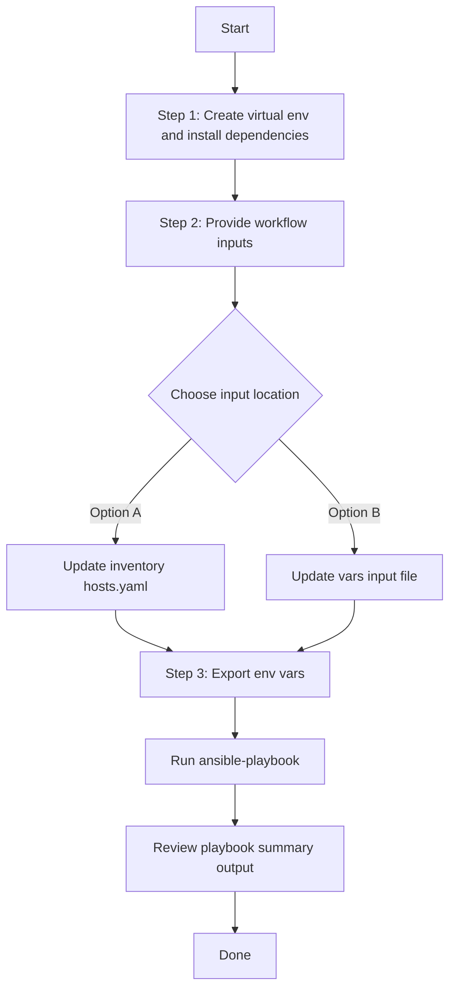

# Access Point Config Generator

## Table of Contents

- [User Flow (3 Steps)](#user-flow-3-steps)
- [Overview](#overview)
- [Features](#features)
- [Prerequisites](#prerequisites)
- [Workflow Structure](#workflow-structure)
- [Schema Parameters](#schema-parameters)
- [Getting Started](#getting-started)
- [Operations](#operations)
- [Examples](#examples)
- [Notes](#notes)

## Overview

The Access Point config generator is a **brownfield discovery** workflow that connects to Cisco Catalyst Center, collects existing access point configurations (provisioning and radio settings), and generates YAML output files compatible with the `accesspoint_workflow_manager` module. This enables backup, migration, and programmatic modification of AP configurations without manual playbook authoring.

---

## Features

- **Configuration Generation**: Generate YAML configurations compatible with `accesspoint_workflow_manager`.
  - Extract configured and provisioned AP settings from Catalyst Center.
  - Convert API responses into workflow-manager-ready YAML.
  - Reuse generated files for backup and migration.
- **Global Filtering**: Filter by site hierarchies, provisioned AP hostnames, AP config hostnames, combined provision/config hostnames, and MAC addresses.
- **Priority-based Selection**: Module applies the highest-priority filter when multiple are provided. Only one filter type is processed per execution.
- **Flexible Output**: Supports custom `file_path` and `file_mode` (`overwrite` / `append`). When no path is specified, an auto-generated timestamped filename is used.
- **Brownfield Discovery**: Omit `config` (or use the workflow convenience flag `generate_all_configurations: true`) to generate all AP configurations via internal auto-discovery mode.

---

## Prerequisites

### Software Requirements

| Component | Version |
|-----------|---------|
| Ansible | 2.13+ |
| cisco.catalystcenter collection | 2.6.0 |
| Python | 3.9+ |
| Cisco Catalyst Center | 2.3.5.3+ |
| catalystcentersdk | 2.10.10+ |

### Required Collections

```bash
ansible-galaxy collection install cisco.catalystcenter
ansible-galaxy collection install ansible.utils
pip install catalystcentersdk
pip install yamale
```

### Access Requirements

- Catalyst Center credentials with AP and site API access
- Network connectivity to Catalyst Center
- Existing AP data for targeted export use cases

---

## Workflow Structure

```
accesspoint_config_generator/
├── playbook/
│   └── accesspoint_config_generator.yml             # Main operations
├── vars/
│   └── accesspoint_config_inputs.yml                # Input examples
├── schema/
│   └── accesspoint_config_schema.yml                # Input validation
└── README.md
```

---

## Schema Parameters

### Workflow-Level Parameters

| Parameter | Type | Required | Default | Description |
|-----------|------|----------|---------|-------------|
| `generate_all_configurations` | boolean | No | `false` | Workflow convenience flag. When `true`, the playbook omits the module `config` parameter, triggering auto-discovery mode that generates all AP configurations. This is **not** a module parameter — it controls playbook behavior only. |
| `file_path` | string | No | auto-generated | Output file path for generated YAML. Supports absolute and relative paths. When omitted, the file is saved in the current working directory with the default name `accesspoint_playbook_config_<YYYY-MM-DD_HH-MM-SS>.yml`. |
| `file_mode` | string | No | `overwrite` | File write mode. Choices: `overwrite` (replace file contents) or `append` (add to existing file). Only relevant when `file_path` is provided. |
| `global_filters` | dict | No | omitted | Workflow convenience wrapper that maps to the module's `config.global_filters` parameter. When omitted (and `generate_all_configurations` is not set), the module enters auto-discovery mode. |

### Global Filters

When `global_filters` is provided, at least one filter type must be specified. The module applies a **priority hierarchy** — only the highest-priority filter with valid data is processed. Lower-priority filters are ignored.

| Priority | Filter | Type | Description |
|----------|--------|------|-------------|
| 1 (Highest) | `site_list` | list of str | List of floor site hierarchies to extract AP configurations from. Supports special value `"all"` to include all APs. Example: `["Global/USA/SAN JOSE/SJ_BLD20/FLOOR1"]` |
| 2 | `provision_hostname_list` | list of str | List of AP hostnames with provisioned configurations to the floor. Supports special value `"all"`. Example: `["test_ap_1", "test_ap_2"]` |
| 3 | `accesspoint_config_list` | list of str | List of AP hostnames to extract configurations from. Supports special value `"all"`. Example: `["Test_ap_1", "Test_ap_2"]` |
| 4 | `accesspoint_provision_config_list` | list of str | List of AP hostnames assigned to floors with both provisioning and configuration data. Example: `["Test_ap_1", "Test_ap_2"]` |
| 5 (Lowest) | `accesspoint_provision_config_mac_list` | list of str | List of AP MAC addresses assigned to floors with provisioning and configuration data. Example: `["a4:88:73:d4:dd:80"]` |

> **Filter Priority Rule**: If multiple filters are provided simultaneously, only the one with the highest priority (lowest number) is processed. For example, if both `site_list` and `provision_hostname_list` are provided, only `site_list` is used.

---

## Getting Started

## Workflow Steps
## User Flow (3 Steps)



### Installation and Run (Aligned)

1. Create and activate a Python virtual environment, then install dependencies.

```bash
python3 -m venv .venv
source .venv/bin/activate
pip install -r requirements.txt
ansible-galaxy collection install cisco.catalystcenter --force
```

2. Provide workflow inputs in either inventory (`inventory/demo_lab/hosts.yaml`) or the workflow `vars/` file.

3. Export Catalyst Center environment variables and run the playbook.

```bash
export HOSTIP=<catalyst-center-ip-or-fqdn>
export CATALYST_CENTER_USERNAME=<username>
export CATALYST_CENTER_PASSWORD='<password>'
ansible-playbook -i ./inventory/demo_lab/hosts.yaml ./workflows/accesspoint_config_generator/playbook/accesspoint_config_generator.yml -vvvv
```


## Operations

### Generate Operations (state: gathered)

1. **Generate all AP configurations**
   - Set `generate_all_configurations: true`, or omit `global_filters` entirely.
   - The module enters auto-discovery mode and collects all AP provisioning and configuration data.

2. **Generate by site list**
   - Use `global_filters.site_list` with floor-level site hierarchies.
   - Retrieves APs provisioned to the specified floor sites.

3. **Generate by provisioned AP hostnames**
   - Use `global_filters.provision_hostname_list` with AP hostnames that have provisioned configurations.

4. **Generate by AP configuration hostnames**
   - Use `global_filters.accesspoint_config_list` with AP hostnames to extract their configuration details.

5. **Generate by combined provision and configuration hostnames**
   - Use `global_filters.accesspoint_provision_config_list` for APs assigned to floors with both provisioning and configuration data.

6. **Generate by MAC address**
   - Use `global_filters.accesspoint_provision_config_mac_list` with AP MAC addresses.

---

## Examples

### Example 1: Generate all AP configurations (convenience flag)

```yaml
accesspoint_config:
  - generate_all_configurations: true
    file_path: "/tmp/accesspoint_complete_config.yml"
```

### Example 2: Generate all AP configurations (omit global_filters)

```yaml
accesspoint_config:
  - file_path: "/tmp/accesspoint_all_config.yml"
    file_mode: "overwrite"
```

### Example 3: Filter by site list

```yaml
accesspoint_config:
  - file_path: "/tmp/accesspoint_by_site.yml"
    global_filters:
      site_list:
        - "Global/USA/SAN JOSE/SJ_BLD20/FLOOR1"
        - "Global/USA/SAN JOSE/SJ_BLD20/FLOOR2"
```

### Example 4: Filter by provisioned AP hostnames

```yaml
accesspoint_config:
  - file_path: "/tmp/accesspoint_by_provision_hostname.yml"
    global_filters:
      provision_hostname_list:
        - "test_ap_1"
        - "test_ap_2"
```

### Example 5: Filter by AP configuration hostnames

```yaml
accesspoint_config:
  - file_path: "/tmp/accesspoint_by_config_hostname.yml"
    global_filters:
      accesspoint_config_list:
        - "Test_ap_1"
        - "Test_ap_2"
```

### Example 6: Filter by AP MAC addresses

```yaml
accesspoint_config:
  - file_path: "/tmp/accesspoint_by_mac.yml"
    global_filters:
      accesspoint_provision_config_mac_list:
        - "a4:88:73:d4:dd:80"
        - "a4:88:73:d4:dd:81"
```

### Example 7: Append mode with site filter

```yaml
accesspoint_config:
  - file_path: "/tmp/accesspoint_combined.yml"
    file_mode: "append"
    global_filters:
      site_list:
        - "Global/USA/SAN JOSE/SJ_BLD20/FLOOR1"
```

---

## Notes

- **Minimum Catalyst Center version**: The underlying module `accesspoint_playbook_config_generator` requires Cisco Catalyst Center **2.3.5.3 or later**.
- **Workflow vs. Module input distinction**:
  - The workflow input supports a `generate_all_configurations` convenience flag and a top-level `global_filters` key.
  - The module itself does **not** have a `generate_all_configurations` parameter. When this flag is `true` (or when `global_filters` is omitted/empty), the playbook omits the module's `config` parameter entirely, which triggers the module's internal auto-discovery mode.
  - When `global_filters` is provided in the workflow input, the playbook passes it as `config.global_filters` to the module.
- **Output compatibility**: Generated YAML files are directly compatible with the `accesspoint_workflow_manager` module for AP provisioning and configuration operations.
- **Filter values are case-sensitive** and must match exactly as registered in Catalyst Center.
- **Special value `"all"`**: The filters `site_list`, `provision_hostname_list`, and `accesspoint_config_list` support the special string value `"all"` to include all matching access points.
- **Filter priority**: When multiple filter types are provided simultaneously, only the highest-priority filter is processed. See the [Global Filters](#global-filters) table for the priority order.
