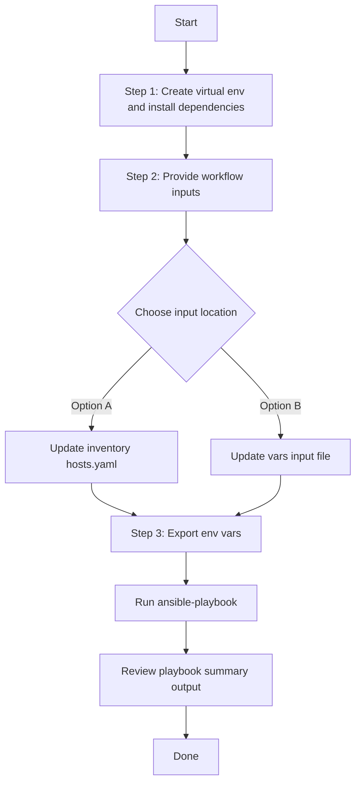

# Access Point Location Config Generator

## Table of Contents

- [User Flow (3 Steps)](#user-flow-3-steps)

- [Overview](#overview)
- [Features](#features)
- [Prerequisites](#prerequisites)
- [Workflow Structure](#workflow-structure)
- [Schema Parameters](#schema-parameters)
- [Getting Started](#getting-started)
- [Operations](#operations)
- [Examples](#examples)---

## Overview

The Access Point Location config generator automates YAML playbook generation for planned and real access point locations in Cisco Catalyst Center. It generates output compatible with `accesspoint_location_workflow_manager`.

---

## Features

- **Configuration Generation**: Generate YAML configurations compatible with `accesspoint_location_workflow_manager`.
  - Extract floor-level planned and real access point location data.
  - Convert API responses into workflow-manager-ready YAML.
  - Reuse generated files for backup and migration.
- **Global Filtering**: Filter by site hierarchy, planned AP names, real AP names, AP model, or AP MAC address.
- **Priority-based Selection**: Module applies highest-priority filter when multiple are provided.
- **Flexible Output**: Supports custom `file_path` and `file_mode` (`overwrite` / `append`).
- **Brownfield Discovery**: Omit `config` (or use workflow convenience flag) to generate all access point location data.

---

## Prerequisites

### Software Requirements

| Component | Version |
|-----------|---------|
| Ansible | 2.13+ |
| cisco.dnac collection | 6.45.0+ |
| Python | 3.9+ |
| Cisco Catalyst Center | 3.1.3.0+ |
| dnacentersdk | 2.10.10+ |

### Required Collections

```bash
ansible-galaxy collection install cisco.dnac
ansible-galaxy collection install ansible.utils
pip install dnacentersdk
pip install yamale
```

### Access Requirements

- Catalyst Center credentials with site and AP position API access
- Network connectivity to Catalyst Center
- Existing AP location data for targeted export use cases

---

## Workflow Structure

```
accesspoint_location_config_generator/
├── playbook/
│   └── accesspoint_location_config_generator.yml    # Main operations
├── vars/
│   └── accesspoint_location_config_inputs.yml       # Input examples
├── schema/
│   └── accesspoint_location_config_schema.yml       # Input validation
└── README.md
```

---

## Schema Parameters

### Basic Configuration

| Parameter | Type | Required | Default | Description |
|-----------|------|----------|---------|-------------|
| `generate_all_configurations` | boolean | No | false | Workflow convenience flag. When true, playbook omits module `config` |
| `file_path` | string | No | auto-generated | Output file path for generated YAML |
| `file_mode` | string | No | `overwrite` | File write mode: `overwrite` or `append` |
| `global_filters` | dict | No | omitted | Global filters passed to module `config.global_filters` |

### Global Filters

- `site_list`
- `planned_accesspoint_list`
- `real_accesspoint_list`
- `accesspoint_model_list`
- `mac_address_list`

Module filter priority:
- `site_list` > `planned_accesspoint_list` > `real_accesspoint_list` > `accesspoint_model_list` > `mac_address_list`

---

## Getting Started

## Workflow Steps
## User Flow (3 Steps)



### Installation and Run (Aligned)

1. Create and activate a Python virtual environment, then install dependencies.

```bash
python3 -m venv .venv
source .venv/bin/activate
pip install -r requirements.txt
ansible-galaxy collection install cisco.dnac --force
```

2. Provide workflow inputs in either inventory (`inventory/demo_lab/hosts.yaml`) or the workflow `vars/` file.

3. Export Catalyst Center environment variables and run the playbook.

```bash
export HOSTIP=<catalyst-center-ip-or-fqdn>
export CATALYST_CENTER_USERNAME=<username>
export CATALYST_CENTER_PASSWORD='<password>'
ansible-playbook -i ./inventory/demo_lab/hosts.yaml ./workflows/accesspoint_location_config_generator/playbook/accesspoint_location_config_generator.yml -vvvv
```


## Operations

### Generate Operations (state: gathered)

1. **Generate all AP location configurations**
- Set `generate_all_configurations: true`.

2. **Generate by site list**
- Use `global_filters.site_list`.

3. **Generate by planned or real AP list**
- Use `global_filters.planned_accesspoint_list` or `global_filters.real_accesspoint_list`.

4. **Generate by AP model or MAC list**
- Use `global_filters.accesspoint_model_list` or `global_filters.mac_address_list`.

---

## Examples

### Example 1: Generate all AP location configurations

```yaml
accesspoint_location_config:
  - generate_all_configurations: true
    file_path: "/tmp/accesspoint_location_complete_config.yml"
```

### Example 2: Filter by floor site list

```yaml
accesspoint_location_config:
  - file_path: "/tmp/accesspoint_location_by_site.yml"
    global_filters:
      site_list:
        - "Global/USA/SAN JOSE/SJ_BLD20/FLOOR1"
```

### Example 3: Filter by real AP names

```yaml
accesspoint_location_config:
  - file_path: "/tmp/accesspoint_location_by_real_ap.yml"
    global_filters:
      real_accesspoint_list: ["Test_ap"]
```

---

## Notes

- `accesspoint_location_playbook_config_generator` expects `config` with `global_filters` when filtering is used.
- This workflow omits `config` when filters are absent, triggering full generation mode.
