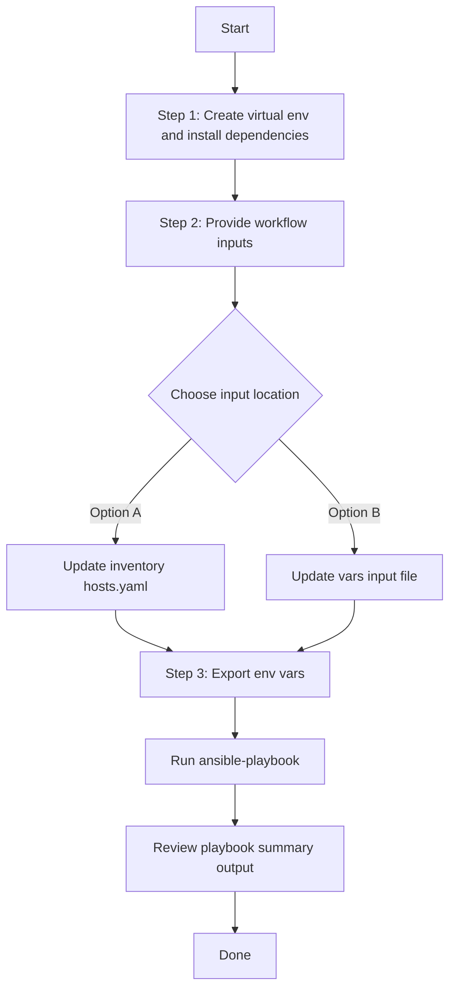

# Access Point Location Config Generator

## Table of Contents

- [User Flow (3 Steps)](#user-flow-3-steps)
- [Overview](#overview)
- [Features](#features)
- [Prerequisites](#prerequisites)
- [Workflow Structure](#workflow-structure)
- [Schema Parameters](#schema-parameters)
- [Getting Started](#getting-started)
- [Operations](#operations)
- [Examples](#examples)

## Overview

The Access Point Location config generator automates YAML configuration generation for planned and real access point locations in Cisco Catalyst Center. It generates output compatible with `accesspoint_location_workflow_manager`.

---

## Features

- **Configuration Generation**: Generate YAML configurations compatible with `accesspoint_location_workflow_manager`.
  - Extract floor-level planned and real access point location data.
  - Convert API responses into workflow-manager-ready YAML.
  - Reuse generated files for backup and migration.
- **Global Filtering**: Filter by site hierarchy, planned AP names, real AP names, AP model, or AP MAC address.
- **Priority-based Selection**: Module applies highest-priority filter when multiple are provided.
- **Flexible Output**: Supports custom `file_path` and `file_mode` (`overwrite` / `append`).
- **Brownfield Discovery**: Omit `config` to generate all access point location data.

---

## Prerequisites

### Software Requirements

| Component | Version |
|-----------|---------|
| Ansible | 2.13+ |
| cisco.catalystcenter collection | 6.49.0+ |
| Python | 3.9+ |
| Cisco Catalyst Center | 3.1.3.0+ |
| catalystcentersdk | 2.10.10+ |

### Required Collections

```bash
ansible-galaxy collection install cisco.catalystcenter
ansible-galaxy collection install ansible.utils
pip install catalystcentersdk
pip install yamale
```

### Access Requirements

- Catalyst Center credentials with site and AP position API access
- Network connectivity to Catalyst Center
- Existing AP location data for targeted export use cases

---

## Workflow Structure

```
accesspoint_location_config_generator/
├── playbook/
│   └── accesspoint_location_config_generator.yml    # Main operations
├── vars/
│   └── accesspoint_location_config_inputs.yml       # Input examples
├── schema/
│   └── accesspoint_location_config_schema.yml       # Input validation
└── README.md
```

---

## Schema Parameters

### Top-Level Parameters

| Parameter | Type | Required | Default | Description |
|-----------|------|----------|---------|-------------|
| `file_path` | string | No | auto-generated | Output file path for generated YAML configuration file. Default filename: `accesspoint_location_playbook_config_<YYYY-MM-DD_HH-MM-SS>.yml`|
| `file_mode` | string | No | `overwrite` | File write mode: `overwrite` or `append` |
| `config` | dict | No | omitted (all components) | Configuration filters dict. When omitted or empty, all access point location configurations are retrieved. When provided with content, `global_filters` is mandatory. |

### Global Filters (within config parameter)

| Parameter | Type | Priority | Elements | Description | Examples |
|-----------|------|----------|----------|-------------|-----------|
| `global_filters` | dict | **Required** | dict | Required when `config` is provided. Filters to specify which components to include. | — |
| `site_list` | list[str] | **HIGHEST** | str | List of floor site hierarchies to extract AP location configurations from. Site paths must match floor locations in Catalyst Center. Case-sensitive exact matches. Can be set to `["all"]` to include all floor locations. **Module will fail if any specified site does not exist.** | `["Global/USA/SAN JOSE/SJ_BLD20/FLOOR1", "Global/USA/SAN JOSE/SJ_BLD20/FLOOR2"]` |
| `planned_accesspoint_list` | list[str] | **MEDIUM-HIGH** | str | List of planned access point names to filter locations. Only used if `site_list` is not provided. Retrieves all floor locations containing any of the specified planned APs. Case-sensitive exact matches. Can be set to `["all"]` to include all planned access points. | `["test_ap_location", "test_ap2_location"]` |
| `real_accesspoint_list` | list[str] | **MEDIUM** | str | List of real (provisioned) access point names to filter locations. Only used if neither `site_list` nor `planned_accesspoint_list` are provided. Retrieves all floor locations containing any of the specified real APs. Case-sensitive exact matches. Can be set to `["all"]` to include all real access points. | `["Test_ap", "AP687D.B402.1614-AP-Test6"]` |
| `accesspoint_model_list` | list[str] | **MEDIUM-LOW** | str | List of access point models to filter locations. Only used if higher priority filters are not provided. Retrieves all floor locations containing any of the specified AP models. Case-sensitive exact matches. | `["AP9120E", "AP9130E", "CW9172I"]` |
| `mac_address_list` | list[str] | **LOWEST** | str | List of access point MAC addresses to filter locations. Only used if all other filters are not provided. Retrieves all floor locations containing APs with the specified MAC addresses. Case-sensitive exact matches. MAC format: `aa:bb:cc:dd:ee:ff`. | `["a4:88:73:d4:dd:80", "a4:88:73:d4:dd:81"]`

#### Filter Processing Rules

- **Priority Hierarchy**: Only the highest priority filter with valid data will be processed
- **Filter Order**: `site_list` > `planned_accesspoint_list` > `real_accesspoint_list` > `accesspoint_model_list` > `mac_address_list`
- **"all" Keyword**: Use `["all"]` to bypass individual validation and include all items of that filter type
- **Case Sensitivity**: All filters require exact, case-sensitive matches
- **Validation**: Module fails if specified items don't exist in Catalyst Center
- **Empty Lists**: Treated as no filter (excluded from processing)

---

## Getting Started

## Workflow Steps
## User Flow (3 Steps)



### Installation and Run (Aligned)

1. Create and activate a Python virtual environment, then install dependencies.

```bash
python3 -m venv .venv
source .venv/bin/activate
pip install -r requirements.txt
ansible-galaxy collection install cisco.catalystcenter --force
```

2. Provide workflow inputs in either inventory (`inventory/demo_lab/hosts.yaml`) or the workflow `vars/` file.

3. Export Catalyst Center environment variables and run the playbook.

```bash
export HOSTIP=<catalyst-center-ip-or-fqdn>
export CATALYST_CENTER_USERNAME=<username>
export CATALYST_CENTER_PASSWORD='<password>'
ansible-playbook -i ./inventory/demo_lab/hosts.yaml ./workflows/accesspoint_location_config_generator/playbook/accesspoint_location_config_generator.yml -vvvv
```


## Operations

### Generate Operations (state: gathered)

1. **Generate all AP location configurations**

```yaml
accesspoint_location_config:
  - file_path: "/tmp/accesspoint_location_complete_config.yml"
```
**Terminal Return:**

```code
 response:
        YAML config generation Task succeeded for module 'accesspoint_location_workflow_manager'.:
          file_path: /tmp/accesspoint_location_complete_config.yml
      status: success
    skipped: false
```

2. **Generate by site list**

```yaml
accesspoint_location_config:
  - file_path: "/tmp/accesspoint_location_by_site.yml"
    config:
      global_filters:
        site_list:
          - "Global/USA/SAN JOSE/SJ_BLD22/FLOOR4"
```
```code
response:
        YAML config generation Task succeeded for module 'accesspoint_location_workflow_manager'.:
          file_path: /tmp/accesspoint_location_by_site.yml
      status: success
    skipped: false
    
```

3. **Generate by planned or real AP list**

```yaml
accesspoint_location_config:
  - file_path: "/tmp/accesspoint_location_by_pap.yml"
    config:
      global_filters:
        planned_accesspoint_list:
          - Planned_AP1
```

```code
response:
        YAML config generation Task succeeded for module 'accesspoint_location_workflow_manager'.:
          file_path: /tmp/accesspoint_location_by_planned_ap.yml
      status: success
    skipped: false
```

**Validate and Execute:**

```bash
# Validate
./tools/schemavalidation.sh \
  -s workflows/accesspoint_location_config_generator/schema/accesspoint_location_config_schema.yml \
  -v workflows/accesspoint_location_config_generator/vars/accesspoint_location_config_inputs.yml
```

```bash
./tools/schemavalidation.sh \
  -s workflows/accesspoint_location_config_generator/schema/accesspoint_location_config_schema.yml \
  -v workflows/accesspoint_location_config_generator/vars/accesspoint_location_config_inputs.yml
workflows/accesspoint_location_config_generator/schema/accesspoint_location_config_schema.yml
workflows/accesspoint_location_config_generator/vars/accesspoint_location_config_inputs.yml
python -c <yamale validation wrapper>
Validating workflows/accesspoint_location_config_generator/vars/accesspoint_location_config_inputs.yml...
Validation success! 👍
```

```bash
# Execute
ansible-playbook -i inventory/demo_lab/hosts.yaml \
  workflows/accesspoint_location_config_generator/playbook/accesspoint_location_config_generator.yml \
  --extra-vars VARS_FILE_PATH=./workflows/accesspoint_location_config_generator/vars/accesspoint_location_config_inputs.yml
```

---

## Examples

### Example 1: Generate all AP location configurations

```yaml
accesspoint_location_config:
  - file_path: "/tmp/accesspoint_location_complete_config.yml"
```
**Terminal Return:**

After running the playbook, the following YAML configuration is generated. 

```yaml
config:
- floor_site_hierarchy: Global/USA/SAN JOSE/SJ_BLD22/FLOOR4
  access_points:
  - accesspoint_name: Planned_AP2
    accesspoint_model: AP9166I
    position:
      x_position: 30
      y_position: 30
      z_position: 8
    radios:
    - bands:
      - '2.4'
      channel: 11
      tx_power: 5
      antenna:
        antenna_name: Internal-CW9166I-x-2.4GHz
        azimuth: 299
        elevation: 30
    - bands:
      - '5'
      - '6'
      channel: 41
      tx_power: 6
      antenna:
        antenna_name: Internal-CW9166I-x-Dual
        azimuth: 200
        elevation: 30
- floor_site_hierarchy: Global/USA/New York/NY_BLD1/FLOOR1
  access_points:
  - accesspoint_name: Planned_AP1
    accesspoint_model: AP9120E
    position:
      x_position: 30
      y_position: 30
      z_position: 8
    radios:
    - bands:
      - '5'
      channel: 44
      tx_power: 6
      antenna:
        antenna_name: AIR-ANT2524DB-R-5GHz
        azimuth: 34
        elevation: 30
    - bands:
      - '2.4'
      - '5'
      channel: 48
      tx_power: 6
      antenna:
        antenna_name: AIR-ANT2524DB-R
        azimuth: 34
        elevation: 30
    - bands:
      - '2.4'
      channel: 11
      tx_power: 5
      antenna:
        antenna_name: AIR-ANT2524DB-R-2.4GHz
        azimuth: 30
        elevation: 30
- floor_site_hierarchy: Global/USA/New York/NY_BLD4/FLOOR1
  access_points:
  - accesspoint_name: Test_AP
    accesspoint_model: CW9172I
    position:
      x_position: 51
      y_position: 45
      z_position: 10
    mac_address: 2c:e3:8e:af:d2:e0
    radios:
    - bands:
      - '2.4'
      channel: 1
      tx_power: -96
      antenna:
        antenna_name: Internal-CW9172I-x-2.4GHz
        azimuth: 0
        elevation: 0
    - bands:
      - '6'
      channel: 1
      tx_power: 0
      antenna:
        antenna_name: Internal-CW9172I-x-Single-6GHz
        azimuth: 0
        elevation: 0
    - bands:
      - '5'
      channel: 36
      tx_power: 0
      antenna:
        antenna_name: Internal-CW9172I-x-5GHz
        azimuth: 0
        elevation: 0
```

### Example 2: Filter by floor site list

```yaml
accesspoint_location_config:
  - file_path: "/tmp/accesspoint_location_by_site.yml"
    config:
      global_filters:
        site_list:
          - "Global/USA/SAN JOSE/SJ_BLD22/FLOOR4"
```
After running the playbook, the following YAML configuration is generated.

```yaml
config:
- floor_site_hierarchy: Global/USA/SAN JOSE/SJ_BLD22/FLOOR4
  access_points:
  - accesspoint_name: Planned_AP2
    accesspoint_model: AP9166I
    position:
      x_position: 30
      y_position: 30
      z_position: 8
    radios:
    - bands:
      - '2.4'
      channel: 11
      tx_power: 5
      antenna:
        antenna_name: Internal-CW9166I-x-2.4GHz
        azimuth: 299
        elevation: 30
    - bands:
      - '5'
      - '6'
      channel: 41
      tx_power: 6
      antenna:
        antenna_name: Internal-CW9166I-x-Dual
        azimuth: 200
        elevation: 30

```

### Example 4: Filter by planned accesspoint

```yaml
accesspoint_location_config:
  - file_path: "/tmp/accesspoint_location_by_pap.yml"
    config:
      global_filters:
        planned_accesspoint_list:
          - Planned_AP1
```
After running the playbook, the following YAML configuration is generated.

```yaml
config:
- floor_site_hierarchy: Global/USA/New York/NY_BLD1/FLOOR1
  access_points:
  - accesspoint_name: Planned_AP1
    accesspoint_model: AP9120E
    position:
      x_position: 30
      y_position: 30
      z_position: 8
    radios:
    - bands:
      - '5'
      channel: 44
      tx_power: 6
      antenna:
        antenna_name: AIR-ANT2524DB-R-5GHz
        azimuth: 34
        elevation: 30
    - bands:
      - '2.4'
      - '5'
      channel: 48
      tx_power: 6
      antenna:
        antenna_name: AIR-ANT2524DB-R
        azimuth: 34
        elevation: 30
    - bands:
      - '2.4'
      channel: 11
      tx_power: 5
      antenna:
        antenna_name: AIR-ANT2524DB-R-2.4GHz
        azimuth: 30
        elevation: 30

```
### Example 3: Filter by real AP names

```yaml
accesspoint_location_config:
  - file_path: "/tmp/accesspoint_location_by_real_ap.yml"
    config:
      global_filters:
        real_accesspoint_list: ["Test_ap"]
```

### Example 4: Filter by accesspoint model

```yaml
accesspoint_location_config:
  - file_path: "/tmp/accesspoint_location_by_model.yml"
    config:
      global_filters:
        accesspoint_model_list:
          - AP9120E
```

### Example 5: Filter by mac address

```yaml
accesspoint_location_config:
  - file_path: "/tmp/accesspoint_location_by_mac.yml"
    config:
      global_filters:
        mac_address_list:
          - "68:7d:b4:06:b0:a0"
```
---
## Additional Resources

- [Cisco Catalyst Center Documentation](https://www.cisco.com/c/en/us/support/cloud-systems-management/dna-center/series.html)
- [Cisco DNA Center SDK](https://catalystcentersdk.readthedocs.io/)
- [Ansible Documentation](https://docs.ansible.com/)
