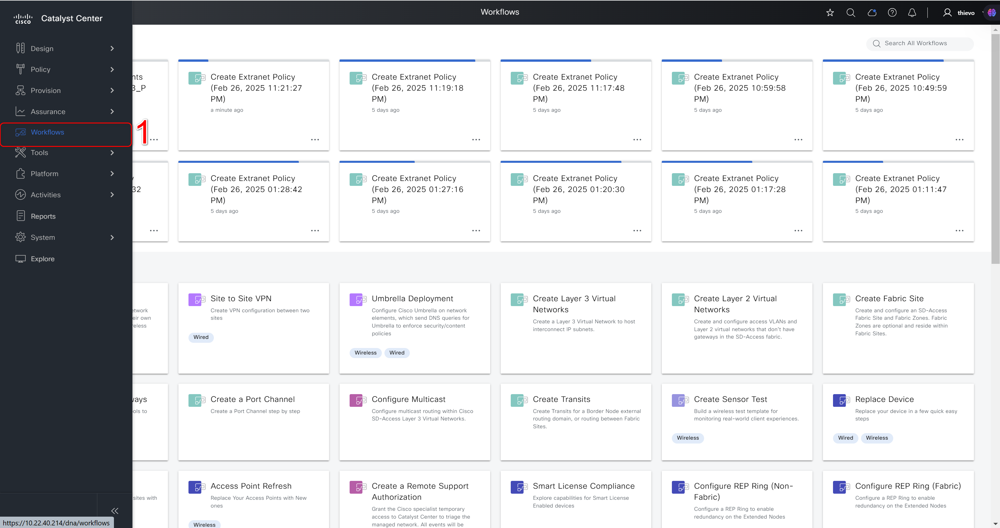
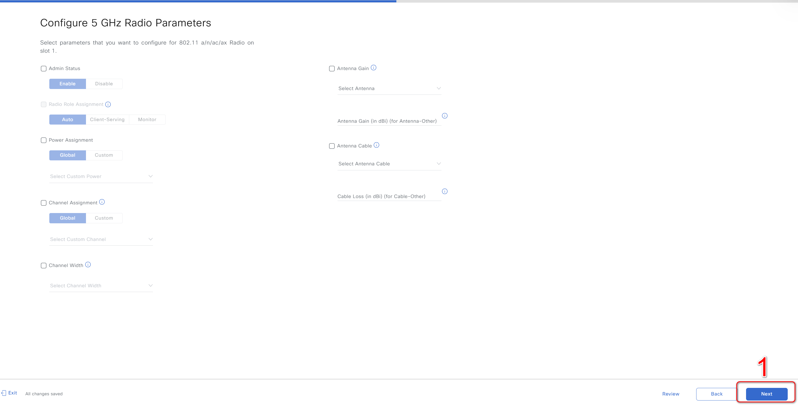

#  Wireless Accesspoint Configuration

## Table of Contents

- [Overview](#overview)
- [Features](#features)
- [Prerequisites](#prerequisites)
- [Workflow Structure](#workflow-structure)
- [Schema Parameters](#schema-parameters)
- [Getting Started](#getting-started)
- [Operations](#operations)
- [Examples](#examples)
- [Troubleshooting](#troubleshooting)
- [Best Practices](#best-practices)

---

## Overview

### 1. Wireless Accesspoint Configuration Overview
 - The access point management workflow in Cisco Catalyst Center focuses on provisioning, configuring, and managing access points. These tasks include creating access points, rebooting them, and performing factory resets. The cisco.catalyst_center.accesspoint_workflow_manager module is designed to automate these processes, ensuring consistency and reducing manual effort.
 - By leveraging this module, network administrators can efficiently manage access points, reducing manual effort and improving consistency across the network.

 ---

## Features

  - Manage access point configurations in Cisco Catalyst Center. 
  - Configure individual AP settings including radio interfaces, controller assignments, and location parameters.
  - Perform bulk configuration updates across multiple access points of the same series.
  - Execute lifecycle operations including AP reboot and factory reset for up to 100 devices.
  - Provision access points to sites and assign RF profiles (HIGH, LOW, TYPICAL, or custom).
  - Support advanced radio configurations for 2.4GHz, 5GHz, 6GHz, XOR, and TRI radio interfaces.
  - Compare current configurations with desired state to apply only necessary changes.
  - Identify access points using MAC address, hostname, or management IP address.

---

## Prerequisites

### Software Requirements

| Component | Version |
|-----------|---------|
| Ansible | 6.42.0 |
| Python | 3.9+ |
| Cisco Catalyst Center SDK | 2.10.4 |

Detailed Input Specification
- [Access Point Workflow Manager](https://galaxy.ansible.com/ui/repo/published/cisco/dnac/content/module/accesspoint_workflow_manager)

### Required Collections

```bash
ansible-galaxy collection install cisco.dnac
ansible-galaxy collection install ansible.utils
pip install dnacentersdk
pip install yamale
```

### Access Requirements

- Catalyst Center admin credentials
- Network connectivity to Catalyst Center API

## Workflow Structure

```
accesspoints_configuration_provisioning/
├── playbook/
│   └── accesspoints_config_playbook.yml                     # Main operations (state: merged)
├── schema/
│   └── accesspoints_config_schema.yml                      # Configuration validation
├── tmp/
│    └── template_generated_file.yaml
├── vars/
│   ├── accesspoints_configuration_vars.yml                 # Complete workflow
│   └── jinja_template_accesspoints_configuration_vars.yml  
├── description.json
└── README.md
```

---

## Schema Parameters

| Parameter | Type | Required | Default | Description |
|-----------|------|----------|---------|-------------|
| accesspoints_details | list | NO | - | List of access point configurations (max 1000) |
| 2.4ghz_radio | dict | NO | - | 2.4GHz radio configuration |
| 5ghz_radio | dict | NO | - | 5GHz radio configuration |
| 6ghz_radio | dict | NO | - | 6GHz radio configuration |
| admin_status | enum | NO | - | AP admin status (Enabled, Disabled) |
| ap_config_selected_fields | str | NO | - | Selected fields for AP configuration |
| ap_mode | enum | NO | - | AP mode (Local, Monitor, Sniffer, Bridge) |
| ap_name | str | NO | - | Access point name |
| ap_selected_fields | str | NO | - | Selected fields for AP |
| bulk_update_aps | dict | NO | - | Bulk update configuration for multiple APs |
| clean_air_si_2.4ghz | enum | NO | - | CleanAir SI for 2.4GHz (Enabled, Disabled) |
| clean_air_si_5ghz | enum | NO | - | CleanAir SI for 5GHz (Enabled, Disabled) |
| clean_air_si_6ghz | enum | NO | - | CleanAir SI for 6GHz (Enabled, Disabled) |
| factory_reset_aps | dict | NO | - | Factory reset AP configuration |
| failover_priority | enum | NO | - | Failover priority (Low, Medium, High, Critical) |
| hostname | str | NO | - | AP hostname |
| is_assigned_site_as_location | enum | NO | - | Use assigned site as location (Enabled, Disabled) |
| led_brightness_level | int | NO | - | LED brightness level (1-8) |
| led_status | enum | NO | - | LED status (Enabled, Disabled) |
| location | str | NO | - | AP location |
| mac_address | str | NO | - | AP MAC address |
| management_ip_address | str | NO | - | AP management IP address |
| primary_controller_name | str | NO | - | Primary controller name |
| primary_ip_address | dict | NO | - | Primary controller IP address |
| reboot_aps | dict | NO | - | Reboot AP configuration |
| rf_profile | str | NO | - | RF profile name |
| secondary_controller_name | str | NO | - | Secondary controller name |
| secondary_ip_address | dict | NO | - | Secondary controller IP address |
| site | dict | NO | - | Site configuration |
| tertiary_controller_name | str | NO | - | Tertiary controller name |
| tertiary_ip_address | dict | NO | - | Tertiary controller IP address |
| tri_radio | dict | NO | - | Tri-radio configuration |
| xor_radio | dict | NO | - | XOR radio configuration |

### Radio Type GHz Configuration (radio_type_ghz)

| Parameter | Type | Required | Default | Description |
|-----------|------|----------|---------|-------------|
| admin_status | enum | NO | - | Radio admin status (Enabled, Disabled) |
| antenna_name | str | NO | - | Antenna name |
| antenna_gain | int | NO | - | Antenna gain (0-40) |
| cable_loss | int | NO | - | Cable loss (0-40) |
| antenna_cable_name | str | NO | - | Antenna cable name |
| radio_role_assignment | enum | NO | - | Radio role (Auto, Client-Serving, Monitor) |
| channel_assignment_mode | enum | NO | - | Channel assignment mode (Global, Custom) |
| channel_number | int | NO | - | Channel number |
| power_assignment_mode | enum | NO | - | Power assignment mode (Global, Custom) |
| power_level | int | NO | - | Power level (1 to 8)|
| channel_width | enum | NO | - | Channel width (20 MHz, 40 MHz, 80 MHz, 160 MHz, 320 MHz) |

### Bulk Update APs Configuration (bulk_update_aps_type)

| Parameter | Type | Required | Default | Description |
|-----------|------|----------|---------|-------------|
| ap_identifier | list | YES | - | List of AP identifiers |
| common_fields_to_change | dict | YES | - | Common fields to update across APs |

### AP Identifier Configuration (ap_identifier_type)

| Parameter | Type | Required | Default | Description |
|-----------|------|----------|---------|-------------|
| ap_name | str | NO | - | Access point name |
| host_name | str | NO | - | Host name |
| mac_address | str | NO | - | MAC address |
| management_ip_address | str | NO | - | Management IP address |

### Access Points Details for Update (accesspoints_details_type_for_update)

| Parameter | Type | Required | Default | Description |
|-----------|------|----------|---------|-------------|
| 2.4ghz_radio | dict | NO | - | 2.4GHz radio configuration |
| 5ghz_radio | dict | NO | - | 5GHz radio configuration |
| 6ghz_radio | dict | NO | - | 6GHz radio configuration |
| admin_status | enum | NO | - | AP admin status (Enabled, Disabled) |
| ap_mode | enum | NO | - | AP mode (Local, Monitor, Sniffer, Bridge) |
| clean_air_si_2.4ghz | enum | NO | - | CleanAir SI for 2.4GHz (Enabled, Disabled) |
| clean_air_si_5ghz | enum | NO | - | CleanAir SI for 5GHz (Enabled, Disabled) |
| clean_air_si_6ghz | enum | NO | - | CleanAir SI for 6GHz (Enabled, Disabled) |
| failover_priority | enum | NO | - | Failover priority (Low, Medium, High, Critical) |
| is_assigned_site_as_location | enum | NO | - | Use assigned site as location (Enabled, Disabled) |
| led_brightness_level | int | NO | - | LED brightness level (1-8) |
| led_status | enum | NO | - | LED status (Enabled, Disabled) |
| location | str | NO | - | AP location |
| primary_controller_name | str | NO | - | Primary controller name |
| primary_ip_address | dict | NO | - | Primary controller IP address |
| secondary_controller_name | str | NO | - | Secondary controller name |
| secondary_ip_address | dict | NO | - | Secondary controller IP address |
| tertiary_controller_name | str | NO | - | Tertiary controller name |
| tertiary_ip_address | dict | NO | - | Tertiary controller IP address |
| tri_radio | dict | NO | - | Tri-radio configuration |
| xor_radio | dict | NO | - | XOR radio configuration |

### Factory Reset APs Configuration (factory_reset_aps_type)

| Parameter | Type | Required | Default | Description |
|-----------|------|----------|---------|-------------|
| hostnames | list | NO | - | List of hostnames for factory reset |
| mac_addresses | list | NO | - | List of MAC addresses for factory reset |
| management_ip_addresses | list | NO | - | List of management IP addresses for factory reset |

### IP Address Configuration (ip_address_type)

| Parameter | Type | Required | Default | Description |
|-----------|------|----------|---------|-------------|
| address | str | YES | - | IP address |

### Reboot APs Configuration (reboot_aps_type)

| Parameter | Type | Required | Default | Description |
|-----------|------|----------|---------|-------------|
| hostnames | list | NO | - | List of hostnames for reboot |
| mac_addresses | list | NO | - | List of MAC addresses for reboot |
| management_ip_addresses | list | NO | - | List of management IP addresses for reboot |

### Site Configuration (site_type)

| Parameter | Type | Required | Default | Description |
|-----------|------|----------|---------|-------------|
| floor | dict | NO | - | Floor configuration |

### Floor Configuration (floor_type)

| Parameter | Type | Required | Default | Description |
|-----------|------|----------|---------|-------------|
| name | str | NO | - | Floor name |
| parent_name | str | NO | - | Parent site name |

### Tri-Radio Configuration (tri_radio_type)

| Parameter | Type | Required | Default | Description |
|-----------|------|----------|---------|-------------|
| admin_status | enum | NO | - | Radio admin status (Enabled, Disabled) |
| antenna_name | str | NO | - | Antenna name |
| antenna_gain | int | NO | - | Antenna gain (0-40) |
| cable_loss | int | NO | - | Cable loss (0-40) |
| antenna_cable_name | str | NO | - | Antenna cable name |
| radio_role_assignment | enum | NO | - | Radio role (Auto, Client-Serving, Monitor) |
| channel_assignment_mode | enum | NO | - | Channel assignment mode (Global, Custom) |
| channel_number | int | NO | - | Channel number |
| dual_radio_mode | str | NO | - | Dual radio mode |
| power_assignment_mode | enum | NO | - | Power assignment mode (Global, Custom) |
| channel_width | enum | NO | - | Channel width (20 MHz, 40 MHz, 80 MHz, 160 MHz, 320 MHz) |
| power_level | int | NO | - | Power level |

### XOR Radio Configuration (radio_type_xor)

| Parameter | Type | Required | Default | Description |
|-----------|------|----------|---------|-------------|
| admin_status | enum | NO | - | Radio admin status (Enabled, Disabled) |
| antenna_name | str | NO | - | Antenna name |
| antenna_gain | int | NO | - | Antenna gain (0-40) |
| cable_loss | int | NO | - | Cable loss (0-40) |
| antenna_cable_name | str | NO | - | Antenna cable name |
| radio_role_assignment | enum | NO | - | Radio role (Auto, Client-Serving, Monitor) |
| channel_assignment_mode | enum | NO | - | Channel assignment mode (Global, Custom) |
| channel_number | int | NO | - | Channel number |
| radio_band | str | NO | - | Radio band |
| power_assignment_mode | enum | NO | - | Power assignment mode (Global, Custom) |
| channel_width | enum | NO | - | Channel width (20 MHz, 40 MHz, 80 MHz, 160 MHz, 320 MHz) |
| power_level | int | NO | - | Power level |

---

## Getting Started

### Step 1: Install Collections

```bash
ansible-galaxy collection install cisco.dnac
ansible-galaxy collection install ansible.utils
pip install dnacentersdk
pip install yamale
```

### Step 2: Configure Inventory

Edit `inventory/demo_lab/hosts.yml`:

- The inventory/demo_lab/hosts.yml file specifies the connection details(IP address, credentials, etc)
- Make sure the catalyst_center_version in this file matches your actual Catalyst Center version.

```yaml
catalyst_center_hosts:
  hosts:
    catalyst_center_primary:
      catalyst_center_host: 10.0.0.0
      catalyst_center_username: admin
      catalyst_center_password: "{{ vault_catalyst_center_password }}"
      catalyst_center_port: 443
      catalyst_center_version: 3.1.3.0
      catalyst_center_verify: false
      catalyst_center_debug: false
      catalyst_center_log: true
```

### Step 3: Configure Variables

Edit `workflows/accesspoints_configuration_provisioning/vars/accesspoints_configuration_vars.yml`

### Step 4: Validate Configuration

```bash
yamale -s workflows/accesspoints_configuration_provisioning/schema/accesspoints_config_schema.yml workflows/accesspoints_configuration_provisioning/vars/accesspoints_configuration_vars.yml
```

### Step 5: Execute Playbook

Execute the Playbook.**

- Playbook: workflows/accesspoints_configuration_provisioning/playbook/accesspoints_config_playbook.yml

To update the Wireless Accesspoint Configuration.**

```bash
    ansible-playbook -i host_inventory_dnac1/hosts.yml workflows/accesspoints_configuration_provisioning/playbook/accesspoints_config_playbook.yml --e VARS_FILE_PATH=../vars/accesspoints_configuration_vars.yml
```FILE_PATH=../vars/backup_and_restore_inputs.yml
```

### Step 6: Verify Configuration

1. Check playbook output for task completion status
2. Log in to Catalyst Center web interface
3. Navigate to **provision > inventory > Accesspoints > Devicename >view device details >configuration**
4. Verify configuration changes.

---

## Operations

## Define input

```bash
  - mac_address: e4:38:7e:42:bc:00
    ap_name: "LTTS_Test_9166_T3"
    admin_status: "Enabled"
    led_status: "Enabled"
    led_brightness_level: 3
    ap_mode: "Local"
    is_assigned_site_as_location: "Enabled"
    failover_priority: "Low"
    primary_controller_name: "NY-IAC-EWLC"
    primary_ip_address:
      address: "204.192.6.200"
    secondary_controller_name: "Inherit from site / Clear"
    tertiary_controller_name: "Inherit from site / Clear"
    2.4ghz_radio:
      admin_status: "Enabled"
      radio_role_assignment: "Client-Serving"
      channel_number: 3
      power_level: 3
    5ghz_radio:
      admin_status: "Enabled"
      radio_role_assignment: "Client-Serving"
      channel_number: 44
      power_level: 3
      channel_width: "20 MHz"
    xor_radio:
      admin_status: "Enabled"
      radio_role_assignment: "Client-Serving"
      channel_number: 1
      power_level: 3
      radio_band: "6 GHz"
      channel_width: "40 MHz"
   - mac_address: 90:e9:5e:03:f3:40
    rf_profile: "HIGH"
    site:
      floor:
        name: "FLOOR1"
        parent_name: "Global/USA/New York/BLDNYC"
    ap_name: "LTTS-test2"
    admin_status: "Enabled"
    led_status: "Enabled"
    led_brightness_level: 5
    ap_mode: "Local"
    is_assigned_site_as_location: "Enabled"
    failover_priority: "Low"
    2.4ghz_radio:
      admin_status: "Enabled"
      antenna_name: "C-ANT9104-2.4GHz"
      radio_role_assignment: "Client-Serving"
      channel_number: 5
      power_level: 2
    5ghz_radio:
      admin_status: "Enabled"
      antenna_name: "AIR-ANT2513P4M-N-5GHz"
      radio_role_assignment: "Client-Serving"
      channel_number: 36
      power_level: 2
      channel_width: "40 MHz"
```

**Validate**
Validate Configuration: To ensure a successful execution of the playbooks with your specified inputs, follow these steps:
Input Validation: Before executing the playbook, it is essential to validate the input schema. This step ensures that all required parameters are included and correctly formatted. Run the following command ./tools/validate.sh -s or yamale -s to perform the validation providing the schema path and the input path.

```bash
# Validate
   yamale -s workflows/accesspoints_configuration_provisioning/schema/accesspoints_config_schema.yml workflows/accesspoints_configuration_provisioning/vars/accesspoints_configuration_vars.yml
```

Return result validate:

```bash
yamale -s workflows/accesspoints_configuration_provisioning/schema/accesspoints_config_schema.yml workflows/accesspoints_configuration_provisioning/vars/accesspoints_configuration_vars.yml
Validating workflows/accesspoints_configuration_provisioning/vars/accesspoints_configuration_vars.yml...
Validation success! 👍
```

**Execute the Playbook.**

Playbook: workflows/accesspoints_configuration_provisioning/playbook/accesspoints_config_playbook.yml

```bash
   ansible-playbook -i inventory/demo_lab/hosts.yaml \
  workflows/accesspoints_configuration_provisioning/playbook/accesspoints_config_playbook.yml \
  --extra-vars VARS_FILE_PATH=../vars/accesspoints_configuration_vars.yml
```


## Examples:

### 1. Update Wireless Accesspoint Configuration

#### Example Input File **

```bash
  - mac_address: e4:38:7e:42:bc:00
    ap_name: "LTTS_Test_9166_T3"
    admin_status: "Enabled"
    led_status: "Enabled"
    led_brightness_level: 3
    ap_mode: "Local"
    is_assigned_site_as_location: "Enabled"
    failover_priority: "Low"
    primary_controller_name: "NY-IAC-EWLC"
    primary_ip_address:
      address: "204.192.6.200"
    secondary_controller_name: "Inherit from site / Clear"
    tertiary_controller_name: "Inherit from site / Clear"
    2.4ghz_radio:
      admin_status: "Enabled"
      radio_role_assignment: "Client-Serving"
      channel_number: 3
      power_level: 3
    5ghz_radio:
      admin_status: "Enabled"
      radio_role_assignment: "Client-Serving"
      radio_role_assignment: "Monitor"
      channel_number: 44
      power_level: 3
      channel_width: "20 MHz"
```
6GHZ AP config Update:

```bash
create_ap_with_controllers:
  - mac_address: 2c:e3:8e:af:d2:e0
    ap_name: Test_AP1
    admin_status: Enabled
    led_status: Enabled
    led_brightness_level: 7
    ap_mode: Local
    site:
      floor :
        name: FLOOR4
        parent_name: "Global/USA/SAN JOSE/SJ_BLD23"
    is_assigned_site_as_location: Enabled
    failover_priority: Low
    clean_air_si_2.4ghz: Enabled
    clean_air_si_5ghz: Enabled
    clean_air_si_6ghz: Enabled
    rf_profile: HIGH
    primary_controller_name: SJ-EWLC-1
    primary_ip_address:
      address: 204.192.4.200
    secondary_controller_name: NY-EWLC-1
    secondary_ip_address:
      address: 204.192.6.200
    tertiary_controller_name: "Inherit from site / Clear"
```
Terminal Return

```code 
 ap_config_update_status: The update for AP Config 'Test_AP1' has been successfully verified.
        ap_provision_update_status: AP provision for the site 'Global/USA/SAN JOSE/SJ_BLD23/FLOOR4' has been successfully verified.
```
AP 6GHZ radio parameter config update:

```bash
- mac_address: 2c:e3:8e:af:d2:e0
    admin_status: Enabled
    ap_mode: Local
    6ghz_radio:
      admin_status: Enabled
      radio_role_assignment: "Client-Serving"
      power_assignment_mode: "Global"
      channel_assignment_mode: "Global"
      channel_number: 13
```

AP 5GHZ radio parameter config update:

```bash
- mac_address: e4:38:7e:42:ee:80
    admin_status: Enabled
    ap_mode: Local
    5ghz_radio:
      admin_status: "Enabled"
      radio_role_assignment: "Client-Serving"
      channel_assignment_mode: "Custom"
      channel_number: 56
```
Terminal Return

```code
response:
        ap_config_update_status: The update for AP Config 'AP6849.9275.2910' has been successfully verified.
```

Ap Provisioning:

```bash
- mac_address: a4:88:73:d0:53:60
     rf_profile: "HIGH"
     site:
       floor :
         name: FLOOR1
         parent_name: "Global/USA/SAN JOSE/SJ_BLD23"
```
```code
response:
        ap_config_update_status: The update for AP Config 'Cisco_9120AXE_IP4-01-Test2' has been successfully verified.
        ap_provision_update_status: AP provision for the site 'Global/USA/SAN JOSE/SJ_BLD23/FLOOR4' has been successfully verified.
    status: successs
```

6GHZ AP reboot:

```bash
- reboot_aps:
     mac_addresses:
       - 2c:e3:8e:af:d2:e0 
```

```code
response:
      accesspoints_updates:
        ap_reboot_status: APs ['cc:6e:2a:e1:02:40'] rebooted successfully
```

#### **b. Mapping config to UI Actions.**
- Select Workflows to enter the workflows page

- On the workflows page, search for "Configure Access Points" -> Select the task "Configure Access Points".

- On the Get Started page, enter Task Name -> Next.

- Perform some options for the Configurre Access Points section including Radio and Steps.

- On the Selected Access Points page, select the Access Point you want to configure.

- On the Selected Access Points page, select the Access Point you want to configure -> Next.

- On the Configure AP Parameters page, perform the options you want to configure -> Next.

- On the Configure 5 GHZ Radio Rarameters page, perform the options you want to configure (This page is only displayed if you select configure 5 GHz) -> Next.

- On the Configure 2.4 GHZ Radio Rarameters page, perform the options you want to configure (This page is only displayed if you select configure 2.4 GHz) -> Next. Note, for Access Points that cannot configure 2.4 GHZ Radio Rarameters, this page is still displayed but you cannot configure.

- On the Configure 6 GHZ Radio Rarameters page, perform the options you want to configure (This page is only displayed if you choose to configure 6 GHz) -> Next. Note, for Access Points that cannot configure 6 GHZ Radio Rarameters, this page is still displayed but you cannot configure.

- On the Configure Dual-Band (XOR) Radio Rarameters page, perform the options you want to configure (This page is only displayed if you choose to configure Dual-Band (XOR) ) -> Next.

- On the Configure Tri-Radio Rarameters page, perform the options you want to configure (This page is only displayed if you choose to configure Tri-Radio ) -> Next.

- On the Save As Reusable Template page, enter Template Name -> Next to save the task name.

- On the Summary page, check the selected parameters -> Next

A- t the Provision Schedule, enter Task Name -> Configure.

- Finally, check Preview Configuration -> Deploy.


### 2. Creating Bulk Accesspoint Configuration using JINJA template and using the playbook:
#### a. JINJA Template
```
---
accesspoints_details:
 
  - management_ip_address: "204.20.208.{{i}}"
    ap_mode: Local
    admin_status: "Enabled"
    radio_role_assignment: "Client-Serving"
    channel_number: 44
    power_level: 3
    channel_width: "20 MHz"

 
  - management_ip_address: "204.20.208.{{i}}"
    ap_mode: Local
    admin_status: "Enabled"
    radio_role_assignment: "Client-Serving"
    channel_number: 3
    power_level: 3

```
#### b. Input File Example

```bash
- management_ip_address: "204.20.208.119"
    ap_mode: Local
    admin_status: "Enabled"
    radio_role_assignment: "Client-Serving"
    channel_number: 44
    power_level: 3
    channel_width: "20 MHz"
- management_ip_address: "204.20.208.120"
    ap_mode: Local
    admin_status: "Enabled"
    radio_role_assignment: "Client-Serving"
    channel_number: 44
    power_level: 3
    channel_width: "20 MHz"
- management_ip_address: "204.20.208.121"
    ap_mode: Local
    admin_status: "Enabled"
    radio_role_assignment: "Client-Serving"
    channel_number: 44
    power_level: 3
    channel_width: "20 MHz"
- management_ip_address: "204.20.208.122"
    ap_mode: Local
    admin_status: "Enabled"
    radio_role_assignment: "Client-Serving"
    channel_number: 44
    power_level: 3
    channel_width: "20 MHz"
- management_ip_address: "204.20.208.123"
    ap_mode: Local
    admin_status: "Enabled"
    radio_role_assignment: "Client-Serving"
    channel_number: 44
    power_level: 3
    channel_width: "20 MHz"
- management_ip_address: "204.20.208.124"
    ap_mode: Local
    admin_status: "Enabled"
    radio_role_assignment: "Client-Serving"
    channel_number: 44
    power_level: 3
    channel_width: "20 MHz"
```

## IV. References

Cisco Catalyst Center Ansible Module Documentation: [accesspoint_workflow_manager](https://cisco-en-programmability.github.io/dnacenter-ansible/main/plugins/accesspoint_workflow_manager_module.html)

GitHub Source Code: [accesspoint_workflow_manager.py](https://github.com/cisco-en-programmability/dnacenter-ansible/blob/main/plugins/modules/accesspoint_workflow_manager.py)