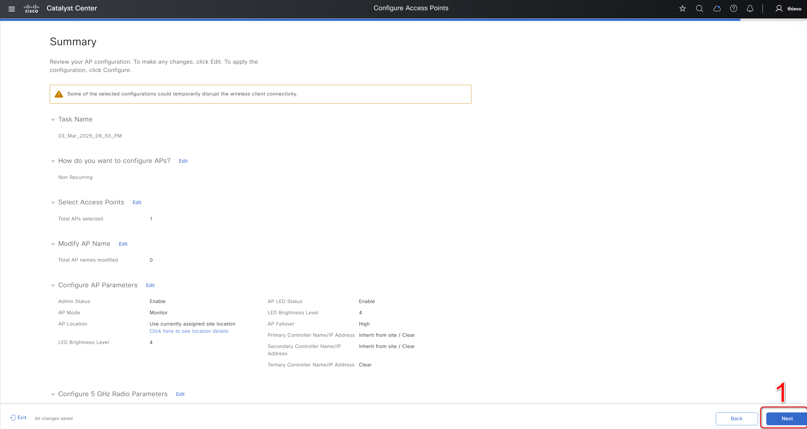

# Wireless Accesspoint Configuration
    Provision and customize access points configuration.​

    Bulk AP Configuration: Automate multi-AP setup, including frequency and power settings across sites.​

    Dynamic Channel and Power Assignment: Assign channels and power levels globally or customize individually to minimize interference and enhance signal strength.​

    Centralized AP Location Management: Assign APs to specific sites and floors, facilitating organized and efficient AP deployment.​

    Reboot and Update Management: Easily reboot individual or multiple APs and update configurations through Catalyst Center with logging for audits and compliance.
## I. Overview.
### 1. Wireless Accesspoint Configuration Overview.
 - The access point management workflow in Cisco Catalyst Center focuses on provisioning, configuring, and managing access points. These tasks include creating access points, rebooting them, and performing factory resets. The cisco.catalyst_center.accesspoint_workflow_manager module is designed to automate these processes, ensuring consistency and reducing manual effort.
 - By leveraging this module, network administrators can efficiently manage access points, reducing manual effort and improving consistency across the network.

### 3. Detailed Input Specification.
![Access Point Workflow Manager]​(https://galaxy.ansible.com/ui/repo/published/cisco/dnac/content/module/accesspoint_workflow_manager)

### 4. Features.
 - Automates bulk configuration changes for Access Points (APs).
 - Modify AP display names, AP names, or other parameters.
 - Filter specific device details, such as selecting devices with hostnames matching "NFW-AP1-9130AXE".
 - Compares input details with current AP configurations and applies desired changes only to relevant APs.

## II. Procedure.
### 1. Prepare your Ansible environment.
 - Install Ansible if you haven't already.
 - Ensure you have network connectivity to your Catalyst Center instance.
 - Checkout the project and playbooks: git@github.com:cisco-en-programmability/catalyst-center-ansible-iac.git.

### 2. Configure Host Inventory.
 - The host_inventory_catalyst_center1/hosts.yml file specifies the connection details (IP address, credentials, etc.) for your Catalyst Center instance.
 - Make sure the catalyst_center_version in this file matches your actual Catalyst Center version.
 - The Sample host_inventory_catalyst_center1/hosts.yml.

```bash
catalyst_center_hosts:
    hosts:
        catalyst_center220:
            #(Mandatory) CatC Ip address
            catalyst_center_host:  <DNAC IP Address>
            #(Mandatory) CatC UI admin Password
            catalyst_center_password: <DNAC UI admin Password>
            catalyst_center_port: 443
            catalyst_center_timeout: 60
            #(Mandatory) CatC UI admin username
            catalyst_center_username: <DNAC UI admin username> 
            catalyst_center_verify: false
            #(Mandatory) DNAC Release version
            catalyst_center_version: <DNAC Release version>
            catalyst_center_debug: true
            catalyst_center_log_level: INFO
            catalyst_center_log: true
```
### 3. Define input.
The /vars/fabric_extranet_policy_inputs.yml file stores the sites details you want to configure.

```bash
  - mac_address: e4:38:7e:42:bc:00
    ap_name: "LTTS_Test_9166_T3"
    admin_status: "Enabled"
    led_status: "Enabled"
    led_brightness_level: 3
    ap_mode: "Local"
    is_assigned_site_as_location: "Enabled"
    failover_priority: "Low"
    primary_controller_name: "NY-IAC-EWLC"
    primary_ip_address:
      address: "204.192.6.200"
    secondary_controller_name: "Inherit from site / Clear"
    tertiary_controller_name: "Inherit from site / Clear"
    2.4ghz_radio:
      admin_status: "Enabled"
      radio_role_assignment: "Client-Serving"
      channel_number: 3
      power_level: 3
    5ghz_radio:
      admin_status: "Enabled"
      radio_role_assignment: "Client-Serving"
      channel_number: 44
      power_level: 3
      channel_width: "20 MHz"
    xor_radio:
      admin_status: "Enabled"
      radio_role_assignment: "Client-Serving"
      channel_number: 1
      power_level: 3
      radio_band: "6 GHz"
      channel_width: "40 MHz"
   - mac_address: 90:e9:5e:03:f3:40
    rf_profile: "HIGH"
    site:
      floor:
        name: "FLOOR1"
        parent_name: "Global/USA/New York/BLDNYC"
    ap_name: "LTTS-test2"
    admin_status: "Enabled"
    led_status: "Enabled"
    led_brightness_level: 5
    ap_mode: "Local"
    is_assigned_site_as_location: "Enabled"
    failover_priority: "Low"
    2.4ghz_radio:
      admin_status: "Enabled"
      antenna_name: "C-ANT9104-2.4GHz"
      radio_role_assignment: "Client-Serving"
      channel_number: 5
      power_level: 2
    5ghz_radio:
      admin_status: "Enabled"
      antenna_name: "AIR-ANT2513P4M-N-5GHz"
      radio_role_assignment: "Client-Serving"
      channel_number: 36
      power_level: 2
      channel_width: "40 MHz"
```

### 4. How to Validate Input.

**a. Validate Your Input.**

```bash
   yaml -s workflows/accesspoints_configuration_provisioning/vars/accesspoints_configuration_vars.yml
```

**b. Execute the Playbook.**

- Playbook: workflows/accesspoints_configuration_provisioning/playbook/accesspoints_config_playbook.yml

**c. To update the Wireless Accesspoint Configuration.**
```bash
    ansible-playbook -i host_inventory_dnac1/hosts.yml workflows/accesspoints_configuration_provisioning/playbook/accesspoints_config_playbook.yml --e VARS_FILE_PATH=../vars/accesspoints_configuration_vars.yml
```

**d. To delete existing  Wireless Accesspoint Configuration.**
```bash
 ansible-playbook -i host_inventory_dnac1/hosts.yml workflows/accesspoints_configuration_provisioning/playbook/delete_accesspoints_config_playbook.yml --e VARS_FILE_PATH=../vars/accesspoints_configuration_vars.yml
```

## III. Detailed steps to perform.

### 1. Update Wireless Accesspoint Configuration.

#### **a. Example Input File.**
```bash
  - mac_address: e4:38:7e:42:bc:00
    ap_name: "LTTS_Test_9166_T3"
    admin_status: "Enabled"
    led_status: "Enabled"
    led_brightness_level: 3
    ap_mode: "Local"
    is_assigned_site_as_location: "Enabled"
    failover_priority: "Low"
    primary_controller_name: "NY-IAC-EWLC"
    primary_ip_address:
      address: "204.192.6.200"
    secondary_controller_name: "Inherit from site / Clear"
    tertiary_controller_name: "Inherit from site / Clear"
    2.4ghz_radio:
      admin_status: "Enabled"
      radio_role_assignment: "Client-Serving"
      channel_number: 3
      power_level: 3
    5ghz_radio:
      admin_status: "Enabled"
      radio_role_assignment: "Client-Serving"
      channel_number: 44
      power_level: 3
      channel_width: "20 MHz"
    xor_radio:
      admin_status: "Enabled"
      radio_role_assignment: "Client-Serving"
      channel_number: 1
      power_level: 3
      radio_band: "6 GHz"
      channel_width: "40 MHz"
  - mac_address: e4:38:7e:42:bc:00
    ap_name: "LTTS_Test_9166_T3"
    admin_status: "Enabled"
    led_status: "Enabled"
    led_brightness_level: 3
    ap_mode: "Local"
    is_assigned_site_as_location: "Enabled"
    failover_priority: "Low"
    primary_controller_name: "NY-IAC-EWLC"
    primary_ip_address:
      address: "204.192.6.200"
    secondary_controller_name: "Inherit from site / Clear"
    tertiary_controller_name: "Inherit from site / Clear"
    2.4ghz_radio:
      admin_status: "Enabled"
      radio_role_assignment: "Client-Serving"
      channel_number: 3
      power_level: 3
    5ghz_radio:
      admin_status: "Enabled"
      radio_role_assignment: "Client-Serving"
      channel_number: 44
      power_level: 3
      channel_width: "20 MHz"
    xor_radio:
      admin_status: "Enabled"
      radio_role_assignment: "Client-Serving"
      channel_number: 1
      power_level: 3
      radio_band: "6 GHz"
      channel_width: "40 MHz"
```


#### **b. Mapping config to UI Actions.**
- Select Workflows to enter the workflows page

- On the workflows page, search for "Configure Access Points" -> Select the task "Configure Access Points".

- On the Get Started page, enter Task Name -> Next.

- Perform some options for the Configurre Access Points section including Radio and Steps.

- On the Selected Access Points page, select the Access Point you want to configure.

- On the Selected Access Points page, select the Access Point you want to configure -> Next.

- On the Configure AP Parameters page, perform the options you want to configure -> Next.

- On the Configure 5 GHZ Radio Rarameters page, perform the options you want to configure (This page is only displayed if you select configure 5 GHz) -> Next.

- On the Configure 2.4 GHZ Radio Rarameters page, perform the options you want to configure (This page is only displayed if you select configure 2.4 GHz) -> Next. Note, for Access Points that cannot configure 2.4 GHZ Radio Rarameters, this page is still displayed but you cannot configure.

- On the Configure 6 GHZ Radio Rarameters page, perform the options you want to configure (This page is only displayed if you choose to configure 6 GHz) -> Next. Note, for Access Points that cannot configure 6 GHZ Radio Rarameters, this page is still displayed but you cannot configure.

- On the Configure Dual-Band (XOR) Radio Rarameters page, perform the options you want to configure (This page is only displayed if you choose to configure Dual-Band (XOR) ) -> Next.

- On the Configure Tri-Radio Rarameters page, perform the options you want to configure (This page is only displayed if you choose to configure Tri-Radio ) -> Next.

- On the Save As Reusable Template page, enter Template Name -> Next to save the task name.

- On the Summary page, check the selected parameters -> Next

A- t the Provision Schedule, enter Task Name -> Configure.

- Finally, check Preview Configuration -> Deploy.


## IV. References.

Note: The environment is used for the references in the above instructions.

```
  ansible: 9.9.0
  ansible-core: 2.16.10
  ansible-runner: 2.4.0
  dnacentersdk: 2.8.3
  cisco.dnac: 6.30.0
  ansible.utils: 5.1.2
```
Cisco Catalyst Center Ansible Module Documentation: [sda_extranet_policies_workflow_manager](https://cisco-en-programmability.github.io/dnacenter-ansible/main/plugins/accesspoint_workflow_manager_module.html)

GitHub Source Code: [sda_extranet_policies_workflow_manager.py](https://github.com/cisco-en-programmability/dnacenter-ansible/blob/main/plugins/modules/accesspoint_workflow_manager.py)