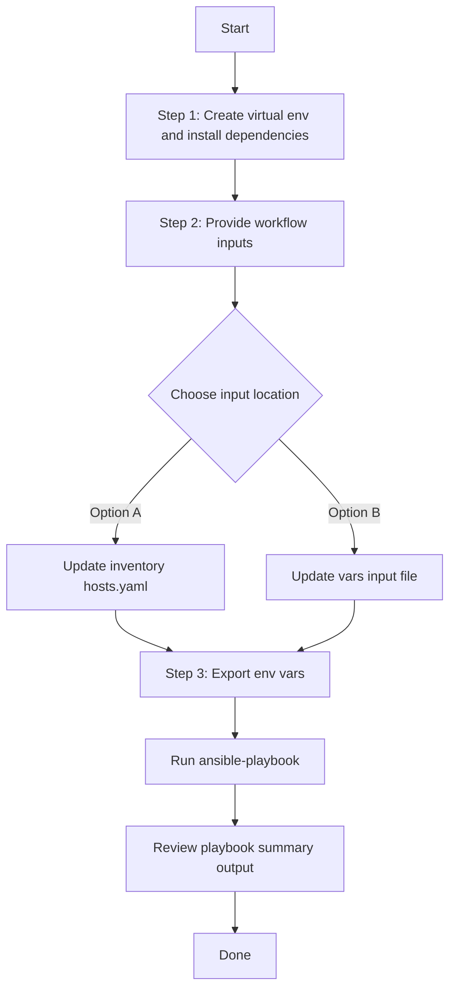

# Utility to maintain Ansible Vault, Add/Delete existing Variables and new variables in ansible vault
This workflow to maintain the Ansible Vault and Variables in Ansible Vault

TO encrypt a variable and store it in Vault file for hiding the actual value in the Ansible inputs. 
Provide the variables in vars/ansible_vault_update_inputs.yaml

## Adding new keys with values to ansible vault
Any variabe can be encrypted and stored in the ansible vault using key/value keys as in the example below.

---
passwords_details:
- password_key: testuser1password
  password_value: 'testuser1@123'
- password_key: testuser2password
  password_value: 'testuser2@123'

Execute the playbook to store new keys with encrypted values in the ansible vault. Then reference the variable directly in your ansible imput using the {{variable}} reference the value. Ansible at time of execution will decode and replace the original value.

## to update the existing the key to new vale simply run update the input with new value and run the playbook 
---
passwords_details:
- password_key: testuser1password
  password_value: 'testuser1@123!!123'  #Updated
- password_key: testuser2password
  password_value: 'testuser2@123'

## Executing the playbook to add variables and encrypt to the playbook:

ansible-playbook -i host_inventory workflows/ansible_vault_update/playbook/ansible_vault_update_playbook.yml --extra-vars "VARS_FILE_PATH=../vars/ansible_vault_update_inputs.yml"


## Removing variables from ansible vault

ansible-playbook -i host_inventory workflows/ansible_vault_update/playbook/delete_ansible_vault_update_playbook.yml --extra-vars "VARS_FILE_PATH=../vars/ansible_vault_update_inputs.yml"
## Workflow Steps
## User Flow (3 Steps)



### Installation and Run (Aligned)

1. Create and activate a Python virtual environment, then install dependencies.

```bash
python3 -m venv .venv
source .venv/bin/activate
pip install -r requirements.txt
ansible-galaxy collection install cisco.dnac --force
```

2. Provide workflow inputs in either inventory (`inventory/demo_lab/hosts.yaml`) or the workflow `vars/` file.

3. Export Catalyst Center environment variables and run the playbook.

```bash
export HOSTIP=<catalyst-center-ip-or-fqdn>
export CATALYST_CENTER_USERNAME=<username>
export CATALYST_CENTER_PASSWORD='<password>'
ansible-playbook -i ./inventory/demo_lab/hosts.yaml ./workflows/ansible_vault_update/playbook/ansible_vault_update_playbook.yml -vvvv
```
