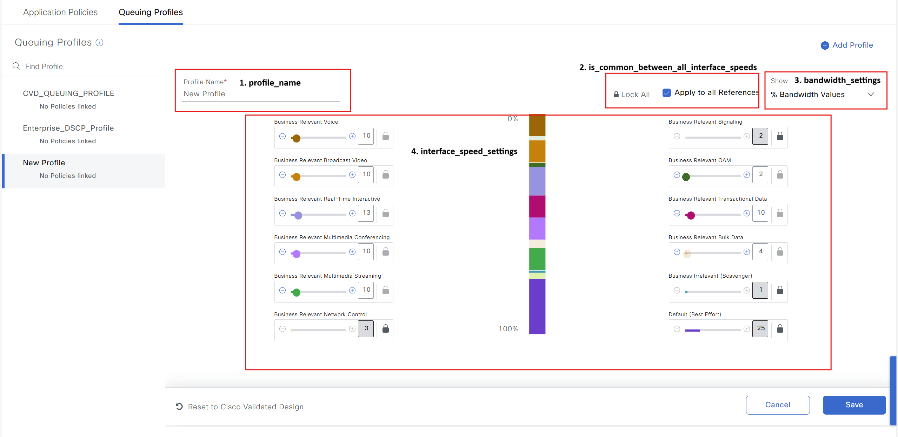
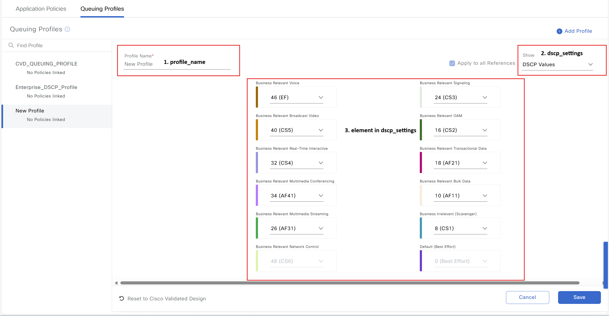
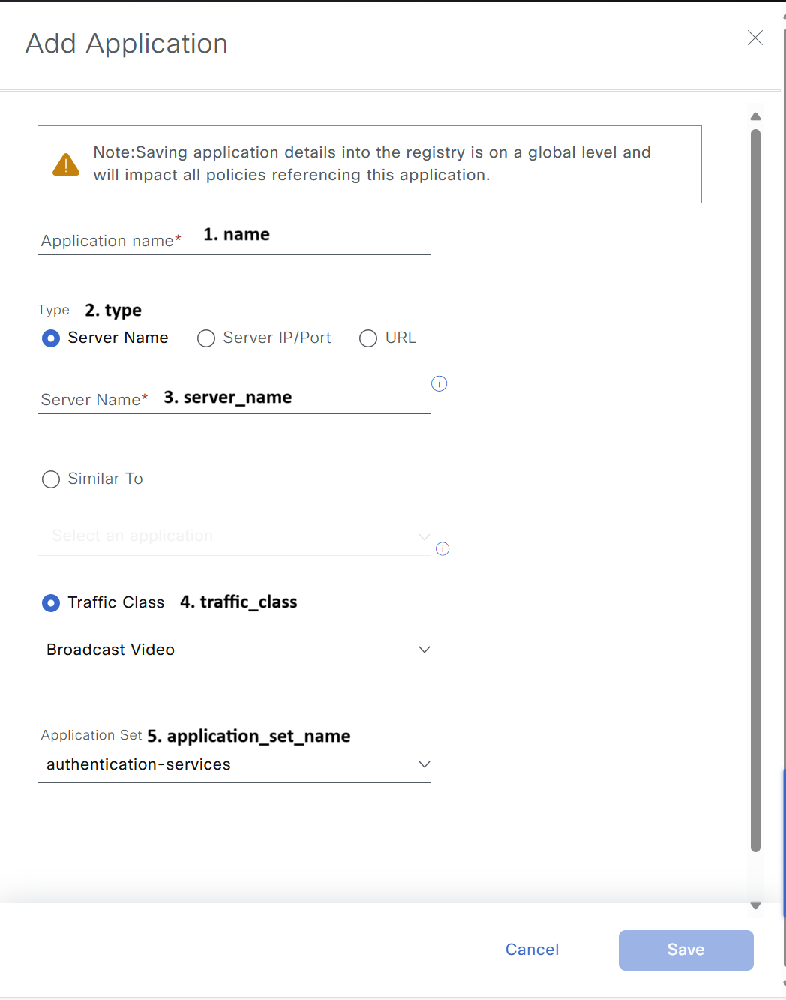
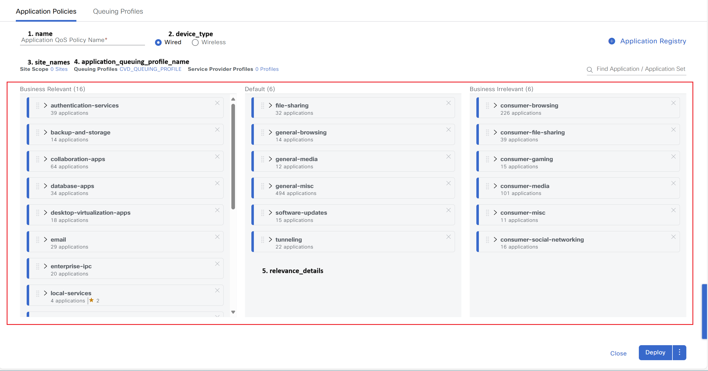
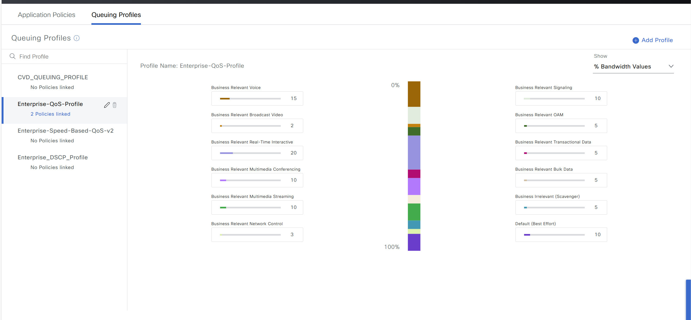
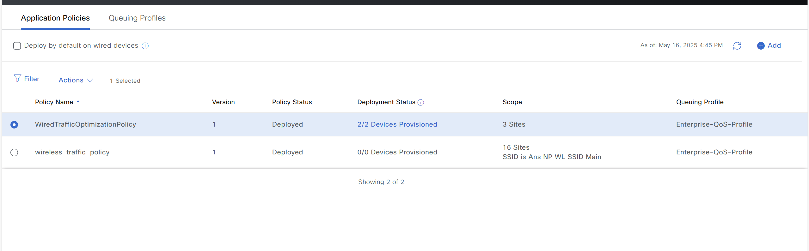

# Cisco Catalyst Center Application Policy Workflow Playbooks

Application Policy Workflow Playbooks designed to automate the management of applications, application policies, and queuing profiles for both wired and wireless networks.

**Key Features:**
  - Create, update, and delete applications.
  - Create, update, and delete application policies.
  - Create, update, and delete application queuing profiles in Cisco Catalyst Center.
  - Supports managing queuing profiles and application policies for traffic classification and prioritization.

**version_added:** "6.32.0"

---

This README outlines the steps to use the Ansible playbooks for managing Application Policies in Cisco Catalyst Center.

## Workflow Steps

This workflow follows a three-step approach:

### Step 1: Install and Generate Inventory

Before running the playbooks, ensure you have Ansible installed and the necessary collections for Cisco Catalyst Center.

1.  **Install Ansible:** Follow the official Ansible documentation for installation instructions.
2.  **Install Cisco Catalyst Center Collection:**
    ```bash
    ansible-galaxy collection install cisco.dnac
    ```
3.  **Generate Inventory:** Create an Ansible inventory file (e.g., `inventory.yml`) that includes your Cisco Catalyst Center appliance details. You will need to define variables such as the host, username, and password (or other authentication methods).
### Configure Host Inventory

Update your Ansible hosts.yml inventory file with the connection details of your Cisco Catalyst Center instance. Replace the placeholder values with your actual Catalyst Center information.

```yaml
catalyst_center_hosts:
    hosts:
        your_catalyst_center_instance_name:
            catalyst_center_host: xx.xx.xx.xx
            catalyst_center_password: XXXXXXXX
            catalyst_center_port: 443
            catalyst_center_timeout: 60
            catalyst_center_username: admin
            catalyst_center_verify: false # Set to true for production with valid certificates
            catalyst_center_version: 2.3.7.6 # Specify your DNA Center version
            catalyst_center_debug: true
            catalyst_center_log_level: INFO
            catalyst_center_log: true
```

### Step 2: Define Inputs and Validate

This step involves preparing the input data for creating or managing application policies and validating your setup.

1. **Prerequisite:**
  - Need Site Hierarchy created
  - Need SSID connected to wireless Network Profiles

2.  **Define Input Variables:** Create variable files (e.g., `vars/application_policies.yml`) that define the desired state of your application policies, applications, queuing profiles, etc. Refer to the specific playbook documentation for the required variable structure.

#### Application Policy Schema

This schema defines the structure of the input file for configuring Application Policy in Cisco Catalyst Center. Below is a breakdown of the parameters, including their requirements and descriptions.

#### Queuing Profile (queuing_profile):

| **Parameter**            | **Type**   | **Required** | **Default Value** | **Description**                                                                 |
|--------------------------|------------|--------------|-------------------|---------------------------------------------------------------------------------|
| `profile_name`           | String     | Yes          | N/A               | Name of the queuing profile.                                                   |
| `new_profile_name`       | String     | No           | N/A               | New name for the queuing profile (used for updates).                           |
| `profile_description`    | String     | No           | N/A               | Description of the queuing profile.                                            |
| `new_profile_description`| String     | No           | N/A               | New description of the queuing profile.                                        |
| `bandwidth_settings`     | Dictionary | No           | {}                | Specifies bandwidth allocation details.                                        |
| `dscp_settings`          | Dictionary | No           | {}                | DSCP values for traffic types (range: 0–63).                                   |

#### Bandwidth Settings (bandwidth_settings):

| **Parameter**                                 | **Type**     | **Required** | **Default Value** | **Description**                                                                 |
|-----------------------------------------------|--------------|--------------|-------------------|---------------------------------------------------------------------------------|
| `is_common_between_all_interface_speeds`      | Boolean      | No           | False             | Apply bandwidth settings uniformly across all interface speeds.                |
| `interface_speed_settings`                    | List of Dict | No           | []                | Bandwidth per traffic category and interface speed.                            |

#### -> interface_speed_settings:

| **Parameter**           | **Type**   | **Required** | **Default Value** | **Description**                                                                 |
|------------------------|------------|--------------|-------------------|---------------------------------------------------------------------------------|
| `interface_speed`       | String     | Yes          | N/A               | Interface speed: `ALL`, `HUNDRED_GBPS`, etc.                                   |
| `bandwidth_percentages` | Dictionary | Yes          | {}                | Percentages assigned per traffic category (total ≤ 100%).                      |

#### -> bandwidth_percentages:

| **Traffic Category**         | **Type** | **Required** | **Default Value** | **Description**                                   |
|-----------------------------|----------|--------------|-------------------|---------------------------------------------------|
| `transactional_data`        | String   | No           | N/A               | Bandwidth for transactional traffic.              |
| `best_effort`               | String   | No           | N/A               | General-purpose traffic.                          |
| `voip_telephony`            | String   | No           | N/A               | Voice over IP traffic.                            |
| `multimedia_streaming`      | String   | No           | N/A               | Real-time audio/video streaming.                  |
| `real_time_interactive`     | String   | No           | N/A               | Low-latency applications.                         |
| `multimedia_conferencing`   | String   | No           | N/A               | Audio-video conferencing.                         |
| `signaling`                 | String   | No           | N/A               | Network signaling messages.                       |
| `scavenger`                 | String   | No           | N/A               | Low-priority traffic.                             |
| `ops_admin_mgmt`            | String   | No           | N/A               | Operations/administration traffic.                |
| `broadcast_video`           | String   | No           | N/A               | One-to-many video distribution.                   |
| `network_control`           | String   | No           | N/A               | Network operation/control traffic.                |
| `bulk_data`                 | String   | No           | N/A               | Non-time-sensitive, large-volume transfers.       |

#### DSCP Settings (dscp_settings):

| **Traffic Category**         | **Type** | **Required** | **Default Value** | **Description**                                               |
|-----------------------------|----------|--------------|-------------------|---------------------------------------------------------------|
| `transactional_data`        | String   | No           | N/A               | DSCP for transactional data (0-63).                           |
| `best_effort`               | String   | No           | N/A               | DSCP for best-effort traffic.                                 |
| `voip_telephony`            | String   | No           | N/A               | DSCP for VoIP traffic.                                        |
| `multimedia_streaming`      | String   | No           | N/A               | DSCP for streaming traffic.                                   |
| `real_time_interactive`     | String   | No           | N/A               | DSCP for real-time interactive apps.                          |
| `multimedia_conferencing`   | String   | No           | N/A               | DSCP for conferencing traffic.                                |
| `signaling`                 | String   | No           | N/A               | DSCP for signaling/control.                                   |
| `scavenger`                 | String   | No           | N/A               | DSCP for low-priority tasks.                                  |
| `ops_admin_mgmt`            | String   | No           | N/A               | DSCP for operations/admin traffic.                            |
| `broadcast_video`           | String   | No           | N/A               | DSCP for broadcast video.                                     |
| `network_control`           | String   | No           | N/A               | DSCP for network control traffic.                             |
| `bulk_data`                 | String   | No           | N/A               | DSCP for bulk data traffic.                                   |

#### Application (application):

| **Parameter**                | **Type**   | **Required** | **Default Value** | **Description**                                                                 |
|-----------------------------|------------|--------------|-------------------|---------------------------------------------------------------------------------|
| `name`                      | String     | Yes          | N/A               | Name of the application.                                                       |
| `description`               | String     | No           | N/A               | Description of the application.                                                |
| `help_string`               | String     | No           | N/A               | Purpose or intended use of the application.                                    |
| `type`                      | String     | Yes          | N/A               | Identifier type: `server_name`, `url`, or `server_ip`.                         |
| `server_name`               | String     | Conditionally | N/A              | Required if `type = server_name`.                                              |
| `dscp`                      | Integer    | Conditionally | N/A              | Required if `type = server_ip`. Value must be 0–63.                            |
| `network_identity`          | Dictionary | Conditionally | {}               | Required if `type = server_ip`.                                                |
| `app_protocol`              | String     | Conditionally | N/A              | Required for `url` or `server_ip`. Must be TCP if `url`.                       |
| `url`                       | String     | Conditionally | N/A              | Required if `type = url`.                                                      |
| `traffic_class`             | String     | No           | N/A               | Defines prioritization (e.g. `REAL_TIME_INTERACTIVE`).                         |
| `ignore_conflict`           | Boolean    | No           | False             | Whether to ignore conflicts.                                                   |
| `rank`                      | Integer    | No           | N/A               | Priority ranking.                                                              |
| `engine_id`                 | Integer    | No           | N/A               | Engine managing the application.                                               |
| `application_set_name`      | String     | No           | N/A               | Associated application set.                                                    |

#### -> network_identity:

| **Parameter**   | **Type** | **Required** | **Description**                                        |
|----------------|----------|--------------|--------------------------------------------------------|
| `protocol`      | String   | No           | Protocol used by the application.                     |
| `port`          | String   | No           | Communication port.                                   |
| `ip_subnet`     | List     | No           | List of IPs/subnets.                                  |
| `lower_port`    | String   | No           | Lower port range.                                     |
| `upper_port`    | String   | No           | Upper port range.                                     |

#### Application Policy (application_policy):

| **Parameter**                              | **Type**     | **Required** | **Default Value** | **Description**                                                                 |
|-------------------------------------------|--------------|--------------|-------------------|---------------------------------------------------------------------------------|
| `name`                                     | String       | Yes          | N/A               | Name of the application policy.                                                |
| `policy_status`                            | String       | No           | `NONE`            | Status: `NONE`, `DELETED`, or `RESTORED`.                                      |
| `site_names`                               | List         | No           | []                | Sites where policy is enforced.                                                |
| `device_type`                              | String       | No           | N/A               | Device type: `wired` or `wireless`.                                            |
| `ssid_name`                                | String       | Conditionally | N/A              | Required if `device_type = wireless`.                                          |
| `application_queuing_profile_name`         | String       | No           | N/A               | Queuing profile name applied to the policy.                                    |
| `clause`                                   | List of Dict | No           | []                | Policy clauses based on relevance or knobs.                                    |

#### -> clause:

| **Parameter**     | **Type** | **Required** | **Description**                                                                            |
|------------------|----------|--------------|--------------------------------------------------------------------------------------------|
| `clause_type`     | String   | Yes          | Clause type: `BUSINESS_RELEVANCE` or `APPLICATION_POLICY_KNOBS`.                          |
| `relevance_details` | List  | No           | List of relevance items tied to application sets.                                          |

#### -> relevance_details:

| **Parameter**            | **Type** | **Required** | **Description**                                                                 |
|--------------------------|----------|--------------|---------------------------------------------------------------------------------|
| `relevance`              | String   | Yes          | Relevance: `BUSINESS_RELEVANT`, `BUSINESS_IRRELEVANT`, `DEFAULT`.              |
| `application_set_name`   | List     | Yes          | Application sets related to this clause.                                       |


#### Example Input File

These examples show how to define input YAML files for creating, updating, or deleting queuing profiles, applications, and application policies in Cisco Catalyst Center.

A. Create Queuing Profile (state: merged)

Image with bandwidth_settings input on UI:



Image with dscp_settings input on UI:



This example defines two queuing profiles to classify and prioritize different types of network traffic:

- **`Enterprise-QoS-Profile`**  
  Includes bandwidth allocation and DSCP settings, allowing traffic shaping per interface speed and traffic category.

- **`Enterprise_DSCP_Profile`**  
  Focuses only on DSCP value assignment, prioritizing traffic types without bandwidth control.

These profiles are later referenced in application policies to manage QoS for wired or wireless networks.

```yaml
---
#Select Catalyst Center version, this one overwrite the default version from host file
catalyst_center_version: 2.3.7.6
# This file contains the variables for the inventory workflow
application_policy_details:
  - queuing_profile:
    - profile_name: "Enterprise-QoS-Profile"
      profile_description: "QoS profile optimized for business-critical applications"
      bandwidth_settings:
        is_common_between_all_interface_speeds: true
        interface_speed_settings:
          - interface_speed: "ALL"
            bandwidth_percentages:
              transactional_data: "5"
              best_effort: "10"
              voip_telephony: "15"
              multimedia_streaming: "10"
              real_time_interactive: "20"
              multimedia_conferencing: "10"
              signaling: "10"
              scavenger: "5"
              ops_admin_mgmt: "5"
              broadcast_video: "2"
              network_control: "3"
              bulk_data: "5"
      dscp_settings:
        multimedia_conferencing: "20"
        ops_admin_mgmt: "23"
        transactional_data: "28"
        voip_telephony: "45"
        multimedia_streaming: "27"
        broadcast_video: "46"
        network_control: "48"
        best_effort: "0"
        signaling: "4"
        bulk_data: "10"
        scavenger: "2"
        real_time_interactive: "34"

    - profile_name: "Enterprise_DSCP_Profile"
      profile_description: "DSCP-based queuing profile for traffic prioritization."
      dscp_settings:
        multimedia_conferencing: "20"
        ops_admin_mgmt: "23"
        transactional_data: "28"
        voip_telephony: "45"
        multimedia_streaming: "27"
        broadcast_video: "46"
        network_control: "48"
        best_effort: "0"
        signaling: "4"
        bulk_data: "10"
        scavenger: "2"
        real_time_interactive: "34"
```

B. Update Queuing Profile (state: merged):

Updates an existing queuing profile by renaming it, changing the description, and adjusting bandwidth allocation and DSCP values across all traffic categories. This allows for refined traffic prioritization aligned with updated QoS strategies.

```yaml
---
# Catalyst Center version override
catalyst_center_version: 2.3.7.6

application_policy_details:
  - queuing_profile:
    - profile_name: "Enterprise-QoS-Profile"                     # Required: Existing profile name
      new_profile_name: "Enterprise-QoS-Profile-V2"              # Optional: Rename profile
      profile_description: "Updated QoS profile for critical business applications"   # Optional
      new_profile_description: "Version 2 with adjusted bandwidth allocations"        # Optional
      bandwidth_settings:                                        # Optional
        is_common_between_all_interface_speeds: true
        interface_speed_settings:
          - interface_speed: "ALL"
            bandwidth_percentages:
              transactional_data: "10"
              best_effort: "5"
              voip_telephony: "20"
              multimedia_streaming: "10"
              real_time_interactive: "20"
              multimedia_conferencing: "10"
              signaling: "5"
              scavenger: "2"
              ops_admin_mgmt: "5"
              broadcast_video: "5"
              network_control: "5"
              bulk_data: "3"
      dscp_settings:                
        transactional_data: "28"
        best_effort: "0"
        voip_telephony: "46"
        multimedia_streaming: "27"
        real_time_interactive: "34"
        multimedia_conferencing: "20"
        signaling: "4"
        scavenger: "2"
        ops_admin_mgmt: "23"
        broadcast_video: "46"
        network_control: "48"
        bulk_data: "10"

```


C. Create Application (state: merged):

Image add Application on UI:



This example defines two applications for network traffic identification:

- **`Security_Gateway_App`**  
  Recognized by its server name (domain). It includes traffic class, priority (`rank`), and application set group.

- **`Security_Gateway_IP_App`**  
  Identified using server IPs, port ranges, and protocol. It defines a `network_identity` block and assigns DSCP for priority handling.

These definitions allow Catalyst Center to classify traffic for policy enforcement based on app characteristics.

```yaml
---
#Select Catalyst Center version, this one overwrite the default version from host file
catalyst_center_version: 2.3.7.6
# This file contains the variables for the inventory workflow
application_policy_details:
  - application:
    - name: "Security_Gateway_App"
      help_string: "Application for network security and access control"
      description: "Security Gateway Application"
      type: "server_name"
      server_name: "www.securitygateway.com"
      traffic_class: "BROADCAST_VIDEO"
      ignore_conflict: true
      rank: "23"
      engine_id: "4"
      application_set_name: "local-services"
    - name: "Security_Gateway_IP_App"
      help_string: "Security Gateway Application based on IP"
      description: "Defines security gateway policies using server IPs"
      type: "server_ip"
      network_identity:
        protocol: "UDP"
        port: "2000"
        ip_subnet: ["1.1.1.1","2.2.2.2","3.3.3.3"]
        lower_port: "10"
        upper_port: "100"
      dscp: 2
      traffic_class: "BROADCAST_VIDEO"
      ignore_conflict: true
      rank: "23"
      engine_id: "4"
      application_set_name: "local-services"

```

D. Update Application (state: merged):

Modifies existing applications by updating their descriptions, traffic classes, DSCP values, and network identity. This enables refined application recognition and reclassification based on updated security and performance needs.

```yaml
---
# Catalyst Center version override
catalyst_center_version: 2.3.7.6

application_policy_details:
  - application:
      - name: "Security_Gateway_App"                         # Existing application to update
        description: "Updated Security Gateway Application"   # New description
        help_string: "Updated use case: controls remote access and security"  # New purpose/help
        traffic_class: "REAL_TIME_INTERACTIVE"                # Updated traffic class
        ignore_conflict: true                                 # Retain behavior for conflict resolution
        rank: 10                                              # Updated priority ranking
        engine_id: 2                                          # Updated engine responsible
        application_set_name: "email"                         # Updated application group

      - name: "Security_Gateway_IP_App"
        description: "Updated IP-based security gateway application"
        help_string: "Now includes wider port range and additional subnets"
        network_identity:
          protocol: "TCP"                                     # Changed from UDP
          port: "3000"
          ip_subnet: ["1.1.1.0", "2.2.2.0", "4.4.4.0"]  # Updated IP
          lower_port: "20"
          upper_port: "200"
        dscp: 10                                              # New DSCP value
        traffic_class: "REAL_TIME_INTERACTIVE"
        ignore_conflict: true
        rank: 12
        engine_id: 2
        application_set_name: "email"                         # Updated application group

```

E. Create Application Policy (state: merged):

Image add Application Policy on UI:



This example creates two application policies:

- **`WiredTrafficOptimizationPolicy`**  
  Applied to **wired** devices at the `Global/INDIA` site. It uses a queuing profile and classifies applications into business-relevance categories.

- **`wireless_traffic_policy`**  
  Applied to **wireless** devices connected to a specific SSID at the `Global/USA/RTP` site. Similar application relevance rules are applied.

These policies define how traffic is prioritized based on business importance and access method (wired/wireless).

```yaml
---
#Select Catalyst Center version, this one overwrite the default version from host file
catalyst_center_version: 2.3.7.6
# This file contains the variables for the inventory workflow
application_policy_details:
  - application_policy:
    - name: "WiredTrafficOptimizationPolicy"
      policy_status: "NONE"
      site_names: ["Global/INDIA"]
      device_type: "wired"
      application_queuing_profile_name: "Enterprise-QoS-Profile"
      clause:
        - clause_type: "BUSINESS_RELEVANCE"
          relevance_details:
            - relevance: "BUSINESS_RELEVANT"
              application_set_name: ["collaboration-apps"]
            - relevance: "BUSINESS_IRRELEVANT"
              application_set_name: ["email","tunneling"]
            - relevance: "DEFAULT"
              application_set_name: ["backup-and-storage", "general-media", "file-sharing"]

    - name: "wireless_traffic_policy"
      policy_status: "deployed"
      site_names: ["Global/USA/RTP"]
      device_type: "wireless"
      ssid_name: "Ans NP WL SSID Main"
      application_queuing_profile_name: "Enterprise-QoS-Profile"
      clause:
        - clause_type: "BUSINESS_RELEVANCE"
          relevance_details:
            - relevance: "BUSINESS_RELEVANT"
              application_set_name: ["file-sharing"]
            - relevance: "BUSINESS_IRRELEVANT"
              application_set_name: ["email", "backup-and-storage"]
            - relevance: "DEFAULT"
              application_set_name: ["collaboration-apps", "tunneling", "general-media"]

```

F. Update Application Policy (state: merged):

Updates a wired application policy by changing the site scope, associating a new queuing profile, and modifying business relevance mappings for application sets.

```yaml
---
# Catalyst Center version override
catalyst_center_version: 2.3.7.6

application_policy_details:
  - application_policy:
    - name: "WiredTrafficOptimizationPolicy"                 # Existing policy name
      policy_status: "NONE"                                  # Ensure policy is active
      site_names: ["Global/USA/SAN_JOSE"]                  # Updated site list
      device_type: "wired"                                  
      application_queuing_profile_name: "Enterprise-QoS-Profile-V2"  # Updated queuing profile
      clause:
        - clause_type: "BUSINESS_RELEVANCE"
          relevance_details:
            - relevance: "BUSINESS_RELEVANT"
              application_set_name: ["file-sharing"]
            - relevance: "BUSINESS_IRRELEVANT"
              application_set_name: ["email", "backup-and-storage"]
            - relevance: "DEFAULT"
              application_set_name: ["collaboration-apps", "tunneling", "general-media"]

```

G. Delete Queuing Profile (state: deleted):

This example removes unused queuing profiles:

- `Enterprise-QoS-Profile`
- `Enterprise_DSCP_Profile`

Make sure to update or remove any application policies referencing these profiles to avoid configuration errors.

```yaml
---
#Select Catalyst Center version, this one overwrite the default version from host file
catalyst_center_version: 2.3.7.6
# This file contains the variables for the inventory workflow
application_policy_details:
  - queuing_profile:
    - profile_name: "Enterprise-QoS-Profile"
    - profile_name: "Enterprise_DSCP_Profile"

```

H. Delete Application (state: deleted):

This example deletes previously defined applications:

- `Security_Gateway_App`
- `Security_Gateway_IP_App`

Catalyst Center will stop recognizing and processing data from these apps. Ensure that any policies using these applications are updated or removed before deletion.

```yaml
---
#Select Catalyst Center version, this one overwrite the default version from host file
catalyst_center_version: 2.3.7.6
# This file contains the variables for the inventory workflow
application_policy_details:
  - application_policy:
    - name: "Security_Gateway_App"
    - name: "Security_Gateway_IP_App"
    
```

I. Delete Application Policy (state: deleted):

This example deletes application policies that are no longer needed:

- `WiredTrafficOptimizationPolicy`
- `wireless_traffic_policy`

Once deleted, these policies will no longer manage traffic classification and prioritization.

```yaml
---
#Select Catalyst Center version, this one overwrite the default version from host file
catalyst_center_version: 2.3.7.6
# This file contains the variables for the inventory workflow
application_policy_details:
  - application_policy:
    - name: "WiredTrafficOptimizationPolicy"
    - name: "wireless_traffic_policy"
    
```


3.  **Validate Configuration:** You can use yamale to validate the input against the schema

```bash
  yamale -s workflows/application_policy/schema/application_policy_schema.yml workflows/application_policy/vars/application_policy_inputs.yml
```

result:

```
  Validating workflows/application_policy/vars/application_policy_inputs.yml...
  Validation success! 👍
```

### Step 3: Execute the Playbook and Verify

This is the final step where you deploy the configuration to Cisco Catalyst Center and verify the changes.

1.  **Deploy Configuration:** 

Run the playbook to seamlessly apply the wireless network profile configuration defined in your input variables to Cisco Catalyst Center. Before proceeding, ensure that the input validation step has been completed successfully, with no errors detected in the provided variables. Once validated, execute the playbook by specifying the input file path using the --e variable as VARS_FILE_PATH. The VARS_FILE_PATH must be provided as a full path to the input file. This ensures that the configuration is accurately deployed to Cisco Catalyst Center, automating the setup process and reducing the risk of manual errors.

```bash
  ansible-playbook -i inventory/iac/host.yml workflows/application_policy/playbook/application_policy_playbook.yml --e VARS_FILE_PATH=../vars/application_policy_inputs.yml -vvvv
```

If there is an error in the input or an issue with the API call during execution, the playbook will halt and display the relevant error details.

2. **Verify Deployment:**
After executing the playbook, check the Catalyst Center UI to verify switch profile has been created. If debug_log is enabled, you can also review the logs for detailed information on operations performed and any updates made.

 - Verify Queuing Profiles:

 

 - Verify Application Policy:



## References

*Note: The environment used for the references in the above instructions is as follows:*

```yaml
python: 3.12.0
dnac_version: 2.3.7.9
ansible: 9.9.0
cisco.dnac: 6.32.0
dnacentersdk: 2.8.14
```

For detailed information on network wireless profile workflow refer to the following documentation: https://galaxy.ansible.com/ui/repo/published/cisco/dnac/content/module/application_policy_workflow_manager/