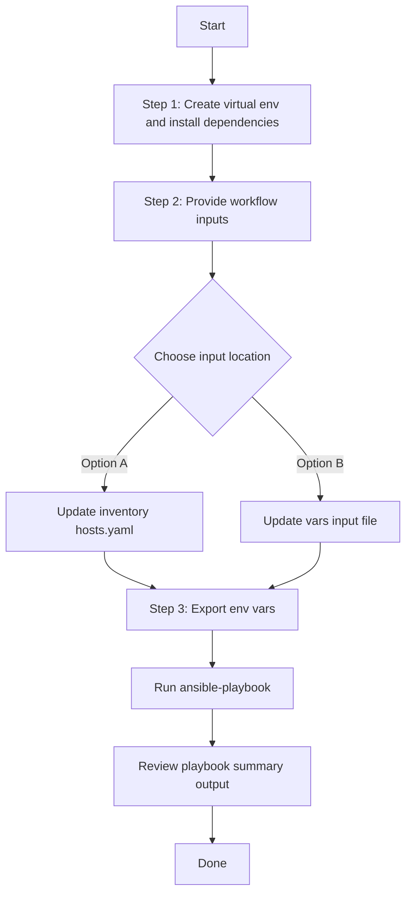

# Application Policy Config Generator

## Table of Contents

- [User Flow (3 Steps)](#user-flow-3-steps)

- [Overview](#overview)
- [Features](#features)
- [Prerequisites](#prerequisites)
- [Workflow Structure](#workflow-structure)
- [Schema Parameters](#schema-parameters)
- [Getting Started](#getting-started)
- [Operations](#operations)
- [Examples](#examples)---

## Overview

The Application Policy config generator automates YAML playbook generation for existing application policies and queuing profiles in Cisco Catalyst Center. It generates output compatible with `application_policy_workflow_manager`.

---

## Features

- **Configuration Generation**: Generate YAML configurations compatible with `application_policy_workflow_manager`.
  - Extract application policies and queuing profiles from Catalyst Center.
  - Convert API responses into workflow-manager-ready YAML.
  - Reuse generated files for backup, migration, and audit.
- **Component Filtering**: Generate `queuing_profile`, `application_policy`, or both.
- **Name Filtering**: Filter with `profile_names_list` and `policy_names_list`.
- **Flexible Output**: Supports custom `file_path` and `file_mode` (`overwrite` / `append`).
- **Brownfield Discovery**: Omit `config` (or use workflow convenience flag) to generate all supported configurations.

---

## Prerequisites

### Software Requirements

| Component | Version |
|-----------|---------|
| Ansible | 2.13+ |
| cisco.dnac collection | 6.44.0+ |
| Python | 3.9+ |
| Cisco Catalyst Center | 2.3.7.9+ |
| dnacentersdk | 2.9.3+ |

### Required Collections

```bash
ansible-galaxy collection install cisco.dnac
ansible-galaxy collection install ansible.utils
pip install dnacentersdk
pip install yamale
```

### Access Requirements

- Catalyst Center credentials with application policy API access
- Network connectivity to Catalyst Center
- Existing app policy and queuing profile data (for targeted export use cases)

---

## Workflow Structure

```
application_policy_config_generator/
├── playbook/
│   └── application_policy_config_generator.yml    # Main operations
├── vars/
│   └── application_policy_config_inputs.yml       # Input examples
├── schema/
│   └── application_policy_config_schema.yml       # Input validation
└── README.md
```

---

## Schema Parameters

### Basic Configuration

| Parameter | Type | Required | Default | Description |
|-----------|------|----------|---------|-------------|
| `generate_all_configurations` | boolean | No | false | Workflow convenience flag. When true, playbook omits module `config` |
| `file_path` | string | No | auto-generated | Output file path for generated YAML |
| `file_mode` | string | No | `overwrite` | File write mode: `overwrite` or `append` |
| `component_specific_filters` | dict | No | omitted | Component and filters passed to module `config` |

### Component Filters

| Parameter | Type | Required | Description |
|-----------|------|----------|-------------|
| `components_list` | list[string] | No | Supported values: `queuing_profile`, `application_policy` |
| `queuing_profile` | dict | No | Queuing profile filters (`profile_names_list`) |
| `application_policy` | dict | No | Application policy filters (`policy_names_list`) |

---

## Getting Started

## Workflow Steps
## User Flow (3 Steps)



### Installation and Run (Aligned)

1. Create and activate a Python virtual environment, then install dependencies.

```bash
python3 -m venv .venv
source .venv/bin/activate
pip install -r requirements.txt
ansible-galaxy collection install cisco.dnac --force
```

2. Provide workflow inputs in either inventory (`inventory/demo_lab/hosts.yaml`) or the workflow `vars/` file.

3. Export Catalyst Center environment variables and run the playbook.

```bash
export HOSTIP=<catalyst-center-ip-or-fqdn>
export CATALYST_CENTER_USERNAME=<username>
export CATALYST_CENTER_PASSWORD='<password>'
ansible-playbook -i ./inventory/demo_lab/hosts.yaml ./workflows/application_policy_config_generator/playbook/application_policy_config_generator.yml -vvvv
```


## Operations

### Generate Operations (state: gathered)

1. **Generate all application policy data**
- Set `generate_all_configurations: true`.

2. **Generate queuing profiles only**
- Use `components_list: ["queuing_profile"]` and optional `profile_names_list`.

3. **Generate application policies only**
- Use `components_list: ["application_policy"]` and optional `policy_names_list`.

4. **Append generated output**
- Set `file_mode: append`.

---

## Examples

### Example 1: Generate all queuing profiles and application policies

```yaml
application_policy_config:
  - generate_all_configurations: true
    file_path: "/tmp/application_policy_complete_config.yml"
```

### Example 2: Filter queuing profiles by names

```yaml
application_policy_config:
  - file_path: "/tmp/application_policy_queuing_profiles.yml"
    component_specific_filters:
      components_list: ["queuing_profile"]
      queuing_profile:
        profile_names_list: ["Enterprise-QoS-Profile", "Wireless-QoS-Profile"]
```

### Example 3: Filter application policies by names

```yaml
application_policy_config:
  - file_path: "/tmp/application_policy_policies.yml"
    component_specific_filters:
      components_list: ["application_policy"]
      application_policy:
        policy_names_list: ["wired_traffic_policy", "wireless_traffic_policy"]
```

---

## Notes

- `application_policy_playbook_config_generator` expects `config` as a dictionary when filters are used.
- This workflow omits `config` when filters are absent, which triggers full generation mode.
- If component filters are provided without `components_list`, the module can auto-populate `components_list` internally.
