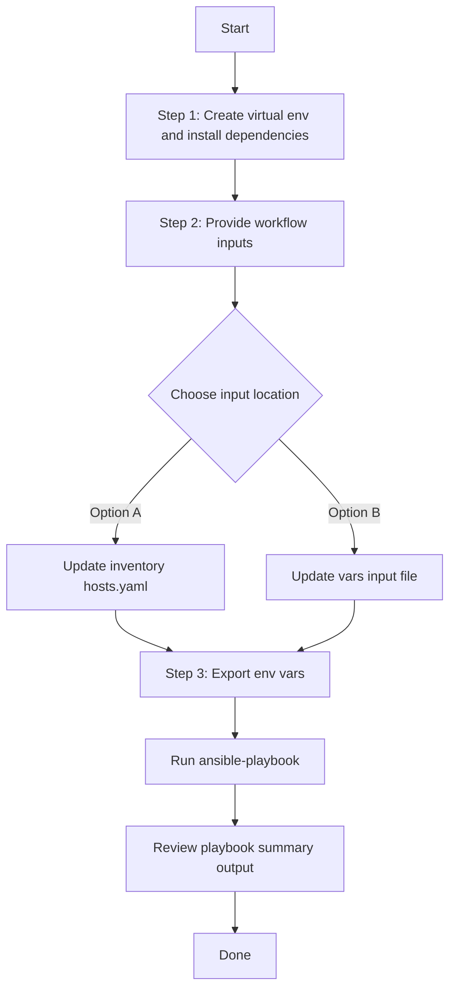

# Application Policy Config Generator

## Table of Contents

- [User Flow (3 Steps)](#user-flow-3-steps)
- [Overview](#overview)
- [Features](#features)
- [Prerequisites](#prerequisites)
- [Workflow Structure](#workflow-structure)
- [Schema Parameters](#schema-parameters)
- [Getting Started](#getting-started)
- [Operations](#operations)
- [Examples](#examples)

## Overview

The Application Policy config generator automates YAML playbook generation for existing application policies and queuing profiles in Cisco Catalyst Center. It generates output compatible with `application_policy_workflow_manager`.

---

## Features

- **Configuration Generation**: Generate YAML configurations compatible with `application_policy_workflow_manager`.
  - Extract application policies and queuing profiles from Catalyst Center.
  - Convert API responses into workflow-manager-ready YAML.
  - Reuse generated files for backup, migration, and audit.
- **Component Filtering**: Generate `queuing_profile`, `application_policy`, or both.
- **Name Filtering**: Filter with `profile_names_list` and `policy_names_list`.
- **Flexible Output**: Supports custom `file_path` and `file_mode` (`overwrite` / `append`).
- **Brownfield Discovery**: Omit `config` to generate all supported configurations.

---

## Prerequisites

### Software Requirements

| Component | Version |
|-----------|---------|
| Ansible | 2.13+ |
| cisco.catalystcenter collection | 6.44.0+ |
| Python | 3.9+ |
| Cisco Catalyst Center | 2.3.7.9+ |
| catalystcentersdk | 2.9.3+ |

### Required Collections

```bash
ansible-galaxy collection install cisco.catalystcenter
ansible-galaxy collection install ansible.utils
pip install catalystcentersdk
pip install yamale
```

### Access Requirements

- Catalyst Center credentials with application policy API access
- Network connectivity to Catalyst Center
- Existing app policy and queuing profile data (for targeted export use cases)

---

## Workflow Structure

```
application_policy_config_generator/
├── playbook/
│   └── application_policy_config_generator.yml    # Main operations
├── vars/
│   └── application_policy_config_inputs.yml       # Input examples
├── schema/
│   └── application_policy_config_schema.yml       # Input validation
└── README.md
```

---

## Schema Parameters

### Basic Configuration

| Parameter | Type | Required | Default | Description |
|-----------|------|----------|---------|-------------|
| `config` | dict | No | omitted | Module `config` dict. Must include `component_specific_filters` when provided. Omit to generate all components (full discovery) |
| `file_path` | string | No | auto-generated | Output file path for generated YAML. Format when auto-generated: `application_policy_workflow_manager_playbook_<DD_Mon_YYYY_HH_MM_SS_MS>.yml` |
| `file_mode` | string | No | `overwrite` | File write mode: `overwrite` or `append` |

### Component Filters (`config.component_specific_filters`)

| Parameter | Type | Required | Description |
|-----------|------|----------|-------------|
| `components_list` | list[string] | No | Supported values: `queuing_profile`, `application_policy`. Auto-populated when filter blocks are provided |
| `queuing_profile` | list[dict] | No | Queuing profile filter entries (`profile_names_list`) |
| `application_policy` | list[dict] | No | Application policy filter entries (`policy_names_list`) |

---

## Getting Started

## Workflow Steps
## User Flow (3 Steps)



### Installation and Run (Aligned)

1. Create and activate a Python virtual environment, then install dependencies.

```bash
python3 -m venv .venv
source .venv/bin/activate
pip install -r requirements.txt
ansible-galaxy collection install cisco.catalystcenter --force
```

2. Provide workflow inputs in either inventory (`inventory/demo_lab/hosts.yaml`) or the workflow `vars/` file.

3. Export Catalyst Center environment variables and run the playbook.

```bash
export HOSTIP=<catalyst-center-ip-or-fqdn>
export CATALYST_CENTER_USERNAME=<username>
export CATALYST_CENTER_PASSWORD='<password>'
ansible-playbook -i ./inventory/demo_lab/hosts.yaml \
  ./workflows/application_policy_config_generator/playbook/application_policy_config_generator.yml \
  --extra-vars VARS_FILE_PATH=$(pwd)/workflows/application_policy_config_generator/vars/application_policy_config_inputs.yml \
  -vvvv
```


## Operations

### Generate Operations (state: gathered)

Pass `config` with `component_specific_filters` for targeted export. Omit `config` entirely to trigger full discovery (all components).

1. **Generate all application policy data** — omit `config`
2. **Generate queuing profiles only** — use `config.component_specific_filters.components_list: ["queuing_profile"]` with optional `queuing_profile` list filter
3. **Generate application policies only** — use `config.component_specific_filters.components_list: ["application_policy"]` with optional `application_policy` list filter
4. **Append generated output** — set `file_mode: append`

**Validate and Execute:**

```bash
# Validate
./tools/schemavalidation.sh \
  -s workflows/application_policy_config_generator/schema/application_policy_config_schema.yml \
  -v workflows/application_policy_config_generator/vars/application_policy_config_inputs.yml
```

Expected validation output:
```
Validating workflows/application_policy_config_generator/vars/application_policy_config_inputs.yml...
Validation success! 👍
```

```bash
# Execute
ansible-playbook -i inventory/demo_lab/hosts.yaml \
  workflows/application_policy_config_generator/playbook/application_policy_config_generator.yml \
  --extra-vars VARS_FILE_PATH=$(pwd)/workflows/application_policy_config_generator/vars/application_policy_config_inputs.yml
```

---

## Examples

### Example 1: Generate all application policy configurations

Omit `config` — module retrieves all queuing profiles and application policies.

```yaml
application_policy_config:
  - file_path: "application_policy_config/complete_config.yml"
```

### Example 2: Filter queuing profiles by name

```yaml
application_policy_config:
  - file_path: "application_policy_config/queuing_profiles.yml"
    config:
      component_specific_filters:
        components_list: ["queuing_profile"]
        queuing_profile:
          - profile_names_list: ["Enterprise-QoS-Profile", "Wireless-QoS-Profile"]
```

### Example 3: Filter application policies by name

```yaml
application_policy_config:
  - file_path: "application_policy_config/policies.yml"
    config:
      component_specific_filters:
        components_list: ["application_policy"]
        application_policy:
          - policy_names_list: ["wired_traffic_policy", "wireless_traffic_policy"]
```

### Example 4: Combined queuing profiles + policies with append mode

```yaml
application_policy_config:
  - file_path: "application_policy_config/combined.yml"
    file_mode: append
    config:
      component_specific_filters:
        components_list: ["queuing_profile", "application_policy"]
        queuing_profile:
          - profile_names_list: ["Enterprise-QoS-Profile"]
        application_policy:
          - policy_names_list: ["wired_traffic_policy", "wireless_traffic_policy"]
```

---

## Notes

- Omit `config` entirely to run in full discovery mode (all components).
- When `config` is provided, `component_specific_filters` is mandatory.
- `queuing_profile` and `application_policy` under `component_specific_filters` are **lists of dicts**.
- The module auto-adds the corresponding component to `components_list` when a filter block is provided but `components_list` is omitted.
