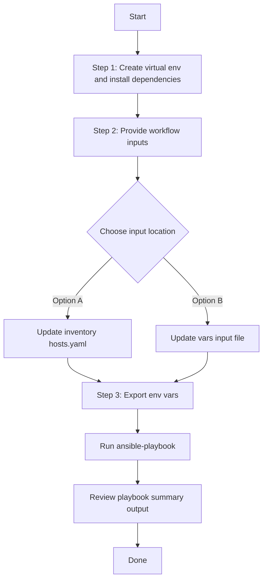

# Assurance Device Health Score Settings Config Generator

## Table of Contents

- [User Flow (3 Steps)](#user-flow-3-steps)
- [Overview](#overview)
- [Features](#features)
- [Prerequisites](#prerequisites)
- [Workflow Structure](#workflow-structure)
- [Schema Parameters](#schema-parameters)
- [Getting Started](#getting-started)
- [Operations](#operations)
- [Examples](#examples)
---

## Overview

The Assurance Device Health Score Settings config generator automates YAML playbook generation for existing device health KPI threshold settings in Cisco Catalyst Center. It generates output compatible with `assurance_device_health_score_settings_workflow_manager`.

---

## Features

- **Configuration Generation**: Generate YAML configurations compatible with `assurance_device_health_score_settings_workflow_manager`.
  - Extract KPI threshold settings by device family.
  - Convert API responses into workflow-manager-ready YAML.
  - Reuse generated files for backup, migration, and audit.
- **Component Filtering**: Generate `device_health_score_settings` selectively.
- **Family Filtering**: Filter by device family list.
- **Flexible Output**: Supports custom `file_path` and `file_mode` (`overwrite` / `append`).
- **Brownfield Discovery**: Omit `config` to generate all configured device health score settings.

---

## Prerequisites

### Software Requirements

| Component | Version |
|-----------|---------|
| Ansible | 2.13+ |
| cisco.dnac collection | 6.44.0+ |
| Python | 3.9+ |
| Cisco Catalyst Center | 2.3.7.9+ |
| dnacentersdk | 2.7.2+ |

### Required Collections

```bash
ansible-galaxy collection install cisco.dnac    # >= 6.44.0
ansible-galaxy collection install ansible.utils
pip install dnacentersdk
pip install yamale
```

### Access Requirements

- Catalyst Center credentials with assurance health score API access
- Network connectivity to Catalyst Center
- Existing assurance device health score settings for targeted export use cases

---

## Workflow Structure

```
assurance_device_health_score_settings_config_generator/
├── playbook/
│   └── assurance_device_health_score_settings_config_generator.yml    # Main operations
├── vars/
│   └── assurance_device_health_score_settings_config_inputs.yml       # Input examples
├── schema/
│   └── assurance_device_health_score_settings_config_schema.yml       # Input validation
└── README.md
```

---

## Schema Parameters

### Basic Configuration

| Parameter | Type | Required | Default | Description |
|-----------|------|----------|---------|-------------|
| `file_path` | string | No | auto-generated | Output file path for generated YAML |
| `file_mode` | string | No | `overwrite` | File write mode: `overwrite` or `append` |
| `config` | dict | No | omitted | Optional module config wrapper. Omit it to gather all settings |
| `component_specific_filters` | dict | Yes if `config` is provided | none | Component filter block inside `config` |

### Supported Components

- `device_health_score_settings`

### Device Family Filter Values

| Filter Value | Description |
|-------------|-------------|
| `ROUTER` | Router devices |
| `SWITCH_AND_HUB` | Switches and hubs |
| `WIRELESS_CONTROLLER` | Wireless controllers |
| `UNIFIED_AP` | Unified access points |
| `WIRELESS_CLIENT` | Wireless client devices |
| `WIRED_CLIENT` | Wired client devices |

### Filter Specifications

#### components_list
- **Type**: List of strings
- **Allowed Values**: `["device_health_score_settings"]`
- **Case-sensitive**: Must match exactly
- **Behavior**: Specifies which component type to generate

#### device_families
- **Type**: List of strings
- **Allowed Values**: `ROUTER`, `SWITCH_AND_HUB`, `WIRELESS_CONTROLLER`, `UNIFIED_AP`, `WIRELESS_CLIENT`, `WIRED_CLIENT`
- **Case-sensitive**: Must match exactly
- **Behavior**: Returns health score settings for only the specified device families

---

## Getting Started

## Workflow Steps
## User Flow (3 Steps)



### Installation and Run (Aligned)

1. Create and activate a Python virtual environment, then install dependencies.

```bash
python3 -m venv .venv
source .venv/bin/activate
pip install -r requirements.txt
ansible-galaxy collection install cisco.dnac --force
```

2. Provide workflow inputs in either inventory (`inventory/demo_lab/hosts.yaml`) or the workflow `vars/` file.

3. Export Catalyst Center environment variables and run the playbook.

```bash
export HOSTIP=<catalyst-center-ip-or-fqdn>
export CATALYST_CENTER_USERNAME=<username>
export CATALYST_CENTER_PASSWORD='<password>'
ansible-playbook -i ./inventory/demo_lab/hosts.yaml ./workflows/assurance_device_health_score_settings_config_generator/playbook/assurance_device_health_score_settings_config_generator.yml -vvvv
```


## Operations

### Generate Operations (state: gathered)

Use `assurance_device_health_score_settings_config_generator.yml` for generating YAML playbook configuration operations.

#### Generate All Device Health Score Settings

**Description**: Retrieves all device health score KPI threshold settings from Catalyst Center. Omit `config` to trigger full generation mode.

```yaml
assurance_device_health_score_settings_config:
  - file_path: "/tmp/assurance_device_health_score_settings_complete_config.yml"
    file_mode: "overwrite"
```

#### Generate Component Output Only

**Description**: Generates device health score settings with component filter specified but no device family filter.

```yaml
assurance_device_health_score_settings_config:
  - file_path: "/tmp/assurance_device_health_score_settings_component.yml"
    file_mode: "overwrite"
    config:
      component_specific_filters:
        components_list: ["device_health_score_settings"]
```

#### Filter by Device Families

**Description**: Generates health score settings for specific device families only.

```yaml
assurance_device_health_score_settings_config:
  - file_path: "/tmp/assurance_device_health_score_settings_family_filter.yml"
    file_mode: "overwrite"
    config:
      component_specific_filters:
        components_list: ["device_health_score_settings"]
        device_health_score_settings:
          - device_families:
              - "UNIFIED_AP"
              - "ROUTER"
              - "SWITCH_AND_HUB"
```

#### Append Mode Generation

**Description**: Appends generated output to an existing file instead of overwriting.

```yaml
assurance_device_health_score_settings_config:
  - file_path: "/tmp/assurance_device_health_score_settings_aggregate.yml"
    file_mode: "append"
    config:
      component_specific_filters:
        components_list: ["device_health_score_settings"]
        device_health_score_settings:
          - device_families:
              - "WIRELESS_CONTROLLER"
              - "WIRED_CLIENT"
```

**Validate and Execute:**

```bash
# Validate
./tools/schemavalidation.sh \
  -s workflows/assurance_device_health_score_settings_config_generator/schema/assurance_device_health_score_settings_config_schema.yml \
  -v workflows/assurance_device_health_score_settings_config_generator/vars/assurance_device_health_score_settings_config_inputs.yml
```
**Return result validate:**
```bash
(pyats-priya) [pbalaku2@st-ds-4 dnac_ansible_workflows]$ ./tools/validate.sh -s workflows/assurance_device_health_score_settings_config_generator/schema/assurance_device_health_score_settings_config_schema.yml \
>                    -d workflows/assurance_device_health_score_settings_config_generator/vars/assurance_device_health_score_settings_config_inputs.yml
workflows/assurance_device_health_score_settings_config_generator/schema/assurance_device_health_score_settings_config_schema.yml
workflows/assurance_device_health_score_settings_config_generator/vars/assurance_device_health_score_settings_config_inputs.yml
yamale   -s workflows/assurance_device_health_score_settings_config_generator/schema/assurance_device_health_score_settings_config_schema.yml  workflows/assurance_device_health_score_settings_config_generator/vars/assurance_device_health_score_settings_config_inputs.yml
Validating workflows/assurance_device_health_score_settings_config_generator/vars/assurance_device_health_score_settings_config_inputs.yml...
Validation success! 👍
```

```bash
# Execute
ansible-playbook -i inventory/demo_lab/hosts.yaml \
  workflows/assurance_device_health_score_settings_config_generator/playbook/assurance_device_health_score_settings_config_generator.yml \
  --extra-vars VARS_FILE_PATH=../vars/assurance_device_health_score_settings_config_inputs.yml
```

**Expected Terminal Output:**

1. **Generate All Device Health Score Settings**

```code
        file_path: /tmp/assurance_device_health_score_settings_complete_config.yml
        file_mode: overwrite
      msg:
        YAML config generation Task succeeded for module 'assurance_device_health_score_settings'.:
          file_path: /tmp/assurance_device_health_score_settings_complete_config.yml
      response:
        YAML config generation Task succeeded for module 'assurance_device_health_score_settings'.:
          file_path: /tmp/assurance_device_health_score_settings_complete_config.yml
      status: success
```

2. **Component Output Only:**

```code
        config:
          component_specific_filters:
            components_list:
            - device_health_score_settings
        file_path: /tmp/assurance_device_health_score_settings_component.yml
      msg:
        YAML config generation Task succeeded for module 'assurance_device_health_score_settings'.:
          file_path: /tmp/assurance_device_health_score_settings_component.yml
      response:
        YAML config generation Task succeeded for module 'assurance_device_health_score_settings'.:
          file_path: /tmp/assurance_device_health_score_settings_component.yml
      status: success
```

3. **Device Family Filtered Generation:**

```code
        config:
          component_specific_filters:
            components_list:
            - device_health_score_settings
            device_health_score_settings:
              device_families:
              - UNIFIED_AP
              - ROUTER
              - SWITCH_AND_HUB
        file_path: /tmp/assurance_device_health_score_settings_family_filter.yml
      msg:
        YAML config generation Task succeeded for module 'assurance_device_health_score_settings'.:
          file_path: /tmp/assurance_device_health_score_settings_family_filter.yml
      response:
        YAML config generation Task succeeded for module 'assurance_device_health_score_settings'.:
          file_path: /tmp/assurance_device_health_score_settings_family_filter.yml
      status: success
```

4. **Append Mode Generation:**

```code
        config:
          component_specific_filters:
            components_list:
            - device_health_score_settings
            device_health_score_settings:
              device_families:
              - WIRELESS_CONTROLLER
              - WIRED_CLIENT
        file_path: /tmp/assurance_device_health_score_settings_aggregate.yml
        file_mode: append
      msg:
        YAML config generation Task succeeded for module 'assurance_device_health_score_settings'.:
          file_path: /tmp/assurance_device_health_score_settings_aggregate.yml
      response:
        YAML config generation Task succeeded for module 'assurance_device_health_score_settings'.:
          file_path: /tmp/assurance_device_health_score_settings_aggregate.yml
      status: success
```

---

## Examples

### Example 1: Generate ALL device health score settings

```yaml
assurance_device_health_score_settings_config:
  - file_path: "/tmp/assurance_device_health_score_settings_complete_config.yml"
    file_mode: "overwrite"
```
**Sample Generated Output**:

Below is a sample YAML configuration file generated by the module when `config` is omitted:

```yaml
---
config:
- device_health_score:
  - device_family: ROUTER
    kpi_name: CPU Utilization
    include_for_overall_health: true
    threshold_value: 95.0
    synchronize_to_issue_threshold: false
  - device_family: ROUTER
    kpi_name: Memory Utilization
    include_for_overall_health: true
    threshold_value: 95.0
    synchronize_to_issue_threshold: false
  - device_family: ROUTER
    kpi_name: Link Error
    include_for_overall_health: true
    threshold_value: 1.0
    synchronize_to_issue_threshold: false
  - device_family: ROUTER
    kpi_name: Link Discard
    include_for_overall_health: true
    threshold_value: 10.0
    synchronize_to_issue_threshold: false
  - device_family: ROUTER
    kpi_name: Fabric Control Plane Reachability
    include_for_overall_health: true
    threshold_value: 0.0
    synchronize_to_issue_threshold: false
  - device_family: ROUTER
    kpi_name: Fabric Multicast RP Reachability
    include_for_overall_health: true
    threshold_value: 0.0
    synchronize_to_issue_threshold: false
  - device_family: ROUTER
    kpi_name: LISP Session Status
    include_for_overall_health: true
    threshold_value: 0.0
    synchronize_to_issue_threshold: false
  - device_family: ROUTER
    kpi_name: LISP Session from Border to Transit Site Control Plane
    include_for_overall_health: true
    threshold_value: 0.0
    synchronize_to_issue_threshold: false
  - device_family: ROUTER
    kpi_name: Pub-Sub Session Status
    include_for_overall_health: true
    threshold_value: 0.0
    synchronize_to_issue_threshold: false
  - device_family: ROUTER
    kpi_name: Pub-Sub Session from Border to Transit Site Control Plane
    include_for_overall_health: true
    threshold_value: 0.0
    synchronize_to_issue_threshold: false
  - device_family: ROUTER
    kpi_name: Pub-Sub Session Status for INFRA VN
    include_for_overall_health: true
    threshold_value: 0.0
    synchronize_to_issue_threshold: false
  - device_family: ROUTER
    kpi_name: Extended Node Connectivity
    include_for_overall_health: true
    threshold_value: 0.0
    synchronize_to_issue_threshold: false
  - device_family: ROUTER
    kpi_name: Inter-device Link Availability
    include_for_overall_health: true
    threshold_value: 0.0
    synchronize_to_issue_threshold: false
  - device_family: ROUTER
    kpi_name: Link Utilization
    include_for_overall_health: true
    threshold_value: 90.0
    synchronize_to_issue_threshold: false
  - device_family: ROUTER
    kpi_name: Internet Availability
    include_for_overall_health: true
    threshold_value: 0.0
    synchronize_to_issue_threshold: false
  - device_family: ROUTER
    kpi_name: BGP Session from Border to Control Plane (BGP)
    include_for_overall_health: true
    threshold_value: 0.0
    synchronize_to_issue_threshold: false
  - device_family: ROUTER
    kpi_name: BGP Session to Spine
    include_for_overall_health: true
    threshold_value: 0.0
    synchronize_to_issue_threshold: false
  - device_family: ROUTER
    kpi_name: BGP Session from Border to Peer Node
    include_for_overall_health: true
    threshold_value: 0.0
    synchronize_to_issue_threshold: false
  - device_family: ROUTER
    kpi_name: VNI Status
    include_for_overall_health: true
    threshold_value: 0.0
    synchronize_to_issue_threshold: false
  - device_family: ROUTER
    kpi_name: Peer Status
    include_for_overall_health: true
    threshold_value: 0.0
    synchronize_to_issue_threshold: false
  - device_family: ROUTER
    kpi_name: BGP Session from Border to Control Plane (PubSub)
    include_for_overall_health: true
    threshold_value: 0.0
    synchronize_to_issue_threshold: false
  - device_family: ROUTER
    kpi_name: BGP Session from Border to Transit Control Plane
    include_for_overall_health: true
    threshold_value: 0.0
    synchronize_to_issue_threshold: false
  - device_family: ROUTER
    kpi_name: BGP Session from Border to Peer Node for INFRA VN
    include_for_overall_health: true
    threshold_value: 0.0
    synchronize_to_issue_threshold: false
  - device_family: ROUTER
    kpi_name: Cisco TrustSec environment data download status
    include_for_overall_health: true
    threshold_value: 0.0
    synchronize_to_issue_threshold: false
  - device_family: ROUTER
    kpi_name: Remote Internet Availability
    include_for_overall_health: true
    threshold_value: 0.0
    synchronize_to_issue_threshold: false
  - device_family: SWITCH_AND_HUB
    kpi_name: CPU Utilization
    include_for_overall_health: true
    threshold_value: 95.0
    synchronize_to_issue_threshold: false
  - device_family: SWITCH_AND_HUB
    kpi_name: Memory Utilization
    include_for_overall_health: true
    threshold_value: 95.0
    synchronize_to_issue_threshold: false
  - device_family: SWITCH_AND_HUB
    kpi_name: Link Error
    include_for_overall_health: true
    threshold_value: 1.0
    synchronize_to_issue_threshold: false
  - device_family: SWITCH_AND_HUB
    kpi_name: Link Discard
    include_for_overall_health: true
    threshold_value: 10.0
    synchronize_to_issue_threshold: false
  - device_family: SWITCH_AND_HUB
    kpi_name: Fabric Control Plane Reachability
    include_for_overall_health: true
    threshold_value: 0.0
    synchronize_to_issue_threshold: false
  - device_family: SWITCH_AND_HUB
    kpi_name: Fabric Multicast RP Reachability
    include_for_overall_health: true
    threshold_value: 0.0
    synchronize_to_issue_threshold: false
  - device_family: SWITCH_AND_HUB
    kpi_name: AAA server reachability
    include_for_overall_health: true
    threshold_value: 0.0
    synchronize_to_issue_threshold: false
  - device_family: SWITCH_AND_HUB
    kpi_name: LISP Session Status
    include_for_overall_health: true
    threshold_value: 0.0
    synchronize_to_issue_threshold: false
  - device_family: SWITCH_AND_HUB
    kpi_name: LISP Session from Border to Transit Site Control Plane
    include_for_overall_health: true
    threshold_value: 0.0
    synchronize_to_issue_threshold: false
  - device_family: SWITCH_AND_HUB
    kpi_name: Pub-Sub Session Status
    include_for_overall_health: true
    threshold_value: 0.0
    synchronize_to_issue_threshold: false
  - device_family: SWITCH_AND_HUB
    kpi_name: Pub-Sub Session from Border to Transit Site Control Plane
    include_for_overall_health: true
    threshold_value: 0.0
    synchronize_to_issue_threshold: false
  - device_family: SWITCH_AND_HUB
    kpi_name: Pub-Sub Session Status for INFRA VN
    include_for_overall_health: true
    threshold_value: 0.0
    synchronize_to_issue_threshold: false
  - device_family: SWITCH_AND_HUB
    kpi_name: Extended Node Connectivity
    include_for_overall_health: true
    threshold_value: 0.0
    synchronize_to_issue_threshold: false
  - device_family: SWITCH_AND_HUB
    kpi_name: Inter-device Link Availability
    include_for_overall_health: true
    threshold_value: 0.0
    synchronize_to_issue_threshold: false
  - device_family: SWITCH_AND_HUB
    kpi_name: Internet Availability
    include_for_overall_health: true
    threshold_value: 0.0
    synchronize_to_issue_threshold: false
  - device_family: SWITCH_AND_HUB
    kpi_name: BGP Session from Border to Control Plane (BGP)
    include_for_overall_health: true
    threshold_value: 0.0
    synchronize_to_issue_threshold: false
  - device_family: SWITCH_AND_HUB
    kpi_name: BGP Session to Spine
    include_for_overall_health: true
    threshold_value: 0.0
    synchronize_to_issue_threshold: false
  - device_family: SWITCH_AND_HUB
    kpi_name: BGP Session from Border to Peer Node
    include_for_overall_health: true
    threshold_value: 0.0
    synchronize_to_issue_threshold: false
  - device_family: SWITCH_AND_HUB
    kpi_name: VNI Status
    include_for_overall_health: true
    threshold_value: 0.0
    synchronize_to_issue_threshold: false
  - device_family: SWITCH_AND_HUB
    kpi_name: Peer Status
    include_for_overall_health: true
    threshold_value: 0.0
    synchronize_to_issue_threshold: false
  - device_family: SWITCH_AND_HUB
    kpi_name: BGP Session from Border to Control Plane (PubSub)
    include_for_overall_health: true
    threshold_value: 0.0
    synchronize_to_issue_threshold: false
  - device_family: SWITCH_AND_HUB
    kpi_name: BGP Session from Border to Transit Control Plane
    include_for_overall_health: true
    threshold_value: 0.0
    synchronize_to_issue_threshold: false
  - device_family: SWITCH_AND_HUB
    kpi_name: BGP Session from Border to Peer Node for INFRA VN
    include_for_overall_health: true
    threshold_value: 0.0
    synchronize_to_issue_threshold: false
  - device_family: SWITCH_AND_HUB
    kpi_name: Cisco TrustSec environment data download status
    include_for_overall_health: true
    threshold_value: 0.0
    synchronize_to_issue_threshold: false
  - device_family: SWITCH_AND_HUB
    kpi_name: Remote Internet Availability
    include_for_overall_health: true
    threshold_value: 0.0
    synchronize_to_issue_threshold: false
  - device_family: UNIFIED_AP
    kpi_name: CPU Utilization
    include_for_overall_health: true
    threshold_value: 90.0
    synchronize_to_issue_threshold: false
  - device_family: UNIFIED_AP
    kpi_name: Memory Utilization
    include_for_overall_health: true
    threshold_value: 90.0
    synchronize_to_issue_threshold: false
  - device_family: UNIFIED_AP
    kpi_name: Link Error
    include_for_overall_health: true
    threshold_value: 1.0
    synchronize_to_issue_threshold: false
  - device_family: UNIFIED_AP
    kpi_name: Interference 2.4 GHz
    include_for_overall_health: true
    threshold_value: 50.0
    synchronize_to_issue_threshold: false
  - device_family: UNIFIED_AP
    kpi_name: Interference 5 GHz
    include_for_overall_health: true
    threshold_value: 20.0
    synchronize_to_issue_threshold: false
  - device_family: UNIFIED_AP
    kpi_name: Interference 6 GHz
    include_for_overall_health: true
    threshold_value: 20.0
    synchronize_to_issue_threshold: false
  - device_family: UNIFIED_AP
    kpi_name: Noise 2.4 GHz
    include_for_overall_health: true
    threshold_value: -81.0
    synchronize_to_issue_threshold: false
  - device_family: UNIFIED_AP
    kpi_name: Noise 5 GHz
    include_for_overall_health: true
    threshold_value: -83.0
    synchronize_to_issue_threshold: false
  - device_family: UNIFIED_AP
    kpi_name: Noise 6 GHz
    include_for_overall_health: true
    threshold_value: -83.0
    synchronize_to_issue_threshold: false
  - device_family: UNIFIED_AP
    kpi_name: RF Utilization 2.4 GHz
    include_for_overall_health: true
    threshold_value: 70.0
    synchronize_to_issue_threshold: false
  - device_family: UNIFIED_AP
    kpi_name: RF Utilization 5 GHz
    include_for_overall_health: true
    threshold_value: 70.0
    synchronize_to_issue_threshold: false
  - device_family: UNIFIED_AP
    kpi_name: RF Utilization 6 GHz
    include_for_overall_health: true
    threshold_value: 70.0
    synchronize_to_issue_threshold: false
  - device_family: UNIFIED_AP
    kpi_name: Air Quality 2.4 GHz
    include_for_overall_health: true
    threshold_value: 60.0
    synchronize_to_issue_threshold: false
  - device_family: UNIFIED_AP
    kpi_name: Air Quality 5 GHz
    include_for_overall_health: true
    threshold_value: 75.0
    synchronize_to_issue_threshold: false
  - device_family: UNIFIED_AP
    kpi_name: Air Quality 6 GHz
    include_for_overall_health: true
    threshold_value: 75.0
    synchronize_to_issue_threshold: false
  - device_family: WIRED_CLIENT
    kpi_name: Link Error
    include_for_overall_health: true
    threshold_value: 10.0
    synchronize_to_issue_threshold: false
  - device_family: WIRELESS_CLIENT
    kpi_name: Connectivity RSSI
    include_for_overall_health: true
    threshold_value: -72.0
    synchronize_to_issue_threshold: false
  - device_family: WIRELESS_CLIENT
    kpi_name: Connectivity SNR
    include_for_overall_health: true
    threshold_value: 9.0
    synchronize_to_issue_threshold: false
  - device_family: WIRELESS_CONTROLLER
    kpi_name: Fabric Control Plane Reachability
    include_for_overall_health: true
    threshold_value: 0.0
    synchronize_to_issue_threshold: false
  - device_family: WIRELESS_CONTROLLER
    kpi_name: Memory Utilization
    include_for_overall_health: true
    threshold_value: 95.0
    synchronize_to_issue_threshold: false
  - device_family: WIRELESS_CONTROLLER
    kpi_name: Link Error
    include_for_overall_health: true
    threshold_value: 1.0
    synchronize_to_issue_threshold: false
  - device_family: WIRELESS_CONTROLLER
    kpi_name: LISP Session Status
    include_for_overall_health: true
    threshold_value: 0.0
    synchronize_to_issue_threshold: false
  - device_family: WIRELESS_CONTROLLER
    kpi_name: Free Timer
    include_for_overall_health: true
    threshold_value: 20.0
    synchronize_to_issue_threshold: false
  - device_family: WIRELESS_CONTROLLER
    kpi_name: Free Mbuf
    include_for_overall_health: true
    threshold_value: 20.0
    synchronize_to_issue_threshold: false
  - device_family: WIRELESS_CONTROLLER
    kpi_name: WQE Pool
    include_for_overall_health: true
    threshold_value: 0.0
    synchronize_to_issue_threshold: false
  - device_family: WIRELESS_CONTROLLER
    kpi_name: Packet Pool
    include_for_overall_health: true
    threshold_value: 0.0
    synchronize_to_issue_threshold: false
```

### Example 2: Filter by Selected Device Families

Extract health score settings for specific device families only.

```yaml
assurance_device_health_score_settings_config:
  - file_path: "/tmp/assurance_device_health_score_settings_family_filter.yml"
    file_mode: "overwrite"
    config:
      component_specific_filters:
        components_list: ["device_health_score_settings"]
        device_health_score_settings:
          device_families:
            - "UNIFIED_AP"
            - "ROUTER"
            - "SWITCH_AND_HUB"
```
**Sample Generated Output**:

Below is a sample YAML configuration file generated by the module when `device_families` filter is used:

```yaml
---
config:
- device_health_score:
  - device_family: ROUTER
    kpi_name: CPU Utilization
    include_for_overall_health: true
    threshold_value: 95.0
    synchronize_to_issue_threshold: false
  - device_family: ROUTER
    kpi_name: Memory Utilization
    include_for_overall_health: true
    threshold_value: 95.0
    synchronize_to_issue_threshold: false
  - device_family: SWITCH_AND_HUB
    kpi_name: CPU Utilization
    include_for_overall_health: true
    threshold_value: 95.0
    synchronize_to_issue_threshold: false
  - device_family: SWITCH_AND_HUB
    kpi_name: Memory Utilization
    include_for_overall_health: true
    threshold_value: 95.0
    synchronize_to_issue_threshold: false
  - device_family: UNIFIED_AP
    kpi_name: CPU Utilization
    include_for_overall_health: true
    threshold_value: 90.0
    synchronize_to_issue_threshold: false
  - device_family: UNIFIED_AP
    kpi_name: Air Quality 5 GHz
    include_for_overall_health: true
    threshold_value: 75.0
    synchronize_to_issue_threshold: false
```

> **Note:** Only the specified device families (`UNIFIED_AP`, `ROUTER`, `SWITCH_AND_HUB`) are extracted. Each family includes its associated KPI threshold settings as configured in Catalyst Center.

### Example 3: Wireless Device Families Only

Extract health score settings for wireless-related device families.

```yaml
assurance_device_health_score_settings_config:
  - file_path: "/tmp/wireless_device_health_scores.yml"
    file_mode: "overwrite"
    config:
      component_specific_filters:
        components_list: ["device_health_score_settings"]
        device_health_score_settings:
          device_families:
            - "WIRELESS_CONTROLLER"
            - "UNIFIED_AP"
            - "WIRELESS_CLIENT"
```

**Sample Generated Output**:

```yaml
---
config:
- device_health_score:
  - device_family: UNIFIED_AP
    kpi_name: CPU Utilization
    include_for_overall_health: true
    threshold_value: 90.0
    synchronize_to_issue_threshold: false
  - device_family: UNIFIED_AP
    kpi_name: RF Utilization 5 GHz
    include_for_overall_health: true
    threshold_value: 70.0
    synchronize_to_issue_threshold: false
  - device_family: WIRELESS_CLIENT
    kpi_name: Connectivity RSSI
    include_for_overall_health: true
    threshold_value: -72.0
    synchronize_to_issue_threshold: false
  - device_family: WIRELESS_CLIENT
    kpi_name: Connectivity SNR
    include_for_overall_health: true
    threshold_value: 9.0
    synchronize_to_issue_threshold: false
  - device_family: WIRELESS_CONTROLLER
    kpi_name: Memory Utilization
    include_for_overall_health: true
    threshold_value: 95.0
    synchronize_to_issue_threshold: false
  - device_family: WIRELESS_CONTROLLER
    kpi_name: Packet Pool
    include_for_overall_health: true
    threshold_value: 0.0
    synchronize_to_issue_threshold: false
```

### Example 4: Append Multiple Exports to Single File

Generate settings for different device families and append them to one file.

```yaml
assurance_device_health_score_settings_config:
  # First export — overwrite with router and switch settings
  - file_path: "/tmp/assurance_device_health_score_settings_aggregate.yml"
    file_mode: "overwrite"
    config:
      component_specific_filters:
        components_list: ["device_health_score_settings"]
        device_health_score_settings:
          device_families:
            - "ROUTER"
            - "SWITCH_AND_HUB"

  # Second export — append wireless controller and wired client
  - file_path: "/tmp/assurance_device_health_score_settings_aggregate.yml"
    file_mode: "append"
    config:
      component_specific_filters:
        components_list: ["device_health_score_settings"]
        device_health_score_settings:
          device_families:
            - "WIRELESS_CONTROLLER"
            - "WIRED_CLIENT"
```

**Sample Generated Output**:

After the first run (`overwrite`), the file contains router and switch settings. After the second run (`append`), wireless controller and wired client settings are appended.

```yaml
---
config:
- device_health_score:
  - device_family: ROUTER
    kpi_name: CPU Utilization
    include_for_overall_health: true
    threshold_value: 95.0
    synchronize_to_issue_threshold: false
  - device_family: SWITCH_AND_HUB
    kpi_name: CPU Utilization
    include_for_overall_health: true
    threshold_value: 95.0
    synchronize_to_issue_threshold: false
---
config:
- device_health_score:
  - device_family: WIRELESS_CONTROLLER
    kpi_name: Memory Utilization
    include_for_overall_health: true
    threshold_value: 95.0
    synchronize_to_issue_threshold: false
  - device_family: WIRED_CLIENT
    kpi_name: Link Error
    include_for_overall_health: true
    threshold_value: 10.0
    synchronize_to_issue_threshold: false
```

### Example 5: Multiple Generation Tasks

```yaml
assurance_device_health_score_settings_config:
  # Generate all settings
  - file_path: "/tmp/all_health_scores.yml"
    file_mode: "overwrite"

  # Generate router-only settings
  - file_path: "/tmp/router_health_scores.yml"
    file_mode: "overwrite"
    config:
      component_specific_filters:
        components_list: ["device_health_score_settings"]
        device_health_score_settings:
          device_families:
            - "ROUTER"

  # Generate AP-only settings
  - file_path: "/tmp/ap_health_scores.yml"
    file_mode: "overwrite"
    config:
      component_specific_filters:
        components_list: ["device_health_score_settings"]
        device_health_score_settings:
          device_families:
            - "UNIFIED_AP"

  # Generate all families with component filter
  - file_path: "/tmp/all_families_component_filter.yml"
    file_mode: "overwrite"
    config:
      component_specific_filters:
        components_list: ["device_health_score_settings"]
        device_health_score_settings:
          device_families:
            - "ROUTER"
            - "SWITCH_AND_HUB"
            - "WIRELESS_CONTROLLER"
            - "UNIFIED_AP"
            - "WIRELESS_CLIENT"
            - "WIRED_CLIENT"
```

**Sample Generated Output**:

Each task generates a YAML file containing the same `device_health_score` list structure, with the content narrowed to the selected device families for that task.

### Example 6: Auto-generated File Path

When no file path is specified, the module auto-generates a timestamped filename.

```yaml
assurance_device_health_score_settings_config:
  - config:
      component_specific_filters:
        components_list: ["device_health_score_settings"]
        device_health_score_settings:
          device_families:
            - "ROUTER"
            - "SWITCH_AND_HUB"
# Output: assurance_device_health_score_settings_playbook_config_2026-04-08_14-30-45.yml
```

---

## Notes

- `assurance_device_health_score_settings_playbook_config_generator` expects filters under `config.component_specific_filters`.
- Omit `config` to run the module in full discovery mode — all device health score settings are retrieved.
- When `config` is provided, `component_specific_filters` is mandatory.
- Device family names are case-sensitive and must match module-supported values exactly.
- If `device_health_score_settings` is provided without `components_list`, the module can auto-add `device_health_score_settings` internally.

---

## Additional Resources

- [Cisco Catalyst Center Documentation](https://www.cisco.com/c/en/us/support/cloud-systems-management/dna-center/series.html)
- [Cisco DNA Center SDK](https://dnacentersdk.readthedocs.io/)
- [Ansible Documentation](https://docs.ansible.com/)
- [Assurance Device Health Score Settings Workflow Manager Module](https://galaxy.ansible.com/ui/repo/published/cisco/dnac/)
