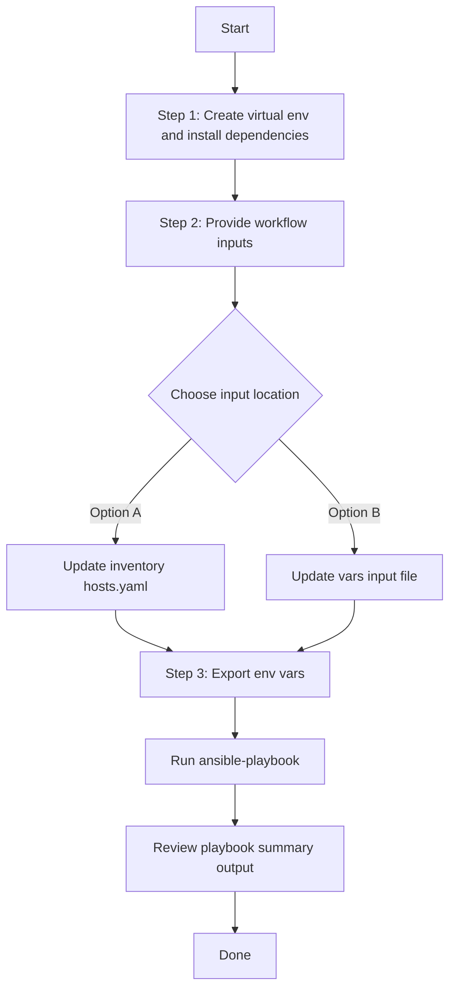

# Assurance Device Health Score Settings Config Generator

## Table of Contents

- [User Flow (3 Steps)](#user-flow-3-steps)

- [Overview](#overview)
- [Features](#features)
- [Prerequisites](#prerequisites)
- [Workflow Structure](#workflow-structure)
- [Schema Parameters](#schema-parameters)
- [Getting Started](#getting-started)
- [Operations](#operations)
- [Examples](#examples)---

## Overview

The Assurance Device Health Score Settings config generator automates YAML playbook generation for existing device health KPI threshold settings in Cisco Catalyst Center. It generates output compatible with `assurance_device_health_score_settings_workflow_manager`.

---

## Features

- **Configuration Generation**: Generate YAML configurations compatible with `assurance_device_health_score_settings_workflow_manager`.
  - Extract KPI threshold settings by device family.
  - Convert API responses into workflow-manager-ready YAML.
  - Reuse generated files for backup, migration, and audit.
- **Component Filtering**: Generate `device_health_score_settings` selectively.
- **Family Filtering**: Filter by device family list.
- **Flexible Output**: Supports custom `file_path` and `file_mode` (`overwrite` / `append`).
- **Brownfield Discovery**: Omit `config` (or use workflow convenience flag) to generate all configured device health score settings.

---

## Prerequisites

### Software Requirements

| Component | Version |
|-----------|---------|
| Ansible | 2.13+ |
| cisco.dnac collection | 6.44.0+ |
| Python | 3.9+ |
| Cisco Catalyst Center | 2.3.7.9+ |
| dnacentersdk | 2.7.2+ |

### Required Collections

```bash
ansible-galaxy collection install cisco.dnac
ansible-galaxy collection install ansible.utils
pip install dnacentersdk
pip install yamale
```

### Access Requirements

- Catalyst Center credentials with assurance health score API access
- Network connectivity to Catalyst Center
- Existing assurance device health score settings for targeted export use cases

---

## Workflow Structure

```
assurance_device_health_score_settings_config_generator/
├── playbook/
│   └── assurance_device_health_score_settings_config_generator.yml    # Main operations
├── vars/
│   └── assurance_device_health_score_settings_config_inputs.yml       # Input examples
├── schema/
│   └── assurance_device_health_score_settings_config_schema.yml       # Input validation
└── README.md
```

---

## Schema Parameters

### Basic Configuration

| Parameter | Type | Required | Default | Description |
|-----------|------|----------|---------|-------------|
| `generate_all_configurations` | boolean | No | false | Workflow convenience flag. When true, playbook omits module `config` |
| `file_path` | string | No | auto-generated | Output file path for generated YAML |
| `file_mode` | string | No | `overwrite` | File write mode: `overwrite` or `append` |
| `component_specific_filters` | dict | No | omitted | Component and filters passed to module `config` |

### Supported Components

- `device_health_score_settings`

### Device Family Filter Values

- `ROUTER`
- `SWITCH_AND_HUB`
- `WIRELESS_CONTROLLER`
- `UNIFIED_AP`
- `WIRELESS_CLIENT`
- `WIRED_CLIENT`

---

## Getting Started

## Workflow Steps
## User Flow (3 Steps)



### Installation and Run (Aligned)

1. Create and activate a Python virtual environment, then install dependencies.

```bash
python3 -m venv .venv
source .venv/bin/activate
pip install -r requirements.txt
ansible-galaxy collection install cisco.dnac --force
```

2. Provide workflow inputs in either inventory (`inventory/demo_lab/hosts.yaml`) or the workflow `vars/` file.

3. Export Catalyst Center environment variables and run the playbook.

```bash
export HOSTIP=<catalyst-center-ip-or-fqdn>
export CATALYST_CENTER_USERNAME=<username>
export CATALYST_CENTER_PASSWORD='<password>'
ansible-playbook -i ./inventory/demo_lab/hosts.yaml ./workflows/assurance_device_health_score_settings_config_generator/playbook/assurance_device_health_score_settings_config_generator.yml -vvvv
```


## Operations

### Generate Operations (state: gathered)

1. **Generate all device health score settings**
- Set `generate_all_configurations: true`.

2. **Generate component output only**
- Set `component_specific_filters.components_list: ["device_health_score_settings"]`.

3. **Generate settings for selected device families**
- Set `component_specific_filters.device_health_score_settings.device_families`.

4. **Append generated output**
- Set `file_mode: append`.

---

## Examples

### Example 1: Generate all assurance device health score settings

```yaml
assurance_device_health_score_settings_config:
  - generate_all_configurations: true
    file_path: "/tmp/assurance_device_health_score_settings_complete_config.yml"
```

### Example 2: Filter by selected device families

```yaml
assurance_device_health_score_settings_config:
  - file_path: "/tmp/assurance_device_health_score_settings_family_filter.yml"
    component_specific_filters:
      components_list: ["device_health_score_settings"]
      device_health_score_settings:
        device_families: ["UNIFIED_AP", "ROUTER", "SWITCH_AND_HUB"]
```

---

## Notes

- `assurance_device_health_score_settings_playbook_config_generator` expects `config` as a dictionary when filters are used.
- This workflow omits `config` when filters are absent, which triggers full generation mode.
- Device family names are case-sensitive and should match module-supported values.
