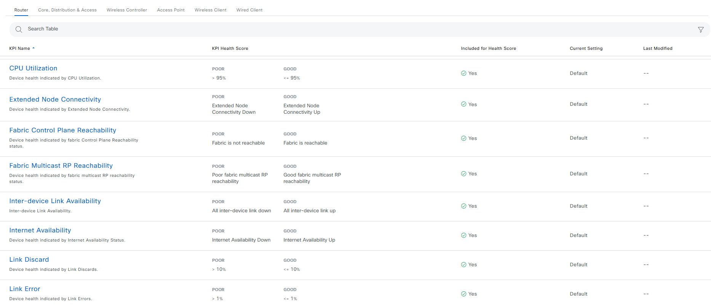
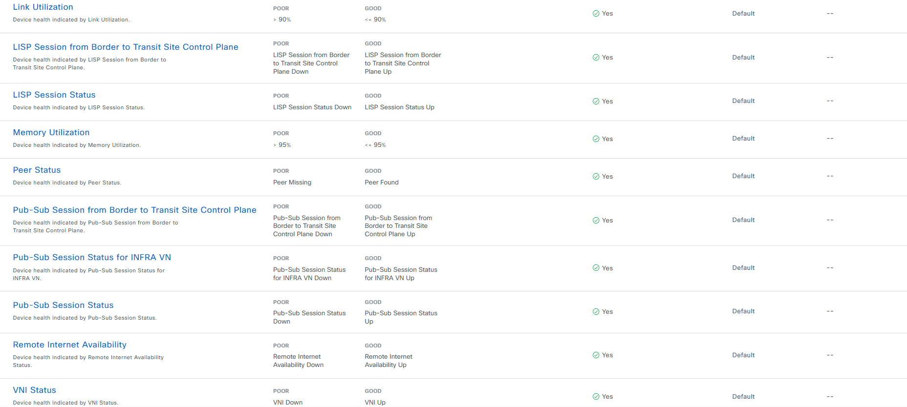

# Assurance Health Score Settings Playbook

## Overview

This module provides resource management for assurance Health score settings in Cisco Catalyst Center.

**Description:** 
This module provides capabilities to configure and manage Assurance Health Score settings in Cisco Catalyst Center. It enables fine-tuned health monitoring by adjusting KPI thresholds and device-level scoring logic. Key features include:
  - **Health Score Configuration:**
    - Update and manage health score calculation parameters.
    - Define KPI thresholds and scoring rules specific to network device types.
    - Customize health scoring behavior based on operational priorities.

  - **Device-Specific Customization:**
    - Assign unique health score configurations per device type (e.g., access, core, distribution).
    - Control how individual KPIs influence the overall device health score.

  - **KPI Inclusion/Exclusion:**
    - Exclude specific KPIs from health score calculation to avoid skewing device performance metrics.
    - Ensure that excluded KPIs do not impact score trends or alerting.

  - **Health Score Computation Logic:**
    - Calculates the overall health score using the lowest score among the included KPIs.
    - Reflects worst-case operational scenarios for more conservative monitoring.

  - **Third-Party Device Handling:**
    - Health score configuration is not applicable to third-party devices and is automatically bypassed.

**Version Added:**  
`6.32.0`

---

This README outlines the steps to use the Ansible playbooks for managing assurance Health score settings in Cisco Catalyst Center.

## Workflow Steps

This workflow typically involves the following steps:

### Step 1: Install and Generate Inventory

Before running the playbooks, ensure you have Ansible installed and the necessary collections for Cisco Catalyst Center.

1.  **Install Ansible:** Follow the official Ansible documentation for installation instructions.
2.  **Install Cisco Catalyst Center Collection:**
    ```bash
    ansible-galaxy collection install cisco.dnac
    ```
3.  **Generate Inventory:** Create an Ansible inventory file (e.g., `inventory.yml`) that includes your Cisco Catalyst Center appliance details. You will need to define variables such as the host, username, and password (or other authentication methods).
    ```yaml
    catalyst_center_hosts:
        hosts:
            your_catalyst_center_instance_name:
                catalyst_center_host: xx.xx.xx.xx
                catalyst_center_password: XXXXXXXX
                catalyst_center_port: 443
                catalyst_center_timeout: 60
                catalyst_center_username: admin
                catalyst_center_verify: false # Set to true for production with valid certificates
                catalyst_center_version: 2.3.7.9 # Specify your DNA Center version
                catalyst_center_debug: true
                catalyst_center_log_level: INFO
                catalyst_center_log: true
    ```

### Step 2: Define Inputs and Validate

This step involves preparing the input data for configuring Assurance Health Score Settings and validating the KPI thresholds per device type.

1.  **Define Input Variables:** Create the variable file at (e.g., `workflows/assurance_health_score_settings/vars/assurance_health_score_settings_inputs.yml`). This file should contain the list of KPI names and threshold values for various device types that you want to configure.

2.  **Review Structure and Options:** Refer to the full workflow specification for detailed instructions on the available options and their structure: https://galaxy.ansible.com/ui/repo/published/cisco/dnac/content/module/assurance_device_health_score_settings_workflow_manager/


#### Schema for Assurance Health Score Settings
This schema defines the structure of the input file for configuring Assurance Health Score Settings in Cisco Catalyst Center. Below is a breakdown of the parameters, including their requirements and descriptions.

| **Parameter**                    | **Type** | **Required** | **Default Value** | **Description** |
|----------------------------------|----------|--------------|-------------------|---------------------------------------------------------------------------------|
| `assurance_health_score_settings`| List     | No           | N/A               | List of device health score settings.| 
| `device_health_score`            | List     | No           | N/A               | List of device health score.|
| `device_family`                  | String   | Yes          | --                | Specifies the device family to which the health score applies. required: true choices: - ROUTER - SWITCH_AND_HUB - WIRELESS_CONTROLLER - UNIFIED_AP - WIRELESS_CLIENT - WIRED_CLIENT |
| `kpi_name`                       | String   | Yes          | --                | The name of the Key Performance Indicator (KPI) to be monitored (e.g., LINK ERROR).|
| `include_for_overall_health`     | Boolean  | No           | --                | Whether to include KPI in overall health calculation.|
| `threshold_value`                | Integer  | No           | --                | Threshold value for the KPI.The threshold value that, when exceeded, will affect the health score.|
| `synchronize_to_issue_threshold` | Boolean  | No           | --                | Boolean value indicating whether the threshold should synchronize with issue resolution thresholds. |

## Example Input File

1. **Health Score Custom Settings for device family Unified Access Point**
  configures custom Assurance Health Score thresholds for Unified Access Points in Cisco Catalyst Center. It allows tuning KPI thresholds and inclusion in overall health scoring.
```yaml
catalyst_center_version: 2.3.7.9
catalyst_center_verify: false
assurance_health_score_settings:
  - device_health_score:
    - device_family: UNIFIED_AP
      kpi_name: Air Quality 6 GHz
      include_for_overall_health: true
      threshold_value: 73
    - device_family: UNIFIED_AP
      kpi_name: CPU Utilization
      include_for_overall_health: true
      threshold_value: 46
      synchronize_to_issue_threshold: false
    - device_family: UNIFIED_AP
      kpi_name: Interference 2.4 GHz
      include_for_overall_health: true
      threshold_value: 35
      synchronize_to_issue_threshold: false
```
mapping config to UI Actions:


2. **Health Score Custom Settings for device family wired client**
  configures custom Assurance Health Score thresholds for wired client in Cisco Catalyst Center. It allows tuning KPI thresholds and inclusion in overall health scoring.
```yaml
catalyst_center_version: 2.3.7.9
catalyst_center_verify: false
assurance_health_score_settings:
  - device_health_score:
    - device_family: WIRED_CLIENT
      kpi_name: Link Error
      include_for_overall_health: true
      threshold_value: 60
      synchronize_to_issue_threshold: false
```
mapping config to UI Actions:


3. **Health Score Custom Settings for device family wireless client**
  configures custom Assurance Health Score thresholds for wireless client in Cisco Catalyst Center. It allows tuning KPI thresholds and inclusion in overall health scoring.
```yaml
catalyst_center_version: 2.3.7.9
catalyst_center_verify: false
assurance_health_score_settings:
  - device_health_score:
      - device_family: WIRELESS_CLIENT
        kpi_name: Connectivity SNR
        include_for_overall_health: true
        threshold_value: 35
      - device_family: WIRELESS_CLIENT
        kpi_name: Connectivity RSSI
        include_for_overall_health: true
        threshold_value: -70
        synchronize_to_issue_threshold: true
```
mapping config to UI Actions:


4. **Health Score Custom Settings for device family wireless controler**
  configures assurance health score settings for WIRELESS_CONTROLLER device family in Cisco Catalyst Center. It defines KPIs with specific thresholds and whether they contribute to the overall health score.
```yaml
catalyst_center_version: 2.3.7.9
catalyst_center_verify: false
assurance_health_score_settings:
  - device_health_score:
    - device_family: WIRELESS_CONTROLLER
      kpi_name: Fabric Control Plane Reachability
      include_for_overall_health: false
    - device_family: WIRELESS_CONTROLLER
      kpi_name: Free Mbuf
      include_for_overall_health: true
      threshold_value: 40
    - device_family: WIRELESS_CONTROLLER
      kpi_name: Free Timer
      include_for_overall_health: true
      threshold_value: 30
    - device_family: WIRELESS_CONTROLLER
      kpi_name: Link Error
      include_for_overall_health: true
      threshold_value: 20
    - device_family: WIRELESS_CONTROLLER
      kpi_name: LISP Session Status
      include_for_overall_health: false
    - device_family: WIRELESS_CONTROLLER
      kpi_name: Memory Utilization
      include_for_overall_health: true
      threshold_value: 10
      synchronize_to_issue_threshold: false
    - device_family: WIRELESS_CONTROLLER
      kpi_name: Packet Pool
      include_for_overall_health: false
    - device_family: WIRELESS_CONTROLLER
      kpi_name: WQE Pool
      include_for_overall_health: false
```
mapping config to UI Actions:


5. **Health Score Custom Setting for device family switches and hub**
  configures assurance health score settings for SWITCH_AND_HUB device family in Cisco Catalyst Center. It defines KPIs with specific thresholds and whether they contribute to the overall health score.
```yaml
catalyst_center_version: 2.3.7.9
catalyst_center_verify: false
assurance_health_score_settings:
  - device_health_score:
    - device_family: SWITCH_AND_HUB
      kpi_name: Link Discard
      include_for_overall_health: true
      threshold_value: 20
      synchronize_to_issue_threshold: false
    - device_family: SWITCH_AND_HUB
      kpi_name: Link Error
      include_for_overall_health: true
      threshold_value: 30
      synchronize_to_issue_threshold: false
    - device_family: SWITCH_AND_HUB
      kpi_name: LISP Session Status
      include_for_overall_health: false
    - device_family: SWITCH_AND_HUB
      kpi_name: Memory Utilization
      include_for_overall_health: true
      threshold_value: 40
      synchronize_to_issue_threshold: false
```
mapping config to UI Actions:


6. **Health Score Custom Setting for device family Router**
  configures assurance health score settings for ROUTER device family in Cisco Catalyst Center. It defines KPIs with specific thresholds and whether they contribute to the overall health score.
```yaml
catalyst_center_version: 2.3.7.9
catalyst_center_verify: false
assurance_health_score_settings:
  - device_health_score:
    - device_family: ROUTER
      kpi_name: Link Discard
      include_for_overall_health: false
      threshold_value: 30
      synchronize_to_issue_threshold: false
    - device_family: ROUTER
      kpi_name: Link Error
      include_for_overall_health: false
      threshold_value: 30
      synchronize_to_issue_threshold: false
    - device_family: ROUTER
      kpi_name: Memory Utilization
      include_for_overall_health: false
      threshold_value: 30
      synchronize_to_issue_threshold: false
```
mapping config to UI Actions:


7. **Health Score Default Settings for device family Unified Access Point**
  configures Default Assurance Health Score thresholds for Unified Access Points in Cisco Catalyst Center. It allows tuning KPI thresholds and inclusion in overall health scoring.
```yaml
catalyst_center_version: 2.3.7.9
catalyst_center_verify: false
assurance_health_score_settings:
  - device_health_score:
    - device_family: UNIFIED_AP
      kpi_name: Air Quality 6 GHz
      include_for_overall_health: true
      threshold_value: 75
    - device_family: UNIFIED_AP
      kpi_name: CPU Utilization
      include_for_overall_health: true
      threshold_value: 90
      synchronize_to_issue_threshold: false
    - device_family: UNIFIED_AP
      kpi_name: Interference 2.4 GHz
      include_for_overall_health: true
      threshold_value: 50
      synchronize_to_issue_threshold: false
```
mapping config to UI Actions:


8. **Health Score Default Settings for device family wired client**
  configures Default Assurance Health Score thresholds for WIRED_CLIENT in Cisco Catalyst Center. It allows tuning KPI thresholds and inclusion in overall health scoring.
```yaml
catalyst_center_version: 2.3.7.9
catalyst_center_verify: false
assurance_health_score_settings:
  - device_health_score:
    - device_family: WIRED_CLIENT
      kpi_name: Link Error
      include_for_overall_health: true
      threshold_value: 1
      synchronize_to_issue_threshold: false
```
mapping config to UI Actions:


9. **Health Score Default Setting for device family wireless client**
  configures Default Assurance Health Score thresholds for WIRELESS_CLIENT in Cisco Catalyst Center. It allows tuning KPI thresholds and inclusion in overall health scoring.
```yaml
catalyst_center_version: 2.3.7.9
catalyst_center_verify: false
assurance_health_score_settings:
  - device_health_score:
      - device_family: WIRELESS_CLIENT
        kpi_name: Connectivity SNR
        include_for_overall_health: true
        threshold_value: 9
      - device_family: WIRELESS_CLIENT
        kpi_name: Connectivity RSSI
        include_for_overall_health: true
        threshold_value: -72
        synchronize_to_issue_threshold: true
```
mapping config to UI Actions:


10. **Health Score Default Settings for device family wireless controller**
    configures Default Assurance Health Score thresholds for WIRELESS_CONTROLLER in Cisco Catalyst Center. It allows tuning KPI thresholds and inclusion in overall health scoring.
```yaml
catalyst_center_version: 2.3.7.9
catalyst_center_verify: false
assurance_health_score_settings:
  - device_health_score:
    - device_family: WIRELESS_CONTROLLER
      kpi_name: Fabric Control Plane Reachability
      include_for_overall_health: true
    - device_family: WIRELESS_CONTROLLER
      kpi_name: Free Mbuf
      include_for_overall_health: true
      threshold_value: 20
    - device_family: WIRELESS_CONTROLLER
      kpi_name: Free Timer
      include_for_overall_health: true
      threshold_value: 20
    - device_family: WIRELESS_CONTROLLER
      kpi_name: Link Error
      include_for_overall_health: true
      threshold_value: 1
    - device_family: WIRELESS_CONTROLLER
      kpi_name: LISP Session Status
      include_for_overall_health: true
    - device_family: WIRELESS_CONTROLLER
      kpi_name: Memory Utilization
      include_for_overall_health: true
      threshold_value: 95
      synchronize_to_issue_threshold: true
    - device_family: WIRELESS_CONTROLLER
      kpi_name: Packet Pool
      include_for_overall_health: true
    - device_family: WIRELESS_CONTROLLER
      kpi_name: WQE Pool
      include_for_overall_health: true
```
mapping config to UI Actions:


11. **Health Score Default Setting for device family Switches and hub**
  configures Default Assurance Health Score thresholds for SWITCH_AND_HUB in Cisco Catalyst Center. It allows tuning KPI thresholds and inclusion in overall health scoring.
```yaml
catalyst_center_version: 2.3.7.9
catalyst_center_verify: false
assurance_health_score_settings:
  - device_health_score:
    - device_family: SWITCH_AND_HUB
      kpi_name: BGP Session to Spine
      include_for_overall_health: true
    - device_family: SWITCH_AND_HUB
      kpi_name: Cisco TrustSec environment data download status
      include_for_overall_health: true
    - device_family: SWITCH_AND_HUB
      kpi_name: CPU Utilization
      include_for_overall_health: true
      threshold_value: 95
      synchronize_to_issue_threshold: false
```
mapping config to UI Actions:


12. **Health Score Default Setting for device family Router**
    configures Default Assurance Health Score thresholds for ROUTER in Cisco Catalyst Center. It allows tuning KPI thresholds and inclusion in overall health scoring.
```yaml
catalyst_center_version: 2.3.7.9
catalyst_center_verify: false
assurance_health_score_settings:
  - device_health_score:
    - device_family: ROUTER
      kpi_name: Link Utilization
      include_for_overall_health: true
      threshold_value: 90
      synchronize_to_issue_threshold: false
    - device_family: ROUTER
      kpi_name: BGP Session from Border to Control Plane (BGP)
      include_for_overall_health: true
    - device_family: ROUTER
      kpi_name: BGP Session from Border to Control Plane (PubSub)
      include_for_overall_health: true
```
mapping config to UI Actions:





2. **Validate Configuration:** 
 To ensure a successful execution of the playbooks with your specified inputs, follow these steps:

  **Input Validation**:
  Before executing the playbook, it is essential to validate the input schema. This step ensures that all required parameters are included and correctly formatted. Run the following command *./tools/validate.sh -s* to perform the validation providing the schema path -d and the input path.

```bash
./tools/validate.sh -s ./workflows/assurance_health_score_settings/schema/assurance_health_score_settings_schema.yml -d ./workflows/assurance_health_score_settings/vars/assurance_health_score_settings_inputs.yml
```
### run Schema validation
catc_ansible_workflows %  yamale -s workflows/assurance_health_score_settings/schema/assurance_health_score_settings_schema.yml workflows/assurance_health_score_settings/vars/assurance_health_score_settings_inputs.yml
Validating workflows/assurance_health_score_settings/vars/assurance_health_score_settings_inputs.yml...
Validation success! 👍

### Step 3: Deploy and Verify

This is the final step where you deploy the configuration to Cisco Catalyst Center and verify the changes.

1.  **Deploy Configuration:** 

Run the playbook to seamlessly apply the wireless network profile configuration defined in your input variables to Cisco Catalyst Center. 
Before proceeding, ensure that the input validation step has been completed successfully, with no errors detected in the provided variables. Once validated, execute the playbook by specifying the input file path using the --e variable as VARS_FILE_PATH. The VARS_FILE_PATH must be provided as a full path to the input file.
This ensures that the configuration is accurately deployed to Cisco Catalyst Center, automating the setup process and reducing the risk of manual errors.

```bash
ansible-playbook -i ./inventory/demo_lab/hosts.yaml ./workflows/assurance_health_score_settings/playbook/assurance_health_score_settings_playbook.yml --extra-vars VARS_FILE_PATH=./../vars/assurance_health_score_settings_inputs.yml -vvvvvv    
```

If there is an error in the input or an issue with the API call during execution, the playbook will halt and display the relevant error details.

2.  **Verify Deployment:** 
After executing the playbook, check the Catalyst Center UI to verify Assurance Health Score. If *debug_log* is enabled, you can also review the logs for detailed information on operations performed and any updates made.
---

### References

*Note: The environment used for the references in the above instructions is as follows:*

```yaml
python: 3.12.0
dnac_version: 2.3.7.9
ansible: 9.9.0
cisco.dnac: 6.32.0
dnacentersdk: 2.8.8
```
For detailed information on Assurance Health Score Settings refer to the following documentation:https://galaxy.ansible.com/ui/repo/published/cisco/dnac/content/module/assurance_device_health_score_settings_workflow_manager/