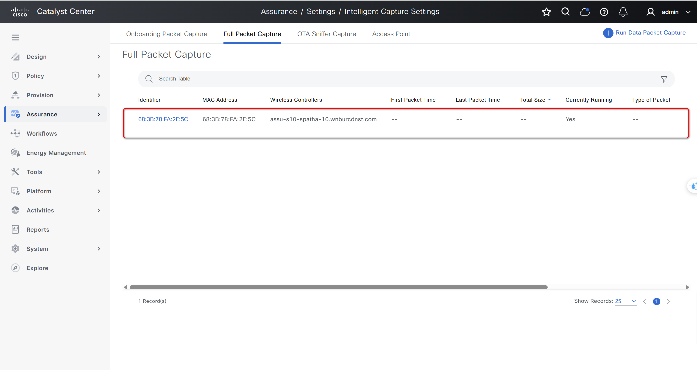

# Cisco Catalyst Center Assurance Intelligent Capture (ICAP) Workflow Playbooks

This resource module enables automated management of Assurance Intelligent Capture (ICAP) settings in Cisco Catalyst Center. It supports creating, deploying, and downloading ICAP packet captures for troubleshooting and assurance workflows. The module is designed for efficient, programmatic control of ICAP settings and packet capture retrieval.

Key features include:

- **ICAP Session Management:**  
  - Create and deploy ICAP (Intelligent Capture) sessions for onboarding, full, OTA, RF statistics, and anomaly captures.
  - Specify capture parameters such as client MAC, AP, WLC, slot, OTA band, channel, and duration.

- **Automated Troubleshooting:**  
  - Automate the collection of packet captures for client onboarding and wireless troubleshooting.
  - Integrate with assurance workflows for rapid root cause analysis.

- **Validation and Logging:**  
  - Validate configuration and deployment status.
  - Download and verify PCAP files to a specified directory.

**Version Added:**  `6.32.0`

---

## Workflow Steps

This workflow typically involves the following steps:

### Step 1: Install and Generate Inventory

Before running the playbooks, ensure you have Ansible installed and the necessary Cisco Catalyst Center collection.

1. **Install Ansible:**  
   Follow the official Ansible documentation for installation instructions.

2. **Install Cisco Catalyst Center Collection:**
   ```bash
   ansible-galaxy collection install cisco.dnac
   ```

### Configure Host Inventory
Update your Ansible hosts.yml inventory file with the connection details of your Cisco Catalyst Center instance. Replace the placeholder values with your actual Catalyst Center information.
```yaml
catalyst_center_hosts:
    hosts:
        your_catalyst_center_instance_name:
            catalyst_center_host: xx.xx.xx.xx
            catalyst_center_password: XXXXXXXX
            catalyst_center_port: 443
            catalyst_center_timeout: 60
            catalyst_center_username: admin
            catalyst_center_verify: false # Set to true for production with valid certificates
            catalyst_center_version: 2.3.7.6 # Specify your DNA Center version
            catalyst_center_debug: true
            catalyst_center_log_level: INFO
            catalyst_center_log: true
```

---

### Step 2: Define Inputs and Validate

Prepare the input data for creating or managing ICAP settings and downloads.

1. **Define Input Variables:**  

#### Schema for Assurance ICAP Workflow

##### ICAP Settings (`assurance_icap_settings`)

| **Parameter**         | **Type** | **Required** | **Description** |
|-----------------------|----------|--------------|-----------------|
| `capture_type`        | String   | Yes          | Type of capture: FULL, ONBOARDING, OTA, RFSTATS, ANOMALY. |
| `duration_in_mins`    | Int      | Yes          | Duration of the capture session in minutes. |
| `preview_description` | String   | No           | Description of the capture session. |
| `client_mac`          | String   | Yes          | MAC address of the client device. |
| `wlc_name`            | String   | No           | Name of the Wireless LAN Controller. |
| `ap_name`             | String   | No           | Name of the Access Point. |
| `slot`                | List[Int]| No           | List of slot numbers. |
| `ota_band`            | String   | No           | OTA band: 2.4GHz, 5GHz, 6GHz. |
| `ota_channel`         | Int      | No           | OTA channel number. |
| `ota_channel_width`   | Int      | No           | Channel width in MHz. |

##### ICAP Download (`assurance_icap_download`)

| **Parameter**         | **Type** | **Required** | **Description** |
|-----------------------|----------|--------------|-----------------|
| `capture_type`        | String   | Yes          | Type of capture to download. |
| `client_mac`          | String   | Yes          | MAC address of the client device. |
| `ap_mac`              | String   | No           | MAC address of the AP (required for OTA/ANOMALY). |
| `start_time`          | String   | No           | Start time (YYYY-MM-DD HH:MM:SS). |
| `end_time`            | String   | No           | End time (YYYY-MM-DD HH:MM:SS). |
| `file_path`           | String   | Yes          | Directory to save the downloaded PCAP file. |

---

### Example Input File

Below are example input files for each `capture_type` supported by the ICAP workflow. You can use these as templates for your own automation.

---
##### 1. Create ICAP Settings:


**a. ONBOARDING Capture (state: merged)**
```yaml
  - assurance_icap_settings:
      - capture_type: ONBOARDING
        preview_description: "Onboarding troubleshooting session"
        duration_in_mins: 30
        client_mac: 68:3B:78:FA:2E:5C
        wlc_name: assu-s10-spatha-10.wnburcdnst.com
```

Figure 1 Choose WLC and Client MAC Address in Catalyst Center.


Figure 2 Check ICAP setting created.


---

**b. FULL Capture (state: merged)**

```yaml
  - assurance_icap_settings:
      - capture_type: FULL
        preview_description: "Full traffic capture for deep analysis"
        duration_in_mins: 30
        client_mac: 68:3B:78:FA:2E:5C
        wlc_name: assu-s10-spatha-10.wnburcdnst.com

```

Figure 1 Choose WLC and Client MAC Address in Catalyst Center.


Figure 2 Configuration has been created.


---

**c. OTA (Over-the-Air) Capture (state: merged)**

```yaml
  - assurance_icap_settings:
      - capture_type: OTA
        preview_description: "OTA capture for Wi-Fi troubleshooting"
        duration_in_mins: 10
        client_mac: 20:CC:27:C2:D4:80
        ap_name: s10-SB2-9172H-BF20
        slot: [0]
        ota_band: 2.4GHz
        ota_channel: 11
        ota_channel_width: 20
```
Figure 1 Go to page Health in Catalyst Center to create ICAP settings.


Figure 2 Go to Client page and Choose Wireless Client in Catalyst Center.


Figure 3 Go to Intelligent Capture of Wireless Client in Catalyst Center.


Figure 4 Run Packet Capture on Device in Catalyst Center.


Figure 5 Choose OTA Sniffer type and choose AP in Catalyst Center.


Figure 6 Enter parameters want configure and "Next" in Catalyst Center.


Figure 7 Enter parameters want configure and "Next" in Catalyst Center.


Figure 8 Apply and Deploy in Catalyst Center.


---

**d. RFSTATS Capture (state: merged)**

```yaml
  - assurance_icap_settings:
      - capture_type: RFSTATS
        preview_description: "RF statistics capture"
        wlc_name: 98:76:54:32:10:FE
        ap_name: AP-2.cisco.local
```

Figure 1 Choose AP device want to enable RFSTATS and then click "Enable"


---
**e. ANOMALY Capture (state: merged)**

```yaml
  - assurance_icap_settings:
      - capture_type: ANOMALY
        preview_description: "RF statistics capture"
        wlc_name: 98:76:54:32:10:FE
```
Figure 1 Go to Anomaly Capture page and then Enable AP Anomaly Capture in Catalyst Center.


---

> **Note:**  
> Below is a summary of the required parameters for each capture type in the ICAP API:
- ANOMALY: captureType=ANOMALY, wcid, apId (AP), wcid (WLC)
- FULL: captureType=FULL, wcid, clientMac, durationInMins (30-480)
- ONBOARDING: captureType=ONBOARDING, wcid, clientMac, durationInMins (30-480)
- OTA: captureType=OTA, wcid, apId, otaBand, otaChannel, otaChannelWidth, slots (1), otaMode (Optional: RADIO/AP, Default RADIO), durationInMins=15 (Optional)
- RFSTATS: captureType=RFSTATS, wcid, apId (AP), wcid (WLC), durationInMins=10 (Optional)
- SPECTRUM: captureType=SPECTRUM, wcid, apId, slots, durationInMins=10 (Optional)
- Note: All POST body objects must share the same captureType, with required fields per type.

#### Validate Configuration

Important: Validate your input schema before executing the playbook to ensure all parameters are correctly formatted.
Run the following command to validate your input file against the schema:

```bash
./tools/validate.sh -s ./workflows/assurance_intelligent_capture/schema/assurance_intelligent_capture_schema.yml -d ./workflows/assurance_intelligent_capture/vars/assurance_intelligent_capture_inputs.yml
```
---

### Step 3: Deploy and Verify

1. **Deploy Configuration:**  
   Run the playbook to apply the ICAP configuration and/or download packet captures:

   ```bash
   ansible-playbook -i ./inventory/hosts.yml workflows/assurance_intelligent_capture/playbook/assurance_intelligent_capture_playbook.yml --e VARS_FILE_PATH=../vars/assurance_intelligent_capture_inputs.yml -vvvv
   ```

2. **Verify Deployment:**  
   After executing the playbook, check the Catalyst Center UI for ICAP session status. If `catalyst_center_log` is enabled, review the logs for detailed information. For downloads, verify the PCAP file exists in the specified directory.
---


### References

*Note: The environment used for the references in the above instructions is as follows:*

```yaml
python: 3.12.0
dnac_version: 2.3.7.9
ansible: 9.9.0
cisco.dnac: 6.32.0
dnacentersdk: 2.8.8
```

For detailed information on the assurance ICAP workflow, refer to the following documentation:  
https://galaxy.ansible.com/ui/repo/published/cisco/dnac/content/module/assurance_icap_settings_workflow_manager/
