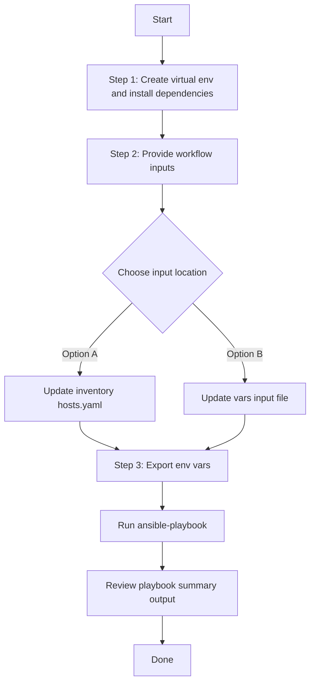

# Assurance Issue Config Generator

## Table of Contents

- [User Flow (3 Steps)](#user-flow-3-steps)

- [Overview](#overview)
- [Features](#features)
- [Prerequisites](#prerequisites)
- [Workflow Structure](#workflow-structure)
- [Schema Parameters](#schema-parameters)
- [Getting Started](#getting-started)
- [Operations](#operations)
- [Examples](#examples)---

## Overview

The Assurance Issue config generator automates the creation of YAML playbook configurations for existing assurance issues detected in Cisco Catalyst Center. This tool reduces the effort required to manually create Ansible playbooks by programmatically generating configurations from existing issue data. It enables you to extract issue information and create reproducible playbook configurations for executing workflows.

---

## Features

- **Configuration Generation**: Generate YAML configurations compatible with `assurance_issue_workflow_manager` module.
  Extract existing assurance issues from your Cisco Catalyst Center.
  Convert them into properly formatted YAML files.
  Generate files that are ready to use with Ansible automation.
- **Component Filtering**: Selective generation of issue configurations by severity, category, device, and site
- **Flexible Output**: Configurable file paths and naming conventions
- **Brownfield Support**: Extract issue data from existing Catalyst Center deployments
- **API Integration**: Leverages native Catalyst Center Assurance APIs for data retrieval

---

## Prerequisites

### Software Requirements

| Component | Version |
|-----------|---------|
| Ansible | 6.42.0+ |
| Python | 3.9+ |
| Cisco Catalyst Center SDK | 2.9.3+ |

### Required Collections

```bash
ansible-galaxy collection install cisco.dnac
ansible-galaxy collection install ansible.utils
pip install dnacentersdk
pip install yamale
```

### Access Requirements

- Catalyst Center admin credentials
- Network connectivity to Catalyst Center API
- Assurance enabled with issue detection configured
- Existing assurance issues in your infrastructure

---

## Workflow Structure

```
assurance_issue_config_generator/
├── playbook/
│   └── assurance_issue_config_generator.yml          # Main operations
├── vars/
│   └── assurance_issue_config_input.yml              # Configuration examples
├── schema/
│   └── assurance_issue_config_schema.yml             # Input validation
└── README.md
```

---

## Schema Parameters

### Basic Configuration

| Parameter | Type | Required | Default | Description |
|-----------|------|----------|---------|-------------|
| generate_all_configurations | boolean | No | false | Generate all issue configurations automatically |
| file_path | string | No | auto-generated | Output file path for YAML configuration file |
| component_specific_filters | dict | No | all issues | Filters to specify which issues to include |

### Component Specific Filtering

| Parameter | Type | Required | Default | Description |
|--------------|------|----------|-------------|-----------|
| components_list | list | No | ["assurance_user_defined_issue_settings"] | List of components to include in generation |
| assurance_user_defined_issue_settings | list | No | all issues configurations | Issue filtering criteria |

**Valid Component Types:**
- `assurance_user_defined_issue_settings`: Assurance issue configurations with details, severity, and affected devices

### Assurance User Defined Issue Settings Configuration Filters

| Parameter | Type | Required | Description |
|-----------|--------|-------------|----------------|
| name | string | False | Filter by specific issue name |
| description | string | False | Filter by specific issue description |
| is_enabled | boolean | False | Filter by specific issue of is enabled |
| priority | string | False | Filter by priority (P1, P2, P3, P4) |
| is_notification_enabled | boolean | False | Filter by specific issue of is notification enabled |

---

## Getting Started

## Workflow Steps
## User Flow (3 Steps)



### Installation and Run (Aligned)

1. Create and activate a Python virtual environment, then install dependencies.

```bash
python3 -m venv .venv
source .venv/bin/activate
pip install -r requirements.txt
ansible-galaxy collection install cisco.dnac --force
```

2. Provide workflow inputs in either inventory (`inventory/demo_lab/hosts.yaml`) or the workflow `vars/` file.

3. Export Catalyst Center environment variables and run the playbook.

```bash
export HOSTIP=<catalyst-center-ip-or-fqdn>
export CATALYST_CENTER_USERNAME=<username>
export CATALYST_CENTER_PASSWORD='<password>'
ansible-playbook -i ./inventory/demo_lab/hosts.yaml ./workflows/assurance_issue_config_generator/playbook/assurance_issue_config_generator.yml -vvvv
```


## Operations

### Generate Operations (state: gathered)

Use `assurance_issue_config_generator.yml` for generating YAML playbook configuration operations.

#### Generate All Configurations

**Description**: Retrieves all assurance issues from Catalyst Center regardless of any filters.

```yaml
assurance_issue_config:
  - generate_all_configurations: true
    file_path: "generated_file/complete_assurance_issue_config.yml"
```

#### Component-Specific Generation

**Description**: Generates configuration for specific issue types only.

**Extract Assurance User Defined Issue Settings only**

```yaml
assurance_issue_config:
  - file_path: "generated_file/assurance_issues_config.yml"
    component_specific_filters:
      components_list: ["assurance_user_defined_issue_settings"]
      assurance_user_defined_issue_settings:
        - name: FANFAIL
```


**Validate and Execute:**

```bash
# Validate
./tools/validate.sh -s workflows/assurance_issue_config_generator/schema/assurance_issue_config_schema.yml \
  -d workflows/assurance_issue_config_generator/vars/assurance_issue_config_input.yml
```

Return result validate:
```bash
(pyats-rafeek) [mabdulk2@st-ds-4 dnac_ansible_workflows]$ ./tools/validate.sh -s workflows/assurance_issue_config_generator/schema/assurance_issue_config_schema.yml \
> -d workflows/assurance_issue_config_generator/vars/assurance_issue_config_input.yml
workflows/assurance_issue_config_generator/schema/assurance_issue_config_schema.yml
workflows/assurance_issue_config_generator/vars/assurance_issue_config_input.yml
yamale -s workflows/assurance_issue_config_generator/schema/assurance_issue_config_schema.yml workflows/assurance_issue_config_generator/vars/assurance_issue_config_input.yml
Validating workflows/assurance_issue_config_generator/vars/assurance_issue_config_input.yml...
Validation success! 👍
```

```bash
# Execute
ansible-playbook -i inventory/demo_lab/hosts.yaml \
  workflows/assurance_issue_config_generator/playbook/assurance_issue_config_generator.yml \
  --extra-vars VARS_FILE_PATH=./workflows/assurance_issue_config_generator/vars/assurance_issue_config_input.yml
```

Expected Terminal Output:

1. Generate All Configurations

```code
    file_path: generated_file/complete_assurance_issue_config.yml
    generate_all_configurations: true

    "msg": "YAML configuration file generated successfully for module 'assurance_issue_workflow_manager'. File: generated_file/                    complete_assurance_issue_config.yml, Components processed: 1, Components skipped: 0, Configurations count: 45",
    "response": "YAML configuration file generated successfully for module 'assurance_issue_workflow_manager'. File: generated_file/complete_assurance_issue_config.yml, Components processed: 1, Components skipped: 0, Configurations count: 45",
    "status": "success"
```

2. Component Specific Generation:

a. Issue Severity Filter:

```code
    component_specific_filters:
        components_list:
            - assurance_user_defined_issue_settings
        assurance_user_defined_issue_settings:
            - name: BGP_SESSION_NOTIFICATION
    file_path: generated_file/p1_issues_config.yml

    "msg": "YAML configuration file generated successfully for module 'assurance_issue_workflow_manager'. File: generated_file/assurance_issues_config.yml, Components processed: 1, Components skipped: 0, Configurations count: 12",
    "response": "YAML configuration file generated successfully for module 'assurance_issue_workflow_manager'. File: generated_file/assurance_issues_config.yml, Components processed: 1, Components skipped: 0, Configurations count: 12",
    "status": "success"
```

b. Issue Category Filter:

```code
    component_specific_filters:
        components_list:
            - assurance_user_defined_issue_settings
        assurance_user_defined_issue_settings:
            - priority: P1
    file_path: generated_file/availability_issues_config.yml

    "msg": "YAML configuration file generated successfully for module 'assurance_issue_workflow_manager'. File: generated_file/availability_issues_config.yml, Components processed: 1, Components skipped: 0, Configurations count: 8",
    "response": "YAML configuration file generated successfully for module 'assurance_issue_workflow_manager'. File: generated_file/availability_issues_config.yml, Components processed: 1, Components skipped: 0, Configurations count: 8",
    "status": "success"
```

---

## Examples

### Example 1: Generate ALL assurance issues

```yaml
assurance_issue_config:
  - generate_all_configurations: true
    file_path: "generated_file/complete_assurance_infrastructure.yml"
```

### Example 2: Assurance user defined issue settings Filters only

Extract all P1 severity issues.

```yaml
    assurance_issue_config:
    - file_path: "generated_file/assurance_issues_filter.yml"
      component_specific_filters:
        components_list: ["assurance_user_defined_issue_settings"]
```

### Example 3: Filter by issue name Levels

Extract config based on issue names.

```yaml
assurance_issue_config:
  - file_path: "generated_file/assurance_issues_name_filter.yml"
    component_specific_filters:
      components_list: ["assurance_user_defined_issue_settings"]
      assurance_user_defined_issue_settings:
        - name: "Shut fangone"
```

### Example 4: Assurance user defined issue settings based on multiple issue and priority

```yaml
assurance_issue_config:
  - file_path: "generated_file/availability_issues.yml"
    component_specific_filters:
      components_list: ["assurance_user_defined_issue_settings"]
      assurance_user_defined_issue_settings:
        - name: "Shut fangone"
          priority: "P1"
```

### Example 5: Assurance user defined issue settings based on multiple issue name

```yaml
assurance_issue_config:
  - file_path: "generated_file/availability_issues.yml"
    component_specific_filters:
      components_list: ["assurance_user_defined_issue_settings"]
      assurance_user_defined_issue_settings:
        - name: "FANFAIL"
        - name: "Shut fangone"
---

## Additional Resources

- [Cisco Catalyst Center Documentation](https://www.cisco.com/c/en/us/support/cloud-systems-management/dna-center/series.html)
- [Cisco DNA Center SDK](https://dnacentersdk.readthedocs.io/)
- [Ansible Documentation](https://docs.ansible.com/)
