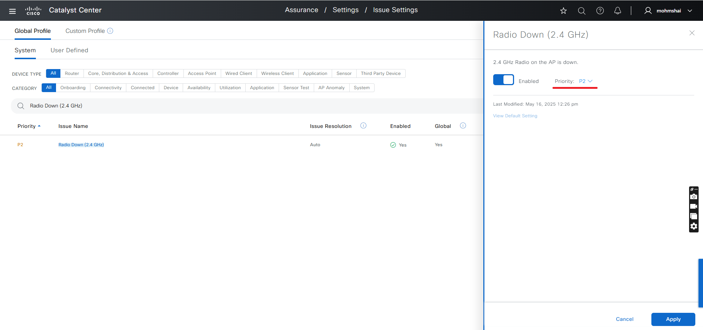

# Assurance Issues Management Workflow Playbook

This workflow playbook automates the management of assurance issues within Cisco Catalyst Center (formerly Cisco DNA Center).      

It provides tasks to interact with assurance issues, such as creating, updating, and deleting custom assurance issues. The workflow also enables configuration of thresholds, rules, and other assurance settings, helping streamline issue detection and response within the Catalyst Center platform. For more details, refer to the [Ansible Galaxy documentation](https://galaxy.ansible.com/ui/repo/published/cisco/dnac/content/module/assurance_issue_workflow_manager/).

## Workflow Key Features
- **Create, Update, and Delete Assurance Issues**: Automate the management of custom assurance issues.
- **Modify System Define issues**: Update existing system-defined assurance issues.
- **Threshold Configuration**: Set and modify thresholds for various assurance metrics. 

**Version Added:**  
`6.32.0`

## Workflow Steps

### This workflow typically involves the following steps:

### Step 1: Install and Configure Host Inventory

1.  **Install Ansible:** Follow the official Ansible documentation for installation instructions.
2.  **Install Cisco Catalyst Center Collection:**
    ```bash
    ansible-galaxy collection install cisco.dnac
    ```
3.  **Generate Inventory:** Create an Ansible inventory file (e.g., `inventory.yml`) that includes your Cisco Catalyst Center appliance details. You will need to define variables such as the host, username, and password (or other authentication methods).
    ```yaml
    catalyst_center_hosts:
        hosts:
            your_catalyst_center_instance_name:
                catalyst_center_host: xx.xx.xx.xx
                catalyst_center_password: XXXXXXXX
                catalyst_center_port: 443
                catalyst_center_timeout: 60
                catalyst_center_username: admin
                catalyst_center_verify: false # Set to true for production with valid certificates
                catalyst_center_version: 2.3.7.9 # Specify your DNA Center version
                catalyst_center_debug: true
                catalyst_center_log_level: INFO
                catalyst_center_log: true
    ```

### Step 2: Define Inputs and Validate

This step involves preparing the input data for creating or managing assurance issue setting and validating your setup.

1.  **Define Input Variables:** Create variable files (e.g., `vars/assurance_issues_management_inputs.yml`) that define the desired state of your assurance issue setting, including details for creation, update, and deletion. 

#### Schema for Assurance Issues Management
The schema file (e.g., `schema/assurance_issues_management_schema.yml`) defines the structure and validation rules for the input variables. It includes details such as required fields, data types, and constraints.

**assurance_issues_settings_type**

| **Parameter**                        | **Type**   | **Required** | **Description**                                        |
|--------------------------------------|------------|--------------|--------------------------------------------------------|
| assurance_user_defined_issue_settings| list       | No           | List of user-defined issue settings                    |
| assurance_system_issue_settings      | list       | No           | List of system-defined issue settings                  |

**assurance_user_defined_issue_settings_type**

| **Parameter**            | **Type**   | **Required** | **Allowed Values**           | **Description**                  |
|-------------------------|------------|--------------|------------------------------|---------------------------------- |
| name                    | string     | Yes          |                              | Issue name                       |
| description             | string     | No           |                              | A brief explanation of the issue                                 |
| rules                   | list       | No           | List of `rules_type`         |A set of rules that define the parameters                                   |
| is_enabled              | bool       | No           |                              |Enables or disables the issue setting                                  |
| priority                | enum       | No           | P1, P2, P3, P4               |Specifies the priority of the issue between p1 to p4                                  |
| is_notification_enabled | bool       | No           |                              |Boolean value to specify if notifications should be enabled                                  |
| prev_name               | string     | No           |                              | For updating existing issues     |

**rules_type**

| **Parameter**         | **Type**   | **Required** | **Allowed Values**                | **Description** |
|----------------------|------------|--------------|-----------------------------------------------------------------------------------------------------------------------|-----------------|
| pattern              | string     | No           |                                                                                                                       |     A pattern or regular expression defining the issue detection criteria            |
| occurrences          | number     | No           |                                                                                                                       |    The number of times the issue pattern must occur before triggering the issue             |
| duration_in_minutes  | number     | No           |                                                                                                                       |The duration, in minutes, for which the issue pattern must persist to be considered valid.                 |
| severity             | enum       | No           | 0, 1, 2, 3, 4, 5, 6, Emergency, Alert, Critical, Error, Warning, Notice, Info                                        |Specifies the severity level of the issue. can be an integer (0 to 6) or corresponding string representation.                  |
| facility             | enum       | No           | CI, PLATFORM_ENV, ..., STACKMGR (see schema for full list)                                                           | The facility type that the rule applies to.                |
| mnemonic             | enum       | No           | SHUT_LC_FANGONE, SHUTFANGONE, ..., STACK_LINK_CHANGE (see schema for full list)                                      |A system-generated identifier or label representing the issue.                 |

**assurance_system_issue_settings_type**

| **Parameter**                | **Type**   | **Required** | **Allowed Values**                                   | **Description**                  |
|-----------------------------|------------|--------------|------------------------------------------------------|----------------------------------|
| name                        | string     | Yes          |                                                      | Issue name                       |
| description                 | string     | Yes          |                                                      |Explains system issue settings and required threshold updates for defined issue names.                                  |
| device_type                 | enum       | Yes          | Router, SWITCH_AND_HUB, UNIFIED_AP, FIREWALL, CONTROLLER, WIRED_CLIENT | Specifies the type of device to which the issue configuration applies. for choices check Allowed Values.                                  |
| synchronize_to_health_threshold | bool   | Yes          |                                                      |A boolean value indicating whether the system issue should be synchronized to the health threshold.                                  |
| priority                    | enum       | Yes          | P1, P2, P3, P4                                       |Specifies the priority level of the issue.                       |
| issue_enabled               | bool       | Yes          |                                                      | A boolean value that determines whether the issue is enabled or disabled.                                 |
| threshold_value             | int        | Yes          |                                                      | The threshold value that triggers the issue. This is usually specified as a percentage or a numerical value depending on the nature of the issue.                                 |
| prev_name                   | string     | No           |                                                      | The previous name of the issue setting (used when updating an existing issue setting).                                 |
| issue_name                  | string     | No           |                                                      | Name of the issue                                 |
| issue_process_type          | enum       | No           | resolution, ignore, command_execution                |Defines the action to be taken on the issue. Possible values: resolution: Resolves the issue. ignore: Ignores the issue.                                  |
| start_datetime              | string     | No           |                                                      | A filter to select issues that started at or after this date and time.                                 |
| end_datetime                | string     | No           |                                                      | A filter to select issues that ended at or before this date and time.                                 |
| site_hierarchy              | string     | No           |                                                      | A filter to select issues based on the site location hierarchy. The format is "Global/Region/Location/Building"                                 |
| priority                    | enum       | No           | P1, P2, P3, P4                                       | A filter to select issues based on their priority                                 |
| issue_status                | enum       | No           | ACTIVE, RESOLVED, IGNORED                            | A filter to select issues based on their status.                                 |
| device_name                 | string     | No           |                                                      | A filter to select issues based on the device name that is associated with the issue                                 |
| mac_address                 | string     | No           |                                                      | A filter to select issues based on the MAC address of the device associated with the issue                                 |
| network_device_ip_address   | string     | No           |                                                      | A filter to select issues based on the network device's IP                                 |

> **Note:** For full lists of allowed values for `facility` and `mnemonic`, refer to the schema file `schema/assurance_issues_management_schema.yml` or [ansible galaxy document](https://galaxy.ansible.com/ui/repo/published/cisco/dnac/content/module/assurance_issue_workflow_manager/). All lists can have 0 to 1000 items unless otherwise specified.

2.  **Validate Configuration:** 
To ensure a successful execution of the playbooks with your specified inputs, follow these steps:

**Input Validation**:
Before executing the playbook, it is essential to validate the input schema. This step ensures that all required parameters are included and correctly formatted. Run the following command *./tools/validate.sh -s* to perform the validation providing the schema path -d and the input path.

```bash
#validates input file against the schema
./tools/validate.sh -s ./workflows/assurance_issues_management/schema/assurance_issues_management_schema.yml -d ./workflows/assurance_issues_management/vars/assurance_issues_management_inputs.yml
```

## Workflow overview with example

## 1. **Create Assurance Issues**: 
### Create a new assurance issue with the specified parameters.

In this example, we are creating a custom assurance issue called **"High CPU Usage Alert issue"**. This issue is designed to trigger an alert when CPU usage on a device exceeds a defined threshold. 

**Prerequisites**: The device(s) you want to monitor must be managed by Cisco Catalyst Center and sending telemetry data relevant to the rule you define (e.g., LISP events for this example).

### Example: Input YAML
```yaml
catalyst_center_version: 2.3.7.9
assurance_issues_settings:
  - assurance_user_defined_issue_settings:
      - name: High CPU Usage Alert issue
        description: Triggers an alert when CPU usage exceeds threshold
        rules:
          - severity: Warning
            facility: LISP
            mnemonic: MAP_CACHE_WARNING_THRESHOLD_REACHED
            pattern: The LISP map-cache limit warning threshold * entries for instance-id * has been reached.
            occurrences: 1
            duration_in_minutes: 2
        is_enabled: true
        priority: P1
        is_notification_enabled: false
```

### Step1: Execute the assurance issue management playbook. 

```bash
ansible-playbook -i ./inventory/demo_lab/hosts.yaml ./workflows/assurance_issues_management/playbook/assurance_issues_management_playbook.yml --extra-vars VARS_FILE_PATH=./../vars/assurance_issues_management_inputs.yml -vvvv 
```

#### Upon successful completion, issue will be created


### Step 3: Verify the playbook output

#### Upon successful completion, you will see an output similar to:

```yaml
"msg": {
        "High CPU Usage Alert issue": "user-defined issue created successfully"
        },
```

### Example: Input YAML for Creating Multiple Issues

You can also create multiple assurance issues in a single playbook run by specifying more than one entry under `assurance_user_defined_issue_settings`:
```yaml
assurance_issues_settings:
  - assurance_user_defined_issue_settings:
      - name: critical temperature warning
        description: temperature levels above safe operating limits.
        rules:
          - severity: Error
            facility: CMRP_ENVMON
            mnemonic: TEMP_WARN_CRITICAL
            pattern: "Error: Failed or underperforming cooling for System:*"
            occurrences: 1
            duration_in_minutes: 2
        is_enabled: true
        priority: P1
        is_notification_enabled: false
      - name: High Availability role has changed
        description: The system is part of an HA pair, and one unit changed its role
        rules:
          - severity: Info
            facility: SMART_LIC
            mnemonic: HA_ROLE_CHANGED
            pattern: Smart Agent HA role changed to *
            occurrences: 1
            duration_in_minutes: 3
        is_enabled: true
        priority: P1
        is_notification_enabled: true
```

## 2. **Update Assurance Issues**: 
### Update an existing assurance issue.

In this example, we are updating the previously created **"High CPU Usage Alert issue"**. The updates include:
- **Changing the issue name** from "High CPU Usage Alert issue" to **"Excessive CPU Utilization Alert"** for better clarity.
- **Modifying the rule's duration_in_minutes** from 2 to 3, which means the alert will now trigger if the high CPU usage condition persists for 3 minutes instead of 2.

### Example: Input YAML
```yaml
catalyst_center_version: 2.3.7.9
assurance_issues_settings:
  - assurance_user_defined_issue_settings:
      - prev_name: High CPU Usage Alert issue
        name: Excessive CPU Utilization Alert
        description: Triggers an alert when CPU usage exceeds threshold
        rules:
          - severity: Warning
            facility: LISP
            mnemonic: MAP_CACHE_WARNING_THRESHOLD_REACHED
            pattern: The LISP map-cache limit warning threshold * entries for instance-id * has been reac.
            occurrences: 1
            duration_in_minutes: 3
        is_enabled: true
        priority: P1
        is_notification_enabled: false
```

### Step1: Execute the assurance issue management playbook. 

```bash
ansible-playbook -i ./inventory/demo_lab/hosts.yaml ./workflows/assurance_issues_management/playbook/assurance_issues_management_playbook.yml --extra-vars VARS_FILE_PATH=./../vars/assurance_issues_management_inputs.yml -vvvv 
```

#### Upon successful completion, issue details will be updated


### Step 3: Verify the playbook output

#### Upon successful completion, you will see an output similar to:

```yaml
"msg": {
        "High CPU Usage Alert issue": "User defined issues updated Successfully"
        },
```

### Example: Input YAML for Updating Multiple Issues

You can also update multiple assurance issues in a single playbook run by specifying more than one entry under `assurance_user_defined_issue_settings`:
```yaml
catalyst_center_version: 2.3.7.9
assurance_issues_settings:
  - assurance_user_defined_issue_settings:
      - prev_name: High CPU Usage Alert issue
        name: Excessive CPU Utilization Alert
        description: Triggers an alert when CPU usage exceeds threshold
        rules:
          - severity: Warning
            facility: LISP
            mnemonic: MAP_CACHE_WARNING_THRESHOLD_REACHED
            pattern: The LISP map-cache limit warning threshold * entries for instance-id * has been reached.
            occurrences: 1
            duration_in_minutes: 3
        is_enabled: true
        priority: P2
        is_notification_enabled: false
      - prev_name: critical temperature warning
        name: critical temperature warning updated
        description: Updated description for temperature warning.
        rules:
          - severity: Error
            facility: CMRP_ENVMON
            mnemonic: TEMP_WARN_CRITICAL
            pattern: "Error: Failed or underperforming cooling for System:*"
            occurrences: 2
            duration_in_minutes: 5
        is_enabled: true
        priority: P2
        is_notification_enabled: true
```

## 3. **Delete Assurance Issues**: 
### Delete an existing assurance issue.

In this example, we are deleting the previously updated assurance issue named **"Excessive CPU Utilization Alert"**. Deleting an assurance issue will remove its configuration from Cisco Catalyst Center, and the system will no longer monitor or alert based on the rules defined in that issue.  

**Important Note**: To delete an assurance issue, you must run the playbook specifically designed for deletion (for example, `delete_assurance_issues_management_playbook.yml`). This playbook will process the input file in "deleted" state and remove the specified issue from the system.

### Example: Input YAML
```yaml
catalyst_center_version: 2.3.7.9
assurance_issues_settings:
  - assurance_user_defined_issue_settings:
    - name: Excessive CPU Utilization Alert
```

### Step1: Execute the assurance issue management playbook. 

```bash
ansible-playbook -i ./inventory/demo_lab/hosts.yaml ./workflows/assurance_issues_management/playbook/delete_assurance_issues_management_playbook.yml --extra-vars VARS_FILE_PATH=./../vars/assurance_issues_management_inputs.yml -vvvv 
```

#### Upon successful completion, issue will be removed from cisco catalyst center


### Step 3: Verify the playbook output

#### Upon successful completion, you will see an output similar to:

```yaml
"msg": {
        "High CPU Usage Alert issue": "Assurance user-defined issue deleted successfully"
        },
```

### Example: Input YAML for Deleting Multiple Issues

You can also delete multiple assurance issues in a single playbook run by specifying more than one entry under `assurance_user_defined_issue_settings`:

```yaml
catalyst_center_version: 2.3.7.9
assurance_issues_settings:
  - assurance_user_defined_issue_settings:
      - name: Excessive CPU Utilization Alert
      - name: critical temperature warning updated
      - name: High Availability role has changed
```

## 4. **Update System Defined Issues**:
### Modify an existing system-defined assurance issue.

In this example, we are updating the system-defined issue named **"Radio Down (2.4 GHz)"**. based on the name, description, and device type. we can update the issue settings to better fit our environment. The update includes: priority, issue_enabled and threshold_value depends on the issue we are updating. here we are updating the priority to P2.

### Example: Input YAML
```yaml
catalyst_center_version: 2.3.7.9
assurance_issues_settings:
  - assurance_system_issue_settings:
      - name: "Radio Down (2.4 GHz)"
        description: 2.4 GHz Radio on the AP is down.
        device_type: UNIFIED_AP
        priority: P2
        issue_enabled: true
```

### Step 1: Execute the assurance issue management playbook. 

```bash
ansible-playbook -i ./inventory/demo_lab/hosts.yaml ./workflows/assurance_issues_management/playbook/assurance_issues_management_playbook.yml --extra-vars VARS_FILE_PATH=./../vars/assurance_issues_management_inputs.yml -vvvv 
```

### Upon successful completion, the issue will be updated in Cisco Catalyst Center

#### Before Updating


#### After Updating


### Step 3: Verify the playbook output

#### Upon successful completion, you will see an output similar to:

```yaml
"msg": {
        "High CPU Usage Alert issue": "System issue updated successfully"
        },
```

### Example: Input YAML for Updating Multiple System Defined Issues
You can also update multiple system-defined assurance issues in a single playbook run by specifying more than one entry under `assurance_system_issue_settings`:

```yaml
assurance_issues_settings:
  - assurance_system_issue_settings:
    - name: "TCAM Utilization High Issues"
      description: TCAM Utilization
      device_type: SWITCH_AND_HUB
      priority: P1
      issue_enabled: true
      threshold_value: 80
    - name: "Dual-Active Detection Link has failed"
      description: Dual-Active Detection Link has failed on the Network Device
      device_type: SWITCH_AND_HUB
      priority: P2
      issue_enabled: true
```

## Run line parameters description:

- `-i`: Specifies the inventory file containing host details.  
- `--e VARS_FILE_PATH`: Path to the variable file containing workflow inputs.  
- `-vvvv`: Enables verbose mode for detailed output.  

## Post-Execution Monitoring
After the playbook execution, you can verify the results in the Cisco Catalyst Center UI under the Assurance section. If dnac_debug is enabled in your inventory, you can also review the Ansible logs for detailed information on the API calls and responses.

## Reference
Refer to the workflow's schema file (workflows/assurance_issues_management/schema/assurance_issues_management_schema.yml) for the definitive list of input parameters and their descriptions.

## Note: The environment used for the references in the above instructions is as follows:

```bash
python: 3.10.10
dnac_version: 2.3.7.9
ansible: 9.9.0
cisco.dnac: 6.32.0
dnacentersdk: 2.10.14
```
