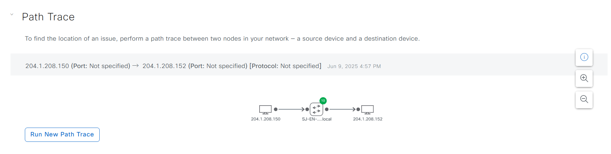

# Catalyst Center Assurance Path Trace Playbook

## Overview

This Playbook provides functionality to perform path trace analysis between network nodes in Cisco Catalyst Center.

**Description**

This Playbook enables network administrators to trace the communication path between two endpoints in the network using Cisco Catalyst Center. The endpoints can be wired or wireless hosts or Layer 3 interfaces. The path trace uses protocol-specific analysis to evaluate the connectivity and intermediate devices. Key features include:
  - **Path Trace Configuration**
    - Initiate a path trace between a defined source and destination in the network.
    - Specify communication protocol (TCP or UDP) to establish the trace session.
    - Support for mixed endpoint types: wired/wireless hosts and Layer 3 interfaces.
  - **Topology Discovery and Analysis**
    - Automatically gathers network topology and routing information from discovered devices.
    - Computes and visualizes the path taken by the packets across the network.
    - Displays the full t*opology path, including intermediate hops and final destination.
  - **Path Visualization**
    - Interactive display of devices involved in the trace, along with their IP addresses.
    - Shows path direction and types of each hop (e.g., Switched, STP, ECMP, Routed, Trace Route).
    - Differentiates the protocol behavior and role of each network segment in the trace.
  - **Protocol-Specific Insights**
    - Provides protocol-based tracing using either TCP or UDP.
    - Helps identify protocol-specific path deviations, drops, or delays.
  - **Comprehensive Node Support**
    - Supports tracing between any combination of supported endpoints (host-to-host, interface-to-interface, or mixed)
    - Useful for both operational troubleshooting and proactive network analysis.


**Version Added:**  
`6.32.0`

---

This README outlines the steps to use the Ansible playbooks for managing assurance path trace in Cisco Catalyst Center.

## Workflow Steps

This workflow typically involves the following steps:

### Step 1: Install and Generate Inventory

Before running the playbooks, ensure you have Ansible installed and the necessary collections for Cisco Catalyst Center.

1.  **Install Ansible:** Follow the official Ansible documentation for installation instructions.
2.  **Install Cisco Catalyst Center Collection:**
    ```bash
    ansible-galaxy collection install cisco.dnac
    ```
3.  **Generate Inventory:** Create an Ansible inventory file (e.g., `inventory.yml`) that includes your Cisco Catalyst Center appliance details. You will need to define variables such as the host, username, and password (or other authentication methods).
    ```yaml
    catalyst_center_hosts:
        hosts:
            your_catalyst_center_instance_name:
                catalyst_center_host: xx.xx.xx.xx
                catalyst_center_password: XXXXXXXX
                catalyst_center_port: 443
                catalyst_center_timeout: 60
                catalyst_center_username: admin
                catalyst_center_verify: false # Set to true for production with valid certificates
                catalyst_center_version: 2.3.7.9 # Specify your DNA Center version
                catalyst_center_debug: true
                catalyst_center_log_level: INFO
                catalyst_center_log: true
    ```

### Step 2: Define Inputs and Validate

This step involves preparing the input data for configuring path trace diagnostics and setting trace parameters.

1.  **Define Input Variables:** Create the variable file at (e.g., `workflows/assurance_pathtrace/vars/assurance_pathtrace_inputs.yml`).This file should contain the list of source/destination IP addresses and optional trace configuration settings.

2.  **Review Structure and Options:** Refer to the full workflow specification for detailed instructions on the available options and their structure: https://galaxy.ansible.com/ui/repo/published/cisco/dnac/content/Playbook/path_trace


#### Schema for Path Trace  
This schema defines the structure of the input file for configuring a Path Trace in Cisco Catalyst Center. Below is a breakdown of the parameters, including their requirements and descriptions.

| **Parameter**               | **Type** | **Required** | **Default Value** | **Description** |
|----------------------------|----------|--------------|-------------------|---------------------------------------------------------------------------------------------|
| `source_ip`                | String   | No           | N/A               | The source IP address for the path trace.|
| `dest_ip`                  | String   | No           | N/A               | The destination IP address for the path trace.|
| `source_port`              | Integer  | No           | N/A               | The source port for the path trace (optional). |
| `dest_port`                | Integer  | No           | N/A               | The destination port for the path trace (optional).|
| `protocol`                 | String   | No           | N/A               | The protocol to use for the path trace (optional). Choices: `TCP`, `UDP`. |
| `include_stats`            | List     | No           | N/A               | A list of optional statistics to include in the path trace. E.g., `DEVICE_STATS`, `INTERFACE_STATS`, `QOS_STATS`, `PERFORMANCE_STATS`, `ACL_TRACE`. |
| `periodic_refresh`         | Boolean  | No           | true              | Boolean value to enable periodic refresh for the path trace. |
| `get_last_pathtrace_result`| Boolean  | No           | true              | Boolean value to display the last result again for the path trace. |
| `delete_on_completion`     | Boolean  | No           | true              | Boolean value indicating whether to delete the path trace after generation. Applies only when `periodic_refresh` is false. |
| `flow_analysis_id`         | String   | No           | N/A               | The Flow Analysis ID returned when a path trace is created. Used to retrieve or delete the trace. |

# Path Trace Limitations
 For a complete list of limitations and supported scenarios, please refer to the official documentation: https://galaxy.ansible.com/ui/repo/published/cisco/dnac/content/module/path_trace

## Example Input File

1. **Create and auto-delete path trace on Cisco Catalyst Center**
Initiates a path trace between specified source and destination IPs using optional parameters, and automatically deletes the trace after completion for cleanup.
```yaml
catalyst_center_version: 2.3.7.6
pathtrace_details: 
  - source_ip: "204.1.208.150"  # required field
    dest_ip: "204.1.208.152"  # required field
    source_port: 4020  # optional field
    dest_port: 4021  # optional field
    protocol: "TCP"  # optional field
    include_stats:  # optional field
      - DEVICE_STATS
      - INTERFACE_STATS
      - QOS_STATS
      - PERFORMANCE_STATS
      - ACL_TRACE
    periodic_refresh: false  # optional field
    delete_on_completion: true  # optional field
  - source_ip: "204.1.208.150"  # required field
    dest_ip: "204.1.208.152" # required field
    get_last_pathtrace_result: true
  ```
2. **Delete path trace based on source and destination IP**
Removes an existing path trace session from Catalyst Center by specifying the source and destination IP addresses.
```yaml
catalyst_center_version: 2.3.7.6
pathtrace_details: 
  - source_ip: "204.1.208.150"  # required field
    dest_ip: "204.1.208.152"  # required field
```
3. **Retrieve last path trace**
Fetches the most recent path trace result for a given source and destination IP pair, allowing you to review the latest analysis.
```yaml
catalyst_center_version: 2.3.7.6
pathtrace_details: 
  - source_ip: "204.1.2.3"  # required field
    dest_ip: "204.1.2.4"  # required field
    get_last_pathtrace_result: true
```
4. **Retrieve path trace based on the flow analysis id**
Obtains the details of a specific path trace using its unique flow analysis ID, which is returned when a path trace is created.
```yaml
catalyst_center_version: 2.3.7.6
pathtrace_details: 
  - flow_analysis_id: db3b2ee6-7ec7-4ec8-b7d0-2286d726b568
    delete_on_completion: false  # optional field
register: output_list
```
5. **Retrieve and Delete Path Trace Between Specific Source and Destination IPs**
Performs both retrieval and deletion of a path trace session for a given source and destination IP
```yaml
catalyst_center_version: 2.3.7.6
pathtrace_details: 
  - source_ip: "204.1.2.3"  # required field
    dest_ip: "204.1.2.4"  # required field
register: output_list
```
6. **Delete path trace based on the flow analysis id**
Removes a path trace session by directly specifying its flow analysis ID.
```yaml
catalyst_center_version: 2.3.7.6
pathtrace_details: 
  - flow_analysis_id: db3b2ee6-7ec7-4ec8-b7d0-2286d726b568
```
7. **Create/Retrieve Path trace for the config list.**
Allows batch creation or retrieval of multiple path traces as defined in a configuration list, supporting complex scenarios with various endpoints and options.
```yaml
catalyst_center_version: 2.3.7.6
pathtrace_details: 
  - source_ip: "204.1.2.3"  # required field
    dest_ip: "204.1.2.4"  # required field
    source_port: 4020  # optional field
    dest_port: 4021  # optional field
    protocol: "TCP"  # optional field
    include_stats:  # optional field
      - DEVICE_STATS
      - INTERFACE_STATS
      - QOS_STATS
      - PERFORMANCE_STATS
      - ACL_TRACE
    periodic_refresh: false  # optional field
    delete_on_completion: true  # optional field

  - source_ip: "204.1.1.2"  # required field
    dest_ip: "204.1.2.4"  # required field
    get_last_pathtrace_result: true  # optional field
    delete_on_completion: true  # optional field

  - flow_analysis_id: db3b2ee6-7ec7-4ec8-b7d0-2286d726b568
```
mapping config to UI Actions for Create path Trace:
Note: There is no UI flow for retrieve and delete path trace.



2.  **Validate Configuration:** 
To ensure a successful execution of the playbooks with your specified inputs, follow these steps:

  **Input Validation**:
  Before executing the playbook, it is essential to validate the input schema. This step ensures that all required parameters are included and correctly formatted. Run the following command *./tools/validate.sh -s* to perform the validation providing the schema path -d and the input path.

```bash
./tools/validate.sh -s ./workflows/assurance_pathtrace/schema/assurance_pathtrace_schema.yml -d ./workflows/assurance_pathtrace/vars/assurance_pathtrace_inputs.yml
```

### run Schema Validation:
catc_ansible_workflows % yamale -s workflows/assurance_pathtrace/schema/assurance_pathtrace_schema.yml  workflows/assurance_pathtrace/vars/assurance_pathtrace_inputs.yml 
Validating workflows/assurance_pathtrace/vars/assurance_pathtrace_inputs.yml...
Validation success! 👍

### Step 3: Deploy and Verify

This is the final step where you deploy the configuration to Cisco Catalyst Center and verify the changes.

1.  **Deploy Configuration:** 

Run the playbook to seamlessly apply the assurance path trace configuration defined in your input variables to Cisco Catalyst Center. 
Before proceeding, ensure that the input validation step has been completed successfully, with no errors detected in the provided variables. Once validated, execute the playbook by specifying the input file path using the --e variable as VARS_FILE_PATH. The VARS_FILE_PATH must be provided as a full path to the input file.
This ensures that the configuration is accurately deployed to Cisco Catalyst Center, automating the setup process and reducing the risk of manual errors.

```bash

ansible-playbook -i ./inventory/iac2/hosts.yml /workflows/assurance_pathtrace/playbook/assurance_pathtrace_playbook.yml --extra-vars VARS_FILE_PATH=./../vars/assurance_pathtrace_inputs.yml > logs/path_trace.log -vvvvvv    
```

If there is an error in the input or an issue with the API call during execution, the playbook will halt and display the relevant error details.


2.  **Verify Deployment:** 
After executing the playbook, check the Catalyst Center UI to verify path trace. If *debug_log* is enabled, you can also review the logs for detailed information on operations performed and any updates made.

---

### References

*Note: The environment used for the references in the above instructions is as follows:*

```yaml
python: 3.12.0
dnac_version: 2.3.7.9
ansible: 9.9.0
cisco.dnac: 6.32.0
dnacentersdk: 2.8.8
```

# Pathtrace Limitations

All the below listed Catalyst Center Path trace limitation apply to workflow/playbook also

## Path trace has the following limitations and restrictions.

    Path trace from a third-party device in Catalyst Center is not supported.

    Path trace between a fabric client and a nonfabric client is not supported.

    Path trace between two fabric clients over multi virtual routing and forwarding (VRF) virtual networks (VNs) is not supported.

    Path trace between two fabric clients over multi sites (domains) is not supported.

    Clients connected in the same fabric and same site where either edge switch is not part of the fabric is not supported.

    Path trace from a router's loopback interface is not supported.

    Overlapping IP addresses are not supported with or without fabric.

    For path trace to work on a Locator ID/Separation Protocol (LISP) fabric, make sure that the traffic is running and cache is available on the edge switches.

    Path trace in Cisco Adaptive Security Appliances (ASA) is not supported because Cisco ASA does not support CDP. It is not possible to identify the path through the Cisco ASA appliance.

    Path trace is not supported for the management interface in wireless controllers in untagged mode.

    Path trace for centralized Wireless Mobility Modes Asymmetric Mobility Tunneling is not supported.

    Path trace for Virtual Switching System (VSS), Multi-Link Aggregation Control Protocol (MLACP), or Virtual PortChannel (vPC) is not supported.

    Path trace for Equal-Cost Multi-Path Routing (ECMP) over Switched Virtual Interface (SVI) is not supported.

    Path trace is not supported on devices with NAT or firewall.

    Cisco Performance Routing (PfR) is not supported with DMVPN tunnels.

    Path trace that has VLAN ACLs (VACLs) enabled is not supported.

    For a Non Periodic Refresh (NPR) path scenario, after an upgrade, the controller does not refresh the path. Additionally, statistics collection stops. To continue statistics collection, you must initiate a new path request.

    Path trace from a host in a Hot Standby Router Protocol (HSRP) VLAN to a host in a non-HSRP VLAN that is connected to any of the HSRP routers is not supported.

    Object groups are not supported in an ACL trace.

    Port-channel Port Aggregation Protocol (PAgP) mode is not supported. Only LACP mode is supported.

    Applying a performance monitor configuration using Catalyst Center fails if there is a different performance monitor policy configuration on the interface. Remove the performance monitor configuration on the interface and resubmit the path trace request.

    Path trace for Performance Monitor statistics is not supported for Cisco ASR 1000 Series routers (Cisco IOS XE 16.3.1).

    Path trace for Performance Monitor statistics is not supported for the Cisco Catalyst 3850 Switch (Cisco IOS XE 16.2.x and 16.3.1).

    Path trace for Cisco Mobility Express (ME) wireless controllers is not supported.

    Path trace for wireless clients that use OTT in Cisco SD-Access fabric is not supported.

    Path trace from a Layer 2 switch is not supported.

    Cisco's Industrial Ethernet (IE) Switches are extended nodes as part of the SD-Access solution. Currently, path trace does not recognize extended nodes, so if a topology contains extended nodes, you will get an error message.

    Dual stack that has both IPv4 and IPv6 addresses for devices is not supported. If this occurs, an error message displays stating that the given address is unknown.

    Because Cisco wireless controllers do not send SNMP mobility traps, note the following:

        For a path trace request, Catalyst Center does not have the right egress virtual interface highlighted on any foreign wireless controller.

        The path trace request does not highlight any ACLs applied on the foreign wireless controller.