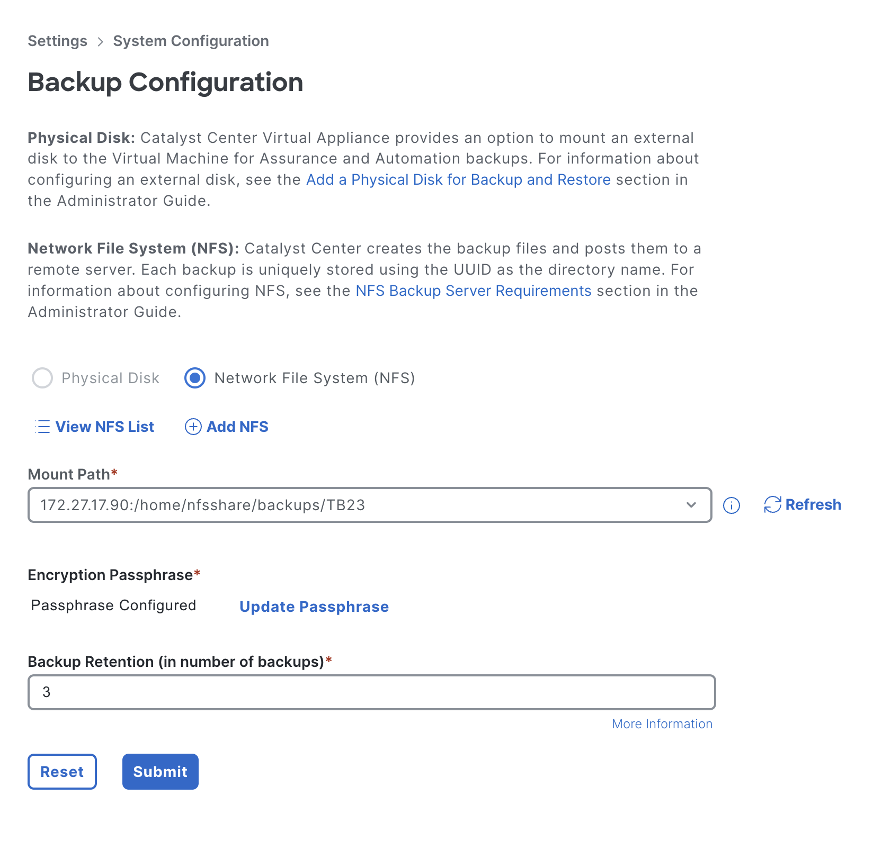
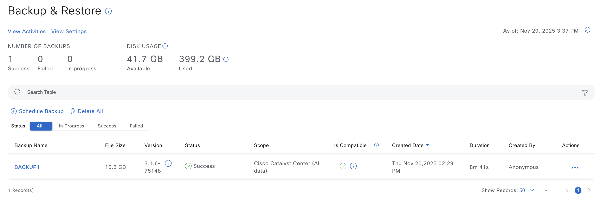

# Backup and Restore Workflow

## Table of Contents

- [Overview](#overview)
- [Features](#features)
- [Prerequisites](#prerequisites)
- [Workflow Structure](#workflow-structure)
- [Schema Parameters](#schema-parameters)
- [Getting Started](#getting-started)
- [Operations](#operations)
- [Examples](#examples)
- [Troubleshooting](#troubleshooting)
- [Best Practices](#best-practices)

---

## Overview

The Backup and Restore workflow automates data protection and disaster recovery operations for Cisco Catalyst Center. It provides NFS storage configuration, encrypted backups with retention policies, and system restoration capabilities.

---

## Features

- **Backup Creation**: Timestamped or fixed-name backups with configurable scope
- **Storage Management**: NFS configuration with encryption and retention (3-60 number of backups to retain)
- **Deletion Strategies**: Remove backups by name, retention policy, or all at once
- **Disaster Recovery**: Restore from encrypted backups
- **Idempotent Operations**: Prevent duplicate backups with fixed naming

---

## Prerequisites

### Software Requirements

| Component | Version |
|-----------|---------|
| Ansible | 6.42.0 |
| Python | 3.9+ |
| Cisco Catalyst Center SDK | 2.10.4 |

### Required Collections

```bash
ansible-galaxy collection install cisco.dnac
ansible-galaxy collection install ansible.utils
pip install dnacentersdk
pip install yamale
```

### Access Requirements

- Catalyst Center admin credentials
- Network connectivity to Catalyst Center API
- NFS server accessible from Catalyst Center
- Firewall rules for NFS ports (2049, 111)

---

## Workflow Structure

```
backup_and_restore/
├── playbook/
│   ├── backup_and_restore_playbook.yml          # Main operations (state: merged)
│   └── delete_backup_and_restore_playbook.yml   # Deletion (state: deleted)
├── vars/
│   ├── backup_and_restore_inputs.yml            # Complete workflow
│   └── delete_backup_and_restore_inputs.yml     # Deletion examples
├── schema/
│   ├── backup_and_restore_schema.yml               #configuration validation
|   └── delete_backup_and_restore_schema.yml        # Configuration validation
└── ReadMe.md
```

---

## Schema Parameters

### NFS Configuration

| Parameter | Type | Required | Default | Description |
|-----------|------|----------|---------|-------------|
| server_ip | string | Yes | - | NFS server IP address |
| source_path | string | Yes | - | Directory path on NFS server |
| nfs_port | integer | No | 2049 | NFS service port (1-65535) |
| nfs_version | string | No | nfs4 | Protocol version (nfs3/nfs4) |
| nfs_portmapper_port | integer | No | 111 | Portmapper port (1-65535) |

### Backup Storage Configuration

| Parameter | Type | Required | Default | Description |
|-----------|------|----------|---------|-------------|
| server_type | string | Yes | - | Storage type (NFS/PHYSICAL_DISK*) |
| nfs_details | dict | Yes** | - | NFS connection details |
| data_retention_period | integer | Yes | - | Retention (3-60 number of backups to retain) |
| encryption_passphrase | string | Yes | - | Backup encryption passphrase |

\*\* *Required when server_type is NFS*

### Backup Operations

| Parameter | Type | Required | Default | Description |
|-----------|------|----------|---------|-------------|
| name | string | Yes | - | Backup name or prefix |
| generate_new_backup | boolean | No | false | Append timestamp to name |
| scope | string | Yes | - | Defines Backup Scope |
| delete_all_backup | boolean | No | false | Delete all backups (state=deleted) |
| backup_retention_days | integer | No | - | Delete older than N days (state=deleted) |
| backup_task_timeout | integer | N0 | false | Maximum time in seconds to wait for backup creation |

**Naming Rules:**
- Must begin with alphabet (A-Z, a-z)
- Allowed: letters, digits, @, _, -, space, #
- Timestamp format: YYYYMMDD_HHMMSS (IST)

**Backup Scopes:**
- `CISCO_DNA_DATA_WITH_ASSURANCE`: ~10-15 GB (full backup)
- `CISCO_DNA_DATA_WITHOUT_ASSURANCE`: ~5-8 GB (without assurance)

### Restore Operations

| Parameter | Type | Required | Description |
|-----------|------|----------|-------------|
| name | string | Yes | Exact backup name to restore |
| encryption_passphrase | string | Yes | Decryption passphrase |
| restore_task_timeout | integer | No | Maximum time in sec to wait for restore |

\* *Required if backup was encrypted*

---

## Getting Started

### Step 1: Install Collections

```bash
ansible-galaxy collection install cisco.dnac
ansible-galaxy collection install ansible.utils
pip install dnacentersdk
pip install yamale
```

### Step 2: Configure Inventory

Edit `inventory/demo_lab/hosts.yml`:

```yaml
catalyst_center_hosts:
  hosts:
    catalyst_center_primary:
      catalyst_center_host: 10.0.0.0
      catalyst_center_username: admin
      catalyst_center_password: "{{ vault_catalyst_center_password }}"
      catalyst_center_verify: false
      catalyst_center_debug: false
      catalyst_center_log: true
```

### Step 3: Configure Variables

Edit `workflows/backup_and_restore/vars/backup_and_restore_inputs.yml`:

```yaml
backup_restore_details:
  - nfs_configuration:
      - server_ip: 172.27.17.90
        source_path: /home/nfsshare/backups/TB23
        nfs_version: nfs4
    
    backup_storage_configuration:
      - server_type: NFS
        nfs_details:
          server_ip: 172.27.17.90
          source_path: /home/nfsshare/backups/TB23
        data_retention_period: 30
        encryption_passphrase: "YourSecurePassphrase123!"
    
    backup:
      - name: WEEKLY_BACKUP
        scope: CISCO_DNA_DATA_WITH_ASSURANCE
        generate_new_backup: false
```

### Step 4: Validate Configuration

```bash
yamale -s workflows/backup_and_restore/schema/backup_and_restore_schema.yml \
       workflows/backup_and_restore/vars/backup_and_restore_inputs.yml
```

### Step 5: Execute Playbook

```bash
ansible-playbook -i inventory/demo_lab/hosts.yml \
  workflows/backup_and_restore/playbook/backup_and_restore_playbook.yml \
  --extra-vars VARS_FILE_PATH=../vars/backup_and_restore_inputs.yml
```

### Step 6: Verify Configuration

1. Check playbook output for task completion status
2. Log in to Catalyst Center web interface
3. Navigate to **System > Backup & Restore**
4. Verify NFS configuration, storage settings, and backup creation

---

## Operations

### Create Operations (state: merged)

Use `backup_and_restore_playbook.yml` for all creation and restore operations.

#### NFS Configuration

1.Create NFS Configuration

Network File System (NFS) server, which will serve as the designated storage for Cisco Catalyst Center's system backups and facilitates restore operations.

```yaml
backup_restore_details:
  - nfs_configuration:
      - server_ip: 172.27.17.90
        source_path: /home/nfsshare/backups/TB23
        nfs_port: 2049
        nfs_version: nfs4
        nfs_portmapper_port: 111
```


#### Backup Storage Configuration

2.Create Backup Storage Configuration 

The backup storage configuration defines where and how backup data will be stored, serving solely to prepare the storage infrastructure rather than creating or executing the backups themselves.

```yaml
backup_restore_details:
  - backup_storage_configuration:
      - server_type: NFS
        nfs_details:
          server_ip: 172.27.17.90
          source_path: /home/nfsshare/backups/TB23
        data_retention_period: 3
        encryption_passphrase: "SecurePass123!"
```



#### Create Backup

3.Create Backup 

**Timestamped Backup** (always creates new):

```yaml
backup_restore_details:
  - backup:
      - name: DAILY_BACKUP
        scope: CISCO_DNA_DATA_WITH_ASSURANCE
        generate_new_backup: true
```


Result: `DAILY_BACKUP_20241230_143052`

**Fixed Name Backup** (idempotent):

```yaml
backup_restore_details:
  - backup:
      - name: WEEKLY_BACKUP
        scope: CISCO_DNA_DATA_WITH_ASSURANCE
        generate_new_backup: false
```

Result: `WEEKLY_BACKUP` (no duplicate if exists)

#### Restore Backup

4.Restore Backup

Restoring data from previously created backups

⚠️ **System will reboot during restoration**

```yaml
backup_restore_details:
  - restore_operations:
      - name: DAILY_BACKUP_20241230_143052
        encryption_passphrase: "SecurePass123!"
```


**Validate**
Validate Configuration: To ensure a successful execution of the playbooks with your specified inputs, follow these steps:
Input Validation: Before executing the playbook, it is essential to validate the input schema. This step ensures that all required parameters are included and correctly formatted. Run the following command ./tools/validate.sh -s to perform the validation providing the schema path -d and the input path.


```bash
# Validate

./tools/validate.sh   -s workflows/backup_and_restore/schema/backup_and_restore_schema.yml   -d workflows/backup_and_restore/vars/backup_and_restore_inputs.yml
```

Return result validate:

```bash
(pyats-nalakkam) [nalakkam@st-ds-4 dnac_ansible_workflows]$ ./tools/validate.sh   -s workflows/backup_and_restore/schema/backup_and_restore_schema.yml   -d workflows/backup_and_restore/vars/backup_and_restore_inputs.yml
workflows/backup_and_restore/schema/backup_and_restore_schema.yml
workflows/backup_and_restore/vars/backup_and_restore_inputs.yml
yamale   -s workflows/backup_and_restore/schema/backup_and_restore_schema.yml  workflows/backup_and_restore/vars/backup_and_restore_inputs.yml
Validating workflows/backup_and_restore/vars/backup_and_restore_inputs.yml...
Validation success! 👍
```

```bash
# Execute
ansible-playbook -i inventory/demo_lab/hosts.yaml \
  workflows/backup_and_restore/playbook/backup_and_restore_playbook.yml \
  --extra-vars VARS_FILE_PATH=../vars/backup_and_restore_inputs.yml
```

1.Configure NFS Server

Terminal Return 

```code
 nfs_configuration:
        - nfs_port: 2049
          nfs_portmapper_port: 111
          nfs_version: nfs4
          server_ip: 172.27.17.90
          source_path: /home/nfsshare/backups/TB23
      msg: NFS Configuration(s) '/home/nfsshare/backups/TB23' created successfully in Cisco Catalyst Center.
      response: NFS Configuration(s) '/home/nfsshare/backups/TB23' created successfully in Cisco Catalyst Center.
```


2.Configure Backup Storage Settings

Terminal Return

```code
      msg: Backup Configuration(s) '/home/nfsshare/backups/TB23' updated successfully in Cisco Catalyst Center.
      response: Backup Configuration(s) '/home/nfsshare/backups/TB23' updated successfully in Cisco Catalyst Center.
```


3.Create Backup

Terminal Return 

```code
  msg: Backup(s) 'BACKUP1' created successfully in Cisco Catalyst Center.
      response: Backup(s) 'BACKUP1' created successfully in Cisco Catalyst Center.
      status: success
```



4.Restore Operation:

Terminal Return

```code
 msg: Backup(s) 'BACKUP1' restored successfully in Cisco Catalyst Center.
      response: Backup(s) 'BACKUP1' restored successfully in Cisco Catalyst Center.
      status: success
```

---

### Delete Operations (state: deleted)

⚠️ **Use `delete_backup_and_restore_playbook.yml` for all deletion operations.**

Edit `workflows/backup_and_restore/vars/delete_backup_and_restore_inputs.yml` for delete configurations.

#### Delete Specific Backup

```yaml
backup_restore_details:
  - backup:
      - name: BACKUP24_07
```

#### Delete by Retention Policy with Name Filter

Deletes all backups starting with "DAILY_BACKUP" older than 7 days.

```yaml
backup_restore_details:
  - backup:
      - name: DAILY_BACKUP
        backup_retention_days: 7
```

#### Delete by Retention Policy (All Backups)

Deletes ALL backups older than 30 days.

```yaml
backup_restore_details:
  - backup:
      - backup_retention_days: 30
```

#### Delete All Backups

⚠️ **WARNING: Irreversible operation!**
Deletes All Backups

```yaml
backup_restore_details:
  - backup:
      - delete_all_backup: true
```

#### Delete NFS Configuration

```yaml
backup_restore_details:
  - nfs_configuration:
      - server_ip: 172.27.17.90
        source_path: /home/nfsshare/backups/TB23
```

**Validate and Execute:**

```bash
# Validate

./tools/validate.sh   -s workflows/backup_and_restore/schema/delete_backup_and_restore_schema.yml   -d workflows/backup_and_restore/vars/delete_backup_and_restore_inputs.yml
```

Return result validate:

```bash
(pyats-nalakkam) [nalakkam@st-ds-4 dnac_ansible_workflows]$ ./tools/validate.sh   -s workflows/backup_and_restore/schema/delete_backup_and_restore_schema.yml   -d workflows/backup_and_restore/vars/delete_backup_and_restore_inputs.yml
workflows/backup_and_restore/schema/delete_backup_and_restore_schema.yml
workflows/backup_and_restore/vars/delete_backup_and_restore_inputs.yml
yamale   -s workflows/backup_and_restore/schema/delete_backup_and_restore_schema.yml  workflows/backup_and_restore/vars/delete_backup_and_restore_inputs.yml
Validating workflows/backup_and_restore/vars/delete_backup_and_restore_inputs.yml...
Validation success! 👍
```

```bash
# Execute
ansible-playbook -i inventory/demo_lab/hosts.yaml \
  workflows/backup_and_restore/playbook/delete_backup_and_restore_playbook.yml \
  --extra-vars VARS_FILE_PATH=../vars/delete_backup_and_restore_inputs.yml
```

1.Delete Backup 

Terminal Return

```code
      msg: Backup(s) 'BACKUP1' deleted successfully from Cisco Catalyst Center.
      response: Backup(s) 'BACKUP1' deleted successfully from Cisco Catalyst Center.
      status: success
```


2. Delete NFS Server

Terminal Return 

```code
      msg: NFS Configuration(s) '/home/nfsshare/backups/TB23' deleted successfully from Cisco Catalyst Center.
      response: NFS Configuration(s) '/home/nfsshare/backups/TB23' deleted successfully from Cisco Catalyst Center.
      status: success
```


---

## Examples

### Example 1: Complete Daily Backup Workflow

**Description:** Set up NFS, configure storage with encryption, and create daily timestamped backups with a retention policy of 30 copies.

**Use Case:** Automated daily backups for production environment with disaster recovery capability.

```yaml
backup_restore_details:
  - nfs_configuration:
      - server_ip: 172.27.17.90
        source_path: /home/nfsshare/backups/TB23
    backup_storage_configuration:
      - server_type: NFS
        nfs_details:
          server_ip: 172.27.17.90
          source_path: /home/nfsshare/backups/TB23
        data_retention_period: 30
        encryption_passphrase: "Enterprise2024!"
    backup:
      - name: DAILY_BACKUP
        scope: CISCO_DNA_DATA_WITH_ASSURANCE
        generate_new_backup: true
```

### Example 2: Weekly Backup Without Assurance

**Description:** Create weekly backup excluding assurance data to reduce size.

**Use Case:** Regular backups with limited storage capacity, focuses on configuration data only.

```yaml
backup_restore_details:
  - backup:
      - name: WEEKLY_BACKUP
        scope: CISCO_DNA_DATA_WITHOUT_ASSURANCE
        generate_new_backup: false
```

### Example 3: Multiple NFS Servers

**Description:** Configure primary and secondary NFS servers for backup redundancy.

**Use Case:** High availability backup infrastructure with failover capability.

```yaml
backup_restore_details:
  - nfs_configuration:
      - server_ip: 172.27.17.90
        source_path: /home/nfsshare/backups/TB23
      - server_ip: 172.27.17.90
        source_path: /home/nfsshare/backups/TB24
```

### Example 4: Delete Specific Backup

**Description:** Delete a single backup by exact name.

**Use Case:** Remove obsolete or failed backup to free storage space.

```yaml
backup_restore_details:
  - backup:
      - name: OLD_BACKUP_20231215
```

### Example 5: Retention-Based Cleanup

**Description:** Keep 7 days of daily backups using automated cleanup.

**Use Case:** Automated backup lifecycle management with retention policy.

```yaml
backup_restore_details:
  - backup:
      - name: DAILY_BACKUP
        backup_retention_days: 7
```

### Example 6: Delete All Backups Older Than 30 Days

**Description:** Clean up all backups regardless of name that are older than 30 days.

**Use Case:** General cleanup without name filtering for storage maintenance.

```yaml
backup_restore_details:
  - backup:
      - backup_retention_days: 30
```

### Example 7: Delete All Backups (Complete Cleanup)

⚠️ **WARNING: Irreversible operation!**

**Description:** Remove all backups from Catalyst Center for complete infrastructure cleanup.

**Use Case:** Decommissioning backup infrastructure or preparing for migration.

```yaml
backup_restore_details:
  - backup:
      - delete_all_backup: true
```

### Example 8: Delete NFS Configuration

**Description:** Remove NFS server configuration from backup infrastructure.

**Use Case:** Decommissioning NFS server or reconfiguring backup storage.

```yaml
backup_restore_details:
  - nfs_configuration:
      - server_ip: 172.27.17.90
        source_path: /home/nfsshare/backups/TB23
```

### Example 9: Disaster Recovery Restore

**Description:** Restore system from encrypted backup for disaster recovery.

**Use Case:** System recovery after failure or data corruption, restores complete configuration.

```yaml
backup_restore_details:
  - restore_operations:
      - name: DAILY_BACKUP_20241230_143052
        encryption_passphrase: "Enterprise2024!"
```

### Example 10: Long-Term Compliance Backup

**Description:** Monthly backups with maximum retention period for compliance and audit requirements.

**Use Case:** Meet regulatory compliance requiring extended backup retention with full data set.

```yaml
backup_restore_details:
  - backup_storage_configuration:
      - server_type: NFS
        nfs_details:
          server_ip: 172.27.17.90
          source_path: /home/nfsshare/backups/TB23
        data_retention_period: 60
        encryption_passphrase: "Compliance2024!"
  - backup:
      - name: MONTHLY_COMPLIANCE
        scope: CISCO_DNA_DATA_WITH_ASSURANCE
        generate_new_backup: true
```


## Additional Resources

- [Cisco Catalyst Center Documentation](https://www.cisco.com/c/en/us/support/cloud-systems-management/dna-center/series.html)
- [Cisco DNA Center SDK](https://dnacentersdk.readthedocs.io/)
- [Ansible Documentation](https://docs.ansible.com/)
- [Yamale Schema Validation](https://github.com/23andMe/Yamale)
