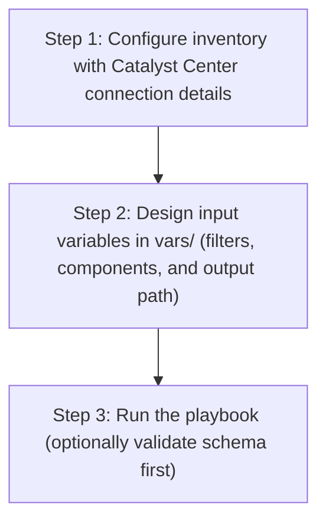

# Backup and Restore Config Generator

## Table of Contents

- [User Flow (3 Steps)](#user-flow-3-steps)

- [Overview](#overview)
- [Features](#features)
- [Prerequisites](#prerequisites)
- [Workflow Structure](#workflow-structure)
- [Schema Parameters](#schema-parameters)
- [Getting Started](#getting-started)
- [Operations](#operations)
- [Examples](#examples)

## User Flow (3 Steps)



---

## Overview

The Backup and Restore config generator automates the creation of YAML playbook configurations for existing NFS configurations and backup storage configurations deployed in Cisco Catalyst Center. This tool reduces the effort required to manually create Ansible playbooks by programmatically generating configurations from existing infrastructure.

---

## Features

- **Configuration Generation**: Generate YAML configurations compatible with `backup_and_restore_workflow_manager` module.
Extract existing NFS configurations and backup storage configurations from your Cisco Catalyst Center.
Convert them into properly formatted YAML files.
Generate files that are ready to use with Ansible automation.
- **Component Filtering**: Selective generation of NFS configurations or backup storage configurations
- **Flexible Output**: Configurable file paths and naming conventions
- **Brownfield Support**: Extract configurations from existing Catalyst Center deployments
- **API Integration**: Leverages native Catalyst Center APIs for data retrieval

---

## Prerequisites

### Software Requirements

| Component | Version |
|-----------|---------|
| Ansible | 2.13+ |
| cisco.dnac collection | 6.49.0+ |
| Python | 3.9+ |
| Cisco Catalyst Center | 3.1.3.0+ |
| dnacentersdk | 2.9.3+ |

### Required Collections

```bash
ansible-galaxy collection install cisco.dnac    # >= 6.49.0
ansible-galaxy collection install ansible.utils
pip install dnacentersdk
pip install yamale
```

### Access Requirements

- Catalyst Center admin credentials
- Network connectivity to Catalyst Center API
- Backup and restore infrastructure deployed and configured
- Existing NFS configurations and backup storage configurations

---

## Workflow Structure

```
backup_and_restore_config_generator/
├── playbook/
│   └── backup_and_restore_config_generator.yml          # Main operations
├── vars/
│   ├── backup_and_restore_config_inputs.yml             # Configuration examples
├── schema/
│   └── backup_and_restore_config_schema.yml             # Input validation
└── README.md                                                
```

---

## Schema Parameters

### Basic Configuration

| Parameter | Type | Required | Default | Description |
|-----------|------|----------|---------|-------------|
| generate_all_configurations | boolean | No | false | Generate all components automatically |
| file_path | string | No | auto-generated | Output file path for YAML configuration file |
| file_mode | string | No | overwrite | File write mode — `overwrite` replaces the file, `append` adds to it |
| component_specific_filters | dict | No | all components | Filters to specify which components to include |

### Component Specific Filtering

| Parameter      | Type | Required | Default | Description |
|--------------|------|----------|-------------|-----------|
| components_list | list | No | ["nfs_configuration","backup_storage_configuration"] |List of components to include in generation |
| nfs_configuration      | list | No | all NFS configurations|NFS configuration filtering criteria |
| backup_storage_configuration | list | No | all backup storage configurations| Backup storage configuration filtering criteria |

**Valid Component Types:**
- `nfs_configuration`: NFS server configurations
- `backup_storage_configuration`: Backup storage configurations  

### NFS Configuration Filters

| Parameter | Type   | Required |  Description |
|-----------|--------|-------------|----------------|
| server_ip | string | False |  Filter by NFS server IP address | 
| source_path   | string| False | Filter by NFS source path |

### Backup Storage Configuration Filters

| Parameter | Type | Required |  Description |
|-----------|------|-------------|-----------------|
| server_type    | string | False |  Filter by server type ("NFS" or "PHYSICAL_DISK") | 

---

## Getting Started

### Step 1: Install Prerequisites

```bash
ansible-galaxy collection install cisco.dnac
ansible-galaxy collection install ansible.utils
pip install dnacentersdk
pip install yamale
```

### Step 2: Configure Inventory

Edit `inventory/demo_lab/hosts.yml`:

```yaml
catalyst_center_hosts:
  hosts:
    catalyst_center_primary:
      catalyst_center_host: 10.0.0.0
      catalyst_center_username: admin
      catalyst_center_password: "password"
```

### Step 3: Configure Variables

Edit `workflows/backup_and_restore_config_generator/vars/backup_and_restore_config_inputs.yml`:

```yaml
backup_and_restore_config:
  - generate_all_configurations: true
    file_path: "/tmp/complete_backup_restore_config.yml"
```

### Step 4: Validate Configuration

```bash
./tools/validate.sh -s workflows/backup_and_restore_config_generator/schema/backup_and_restore_config_schema.yml \
     -d workflows/backup_and_restore_config_generator/vars/backup_and_restore_config_inputs.yml
```

### Step 5: Execute Playbook

The playbook supports two input methods:

#### Option A: Vars file input (recommended for version-controlled configs)

```bash
ansible-playbook -i inventory/demo_lab/hosts.yaml \
  workflows/backup_and_restore_config_generator/playbook/backup_and_restore_config_generator.yml \
  --extra-vars VARS_FILE_PATH=./workflows/backup_and_restore_config_generator/vars/backup_and_restore_config_inputs.yml \
  -vvvv
```

#### Option B: Inventory / host variable input

Omit `VARS_FILE_PATH` and define `backup_and_restore_config` directly as a host variable in your inventory file or in `host_vars`/`group_vars`.

**Example inventory snippet (`inventory/demo_lab/hosts.yaml`):**

```yaml
catalyst_center_hosts:
  hosts:
    catalyst_center_primary:
      catalyst_center_host: "{{ lookup('ansible.builtin.env', 'HOSTIP') }}"
      catalyst_center_password: "{{ lookup('ansible.builtin.env', 'CATALYST_CENTER_PASSWORD') }}"
      catalyst_center_port: 443
      catalyst_center_username: "{{ lookup('ansible.builtin.env', 'CATALYST_CENTER_USERNAME') }}"
      catalyst_center_verify: false
      catalyst_center_version: 2.3.7.9

      # Workflow data defined as host variables
      backup_and_restore_config:
        - generate_all_configurations: true
          file_path: "/tmp/complete_backup_restore_config.yml"
```

Then run **without** `VARS_FILE_PATH`:

```bash
ansible-playbook -i inventory/demo_lab/hosts.yaml \
  workflows/backup_and_restore_config_generator/playbook/backup_and_restore_config_generator.yml \
  -vvvv
```

The playbook auto-detects the input source and prints it at the start:
- `Input source: vars file <path>` when using Option A
- `Input source: inventory / host variables (VARS_FILE_PATH not provided)` when using Option B

> **Note:** When `VARS_FILE_PATH` is provided, it takes **precedence** over inventory variables.

### Workflow Execution

The workflow follows these steps:

1. **Load input** from `VARS_FILE_PATH` (if provided) or fall back to inventory / host variables
2. **Connect** to Catalyst Center using provided credentials
3. **Extract** `file_path` and `file_mode` as top-level module parameters; pass `component_specific_filters` inside `config`
4. **Omit** `config` entirely when `generate_all_configurations: true` (module runs in full auto-discovery mode)
5. **Retrieve** existing NFS configurations and backup storage configurations via API calls
6. **Filter** components based on specified criteria
7. **Transform** API responses into Ansible-compatible format
8. **Generate** YAML configuration file with proper structure
9. **Write** output to specified file path using configured `file_mode`

---

## Operations

### Generate Operations (state: gathered)

Use `backup_and_restore_config_generator.yml` for generating YAML playbook configuration operations.

#### Generate All Configurations

**Description**: Retrieves all NFS configurations and backup storage configurations from Catalyst Center regardless of any filters.

```yaml
backup_and_restore_config:
  - generate_all_configurations: true
    file_path: "/tmp/complete_backup_restore_config.yml"
```

#### Component-Specific Generation

**Description**: Generates configuration for specific component types only.

**Extract NFS Configurations Only**

```yaml
backup_and_restore_config:
  - file_path: "/tmp/nfs_configurations_config.yml"
    component_specific_filters:
      components_list: ["nfs_configuration"]
```

**Extract Backup Storage Configurations Only**

```yaml
backup_and_restore_config:
  - file_path: "/tmp/backup_storage_configurations_config.yml"
    component_specific_filters:
      components_list: ["backup_storage_configuration"]
```

**Validate and Execute:**

```bash
# Validate
./tools/validate.sh -s workflows/backup_and_restore_config_generator/schema/backup_and_restore_config_schema.yml \
     -d workflows/backup_and_restore_config_generator/vars/backup_and_restore_config_inputs.yml
````
Return result validate:
```bash

(pyats-nalakkam) [nalakkam@st-ds-4 dnac_ansible_workflows]$ ./tools/validate.sh -s workflows/backup_and_restore_config_generator/schema/backup_and_restore_config_schema.yml \
>      -d workflows/backup_and_restore_config_generator/vars/backup_and_restore_config_inputs.yml
workflows/backup_and_restore_config_generator/schema/backup_and_restore_config_schema.yml
workflows/backup_and_restore_config_generator/vars/backup_and_restore_config_inputs.yml
yamale   -s workflows/backup_and_restore_config_generator/schema/backup_and_restore_config_schema.yml  workflows/backup_and_restore_config_generator/vars/backup_and_restore_config_inputs.yml
Validating workflows/backup_and_restore_config_generator/vars/backup_and_restore_config_inputs.yml...
Validation success! 👍

```

```bash
# Execute
ansible-playbook -i inventory/demo_lab/hosts.yaml \
  workflows/backup_and_restore_config_generator/playbook/backup_and_restore_config_generator.yml \
  --extra-vars VARS_FILE_PATH=./workflows/backup_and_restore_config_generator/vars/backup_and_restore_config_inputs.yml
```

Expected Terminal Output:

1. Generate All Configurations

```code
        file_path: /tmp/complete_backup_restore_config.yml
        generate_all_configurations: true
   msg: YAML configuration file generated successfully for module 'backup_and_restore_workflow_manager'
      response:
        components_processed: 2
        components_skipped: 0
        configurations_count: 5
        file_path: /tmp/complete_backup_restore_config.yml
        message: YAML configuration file generated successfully for module 'backup_and_restore_workflow_manager'
        status: success
      status: success
    skipped: false
```

2. Component Specific Generation:

a. NFS Configuration Filter:

```code
        component_specific_filters:
          components_list:
          - nfs_configuration
        file_path: /tmp/nfs_configurations_config.yml
      msg: YAML configuration file generated successfully for module 'backup_and_restore_workflow_manager'
      response:
        components_processed: 1
        components_skipped: 0
        configurations_count: 4
        file_path: /tmp/nfs_configurations_config.yml
        message: YAML configuration file generated successfully for module 'backup_and_restore_workflow_manager'
        status: success
      status: success
    skipped: false

```

b. Backup Storage Configuration Filter:

```code
component_specific_filters:
          components_list:
          - backup_storage_configuration
        file_path: /tmp/backup_storage_configurations_config.yml
      msg: YAML configuration file generated successfully for module 'backup_and_restore_workflow_manager'
      response:
        components_processed: 1
        components_skipped: 0
        configurations_count: 1
        file_path: /tmp/backup_storage_configurations_config.yml
        message: YAML configuration file generated successfully for module 'backup_and_restore_workflow_manager'
        status: success
      status: success
    skipped: false

```
---
## Examples

### Example 1: Generate ALL backup and restore components

```yaml
backup_and_restore_config:
  - generate_all_configurations: true
    file_path: "/tmp/complete_backup_restore_infrastructure.yml"
```
After running the playbook , the followning YAML configuration is generated .

```yaml
---
config:
- nfs_configuration:
  - server_ip: 172.27.17.90
    source_path: /home/nfsshare/backups/TB23
    nfs_port: 2049
    nfs_version: nfs4
    nfs_portmapper_port: 111
  - server_ip: 10.195.189.95
    source_path: /data/nfsshare/iac
    nfs_port: 2049
    nfs_version: nfs4
    nfs_portmapper_port: 111
  - server_ip: 172.27.17.90
    source_path: /home/nfsshare/backups/TB30
    nfs_port: 2049
    nfs_version: nfs4
    nfs_portmapper_port: 111
  - server_ip: 172.27.17.90
    source_path: /home/nfsshare/backups/TB17
    nfs_port: 2049
    nfs_version: nfs4
    nfs_portmapper_port: 111
- backup_storage_configuration:
  - server_type: NFS
    nfs_details:
      server_ip: 172.27.17.90
      source_path: /home/nfsshare/backups/TB23
      nfs_port: 2049
      nfs_version: nfs4
      nfs_portmapper_port: 111
    data_retention_period: 3
```

### Example 2: NFS Configuration Filters only

Extract all NFS configurations.

```yaml
backup_and_restore_config:
  - file_path: "/tmp/nfs_configurations_audit.yml"
    component_specific_filters:
      components_list: ["nfs_configuration"]
```

After running the playbook , the followning YAML configuration is generated .

```yaml
---
config:
- nfs_configuration:
  - server_ip: 172.27.17.90
    source_path: /home/nfsshare/backups/TB23
    nfs_port: 2049
    nfs_version: nfs4
    nfs_portmapper_port: 111
  - server_ip: 10.195.189.95
    source_path: /data/nfsshare/iac
    nfs_port: 2049
    nfs_version: nfs4
    nfs_portmapper_port: 111
  - server_ip: 172.27.17.90
    source_path: /home/nfsshare/backups/TB30
    nfs_port: 2049
    nfs_version: nfs4
    nfs_portmapper_port: 111
  - server_ip: 172.27.17.90
    source_path: /home/nfsshare/backups/TB17
    nfs_port: 2049
    nfs_version: nfs4
    nfs_portmapper_port: 111
```

### Example 3: Backup Storage Configuration Filters only

Extract all backup storage configurations

```yaml
backup_and_restore_config:
  - file_path: "/tmp/backup_storage_configurations.yml"
    component_specific_filters:
      components_list: ["backup_storage_configuration"]
      backup_storage_configuration:
        - server_type: "NFS"
```

After running the playbook , the followning YAML configuration is generated .

```yaml
---
config:
- backup_storage_configuration:
  - server_type: NFS
    nfs_details:
      server_ip: 172.27.17.90
      source_path: /home/nfsshare/backups/TB23
      nfs_port: 2049
      nfs_version: nfs4
      nfs_portmapper_port: 111
    data_retention_period: 3
```

### Example 4: Filtered NFS Configurations

```yaml
backup_and_restore_config:
  - file_path: "/tmp/filtered_nfs_configurations.yml"
    component_specific_filters:
      components_list: ["nfs_configuration"]
      nfs_configuration:
        - server_ip: "172.27.17.90"
          source_path: "/home/nfsshare/backups/TB23"
        - server_ip: "172.27.17.90"
          source_path: "/home/nfsshare/backups/TB17"
```

### Example 5: Multi-Component configurations

```yaml
backup_and_restore_config:
  - file_path: "/tmp/nfs_and_backup_storage.yml"
    component_specific_filters:
      components_list: ["nfs_configuration", "backup_storage_configuration"]
      nfs_configuration:
        - server_ip: "172.27.17.90"
          source_path: "/home/nfsshare/backups/TB23"
      backup_storage_configuration:
        - server_type: "NFS"
```

### Example 6: Backup Storage with multiple server types

```yaml
backup_and_restore_config:
  - file_path: "/tmp/backup_storage_all_types.yml"
    component_specific_filters:
      components_list: ["backup_storage_configuration"]
      backup_storage_configuration:
        - server_type: "NFS"
        - server_type: "PHYSICAL_DISK"
```

---

## Additional Resources

- [Cisco Catalyst Center Documentation](https://www.cisco.com/c/en/us/support/cloud-systems-management/dna-center/series.html)
- [Cisco DNA Center SDK](https://dnacentersdk.readthedocs.io/)
- [Ansible Documentation](https://docs.ansible.com/)
