# Workflow Playbook for Device Config Backup
### Overview

This Ansible playbook automates the process of backing up device configurations in your network inventory. It is designed to work with Catalyst Center Release version 2.3.7.6 or later.

The device configuration backup workflow in Cisco Catalyst Center focuses on creating backups of device configurations. The primary function of this workflow is to ensure that device configurations are backed up and stored securely for future reference or restoration.

### Features

- Back up device configurations using host names.
- Back up device configurations without requiring passwords.
- Back up device configurations for all devices.
- Back up device configurations using site names.

### Important Notes:
1. Ensure the Catalyst Center version is compatible.
2. Carefully configure inventory and input variables.
3. Validate input using yamale to prevent errors.
4. Review execution logs for troubleshooting.


## 
## I. Key Points:
### 1. Supported Catalyst Center Version: 
2.3.7.6 and above
### 2. Workflow Definition: 
config specifies the devices and their details to include in the backup.
### 3. Full Workflow Specification: 
Refer to the official documentation for detailed information on defining workflows: https://galaxy.ansible.com/ui/repo/published/cisco/dnac/content/module/device_configs_backup_workflow_manager

## II. Procedure
### 1. Prepare your Ansible environment:
Install Ansible if you haven't already
Ensure you have network connectivity to your Catalyst Center instance.
Checkout the project and playbooks: git@github.com:cisco-en-programmability/catalyst-center-ansible-iac.git

### 2. Configure Host Inventory:
The host_inventory_dnac1/hosts.yml file specifies the connection details (IP address, credentials, etc.) for your Catalyst Center instance.
Make sure the dnac_version in this file matches your actual Catalyst Center version.
#### **The Sample host_inventory_dnac1/hosts.yml**
```bash
catalyst_center_hosts:
    hosts:
        catalyst_center220:
            dnac_host: xx.xx.xx.xx.
            dnac_password: XXXXXXXX
            dnac_port: 443
            dnac_timeout: 60
            dnac_username: admin
            dnac_verify: false
            dnac_version: 2.3.7.6
            dnac_debug: true
            dnac_log_level: INFO
            dnac_log: true
```

### 3. Define Schema:
The workflows/device_config_backup/vars device_config_backup_workflow_input.yml file stores the sites details you want to configure


This step involves preparing the input data for creating or managing device configuration backup and validating your setup.

**Define Input Variables:** Create variable files (e.g., `vars/device_config_backup_workflow_input.yml`) that define the desired state of your device backup configurations.


#### Device Config Backup Configuration

| **Parameter**          | **Type** | **Required** | **Default Value** | **Description**                                                      |
|------------------------|----------|--------------|-------------------|----------------------------------------------------------------------|
| `collection_status`    | String   | No           | N/A               | Device collection status (e.g., Managed, Unmanaged).               |
| `family`               | String   | No           | N/A               | Device family (e.g., Switches and Hubs, Routers).                  |
| `file_password`        | String   | No           | N/A               | Password to encrypt the backup file.                                |
| `file_path`            | String   | Yes          | N/A               | Directory path where backup files will be stored.                   |
| `hostname_list`        | List     | No           | N/A               | List of device hostnames to backup.                                 |
| `ip_address_list`      | List     | No           | N/A               | List of device IP addresses to backup.                              |
| `mac_address_list`     | List     | No           | N/A               | List of device MAC addresses to backup.                             |
| `serial_number_list`   | List     | No           | N/A               | List of device serial numbers to backup.                            |
| `series`               | String   | No           | N/A               | Device series (e.g., Cisco Catalyst 9300 Series Switches).         |
| `site_list`            | List     | No           | N/A               | List of site names to backup devices from.                          |
| `type`                 | String   | No           | N/A               | Device type filter for backup.                                      |
| `unzip_backup`         | Boolean  | No           | false             | Whether to unzip the backup file after download.                    |


### 4. Generate your Input:
The workflows/device_config_backup/vars/device_config_backup_workflow_input.yml file should be configured with device details
Refer to the full workflow specification for detailed instructions on available options and their configuration structure: https://galaxy.ansible.com/ui/repo/published/cisco/dnac/content/module/device_configs_backup_workflow_manager


### 5. Validate Input (Recommended):
Validate the input with schema using yamale
```bash
yamale -s workflows/device_config_backup/schema/device_config_backup_workflow_schema.yml workflows/device_config_backup/vars/device_config_backup_workflow_input.yml
```

### 6. Run playbook:
#### **Collect device running configurations through Catalyst Center APIs.**
```bash
ansible-playbook -i host_inventory_dnac1/hosts.yml workflows/device_config_backup/playbook/device_config_backup_workflow_playbook.yml \
--e VARS_FILE_PATH=../vars/device_config_backup_workflow_input.yml -vvvv
```

## III. Detailed steps to perform

### 1. Take Backup Using Hostname

#### **Mapping config to UI Actions**

- The config parameter within this task corresponds to the Provision > Inventory > Actions > Export Inventory" action in the Cisco Catalyst Center UI.
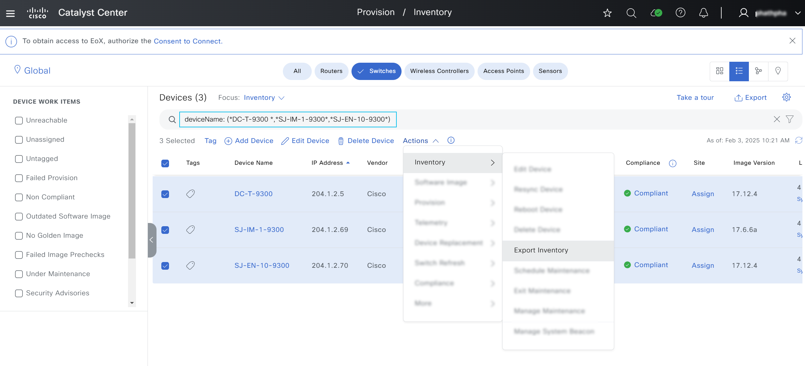
- Enter password and click Export
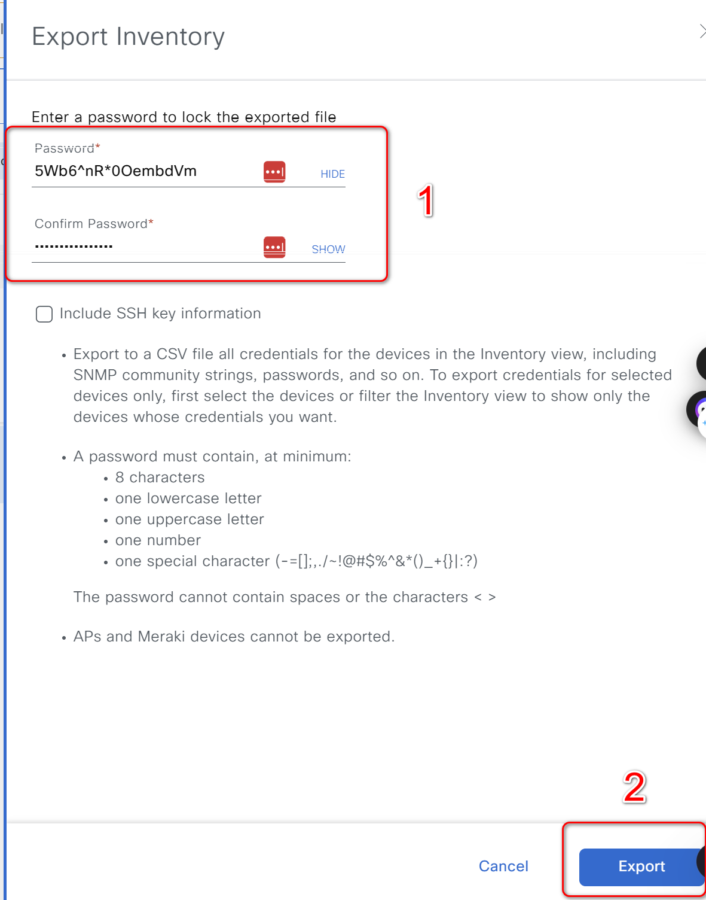

#### **Example Input**

```
hostname:
  - file_password: qsaA12!asdasd
    hostname_list: ['DC-T-9300','SJ-IM-1-9300','SJ-EN-10-9300']
    file_path: "./"
```

- file_password: The password used to encrypt the backup file.
- hostname_list: A list of hostnames for which the device configurations will be backed up.
- file_path: The directory path where the backup files will be stored.


### 2. Take Backup Without Defined Passwords


#### **Example Input **

```
device_configs_backup_details:
  - hostname_list: ['DC-T-9300.cisco.local']
    file_path: "./"
```
- hostname_list: A list of hostnames for which the device configurations will be backed up.
- file_path: The directory path where the backup files will be stored.

### 3. Take Backup with ip_address_list
#### **Mapping config to UI Actions**

- The config parameter within this task corresponds to the Provision > Inventory > Actions > Export Inventory" action in the Cisco Catalyst Center UI.

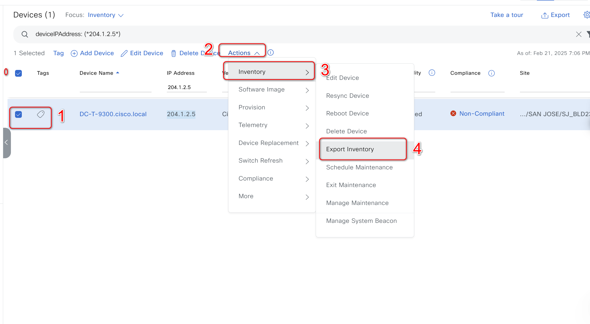

- Enter password and click Export

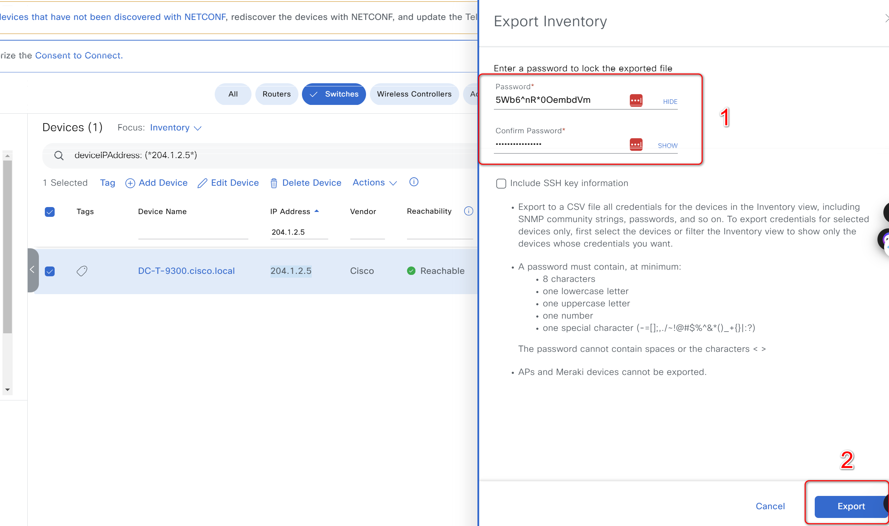
#### **Example Input **

```
device_configs_backup_details:
  - ip_address_list: [204.1.2.5]
    file_path: "./"
    unzip_backup: true
```
- ip_address_list: A list of IP address for which the device configurations will be backed up.
- file_path: The directory path where the backup files will be stored.

### 4. Take Backup with collection_status_list
#### **Mapping config to UI Actions**

- The config parameter within this task corresponds to the Provision > Inventory > Actions > Export Inventory" action in the Cisco Catalyst Center UI.

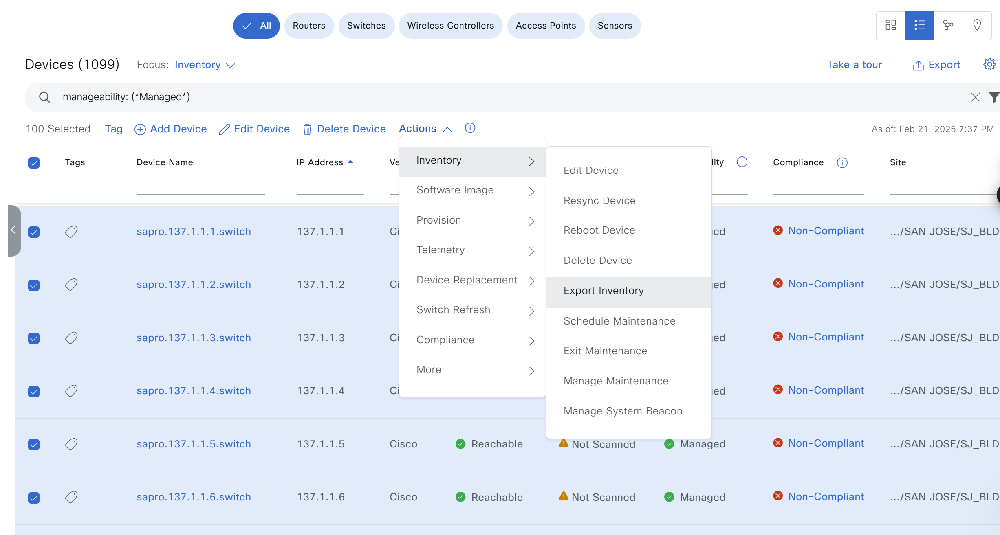

- Enter password and click Export


#### **Example Input **

```
device_configs_backup_details:
  - collection_status_list: [Managed]
    file_path: "./"
```
- collection_status_list: A list of manage status for which the device configurations will be backed up.
- file_path: The directory path where the backup files will be stored.


### 5. Take Backup with family_list
#### **Mapping config to UI Actions**

- The config parameter within this task corresponds to the Provision > Inventory > Actions > Export Inventory" action in the Cisco Catalyst Center UI.

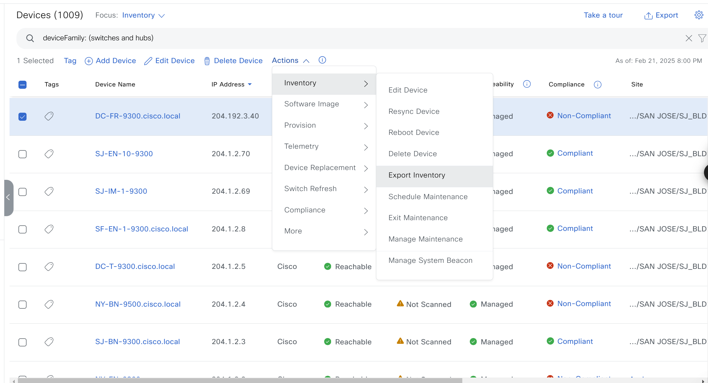

- Enter password and click Export


#### **Example Input **

```
device_configs_backup_details:
  - family_list: [Switches and Hubs]
    file_path: "./"
```
- family_list: A list of family list for which the device configurations will be backed up.
- file_path: The directory path where the backup files will be stored.


### 6. Take Backup with mac_address_list
#### **Mapping config to UI Actions**

- The config parameter within this task corresponds to the Provision > Inventory > Actions > Export Inventory" action in the Cisco Catalyst Center UI.

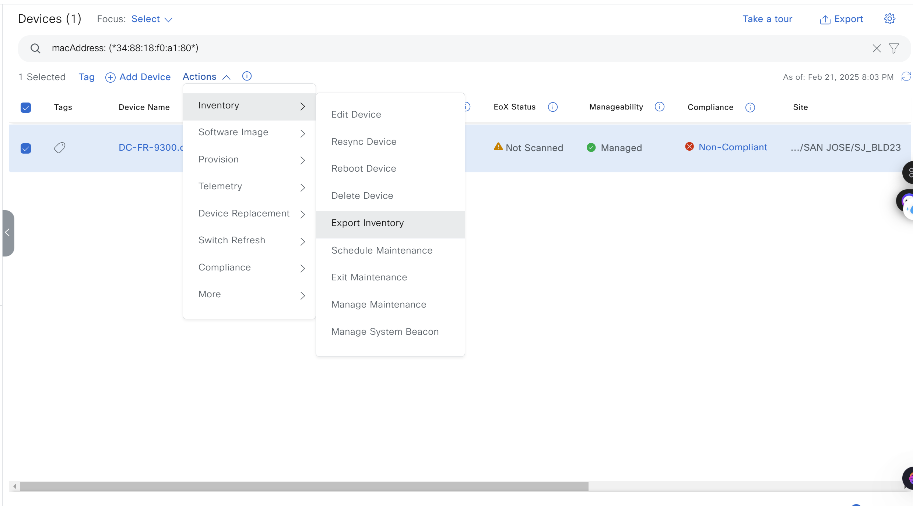

- Enter password and click Export


#### **Example Input **

```
device_configs_backup_details:
  - mac_address_list: ['34:88:18:f0:a1:80']
    file_path: "./"
```
- mac_address_list: A list of MAC Address for which the device configurations will be backed up.
- file_path: The directory path where the backup files will be stored.

### 7. Take Backup with serial_number_list
#### **Mapping config to UI Actions**

- The config parameter within this task corresponds to the Provision > Inventory > Actions > Export Inventory" action in the Cisco Catalyst Center UI.

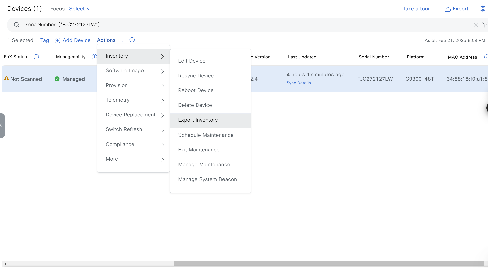

- Enter password and click Export


#### **Example Input **

```
device_configs_backup_details:
  - serial_number_list: ['FJC272127LW]'
    file_path: "./"
```
- serial_number_list: A list of serial number for which the device configurations will be backed up.
- file_path: The directory path where the backup files will be stored.

### 8. Take Backup with series_list
#### **Mapping config to UI Actions**

- The config parameter within this task corresponds to the Provision > Inventory > Actions > Export Inventory" action in the Cisco Catalyst Center UI.

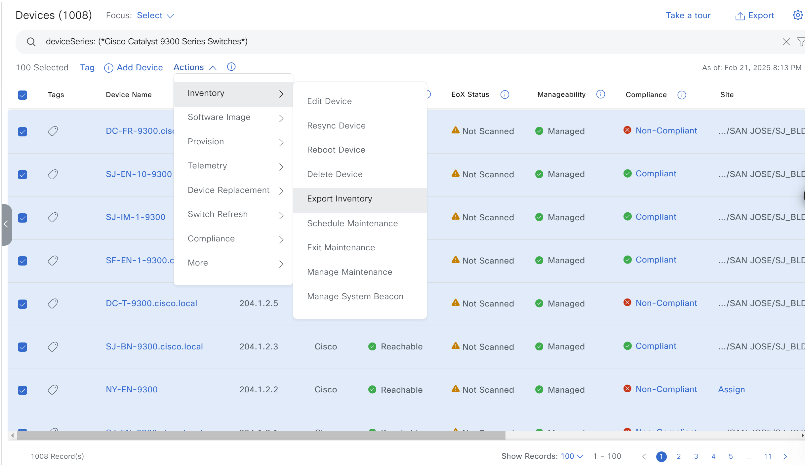

- Enter password and click Export


#### **Example Input **

```
device_configs_backup_details:
  - series_list: ['Cisco Catalyst 9300 Series Switches']
    file_path: "./"
```
- series_list: A list of series list for which the device configurations will be backed up.
- file_path: The directory path where the backup files will be stored.

### 9. Take Backup with site_list
#### **Mapping config to UI Actions**

- The config parameter within this task corresponds to the Provision > Inventory > Actions > Export Inventory" action in the Cisco Catalyst Center UI.

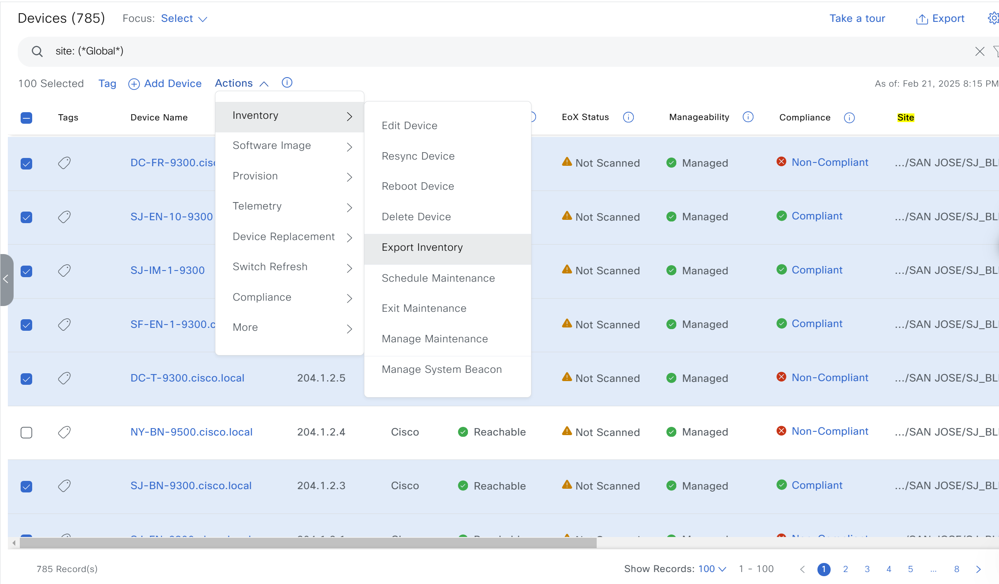

- Enter password and click Export


#### **Example Input **

```
device_configs_backup_details:
  - site_list: ['Global']
    file_path: "./"
```
- site_list: A list of sites for which the device configurations will be backed up.
- file_path: The directory path where the backup files will be stored.


### 4. Take Backup Using collection_status, ip_address_list and hostname_list

#### **Example Input **
- The config parameter within this task corresponds to the Provision > Inventory > Actions > Export Inventory" action in the Cisco Catalyst Center UI.

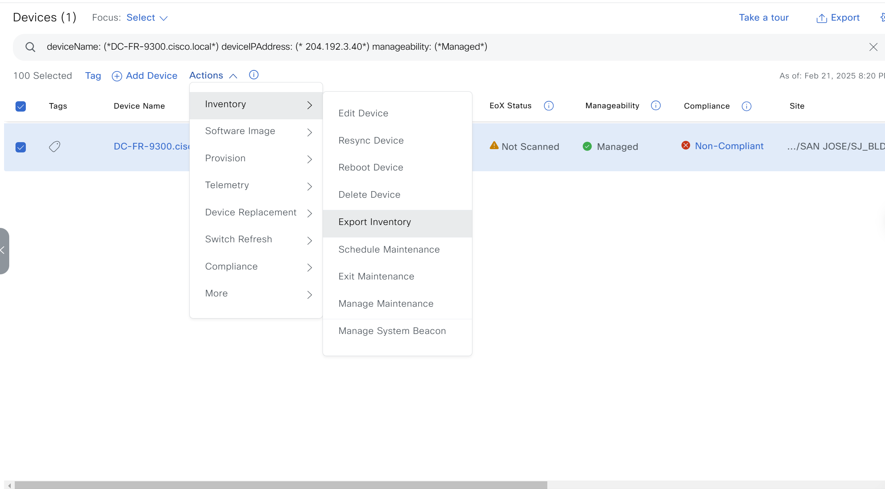

- Enter password and click Export


```
device_configs_backup_details:
  - ip_address_list: [204.1192.3.40]
    hostname_list:["DC-FR-9300.cisco.local"]
    collection_status: Managed
    file_path: "./"
    unzip_backup: false
```


## IV. References

Note: The environment is used for the references in the above instructions.

```
  ansible: 9.9.0
  ansible-core: 2.16.10
  ansible-runner: 2.4.0

  dnacentersdk: 2.8.3
  cisco.dnac: 6.29.0
  ansible.utils: 5.1.2
```
