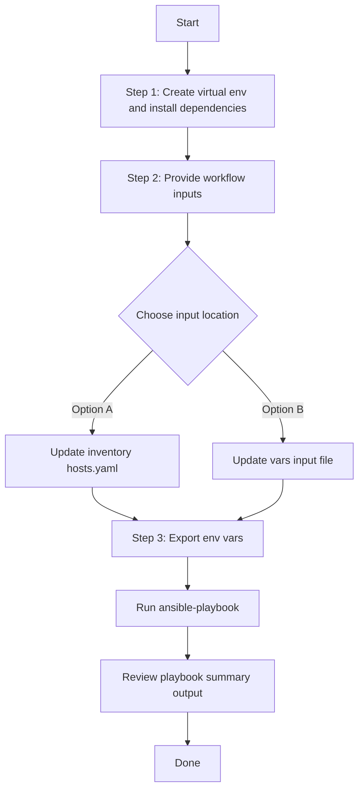

# Device Credential Config Generator

## Table of Contents

- [User Flow (3 Steps)](#user-flow-3-steps)
- [Overview](#overview)
- [Features](#features)
- [Prerequisites](#prerequisites)
- [Workflow Structure](#workflow-structure)
- [Schema Parameters](#schema-parameters)
- [Getting Started](#getting-started)
- [Operations](#operations)
- [Examples](#examples)---

## Overview

The Device Credential config generator automates YAML playbook generation for global credentials and site credential assignments in Cisco Catalyst Center. It generates output compatible with `device_credential_workflow_manager`.

---

## Features

- **Configuration Generation**: Generate YAML configurations compatible with `device_credential_workflow_manager`.
  - Extract global credential types and site assignments.
  - Transform API responses into workflow-manager-ready YAML.
  - Reuse generated files for backup, migration, and credential audits.
- **Component Filtering**: Generate `global_credential_details`, `assign_credentials_to_site`, or both.
- **Credential Filters**: Filter credential types by `description` and site assignment by `site_name`.
- **Flexible Output**: Supports custom `file_path` and `file_mode` (`overwrite` / `append`).
- **Brownfield Discovery**: Omit `config` (or use workflow convenience flag) to generate all credential configurations.

---

## Prerequisites

### Software Requirements

| Component | Version |
|-----------|---------|
| Ansible | 2.13+ |
| cisco.catalystcenter collection | 6.44.0+ |
| Python | 3.9+ |
| Cisco Catalyst Center | 2.3.7.9+ |
| catalystcentersdk | 2.10.10+ |

### Required Collections

```bash
ansible-galaxy collection install cisco.catalystcenter
ansible-galaxy collection install ansible.utils
pip install catalystcentersdk
pip install yamale
```

### Access Requirements

- Catalyst Center credentials with credential and site APIs access
- Network connectivity to Catalyst Center
- Existing credential data (for targeted export use cases)

---

## Workflow Structure

```
device_credential_config_generator/
├── playbook/
│   └── device_credential_config_generator.yml     # Main operations
├── vars/
│   └── device_credential_config_inputs.yml        # Input examples
├── schema/
│   └── device_credential_config_schema.yml        # Input validation
└── README.md
```

---

## Schema Parameters

### Basic Configuration

| Parameter | Type | Required | Default | Description |
|-----------|------|----------|---------|-------------|
| `generate_all_configurations` | boolean | No | false | Workflow convenience flag. When true, playbook omits module `config` |
| `file_path` | string | No | auto-generated | Output file path for generated YAML |
| `file_mode` | string | No | `overwrite` | File write mode: `overwrite` or `append` |
| `component_specific_filters` | dict | No | omitted | Component and filters passed to module `config` |

### Supported Components

- `global_credential_details`
- `assign_credentials_to_site`

### Global Credential Filter Fields

- `cli_credential[]`
- `https_read[]`
- `https_write[]`
- `snmp_v2c_read[]`
- `snmp_v2c_write[]`
- `snmp_v3[]`

Each list item supports:
- `description` (exact, case-sensitive match)

### Site Assignment Filter Fields

- `assign_credentials_to_site.site_name` (list of site hierarchy names)

---

## Getting Started

## Workflow Steps
## User Flow (3 Steps)



### Installation and Run (Aligned)

1. Create and activate a Python virtual environment, then install dependencies.

```bash
python3 -m venv .venv
source .venv/bin/activate
pip install -r requirements.txt
ansible-galaxy collection install cisco.catalystcenter --force
```

2. Provide workflow inputs in either inventory (`inventory/demo_lab/hosts.yaml`) or the workflow `vars/` file.

3. Export Catalyst Center environment variables and run the playbook.

```bash
export HOSTIP=<catalyst-center-ip-or-fqdn>
export CATALYST_CENTER_USERNAME=<username>
export CATALYST_CENTER_PASSWORD='<password>'
ansible-playbook -i ./inventory/demo_lab/hosts.yaml ./workflows/device_credential_config_generator/playbook/device_credential_config_generator.yml -vvvv
```


## Operations

### Generate Operations (state: gathered)

1. **Generate all credentials and assignments**
- Set `generate_all_configurations: true`.

2. **Generate global credentials only**
- Use `components_list: ["global_credential_details"]` and credential description filters.

3. **Generate site assignment details only**
- Use `components_list: ["assign_credentials_to_site"]` with `site_name` values.

4. **Append generated output**
- Set `file_mode: append`.

---

## Examples

### Example 1: Generate all device credential configurations

```yaml
device_credential_config:
  - generate_all_configurations: true
    file_path: "/tmp/device_credential_complete_config.yml"
```

### Example 2: Filter global credential descriptions

```yaml
device_credential_config:
  - file_path: "/tmp/device_credential_global_filters.yml"
    component_specific_filters:
      components_list: ["global_credential_details"]
      global_credential_details:
        cli_credential:
          - description: "WLC_CLI"
```

### Example 3: Filter site assignment by site hierarchy

```yaml
device_credential_config:
  - file_path: "/tmp/device_credential_site_assignments.yml"
    component_specific_filters:
      components_list: ["assign_credentials_to_site"]
      assign_credentials_to_site:
        site_name: ["Global/India/Assam", "Global/India/Haryana"]
```

---

## Notes

- `device_credential_playbook_config_generator` expects `config.component_specific_filters` when filters are used.
- This workflow omits module `config` when `generate_all_configurations: true` is set or when `component_specific_filters` is omitted or empty.
- If component filters are provided without `components_list`, the module auto-populates `components_list` internally.
