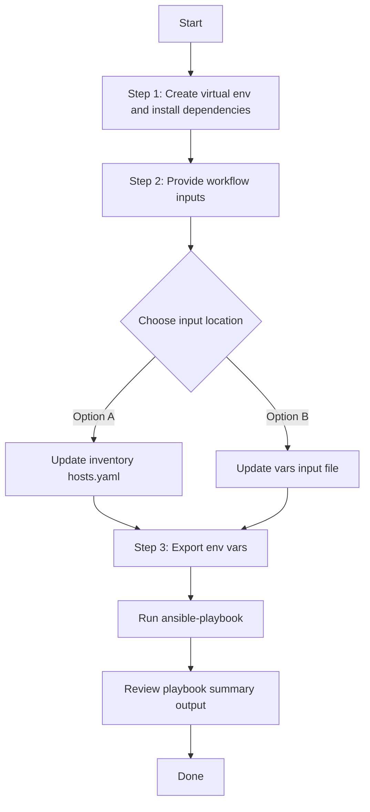

# Device Credential Config Generator

## Table of Contents

- [User Flow (3 Steps)](#user-flow-3-steps)
- [Overview](#overview)
- [Features](#features)
- [Prerequisites](#prerequisites)
- [Workflow Structure](#workflow-structure)
- [Schema Parameters](#schema-parameters)
- [Getting Started](#getting-started)
- [Operations](#operations)
- [Examples](#examples)
- [Generated Output](#generated-output)
- [Notes](#notes)

## Overview

The Device Credential config generator automates YAML playbook generation for global credentials and site credential assignments in Cisco Catalyst Center. It generates output compatible with `device_credential_workflow_manager`.

---

## Features

- **Configuration Generation**: Generate YAML configurations compatible with `device_credential_workflow_manager`.
  - Extract global credential types and site assignments.
  - Transform API responses into workflow-manager-ready YAML.
  - Reuse generated files for backup, migration, and credential audits.
- **Component Filtering**: Generate `global_credential_details`, `assign_credentials_to_site`, or both.
- **Credential Filters**: Filter credential types with `type` plus optional description values, and filter site assignments by a full hierarchical site path list.
- **Flexible Output**: Supports custom `file_path` and `file_mode` (`overwrite` / `append`).
- **Brownfield Discovery**: Omit `config` to generate all credential configurations.

---

## Prerequisites

### Software Requirements

| Component | Version |
|-----------|---------|
| Ansible | 2.13+ |
| cisco.catalystcenter collection | 2.6.0 |
| Python | 3.9+ |
| Cisco Catalyst Center | 2.3.7.9+ |
| catalystcentersdk | 2.10.10+ |

### Required Collections

```bash
ansible-galaxy collection install cisco.catalystcenter
ansible-galaxy collection install ansible.utils
pip install catalystcentersdk
pip install yamale
```

### Access Requirements

- Catalyst Center credentials with credential and site APIs access
- Network connectivity to Catalyst Center
- Existing credential data (for targeted export use cases)

---

## Workflow Structure

```
device_credential_config_generator/
├── playbook/
│   └── device_credential_config_generator.yml     # Main operations
├── vars/
│   └── device_credential_config_inputs.yml        # Input examples
├── schema/
│   └── device_credential_config_schema.yml        # Input validation
└── README.md
```

---

## Schema Parameters

### Basic Configuration

| Parameter | Type | Required | Default | Description |
|-----------|------|----------|---------|-------------|
| `file_path` | string | No | auto-generated | Output file path for generated YAML |
| `file_mode` | string | No | `overwrite` | File write mode: `overwrite` or `append` |
| `component_specific_filters` | dict | No | omitted | Workflow input mapped to module `config.component_specific_filters` |

### Supported Components

- `global_credential_details`
- `assign_credentials_to_site`

### Global Credential Filter Fields

- `global_credential_details[]`

Each list item supports:
- `type` (required; one of `cli_credential`, `https_read`, `https_write`, `snmp_v2c_read`, `snmp_v2c_write`, `snmp_v3`)
- `description` (optional list of exact, case-sensitive credential descriptions)

### Site Assignment Filter Fields

- `assign_credentials_to_site[]` (flat list of exact site hierarchy path strings)

Each item is a direct site path value such as `Global/India/Assam`; there is no nested `site_name` wrapper in the workflow input.

---

## Getting Started

### User Flow (3 Steps)


```mermaid
flowchart TD
  A[Start] --> B[Step 1: Create virtual env and install dependencies]
  B --> C[Step 2: Provide workflow inputs]
  C --> D{Choose input location}
  D -->|Option A| E[Update inventory hosts.yaml]
  D -->|Option B| F[Update vars input file]
  E --> G[Step 3: Export env vars]
  F --> G
  G --> H[Run ansible-playbook]
  H --> I[Review playbook summary output]
  I --> J[Done]
```

### Installation and Run

1. Create and activate a Python virtual environment, then install dependencies.

```bash
python3 -m venv .venv
source .venv/bin/activate
pip install -r requirements.txt
ansible-galaxy collection install cisco.catalystcenter --force
```

2. Provide workflow inputs in either inventory (`inventory/demo_lab/hosts.yaml`) or the workflow `vars/` file.

3. Export Catalyst Center environment variables and run the playbook.

```bash
export HOSTIP=<catalyst-center-ip-or-fqdn>
export CATALYST_CENTER_USERNAME=<username>
export CATALYST_CENTER_PASSWORD='<password>'
ansible-playbook -i ./inventory/demo_lab/hosts.yaml ./workflows/device_credential_config_generator/playbook/device_credential_config_generator.yml --extra-vars "VARS_FILE_PATH=$(pwd)/workflows/device_credential_config_generator/vars/device_credential_config_inputs.yml" -vvvv
```

> **`VARS_FILE_PATH` Path Resolution**
> Ansible resolves `VARS_FILE_PATH` relative to the playbook directory, not the current working directory.
> Use either of these forms:
> - Relative to the playbook: `../vars/device_credential_config_inputs.yml`
> - Fully resolved from the repo root: `${PWD}/workflows/device_credential_config_generator/vars/device_credential_config_inputs.yml`


## Operations

### Generate Operations (state: gathered)

1. **Generate all credentials and site assignments**
- Omit `component_specific_filters` to run full discovery mode.

2. **Generate global credentials only**
- Use `components_list: ["global_credential_details"]` and `global_credential_details` filter entries.

3. **Generate site assignment details only**
- Use `components_list: ["assign_credentials_to_site"]` with exact site path strings in `assign_credentials_to_site`.

4. **Append generated output**
- Set `file_mode: append`.

---

## Examples

### Example 1: Generate all device credential configurations

```yaml
device_credential_config:
  - file_path: "/tmp/device_credential_complete_config.yml"
```

### Example 2: Generate all device credential configurations without specifying file_path

Omitting `file_path` causes the module to auto-generate a timestamped output filename
(`device_credential_playbook_config_<YYYY-MM-DD_HH-MM-SS>.yml`) in the current working
directory. Useful for quick one-off exports where the exact filename does not matter.

```yaml
device_credential_config:
  - file_mode: "overwrite"
```

### Example 3: Filter global credential descriptions

```yaml
device_credential_config:
  - file_path: "/tmp/device_credential_global_filters.yml"
    component_specific_filters:
      components_list: ["global_credential_details"]
      global_credential_details:
        - type: "cli_credential"
          description:
            - "WLC_CLI"
            - "Router_CLI"
        - type: "https_read"
          description:
            - "HTTPS_Read_Admin"
        - type: "https_write"
          description:
            - "HTTPS_Write_Admin"
        - type: "snmp_v2c_read"
          description:
            - "SNMP_RO_Community"
        - type: "snmp_v2c_write"
          description:
            - "SNMP_RW_Community"
        - type: "snmp_v3"
          description:
            - "SNMPv3_Admin"
```

### Example 4: Filter site assignment by site hierarchy

```yaml
device_credential_config:
  - file_path: "/tmp/device_credential_site_assignments.yml"
    component_specific_filters:
      components_list: ["assign_credentials_to_site"]
      assign_credentials_to_site:
        - "Global/India/Assam"
        - "Global/India/Haryana"
```

---

## Generated Output

The generated file uses `config` as the top-level key, with one list entry per component processed. This structure is directly compatible with `device_credential_workflow_manager`.

Sensitive fields (passwords, SNMPv2c read community, SNMPv3 auth password) are **masked with Jinja2 variable placeholders** — raw credential values are never written to the output file. Before running the generated playbook with `device_credential_workflow_manager`, supply the real values via Ansible Vault or `--extra-vars`.

Example structure:

```yaml
config:
  - global_credential_details:
      cli_credential:
        - description: "WLC_CLI"
          username: "admin"
          password: "{{ cli_credential_wlc_cli_password }}"
          enable_password: "{{ cli_credential_wlc_cli_enable_password }}"
          id: "xxxxxxxx-xxxx-xxxx-xxxx-xxxxxxxxxxxx"
        - description: "Router_CLI"
          username: "netadmin"
          password: "{{ cli_credential_router_cli_password }}"
          enable_password: "{{ cli_credential_router_cli_enable_password }}"
          id: "xxxxxxxx-xxxx-xxxx-xxxx-xxxxxxxxxxxx"
      https_read:
        - description: "HTTPS_Read_Admin"
          username: "admin"
          password: "{{ https_read_https_read_admin_password }}"
          port: 443
          id: "xxxxxxxx-xxxx-xxxx-xxxx-xxxxxxxxxxxx"
      https_write:
        - description: "HTTPS_Write_Admin"
          username: "admin"
          password: "{{ https_write_https_write_admin_password }}"
          port: 443
          id: "xxxxxxxx-xxxx-xxxx-xxxx-xxxxxxxxxxxx"
      snmp_v2c_read:
        - id: "xxxxxxxx-xxxx-xxxx-xxxx-xxxxxxxxxxxx"
          description: "SNMP_RO_Community"
          read_community: "{{ snmp_v2c_read_snmp_ro_community_read_community }}"
      snmp_v2c_write:
        - id: "xxxxxxxx-xxxx-xxxx-xxxx-xxxxxxxxxxxx"
          description: "SNMP_RW_Community"
          write_community: "<value-from-catalyst-center>"
      snmp_v3:
        - id: "xxxxxxxx-xxxx-xxxx-xxxx-xxxxxxxxxxxx"
          auth_type: "SHA"
          snmp_mode: "AUTHPRIV"
          privacy_type: "AES128"
          privacy_password: "<value-from-catalyst-center>"
          username: "snmpv3user"
          description: "SNMPv3_Admin"
          auth_password: "{{ snmp_v3_snmpv3_admin_auth_password }}"
  - assign_credentials_to_site:
      cli_credential:
        description: "WLC_CLI"
        username: "admin"
        id: "xxxxxxxx-xxxx-xxxx-xxxx-xxxxxxxxxxxx"
      snmp_v2c_read:
        description: "SNMP_RO_Community"
        id: "xxxxxxxx-xxxx-xxxx-xxxx-xxxxxxxxxxxx"
      snmp_v3:
        description: "SNMPv3_Admin"
        id: "xxxxxxxx-xxxx-xxxx-xxxx-xxxxxxxxxxxx"
      site_name:
        - "Global/India/Assam"
        - "Global/India/Haryana"
```

> **Note:** Jinja2 placeholders (e.g., `{{ cli_credential_wlc_cli_password }}`) are generated from the credential's description field. Define these variables in an Ansible Vault file or pass them as `--extra-vars` before running the generated playbook with `device_credential_workflow_manager`. `snmp_v2c_write.write_community` and `snmp_v3.privacy_password` are written as plaintext values returned by the Catalyst Center API — treat the generated file as a secret and avoid committing it to version control unencrypted.

---

## Notes

- `device_credential_playbook_config_generator` expects `config.component_specific_filters` when filters are used.
- This workflow omits module `config` when `component_specific_filters` is omitted or empty.
- If component filters are provided without `components_list`, the module auto-populates `components_list` internally.
