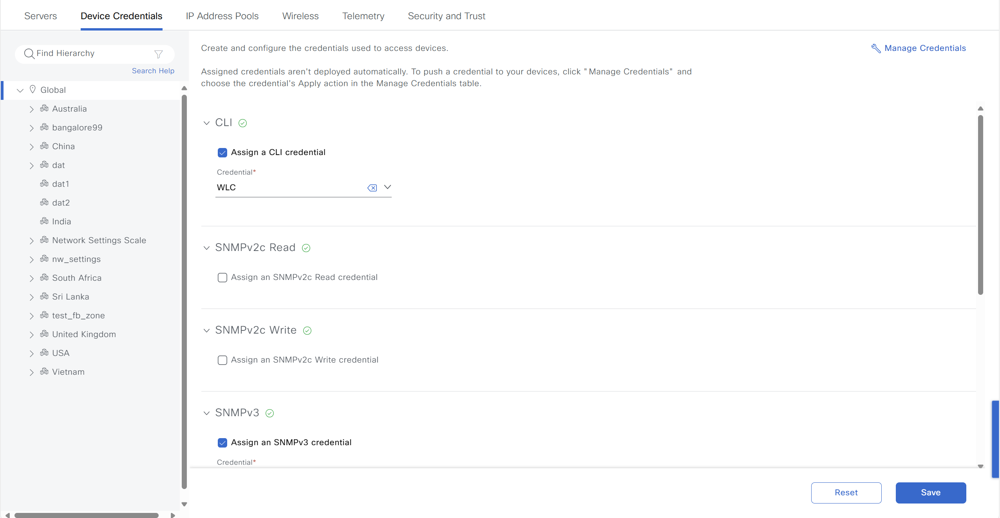
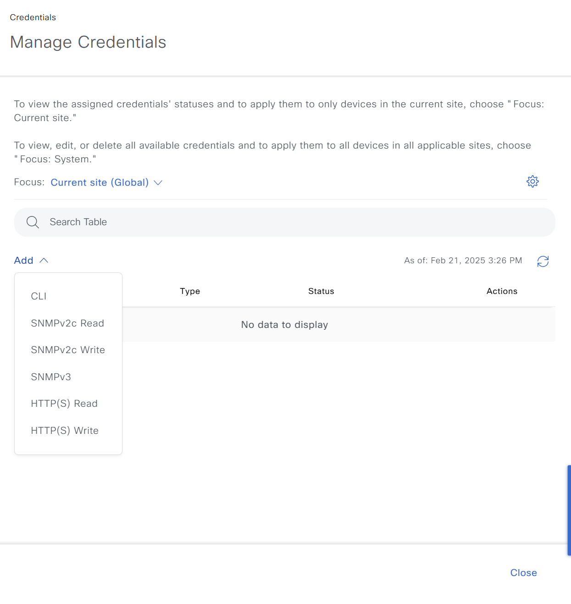
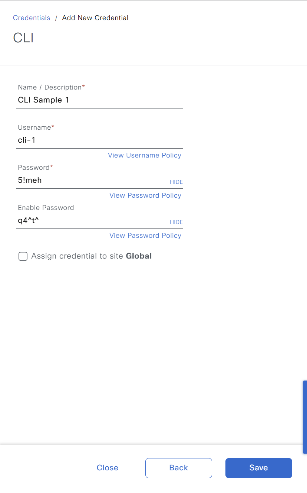
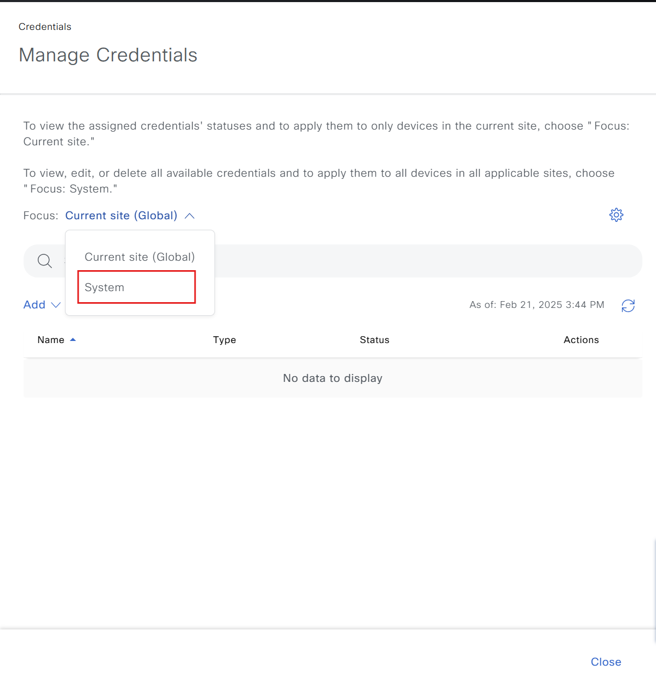
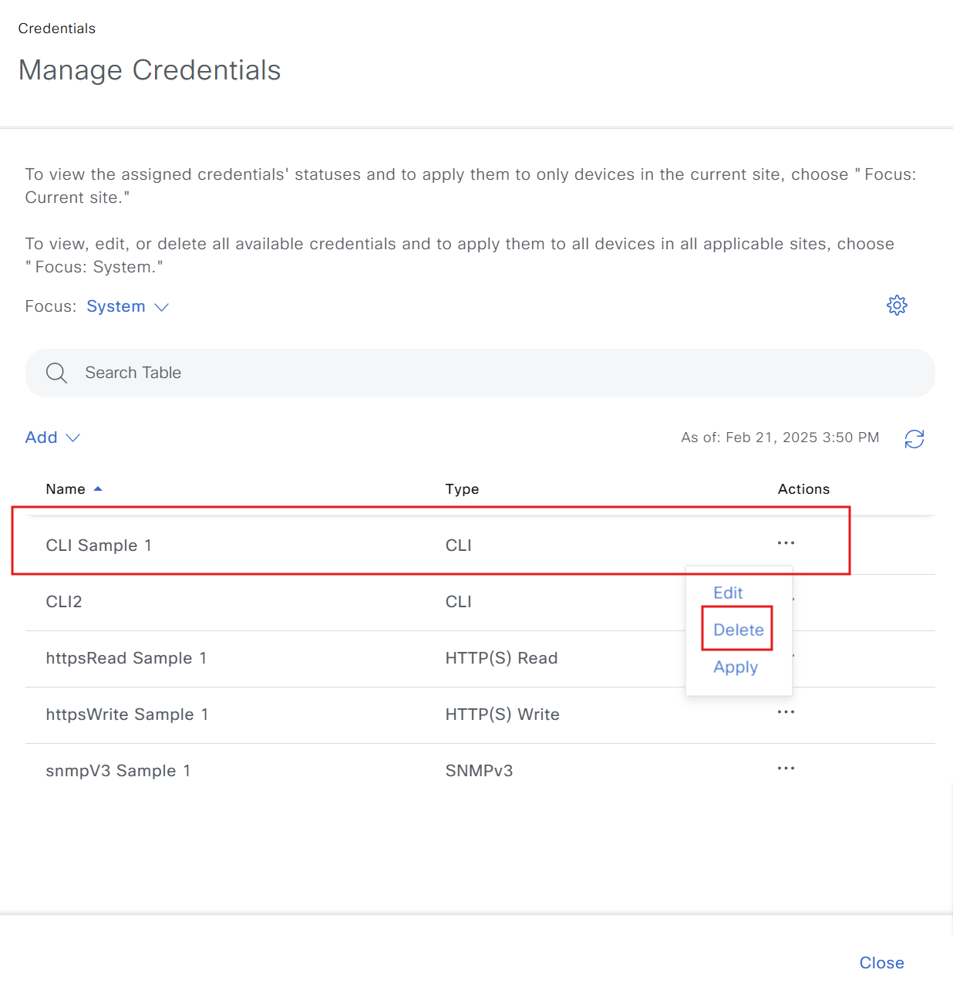
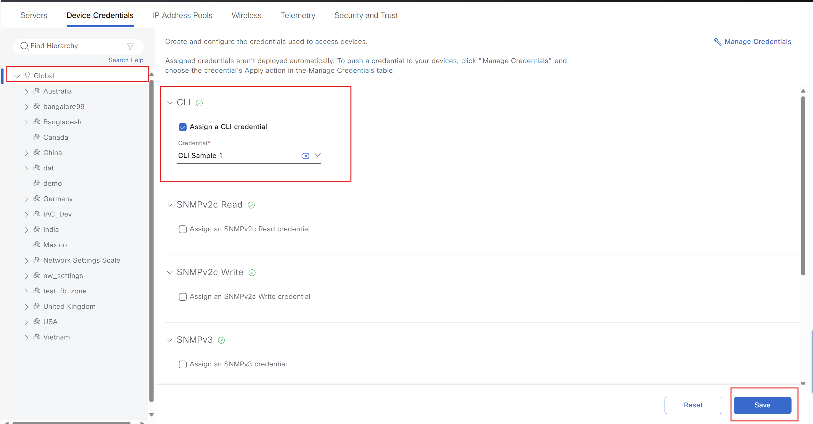
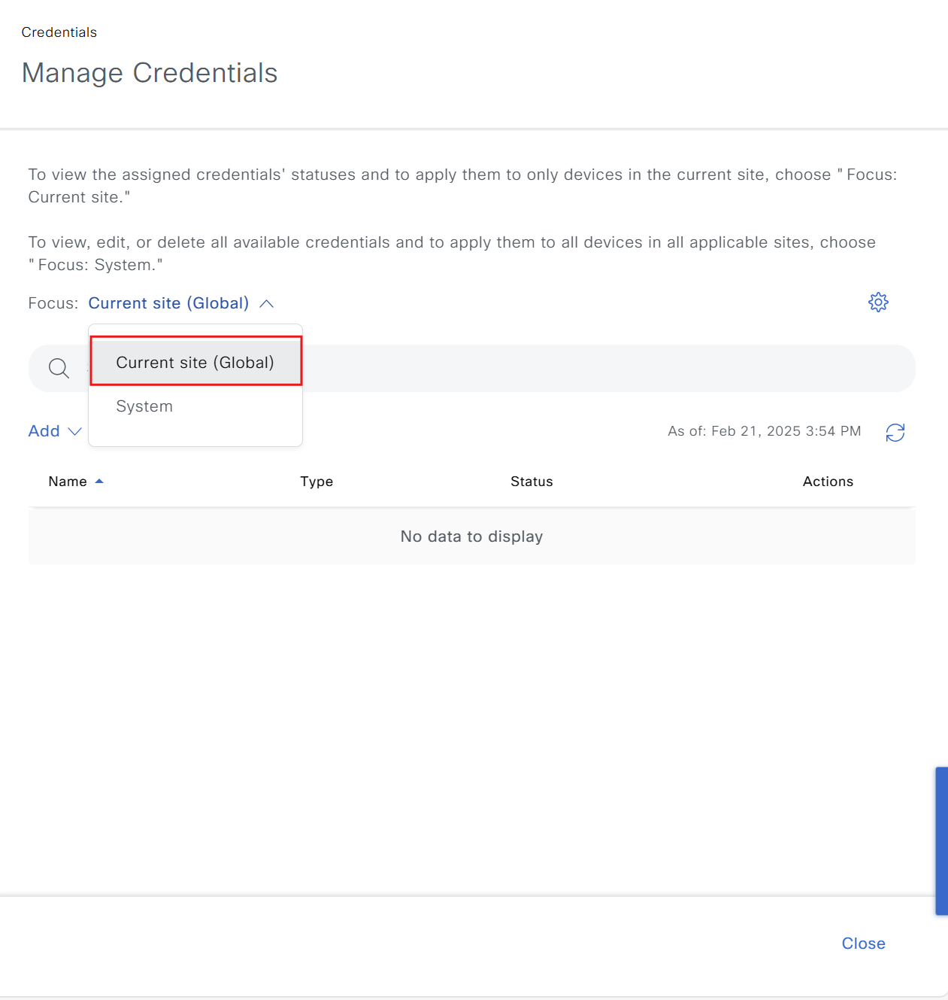
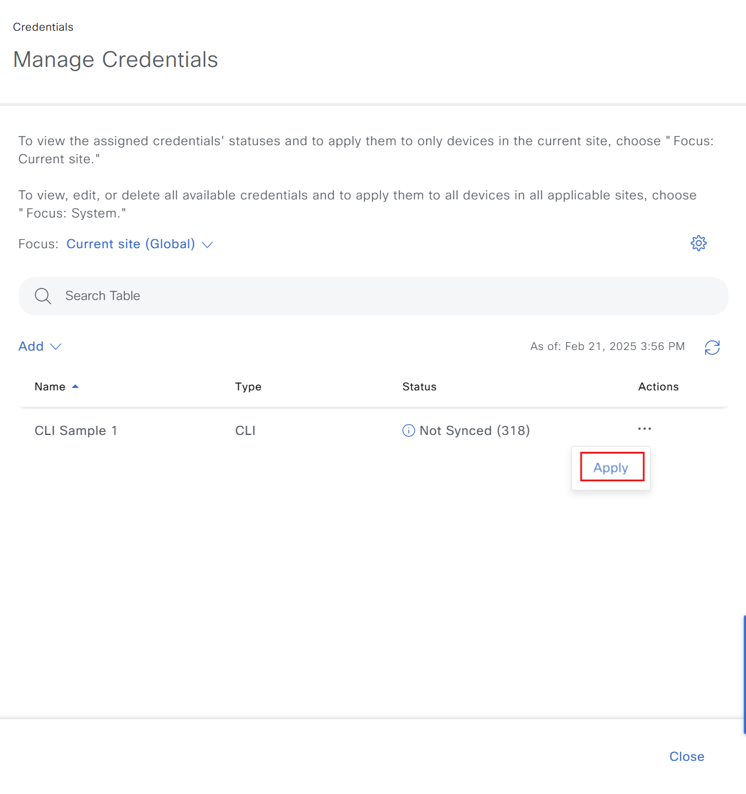

# Device Credential Workflow Manager
The Device Credential Workflow Manager in Cisco Catalyst Center helps organize and manage network device credentials, including creating, applying, and updating them during deployment or maintenance..

You can configure and manage credentials for network devices such as switches, routers, access points, and other devices, ensuring that Cisco Catalyst Center has access and can manage them automatically.

These workflows help you reduce risk and enhance security while managing your network. Below are the key elements and processes in Device Credential Workflow Manager.

Device Credentials Figure: It consists of two parts: Network Hierarchy and Manage Credentials.


Network Hierarchy: Specifies where the credential will be applied.
Manage Credentials:
- CLI: Connect and manage devices via command line (SSH/Telnet).
- SNMPv2c Read: Read device status information via SNMPv2c.
- SNMPv2c Write: Both read and change configuration via SNMPv2c.
- SNMPv3: Secure SNMP version, supporting encryption and authentication.
- HTTP(S) Read: Read device information via HTTP or HTTPS protocol.
- HTTP(S) Write: Change device configuration via HTTP or HTTPS protocol.

## Purpose

### Centralized Credential Management 

- Streamline the process of adding, updating, and deleting device credentials from a single location.

### Improved Security 

- Reduce the risk of unauthorized access by ensuring credentials are securely stored and managed.

### Workflow Automation 

- Simplify credential management tasks with an automated workflow, saving time and minimizing errors.

## Compatibility

### Cisco Catalyst Center 

- 2.3.7.6 and above

### Ansible 

- Latest stable version recommended

## Workflow Details
The workflow leverages the **device_credential_workflow_manager**  module to interact with Catalyst Center's credential management APIs. It supports the following operations:

### Add Device Credential 

- Create new device credentials.

### Update Device Credential 

- Modify existing credentials (e.g., change passwords).

### Delete Device Credential 

- Remove credentials from Catalyst Center.

### Assign or Update Credentials to Sites

- Assign credentials to sites, Update new credentials to sites. 

### Apply Credentials

- Make update to credentials, i.e. reset password etc and Apply to applicable sites and all the devices on that site.
- **Access Rights**: The user account should have sufficient privileges (e.g., `admin` or equivalent) to execute necessary tasks on the devices.

## Procedure

### Prepare your Ansible environment

- Install Ansible if you haven't already
- Ensure you have network connectivity to your Catalyst Center instance.
- Checkout the project and playbooks:
>git@github.com:cisco-en-programmability/catalyst-center-ansible-iac.git

### Configure Host Inventory

- Update hosts.yml (or your preferred inventory file) with the connection details for your Catalyst Center instance.
 - The **host_inventory_dnac1/hosts.yml** file specifies the connection details (IP address, credentials, etc.) for your Catalyst Center instance.

```yaml
---
catalyst_center_hosts:
    hosts:
        catalyst_center220:
            dnac_host: xx.xx.xx.xx.
            dnac_password: XXXXXXXX
            dnac_port: 443
            dnac_timeout: 60
            dnac_username: admin
            dnac_verify: false
            dnac_version: 2.3.7.6
            dnac_debug: true
            dnac_log_level: INFO
            dnac_log: true
```
	
### Generate your Input

- Create a YAML file (e.g., vars.yml) to store the required variables for the workflow.
- Refer to the **device_credential_workflow_manager** module documentation for details on the available variables and their formats.
- Example:
 - The **workflows/device_config_backup/vars/device_config_backup_workflow_input.yml** file should be configured with device details.
 - Refer to the full workflow specification for detailed instructions on the available options and their structure:[full workflow specification](https://galaxy.ansible.com/ui/repo/published/cisco/dnac/content/module/device_configs_backup_workflow_manager)
- Operation: 
- **Add Device Credential:** 

  **Mapping to UI action**:
  - Design -> Network Settings -> Device Credentials -> Manage Credentials

  


  - Enter data to create new credential

  

  **Purpose**:
  - Create new device credentials.
  - Make sure this device credential does not already exist in Catalyst Center.

  **Input example with creating cli credential**:

-  Create CLI credentials

  ```yaml
  ---
  catalyst_center_version: 2.3.7.6
  device_credentials:
    credentials_details: #Create multiple credentials for the same protocol
    - global_credential_details: #Create global credentials for the device list
        cli_credential: #Create CLI credentials list
        - description: CLI Sample 1
          username: cli-1
          password: "5!meh"
          enable_password: "q4^t^"
        - description: CLI2
          username: cli-2
          password: "sbs2@"
          enable_password: "8b!rn"
  ```

-  Create all credentials

```yaml
catalyst_center_version: 2.3.7.6
device_credentials:
  credentials_details: #Create multiple credentials for the same protocol
  - global_credential_details: #Create global credentials for the device list
      cli_credential: #Create CLI credentials list
      - description: CLI Sample 1
        username: cli-1
        password: "5!meh"
        enable_password: "q4^t^"
      - description: CLI2
        username: cli-2
        password: "sbs2@"
        enable_password: "8b!rn"
      snmp_v2c_read:
      - description: snmpRead-1
        read_community: "@123"
      snmp_v2c_write:
      - description: snmpWrite-1
        write_community: "#mea@"
      snmp_v3: #Create SNMPv3 credentials list
      - description: snmpV3 Sample 1 
        auth_password: "hp!x6px&#@2xi5"
        auth_type: SHA
        snmp_mode: AUTHPRIV
        privacy_password: "ai7tpci3j@*j5g"
        privacy_type: AES128
        username: admin
      https_read: #Create HTTPS Read credentials list
      - description: httpsRead Sample 1
        username: admin
        password: "2!x88yvqz*7"
        port: 443
      https_write: #Create HTTPS Write credentials list
      - description: httpsWrite Sample 1
        username: admin
        password: "j@5wgm%s2g%"
        port: 443
  ```

- **Update Device Credential:**

  **Mapping to UI action**:
  - Design -> Network Settings -> Device Credentials -> Manage Credentials

  


  - Enter data to update existing credentials

  

  **Purpose**:
  - Modify existing credentials (e.g., change passwords).
  - This task ensures that if the credential already exists, the details of that credential will be updated without creating a duplicate.

  **Input example with update cli credential**:

  ```yaml
  ---
  catalyst_center_version: 2.3.7.6
  device_credentials:
    credentials_details: 
    - global_credential_details: 
        cli_credential:
        - description: CLI Sample 1
          username: cli-1
          password: "5!meh"
          enable_password: "q4^t^"
        - description: CLI2
          username: cli-2
          password: "sbs2@"
          enable_password: "8b!rn"
  ```

  **Input example with update device credential name/description using old name and description**:

  ```yaml
  ---
  catalyst_center_version: 2.3.7.6
  device_credentials:
    credentials_details:
    - global_credential_details:
        cli_credential:
        - description: CLISample1
          username: cli1
          password: "5!meh"
          enable_password: "q4^t^"
          old_description: CLI Sample 1
          old_username: cli-1
  ```

- **Delete Device Credential:**

  **Mapping to UI action**:
  - Design -> Network Settings -> Device Credentials -> Manage Credentials -> Focus -> System

  


  - Select The Credential To Delete -> Go To The Three Dots -> Select Delete

  

  **Purpose**:
    - Remove credentials from Catalyst Center.
    - Make sure that the device credentials you delete are not assigned to any site.

  **Input example with delete cli credential**:

  - Delete CLI credentials

  ```yaml
  ---
  catalyst_center_version: 2.3.7.6
  device_credentials:
    credentials_details:
    - global_credential_details:
        cli_credential:
        - description: CLI Sample 1
          username: cli-1
  ```

  - Delete all credentials

  ```yaml
  ---
  catalyst_center_version: 2.3.7.6
  device_credentials:
    credentials_details:
    - global_credential_details:
        cli_credential:
        - description: CLI Sample 1
          username: cli-1
        snmp_v2c_read:
        - description: snmpRead-1 # use this for deletion
        snmp_v2c_write:
        - description: snmpWrite-1 # use this for deletion
        snmp_v3:
        - description: snmpV3 Sample 1 
        https_read:
        - description: httpsRead Sample 1
          username: admin
        https_write:
        - description: httpsWrite Sample 1
          username: admin
  ```

- **Assign or Update Credentials to Sites:**

  **Mapping to UI action**:
  - Design -> Network Settings -> Device Credentials -> Select Site -> Select Credential Type -> Save

  

  **Purpose**:
    - Assign credentials to sites.
    - Update new credentials to sites. 

  **Input example for Assign Credentials to sites**:

    ```yaml
    ---
    catalyst_center_version: 2.3.7.6
    device_credentials:
      credentials_site_assignment: #Assign credentials to sites list of all sites mappings
      - assign_credentials_to_site: # Assign device credentials to sites
          cli_credential: #Assign CLI credentials to sites
            description: CLI Sample 1
            username:  cli-1
          snmp_v2c_read:
            description: SNMPv2c Read1
          snmp_v2c_write:
            description: SNMPv2c Write1
          site_name: #Sites  to which the credentials are assigned
          - Global/India #Full Site Hierarchy Path from Global to Site
          - Global/India/Bangalore
    ```

- **Apply Credentials:**

    **Mapping to UI action**:
  - Design -> Network Settings -> Device Credentials -> Manage Credentials -> Focus -> Current site

  


  - Select The Credential To Apply -> Go To The Three Dots -> Select Apply

  

  **Purpose**:
    - Make updates to credentials, i.e., reset passwords, etc., and apply to applicable sites and all the devices on that site.

  **Input example for Apply Credentials to sites**:

    ```yaml
    ---
    catalyst_center_version: 2.3.7.6
    device_credentials:
      credentials_site_apply:
      - apply_credentials_to_site:
          cli_credential:
            description: CLI Sample 1
            username:  cli-1
          site_name:
          - Global #Full Site Hierarchy Path from Global
          - Global/India/Bangalore
    ```

3. ### Validate Input:(recommended)

Validate the input with schema using yamale
- Command to Validate:

```bash
yamale -s workflows/device_credentials/schema/device_credentials_schema.yml workflows/device_credentials/vars/device_credentials_vars.yml
```

- Result:
```bash
Validating /Users/pawansi/dnac_ansible_workflows/workflows/device_credentials/vars/device_credentials_vars.yml...
Validation success! 👍
```

## Example run

1. ### Command to run create device credentials

- Command to run:

```bash
ansible-playbook -i host_inventory_dnac1/hosts.yml workflows/device_credentials/playbook/device_credentials_playbook.yml --e VARS_FILE_PATH=../vars/device_credentials_vars.yml -vvvv
```
- Result:

```bash
TASK [Create or Update existing Credentials with provided details in "../vars/device_credentials_vars.yml"] ***
task path: /auto/dna-sol/ws/thanduong/dnac-auto/dnac_ansible_workflows/workflows/device_credentials/playbook/device_credentials_playbook.yml:53
<catalyst_center220> ESTABLISH LOCAL CONNECTION FOR USER: thanduon
<catalyst_center220> EXEC /bin/sh -c 'echo ~thanduon && sleep 0'
<catalyst_center220> EXEC /bin/sh -c '( umask 77 && mkdir -p "` echo /users/thanduon/.ansible/tmp `"&& mkdir "` echo /users/thanduon/.ansible/tmp/ansible-tmp-1740126079.5517635-1320856-85222477229834 `" && echo ansible-tmp-1740126079.5517635-1320856-85222477229834="` echo /users/thanduon/.ansible/tmp/ansible-tmp-1740126079.5517635-1320856-85222477229834 `" ) && sleep 0'
Using module file /users/thanduon/.ansible/collections/ansible_collections/cisco/dnac/plugins/modules/device_credential_workflow_manager.py
<catalyst_center220> PUT /users/thanduon/.ansible/tmp/ansible-local-1320371l8ksx2_1/tmpf1medyzg TO /users/thanduon/.ansible/tmp/ansible-tmp-1740126079.5517635-1320856-85222477229834/AnsiballZ_device_credential_workflow_manager.py
<catalyst_center220> EXEC /bin/sh -c 'chmod u+x /users/thanduon/.ansible/tmp/ansible-tmp-1740126079.5517635-1320856-85222477229834/ /users/thanduon/.ansible/tmp/ansible-tmp-1740126079.5517635-1320856-85222477229834/AnsiballZ_device_credential_workflow_manager.py && sleep 0'
<catalyst_center220> EXEC /bin/sh -c '/auto/dna-sol/pyats-ws/pyats-thanduong/bin/python /users/thanduon/.ansible/tmp/ansible-tmp-1740126079.5517635-1320856-85222477229834/AnsiballZ_device_credential_workflow_manager.py && sleep 0'
<catalyst_center220> EXEC /bin/sh -c 'rm -f -r /users/thanduon/.ansible/tmp/ansible-tmp-1740126079.5517635-1320856-85222477229834/ > /dev/null 2>&1 && sleep 0'
changed: [catalyst_center220] => {
    "changed": true,
    "diff": [],
    "invocation": {
        "module_args": {
            "config": [
                {
                    "global_credential_details": {
                        "cli_credential": [
                            {
                                "description": "CLI Sample 1",
                                "enable_password": "q4^t^",
                                "password": "5!meh",
                                "username": "cli-1"
                            },
                            {
                                "description": "CLI2",
                                "enable_password": "8b!rn",
                                "password": "sbs2@",
                                "username": "cli-2"
                            }
                        ],
                        "https_read": [
                            {
                                "description": "httpsRead Sample 1",
                                "password": "2!x88yvqz*7",
                                "port": 443,
                                "username": "admin"
                            }
                        ],
                        "https_write": [
                            {
                                "description": "httpsWrite Sample 1",
                                "password": "j@5wgm%s2g%",
                                "port": 443,
                                "username": "admin"
                            }
                        ],
                        "snmp_v3": [
                            {
                                "auth_password": "hp!x6px&#@2xi5",
                                "auth_type": "SHA",
                                "description": "snmpV3 Sample 1",
                                "privacy_password": "ai7tpci3j@*j5g",
                                "privacy_type": "AES128",
                                "snmp_mode": "AUTHPRIV",
                                "username": "admin"
                            }
                        ]
                    }
                }
            ],
            "config_verify": false,
            "dnac_api_task_timeout": 1200,
            "dnac_debug": true,
            "dnac_host": "10.22.40.214",
            "dnac_log": true,
            "dnac_log_append": true,
            "dnac_log_file_path": "dnac.log",
            "dnac_log_level": "debug",
            "dnac_password": "VALUE_SPECIFIED_IN_NO_LOG_PARAMETER",
            "dnac_port": "443",
            "dnac_task_poll_interval": 2,
            "dnac_username": "thanduon",
            "dnac_verify": false,
            "dnac_version": "2.3.7.6",
            "state": "merged",
            "validate_response_schema": true
        }
    },
    "response": [
        {
            "apply_credential": {},
            "assign_credential": {},
            "global_credential": {
                "Creation": {
                    "msg": "Global Credential Created Successfully",
                    "response": {
                        "active_validation": false,
                        "cliCredential": [
                            {
                                "description": "CLI Sample 1",
                                "enablePassword": "q4^t^",
                                "password": "5!meh",
                                "username": "cli-1"
                            },
                            {
                                "description": "CLI2",
                                "enablePassword": "8b!rn",
                                "password": "sbs2@",
                                "username": "cli-2"
                            }
                        ],
                        "httpsRead": [
                            {
                                "description": "httpsRead Sample 1",
                                "password": "2!x88yvqz*7",
                                "port": 443,
                                "username": "admin"
                            }
                        ],
                        "httpsWrite": [
                            {
                                "description": "httpsWrite Sample 1",
                                "password": "j@5wgm%s2g%",
                                "port": 443,
                                "username": "admin"
                            }
                        ],
                        "snmpV3": [
                            {
                                "authPassword": "hp!x6px&#@2xi5",
                                "authType": "SHA",
                                "description": "snmpV3 Sample 1",
                                "privacyPassword": "ai7tpci3j@*j5g",
                                "privacyType": "AES128",
                                "snmpMode": "AUTHPRIV",
                                "username": "admin"
                            }
                        ]
                    }
                },
                "No Updation": {
                    "msg": "No Updation is available",
                    "response": "No Response"
                }
            }
        }
    ]
}
Read vars_file '{{ VARS_FILE_PATH }}'

TASK [Assign Credentials to sites for credentials and sites maps in variables file "../vars/device_credentials_vars.yml"] ***
task path: /auto/dna-sol/ws/thanduong/dnac-auto/dnac_ansible_workflows/workflows/device_credentials/playbook/device_credentials_playbook.yml:61
<catalyst_center220> ESTABLISH LOCAL CONNECTION FOR USER: thanduon
<catalyst_center220> EXEC /bin/sh -c 'echo ~thanduon && sleep 0'
<catalyst_center220> EXEC /bin/sh -c '( umask 77 && mkdir -p "` echo /users/thanduon/.ansible/tmp `"&& mkdir "` echo /users/thanduon/.ansible/tmp/ansible-tmp-1740126102.9772413-1322165-162826310557816 `" && echo ansible-tmp-1740126102.9772413-1322165-162826310557816="` echo /users/thanduon/.ansible/tmp/ansible-tmp-1740126102.9772413-1322165-162826310557816 `" ) && sleep 0'
Using module file /users/thanduon/.ansible/collections/ansible_collections/cisco/dnac/plugins/modules/device_credential_workflow_manager.py
<catalyst_center220> PUT /users/thanduon/.ansible/tmp/ansible-local-1320371l8ksx2_1/tmpog0uoozu TO /users/thanduon/.ansible/tmp/ansible-tmp-1740126102.9772413-1322165-162826310557816/AnsiballZ_device_credential_workflow_manager.py
<catalyst_center220> EXEC /bin/sh -c 'chmod u+x /users/thanduon/.ansible/tmp/ansible-tmp-1740126102.9772413-1322165-162826310557816/ /users/thanduon/.ansible/tmp/ansible-tmp-1740126102.9772413-1322165-162826310557816/AnsiballZ_device_credential_workflow_manager.py && sleep 0'
<catalyst_center220> EXEC /bin/sh -c '/auto/dna-sol/pyats-ws/pyats-thanduong/bin/python /users/thanduon/.ansible/tmp/ansible-tmp-1740126102.9772413-1322165-162826310557816/AnsiballZ_device_credential_workflow_manager.py && sleep 0'
<catalyst_center220> EXEC /bin/sh -c 'rm -f -r /users/thanduon/.ansible/tmp/ansible-tmp-1740126102.9772413-1322165-162826310557816/ > /dev/null 2>&1 && sleep 0'
changed: [catalyst_center220] => {
    "changed": true,
    "diff": [],
    "invocation": {
        "module_args": {
            "config": [
                {
                    "assign_credentials_to_site": {
                        "cli_credential": {
                            "description": "CLI Sample 1",
                            "username": "cli-1"
                        },
                        "https_read": {
                            "description": "httpsRead Sample 1",
                            "username": "admin"
                        },
                        "https_write": {
                            "description": "httpsWrite Sample 1",
                            "username": "admin"
                        },
                        "site_name": [
                            "Global/India",
                            "Global/India/Bangalore"
                        ],
                        "snmp_v3": {
                            "description": "snmpV3 Sample 1",
                            "username": "admin"
                        }
                    }
                }
            ],
            "config_verify": false,
            "dnac_api_task_timeout": 1200,
            "dnac_debug": true,
            "dnac_host": "10.22.40.214",
            "dnac_log": true,
            "dnac_log_append": true,
            "dnac_log_file_path": "dnac.log",
            "dnac_log_level": "debug",
            "dnac_password": "VALUE_SPECIFIED_IN_NO_LOG_PARAMETER",
            "dnac_port": "443",
            "dnac_task_poll_interval": 2,
            "dnac_username": "thanduon",
            "dnac_verify": false,
            "dnac_version": "2.3.7.6",
            "state": "merged",
            "validate_response_schema": true
        }
    },
    "response": [
        {
            "apply_credential": {},
            "assign_credential": {
                "Assign Credentials": {
                    "msg": "Device Credential Assigned to a site is Successfully",
                    "response": [
                        {
                            "cliCredentialsId": {
                                "credentialsId": "86090cd5-94b1-41c9-9c4e-a9d89cb304cd"
                            },
                            "httpReadCredentialsId": {
                                "credentialsId": "15039f68-7f4a-4b86-90a9-9c3d49947c6a"
                            },
                            "httpWriteCredentialsId": {
                                "credentialsId": "74ceca6c-0317-49eb-95dc-f8decea49581"
                            },
                            "id": "876b792c-bdac-478e-a8e7-8bbc2c53bf5b",
                            "snmpv3CredentialsId": {
                                "credentialsId": "d053df1e-b937-43e4-8a30-a0de54885449"
                            }
                        },
                        {
                            "active_validation": false,
                            "cliCredentialsId": {
                                "credentialsId": "86090cd5-94b1-41c9-9c4e-a9d89cb304cd"
                            },
                            "httpReadCredentialsId": {
                                "credentialsId": "15039f68-7f4a-4b86-90a9-9c3d49947c6a"
                            },
                            "httpWriteCredentialsId": {
                                "credentialsId": "74ceca6c-0317-49eb-95dc-f8decea49581"
                            },
                            "id": "e8d333ad-d853-4f6e-a1cd-1d45434e4eef",
                            "snmpv3CredentialsId": {
                                "credentialsId": "d053df1e-b937-43e4-8a30-a0de54885449"
                            }
                        }
                    ]
                }
            },
            "global_credential": {}
        }
    ]
}

```

2. ### Command to run delete devicecredentails:

- Command to run:

```bash
ansible-playbook -i host_inventory_dnac1/hosts.yml workflows/device_credentials/playbook/delete_device_credentials_playbook.yml --e VARS_FILE_PATH=../vars/device_credentials_vars.yml -vvvv
```
- Reult:

```bash
TASK [Create or Update existing Credentials with provided details in "../vars/device_credentials_vars.yml"] ***
task path: /auto/dna-sol/ws/thanduong/dnac-auto/dnac_ansible_workflows/workflows/device_credentials/playbook/delete_device_credentials_playbook.yml:36
<catalyst_center220> ESTABLISH LOCAL CONNECTION FOR USER: thanduon
<catalyst_center220> EXEC /bin/sh -c 'echo ~thanduon && sleep 0'
<catalyst_center220> EXEC /bin/sh -c '( umask 77 && mkdir -p "` echo /users/thanduon/.ansible/tmp `"&& mkdir "` echo /users/thanduon/.ansible/tmp/ansible-tmp-1740129405.6199465-1431951-27769327087581 `" && echo ansible-tmp-1740129405.6199465-1431951-27769327087581="` echo /users/thanduon/.ansible/tmp/ansible-tmp-1740129405.6199465-1431951-27769327087581 `" ) && sleep 0'
Using module file /users/thanduon/.ansible/collections/ansible_collections/cisco/dnac/plugins/modules/device_credential_workflow_manager.py
<catalyst_center220> PUT /users/thanduon/.ansible/tmp/ansible-local-1430199wc5qelwj/tmptr7r6kkp TO /users/thanduon/.ansible/tmp/ansible-tmp-1740129405.6199465-1431951-27769327087581/AnsiballZ_device_credential_workflow_manager.py
<catalyst_center220> EXEC /bin/sh -c 'chmod u+x /users/thanduon/.ansible/tmp/ansible-tmp-1740129405.6199465-1431951-27769327087581/ /users/thanduon/.ansible/tmp/ansible-tmp-1740129405.6199465-1431951-27769327087581/AnsiballZ_device_credential_workflow_manager.py && sleep 0'
<catalyst_center220> EXEC /bin/sh -c '/auto/dna-sol/pyats-ws/pyats-thanduong/bin/python /users/thanduon/.ansible/tmp/ansible-tmp-1740129405.6199465-1431951-27769327087581/AnsiballZ_device_credential_workflow_manager.py && sleep 0'
<catalyst_center220> EXEC /bin/sh -c 'rm -f -r /users/thanduon/.ansible/tmp/ansible-tmp-1740129405.6199465-1431951-27769327087581/ > /dev/null 2>&1 && sleep 0'
changed: [catalyst_center220] => (item={'global_credential_details': {'cli_credential': [{'description': 'CLI Sample 1', 'username': 'cli-1', 'password': '5!meh', 'enable_password': 'q4^t^'}, {'description': 'CLI2', 'username': 'cli-2', 'password': 'sbs2@', 'enable_password': '8b!rn'}], 'snmp_v3': [{'description': 'snmpV3 Sample 1', 'auth_password': 'hp!x6px&#@2xi5', 'auth_type': 'SHA', 'snmp_mode': 'AUTHPRIV', 'privacy_password': 'ai7tpci3j@*j5g', 'privacy_type': 'AES128', 'username': 'admin'}], 'https_read': [{'description': 'httpsRead Sample 1', 'username': 'admin', 'password': '2!x88yvqz*7', 'port': 443}], 'https_write': [{'description': 'httpsWrite Sample 1', 'username': 'admin', 'password': 'j@5wgm%s2g%', 'port': 443}]}}) => {
    "ansible_loop_var": "item",
    "changed": true,
    "diff": [],
    "invocation": {
        "module_args": {
            "config": [
                {
                    "global_credential_details": {
                        "cli_credential": [
                            {
                                "description": "CLI Sample 1",
                                "enable_password": "q4^t^",
                                "password": "5!meh",
                                "username": "cli-1"
                            },
                            {
                                "description": "CLI2",
                                "enable_password": "8b!rn",
                                "password": "sbs2@",
                                "username": "cli-2"
                            }
                        ],
                        "https_read": [
                            {
                                "description": "httpsRead Sample 1",
                                "password": "2!x88yvqz*7",
                                "port": 443,
                                "username": "admin"
                            }
                        ],
                        "https_write": [
                            {
                                "description": "httpsWrite Sample 1",
                                "password": "j@5wgm%s2g%",
                                "port": 443,
                                "username": "admin"
                            }
                        ],
                        "snmp_v3": [
                            {
                                "auth_password": "hp!x6px&#@2xi5",
                                "auth_type": "SHA",
                                "description": "snmpV3 Sample 1",
                                "privacy_password": "ai7tpci3j@*j5g",
                                "privacy_type": "AES128",
                                "snmp_mode": "AUTHPRIV",
                                "username": "admin"
                            }
                        ]
                    }
                }
            ],
            "config_verify": false,
            "dnac_api_task_timeout": 1200,
            "dnac_debug": true,
            "dnac_host": "10.22.40.214",
            "dnac_log": true,
            "dnac_log_append": true,
            "dnac_log_file_path": "dnac.log",
            "dnac_log_level": "debug",
            "dnac_password": "VALUE_SPECIFIED_IN_NO_LOG_PARAMETER",
            "dnac_port": "443",
            "dnac_task_poll_interval": 2,
            "dnac_username": "thanduon",
            "dnac_verify": false,
            "dnac_version": "2.3.7.6",
            "state": "deleted",
            "validate_response_schema": true
        }
    },
    "item": {
        "global_credential_details": {
            "cli_credential": [
                {
                    "description": "CLI Sample 1",
                    "enable_password": "q4^t^",
                    "password": "5!meh",
                    "username": "cli-1"
                },
                {
                    "description": "CLI2",
                    "enable_password": "8b!rn",
                    "password": "sbs2@",
                    "username": "cli-2"
                }
            ],
            "https_read": [
                {
                    "description": "httpsRead Sample 1",
                    "password": "2!x88yvqz*7",
                    "port": 443,
                    "username": "admin"
                }
            ],
            "https_write": [
                {
                    "description": "httpsWrite Sample 1",
                    "password": "j@5wgm%s2g%",
                    "port": 443,
                    "username": "admin"
                }
            ],
            "snmp_v3": [
                {
                    "auth_password": "hp!x6px&#@2xi5",
                    "auth_type": "SHA",
                    "description": "snmpV3 Sample 1",
                    "privacy_password": "ai7tpci3j@*j5g",
                    "privacy_type": "AES128",
                    "snmp_mode": "AUTHPRIV",
                    "username": "admin"
                }
            ]
        }
    },
    "response": [
        {
            "apply_credential": {},
            "assign_credential": {},
            "global_credential": {
                "Deletion": {
                    "msg": "Global Device Credentials Deleted Successfully",
                    "response": {
                        "cliCredential": [
                            {
                                "description": "CLI Sample 1",
                                "response": "Global credential deleted successfully"
                            },
                            {
                                "description": "CLI2",
                                "response": "Global credential deleted successfully"
                            }
                        ],
                        "httpsRead": [
                            {
                                "description": "httpsRead Sample 1",
                                "response": "Global credential deleted successfully"
                            }
                        ],
                        "httpsWrite": [
                            {
                                "description": "httpsWrite Sample 1",
                                "response": "Global credential deleted successfully"
                            }
                        ],
                        "snmpV3": [
                            {
                                "description": "snmpV3 Sample 1",
                                "response": "Global credential deleted successfully"
                            }
                        ]
                    }
                }
            }
        }
    ]
}

```

## running through Jinja template with credentials picked up from ansible Vault
You can define your input as  jinja template where you can use the variables from ansible vault and run using the same playbooks

Defining the jinja template example: workflows/device_credentials/jinja_template/device_credentials_template.j2

while defining the template maintain the structure and the variable name: device_credentials: which is a dictionary having two keys: credentials_details and credentials_site_assignment and follow the workflow spec for the rest as below example.

```yaml
---
#Select Catalyst Center version, this one overwrite the default version from host file
device_credentials:
  credentials_details: #Create multiple credentials for the same protocol
  - global_credential_details: #Create global credentials for the device list
      cli_credential: #Create CLI credentials list
      - description: switchandwlc credentials
        username: wlcaccess
        password: {{ wlcaccess_password }}
        enable_password: {{ wlcaccess_enable_password }}
      snmp_v3: #Create SNMPv3 credentials list
      - description: snmpV3 Sample 1 
        auth_password: {{ snmpV3_Sample_1_auth_password }}
        auth_type: SHA
        snmp_mode: AUTHPRIV
        privacy_password: {{ snmpV3_Sample_1_privacy_password }}
        privacy_type: AES128
        username: admin
      https_read: #Create HTTPS Read credentials list
      - description: httpsRead Sample 1
        username: admin
        password: {{ httpsRead_Sample_1_password }}
        port: 443
      https_write: #Create HTTPS Write credentials list
      - description: httpsWrite Sample 1
        username: admin
        password: {{ httpsWrite_Sample_1_password }}
        port: 443
  credentials_site_assignment: #Assign credentials to sites list of all sites mappings
  - assign_credentials_to_site: # Assign device credentials to sites
      cli_credential: #Assign CLI credentials to sites
        description: switchandwlc credentials
        username:  wlcaccess
      snmp_v3: #Assign SNMPv3 credentials to sites
        description: snmpV3 Sample 1 
        username: admin
      https_read: #Assign HTTPS Read credentials to sites
        username: admin
        description: httpsRead Sample 1
      https_write: #Assign HTTPS Write credentials to sites
        username: admin
        description: httpsWrite Sample 1
      site_name: #Sites  to which the credentials are assigned
        - Global/USA
```
### Create playbook input file which contains path to jinja template
Create file jinja_template_device_credentials_input.yml (example name)
```yaml
---
#Select Catalyst Center version, this one overwrite the default version from host file
catalyst_center_version: 2.3.7.6
catalyst_center_verify: false
jinjatemplate: true
#Provide the path to the jinja template file
jinjatemplate_file: ../jinja_template/device_credentials_template.j2
# device_credentials could be empty or have a list of device credentials, if jinjatemplate  is true device_credentials value is taken from jinja template
device_credentials: []
```

The variables used in the template should be already added to ansible vault. 
Refer to the Ansible Vault Update workflow to add variables to your Ansible Vault.

## How to run with jinja template:
```bash
ansible-playbook -i host_inventory_dnac1/hosts.yml workflows/device_credentials/playbook/device_credentials_playbook.yml --e VARS_FILE_PATH=../vars/jinja_template_device_credentials_input.yml -vvvv
```


## Important Notes:
- Ensure the Catalyst Center version is compatible.
- Carefully configure inventory and input variables.
- Validate input using yamale to prevent errors.
- Review execution logs for troubleshooting.

* Note: The environment is used for the references in the above instructions.
```
  ansible: 9.9.0
  dnacentersdk: 2.8.3
  cisco.dnac: 6.30.0
```