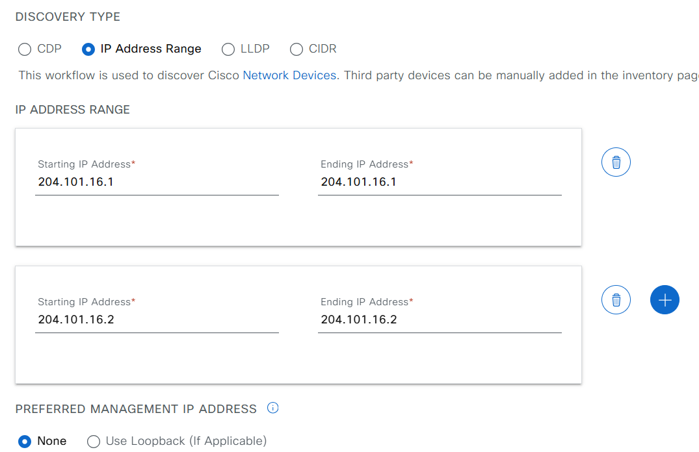
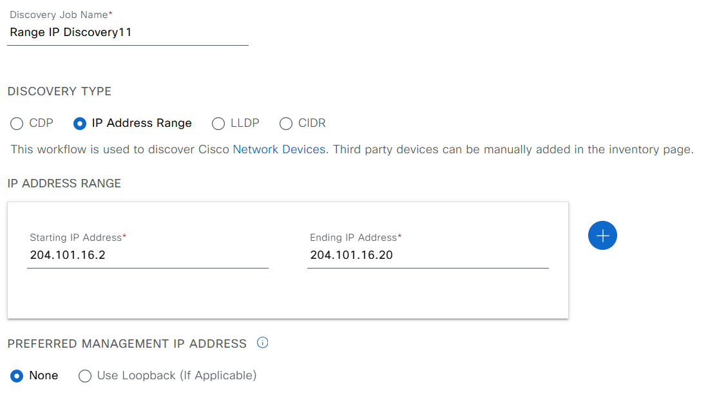
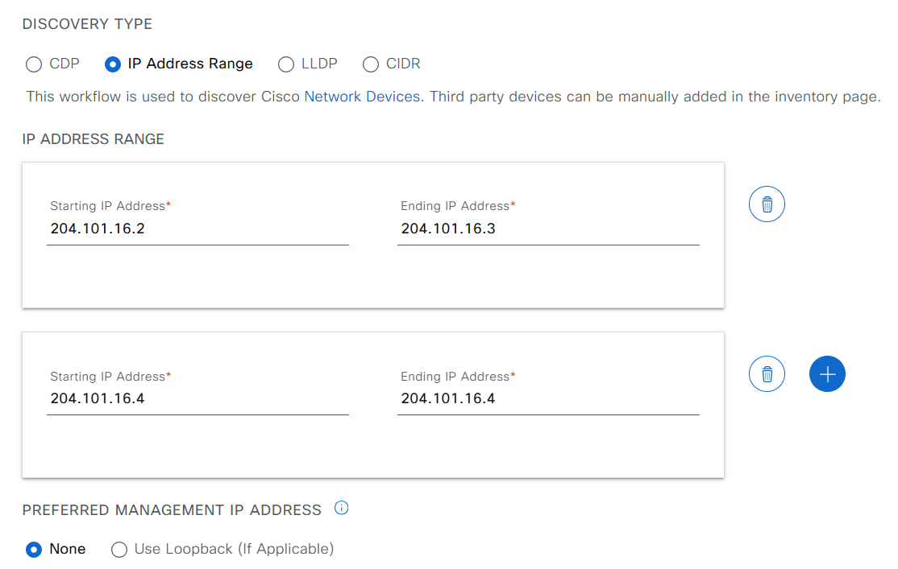
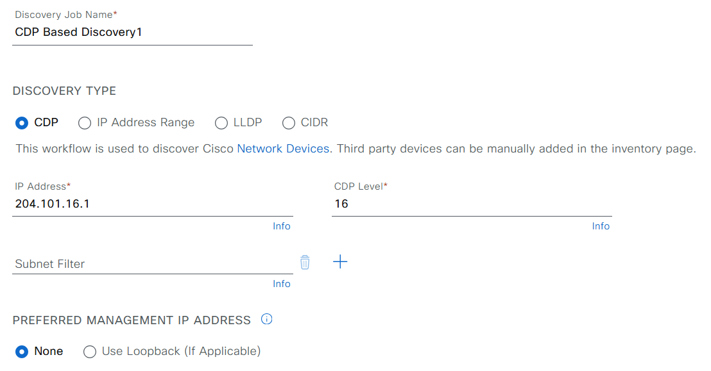
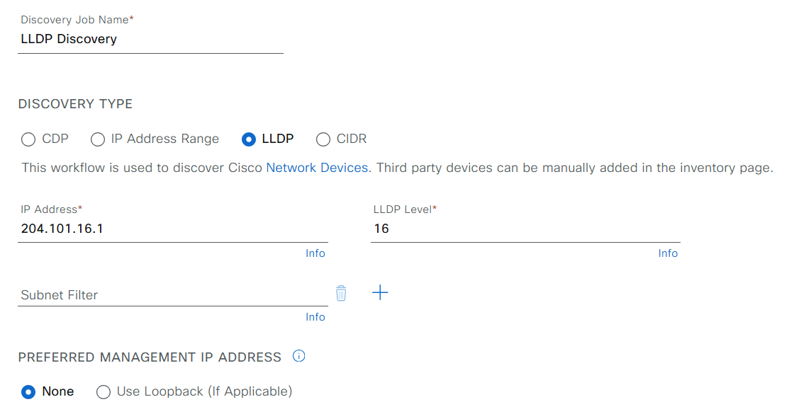
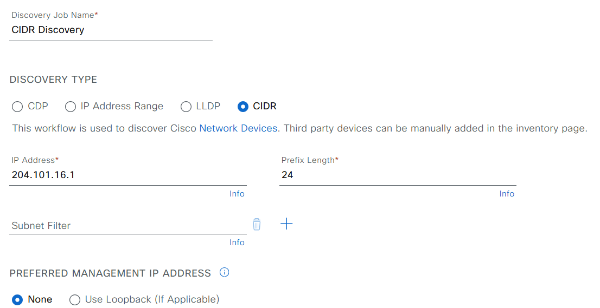

# Catalyst Center Device Discovery Playbook

## Discovery Playbook Overview

The Discovery feature in Catalyst Center scans your network to identify devices and add them to the inventory. It can also work with the Device Controllability feature to configure necessary network settings on discovered devices.

## Discovery Methods
You have four options for discovering devices:
* **Cisco Discovery Protocol (CDP):** Provide a seed IP address and Catalyst Center will use CDP to discover neighboring devices.
* **IP Address Range:** Specify a range of IP addresses to scan. (Maximum range: 4096 devices)
* **Link Layer Discovery Protocol (LLDP):** Similar to CDP, provide a seed IP address for LLDP-based discovery.
* **Classless Inter-Domain Routing (CIDR):** Provide a seed IP address and a CIDR notation to define the network range to scan.

## How to Use the Discovery Feature

### Prerequisites for Discovery

Before running the Discovery feature, ensure you have:
* Configured at least one **SNMP credential** on your devices.
* Set up **SSH credentials** to allow Catalyst Center to manage devices.
* **Network Access:** Ensure Catalyst Center has appropriate network access to reach the devices you want to discover.
* **Device Support:** Verify that your devices support the chosen discovery protocol (CDP or LLDP).
* **Credentials:** If Device Controllability is enabled, ensure Catalyst Center has the correct credentials to access and configure discovered devices.
* **Catalyst Center Configuration:**
    * Regardless of the method used, you must be able to reach the device from Catalyst Center.
    * Configure specific credentials and protocols in Catalyst Center user device_credentials workflow.

### Configure Environment

```bash
catalyst_center_hosts:
    hosts:
        catalyst_center220:
            dnac_host: xx.xx.xx.xx.
            dnac_password: XXXXXXXX
            dnac_port: 443
            dnac_timeout: 60
            dnac_username: admin
            dnac_verify: false
            dnac_version: 2.3.7.6
            dnac_debug: true
            dnac_log_level: INFO
            dnac_log: true
```

### Full Workflow Specification: 
Refer to the official documentation for detailed information on defining workflows: https://galaxy.ansible.com/ui/repo/published/cisco/dnac/content/module/discovery_workflow_manager

### Setting Up Discovery Credentials

You will need to configure various types of credentials based on the devices you want to discover:

- **Network Devices**: Use CLI and SNMP credentials.
- **Compute Devices**: Use CLI, SNMP, and HTTP(S) credentials.

You can save commonly used credentials in Catalyst Center for easier access across multiple discovery jobs.

### Performing the Discovery

- When you perform the discovery, ensure:
  - Only ping-reachable devices are included in the list for IP address range discovery.
  - Devices that respond to CDP, CIDR, and LLDP protocols will be included even if they are ping-unreachable.
  - Your SNMP read-only community string is correctly configured, as it is necessary for discovery.

### Tips for Successful Discovery

- Use the device's loopback IP address for management if reachable.
- If you only want to discover new devices, select the option to discover new devices only to avoid updating existing device information.

## Discovery single device



#### Example input config:

```yaml
discovery_details:
  single:
    - ip_address_list:
      - 204.101.16.1
      devices_list: []
      discovery_type: SINGLE
      protocol_order: ssh
      discovery_name: Single IP Discovery11
    - ip_address_list:
      - 204.101.16.2
      devices_list: []
      discovery_type: SINGLE
      protocol_order: ssh
      discovery_name: Single IP Discovery11
```

## Discovery IP Address Range



#### Example input config:

```yaml
discovery_details:
  range:
    - ip_address_list:
      - 204.101.16.2-204.101.16.20
      discovery_type: RANGE
      protocol_order: ssh
      discovery_name: Range IP Discovery11
```

## Discovery Multiple IP Address Ranges



#### Example input config:

```yaml
discovery_details:
  multi_range:
    - ip_address_list:
      - 204.101.16.2-204.101.16.3
      - 204.101.16.4-204.101.16.4
      discovery_type: MULTI RANGE
      protocol_order: ssh
      discovery_name: Multi Range Discovery 11
```

## Discovery Devices from a CDP Seed


#### Example input config:

```yaml
discovery_details:
    - ip_address_list:
      - 204.101.16.1
      devices_list: []
      discovery_type: CDP
      protocol_order: ssh
      discovery_name: CDP Based Discovery1
      discovery_specific_credentials:
        net_conf_port: "830"
      retry: 2
```

## Discovery Devices from LLDP

#### Example input config:

```yaml
discovery_details:
    - ip_address_list:
      - 204.101.16.1
      discovery_type: LLDP
      protocol_order: ssh
      discovery_name: LLDP Discovery
      discovery_specific_credentials:
        net_conf_port: "830"
      retry: 2
```

## Discovery Devices from CIDR 

#### Example input config:

```yaml
discovery_details:
    - ip_address_list:
      - 204.101.16.1/24
      discovery_type: CIDR
      protocol_order: ssh
      discovery_name: CIDR Discovery
      discovery_specific_credentials:
        net_conf_port: "830"
      retry: 2
```

## Running the Playbook

1. **Validate Your Input:**

```bash
   yamale -s workflows/device_discovery/schema/device_discovery_schema.yml workflows/device_discovery/vars/device_discovery_vars.yml
```
2. **Execute the Playbook**

###  To initiate device discovery:
```bash
    ansible-playbook -i host_inventory_dnac1/hosts.yml workflows/device_discovery/playbook/device_discovery_playbook.yml --e VARS_FILE_PATH=../vars/device_discovery_vars.yml
```
###  To delete existing discoveries:
```bash
ansible-playbook -i host_inventory_dnac1/hosts.yml workflows/device_discovery/playbook/delete_device_discovery.yml --e VARS_FILE_PATH=../vars/device_discovery_vars.yml
```

## Referances

```yaml
  ansible: 9.9.0
  ansible-core: 2.16.10
  ansible-runner: 2.4.0

  dnacentersdk: 2.8.3
  cisco.dnac: 6.29.0
  ansible.utils: 5.1.2
```

## Important Notes
### Refer to the Catalyst Center documentation for detailed instructions on configuring discovery parameters and using the Ansible playbooks.
### Consider backing up your configuration before running the playbooks, especially the delete playbook.
### If you encounter any issues, review the Ansible playbook output for error messages and consult the Catalyst Center documentation or support resources.

