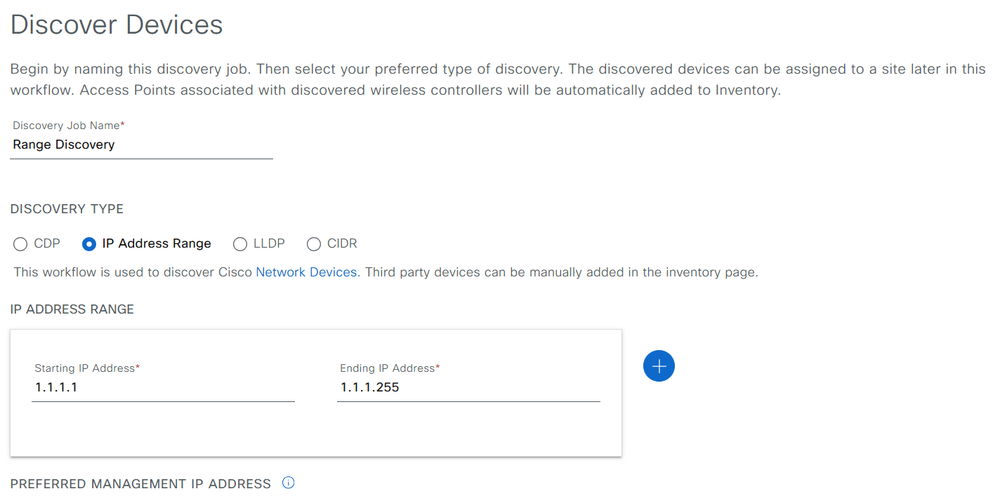
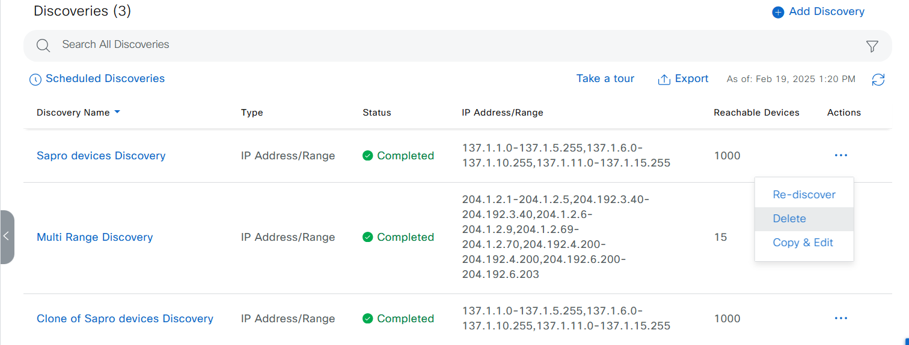

# Catalyst Center Device Discovery Playbook

## Overview

The Discovery feature is designed to help you identify and manage devices within your network. By scanning your network, it creates an inventory of all discovered devices, making it easier to monitor and configure them. This feature also works alongside the Device Controllability feature to apply necessary network settings to devices that may not have them.

## Purpose of the Discovery Feature

The Discovery feature serves several important purposes:

- **Device Inventory**: Automatically compiles a list of devices in your network for easier management.
- **Network Configuration**: Helps configure required settings on devices, ensuring they are properly set up for operation.
- **Network Efficiency**: By understanding your network's layout, you can optimize performance and troubleshoot issues more effectively.

## Why You Need the Discovery Feature

- **Visibility**: Gain insight into all devices connected to your network, which is crucial for effective network management.
- **Efficiency**: Streamline the process of device discovery, reducing the time and effort required to manage network configurations.
- **Automation**: Automatically apply configuration settings to new devices, minimizing manual intervention.

## How to Use the Discovery Feature

### Prerequisites for Discovery

Before running the Discovery feature, ensure you have:

- Familiarized yourself with the devices in your network through the **Cisco Catalyst Center Compatibility Matrix**.
- Confirmed that the network latency between Catalyst Center and devices is optimal (100 ms round-trip time is preferred).
- Configured at least one **SNMP credential** on your devices.
- Set up **SSH credentials** to allow Catalyst Center to manage devices.

* **Network Access:** Ensure Catalyst Center has appropriate network access to reach the devices you want to discover.
* **Device Support:** Verify that your devices support the chosen discovery protocol (CDP or LLDP).
* **Credentials:** If Device Controllability is enabled, ensure Catalyst Center has the correct credentials to access and configure discovered devices.. please refer to Credential module
* **Catalyst Center Configuration:**
    * Regardless of the method used, you must be able to reach the device from Catalyst Center.
    * Configure specific credentials and protocols in Catalyst Center user device_credentials workflow.

### Configure Environment

```bash
catalyst_center_hosts:
    hosts:
        catalyst_center220:
            dnac_host: xx.xx.xx.xx.
            dnac_password: XXXXXXXX
            dnac_port: 443
            dnac_timeout: 60
            dnac_username: admin
            dnac_verify: false
            dnac_version: 2.3.7.6
            dnac_debug: true
            dnac_log_level: INFO
            dnac_log: true
```

### Setting Up Discovery Credentials

You will need to configure various types of credentials based on the devices you want to discover:

- **Network Devices**: Use CLI and SNMP credentials.
- **Compute Devices**: Use CLI, SNMP, and HTTP(S) credentials.

You can save commonly used credentials in Catalyst Center for easier access across multiple discovery jobs.

### Performing the Discovery

- When you perform the discovery, ensure:
  - Only ping-reachable devices are included in the list for IP address range discovery.
  - Devices that respond to CDP, CIDR, and LLDP protocols will be included even if they are ping-unreachable.
  - Your SNMP read-only community string is correctly configured, as it is necessary for discovery.

### Tips for Successful Discovery

- Use the device's loopback IP address for management if reachable.
- If you only want to discover new devices, select the option to discover new devices only to avoid updating existing device information.

## Undestanding Discover task

### Task: Discovery Multiple IP Address Ranges

This task initiates the discovery of multiple devices across various IP address ranges using the `cisco.dnac.discovery_workflow_manager` Ansible module. It allows you to specify multiple IP address ranges and a Netconf port for device discovery.

#### Mapping Config to UI Actions

The `config` parameter within this task corresponds to the **Tools > Discovery > Discovery Type: IP Address Range** action in the Cisco Catalyst Center UI, specifically focusing on the **Multi Range** discovery type.


#### YAML Structure and Parameter Explanation

```yaml
    - name: Discover
      cisco.dnac.discovery_workflow_manager:
        <<: *dnac_login
        state: "{{ state }}"
        config:
              - ip_address_list:
                - 204.1.2.1-204.1.2.5
                - 204.192.3.40
              discovery_specific_credentials:
                net_conf_port: 830
              discovery_type: MULTI RANGE
              protocol_order: ssh
              discovery_name: Multi Range Discovery
      loop: "{{ device_discovery }}"
      when: device_discovery is defined

```
#### Key Points

- This task enables the discovery of devices across multiple IP address ranges, providing flexibility in network discovery scenarios.
- The `discovery_specific_credentials` section allows customization of credentials for this specific discovery task, enhancing security and control.
- The `net_conf_port` parameter is crucial when dealing with devices like IOS XE-based wireless controllers that require Netconf for discovery and configuration.
- Remember that the maximum number of IP address ranges allowed in the `ip_address_list` is 8.

### Task: Discovery Devices from a CDP Seed

This task leverages the Cisco Discovery Protocol (CDP) to discover neighboring devices connected to a specified seed device. It utilizes the `cisco.dnac.discovery_workflow_manager` Ansible module to automate this process within Cisco Catalyst Center.

#### Mapping Config to UI Actions

The `config` parameter within this task corresponds to the **Tools > Discovery > Discovery Type: CDP** action in the Cisco Catalyst Center UI.

#### YAML Structure and Parameter Explanation

```yaml

    - name: Discover
      cisco.dnac.discovery_workflow_manager:
        <<: *dnac_login
        state: "{{ state }}"
        config:
          - ip_address_list:
              - 204.1.2.3
            discovery_type: CDP
            cdp_level: 1
            protocol_order: ssh
            discovery_name: CDP Discovery with filters
            ip_filter_list:
              - 10.0.0.0/8
              - 172.16.0.0/12
            global_credentials:
              cli_credentials_list:
                - username: cisco
                  description: cli
              snmp_v3_credential_list:
                - username: cisco
                  description: SNMPv3-credentials
              net_conf_port_list:
                - net_conf_port: 830
                  description: Netconf
      loop: "{{ device_discovery }}"
      when: device_discovery is defined

```

#### Key Points

- This task automates the discovery of neighboring devices connected to a seed device using CDP.
- The `cdp_level` parameter controls the depth of the discovery, limiting it to direct neighbors in this example.
- The `ip_filter_list` allows you to refine the discovery results by including only devices within specific IP ranges.
- The `global_credentials` section enables the use of pre-configured credentials, simplifying credential management.

### Task: Discovery Using Preferred Management IP(s)

This task performs a discovery of multiple IP addresses or ranges while specifying a preferred management IP selection method. It utilizes the `cisco.dnac.discovery_workflow_manager` Ansible module and allows you to prioritize the use of loopback interfaces as management IPs for discovered devices.

#### Mapping Config to UI Actions

The `config` parameter within this task corresponds to the **Tools > Discovery > Discovery Type: IP Address Range** with the additional configuration of the preferred management IP method.

#### YAML Structure and Parameter Explanation

```yaml
    - name: Discover
      cisco.dnac.discovery_workflow_manager:
        <<: *dnac_login
        state: "{{ state }}"
        config:
          - ip_address_list:
              - 204.192.3.40
              - 10.22.40.244
            preferred_mgmt_ip_method: UseLoopBack
            discovery_type: MULTI RANGE
            protocol_order: ssh
            discovery_name: Discovery using preferred management ip(s)
      loop: "{{ device_discovery }}"
      when: device_discovery is defined


```
#### Key Points

- This task automates the discovery of devices across multiple IP addresses or ranges, providing flexibility in network discovery scenarios.
- The `preferred_mgmt_ip_method` parameter allows you to prioritize the use of loopback interfaces as management IPs, which can be beneficial for network management and stability.
- The `discovery_type: MULTI RANGE` setting enables the discovery of devices across multiple IP addresses or ranges within a single task.
- Remember that you can leverage other `preferred_mgmt_ip_method` options (refer to the Ansible documentation) based on your network requirements.

### Task: Discovery Using Job Specific Credentials

This task automates the discovery of devices using specific credentials tailored to the discovery job, overriding any global credentials that might be configured. It utilizes the `cisco.dnac.discovery_workflow_manager` Ansible module and allows you to define CLI credentials for this particular discovery task.

#### Mapping Config to UI Actions

The `config` parameter within this task corresponds to the **Tools > Discovery > Discovery Type: IP Address Range** with the addition of job-specific credentials.

#### YAML Structure and Parameter Explanation

```yaml
    - name: Discover
      cisco.dnac.discovery_workflow_manager:
        <<: *dnac_login
        state: "{{ state }}"
        config:
          - ip_address_list:
              - 204.192.3.40
              - 10.22.40.244
            discovery_type: MULTI RANGE
            protocol_order: ssh
            discovery_specific_credentials:
              cli_credentials_list:
                - username: cisco
                  password: Cisco123
                  enable_password: Cisco123
      loop: "{{ device_discovery }}"
      when: device_discovery is defined

```
#### Key Points

- This task provides the flexibility to use different credentials for specific discovery jobs, enhancing security and control in diverse network environments.
- The `discovery_specific_credentials` parameter overrides any global credentials that might be configured, ensuring that the correct credentials are used for this particular discovery.
- The provided example focuses on CLI credentials, but you can also specify other types of credentials (SNMP, Netconf, etc.) within the `discovery_specific_credentials` section if required for your discovery process.

### Task: Delete Discovery by Name

This task facilitates the removal of a specific discovery task from Cisco Catalyst Center based on its name. It utilizes the `cisco.dnac.discovery_workflow_manager` Ansible module with the state parameter set to 'deleted'.

#### Mapping to UI Action

The action performed by this task corresponds to selecting a specific discovery task in the Cisco Catalyst Center UI under **"Discovery"** and then choosing the **"Delete"** option.



#### YAML Structure and Parameter Explanation

```yaml
    - name: Discover
      cisco.dnac.discovery_workflow_manager:
        <<: *dnac_login
        state: "{{ state }}"
        config:
          - discovery_name: "Multi Range Discovery" 
      loop: "{{ device_discovery }}"
      when: device_discovery is defined

      
```
### Task: Delete All Discovery

This task enables the removal of all existing discovery tasks within Cisco Catalyst Center. It leverages the `cisco.dnac.discovery_workflow_manager` Ansible module, setting the state to 'deleted' and utilizing the `delete_all` parameter.

#### Mapping to UI Action

While there's no direct equivalent in the UI to delete all discoveries at once, this task essentially automates the process of selecting each discovery task individually and deleting them.

#### YAML Structure and Parameter Explanation

```yaml
    - name: Discover
      cisco.dnac.discovery_workflow_manager:
        <<: *dnac_login
        state: "{{ state }}"
        config:
          - delete_all: True
      loop: "{{ device_discovery }}"
      when: device_discovery is defined
      
```

## Running the Playbook

1. **Validate Your Input:**

```bash
   yamale -s workflows/device_discovery/schema/device_discovery_schema.yml workflows/device_discovery/vars/device_discovery_vars.yml
```
2. **Execute the Playbook**

###  To initiate device discovery:
```bash
    ansible-playbook -i host_inventory_dnac1/hosts.yml workflows/device_discovery/playbook/device_discovery_playbook.yml --e VARS_FILE_PATH=../vars/device_discovery_vars.yml
```
###  To delete existing discoveries:
```bash
ansible-playbook -i host_inventory_dnac1/hosts.yml workflows/device_discovery/playbook/delete_device_discovery.yml --e VARS_FILE_PATH=../vars/device_discovery_vars.yml
```

## Referances

```yaml
  ansible: 9.9.0
  ansible-core: 2.16.10
  ansible-runner: 2.4.0

  dnacentersdk: 2.8.3
  cisco.dnac: 6.29.0
  ansible.utils: 5.1.2
```

## Important Notes
### Refer to the Catalyst Center documentation for detailed instructions on configuring discovery parameters and using the Ansible playbooks.
### Consider backing up your configuration before running the playbooks, especially the delete playbook.
### If you encounter any issues, review the Ansible playbook output for error messages and consult the Catalyst Center documentation or support resources.

