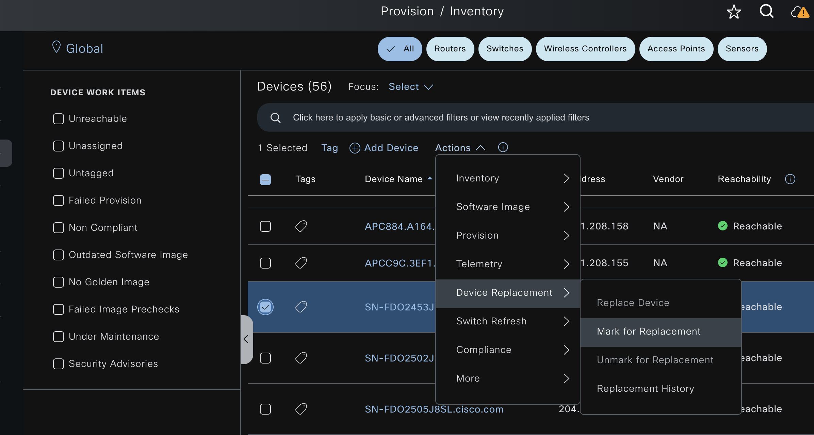
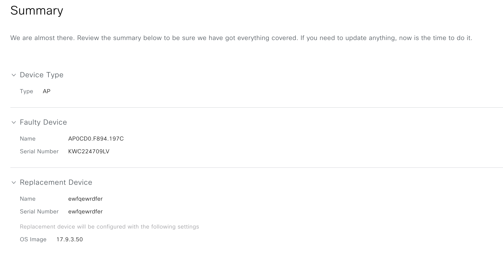
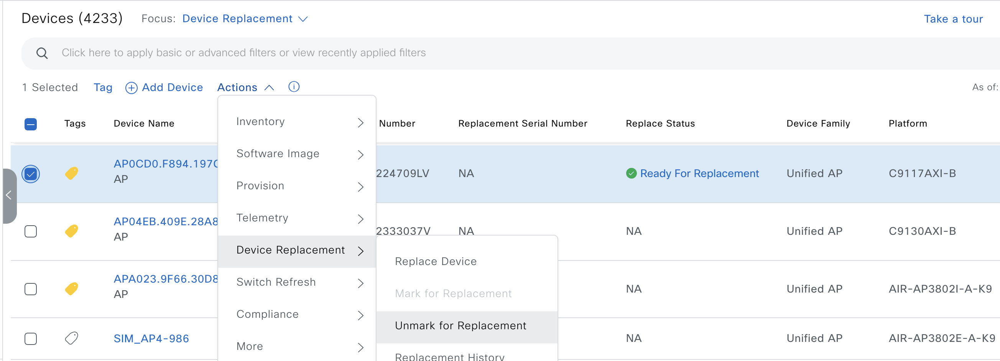

# Replace a Faulty Device
The Return Material Authorization (RMA) workflow lets you replace failed devices quickly. RMA provides a common workflow to replace routers, switches, and APs.

When using the RMA workflow with routers and switches, the software image, configuration, and license are restored from the failed device to the replacement device. For wireless APs, the replacement device is assigned to the same site, which is provisioned with primary wireless controller, RF profile, and AP group settings, and placed on the same floor map location in Catalyst Center as the failed AP. For Cisco switch stacks (hardware stacking), you don't need to follow a separate procedure in Catalyst Center for member switch replacement, which is handled by the active switch. The member switch is replaced by the active switch by providing the software image and configuration. Full stack replacement is handled by Catalyst Center.


##  Before you begin
1. The software image version of the faulty device must be imported in the image repository before marking the device for replacement.
2. The faulty device must be in an unreachable state.
3. If the replacement device onboards to Catalyst Center through Plug and Play (PnP), the faulty device must be assigned to a user-defined site.
4. The replacement device must not be in a provisioning state while triggering the RMA workflow.
5. For switch stacks replacement, the number of stacks for the faulty and replacement device must be the same.

## The Steps coverd by the automation
1. Mark the faulty device for replacement
    From the top-left corner, click the menu icon and choose Provision > Inventory.
    From the Actions drop-down list, choose Inventory > Device Replacement > Mark Device for Replacement.
    In the Mark for Replacement window, click Mark.
    Figure1: Mark Faulty Device for replacement UI
    

2. To replace the device, do the following:
    Select the device that you want to replace and choose Actions > Replace Device.
    In the Choose Replacement Device window, choose a replacement device from the Unclaimed tab or the Managed tab.

    The Unclaimed tab shows the devices that are onboarded through PnP. The Managed tab shows the devices that are onboarded through the Inventory or the discovery process.
    If the replacement device is not yet onboarded, do the following:
    In the Choose Replacement Device window, click Add Device.
    In the Add New Device window, enter the Serial Number of the device and click Add New Device.
    In the Choose Replacement Device window, click Sync with Smart Account.
    In the Sync with Smart Account window, click Sync.
    The Automation does not support scheduling through Catalyst Center. 
    User should schedule their script run from automation.
    

## Inputs:
```yaml
---
catalyst_center_version: 2.3.7.6
rma_devices: 
  - faulty_device_serial_number: "KWC224709LV"
    replacement_device_serial_number: "KWC2333037V"
```

```yaml
---
catalyst_center_version: 2.3.7.6
rma_devices: 
  - faulty_device_ip_address: "204.192.3.40"
    replacement_device_ip_address: "204.1.2.5"
```

```yaml
---
catalyst_center_version: 2.3.7.6
rma_devices: 
  - faulty_device_name: "SJ-EN-9300.cisco.local"
    replacement_device_name: "SJ-EN-9300.cisco-1.local"
```

## Validate the inputs:
```bash
yamale -s workflows/device_replacement_rma/schema/device_replacement_rma_schema.yml workflows/device_replacement_rma/vars/device_replacement_rma_input.yml
Validating /Users/pawansi/dnac_ansible_workflows/workflows/device_replacement_rma/vars/device_replacement_rma_input.yml...
Validation success! 👍
```
## Run Playbook with input:

```bash
ansible-playbook -i host_inventory_dnac1 workflows/device_replacement_rma/playbook/device_replacement_rma_playbook.yml --e VARS_FILE_PATH=../vars/device_replacement_rma_input.yml  -vvv
```

3. Unmark the faulty devicew replacement
    If you your faulty device came up and is not more required to be replace, you can un marked the already marked faulty device from replacement as below. 
    From the Inventory drop-down list, choose Marked for Replacement.
    A list of devices that are marked for replacement is displayed.
    If you don't want to replace the device, select the device and choose Actions > Unmark for Replacement.
    Figure3: Mark Faulty Device for replacement UI
    

## Inputs:
```yaml
---
catalyst_center_version: 2.3.7.6
rma_devices: 
  - faulty_device_serial_number: "KWC224709LV"
    replacement_device_serial_number: "KWC2333037V"
```

## Run playbook with state set to deleted
```bash
ansible-playbook -i host_inventory_dnac1 workflows/device_replacement_rma/playbook/delete_device_replacement_rma_playbook.yml --e VARS_FILE_PATH=../vars/device_replacement_rma_input.yml  -vvv
```


# Limitations of the RMA Workflow in Catalyst Center
RMA supports replacement of all switches, routers, and Cisco SD-Access devices, except for the following:

Devices with embedded wireless controllers

Cisco Wireless Controllers

Chassis-based Nexus 7700 Series Switches

Switch stacks (SVL stacking)

RMA supports devices with an external SCEP broker PKI certificate. The PKI certificate is created and authenticated for the replacement device during the RMA workflow. The PKI certificate of the replaced faulty device must be manually deleted from the certificate server.

The RMA workflow supports device replacement only if:

Both the faulty and replacement devices have the same extension cards.

The number of ports in both devices does not vary because of the extension cards.

The faulty device is managed by Catalyst Center with a static IP. (RMA is not supported for devices that are managed by Catalyst Center with a DHCP IP, except extended node and AP in fabric.)

Make sure that the replacement device is connected to the same port to which the faulty device was connected.

Fabric edge replacement does not support the DHCP server configuration in the neighbor device if the neighbor device is not part of the fabric. Because intermediate nodes are not part of the Cisco SD-Access fabric, the DHCP server with option 43 is not pushed.

Catalyst Center does not support legacy license deployment.

The RMA workflow deregisters the faulty device from Cisco SSM and registers the replacement device with Cisco SSM.

If the software image installed on the faulty device is earlier than Cisco IOS XE 16.8, the License Details window does not display the Network and Feature License details and no warning message is displayed. Therefore, you should be aware of the legacy network license configured on the faulty device and manually apply the same legacy network license on the replacement device.

If the software image installed on the faulty device is Cisco IOS XE 16.8 or later, the License Details window displays details of the network license (for example, Legacy or Network) and the feature license (for example, IP Base, IP Service, or LAN Base). The following warning message is displayed while marking the faulty device for replacement:

Some of the faulty devices don't have a license. Please ensure your replacement device has the same Legacy license of the faulty device enabled.
If the legacy network licenses of the replacement and faulty devices do not match, the following error message is displayed during the license deployment:

Catalyst Center doesn't support legacy license deployment. So manually update the faulty device license on the replacement device and resync before proceeding.
Catalyst Center supports PnP onboarding of the replacement device in a fabric network, except when:

The faulty device is connected to an uplink device using multiple interfaces.

LAN automation uses overlapping pools.

** If the replacement device onboards through the PnP-DHCP functionality, make sure that the device gets the same IP address after every reload and the lease timeout of DHCP is longer than two hours. **


