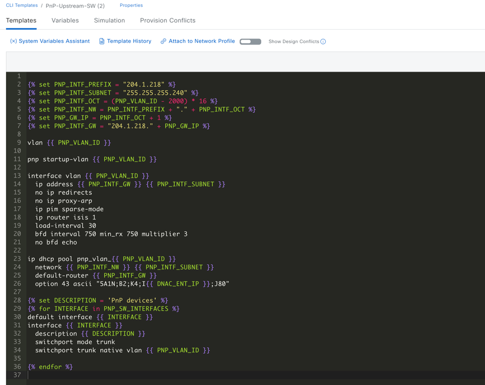
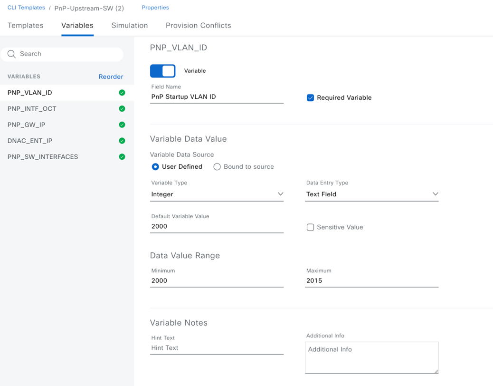

# Ansible Workflow: Device Template Workflow Manager

### Overview

This Ansible workflow automates crating and managing template projects, device templates and deploying the templates to the devices. One of the many powerful features of Cisco's DNA Center is its templating engine. You can configure nearly your entire network from here.

### Detailed Input Spec
Refer to: [https://galaxy.ansible.com/ui/repo/published/cisco/dnac/content/module/template_workflow_manager/](https://galaxy.ansible.com/ui/repo/published/cisco/dnac/content/module/template_workflow_manager/)

### Features
- Create, update, or delete configuration templates.
- Apply templates to specific devices or device types.
- Manage template versions and rollback configurations.

### Main Task

*  Manage operations create, update and delete of the resource Configuration Template.
*    API to create a template by project name and template name.
*    API to update a template by template name and project name.
*    API to delete a template by template name and project name.
*    API to export the projects for given projectNames.
*    API to export the templates for given templateIds.
*    API to manage operation create of the resource Configuration Template Import Project.
*    API to manage operation create of the resource Configuration Template Import Template.
*  Deploy Templates to devices with device specific parameters.


###  Important Notes
* Always refer to the detailed input specification for comprehensive information on available options and their structure.

## I. Procedure
### Prepare your Ansible environment:

- nstall Ansible if you haven't already
- Ensure you have network connectivity to your Catalyst Center instance.
- Checkout the project and playbooks: git@github.com:cisco-en-programmability/catalyst-center-ansible-iac.git


### Configure Host Inventory:
- The host_inventory_dnac1/hosts.yml file specifies the connection details (IP address, credentials, etc.) for your Catalyst Center instance.
- Make sure the dnac_version in this file matches your actual Catalyst Center version.
- The Sample host_inventory_dnac1/hosts.yml

```bash
catalyst_center_hosts:
    hosts:
        catalyst_center220:
            dnac_host: xx.xx.xx.xx.
            dnac_password: XXXXXXXX
            dnac_port: 443
            dnac_timeout: 60
            dnac_username: admin
            dnac_verify: false
            dnac_version: 2.3.7.6
            dnac_debug: true
            dnac_log_level: INFO
            dnac_log: true
```
### Define Playbook input:
The /vars/template_workflow_inputs.yml file stores the sites details you want to configure.

```bash
template_details:
    - configuration_templates:
        author: Pawan Singh
        composite: false
        custom_params_order: true
        description: Template to configure Access Vlan n Access Interfaces
        device_types:
        - product_family: Switches and Hubs
        product_series: Cisco Catalyst 9300 Series Switches
        product_type: Cisco Catalyst 9300 Switch
        failure_policy: ABORT_TARGET_ON_ERROR
        language: VELOCITY
        name: access_van_template_9300_switches
        project_name: access_van_template_9300_switches
        project_description: This project contains all the templates for Access Switches
        software_type: IOS-XE
        software_version: null
        template_name: PnP-Upstream-SW
        template_content: |
        vlan $vlan
        interface $interface
        switchport access vlan $vlan
        switchport mode access
        description $interface_description
        version: "1.0"
    - configuration_templates:
      name: PnP-Upstream-SW
      template_name: PnP-Upstream-SW
      project_name: Onboarding Configuration
      tags: []
      author: admin
      device_types:
        - product_family: Switches and Hubs
          product_series: Cisco Catalyst 9500 Series Switches
        - product_family: Switches and Hubs
          product_series: Cisco Catalyst 9300 Series Switches
      software_type: IOS-XE
      language: VELOCITY
      template_content: 
        vlan $vlan
        interface $interface
        switchport access vlan $vlan
        switchport mode access
        description $interface_description
    
deploy_device_details:
    - host_name: SJC-Switch-1
      management_ip: 10.1.1.1
      site_name: Global/USA/SAN JOSE/BLD23
      device_role: ACCESS
      device_tag: all_9300_Access_tag1
      device_template_params:
          - param_name: "vlan"
            param_value: "100"
          - param_name: "interface"
            param_value: "TwoGigabitEthernet1/0/2"
          - param_name: "interface_description"
            param_value: "Access Port"
```
### How to Validate Input

* Use `yamale`:

```bash
yamale -s workflows/device_templates/schema/template_workflow_schema.yml workflows/device_templates/vars/template_workflow_inputs.yml 
Validating /Users/pawansi/dnac_ansible_workflows/workflows/device_templates/vars/template_workflow_inputs.yml...
Validation success! 👍
```

### How to Run
* Execute the Ansible Playbook to add, update, provision devices:
```bash
    ansible-playbook -i host_inventory_dnac1/hosts.yml workflows/device_templates/playbook/template_workflow_playbook.yml --e VARS_FILE_PATH=../vars/template_workflow_inputs.yml
```

*  How to Delete Existing Devices from inventory
*  Run the Delete Playbook:
```bash
    ansible-playbook -i host_inventory_dnac10_195_243_53/hosts.yml workflows/device_templates/playbook/delete_template_workflow_playbook.yml --e VARS_FILE_PATH=../vars/template_workflow_inputs.yml
```

## II. Detailed steps to perform

### 1. Create Templates - PnP-Upstream-SW

#### **Mapping config to UI Actions**

- The config parameter within this task corresponds to the "Design > CLI Templates > Create Template" action in the Cisco Catalyst Center UI.






#### **YAML Structure and Parameter Explanation**

```
- name: Create templates - PnP-Upstream-SW
  cisco.dnac.template_workflow_manager:
    <<: *common_config
    state: merged
    config:
      - "{{ item }}"
  with_list: "{{ vars_map.template_pnp_upstream_sw }}"
  tags: pnp_upstream_sw
```

#### **Input File Structure**

```
template_pnp_upstream_sw:
  - configuration_templates:
      name: PnP-Upstream-SW
      template_name: PnP-Upstream-SW
      project_name: Onboarding Configuration
      tags: []
      author: admin
      device_types:
        - product_family: Switches and Hubs
          product_series: Cisco Catalyst 9500 Series Switches
        - product_family: Switches and Hubs
          product_series: Cisco Catalyst 9300 Series Switches
      software_type: IOS-XE
      software_variant: XE
      template_content: |
        
        
        
        
        
        
        

        vlan {{ PNP_VLAN_ID }}

        pnp startup-vlan {{ PNP_VLAN_ID }}

        interface vlan {{ PNP_VLAN_ID }}
          ip address {{ PNP_INTF_GW }} {{ PNP_INTF_SUBNET }}
          no ip redirects
          no ip proxy-arp
          ip pim sparse-mode
          ip router isis 1
          load-interval 30
          bfd interval 750 min_rx 750 multiplier 3
          no bfd echo

        ip dhcp pool pnp_vlan_{{ PNP_VLAN_ID }}
          network {{ PNP_INTF_NW }} {{ PNP_INTF_SUBNET }}
          default-router {{ PNP_INTF_GW }}
          option 43 ascii "5A1N;B2;K4;I{{ DNAC_ENT_IP }};J80"

        
        
        default interface {{ INTERFACE }}
        interface {{ INTERFACE }}
          description {{ DESCRIPTION }}
          switchport mode trunk
          switchport trunk native vlan {{ PNP_VLAN_ID }}

        
        

      template_params:
        - parameter_name: PNP_GW_IP
          data_type: STRING
          default_value: null
          description: null
          required: true
          not_param: true
          param_array: false
          instruction_text: null
          group: null
          order: 3
          custom_order: 0
          selection: null
          range: []
          key: null
          provider: null
          binding: ""
          display_name: null
        - parameter_name: DNAC_ENT_IP
          data_type: IPADDRESS
          default_value: 204.192.1.214
          description: null
          required: true
          not_param: false
          param_array: false
          instruction_text: null
          group: null
          order: 4
          custom_order: 0
          selection:
            selection_type: null
            selection_values: {}
            default_selected_values: []
            id: null
          range: []
          key: null
          provider: null
          binding: ""
          display_name: DNAC Enterprise IP Address
        - parameter_name: PNP_SW_INTERFACES
          data_type: STRING
          default_value: ""
          description: null
          required: true
          not_param: false
          param_array: true
          instruction_text: null
          group: null
          order: 5
          custom_order: 0
          selection:
            selection_type: MULTI_SELECT
            selection_values: {}
            default_selected_values: []
            id: null
          range: []
          key: null
          provider: null
          binding: >-
            {
              "provider": "Inventory",
              "source": "Inventory",
              "entity": "Interface",
              "variableName": "__interface",
              "attribute": "portName",
              "attributeToDisplay": "portName",
              "attributesAvailable": [
                "addresses",
                "adminStatus",
                "className",
                "deviceId",
                "duplex",
                "ifIndex",
                "interfaceType",
                "ipv4Address",
                "ipv4Mask",
                "isisSupport",
                "lastUpdated",
                "macAddress",
                "mappedPhysicalInterfaceId",
                "mappedPhysicalInterfaceName",
                "mediaType",
                "mtu",
                "nativeVlanId",
                "networkdevice_id",
                "ospfSupport",
                "pid",
                "portMode",
                "portName",
                "portType",
                "poweroverethernet",
                "serialNo",
                "series",
                "speed",
                "status",
                "vlanId",
                "voiceVlan",
                "managedComputeElement",
                "managedNetworkElement",
                "description",
                "owningEntityId"
              ],
              "params": [
                {
                  "type": "MANAGED_DEVICE_UUID",
                  "scope": "RUNTIME",
                  "value": null
                },
                {
                  "type": "MANAGED_DEVICE_IP",
                  "scope": "RUNTIME",
                  "value": null
                },
                {
                  "type": "MANAGED_DEVICE_HOSTNAME",
                  "scope": "RUNTIME",
                  "value": null
                }
              ],
              "value": null,
              "errorMessage": null,
              "sortAttribute": null,
              "sortValues": null,
              "filterType": null,
              "filterValue": null,
              "filterByAttribute": null,
              "filterSupported": true
            }
          display_name: Interfaces connected to PnP Devices
        - parameter_name: PNP_INTF_OCT
          data_type: STRING
          default_value: null
          description: null
          required: true
          not_param: true
          param_array: false
          instruction_text: null
          group: null
          order: 2
          custom_order: 0
          selection: null
          range: []
          key: null
          provider: null
          binding: ""
          display_name: null
        - parameter_name: PNP_VLAN_ID
          data_type: INTEGER
          default_value: 2000
          description: null
          required: true
          not_param: false
          param_array: false
          instruction_text: null
          group: null
          order: 1
          custom_order: 0
          selection:
            selection_type: null
            selection_values: {}
            default_selected_values: []
            id: null
          range:
            - min_value: 2000
              max_value: 2015
              id: null
          key: null
          provider: null
          binding: ""
          display_name: PnP Startup VLAN ID
      rollback_template_params: []
      composite: false
      containing_templates: []
      language: JINJA
      custom_params_order: false
```

### 2. Create Templates - PnP-Devices-SW

#### **YAML Structure and Parameter Explanation**

```
- name: Create templates - PnP-Devices-SW
  cisco.dnac.template_workflow_manager:
    <<: *common_config
    state: merged
    config:
      - "{{ item }}"
  with_list: "{{ vars_map.template_pnp_devices_sw }}"
  tags: pnp_devices_sw
```

#### **Input File Structure**


```
template_pnp_devices_sw:
  - configuration_templates:
      name: PnP-Devices-SW
      template_name: PnP-Devices-SW
      project_name: Onboarding Configuration
      tags: []
      author: admin
      device_types:
        - product_family: Switches and Hubs
          product_series: Cisco Catalyst 9500 Series Switches
        - product_family: Switches and Hubs
          product_series: Cisco Catalyst 9300 Series Switches
      software_type: IOS-XE
      software_variant: XE
      template_content: |
        
        no logging console
        no logging monitor
        !
        ip routing
        !
        !
        !
        !
        !
        ip multicast-routing
        ip domain name cisco.local
        no ip dhcp conflict logging
        !
        !
        !
        no login on-success log
        ipv6 unicast-routing
        !
        !
        !
        !
        !
        !
        !
        vtp mode transparent
        no device-tracking logging theft
        !
        !
        system mtu 9100
        license boot level network-advantage addon dna-advantage
        !
        !
        diagnostic bootup level minimal
        !
        spanning-tree mode rapid-pvst
        spanning-tree extend system-id
        archive
        log config
          logging enable
          logging size 1000
        memory free low-watermark processor 134344
        !
        redundancy
        mode sso
        !
        !
        !
        !
        !
        transceiver type all
        monitoring
        !
        !
        interface vlan {{ PNP_VLAN_ID }}
          no ip redirects
          no ip proxy-arp
          ip pim sparse-mode
          ip router isis 1
          load-interval 30
          bfd interval 750 min_rx 750 multiplier 3
          no bfd echo
        !
        interface Loopback0
          ip address {{ LOOPBACK_IP }} 255.255.255.255
          ip router isis 1
        !
        !
        
        
        router isis 1
          net 49.0001.1111.1111.{{ ISIS_NET }}.00
          is-type level-2-only
          metric-style wide
          log-adjacency-changes
          bfd all-interfaces
        !
        ip forward-protocol nd
        !
        netconf-yang
        end
        

      rollback_template_content: ""
      template_params:
        - parameter_name: LOOPBACK_IP
          data_type: IPADDRESS
          default_value: 204.1.2.100
          description: null
          required: true
          not_param: false
          param_array: false
          instruction_text: null
          group: null
          order: 2
          custom_order: 0
          selection:
            selection_type: null
            selection_values: {}
            default_selected_values: []
            id: null
          range: []
          key: null
          provider: null
          binding: ""
          display_name: null
        - parameter_name: PNP_VLAN_ID
          data_type: INTEGER
          default_value: 2000
          description: null
          required: true
          not_param: false
          param_array: false
          instruction_text: null
          group: null
          order: 1
          custom_order: 0
          selection:
            selection_type: null
            selection_values: {}
            default_selected_values: []
            id: null
          range:
            - min_value: 2000
              max_value: 2015
              id: null
          key: null
          provider: null
          binding: ""
          display_name: PnP Startup VLAN ID
      rollback_template_params: []
      composite: false
      containing_templates: []
      language: JINJA
      custom_params_order: false
```

## III. References:

Note: The environment is used for the references in the above instructions.

```
  ansible: 9.9.0
  ansible-core: 2.16.10
  ansible-runner: 2.4.0

  dnacentersdk: 2.8.3
  cisco.dnac: 6.29.0
  ansible.utils: 5.1.2
```
Cisco Catalyst Center Ansible Module Documentation: [template_workflow_manager](https://cisco-en-programmability.github.io/dnacenter-ansible/main/plugins/template_workflow_manager_module.html)

GitHub Source Code: [template_workflow_manager.py](https://github.com/cisco-en-programmability/dnacenter-ansible/blob/main/plugins/modules/template_workflow_manager.py)