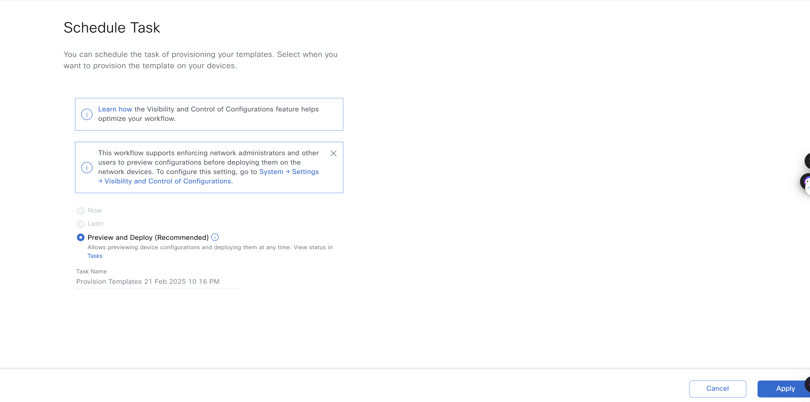

# Ansible Workflow: Device Template Workflow Manager

## I. Overview.

This Ansible workflow automates crating and managing template projects, device templates and deploying the templates to the devices. One of the many powerful features of Cisco's DNA Center is its templating engine. You can configure nearly your entire network from here.

### 1. Detailed Input Spec.
Refer to: [https://galaxy.ansible.com/ui/repo/published/cisco/dnac/content/module/template_workflow_manager/](https://galaxy.ansible.com/ui/repo/published/cisco/dnac/content/module/template_workflow_manager/)

### 2. Features.
- Create, update, or delete configuration templates.
- Apply templates to specific devices or device types.
- Manage template versions and rollback configurations.

### 3. Main Task.

*  Manage operations create, update and delete of the resource Configuration Template.
*    API to create a template by project name and template name.
*    API to update a template by template name and project name.
*    API to delete a template by template name and project name.
*    API to export the projects for given projectNames.
*    API to export the templates for given templateIds.
*    API to manage operation create of the resource Configuration Template Import Project.
*    API to manage operation create of the resource Configuration Template Import Template.
*  Deploy Templates to devices with device specific parameters.


###  4. Important Notes.
* Always refer to the detailed input specification for comprehensive information on available options and their structure.

## II. Procedure
### 1. Prepare your Ansible environment.

- install Ansible if you haven't already
- Ensure you have network connectivity to your Catalyst Center instance.
- Checkout the project and playbooks: git@github.com:cisco-en-programmability/catalyst-center-ansible-iac.git.

### 2. Configure Host Inventory.
- The host_inventory_dnac1/hosts.yml file specifies the connection details (IP address, credentials, etc.) for your Catalyst Center instance.
- Make sure the dnac_version in this file matches your actual Catalyst Center version.
- The Sample host_inventory_dnac1/hosts.yml

```bash
catalyst_center_hosts:
    hosts:
        catalyst_center220:
            dnac_host: xx.xx.xx.xx.
            dnac_password: XXXXXXXX
            dnac_port: 443
            dnac_timeout: 60
            dnac_username: admin
            dnac_verify: false
            dnac_version: 2.3.7.6
            dnac_debug: true
            dnac_log_level: INFO
            dnac_log: true
```
### 3. Define Playbook input:
The /vars/template_workflow_inputs.yml file stores the sites details you want to configure.

- Create templates
```bash
template_details:
  # List of templates to be uploaded to the Cisco Catalyst Center
  - configuration_templates:
      author: Pawan Singh
      composite: false
      custom_params_order: true
      description: Template to configure Access Vlan n Access Interfaces
      device_types:
      - product_family: Switches and Hubs
        product_series: Cisco Catalyst 9300 Series Switches
        #product_type: Cisco Catalyst 9300 Switch
      failure_policy: ABORT_TARGET_ON_ERROR
      language: VELOCITY
      name: access_van_template_9300_switches
      project_name: access_van_template_9300_switches
      project_description: This project contains all the templates for Access Switches
      software_type: IOS-XE
      software_version: null
      template_name: PnP-Upstream-SW
      #tags:
      #  name: string
      template_content: |
        vlan $vlan
        interface $interface
        switchport access vlan $vlan
        switchport mode access
        description $interface_description
      version: "1.0"
  - configuration_templates:
      name: PnP-Upstream-SW
      template_name: PnP-Upstream-SW
      project_name: Onboarding Configuration
      tags: []
      author: admin
      device_types:
        - product_family: Switches and Hubs
          product_series: Cisco Catalyst 9500 Series Switches
        - product_family: Switches and Hubs
          product_series: Cisco Catalyst 9300 Series Switches
      software_type: IOS-XE
      language: VELOCITY
      template_content: 
        vlan $vlan
        interface $interface
        switchport access vlan $vlan
        switchport mode access
        description $interface_description
```
- Deploy templates
```bash
deploy_device_details:
  - deploy_template:
    - project_name: Onboarding Configuration
      template_name: PnP-Upstream-SW
      force_push: true
      template_parameters:
        - param_name: "vlan_id"
          param_value: "1431"
      site_provisioning_details:
        - site_name: "Global/Bangalore/Building14/Floor1"
          device_family: "Switches and Hubs"
  - deploy_template:
    - project_name: Onboarding Configuration
      template_name: PnP-Upstream-SW
      force_push: true
      template_parameters:
        - param_name: "vlan_id"
          param_value: "1431"
      device_details:
        device_ips: ["10.1.2.1", "10.2.3.4"]
```
### 4. How to Validate Input.

* Use `yaml`:

```bash
yaml -s workflows/device_templates/schema/template_workflow_schema.yml workflows/device_templates/vars/template_workflow_inputs.yml 
Validating /Users/pawansi/dnac_ansible_workflows/workflows/device_templates/vars/template_workflow_inputs.yml...
Validation success! 👍
```

### 5. How to Run.
* Execute the Ansible Playbook to add, update, provision devices.
```bash
    ansible-playbook -i host_inventory_dnac1/hosts.yml workflows/device_templates/playbook/template_workflow_playbook.yml --e VARS_FILE_PATH=../vars/template_workflow_inputs.yml
```

*  How to Delete Existing Devices from inventory.
*  Run the Delete Playbook:
```bash
    ansible-playbook -i host_inventory_dnac/hosts.yml workflows/device_templates/playbook/delete_template_workflow_playbook.yml --e VARS_FILE_PATH=../vars/template_workflow_inputs.yml
```

## III. Detailed steps to perform.

### 1. Create Templates - PnP-Upstream-SW.

#### **Mapping config to UI Actions**

- The config parameter within this task corresponds to the "Design > CLI Templates > Create Template" action in the Cisco Catalyst Center UI.


- Enter the parameters of the template you want to create.

- Enter content template -> Commit.

- Enter commit note -> Commit.

- Check template created.


#### **Example Input File**

```
template_details:
  # List of templates to be uploaded to the Cisco Catalyst Center
  - configuration_templates:
      author: Pawan Singh
      composite: false
      custom_params_order: true
      description: Template to configure Access Vlan n Access Interfaces
      device_types:
      - product_family: Switches and Hubs
        product_series: Cisco Catalyst 9300 Series Switches
        #product_type: Cisco Catalyst 9300 Switch
      failure_policy: ABORT_TARGET_ON_ERROR
      language: VELOCITY
      name: access_van_template_9300_switches
      project_name: access_van_template_9300_switches
      project_description: This project contains all the templates for Access Switches
      software_type: IOS-XE
      software_version: null
      template_name: PnP-Upstream-SW
      #tags:
      #  name: string
      template_content: |
        vlan $vlan
        interface $interface
        switchport access vlan $vlan
        switchport mode access
        description $interface_description
      version: "1.0"
```
### 2. Delete Templates

#### **Mapping config to UI Actions**
- Choose Template want to delete -> Delete.

- Click "Yes" to confirm deleting the template.

- Check Template deleted.


#### **Example Input File**
```bash
template_details:
  # List of templates to be uploaded to the Cisco Catalyst Center
  - configuration_templates:
      author: Pawan Singh
      composite: false
      custom_params_order: true
      description: Template to configure Access Vlan n Access Interfaces
      device_types:
      - product_family: Switches and Hubs
        product_series: Cisco Catalyst 9300 Series Switches
        #product_type: Cisco Catalyst 9300 Switch
      failure_policy: ABORT_TARGET_ON_ERROR
      language: VELOCITY
      name: access_van_template_9300_switches
      project_name: access_van_template_9300_switches
      project_description: This project contains all the templates for Access Switches
      software_type: IOS-XE
      software_version: null
      template_name: PnP-Upstream-SW
      #tags:
      #  name: string
      template_content: |
        vlan $vlan
        interface $interface
        switchport access vlan $vlan
        switchport mode access
        description $interface_description
      version: "1.0"
```

### 3. Deploy Templates

#### **Mapping config to UI Actions**
- Acttach Template to Network Profile: Choose Template -> Attach.

- Choose Network Profile need to attach -> "Save".

- Check Template attach successfully

- Choose Template deploy -> Provision Templates.

- Click Next.

- Choose device need deploy template.

- Click Next.

- click on Apply to deploy the template.


#### **Example Input File**

```
- deploy_template:
    - project_name: Onboarding Configuration
      template_name: PnP-Upstream-SW
      force_push: true
      template_parameters:
        - param_name: "vlan_id"
          param_value: "1431"
      site_provisioning_details:
        - site_name: "Global/Bangalore/Building14/Floor1"
          device_family: "Switches and Hubs"
  - deploy_template:
    - project_name: Onboarding Configuration
      template_name: PnP-Upstream-SW
      force_push: true
      template_parameters:
        - param_name: "vlan_id"
          param_value: "1431"
      device_details:
        device_ips: ["10.1.2.1", "10.2.3.4"]
```

## IV. References:

Note: The environment is used for the references in the above instructions.

```
  ansible: 9.9.0
  ansible-core: 2.16.10
  ansible-runner: 2.4.0

  dnacentersdk: 2.8.3
  cisco.dnac: 6.29.0
  ansible.utils: 5.1.2
```
Cisco Catalyst Center Ansible Module Documentation: [template_workflow_manager](https://cisco-en-programmability.github.io/dnacenter-ansible/main/plugins/template_workflow_manager_module.html)

GitHub Source Code: [template_workflow_manager.py](https://github.com/cisco-en-programmability/dnacenter-ansible/blob/main/plugins/modules/template_workflow_manager.py)