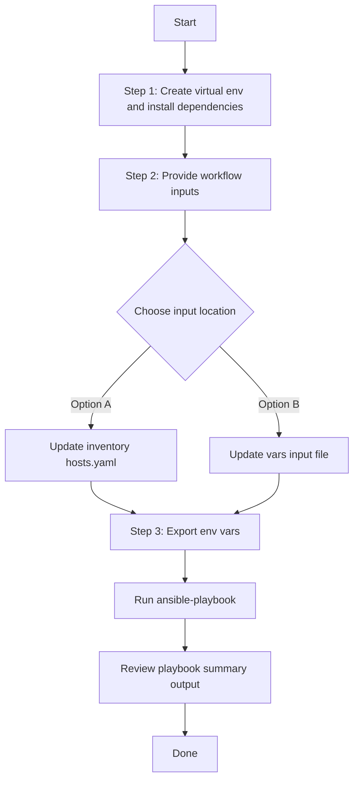

# Discovery Playbook Config Generator

## Table of Contents

- [User Flow (3 Steps)](#user-flow-3-steps)

- [Overview](#overview)
- [Features](#features)
- [Prerequisites](#prerequisites)
- [Workflow Structure](#workflow-structure)
- [Schema Parameters](#schema-parameters)
- [Getting Started](#getting-started)
- [Operations](#operations)
- [Examples](#examples)---

## Overview

The Discovery Playbook Config Generator automates the creation of YAML playbook configurations for existing discovery tasks deployed in Cisco Catalyst Center. This tool reduces the effort required to manually create Ansible playbooks by programmatically retrieving discovery task configurations — including IP ranges, credential mappings, discovery types, protocol orders, and task-specific settings — and generating ready-to-use YAML files.

---

## Features

- **Configuration Generation**: Generate YAML configurations compatible with the `discovery_workflow_manager` module.
  - Extract existing discovery task configurations from Cisco Catalyst Center.
  - Convert them into properly formatted YAML files.
  - Generate files that are ready to use with Ansible automation.
- **Global Filtering**: Selective generation using `discovery_name_list` or `discovery_type_list`.
  - `discovery_name_list` — **highest priority**: filters by exact discovery task name.
  - `discovery_type_list` — **lower priority**: filters by discovery type (Single, Range, CDP, LLDP, CIDR).
- **Flexible Output**: Configurable file paths, auto-generated timestamped filenames, and `overwrite`/`append` file modes.
- **Brownfield Support**: Extract configurations from existing Catalyst Center deployments.
- **API Integration**: Leverages native Catalyst Center discovery APIs for data retrieval.

---

## Prerequisites

### Software Requirements

| Component | Version |
|-----------|---------|
| Ansible | 2.13+ |
| cisco.dnac collection | 6.44.0+ |
| Python | 3.9+ |
| Cisco Catalyst Center | 2.3.7.9+ |
| dnacentersdk | 2.4.5+ |

### Required Collections

```bash
ansible-galaxy collection install cisco.dnac    # >= 6.44.0
ansible-galaxy collection install ansible.utils
pip install dnacentersdk
pip install yamale
```

### Access Requirements

- Catalyst Center admin credentials
- Network connectivity to Catalyst Center API
- Existing discovery tasks configured in Catalyst Center

---

## Workflow Structure

```
discovery_playbook_config_generator/
├── playbook/
│   └── discovery_playbook_config_generator_playbook.yml   # Main operations
├── vars/
│   └── discovery_playbook_config_generator_inputs.yml     # Configuration examples
├── schema/
│   └── discovery_playbook_config_generator_schema.yml     # Input validation
└── README.md
```

---

## Schema Parameters

### Basic Configuration

| Parameter | Type | Required | Default | Description |
|-----------|------|----------|---------|-------------|
| `generate_all_configurations` | boolean | No | `false` | When `true`, generates YAML for all discovery tasks regardless of filters |
| `file_path` | string | No | auto-generated | Output file path. Defaults to `discovery_playbook_config_<YYYY-MM-DD_HH-MM-SS>.yml` |
| `file_mode` | string | No | `overwrite` | File write mode — `overwrite` replaces the file, `append` adds to it |
| `global_filters` | dict | No | — | Filters to select specific discoveries by name or type |

### Global Filters

| Parameter | Type | Required | Priority | Description |
|-----------|------|----------|----------|-------------|
| `discovery_name_list` | list[str] | No | **Highest** | List of exact discovery task names. Ignores `discovery_type_list` when provided |
| `discovery_type_list` | list[str] | No | Lower | List of discovery types. Used only when `discovery_name_list` is not provided |

**Valid `discovery_type_list` values:**

| Value | Description |
|-------|-------------|
| `Single` | Single IP address discovery |
| `Range` | IP address range discovery |
| `CDP` | CDP-based neighbour discovery |
| `LLDP` | LLDP-based neighbour discovery |
| `CIDR` | CIDR subnet discovery |

---

## Getting Started

## Workflow Steps
## User Flow (3 Steps)



### Installation and Run (Aligned)

1. Create and activate a Python virtual environment, then install dependencies.

```bash
python3 -m venv .venv
source .venv/bin/activate
pip install -r requirements.txt
ansible-galaxy collection install cisco.dnac --force
```

2. Provide workflow inputs in either inventory (`inventory/demo_lab/hosts.yaml`) or the workflow `vars/` file.

3. Export Catalyst Center environment variables and run the playbook.

```bash
export HOSTIP=<catalyst-center-ip-or-fqdn>
export CATALYST_CENTER_USERNAME=<username>
export CATALYST_CENTER_PASSWORD='<password>'
ansible-playbook -i ./inventory/demo_lab/hosts.yaml ./workflows/discovery_config_generator/playbook/discovery_config_generator.yml -vvvv
```


## Operations

### Generate Operations (state: gathered)

Use `discovery_playbook_config_generator_playbook.yml` for all YAML generation operations.

#### 1. Generate All Configurations

**Description**: Retrieves all discovery tasks from Catalyst Center regardless of any filters.

```yaml
discovery_playbook_config_generator_details:
  generate_all_configurations: true
  file_path: "/tmp/complete_discovery_config.yml"
```

**Terminal Return:**

```
config:
        file_path: /tmp/complete_discovery_config.yml
        generate_all_configurations: true
  msg: Successfully validated playbook configuration
  response:
    component_summary:
      discovery_details:
        total_failed: 0
        total_processed: 18
        total_successful: 18
    discoveries_found:
    - discovery_name: LLDP Discovery
      discovery_type: LLDP
      status: Complete
    - discovery_name: CIDR Discovery
      discovery_type: CIDR
      status: Complete
    - discovery_name: Range Discovery
      discovery_type: Range
      status: Complete
    - discovery_name: Single Discovery
      discovery_type: Single
      status: Complete
    - discovery_name: Multi Range1
      discovery_type: Range
      status: Complete
    - discovery_name: Clone of Single IP Discovery
      discovery_type: Range
      status: Complete
    - discovery_name: Multi Range Discovery
      discovery_type: Range
      status: Complete
    - discovery_name: Single Range Discovery 1
      discovery_type: Range
      status: Complete
    - discovery_name: NY-BN-9500
      discovery_type: Range
      status: Complete
    - discovery_name: abc
      discovery_type: Range
      status: Complete
    - discovery_name: device_discovery
      discovery_type: Range
      status: Complete
    - discovery_name: Discovery created on Nov 3, 2025 10:45 AM
      discovery_type: Range
      status: Complete
    - discovery_name: Discovery created on Oct 15, 2025 04:50 PM
      discovery_type: Range
      status: Complete
    - discovery_name: Discovery created on Oct 15, 2025 04:40 PM
      discovery_type: Range
      status: Complete
    - discovery_name: Discovery created on Oct 14, 2025 10:43 AM
      discovery_type: Range
      status: Complete
    - discovery_name: Discovery created on Oct 13, 2025 08:04 PM
      discovery_type: Range
      status: Complete
    - discovery_name: Discovery created on Oct 13, 2025 07:53 PM
      discovery_type: Range
      status: Complete
    - discovery_name: Discovery created on Oct 13, 2025 07:26 PM
      discovery_type: Range
      status: Complete
    discoveries_skipped: []
    file_path: /tmp/complete_discovery_config.yml
    status: success
    total_discoveries_processed: 18
  status: success
```

#### 2. Filter by Discovery Name

**Description**: Generates configuration for specific discovery tasks by exact name. Name filter has **highest priority** — `discovery_type_list` is ignored when names are provided.

```yaml
discovery_playbook_config_generator_details:
  file_path: "/tmp/specific_discoveries.yml"
  file_mode: overwrite
  global_filters:
    discovery_name_list:
      - "Range Discovery"
      - "Single Discovery"
```

**Terminal Return:**

```
 config:
        file_mode: overwrite
        file_path: /tmp/specific_discoveries.yml
        global_filters:
          discovery_name_list:
          - Range Discovery
          - Single Discovery
  msg: Successfully validated playbook configuration
  response:
    component_summary:
      discovery_details:
        total_failed: 0
        total_processed: 2
        total_successful: 2
    discoveries_found:
    - discovery_name: Range Discovery
      discovery_type: Range
      status: Complete
    - discovery_name: Single Discovery
      discovery_type: Single
      status: Complete
    discoveries_skipped: []
    file_path: /tmp/specific_discoveries.yml
    status: success
    total_discoveries_processed: 2
  status: success

```

#### 3. Filter by Discovery Type

**Description**: Generates configurations filtered by discovery type. Only applied when `discovery_name_list` is not provided.

```yaml
discovery_playbook_config_generator_details:
  file_path: "/tmp/cdp_lldp_discoveries.yml"
  file_mode: overwrite
  global_filters:
    discovery_type_list:
      - "Single"
      - "LLDP"
```

**Terminal Return:**

```
config:
        file_mode: overwrite
        file_path: /tmp/cdp_lldp_discoveries.yml
        global_filters:
          discovery_type_list:
          - Single
          - LLDP
  msg: Successfully validated playbook configuration
  response:
    component_summary:
      discovery_details:
        total_failed: 0
        total_processed: 2
        total_successful: 2
    discoveries_found:
    - discovery_name: LLDP Discovery
      discovery_type: LLDP
      status: Complete
    - discovery_name: Single Discovery
      discovery_type: Single
      status: Complete
    discoveries_skipped: []
    file_path: /tmp/cdp_lldp_discoveries.yml
    status: success
    total_discoveries_processed: 2
  status: success
```

#### 4. No Matching Discoveries

**Description**: When no discoveries match the specified criteria.

```
config:
        file_mode: overwrite
        file_path: /tmp/cdp_lldp_discoveries.yml
        global_filters:
          discovery_name_list:
          - ïnvalid
  msg: Successfully validated playbook configuration
  response:
    message: No discoveries found matching the specified criteria
    status: no_data
  status: success
```

**Validate and Execute:**

```bash
# Validate
./tools/validate.sh \
  -s workflows/discovery_playbook_config_generator/schema/discovery_playbook_config_generator_schema.yml \
  -d workflows/discovery_playbook_config_generator/vars/discovery_playbook_config_generator_inputs.yml
```

```bash
(pyats-nalakkam) [nalakkam@st-ds-4 dnac_ansible_workflows]$ ./tools/validate.sh   -s workflows/discovery_playbook_config_generator/schema/discovery_playbook_config_generator_schema.yml   -d workflows/discovery_playbook_config_generator/vars/discovery_playbook_config_generator_inputs.yml
workflows/discovery_playbook_config_generator/schema/discovery_playbook_config_generator_schema.yml
workflows/discovery_playbook_config_generator/vars/discovery_playbook_config_generator_inputs.yml
yamale   -s workflows/discovery_playbook_config_generator/schema/discovery_playbook_config_generator_schema.yml  workflows/discovery_playbook_config_generator/vars/discovery_playbook_config_generator_inputs.yml
Validating workflows/discovery_playbook_config_generator/vars/discovery_playbook_config_generator_inputs.yml...
Validation success! 👍
```

```bash
# Execute
ansible-playbook -i inventory/demo_lab/hosts.yaml \
  workflows/discovery_playbook_config_generator/playbook/discovery_playbook_config_generator_playbook.yml \
  --extra-vars VARS_FILE_PATH=./workflows/discovery_playbook_config_generator/vars/discovery_playbook_config_generator_inputs.yml
```

---

## Examples

### Example 1: Generate ALL Discovery Configurations

```yaml
discovery_playbook_config_generator_details:
  generate_all_configurations: true
  file_path: "/tmp/complete_discovery_config.yml"
```
After running the playbook, the following YAML configuration is generated.

```yaml
# Generated Discovery Playbook Configuration
# =========================================
#
# Source Catalyst Center: 10.22.40.214
# Catalyst Center Version: 3.1.3.0
# Generated on: 2026-03-11 09:41:56
#
# Configuration Summary:
# - Total Discoveries: 18
# - Total IP Ranges: 25
#
# Compatible with the 'discovery_workflow_manager' module.
# Use this playbook to recreate or manage discovery configurations.
#
# - Discovery Types:
#   - LLDP: 1
#   - CIDR: 1
#   - Range: 15
#   - Single: 1
# - Credential Types: Global Credentials

---
config:
- discovery_name: LLDP Discovery
  discovery_type: LLDP
  ip_address_list:
  - 204.1.2.1
  global_credentials:
    cli_credentials_list:
    - description: WLC
      username: wlcaccess
    http_read_credential_list:
    - description: http_read
      username: wlcaccess
    http_write_credential_list:
    - description: http_write
      username: wlcaccess
    snmp_v2_read_credential_list:
    - description: snmpRead
    snmp_v2_write_credential_list:
    - description: snmpWrite
    snmp_v3_credential_list:
    - description: SNMPv3-credentials
      username: v3Public1
    net_conf_port_list:
    - description: defaultNetConfPort
  discovery_specific_credentials: {}
  protocol_order: SSH
  lldp_level: 16
  preferred_mgmt_ip_method: None
  discovery_condition: Complete
  discovery_status: Inactive
  is_auto_cdp: false
- discovery_name: CIDR Discovery
  discovery_type: CIDR
  ip_address_list:
  - 204.1.2.0/24
  global_credentials:
    cli_credentials_list:
    - description: WLC
      username: wlcaccess
    http_read_credential_list:
    - description: http_read
      username: wlcaccess
    http_write_credential_list:
    - description: http_write
      username: wlcaccess
    snmp_v2_read_credential_list:
    - description: snmpRead
    snmp_v2_write_credential_list:
    - description: snmpWrite
    snmp_v3_credential_list:
    - description: SNMPv3-credentials
      username: v3Public1
    net_conf_port_list:
    - description: defaultNetConfPort
  discovery_specific_credentials: {}
  protocol_order: SSH
  preferred_mgmt_ip_method: None
  discovery_condition: Complete
  discovery_status: Inactive
  is_auto_cdp: false
- discovery_name: Range Discovery
  discovery_type: Range
  ip_address_list:
  - 204.1.2.1-204.1.2.5
  global_credentials:
    cli_credentials_list:
    - description: WLC
      username: wlcaccess
    http_read_credential_list:
    - description: http_read
      username: wlcaccess
    http_write_credential_list:
    - description: http_write
      username: wlcaccess
    snmp_v2_read_credential_list:
    - description: snmpRead
    snmp_v2_write_credential_list:
    - description: snmpWrite
    snmp_v3_credential_list:
    - description: SNMPv3-credentials
      username: v3Public1
    net_conf_port_list:
    - description: defaultNetConfPort
  discovery_specific_credentials: {}
  protocol_order: SSH
  preferred_mgmt_ip_method: None
  discovery_condition: Complete
  discovery_status: Inactive
  is_auto_cdp: false
- discovery_name: Single Discovery
  discovery_type: Single
  ip_address_list:
  - 204.1.2.5
  global_credentials:
    cli_credentials_list:
    - description: WLC
      username: wlcaccess
    http_read_credential_list:
    - description: http_read
      username: wlcaccess
    http_write_credential_list:
    - description: http_write
      username: wlcaccess
    snmp_v2_read_credential_list:
    - description: snmpRead
    snmp_v2_write_credential_list:
    - description: snmpWrite
    snmp_v3_credential_list:
    - description: SNMPv3-credentials
      username: v3Public1
    net_conf_port_list:
    - description: defaultNetConfPort
  discovery_specific_credentials: {}
  protocol_order: SSH
  preferred_mgmt_ip_method: None
  discovery_condition: Complete
  discovery_status: Inactive
  is_auto_cdp: false
- discovery_name: Multi Range1
  discovery_type: Range
  ip_address_list:
  - 204.1.2.1-204.1.2.7
  - 204.192.3.40-204.192.3.40
  - 204.1.2.8-204.1.2.14
  - 204.192.2.200-204.192.2.200
  global_credentials:
    cli_credentials_list:
    - description: WLC
      username: wlcaccess
    http_read_credential_list:
    - description: http_read
      username: wlcaccess
    http_write_credential_list:
    - description: http_write
      username: wlcaccess
    snmp_v2_read_credential_list:
    - description: snmpRead
    snmp_v2_write_credential_list:
    - description: snmpWrite
    snmp_v3_credential_list:
    - description: SNMPv3-credentials
      username: v3Public1
    net_conf_port_list:
    - description: defaultNetConfPort
  discovery_specific_credentials: {}
  protocol_order: SSH
  preferred_mgmt_ip_method: None
  discovery_condition: Complete
  discovery_status: Inactive
  is_auto_cdp: false
- discovery_name: Clone of Single IP Discovery
  discovery_type: Range
  ip_address_list:
  - 204.1.1.1-204.1.1.1
  global_credentials:
    cli_credentials_list:
    - description: WLC
      username: wlcaccess
    http_read_credential_list:
    - description: http_read
      username: wlcaccess
    http_write_credential_list:
    - description: http_write
      username: wlcaccess
    snmp_v2_read_credential_list:
    - description: snmpRead
    snmp_v2_write_credential_list:
    - description: snmpWrite
    snmp_v3_credential_list:
    - description: SNMPv3-credentials
      username: v3Public1
    net_conf_port_list:
    - description: defaultNetConfPort
  discovery_specific_credentials: {}
  protocol_order: SSH
  preferred_mgmt_ip_method: None
  discovery_condition: Complete
  discovery_status: Inactive
  is_auto_cdp: false
- discovery_name: Multi Range Discovery
  discovery_type: Range
  ip_address_list:
  - 204.1.2.1-204.1.2.7
  - 204.192.3.40-204.192.3.40
  - 204.1.2.8-204.1.2.14
  - 204.192.2.200-204.192.2.200
  global_credentials:
    cli_credentials_list:
    - description: WLC
      username: wlcaccess
    http_read_credential_list:
    - description: http_read
      username: wlcaccess
    http_write_credential_list:
    - description: http_write
      username: wlcaccess
    snmp_v2_read_credential_list:
    - description: snmpRead
    snmp_v2_write_credential_list:
    - description: snmpWrite
    snmp_v3_credential_list:
    - description: SNMPv3-credentials
      username: v3Public1
    net_conf_port_list:
    - description: defaultNetConfPort
  discovery_specific_credentials: {}
  protocol_order: SSH
  preferred_mgmt_ip_method: None
  discovery_condition: Complete
  discovery_status: Inactive
  is_auto_cdp: false
- discovery_name: Single Range Discovery 1
  discovery_type: Range
  ip_address_list:
  - 204.1.2.1-204.1.2.5
  global_credentials:
    cli_credentials_list:
    - description: WLC
      username: wlcaccess
    http_read_credential_list:
    - description: http_read
      username: wlcaccess
    http_write_credential_list:
    - description: http_write
      username: wlcaccess
    snmp_v2_read_credential_list:
    - description: snmpRead
    snmp_v2_write_credential_list:
    - description: snmpWrite
    snmp_v3_credential_list:
    - description: SNMPv3-credentials
      username: v3Public1
    net_conf_port_list:
    - description: defaultNetConfPort
  discovery_specific_credentials: {}
  protocol_order: SSH
  preferred_mgmt_ip_method: None
  discovery_condition: Complete
  discovery_status: Inactive
  is_auto_cdp: false
- discovery_name: NY-BN-9500
  discovery_type: Range
  ip_address_list:
  - 204.1.2.4-204.1.2.4
  global_credentials:
    cli_credentials_list:
    - description: WLC
      username: wlcaccess
    http_read_credential_list:
    - description: http_read
      username: wlcaccess
    http_write_credential_list:
    - description: http_write
      username: wlcaccess
    snmp_v2_read_credential_list:
    - description: snmpRead
    snmp_v2_write_credential_list:
    - description: snmpWrite
    snmp_v3_credential_list:
    - description: SNMPv3-credentials
      username: v3Public1
    net_conf_port_list:
    - description: defaultNetConfPort
  discovery_specific_credentials: {}
  protocol_order: SSH
  preferred_mgmt_ip_method: None
  discovery_condition: Complete
  discovery_status: Inactive
  is_auto_cdp: false
- discovery_name: abc
  discovery_type: Range
  ip_address_list:
  - 204.1.2.1-204.1.2.5
  global_credentials:
    cli_credentials_list:
    - description: WLC
      username: wlcaccess
    http_read_credential_list:
    - description: http_read
      username: wlcaccess
    http_write_credential_list:
    - description: http_write
      username: wlcaccess
    snmp_v2_read_credential_list:
    - description: snmpRead
    snmp_v2_write_credential_list:
    - description: snmpWrite
    snmp_v3_credential_list:
    - description: SNMPv3-credentials
      username: v3Public1
    net_conf_port_list:
    - description: defaultNetConfPort
  discovery_specific_credentials: {}
  protocol_order: SSH
  preferred_mgmt_ip_method: None
  discovery_condition: Complete
  discovery_status: Inactive
  is_auto_cdp: false
- discovery_name: device_discovery
  discovery_type: Range
  ip_address_list:
  - 204.1.2.1-204.1.2.5
  global_credentials:
    cli_credentials_list:
    - description: WLC
      username: wlcaccess
    http_read_credential_list:
    - description: http_read
      username: wlcaccess
    http_write_credential_list:
    - description: http_write
      username: wlcaccess
    snmp_v2_read_credential_list:
    - description: snmpRead
    snmp_v2_write_credential_list:
    - description: snmpWrite
    snmp_v3_credential_list:
    - description: SNMPv3-credentials
      username: v3Public1
    net_conf_port_list:
    - description: defaultNetConfPort
  discovery_specific_credentials: {}
  protocol_order: SSH
  preferred_mgmt_ip_method: None
  discovery_condition: Complete
  discovery_status: Inactive
  is_auto_cdp: false
- discovery_name: Discovery created on Nov 3, 2025 10:45 AM
  discovery_type: Range
  ip_address_list:
  - 204.1.1.105-204.1.1.105
  - 204.1.1.101-204.1.1.101
  global_credentials:
    cli_credentials_list:
    - description: WLC
      username: wlcaccess
    snmp_v3_credential_list:
    - description: SNMPv3-credentials
      username: v3Public1
  discovery_specific_credentials: {}
  protocol_order: SSH
  preferred_mgmt_ip_method: None
  discovery_condition: Complete
  discovery_status: Inactive
  is_auto_cdp: false
- discovery_name: Discovery created on Oct 15, 2025 04:50 PM
  discovery_type: Range
  ip_address_list:
  - 10.195.247.23-10.195.247.23
  global_credentials:
    cli_credentials_list:
    - description: WLC
      username: wlcaccess
    snmp_v2_read_credential_list:
    - description: snmpRead
    snmp_v2_write_credential_list:
    - description: snmpWrite
  discovery_specific_credentials: {}
  protocol_order: SSH
  preferred_mgmt_ip_method: None
  discovery_condition: Complete
  discovery_status: Inactive
  is_auto_cdp: false
- discovery_name: Discovery created on Oct 15, 2025 04:40 PM
  discovery_type: Range
  ip_address_list:
  - 10.195.247.23-10.195.247.23
  global_credentials:
    cli_credentials_list:
    - description: WLC
      username: wlcaccess
    snmp_v2_read_credential_list:
    - description: snmpRead
    snmp_v2_write_credential_list:
    - description: snmpWrite
    snmp_v3_credential_list:
    - description: SNMPv3-credentials
      username: v3Public1
  discovery_specific_credentials: {}
  protocol_order: SSH
  preferred_mgmt_ip_method: None
  discovery_condition: Complete
  discovery_status: Inactive
  is_auto_cdp: false
- discovery_name: Discovery created on Oct 14, 2025 10:43 AM
  discovery_type: Range
  ip_address_list:
  - 204.1.216.21-204.1.216.22
  global_credentials:
    cli_credentials_list:
    - description: WLC
      username: wlcaccess
    snmp_v2_read_credential_list:
    - description: snmpRead
  discovery_specific_credentials: {}
  protocol_order: SSH
  preferred_mgmt_ip_method: None
  discovery_condition: Complete
  discovery_status: Inactive
  is_auto_cdp: false
- discovery_name: Discovery created on Oct 13, 2025 08:04 PM
  discovery_type: Range
  ip_address_list:
  - 204.1.216.10-204.1.216.11
  global_credentials:
    cli_credentials_list:
    - description: WLC
      username: wlcaccess
    snmp_v3_credential_list:
    - description: SNMPv3-credentials
      username: v3Public1
  discovery_specific_credentials: {}
  protocol_order: SSH
  preferred_mgmt_ip_method: None
  discovery_condition: Complete
  discovery_status: Inactive
  is_auto_cdp: false
- discovery_name: Discovery created on Oct 13, 2025 07:53 PM
  discovery_type: Range
  ip_address_list:
  - 204.1.216.3-204.1.216.4
  global_credentials:
    snmp_v3_credential_list:
    - description: SNMPv3-credentials
      username: v3Public1
  discovery_specific_credentials: {}
  protocol_order: SSH
  preferred_mgmt_ip_method: None
  discovery_condition: Complete
  discovery_status: Inactive
  is_auto_cdp: false
- discovery_name: Discovery created on Oct 13, 2025 07:26 PM
  discovery_type: Range
  ip_address_list:
  - 204.1.216.3-204.1.216.4
  global_credentials:
    cli_credentials_list:
    - description: WLC
      username: wlcaccess
    snmp_v3_credential_list:
    - description: SNMPv3-credentials
      username: v3Public1
  discovery_specific_credentials: {}
  protocol_order: SSH
  preferred_mgmt_ip_method: None
  discovery_condition: Complete
  discovery_status: Inactive
  is_auto_cdp: false

```
### Example 2: Filter by Specific Discovery Names

```yaml
discovery_playbook_config_generator_details:
  file_path: "/tmp/named_discoveries.yml"
  global_filters:
    discovery_name_list:
      - "Range Discovery"
      - "Single Discovery"
```
After running the playbook, the following YAML configuration is generated.

```yaml
# Generated Discovery Playbook Configuration
# =========================================
#
# Source Catalyst Center: 10.22.40.214
# Catalyst Center Version: 3.1.3.0
# Generated on: 2026-03-11 09:44:10
#
# Configuration Summary:
# - Total Discoveries: 2
# - Total IP Ranges: 2
#
# Compatible with the 'discovery_workflow_manager' module.
# Use this playbook to recreate or manage discovery configurations.
#
# - Discovery Types:
#   - Range: 1
#   - Single: 1
# - Credential Types: Global Credentials

---
config:
- discovery_name: Range Discovery
  discovery_type: Range
  ip_address_list:
  - 204.1.2.1-204.1.2.5
  global_credentials:
    cli_credentials_list:
    - description: WLC
      username: wlcaccess
    http_read_credential_list:
    - description: http_read
      username: wlcaccess
    http_write_credential_list:
    - description: http_write
      username: wlcaccess
    snmp_v2_read_credential_list:
    - description: snmpRead
    snmp_v2_write_credential_list:
    - description: snmpWrite
    snmp_v3_credential_list:
    - description: SNMPv3-credentials
      username: v3Public1
    net_conf_port_list:
    - description: defaultNetConfPort
  discovery_specific_credentials: {}
  protocol_order: SSH
  preferred_mgmt_ip_method: None
  discovery_condition: Complete
  discovery_status: Inactive
  is_auto_cdp: false
- discovery_name: Single Discovery
  discovery_type: Single
  ip_address_list:
  - 204.1.2.5
  global_credentials:
    cli_credentials_list:
    - description: WLC
      username: wlcaccess
    http_read_credential_list:
    - description: http_read
      username: wlcaccess
    http_write_credential_list:
    - description: http_write
      username: wlcaccess
    snmp_v2_read_credential_list:
    - description: snmpRead
    snmp_v2_write_credential_list:
    - description: snmpWrite
    snmp_v3_credential_list:
    - description: SNMPv3-credentials
      username: v3Public1
    net_conf_port_list:
    - description: defaultNetConfPort
  discovery_specific_credentials: {}
  protocol_order: SSH
  preferred_mgmt_ip_method: None
  discovery_condition: Complete
  discovery_status: Inactive
  is_auto_cdp: false

```

### Example 3: Filter by Single Discovery Type

```yaml
discovery_playbook_config_generator_details:
  file_path: "/tmp/single_type_discoveries.yml"
  global_filters:
    discovery_type_list:
      - "Single"
```
After running the playbook, the following YAML configuration is generated.

```yaml
# Generated Discovery Playbook Configuration
# =========================================
#
# Source Catalyst Center: 10.22.40.214
# Catalyst Center Version: 3.1.3.0
# Generated on: 2026-03-11 09:47:02
#
# Configuration Summary:
# - Total Discoveries: 1
# - Total IP Ranges: 1
#
# Compatible with the 'discovery_workflow_manager' module.
# Use this playbook to recreate or manage discovery configurations.
#
# - Discovery Types:
#   - Single: 1
# - Credential Types: Global Credentials

---
config:
- discovery_name: Single Discovery
  discovery_type: Single
  ip_address_list:
  - 204.1.2.5
  global_credentials:
    cli_credentials_list:
    - description: WLC
      username: wlcaccess
    http_read_credential_list:
    - description: http_read
      username: wlcaccess
    http_write_credential_list:
    - description: http_write
      username: wlcaccess
    snmp_v2_read_credential_list:
    - description: snmpRead
    snmp_v2_write_credential_list:
    - description: snmpWrite
    snmp_v3_credential_list:
    - description: SNMPv3-credentials
      username: v3Public1
    net_conf_port_list:
    - description: defaultNetConfPort
  discovery_specific_credentials: {}
  protocol_order: SSH
  preferred_mgmt_ip_method: None
  discovery_condition: Complete
  discovery_status: Inactive
  is_auto_cdp: false

```

### Example 4: Filter by Multiple Discovery Types

```yaml
discovery_playbook_config_generator_details:
  file_path: "/tmp/cdp_lldp_discoveries.yml"
  global_filters:
    discovery_type_list:
      - "CDP"
      - "LLDP"
```

### Example 5: Filter by CIDR and Range Types

```yaml
discovery_playbook_config_generator_details:
  file_path: "/tmp/cidr_range_discoveries.yml"
  global_filters:
    discovery_type_list:
      - "CIDR"
      - "Range"
```

### Example 6: Name Filter Takes Priority Over Type Filter

When both `discovery_name_list` and `discovery_type_list` are provided, names take priority and types are ignored.

```yaml
discovery_playbook_config_generator_details:
  file_path: "/tmp/name_priority.yml"
  global_filters:
    discovery_name_list:
      - "Range Discovery"
    discovery_type_list:
      - "CIDR"
```

Result: Only `Range Discovery` is returned — the `CIDR` type filter is ignored.

### Example 7: Append Mode — Build a Combined File

Step 1 — write Single type discoveries:

```yaml
discovery_playbook_config_generator_details:
  file_path: "/tmp/combined_discoveries.yml"
  file_mode: overwrite
  global_filters:
    discovery_type_list:
      - "Single"
```

Step 2 — append LLDP type discoveries to the same file:

```yaml
discovery_playbook_config_generator_details:
  file_path: "/tmp/combined_discoveries.yml"
  file_mode: append
  global_filters:
    discovery_type_list:
      - "LLDP"
```

### Example 8: Auto-Generated Filename (No file_path)

```yaml
discovery_playbook_config_generator_details:
  generate_all_configurations: true
```

Output file will be auto-named: `discovery_playbook_config_2026-01-24_12-33-20.yml`

---

## Additional Resources

- [Cisco Catalyst Center Documentation](https://www.cisco.com/c/en/us/support/cloud-systems-management/dna-center/series.html)
- [Cisco DNA Center SDK](https://dnacentersdk.readthedocs.io/)
- [Ansible Documentation](https://docs.ansible.com/)
- [discovery_workflow_manager module](https://github.com/cisco-en-programmability/dnacenter-ansible)
