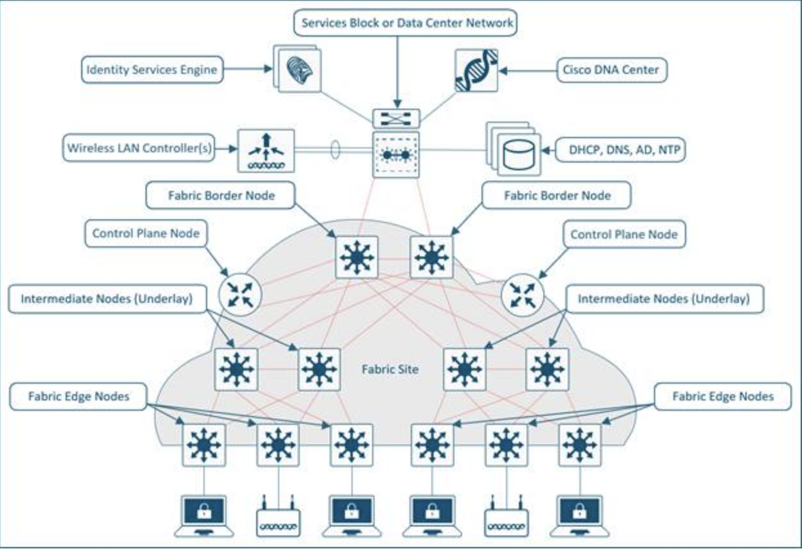

# Overlay Network
An overlay network is created on top of the underlay network through virtualization (virtual networks).  The data plane traffic and control plane signaling are contained within each virtualized network, maintaining isolation among the networks and an independence from the underlay network.  Multiple overlay networks can run across the same underlay network through virtualization.  In SD-Access, the user-defined overlay networks are provisioned as a virtual routing and forwarding (VRF) instances that provide separation of routing tables. 

SD-Access allows for the extension of Layer 2 and Layer 3 connectivity across the overlay through the services provided by through LISP.  Layer 2 overlay services emulate a LAN segment to transport Layer 2 frames by carrying a subnet over the Layer 3 underlay 

# Shared Services
Networks need some form of shared services that can be reused across multiple virtual networks.  It is important that those shared services are deployed correctly to preserve the isolation between different virtual networks accessing those services.  The use of a VRF-Aware Peer directly attached outside of the fabric provides a mechanism for route leaking of shared services prefixes across multiple networks, and the use of firewalls provides an additional layer of security and monitoring of traffic between virtual networks. Examples of shared services include:
    1. Wireless infrastructure—Radio frequency performance and cost efficiency is improved using common wireless LANs (single SSID) versus previous inefficient strategies of using multiple SSIDs to separate endpoint communication. Traffic isolation is achieved by assigning dedicated VLANs and using dynamic VLAN assignment using 802.1X authentication to map wireless endpoints into their corresponding VNs.

    2. DHCP, DNS, IP address management (IPAM), and Active Directory (AD)—The same set of infrastructure services can be reused if they have support for virtualized networks.  Special capabilities such as advanced DHCP scope selection criteria, multiple domains, and support for overlapping address space are some of the capabilities required to extend the services beyond a single network.

    3. Internet access—The same set of Internet firewalls can be used for multiple virtual networks. If firewall policies need to be unique for each virtual network, the use of a multi-context firewall is recommended.

    4. IP voice/video collaboration services—When IP phones and other unified communications devices are connected in multiple virtual networks, the call control signaling to the communications manager and the IP traffic between those devices needs to be able to traverse multiple VNs in the infrastructure.

    5. Servers and Critical Systems—NTP servers, Building Management Systems (BMS), network orchestrators, management appliances, support systems, administrative applications, databases, payroll systems, and other critical applications may be required for access by one or many virtual networks.  

# SD-Access Fabric Roles and Terminology
    1. Control Plane Node
    2. Edge Node
    3. Intermediate Node
    4. Border Node
    5. Fabric in a Box
    6. Extended Node
    7. Fabric WLC
    8. Fabric-Mode Access Point
    9. SD-Access Embedded Wireless
    10. Transit and Peer Networks
    11. Transit Control Plane Node
    12. Fabric Domain
    13. Fabric Site

# Overlay Network Design

In the SD-Access fabric, the overlay networks are used for transporting user traffic across the fabric. The fabric encapsulation also carries scalable group information used for traffic segmentation inside the overlay VNs.  Consider the following in the design when deploying virtual networks:

    1. Virtual Networks (Macro-segmentation)—Use virtual networks when requirements dictate isolation at both the data plane and control plane.  In general, if devices need to communicate with each other, they should be placed in the same virtual network.   If communication is required between different virtual networks, use an external firewall or other device to enable inter-VN communication. Virtual Network provides the same behavior and isolation as VRFs.

    2. SGTs (Micro-segmentation)—Segmentation using SGTs allows for simple-to-manage group-based policies and enables granular data plane isolation between groups of endpoints within a virtualized network.  Using SGTs also enables scalable deployment of policy without having to do cumbersome updates for these policies based on IP addresses.

    3. Reduce subnets and simplify DHCP management—In the overlay, IP subnets can be stretched across the fabric without flooding issues that can happen on large Layer 2 networks.  Use fewer subnets and DHCP scopes for simpler IP addressing and DHCP scope management.  Subnets are sized according to the services that they support, versus being constrained by the location of a gateway.  Enabling the optional broadcast flooding (Layer 2 flooding) feature can limit the subnet size based on the additional bandwidth and endpoint processing requirements for the traffic mix within a specific deployment.

    4. Avoid overlapping IP subnets—Different overlay networks can support overlapping address space, but be aware that most deployments require shared services across all VNs and some may use inter-VN communication.  Avoid overlapping address space so that the additional operational complexity of adding a network address translation (NAT) device is not required for shared services communication.

# This Playbooks is used to model data to create a fully deployable SDA Fabric site.
The Steps followed by this playbook are:
    1. Define User Roles and Access Policies
    2. ISE Integrations - Create CatC ISE Integration
    3. Design Site Hierarchy (Sites, Buildings and Floors)
    4. Define Device Credentials and Assign credentials to sites.
    5. Define Network Settings (NTP, SNMP, Syslog, IP Pools, DNS, DHCP, IPAM)
    6. IP Address Management - Create IP Address Pools, Assign IP Address Pools to Sites
    7. Define Network Profiles (Switching, Wireless, Assurance)
    8. Define and Run Discovery, Discover Devices
    9. Inventory Management - Update device details, roles, assigned devices to sites and provision devices
    10. Define and Run Provisioning, Provision Devices
    11. Create Fabric Sites and Fabric Zones
    12. Create Fabric Transits IP/SDA (BGP/LISP-PUBSUB)
    13. Create Virtual Network and associate VNs to sites
    14. Create L3 Gateways and L2 Vlans and assigne them to sites
    15. Add devices to Fabric and assign them to sites with roles and transits, L2/L3 Handoffs
    16. Onboard host Devices on fabric sites.
