# Catalyst Center Events and Notification Destination and Subscriptions Manager Playbook

## Events and Notification Overview

Catalyst Center platform supports the ability to send custom notifications when specific events are triggered. This is valuable for third-party systems that take business actions based upon event type. For example, when a device in the network is out of compliance, a custom application may want to receive notifications and execute a software upgrade action.

## This workflow manage the follow:
    Configure various types of destinations to deliver event notifications from Cisco Catalyst Center Platform.
    Configuring/Updating the Webhook destination details in Cisco Catalyst Center.
    Configuring/Updating the Email destination details in Cisco Catalyst Center.
    Configuring/Updating the Syslog destination details in Cisco Catalyst Center.
    Configuring/Updating the SNMP destination details in Cisco Catalyst Center.
    Configuring/Updating the ITSM Integration Settings in Cisco Catalyst Center.
    Create/Update Notification using the above destination in Cisco Catalyst Center.

## Prerequisites

Before starting, ensure the following requirements are met:
- **Ansible Installation**: Ansible must be installed on the machine managing the automation process.
- **Cisco DNA Ansible Collection**: The `cisco.dnac.eventes_and_notifications_workflow_manager` module must be available from the Cisco DNA Ansible Collection.
- **dnacentersdk Python SDK**: This SDK is required to interact with Cisco Catalyst Center.
- **Yamale Python Library**: The `yamale` Python library installed (`pip install yamale`)
- **Cisco DNA Center or Events and Notifications Connect Access**: Ensure access is configured

## Configure Environment
- Update hosts.yml with the connection details of your DNA Center instance. 

```bash
catalyst_center_hosts:
    hosts:
        catalyst_center220:
            catalyst_center_host: xx.xx.xx.xx.
            catalyst_center_password: XXXXXXXX
            catalyst_center_port: 443
            catalyst_center_timeout: 60
            catalyst_center_username: admin
            catalyst_center_verify: false
            catalyst_center_version: 2.3.7.6
            catalyst_center_debug: true
            catalyst_center_log_level: INFO
            catalyst_center_log: true
```

## Defining Events and Notifications Destination and Subscription Details
The events_notifications_destination_and_subscription_details section specifies the list of events, notification destinations and their configurations to be run through the playbooks.
To configure this, refer to the full workflow specification: [Ansible Galaxy - Events and Notifications Workflow Manager](https://galaxy.ansible.com/ui/repo/published/cisco/dnac/content/module/events_and_notifications_workflow_manager/).

## Overview of Events and Notifications Workflow with Example 

## 1. Create/Update EMAIL destination in Catalyst Center

This task demonstrates how to create or update an Email destination in Cisco Catalyst Center for event notifications.

### Example: Input (YAML)
```bash
---
catalyst_center_version: 2.3.7.6
catalyst_center_verify: false
events_notifications_destination_and_subscription_details:
  - email_destination:
      sender_email: "test@cisco.com"
      recipient_email: "demo@cisco.com"
      subject: "Ansible testing"
      primary_smtp_config:
        server_address: "outbound.cisco.com"
        port: "25"
        smtp_type: "DEFAULT"
      secondary_smtp_config:
        server_address: outbound.cisco.com
        port: "587"
        smtp_type: "TLS"
```

### Step 1: Execute events_and_notifications playbook

Run the following command to create/update the Email destination

```bash
ansible-playbook -i ./inventory/demo_lab/inventory_demo_lab.yml ./workflows/events_and_notifications/playbook/events_and_notifications_playbook.yml --extra-vars VARS_FILE_PATH=./../vars/events_and_notifications_destinations_inputs.yml -vvvv
```

#### Expected Outcome
The email destination will be created or updated successfully in Cisco Catalyst Center.

### Step 2: Verify the playbook output
 
Upon successful completion, you should see a message similar to:

``` yaml
"msg":  
    {
        "changed": true,
        "diff": [],
        "failed": false,
        "response": "Destination(s) '['Email destination']' updated successfully in Cisco Catalyst Center."
    }
```

### Step 3: Upon successful completion, Email destination will be created or updated in UI

To confirm that email destination has been created or updated, follow this step:

- Navigate to Systems -> Settings -> External Services -> Destinations then Select "Email" destination.

#### Reference Screenshots

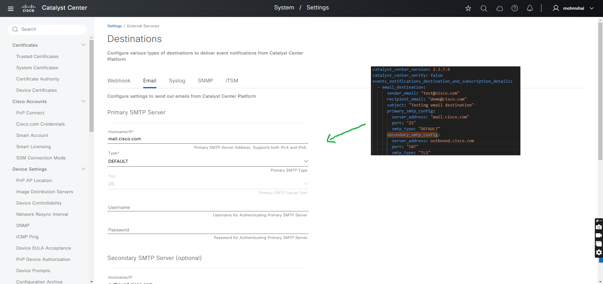

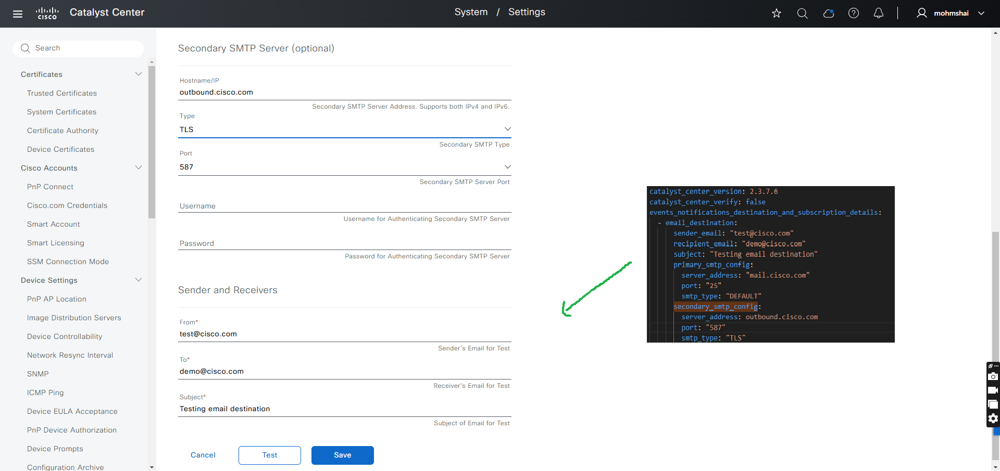

## 2. Create/Update Syslog destination in Catalyst Center

This task demonstrates how to create or update an Syslog destination in Cisco Catalyst Center for event notifications.

### Example: Input (YAML)
```bash
---
catalyst_center_version: 2.3.7.6
catalyst_center_verify: false
events_notifications_destination_and_subscription_details:
  - syslog_destination:
      name: Syslog test 100
      description: "Adding syslog destination"
      server_address: "10.20.0.30"
      protocol: "TCP"
      port: 6553
```

### Step 1: Execute events_and_notifications playbook

Run the following command to create/update the Syslog destination

```bash
ansible-playbook -i ./inventory/demo_lab/inventory_demo_lab.yml ./workflows/events_and_notifications/playbook/events_and_notifications_playbook.yml --extra-vars VARS_FILE_PATH=./../vars/events_and_notifications_destinations_inputs.yml -vvvv
```

#### Expected Outcome
Upon successful execution, the specified Syslog destination will be created or updated in Cisco Catalyst Center.

### Step 2: Verify the playbook output
 
Upon successful completion, you should see a message similar to:

``` yaml
"msg": 
    {
        "changed": true,
        "diff": [],
        "failed": false,
        "response": "Destination(s) '['Syslog test 100']' created successfully in Cisco Catalyst Center."
    }
```

### Step 3: Verify the Syslog Destination in the Catalyst Center UI

To ensure that syslog destination has been created or updated in Catalyst Center, follow this step:

- Navigate to Systems -> Settings -> External Services -> Destinations then Select "Syslog" destination.

Refrence Screenshot: Syslog Creation Success

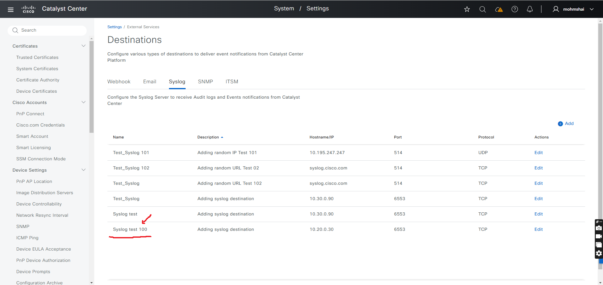

Refrence Screenshot: Syslog Details Updated 

Note: Screenshot below indicates that the event description and hostname/IP for 'Syslog test 100' have been updated.
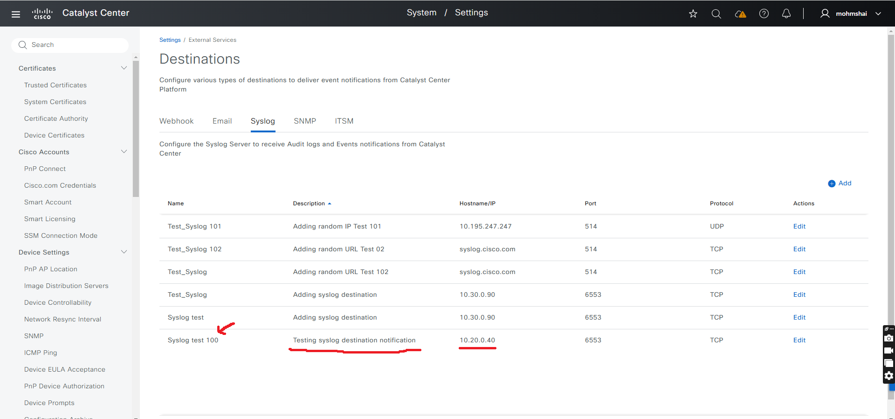

## 3. Create/Update Webhook destination in Catalyst Center

This task demonstrates how to create or update an Webhook destination in Cisco Catalyst Center for event notifications.

### Example: Input (YAML)
```bash
---
catalyst_center_version: 2.3.7.6
catalyst_center_verify: false
events_notifications_destination_and_subscription_details:
  - webhook_destination:
      name: webhook demo 110
      description: Webhook Demo Test SEEN-4890-01
      url: https://4.5.6.8/dnac_test_webhook
      method: POST
      trust_cert: false
      headers_list: # Wrap headers inside another key
        headers:
          - name: Header1
            value: Header_Value1
            encrypt: false
          - name: Header2
            value: Header_Value2
            encrypt: false
      is_proxy_route: false
  - webhook_destination:
      name: webhook demo 111
      description: Webhook Demo Test SEEN-4890-02
      url: https://webhook.cisco.com/dna_test_webhook
      method: PUT
      trust_cert: false
      is_proxy_route: true
```

### Step 1: Execute events_and_notifications playbook

Run the following command to create/update the Webhook destination

```bash
ansible-playbook -i ./inventory/demo_lab/inventory_demo_lab.yml ./workflows/events_and_notifications/playbook/events_and_notifications_playbook.yml --extra-vars VARS_FILE_PATH=./../vars/events_and_notifications_destinations_inputs.yml -vvvv
```

#### Expected Outcome
Upon successful execution, the specified Webhook destination will be created or updated in Cisco Catalyst Center.

### Step 2: Verify the playbook output
 
Upon successful completion, you should see a message similar to:

``` yaml
"msg": 
    {
        "changed": true,
        "diff": [],
        "failed": false,
        "response": "Destination(s) '['webhook demo 110', 'webhook demo 111']' created successfully in Cisco Catalyst Center."
    }
```

### Step 3: Verify the Webhook Destination in the Catalyst Center UI

To ensure that webhook destination has been created or updated in Catalyst Center, follow this step:

- Navigate to Systems -> Settings -> External Services -> Destinations then Select "Webhook" destination.

Refrence Screenshot: Webhook Creation Success

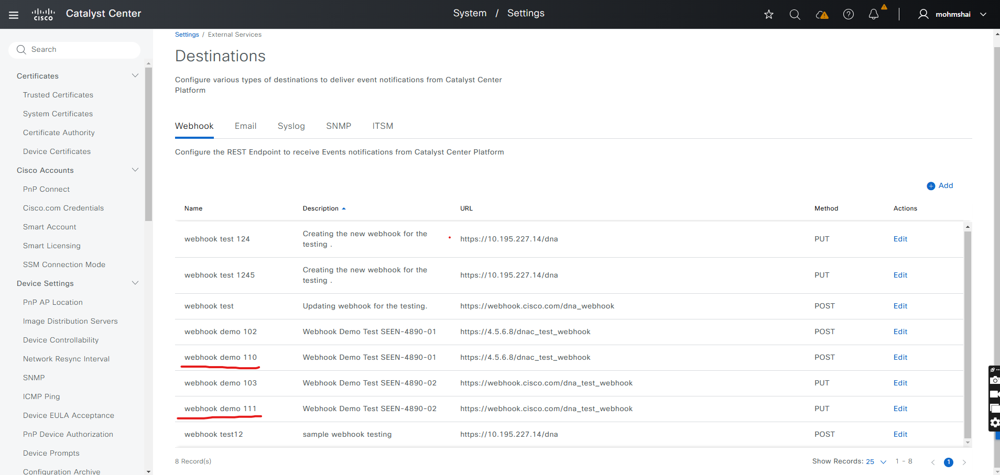

Refrence Screenshot: Webhook Details Updated

Note: Screenshot below indicates that the webhook description for 'webhook demo 110' and 'webhook demo 111' have been updated.
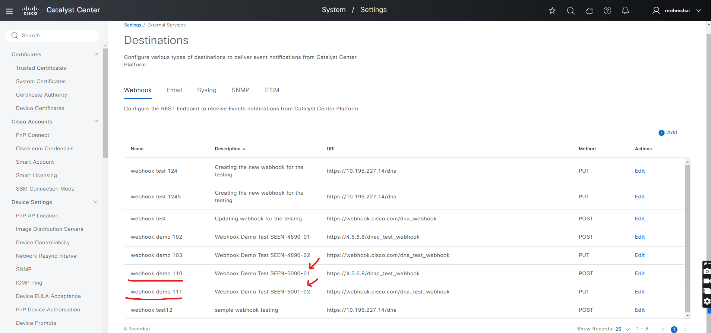

## 4. Create/Update SNMP destination in Catalyst Center

This task demonstrates how to create or update an SNMP destination in Cisco Catalyst Center for event notifications.

### Example: Input (YAML)
```bash
---
catalyst_center_version: 2.3.7.6
catalyst_center_verify: false
events_notifications_destination_and_subscription_details:
  - snmp_destination:
      name: SNMP
      description: Test Cisco SNMP
      server_address: 23.2.34.34
      port: 161
      snmp_version: V2C
      community: xxxxxxxx
  - snmp_destination:
      name: Snmp test new
      description: Adding snmp destination for testing V3
      server_address: 10.30.0.90
      port: 125
      snmp_version: V3
      username: xxxxx
      mode: AUTH_PRIVACY
      auth_type: SHA
      auth_password: xxxxxxxx
      privacy_type: AES128
      privacy_password: xxxxxxxx
```

### Step 1: Execute events_and_notifications playbook

Run the following command to create/update the SNMP destination

```bash
ansible-playbook -i ./inventory/demo_lab/inventory_demo_lab.yml ./workflows/events_and_notifications/playbook/events_and_notifications_playbook.yml --extra-vars VARS_FILE_PATH=./../vars/events_and_notifications_destinations_inputs.yml -vvvv
```

#### Expected Outcome
Upon successful execution, the specified SNMP destination will be created or updated in Cisco Catalyst Center.

### Step 2: Verify the playbook output
 
Upon successful completion, you should see a message similar to:

``` yaml
"msg": 
    {
        "changed": true,
        "diff": [],
        "failed": false,
        "response": "Destination(s) '['SNMP Testing', 'Snmp test new']' created successfully in Cisco Catalyst Center."
    }
```

### Step 3: Verify the SNMP Destination in the Catalyst Center UI

To ensure that SNMP destination has been created or updated in Catalyst Center, follow this step:

- Navigate to Systems -> Settings -> External Services -> Destinations then Select "SNMP" destination.

Refrence Screenshot: SNMP Creation Success

Note: Screenshot below indicates that the SNMP destination 'SNMP Testing' and 'Snmp test new' have been created.
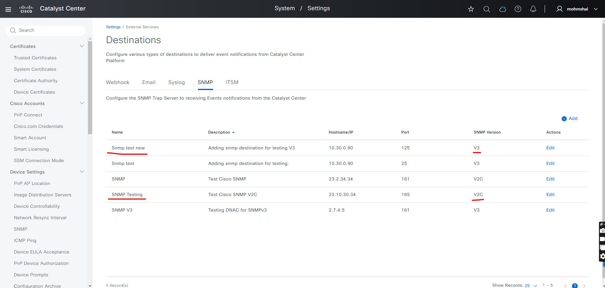

## 5. Create/Update ITSM destination in Catalyst Center

This task demonstrates how to create or update an ITSM destination in Cisco Catalyst Center for event notifications.

### Example: Input (YAML)
```bash
---
catalyst_center_version: 2.3.7.6
catalyst_center_verify: false
events_notifications_destination_and_subscription_details:
  - itsm_setting:
      instance_name: "Playbook itsm demo 01"
      description: "ITSM description for testing"
      connection_settings:
        url: "https://ventest1.service-now.com/"
        username: cisco123
        password: itsmcis11
  - itsm_setting:
      instance_name: "ITSM_Demo_test 02"
      description: "ITSM description for testing"
      connection_settings:
        url: "https://ventest2.service-now.com/"
        username: cisco111
        password: itsmcisco2
```

### Step 1: Execute events_and_notifications playbook

Run the following command to create/update the ITSM destination

```bash
ansible-playbook -i ./inventory/demo_lab/inventory_demo_lab.yml ./workflows/events_and_notifications/playbook/events_and_notifications_playbook.yml --extra-vars VARS_FILE_PATH=./../vars/events_and_notifications_destinations_inputs.yml -vvvv
```

#### Expected Outcome
Upon successful execution, the specified ITSM destination will be created or updated in Cisco Catalyst Center.

### Step 2: Verify the playbook output
 
Upon successful completion, you should see a message similar to:

``` yaml
"msg": 
    {
        "changed": true,
        "diff": [],
        "failed": false,
        "response": "Destination(s) '['Playbook itsm demo 01', 'ITSM_Demo_test 02']' created successfully in Cisco Catalyst Center."
    }
```

### Step 3: Verify the ITSM Destination in the Catalyst Center UI

To ensure that ITSM destination has been created or updated in Catalyst Center, follow this step:

- Navigate to Systems -> Settings -> External Services -> Destinations then Select "ITSM" destination.

Refrence Screenshot: ITSM Creation Success

Note: Screenshot below indicates that the ITSM destination 'Playbook itsm demo 01' and 'ITSM_Demo_test 02' have been created.
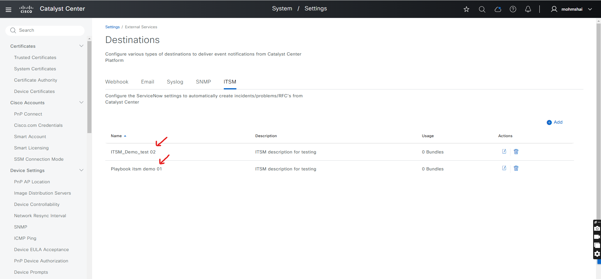

Refrence Screenshot: ITSM Details Updated

Note: Screenshot below indicates that the ITSM destination description for 'Playbook itsm demo 01' and 'ITSM_Demo_test 02' have been updated.
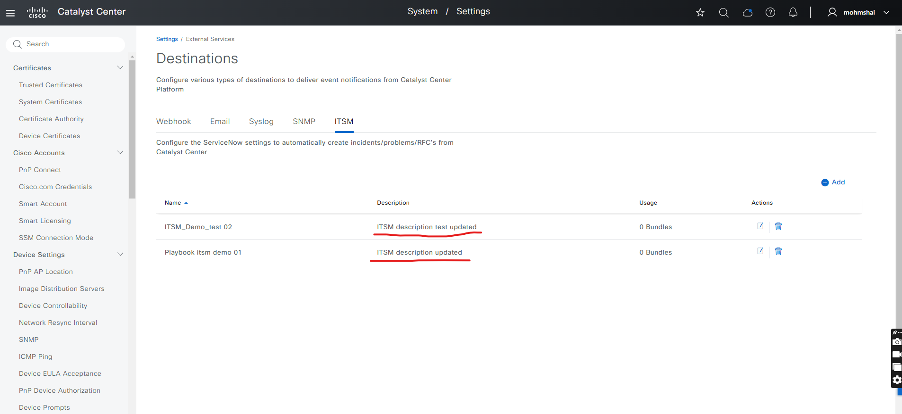

## 6. Create/Update Email Event Subscription in Catalyst Center

This task demonstrates how to create or update an Email Event Subsription in Cisco Catalyst Center.

### Example: Input (YAML)
```bash
---
catalyst_center_version: 2.3.7.6
catalyst_center_verify: false
events_notifications_destination_and_subscription_details:
  - email_event_notification:
      name: EMAIL Notification Testing
      description: Notification description for email subscription creation 01 Please ignore test
      sites:
        - Global/India/Bangalore/BLD_1
      events:
        - AP Flap
        - AP disconnected from WLC
      sender_email: catalyst@cisco.com
      recipient_emails:
        - noc@cisco.com
        - soc@cisco.com
        - mohmshai@cisco.com
      subject: Mail test
      instance: Email Instance test
      instance_description: Email Instance description 1
```

### Step 1: Execute events_and_notifications playbook

Run the following command to create/update the Email Event Subscription

```bash
ansible-playbook -i ./inventory/demo_lab/inventory_demo_lab.yml ./workflows/events_and_notifications/playbook/events_and_notifications_playbook.yml --extra-vars VARS_FILE_PATH=./../vars/events_and_notifications_destinations_inputs.yml -vvvv
```

#### Expected Outcome
Upon successful execution, the specified Email Event Subscription will be created or updated in Cisco Catalyst Center.

### Step 2: Verify the playbook output
 
Upon successful completion, you should see a message similar to:

``` yaml
"msg": 
    {
        "changed": true,
        "diff": [],
        "failed": false,
        "response": "Event subscription notification(s) '['EMAIL Notification Testing']' created successfully in Cisco Catalyst Center."
    }
```

### Step 3: Verify the Event subscription notification in the Catalyst Center UI

To ensure that Event subscription notification has been created or updated in Catalyst Center, follow this step:

- Navigate to Platform -> Developer ToolKit -> Event Notifications and then select Notifications

Reference Screenshot:

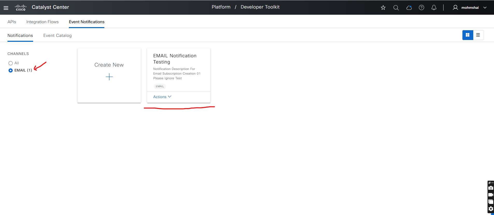

## 7. Create/Update Syslog Event Subscription in Catalyst Center

This task demonstrates how to create or update an Syslog Event Subsription in Cisco Catalyst Center.

### Example: Input (YAML)
```bash
---
catalyst_center_version: 2.3.7.6
catalyst_center_verify: false
events_notifications_destination_and_subscription_details:
  - syslog_event_notification:
      name: Syslog Notification 001
      description: Subscription for syslog events notification Test 001
      sites:
        - Global/India/Bangalore/BLD_1
        - Global/Bangladesh/Dhaka/Dhaka_Building/Administration20
      events:
        - AP Flap
        - AP Reboot Crash
        - AP disconnected from WLC
        - Switch Power Failure
      destination: Test_Syslog 101
```

### Step 1: Execute events_and_notifications playbook

Run the following command to create/update the Syslog Event Notification Subscription

```bash
ansible-playbook -i ./inventory/demo_lab/inventory_demo_lab.yml ./workflows/events_and_notifications/playbook/events_and_notifications_playbook.yml --extra-vars VARS_FILE_PATH=./../vars/events_and_notifications_destinations_inputs.yml -vvvv
```

#### Expected Outcome
Upon successful execution, the specified Syalog Event Notification Subscription will be created or updated in Cisco Catalyst Center.

### Step 2: Verify the playbook output
 
Upon successful completion, you should see a message similar to:

``` yaml
msg": 
    {
        "changed": true,
        "diff": [],
        "failed": false,
        "response": "Event subscription notification(s) '['Syslog Notification 001']' created successfully in Cisco Catalyst Center."
    }
```

### Step 3: Verify the Syslog subscription notification in the Catalyst Center UI

To ensure that Syslog subscription notification has been created or updated in Catalyst Center, follow this step:

- Navigate to Platform -> Developer ToolKit -> Event Notifications and then select Notifications

Reference Screenshot:

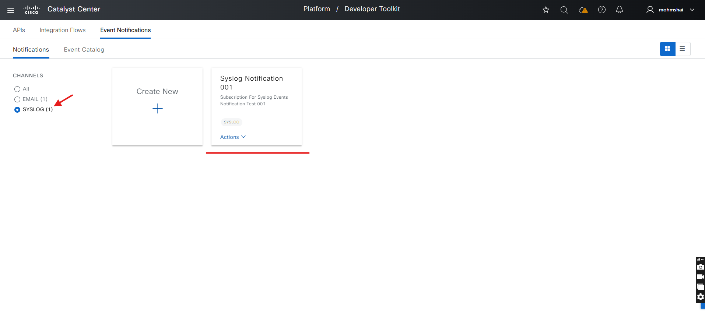

## 8. Create/Update Webhook Event Subscription in Catalyst Center

This task demonstrates how to create or update an Webhook Event Subsription in Cisco Catalyst Center.

### Example: Input (YAML)
```bash
---
catalyst_center_version: 2.3.7.6
catalyst_center_verify: false
events_notifications_destination_and_subscription_details:
  - webhook_event_notification:
      name: Webhook Notification SEEN-4890-02
      description: Notification for webhook events subscription 002
      sites:
        - Global/India/Bangalore/BLD_1
      events:
        - Add device failed
        - AP Coverage Hole
      destination: webhook demo 103
```

### Step 1: Execute events_and_notifications playbook

Run the following command to create/update the Webhook Event Notification Subscription

```bash
ansible-playbook -i ./inventory/demo_lab/inventory_demo_lab.yml ./workflows/events_and_notifications/playbook/events_and_notifications_playbook.yml --extra-vars VARS_FILE_PATH=./../vars/events_and_notifications_destinations_inputs.yml -vvvv
```

#### Expected Outcome
Upon successful execution, the specified Webhook Event Notification Subscription will be created or updated in Cisco Catalyst Center.

### Step 2: Verify the playbook output
 
Upon successful completion, you should see a message similar to:

``` yaml
"msg": 
    {
        "changed": true,
        "diff": [],
        "failed": false,
        "response": "Event subscription notification(s) '['Webhook Notification SEEN-4890-02']' created successfully in Cisco Catalyst Center."
    }
```

### Step 3: Verify the Webhook subscription notification in the Catalyst Center UI

To ensure that Webhook subscription notification has been created or updated in Catalyst Center, follow this step:

- Navigate to Platform -> Developer ToolKit -> Event Notifications and then select Notifications

Reference Screenshot:

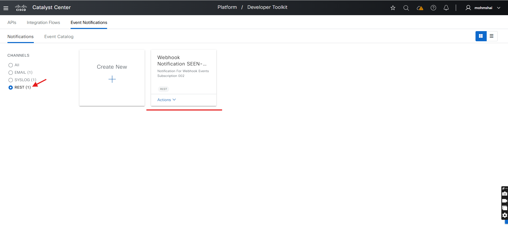

## 9. Delete Email Event Subscription in Catalyst Center

This task demonstrates how to delete a specific Webhook Event Subscription from Cisco Catalyst Center.

### Example: Input (YAML)
```bash
---
catalyst_center_version: 2.3.7.6
catalyst_center_verify: false
events_notifications_destination_and_subscription_details:
  - email_event_notification:
      name: EMAIL Notification Testing
      description: Notification description for email subscription creation 01 Please ignore test
      sites:
        - Global/India/Bangalore/BLD_1
      events:
        - AP Flap
        - AP disconnected from WLC
      sender_email: catalyst@cisco.com
      recipient_emails:
        - noc@cisco.com
        - soc@cisco.com
        - mohmshai@cisco.com
      subject: Mail test
      instance: Email Instance test
      instance_description: Email Instance description 1
```

### Step 1: Execute events_and_notifications playbook

Run the following command to delete the Email Event Notification Subscription

```bash
ansible-playbook -i ./inventory/demo_lab/inventory_demo_lab.yml ./workflows/events_and_notifications/playbook/delete_events_and_notifications_playbook.yml --extra-vars VARS_FILE_PATH=./../vars/delete_events_and_notifications_destinations_inputs.yml -vvvv
```

#### Expected Outcome
Upon successful execution, the specified Webhook Event Notification Subscription will be removed from Cisco Catalyst Center.

### Step 2: Verify the playbook output
 
Upon successful completion, you should see a message similar to:

``` yaml
"msg": 
    {
        "changed": true,
        "diff": [],
        "failed": false,
        "response": "Events subscription notification(s) '['EMAIL Notification Testing']' deleted successfully from the Cisco Catalyst Center."
    }
```

### Step 3: Verify the Email subscription notification in the Catalyst Center UI

To ensure that Email subscription notification has been deleted in Catalyst Center, follow this step:

- Navigate to Platform -> Developer ToolKit -> Event Notifications and then select Notifications

Reference Screenshot: 

Note: Note: Ensure that specific Email Subscription Event Notification presents in Catalyst Centert:
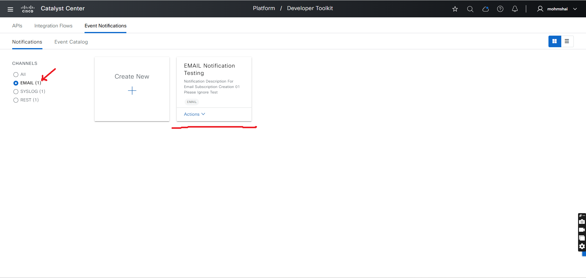

Note: After executing the delete_events_and_notifications playbook, verify the deletion of the Email Event Subscription:
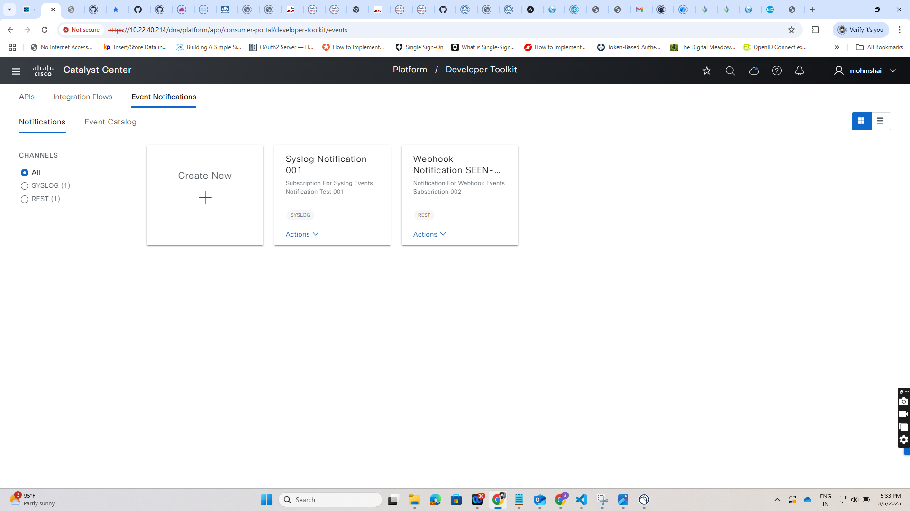

## 10. Delete Syslog Event Subscription in Catalyst Center

This task demonstrates how to delete a specific Syslog Event Subscription from Cisco Catalyst Center.

### Example: Input (YAML)
```bash
---
catalyst_center_version: 2.3.7.6
catalyst_center_verify: false
events_notifications_destination_and_subscription_details:
  - syslog_event_notification:
      name: Syslog Notification 001
      description: Subscription for syslog events notification Test 001
      sites:
        - Global/India/Bangalore/BLD_1
        - Global/Bangladesh/Dhaka/Dhaka_Building/Administration20
      events:
        - AP Flap
        - AP Reboot Crash
        - AP disconnected from WLC
        - Switch Power Failure
      destination: Test_Syslog 101
```

### Step 1: Execute events_and_notifications playbook

Run the following command to delete the Syslog Event Notification Subscription

```bash
ansible-playbook -i ./inventory/demo_lab/inventory_demo_lab.yml ./workflows/events_and_notifications/playbook/delete_events_and_notifications_playbook.yml --extra-vars VARS_FILE_PATH=./../vars/delete_events_and_notifications_destinations_inputs.yml -vvvv
```

#### Expected Outcome
Upon successful execution, the specified Syslog Event Notification Subscription will be removed from Cisco Catalyst Center.

### Step 2: Verify the playbook output
 
Upon successful completion, you should see a message similar to:

``` yaml
"msg": 
    {
        "changed": true,
        "diff": [],
        "failed": false,
        "response": "Events subscription notification(s) '['Syslog Notification 001']' deleted successfully from the Cisco Catalyst Center."
    }
```

### Step 3: Verify the Syslog subscription notification in the Catalyst Center UI

To ensure that Syslog subscription notification has been deleted in Catalyst Center, follow this step:

- Navigate to Platform -> Developer ToolKit -> Event Notifications and then select Notifications

Reference Screenshot: 

Note: Note: Ensure that specific Syslog Subscription Event Notification presents in Catalyst Center
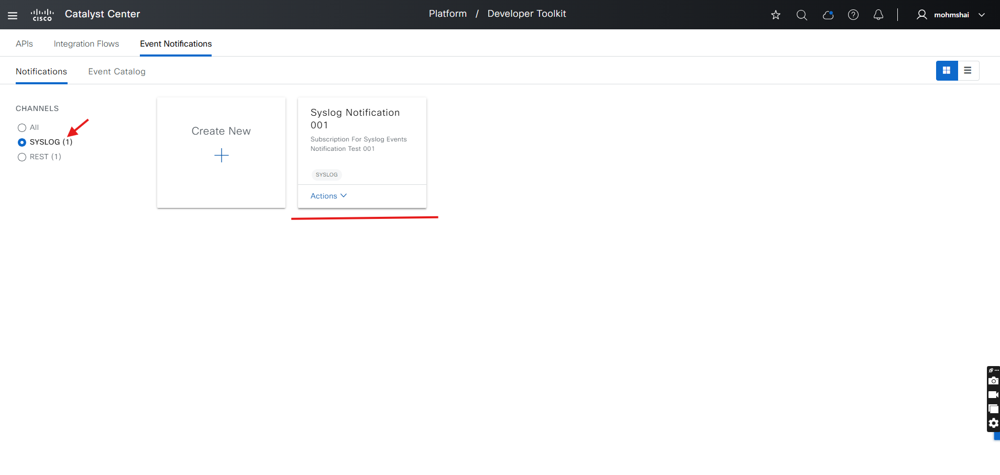

Note: After executing the delete_events_and_notifications playbook, verify the deletion of the Email Event Subscription:
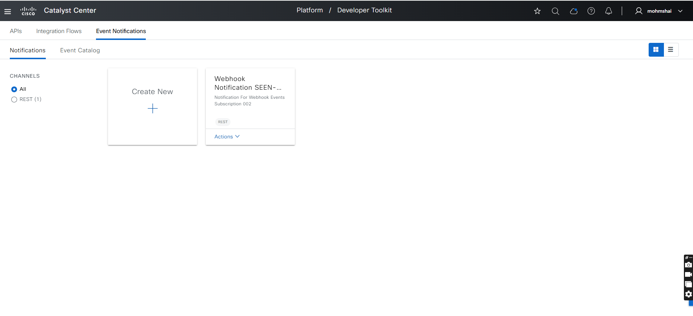

## 11. Delete Webhook Event Subscription in Catalyst Center

This task demonstrates how to delete a specific Webhook Event Subscription from Cisco Catalyst Center.

### Example: Input (YAML)
```bash
---
catalyst_center_version: 2.3.7.6
catalyst_center_verify: false
events_notifications_destination_and_subscription_details:
  - webhook_event_notification:
      name: Webhook Notification SEEN-4890-02
      description: Notification for webhook events subscription 002
      sites:
        - Global/India/Bangalore/BLD_1
      events:
        - Add device failed
        - AP Coverage Hole
      destination: webhook demo 103
```

### Step 1: Execute events_and_notifications playbook

Run the following command to delete the Syslog Event Notification Subscription

```bash
ansible-playbook -i ./inventory/demo_lab/inventory_demo_lab.yml ./workflows/events_and_notifications/playbook/delete_events_and_notifications_playbook.yml --extra-vars VARS_FILE_PATH=./../vars/delete_events_and_notifications_destinations_inputs.yml -vvvv
```

#### Expected Outcome
Upon successful execution, the specified Webhook Event Notification Subscription will be removed from Cisco Catalyst Center.

### Step 2: Verify the playbook output
 
Upon successful completion, you should see a message similar to:

``` yaml
"msg": 
    {
        "changed": true,
        "diff": [],
        "failed": false,
        "response": "Events subscription notification(s) '['Webhook Notification SEEN-4890-02']' deleted successfully from the Cisco Catalyst Center."
    }
```

### Step 3: Verify the Webhook Subscription Notification in the Catalyst Center UI

To ensure that Webhook subscription notification has been deleted in Catalyst Center, follow this step:

- Navigate to Platform -> Developer ToolKit -> Event Notifications and then select Notifications

Reference Screenshot: 

Note: Ensure that specific Webhook Subscription Event Notification presents in Catalyst Center
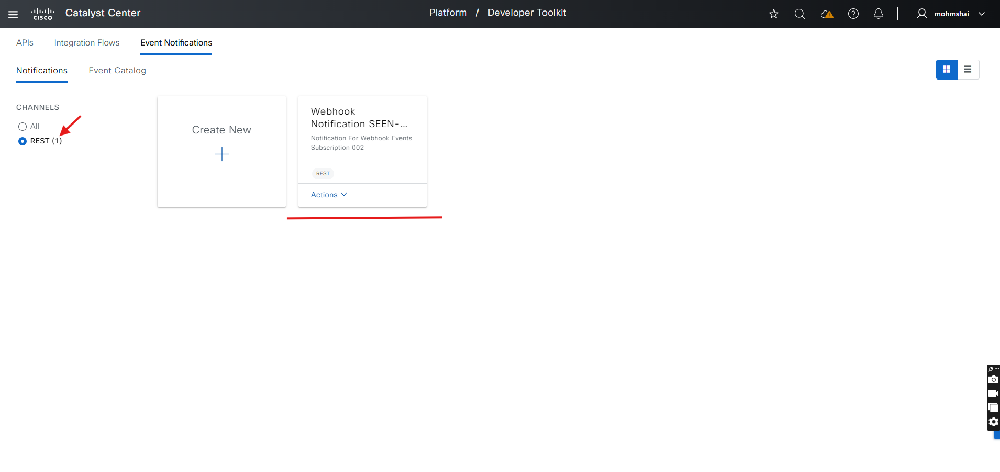

Note: After executing the delete_events_and_notifications playbook, verify the deletion of the Email Event Subscription:
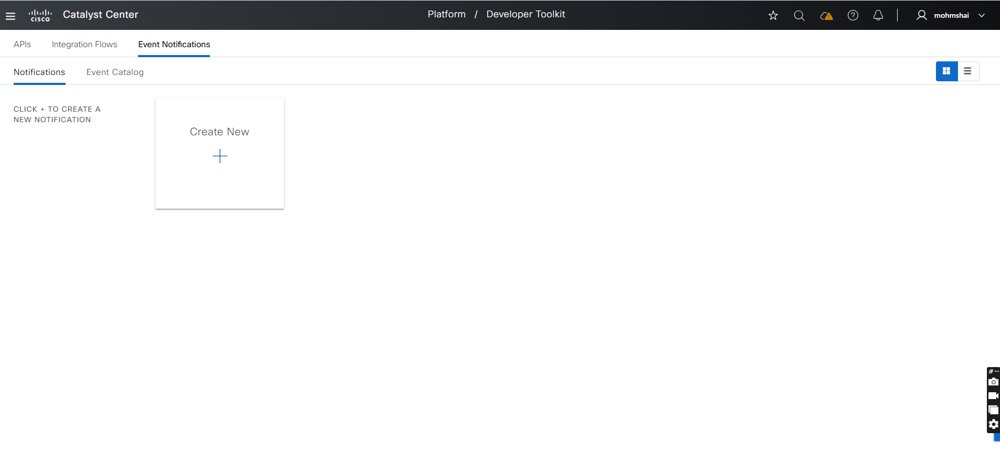

## How to Validate Input
Playbook: workflows/events_and_notifications/playbook/events_and_notifications_playbook.yml
Inputs: workflows/events_and_notifications/vars/events_and_notifications_destinations_inputs.yml
* Use `yamale`:

```bash
yamale -s workflows/events_and_notifications/schema/events_and_notifications_schema.yml workflows/events_and_notifications/vars/events_and_notifications_destinations_inputs.yml 
```

## How to Run

* Execute the Ansible Playbook to add, update, destination and events subscriptions:
```bash
    ansible-playbook -i host_inventory_dnac1/hosts.yml workflows/events_and_notifications/playbook/events_and_notifications_playbook.yml --e VARS_FILE_PATH=../vars/events_and_notifications_destinations_inputs.yml
```

##  Important Notes
* Always refer to the detailed input specification for comprehensive information on available options and their structure.

## References

```yaml
  ansible: 9.9.0
  ansible-core: 2.16.10
  ansible-runner: 2.4.0

  dnacentersdk: 2.8.3
  cisco.dnac: 6.29.0
  ansible.utils: 5.1.2
```
