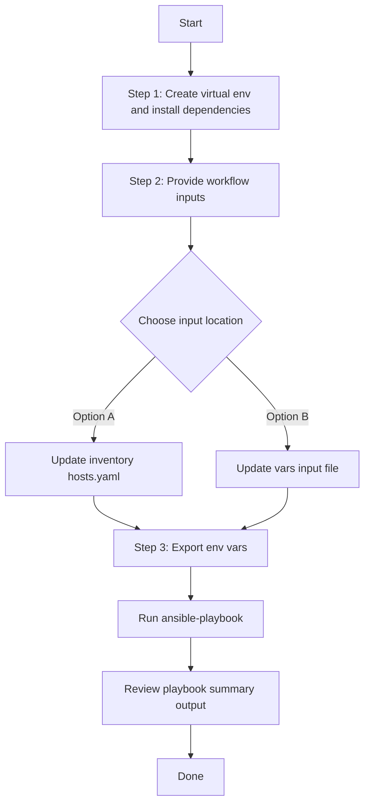

# Events and Notifications Config Generator

## Table of Contents

- [User Flow (3 Steps)](#user-flow-3-steps)

- [Overview](#overview)
- [Features](#features)
- [Prerequisites](#prerequisites)
- [Workflow Structure](#workflow-structure)
- [Schema Parameters](#schema-parameters)
- [Getting Started](#getting-started)
- [Operations](#operations)
- [Examples](#examples)

---

## Overview

The Events and Notifications config generator automates YAML playbook generation for destinations, subscriptions, and ITSM integration settings in Cisco Catalyst Center. It generates output compatible with `events_and_notifications_workflow_manager`.

---

## Features

- **Configuration Generation**: Generate YAML configurations compatible with `events_and_notifications_workflow_manager`.
  - Extract destinations, event subscriptions, and ITSM settings.
  - Resolve output into workflow-manager-ready YAML.
  - Reuse generated files for backup, migration, and audit.
- **Component Filtering**: Generate specific destination and notification component types.
- **Name-based Filters**: Filter by destination names, subscription names, and ITSM instance names.
- **Flexible Output**: Supports custom `file_path` and `file_mode` (`overwrite` / `append`).
- **Brownfield Discovery**: Omit `config` (or use workflow convenience flag) to generate all supported data.

---

## Prerequisites

### Software Requirements

| Component | Version |
|-----------|---------|
| Ansible | 2.13+ |
| cisco.dnac collection | 6.44.0+ |
| Python | 3.9+ |
| Cisco Catalyst Center | 2.3.5.3+ |
| dnacentersdk | 2.7.2+ |

### Required Collections

```bash
ansible-galaxy collection install cisco.dnac
ansible-galaxy collection install ansible.utils
pip install dnacentersdk
pip install yamale
```

### Access Requirements

- Catalyst Center credentials with events and notifications API access
- Network connectivity to Catalyst Center
- Existing destination/subscription/ITSM data (for targeted export use cases)

---

## Workflow Structure

```
events_and_notifications_config_generator/
├── playbook/
│   └── events_and_notifications_config_generator.yml   # Main operations
├── vars/
│   └── events_and_notifications_config_inputs.yml      # Input examples
├── schema/
│   └── events_and_notifications_config_schema.yml      # Input validation
└── README.md
```

---

## Schema Parameters

### Basic Configuration

| Parameter | Type | Required | Default | Description |
|-----------|------|----------|---------|-------------|
| `config` | dict | No | omitted | Module `config` dict. Wraps `component_specific_filters`. When omitted, all 8 component types are generated |
| `file_path` | string | No | auto-generated | Output file path for generated YAML. Format when auto-generated: `events_and_notifications_playbook_config_<YYYY-MM-DD_HH-MM-SS>.yml` |
| `file_mode` | string | No | `overwrite` | File write mode: `overwrite` or `append` |
| `component_specific_filters` | dict | No | omitted | Legacy convenience key. Equivalent to `config.component_specific_filters` |

### Supported Components

- `webhook_destinations`
- `email_destinations`
- `syslog_destinations`
- `snmp_destinations`
- `itsm_settings`
- `webhook_event_notifications`
- `email_event_notifications`
- `syslog_event_notifications`

### Additional Filter Blocks

- `destination_filters`
  - `destination_names`
  - `destination_types`: `webhook`, `email`, `syslog`, `snmp`
- `notification_filters`
  - `subscription_names`
  - `notification_types`: `webhook`, `email`, `syslog`
- `itsm_filters`
  - `instance_names`

---

## Getting Started

## Workflow Steps
## User Flow (3 Steps)



### Installation and Run (Aligned)

1. Create and activate a Python virtual environment, then install dependencies.

```bash
python3 -m venv .venv
source .venv/bin/activate
pip install -r requirements.txt
ansible-galaxy collection install cisco.dnac --force
```

2. Provide workflow inputs in either inventory (`inventory/demo_lab/hosts.yaml`) or the workflow `vars/` file.

3. Export Catalyst Center environment variables and run the playbook.

```bash
export HOSTIP=<catalyst-center-ip-or-fqdn>
export CATALYST_CENTER_USERNAME=<username>
export CATALYST_CENTER_PASSWORD='<password>'
ansible-playbook -i ./inventory/demo_lab/hosts.yaml ./workflows/events_and_notifications_config_generator/playbook/events_and_notifications_config_generator.yml -vvvv
```


## Operations

### Generate Operations (state: gathered)

The playbook resolves the module `config` parameter using a 3-level priority chain:

> **Priority 1 — `config:` key (preferred):** Pass the module config dict directly.
> **Priority 2 — `component_specific_filters:` key (legacy):** Convenience shorthand; auto-wrapped into `{component_specific_filters: ...}`.
> **Priority 3 — neither provided:** `config` is omitted; module retrieves all 8 component types.

#### 1. Generate all events and notifications data

Omit both `config` and `component_specific_filters` to trigger full discovery:

```yaml
events_and_notifications_config:
  - file_path: "/tmp/events_all_config.yml"
```

**Validate:**
```bash
./tools/validate.sh \
  -s workflows/events_and_notifications_config_generator/schema/events_and_notifications_config_schema.yml \
  -d workflows/events_and_notifications_config_generator/vars/events_and_notifications_config_inputs.yml
```

**Execute:**
```bash
ansible-playbook -i inventory/demo_lab/hosts.yaml \
  workflows/events_and_notifications_config_generator/playbook/events_and_notifications_config_generator.yml \
  --extra-vars VARS_FILE_PATH=../vars/events_and_notifications_config_inputs.yml
```

#### 2. Generate selected destination component types

Use `config.component_specific_filters` with `components_list` and `destination_filters`.

#### 3. Generate selected subscription component types

Use `config.component_specific_filters` with `components_list` and `notification_filters`.

#### 4. Generate ITSM settings by instance name

Use `config.component_specific_filters` with `components_list: ["itsm_settings"]` and `itsm_filters.instance_names`.

---

## Examples

### Example 1: Generate all events and notifications configurations

Omit `config` and `component_specific_filters` — module retrieves all 8 component types.

```yaml
events_and_notifications_config:
  - file_path: "/tmp/events_and_notifications_complete_config.yml"
```

### Example 2: Filter destination components (using `config:` key)

```yaml
events_and_notifications_config:
  - file_path: "/tmp/events_notifications_destinations.yml"
    config:
      component_specific_filters:
        components_list: ["webhook_destinations", "email_destinations"]
        destination_filters:
          destination_names: ["my-webhook-1", "ops-email-destination"]
          destination_types: ["webhook", "email"]
```

### Example 3: Filter event subscription components (using `config:` key)

```yaml
events_and_notifications_config:
  - file_path: "/tmp/events_notifications_subscriptions.yml"
    config:
      component_specific_filters:
        components_list: ["webhook_event_notifications", "email_event_notifications"]
        notification_filters:
          subscription_names: ["Critical Alerts"]
          notification_types: ["webhook"]
```

### Example 4: ITSM settings filter with append mode

```yaml
events_and_notifications_config:
  - file_path: "/tmp/events_notifications_itsm.yml"
    file_mode: append
    config:
      component_specific_filters:
        components_list: ["itsm_settings"]
        itsm_filters:
          instance_names:
            - "ServiceNow-Prod"
            - "BMC-Remedy"
```

### Example 5: Combined filters (destinations + notifications + ITSM)

```yaml
events_and_notifications_config:
  - file_path: "/tmp/events_notifications_combined.yml"
    config:
      component_specific_filters:
        components_list:
          - "webhook_destinations"
          - "email_destinations"
          - "webhook_event_notifications"
          - "email_event_notifications"
          - "itsm_settings"
        destination_filters:
          destination_names: ["prod-webhook"]
          destination_types: ["webhook"]
        notification_filters:
          subscription_names: ["Critical Alerts"]
          notification_types: ["webhook"]
        itsm_filters:
          instance_names: ["ServiceNow-Prod"]
```

### Example 6: Legacy `component_specific_filters` key (equivalent to Example 2)

```yaml
events_and_notifications_config:
  - file_path: "/tmp/events_notifications_legacy.yml"
    component_specific_filters:
      components_list: ["syslog_destinations", "snmp_destinations"]
```

---

## Notes

- Module `config` parameter is resolved by this workflow using a 3-level priority chain:
  1. `item.config` — preferred; pass the module config dict directly
  2. `item.component_specific_filters` — legacy convenience key; auto-wrapped into `{component_specific_filters: ...}`
  3. Neither provided — `config` is omitted; module generates all 8 component types
- When filter blocks (`destination_filters`, `notification_filters`, `itsm_filters`) are supplied, the module auto-adds the corresponding components to `components_list` if not already present.
- Generated YAML files contain `***REDACTED***` placeholders for passwords.
