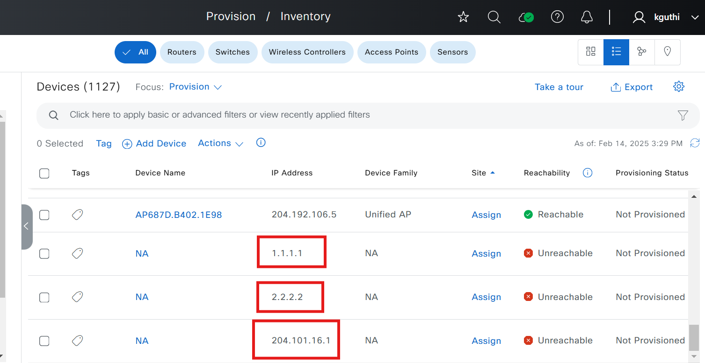
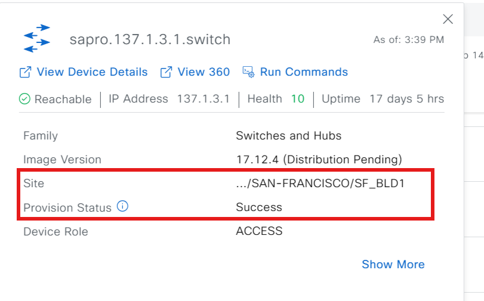
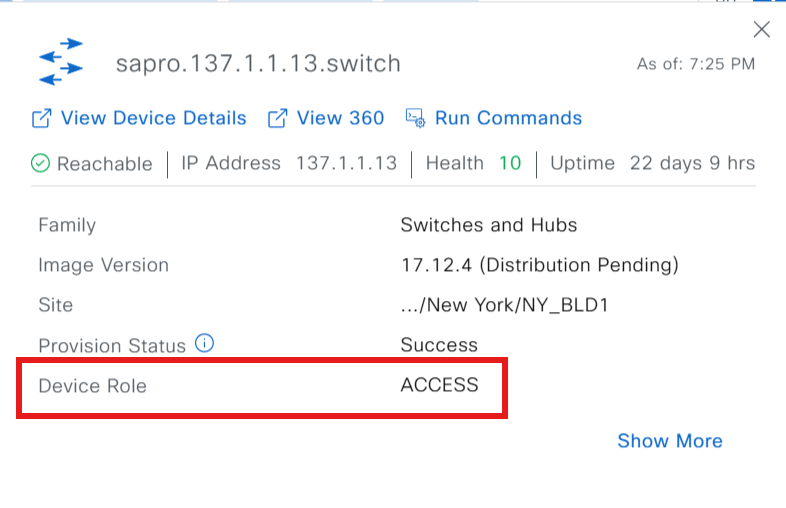

# Ansible Workflow: Inventory Workflow Manager

This Ansible workflow automates various inventory management tasks within your network, streamlining device and port configuration.

inventory_details defines the list of devices and their details to be processed by the playbooks.

This workflow playbook is used for adding devices, assigning devices to sites, provisioning, updating devices, resyncing and rebooting devices, changing device roles, and deleting devices from the inventory.

## Detailed Input Spec

Refer to: [https://galaxy.ansible.com/ui/repo/published/cisco/dnac/content/module/inventory_workflow_manager/](https://galaxy.ansible.com/ui/repo/published/cisco/dnac/content/module/inventory_workflow_manager/)

## Inventory Description

### Main Tasks

* Add User-Defined Fields to a Device
* Add Network Device
* Change the Device Role in inventory
* Update Computed Device Credentials
* Update a Device's Management IP Address
* Update the Device Polling Interval
* Delete a Network Device
* Manage Port Details
* Provision Device (assign devices to sites and provision wired and wireless devices)
* Resync and reboot the devices
* Manage Port Details
* **To manage the port's admin status:**
    * **Port Shut:** To shut down the port and change its admin status to Down.
    * **Port No Shut:** To enable the port.
    * **Clear MAC Address:** To clear the port's MAC address.
    * To activate an error-disabled port, clear the MAC address and shut down the port.

* **To edit certain port details (port description, Access VLAN, Voice VLAN), use the following:**

| Name         | Description                                                                                                                                                              |
|--------------|--------------------------------------------------------------------------------------------------------------------------------------------------------------------------|
| Access VLAN  | Provide access VLAN to assign to the port. (Cannot update access VLAN for ports with two preconfigured access VLANs)                                                  |
| Voice VLAN   | Provide a voice VLAN                                                                                                                               |
| Port Description | Enter or modify the port description. Delete the description by providing an empty port description.                                                                      |


## How to Validate Input

* Use `yamale`:

```bash
yamale -s workflows/inventory/schema/inventory_schema.yml workflows/inventory/vars/inventory_vars.yml 
Validating /Users/pawansi/dnac_ansible_workflows/workflows/inventory/vars/inventory_vars.yml...
Validation success! 👍
```

# Procedure
1. ## Prepare your Ansible environment:

Install Ansible if you haven't already
Ensure you have network connectivity to your Catalyst Center instance.
Checkout the project and playbooks: git@github.com:cisco-en-programmability/catalyst-center-ansible-iac.git

2. ## Configure Host Inventory:

The host_inventory_dnac1/hosts.yml file specifies the connection details (IP address, credentials, etc.) for your Catalyst Center instance.
Make sure the dnac_version in this file matches your actual Catalyst Center version.
##The Sample host_inventory_dnac1/hosts.yml

```bash
catalyst_center_hosts:
    hosts:
        catalyst_center220:
            dnac_host: xx.xx.xx.xx.
            dnac_password: XXXXXXXX
            dnac_port: 443
            dnac_timeout: 60
            dnac_username: admin
            dnac_verify: false
            dnac_version: 2.3.7.6
            dnac_debug: true
            dnac_log_level: INFO
            dnac_log: true
```
## Description of Vars in `hosts.yml`

    - **dnac_host**: IP address of the Catalyst Center.  
    - **dnac_username**: Catalyst Center login username.  
    - **dnac_password**: Catalyst Center login password.  
    - **dnac_version**: Catalyst Center version.  
    - **dnac_port**: Port number to which Catalyst Center listens.  
    - **dnac_timeout**: Timeout for API requests made to Catalyst Center.  
    - **dnac_verify**: Indicates whether to verify the SSL certificate of Catalyst Center.  
    - **dnac_debug**: Enables or disables debug mode.  
    - **dnac_log**: Enables or disables logging for Catalyst Center. 

3. ## Define Playbook input:

The workflow/inventory/vars/inventory_vars.yaml file stores the device details you want to add to catalyst center.
Refer to the full workflow specification for detailed instructions on the available options and their structure: https://galaxy.ansible.com/ui/repo/published/cisco/dnac/content/module/inventory_workflow_manager/

4. ## How to Run the playbooks

Execute: Execute the playbooks with your inputs and Inventory, specify your input file using the --e variable VARS_FILE_PATH

## A. To execute the Ansible playbook for adding devices:

* This task adds new devices to Cisco Catalyst Center. It allows you to specify multiple devices using a list of IP addresses and configure parameters such as device type, connection method, credentials, and SNMP information.
* The below sample playbook will be used for adding 3 devices to the inventory.
```bash
catalyst_center_version: 2.3.7.6
inventory_details:
  network_devices:
  - ip_address_list: ["XX.XX.XX.XX", "XX.XX.XX.XX", "XX.XX.XX.XX"]
    cli_transport: ssh
    compute_device: False
    password: Test@123
    enable_password: Test@1234
    extended_discovery_info: test
    http_username: "testuser"
    http_password: "test"
    http_port: "443"
    http_secure: False
    netconf_port: 830
    snmp_auth_passphrase: "Lablab@12"
    snmp_auth_protocol: SHA
    snmp_mode: AUTHPRIV
    snmp_priv_passphrase: "Lablab@123"
    snmp_priv_protocol: AES256
    snmp_retry: 3
    snmp_timeout: 5
    snmp_username: v3Public
    snmp_version: v3
    type: NETWORK_DEVICE
    username: cisco
```
* After the successful execution you will get the below message.
"device(s) 'XX.XX.XX.XX', 'XX.XX.XX.XX', 'XX.XX.XX.XX' added successfully in Cisco Catalyst Center."
* verify the devices are successfully added to the inventory and present in the Cisco Catalyst Center.



* Sample run line command to run the add devices Playbook:
```bash
    ansible-playbook -i host_inventory_dnac1/hosts.yml workflows/inventory/playbook/inventory_playbook.yml --e VARS_FILE_PATH=../vars/inventory_vars.yml -vvvvv
```

## B. To execute the Ansible playbook for provision devices:

* This task provisions wired devices in the Cisco DNA Center inventory. Provisioning involves assigning devices to a specific site and applying the necessary configurations for them to operate within that site's network environment.
* The below sample playbook will provision the 2 devices to its respective sites.
* We can provision multiple devices and the provisioning of multiple devices will do in parallel.
```bash
catalyst_center_version: 2.3.7.6
inventory_details:
  network_devices:
    - provision_wired_device:
      - device_ip: XX.XX.XX.XX
        site_name: Global/USA/SAN-FRANCISCO/SF_BLD1
        resync_retry_count: 200
        resync_retry_interval: 2
      - device_ip: XX.XX.XX.XX
        site_name: Global/USA/SAN JOSE/SJ_BLD23
        resync_retry_count: 200
        resync_retry_interval: 2
```
* After the successful execution you will get the below message.
"device(s) 'XX.XX.XX.XX', 'XX.XX.XX.XX' provisioned successfully in Cisco Catalyst Center."
* verify the devices provision status in the Cisco Catalyst Center and it will show provision status as success. Before provision it will show Not Provisioned.



*  Sample run line command for running the Provision Playbook:
```bash
    ansible-playbook -i host_inventory_dnac1/hosts.yml workflows/inventory/playbook/inventory_playbook.yml --e VARS_FILE_PATH=../vars/inventory_provision_devices.yml -vvvvv
```

## C. To execute the Ansible playbook for resync and reboot devices:
* Resync - This task resynchronizes network devices with Cisco Catalyst to ensure their configuration and status in Catalyst match their actual state in the network. The resync process ensures that the device’s configuration and status in Catalyst are updated to reflect its actual state in the network. Resync is commonly used to address discrepancies between Catalyst and device configurations.
* The below sample playbook will be used for resync.
* If force_sync is true then device sync would run in high priority thread if available, else the sync will fail.
```bash
catalyst_center_version: 2.3.7.6
# This file contains the variables for the inventory workflow
inventory_details:
  network_devices:
  - ip_address_list: ["XX.XX.XX.XX","XX.XX.XX.XX"]
    device_resync: True
    # Make this True if you want to force resync the device
    force_sync: False
    resync_retry_count: 200
    resync_interval: 2
```
* After the successful execution you will get the below message.
"Device(s) '['XX.XX.XX.XX', 'XX.XX.XX.XX']' have been successfully resynced in the inventory in Cisco Catalyst Center."

* Reboot - This task initiates a reboot of specified network devices using the Cisco Catalyst inventory manager. Device reboots are often necessary after configuration changes, updates, or troubleshooting procedures to ensure that the devices properly apply new settings for the access point Devices.
* The below sample playbook for Reboot AP Devices with IP Addresses.
```bash
catalyst_center_version: 2.3.7.6
# This file contains the variables for the inventory workflow
inventory_details:
  network_devices:
  - ip_address_list: ["XX.XX.XX.XX","XX.XX.XX.XX"]
    reboot_device: True
```
* After the successful execution you will get the below message.
"msg: AP Device(s) XX.XX.XX.XX, XX.XX.XX.XX successfully rebooted!"
*  To run the Resync/Reboot Playbook:
```bash
    ansible-playbook -i host_inventory_dnac1/hosts.yml workflows/inventory/playbook/inventory_playbook.yml --e VARS_FILE_PATH=../vars/inventory_resync_reboot_vars.yml -vvvvv
```
* **NOTE - reboot will work for only AP devices, where resync will work for all the devices.**

## D. To execute the Ansible playbook for changing Device roles:
* This task updates the role of existing devices in the Cisco Catalyst Center inventory. The role of a device helps categorize its function within the network (e.g., as an access, distribution, or core).
* The below playbook will be used for changing device roles. It will support multiple devices.
```bash
catalyst_center_version: 2.3.7.6
inventory_details:
  network_devices:
  - ip_address_list: ["XX.XX.XX.XX", "XX.XX.XX.XX"]
    role: ACCESS
```
* After the successful execution you will get the below message.
"msg": "Device(s) '['XX.XX.XX.XX', 'XX.XX.XX.XX']' role updated successfully to '['ACCESS', 'ACCESS']'"
* Verify the device role in the cisco catalyst center.




## D. To execute the Ansible playbook for deleting devices:
* This task deletes specific devices from the Cisco Catalyst inventory using their IP addresses. You can control whether the device's configuration is retained or removed upon deletion, depending on your network management needs.
*  The below playbook will be used for deleting devices/provisioned devices from the inventory.
* If clean_config set to true it will delete the Provisioned device by clearing current configuration.
```bash
catalyst_center_version: 2.3.7.6
inventory_details:
  network_devices:
  - ip_address_list: ["XX.XX.XX.XX","XX.XX.XX.XX"]
    clean_config: False
```
* After the successful execution you will get the below message.
"device(s) 'XX.XX.XX.XX', 'XX.XX.XX.XX' successfully deleted in Cisco Catalyst Center"
* Make sure the devices are deleted from the Cisco Catalyst Center.
*  To run the Delete Playbook:
```bash
    ansible-playbook -i host_inventory_dnac1/hosts.yml workflows/inventory/playbook/delete_inventory_playbook.yml --e VARS_FILE_PATH=../vars/inventory_delete_devices.yml -vvvvv
```

## Run line command parameters:

- `-i`: Specifies the inventory file containing host details.  
- `--e VARS_FILE_PATH`: Path to the variable file containing workflow inputs.  
- `-vvvv`: Enables verbose mode for detailed output. 

##  Important Notes
* Always refer to the detailed input specification for comprehensive information on available options and their structure.

* Note: The environment is used for the references in the above instructions.
```bash
  Python: 3.12.0
  ansible: 9.9.0
  ansible-core: 2.16.10
  ansible-runner: 2.4.0
  dnacentersdk: 2.8.3
  cisco.dnac: 6.29.0
  ansible.utils: 5.1.2
```