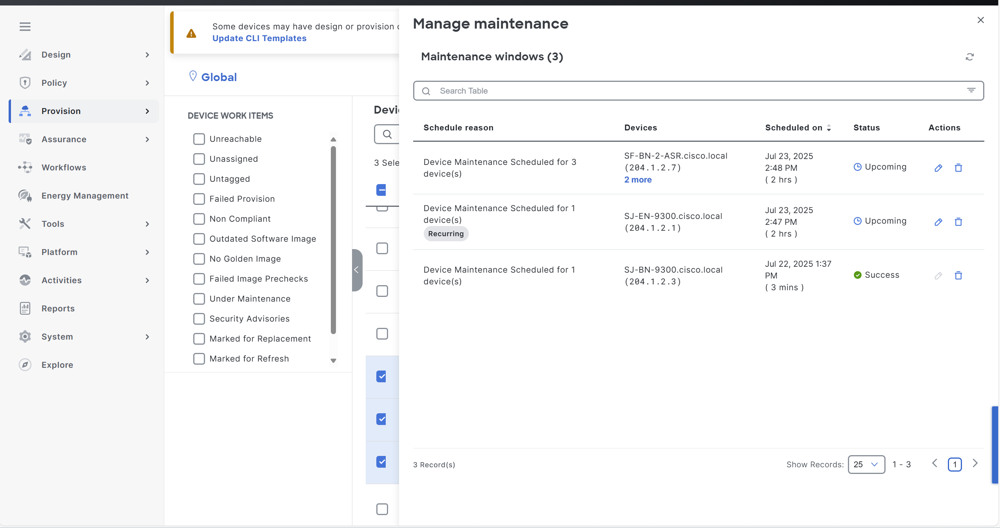

# Ansible Workflow: Inventory Workflow Manager

This Ansible workflow automates various inventory management tasks within your network, streamlining device and port configuration.

inventory_details defines the list of devices and their details to be processed by the playbooks.

**Key Features:**
  - Device Onboarding: Add new devices into inventory with automated workflows.
  - Site Assignment: Assign devices to specific sites or zones within the fabric.
  - Provisioning: Apply configurations and provision devices based on site policies.
  - Device Operations: Support update, resync, and reboot operations for managed devices.
  - Role Management: Change or assign device roles such as border, access, ...
  - Device Deletion: Remove devices cleanly from the fabric inventory
  - Maintenance Scheduling: Schedule periodic or one-time maintenance or device restarts.

**Version Information:**
  - version_added: v6.8.0
  - Maintenance Scheduling: v6.33.0
---

This README outlines the steps to use the Ansible playbooks for managing Application Policies in Cisco Catalyst Center.

## Workflow Steps

Before running the playbooks, ensure you have Ansible installed and the necessary collections for Cisco Catalyst Center.

1.  **Install Ansible:** Follow the official Ansible documentation for installation instructions.
2.  **Install Cisco Catalyst Center Collection:**
    ```bash
    ansible-galaxy collection install cisco.dnac
    ```
3.  **Generate Inventory:** Create an Ansible inventory file (e.g., `inventory.yml`) that includes your Cisco Catalyst Center appliance details. You will need to define variables such as the host, username, and password (or other authentication methods).

### Configure Host Inventory

Update your Ansible hosts.yml inventory file with the connection details of your Cisco Catalyst Center instance. Replace the placeholder values with your actual Catalyst Center information.

```yaml
catalyst_center_hosts:
    hosts:
        your_catalyst_center_instance_name:
            catalyst_center_host: xx.xx.xx.xx
            catalyst_center_password: XXXXXXXX
            catalyst_center_port: 443
            catalyst_center_timeout: 60
            catalyst_center_username: admin
            catalyst_center_verify: false # Set to true for production with valid certificates
            catalyst_center_version: 2.3.7.6 # Specify your DNA Center version
            catalyst_center_debug: true
            catalyst_center_log_level: INFO
            catalyst_center_log: true
```

### Step 2: Define Inputs and Validate

1. **Prerequisite:**
  - The device must be discovered successfully and appear in inventory.

2. **Define Input Variables:** Create variable files (e.g., `vars/inventory_vars.yml`) to represent the intended state of your fabric inventory. This includes device details, site assignments, provisioning settings, device roles, tags, and maintenance schedules. Use the schema below to structure your variables accurately.

#### Inventory Schema

| Parameter                           | Type            | Required | Default     | Description                                                                 |
|-------------------------------------|------------------|----------|-------------|-----------------------------------------------------------------------------|
| type                                | String           | No       | "NETWORK_DEVICE" | Select device type (e.g., NETWORK_DEVICE, COMPUTE_DEVICE, etc.)             |
| cli_transport                       | String           | No       | ssh         | Transport protocol for accessing device (ssh or telnet)                    |
| compute_device                      | Boolean          | No       | false       | Whether device is a compute device                                          |
| password                            | String           | Yes      | N/A         | Password for accessing the device and encryption                           |
| enable_password                     | String           | No       | N/A         | Enable password for device                                                  |
| extended_discovery_info             | String           | No       | N/A         | Additional discovery information                                            |
| http_password                       | String           | No       | N/A         | HTTP password for compute/Meraki/Firepower                                 |
| http_port                           | String           | No       | 443         | HTTP port for compute/Firepower                                             |
| http_secure                         | Boolean          | No       | true        | Indicates if HTTP is secure                                                 |
| http_username                       | String           | No       | N/A         | HTTP username for compute/Firepower                                         |
| ip_address_list                     | List[String]     | No       | []          | List of device IP addresses                                                 |
| hostname_list                       | List[String]     | No       | []          | List of device hostnames                                                    |
| serial_number_list                  | List[String]     | No       | []          | List of device serial numbers                                               |
| mac_address_list                    | List[String]     | No       | []          | List of device MAC addresses                                                |
| netconf_port                        | String           | No       | 830         | Netconf access port                                                         |
| username                            | String           | Yes      | N/A         | Username to access the device                                               |
| snmp_auth_passphrase               | String           | No       | N/A         | SNMP authentication passphrase                                              |
| snmp_auth_protocol                 | String           | No       | SHA         | SNMP authentication protocol                                                |
| snmp_mode                           | String           | No       | AUTHPRIV    | SNMP mode: NOAUTHNOPRIV, AUTHNOPRIV, AUTHPRIV                               |
| snmp_priv_passphrase              | String           | No       | N/A         | SNMP privacy passphrase                                                     |
| snmp_priv_protocol                | String           | No       | AES         | SNMP privacy protocol                                                       |
| snmp_ro_community                 | String           | No       | public      | SNMP read-only community (v2c)                                              |
| snmp_rw_community                 | String           | No       | private     | SNMP read-write community (v2c)                                             |
| snmp_retry                         | Integer          | No       | 3           | SNMP retry count                                                            |
| snmp_timeout                       | Integer          | No       | 5           | SNMP timeout (seconds)                                                      |
| snmp_username                      | String           | No       | N/A         | SNMP username                                                               |
| snmp_version                       | String           | No       | v3          | SNMP version: v2 or v3                                                      |
| update_mgmt_ipaddresslist          | List[Dict]       | No       | []          | List of IP updates with `exist_mgmt_ipaddress` and `new_mgmt_ipaddress`    |
| force_sync                          | Boolean          | No       | false       | Force high-priority device sync                                             |
| device_resync                       | Boolean          | No       | false       | Resync device                                                               |
| resync_device_count                | Integer          | No       | 200         | Max number of devices to resync                                             |
| resync_max_timeout                 | Integer          | No       | 600         | Max timeout for resync (seconds)                                            |
| reboot_device                       | Boolean          | No       | false       | Reboot Access Points                                                        |
| export_device_details_limit        | Integer          | No       | 500         | Max devices to export                                                       |
| credential_update                   | Boolean          | No       | false       | Update credentials for devices                                              |
| clean_config                        | Boolean          | No       | false       | Delete device config and remove provisioning                               |
| role                                | String           | No       | ACCESS      | Device role (e.g., ACCESS, CORE, BORDER)                                    |
| add_user_defined_field              | Dict             | No       | N/A         | Custom fields with `name`, `description`, `value`                          |
| update_interface_details            | Dict             | No       | N/A         | Dict with `interface_name`, `description`, `vlan_id`, etc.                 |
| export_device_list                  | Dict             | No       | N/A         | Dict with `password`, `site_name`, `operation_enum`, `parameters`          |
| provision_wired_device              | List[Dict]       | No       | []          | List of devices to provision                                                |
| devices_maintenance_schedule        | List[Dict]       | No       | []          | Maintenance schedule: `device_ips`, `start_


#### How to Validate Input

```bash
yamale -s workflows/inventory/schema/inventory_schema.yml workflows/inventory/vars/inventory_vars.yml 
Validating /Users/pawansi/dnac_ansible_workflows/workflows/inventory/vars/inventory_vars.yml...
Validation success! 👍
```

#### Example Input File

A. To execute the Ansible playbook for adding devices:

* This task adds new devices to Cisco Catalyst Center. It allows you to specify multiple devices using a list of IP addresses and configure parameters such as device type, connection method, credentials, and SNMP information.
* The below sample playbook will be used for adding 3 devices to the inventory.
```bash
catalyst_center_version: 2.3.7.6
inventory_details:
  network_devices:
  - ip_address_list: ["XX.XX.XX.XX", "XX.XX.XX.XX", "XX.XX.XX.XX"]
    cli_transport: ssh
    compute_device: False
    password: Test@123
    enable_password: Test@1234
    extended_discovery_info: test
    http_username: "testuser"
    http_password: "test"
    http_port: "443"
    http_secure: False
    netconf_port: 830
    snmp_auth_passphrase: "Lablab@12"
    snmp_auth_protocol: SHA
    snmp_mode: AUTHPRIV
    snmp_priv_passphrase: "Lablab@123"
    snmp_priv_protocol: AES256
    snmp_retry: 3
    snmp_timeout: 5
    snmp_username: v3Public
    snmp_version: v3
    type: NETWORK_DEVICE
    username: cisco
```
* After the successful execution you will get the below message.
"device(s) 'XX.XX.XX.XX', 'XX.XX.XX.XX', 'XX.XX.XX.XX' added successfully in Cisco Catalyst Center."
* verify the devices are successfully added to the inventory and present in the Cisco Catalyst Center.


* Sample run line command to run the add devices Playbook:
```bash
    ansible-playbook -i host_inventory_dnac1/hosts.yml workflows/inventory/playbook/inventory_playbook.yml --e VARS_FILE_PATH=../vars/inventory_vars.yml -vvvvv
```

B. To execute the Ansible playbook for provision devices:

* This task provisions wired devices in the Cisco DNA Center inventory. Provisioning involves assigning devices to a specific site and applying the necessary configurations for them to operate within that site's network environment.
* The below sample playbook will provision the 2 devices to its respective sites.
* We can provision multiple devices and the provisioning of multiple devices will do in parallel.
```bash
catalyst_center_version: 2.3.7.6
inventory_details:
  network_devices:
    - provision_wired_device:
      - device_ip: XX.XX.XX.XX
        site_name: Global/USA/SAN-FRANCISCO/SF_BLD1
        resync_retry_count: 200
        resync_retry_interval: 2
      - device_ip: XX.XX.XX.XX
        site_name: Global/USA/SAN JOSE/SJ_BLD23
        resync_retry_count: 200
        resync_retry_interval: 2
```
* After the successful execution you will get the below message.
"device(s) 'XX.XX.XX.XX', 'XX.XX.XX.XX' provisioned successfully in Cisco Catalyst Center."
* verify the devices provision status in the Cisco Catalyst Center and it will show provision status as success. Before provision it will show Not Provisioned.


*  Sample run line command for running the Provision Playbook:
```bash
    ansible-playbook -i host_inventory_dnac1/hosts.yml workflows/inventory/playbook/inventory_playbook.yml --e VARS_FILE_PATH=../vars/inventory_provision_devices.yml -vvvvv
```

C. To execute the Ansible playbook for resync and reboot devices:
* Resync - This task resynchronizes network devices with Cisco Catalyst to ensure their configuration and status in Catalyst match their actual state in the network. The resync process ensures that the device’s configuration and status in Catalyst are updated to reflect its actual state in the network. Resync is commonly used to address discrepancies between Catalyst and device configurations.
* The below sample playbook will be used for resync.
* If force_sync is true then device sync would run in high priority thread if available, else the sync will fail.
```bash
catalyst_center_version: 2.3.7.6
# This file contains the variables for the inventory workflow
inventory_details:
  network_devices:
  - ip_address_list: ["XX.XX.XX.XX","XX.XX.XX.XX"]
    device_resync: True
    # Make this True if you want to force resync the device
    force_sync: False
    resync_retry_count: 200
    resync_interval: 2
```
* After the successful execution you will get the below message.
"Device(s) '['XX.XX.XX.XX', 'XX.XX.XX.XX']' have been successfully resynced in the inventory in Cisco Catalyst Center."

* Reboot - This task initiates a reboot of specified network devices using the Cisco Catalyst inventory manager. Device reboots are often necessary after configuration changes, updates, or troubleshooting procedures to ensure that the devices properly apply new settings for the access point Devices.
* The below sample playbook for Reboot AP Devices with IP Addresses.
```bash
catalyst_center_version: 2.3.7.6
# This file contains the variables for the inventory workflow
inventory_details:
  network_devices:
  - ip_address_list: ["XX.XX.XX.XX","XX.XX.XX.XX"]
    reboot_device: True
```
* After the successful execution you will get the below message.
"msg: AP Device(s) XX.XX.XX.XX, XX.XX.XX.XX successfully rebooted!"
*  To run the Resync/Reboot Playbook:
```bash
    ansible-playbook -i host_inventory_dnac1/hosts.yml workflows/inventory/playbook/inventory_playbook.yml --e VARS_FILE_PATH=../vars/inventory_resync_reboot_vars.yml -vvvvv
```
* **NOTE - reboot will work for only AP devices, where resync will work for all the devices.**

D. To execute the Ansible playbook for changing Device roles:
* This task updates the role of existing devices in the Cisco Catalyst Center inventory. The role of a device helps categorize its function within the network (e.g., as an access, distribution, or core).
* The below playbook will be used for changing device roles. It will support multiple devices.
```bash
catalyst_center_version: 2.3.7.6
inventory_details:
  network_devices:
  - ip_address_list: ["XX.XX.XX.XX", "XX.XX.XX.XX"]
    role: ACCESS
```
* After the successful execution you will get the below message.
"msg": "Device(s) '['XX.XX.XX.XX', 'XX.XX.XX.XX']' role updated successfully to '['ACCESS', 'ACCESS']'"
* Verify the device role in the cisco catalyst center.


E. To execute the Ansible playbook for deleting devices:
* This task deletes specific devices from the Cisco Catalyst inventory using their IP addresses. You can control whether the device's configuration is retained or removed upon deletion, depending on your network management needs.
*  The below playbook will be used for deleting devices/provisioned devices from the inventory.
* If clean_config set to true it will delete the Provisioned device by clearing current configuration.
```bash
catalyst_center_version: 2.3.7.6
inventory_details:
  network_devices:
  - ip_address_list: ["XX.XX.XX.XX","XX.XX.XX.XX"]
    clean_config: False
```
* After the successful execution you will get the below message.
"device(s) 'XX.XX.XX.XX', 'XX.XX.XX.XX' successfully deleted in Cisco Catalyst Center"
* Make sure the devices are deleted from the Cisco Catalyst Center.
*  To run the Delete Playbook:
```bash
    ansible-playbook -i host_inventory_dnac1/hosts.yml workflows/inventory/playbook/delete_inventory_playbook.yml --e VARS_FILE_PATH=../vars/inventory_delete_devices.yml -vvvvv
```

F. To execute the Ansible playbook for schedule the maintenance:

* scheduled maintenance for device xx.xx.xx.xx at 2025-04-05 10:30:00 and ended at 2025-04-05 11:30:00 in Asia/Kolkata time zone


```bash
catalyst_center_version: 2.3.7.6
- devices_maintenance_schedule:
  - device_ips:
      - "xx.xx.xx.xx"
    description: "Schedule maintenance
      devices"
    start_time: "2025-04-05 10:30:00"
    end_time: "2025-04-05 11:30:00"
    time_zone: "Asia/Kolkata"
```

* scheduled maintenance for device xx.xx.xx.xx at 2025-04-05 10:30:00, ending at 2025-04-05 11:30:00 Asia/Kolkata time zone and recurring time to re-execute is 2 days ending after scheduled maintenance at 2025-04-10 11:40:00


```bash
catalyst_center_version: 2.3.7.6
- devices_maintenance_schedule:
  - device_ips:
      - "xx.xx.xx.xx"
    description: "Schedule maintenance
      devices"
    start_time: "2025-04-05 10:30:00"
    end_time: "2025-04-05 11:30:00"
    time_zone: "Asia/Kolkata"
    recurrence_end_time: "2025-04-10 11:40:00"
    recurrence_interval: 2
```

* scheduled maintenance for multiple devices at 10:30:00 on 04/05/2025 and ending at 11:30:00 on 04/05/2025 in Asia/Kolkata time zone



```bash
catalyst_center_version: 2.3.7.6
- devices_maintenance_schedule:
  - device_ips:
      - "xx.xx.xx.xx"
      - "xx.xx.xx.xx"
      - "xx.xx.xx.xx"
    description: "scheduled maintenance for multiple devices"
    start_time: "2025-04-05 10:30:00"
    end_time: "2025-04-05 11:30:00"
    time_zone: "Asia/Kolkata"
```


G. To execute the Ansible playbook for delete schedule the maintenance:

* delete all maintenance schedules of device xx.xx.xx.xx

```bash
catalyst_center_version: 2.3.7.6
- devices_maintenance_schedule:
  - device_ips:
      - "xx.xx.xx.xx"
      - "xxx.xxx.xxx.xxx"
```

## Run line command parameters:

- `-i`: Specifies the inventory file containing host details.  
- `--e VARS_FILE_PATH`: Path to the variable file containing workflow inputs.  
- `-vvvv`: Enables verbose mode for detailed output. 

##  Important Notes
* Always refer to the detailed input specification for comprehensive information on available options and their structure.

* Note: The environment is used for the references in the above instructions.
```bash
  Python: 3.12.0
  ansible: 9.9.0
  ansible-core: 2.16.10
  ansible-runner: 2.4.0
  dnacentersdk: 2.8.3
  cisco.dnac: 6.36.0
  ansible.utils: 5.1.2
```