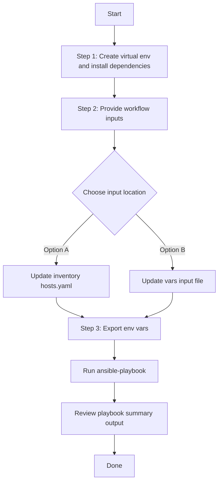

# Inventory Config Generator

## Table of Contents

- [User Flow (3 Steps)](#user-flow-3-steps)

- [Overview](#overview)
- [Features](#features)
- [Prerequisites](#prerequisites)
- [Workflow Structure](#workflow-structure)
- [Schema Parameters](#schema-parameters)
- [Getting Started](#getting-started)
- [Operations](#operations)
- [Examples](#examples)---

## Overview

The Inventory config generator automates YAML playbook generation for inventory components in Cisco Catalyst Center. It generates output compatible with `inventory_workflow_manager` and supports both global and component-specific filtering.

---

## Features

- **Configuration Generation**: Generate YAML configurations compatible with `inventory_workflow_manager`.
  - Extract inventory device and provisioning data.
  - Convert API responses into workflow-manager-ready YAML.
  - Reuse generated files for backup, migration, and audit.
- **Global Filtering**: Filter devices globally by IP, hostname, serial number, and MAC address.
- **Component Filtering**: Generate `device_details`, `provision_device`, `interface_details`, and `user_defined_fields` selectively.
- **Flexible Output**: Supports custom `file_path` and `file_mode` (`overwrite` / `append`).
- **Brownfield Discovery**: Omit `config` (or use workflow convenience flag) to generate all inventory components.

---

## Prerequisites

### Software Requirements

| Component | Version |
|-----------|---------|
| Ansible | 2.13+ |
| cisco.dnac collection | 6.44.0+ |
| Python | 3.9+ |
| Cisco Catalyst Center | 2.3.7.9+ |
| dnacentersdk | 2.10.10+ |

### Required Collections

```bash
ansible-galaxy collection install cisco.dnac
ansible-galaxy collection install ansible.utils
pip install dnacentersdk
pip install yamale
```

### Access Requirements

- Catalyst Center credentials with inventory API access
- Network connectivity to Catalyst Center
- Existing inventory data (for targeted export use cases)

---

## Workflow Structure

```
inventory_config_generator/
├── playbook/
│   └── inventory_config_generator.yml       # Main operations
├── vars/
│   └── inventory_config_inputs.yml          # Input examples
├── schema/
│   └── inventory_config_schema.yml          # Input validation
└── README.md
```

---

## Schema Parameters

### Basic Configuration

| Parameter | Type | Required | Default | Description |
|-----------|------|----------|---------|-------------|
| `generate_all_configurations` | boolean | No | false | Workflow convenience flag. When true, playbook omits module `config` |
| `file_path` | string | No | auto-generated | Output file path for generated YAML |
| `file_mode` | string | No | `overwrite` | File write mode: `overwrite` or `append` |
| `global_filters` | dict | No | omitted | Global filters passed to module `config.global_filters` |
| `component_specific_filters` | dict | No | omitted | Component filters passed to module `config.component_specific_filters` |

### Supported Components

- `device_details`
- `provision_device`
- `interface_details`
- `user_defined_fields`

### Global Filters

- `ip_address_list`
- `hostname_list`
- `serial_number_list`
- `mac_address_list`

### Component Filter Fields

- `device_details`: supports module-documented keys such as `type`, `role`, `snmp_version`, `cli_transport`
- `provision_device.site_name`
- `interface_details.interface_name` (string or list)
- `user_defined_fields.name` and `user_defined_fields.value` (string or list)

---

## Getting Started

## Workflow Steps
## User Flow (3 Steps)



### Installation and Run (Aligned)

1. Create and activate a Python virtual environment, then install dependencies.

```bash
python3 -m venv .venv
source .venv/bin/activate
pip install -r requirements.txt
ansible-galaxy collection install cisco.dnac --force
```

2. Provide workflow inputs in either inventory (`inventory/demo_lab/hosts.yaml`) or the workflow `vars/` file.

3. Export Catalyst Center environment variables and run the playbook.

```bash
export HOSTIP=<catalyst-center-ip-or-fqdn>
export CATALYST_CENTER_USERNAME=<username>
export CATALYST_CENTER_PASSWORD='<password>'
ansible-playbook -i ./inventory/demo_lab/hosts.yaml ./workflows/inventory_config_generator/playbook/inventory_config_generator.yml -vvvv
```


## Operations

### Generate Operations (state: gathered)

1. **Generate all inventory components**
- Set `generate_all_configurations: true`.

2. **Generate with global filters only**
- Set `global_filters` and omit component filters.

3. **Generate selected components**
- Set `component_specific_filters.components_list` and component blocks.

4. **Generate with both filter types**
- Set both `global_filters` and `component_specific_filters` in one item.

---

## Examples

### Example 1: Generate all inventory configurations

```yaml
inventory_config:
  - generate_all_configurations: true
    file_path: "/tmp/inventory_complete_config.yml"
```

### Example 2: Global device filtering with device_details output

```yaml
inventory_config:
  - file_path: "/tmp/inventory_device_details_filtered.yml"
    global_filters:
      ip_address_list: ["10.1.1.1", "10.1.1.2"]
    component_specific_filters:
      components_list: ["device_details"]
```

### Example 3: Component filtering for provision and interface details

```yaml
inventory_config:
  - file_path: "/tmp/inventory_provision_interface.yml"
    component_specific_filters:
      components_list: ["provision_device", "interface_details"]
      provision_device:
        site_name: "Global/USA/SAN JOSE"
      interface_details:
        interface_name: ["GigabitEthernet1/0/1"]
```

---

## Notes

- `inventory_playbook_config_generator` supports both `global_filters` and `component_specific_filters` in `config`.
- This workflow omits `config` when no filters are provided, which triggers full generation mode.
- The playbook merges both filter groups when both are defined in the same item.
