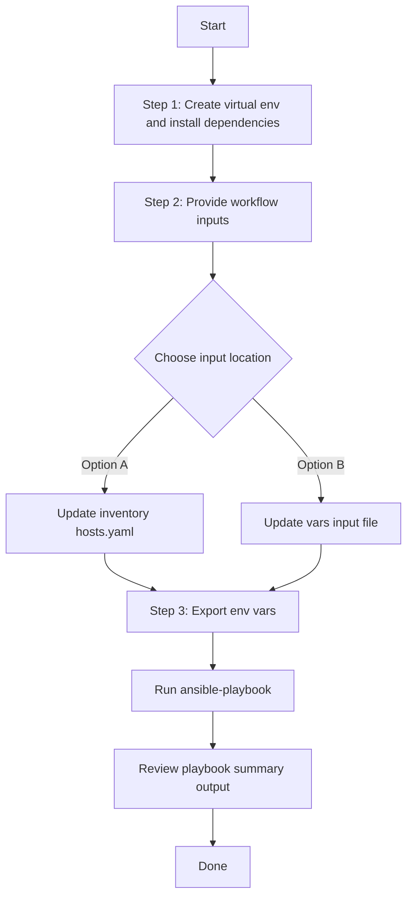

# Inventory Config Generator

## Table of Contents

- [User Flow (3 Steps)](#user-flow-3-steps)

- [Overview](#overview)
- [Features](#features)
- [Prerequisites](#prerequisites)
- [Workflow Structure](#workflow-structure)
- [Schema Parameters](#schema-parameters)
- [Getting Started](#getting-started)
- [Operations](#operations)
- [Examples](#examples)

---

## Overview

The Inventory config generator automates YAML configurations for inventory components in Cisco Catalyst Center. It generates output compatible with inventory_workflow_manager.

---

## Features

- **Configuration Generation**: Generate YAML configurations compatible with inventory_workflow_manager module. Extract existing inventory configurations from your Cisco Catalyst Center. Convert them into properly formatted YAML files. Generate files that are ready to use with Ansible automation.
- **Component Filtering**: Selective generation using devices,device_roles,device_types and device_identifier.
- **Flexible Output**: Configurable file paths, auto-generated timestamped filenames, and `overwrite`/`append` file modes.
- **Brownfield Support**: Extract configurations from existing Catalyst Center deployments.
- **API Integration**: Leverages native Catalyst Center discovery APIs for data retrieval.

---

## Prerequisites

### Software Requirements

| Component | Version |
|-----------|---------|
| Ansible | 2.13+ |
| cisco.catalystcenter collection | 6.49.0+ |
| Python | 3.9+ |
| Cisco Catalyst Center | 2.3.7.9+ |
| catalystcentersdk | 2.7.2+ |

### Required Collections

```bash
ansible-galaxy collection install cisco.catalystcenter
ansible-galaxy collection install ansible.utils
pip install catalystcentersdk
pip install yamale
```

---

## Workflow Structure

```text
inventory_config_generator/
├── playbook/
│   └── inventory_config_generator.yml
├── vars/
│   └── inventory_config_inputs.yml
├── schema/
│   └── inventory_config_schema.yml
└── README.md
```

---

## Schema Parameters

### Top-Level parameters 

| Parameter | Type | Required | Default | Description |
|-----------|------|----------|---------|-------------|
| `file_path` | string | Yes | — | Output file path for YAML configuration file. Required for automated output validation in this workflow. |
| `file_mode` | string | No | `overwrite` | File write mode — `overwrite` replaces the file, `append` adds to it . Only applicable when `file_path` is provided.|
| `config` | dict | No | omitted (all components) | Configuration filters dict. When omitted, all discovery configurations are retrieved. When provided, `global_filters` is mandatory. |


### Global Filters (within config parameter)

| Parameter | Type | Description |
|-----------|------|-------------|
| `global_filters` | dict | Required when `config` is provided. Filters to specify which components to include. |
| `devices` | list[string] | Matches each value against device `ip_address`, `hostname`, `serial_number`, `mac_address` |
| `device_roles` | list[string] | Allowed: `ACCESS`, `DISTRIBUTION`, `CORE`, `BORDER ROUTER`, `UNKNOWN` |
| `device_types` | list[string] | Allowed: `COMPUTE_DEVICE`, `MERAKI_DASHBOARD`, `THIRD_PARTY_DEVICE`, `NETWORK_DEVICE`, `ACCESS_POINT` |
| `device_identifier` | string | Output key selector: `ip_address`, `hostname`, `serial_number`, `mac_address` |

---

## Getting Started

## Workflow Steps
## User Flow (3 Steps)



### Installation and Run (Aligned)

1. Create and activate a Python virtual environment, then install dependencies.

```bash
python3 -m venv .venv
source .venv/bin/activate
pip install -r requirements.txt
ansible-galaxy collection install cisco.catalystcenter --force
```

2. Provide workflow inputs in either inventory (`inventory/demo_lab/hosts.yaml`) or the workflow `vars/` file.

3. Export Catalyst Center environment variables and run the playbook.

```bash
export HOSTIP=<catalyst-center-ip-or-fqdn>
export CATALYST_CENTER_USERNAME=<username>
export CATALYST_CENTER_PASSWORD='<password>'
ansible-playbook -i ./inventory/demo_lab/hosts.yaml ./workflows/discovery_config_generator/playbook/discovery_config_generator.yml -vvvv
```

---

## Operations

#### 1. Generate all inventory configurations:

**Description**: Retrieves all inventory configurations from Catalyst Center regardless of any filters

```yaml
inventory_config:
  - file_path: "/tmp/inventory_complete_config.yml"
```

**Terminal Return:**

```
 response:
        configurations_count: 31
        file_mode: overwrite
        file_path: /tmp/inventory_complete_config.yml
        message: YAML configuration file generated successfully for module 'inventory_workflow_manager'
        status: success
      status: success
```

### 2.Filter by devices values (IP/hostname/serial/mac)
```yaml
inventory_config:
  - file_path: "/tmp/inventory_devices_filter.yml"
    config:
      global_filters: 
        devices:
          - 204.1.216.3
```

**Terminal Return:**

```
response:
        configurations_count: 1
        file_mode: overwrite
        file_path: /tmp/inventory_devices_filter.yml
        message: YAML configuration file generated successfully for module 'inventory_workflow_manager'
        status: success
      status: success

```
### Filter by device roles

```yaml
inventory_config:
  - file_path: "/tmp/inventory_roles.yml"
    config:
      global_filters:
        device_roles: 
          - "DISTRIBUTION"
          - "BORDER ROUTER"
```
**Terminal Return:**

```
response:
        configurations_count: 7
        file_mode: overwrite
        file_path: /tmp/inventory_roles.yml
        message: YAML configuration file generated successfully for module 'inventory_workflow_manager'
        status: success
      status: success
```

### Filter by device types

 ```yaml
inventory_config:
  - file_path: "/tmp/inventory_types.yml"
    config:
      global_filters:
        device_types: 
          - "NETWORK_DEVICE"
          - "ACCESS_POINT"
```
**Terminal Return:**

```
 response:
        configurations_count: 21
        file_mode: overwrite
        file_path: /tmp/inventory_types.yml
        message: YAML configuration file generated successfully for module 'inventory_workflow_manager'
        status: success
      status: success
```

**Validate and Execute:**

```bash
#validate
./tools/validate.sh \
  -s workflows/inventory_config_generator/schema/inventory_config_schema.yml \
  -d workflows/inventory_config_generator/vars/inventory_config_inputs.yml
```

```bash
 ./tools/validate.sh \
>   -s workflows/inventory_config_generator/schema/inventory_config_schema.yml \
>   -d workflows/inventory_config_generator/vars/inventory_config_inputs.yml
workflows/inventory_config_generator/schema/inventory_config_schema.yml
workflows/inventory_config_generator/vars/inventory_config_inputs.yml
yamale   -s workflows/inventory_config_generator/schema/inventory_config_schema.yml  workflows/inventory_config_generator/vars/inventory_config_inputs.yml
Validating workflows/inventory_config_generator/vars/inventory_config_inputs.yml...
Validation success! 👍
```

```bash
# Execute
ansible-playbook -i inventory/demo_lab/hosts.yaml \
  workflows/inventory_config_generator/playbook/inventory_config_generator.yml \
  --extra-vars VARS_FILE_PATH=../vars/inventory_config_inputs.yml
```

---

## Examples

### Example 1: Filter by devices values 

```yaml
inventory_config:
  - file_path: "/tmp/inventory_devices_filter.yml"
    config:
      global_filters: 
        devices:
          - 204.1.216.3
```
After running the playbook, the following YAML configuration is generated.

```yaml
config:
  - ip_address_list:
    - 204.1.216.3
    role: ACCESS
    type: ACCESS_POINT
    cli_transport: ssh
    http_secure: false
    snmp_retry: 0
    snmp_timeout: 0
    compute_device: false

```
### Example 2: Filter by roles and types

```yaml
inventory_config:
  - file_path: "/tmp/inventory_roles_types.yml"
    global_filters:
      device_roles: ["ACCESS", "CORE"]
      device_types: ["NETWORK_DEVICE", "ACCESS_POINT"]
```
After running the playbook, the following YAML configuration is generated.

```yaml
config:
  - ip_address_list:
    - 204.192.106.3
    role: ACCESS
    type: ACCESS_POINT
    cli_transport: ssh
    http_secure: false
    snmp_retry: 0
    snmp_timeout: 0
    compute_device: false
  - ip_address_list:
    - 204.192.3.40
    role: ACCESS
    type: NETWORK_DEVICE
    cli_transport: ssh
    netconf_port: '830'
    username: wlcaccess
    password: '{{ ip_204_192_3_40_password }}'
    enable_password: '{{ ip_204_192_3_40_enable_password }}'
    http_username: wlcaccess
    http_password: '{{ ip_204_192_3_40_http_password }}'
    http_port: '443'
    http_secure: false
    snmp_version: v3
    snmp_mode: AUTHNOPRIV
    snmp_username: v3Public1
    snmp_auth_passphrase: '{{ ip_204_192_3_40_snmp_auth_passphrase }}'
    snmp_auth_protocol: SHA
    snmp_retry: 3
    snmp_timeout: 5
    compute_device: false
  - ip_address_list:
    - 172.27.248.223
    role: ACCESS
    type: NETWORK_DEVICE
    cli_transport: ssh
    username: admin
    password: '{{ ip_172_27_248_223_password }}'
    enable_password: '{{ ip_172_27_248_223_enable_password }}'
    http_secure: false
    snmp_version: v2
    snmp_ro_community: '{{ ip_172_27_248_223_snmp_ro_community }}'
    snmp_retry: 3
    snmp_timeout: 5
    compute_device: false
```

### Example 3: Filter by all global filters together (devices, roles, types) with mac add as identifier

```yaml
inventory_config:
  - file_path: "/tmp/inventory_all_filters.yml"
    config:
      global_filters:
        devices:
          - "68:7d:b4:06:b0:a0"
        device_roles:
          - "ACCESS"
        device_types:
          - "ACCESS_POINT"
        device_identifier: "mac_address"
```
After running the playbook, the following YAML configuration is generated.

```yaml
config:
  - mac_address_list:
    - 68:7d:b4:06:b0:a0
    role: ACCESS
    type: ACCESS_POINT
    cli_transport: ssh
    http_secure: false
    snmp_retry: 0
    snmp_timeout: 0
    compute_device: false
```
---

## Additional Resources

- [Cisco Catalyst Center Documentation](https://www.cisco.com/c/en/us/support/cloud-systems-management/dna-center/series.html)
- [Cisco DNA Center SDK](https://catalystcentersdk.readthedocs.io/)
- [Ansible Documentation](https://docs.ansible.com/)
