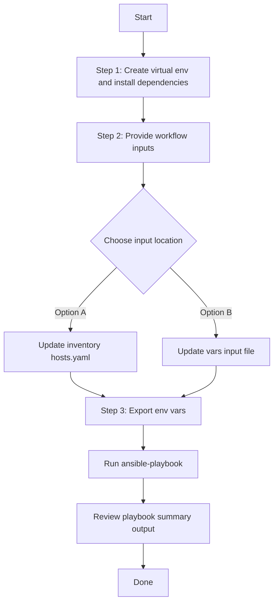

# Inventory Generation Ansible Playbook


This Ansible playbook automates the generation of an inventory file for Cisco DNA Center (DNAC). It simplifies the process of creating an inventory by interacting with the DNAC API and extracting the necessary information.

## Table of Contents
- [Prerequisites](#prerequisites)
- [Usage](#usage)
- [Variables](#variables)
- [Examples](#examples)
- [Contributing](#contributing)
- [License](#license)

## Prerequisites

Before using this Ansible playbook, ensure that you have:

- Ansible installed on your machine
- Access to a Cisco DNA Center instance
- Proper network connectivity to interact with the DNA Center API

## Usage

To use this Ansible playbook, follow these general steps:

1. Update the `inventory/hosts.yml` file with the details of your Cisco DNA Center instance.

2. Customize the playbook variables in the `inventory_gen.yml` playbook as needed.

3. Run the playbook using the following command:

   ```bash
   ansible-playbook -i ./inventory/demo_lab/001-dnac_inventory.ym workflows/inventory_gen/playbook/inventory_gen.yml

## Examples

Run the playbook with the following command:

    bash
        ansible-playbook -i inventory/hosts.yml workflows/inventory_gen/playbook/inventory_gen.yml

This will generate an inventory file based on the specified parameters and save it to the specified output file.

## Contributing

Contributions are welcome! 
## Workflow Steps
## User Flow (3 Steps)



### Installation and Run (Aligned)

1. Create and activate a Python virtual environment, then install dependencies.

```bash
python3 -m venv .venv
source .venv/bin/activate
pip install -r requirements.txt
ansible-galaxy collection install cisco.catalystcenter:==2.6.0 --force
```

2. Provide workflow inputs in either inventory (`inventory/demo_lab/hosts.yaml`) or the workflow `vars/` file.

3. Export Catalyst Center environment variables and run the playbook.

```bash
export HOSTIP=<catalyst-center-ip-or-fqdn>
export CATALYST_CENTER_USERNAME=<username>
export CATALYST_CENTER_PASSWORD='<password>'
ansible-playbook -i ./inventory/demo_lab/hosts.yaml ./workflows/inventory_gen/playbook/inventory_collection_playbook.yml -vvvv
```
