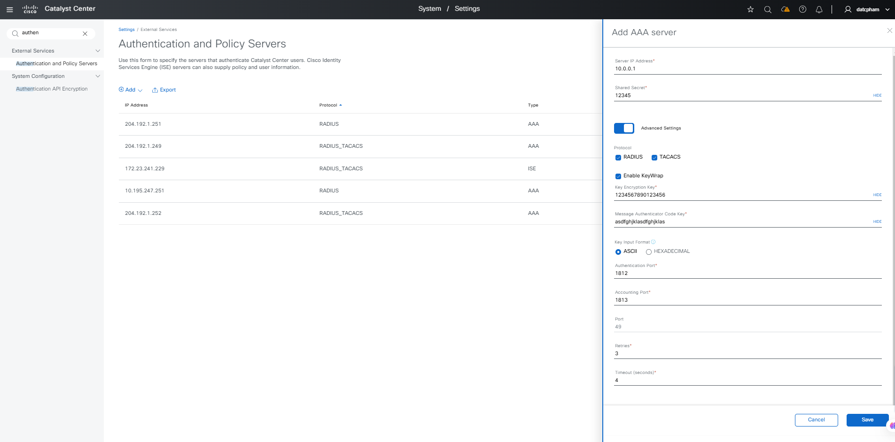
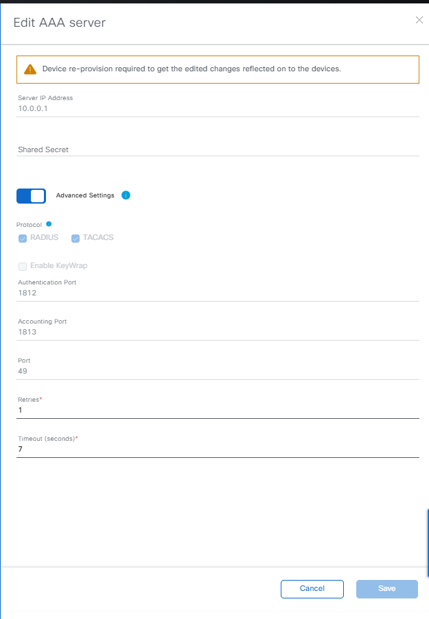
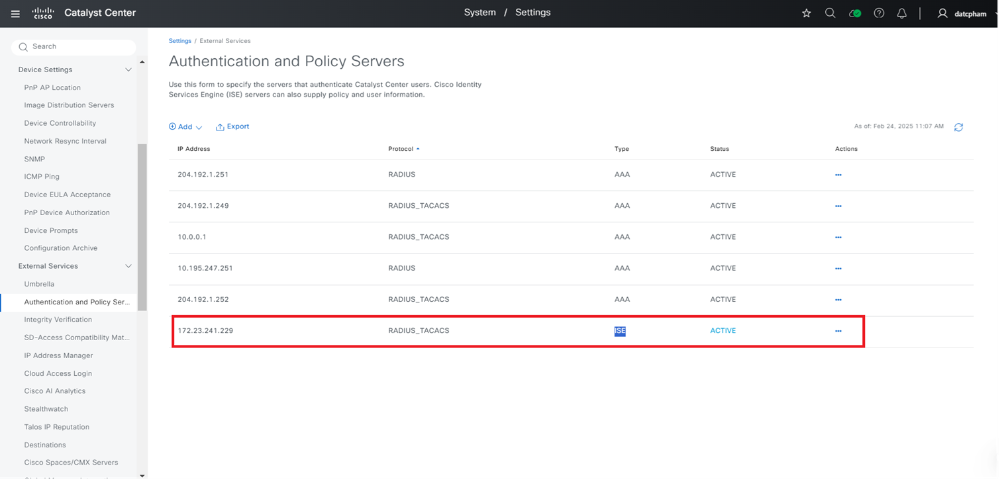
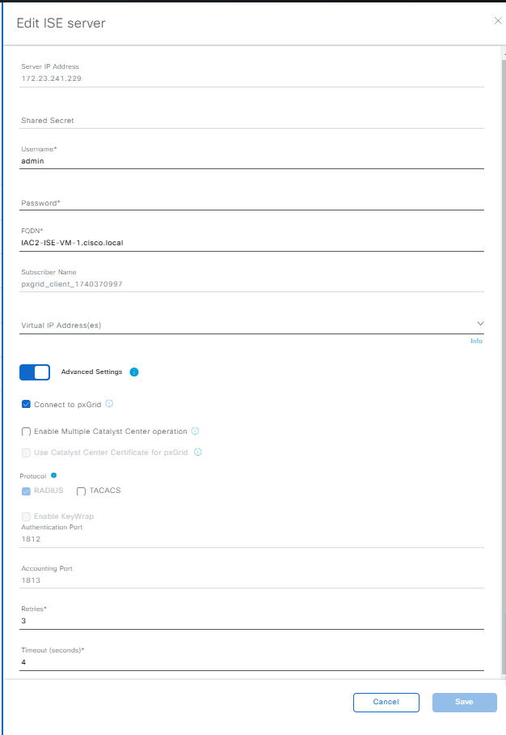
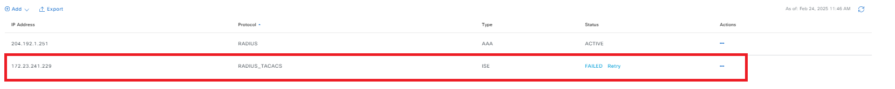
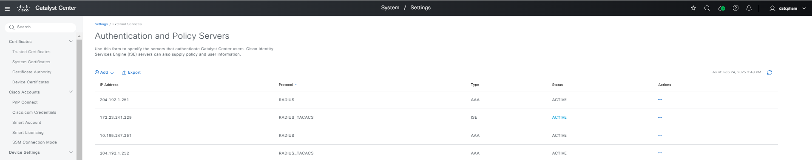
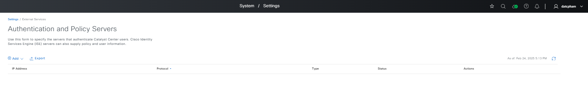

# ISE and AAA Integration Workflow Playbook
This Workflow Playbook is for Integrating the ISE with Catalyst Center also add Additional external AAA servers to catalyst Center. 
This workflow playbook is supported from Catalyst Center Release version 2.3.7.6

ise_radius_integration_details  defines the list of devices and devices details for the devices to be run rough the playbooks


To define the details you can refer the full workflow specification: https://docs.ansible.com/ansible/latest/collections/cisco/dnac/ise_radius_integration_workflow_manager_module.html


## The Sample host_inventory_dnac1/hosts.yml

```bash
catalyst_center_hosts:
    hosts:
        catalyst_center220:
            #(Mandatory) CatC Ip address
            catalyst_center_host:  <DNAC IP Address>
            #(Mandatory) CatC UI admin Password
            catalyst_center_password: <DNAC UI admin Password>
            catalyst_center_port: 443
            catalyst_center_timeout: 60
            #(Mandatory) CatC UI admin username
            catalyst_center_username: <DNAC UI admin username> 
            catalyst_center_verify: false
            #(Mandatory) DNAC Release version
            catalyst_center_version: <DNAC Release version>
            catalyst_center_debug: true
            catalyst_center_log_level: INFO
            catalyst_center_log: true
```
User Inputs for Users and roles are stored in  workflows/network compliance/vars/network_compliance_workflow_inputs.yml

## Validate user input before running though ansible
```bash
(pyats) pawansi@PAWANSI-M-81A3 dnac_ansible_workflows % ./tools/validate.sh -s workflows/ise_radius_integration/schema/ise_radius_integration_workflow_schema.yml -d workflows/ise_radius_integration/vars/ise_radius_integration_workflow_input.yml 
workflows/ise_radius_integration/schema/ise_radius_integration_workflow_schema.yml
workflows/ise_radius_integration/vars/ise_radius_integration_workflow_input.yml
yamale   -s workflows/ise_radius_integration/schema/ise_radius_integration_workflow_schema.yml  workflows/ise_radius_integration/vars/ise_radius_integration_workflow_input.yml
Validating /Users/pawansi/dnac_ansible_workflows/workflows/ise_radius_integration/vars/ise_radius_integration_workflow_input.yml...
Validation success! 👍

```


# Execution Reference Logs
```bash
ansible-playbook -i host_inventory_dnac1/hosts.yml workflows/ise_radius_integration/playbook/ise_radius_integration_workflow_playbook.yml --e VARS_FILE_PATH=../vars/ise_radius_integration_workflow_input.yml -vvvv
```

# Understanding the Configs for ISE and AAA Integration Tasks
1. ### Add/update AAA server
  Add AAA server with full config, for example input config:
  ```yaml
  ise_radius_integration_details:
    - authentication_policy_server:
      - server_type: AAA
        server_ip_address: 10.0.0.1
        shared_secret: "12345"
        protocol: RADIUS_TACACS
        encryption_scheme: KEYWRAP
        encryption_key: "1234567890123456"
        message_authenticator_code_key: asdfghjklasdfghjklas
        authentication_port: 1812
        accounting_port: 1813
        retries: 3
        timeout: 4
  ```
  mapping config to UI Actions:
  

  * It also can be add with minimal config, for example (default: authentication_port: 1812, accounting_port: 1813, retries: 3, timeout: 4):
  ```yaml
  ise_radius_integration_details:
    - authentication_policy_server:
      - server_type: AAA
        server_ip_address: 10.0.0.1
        shared_secret: "12345"
        protocol: RADIUS_TACACS
  ```

  Update AAA server (we can only update with retries, timeout, protocol|add more):
  ```yaml
  ise_radius_integration_details:
    - authentication_policy_server:
      - server_type: AAA
        server_ip_address: 10.0.0.1
        retries: 3
        timeout: 4
  ```
  mapping config to UI Actions:
  

2. ### Add/update ISE server
  Add ISE server with full config, for example input config:
  ```yaml
  ise_radius_integration_details:
    - authentication_policy_server:
      - server_type: ISE
        server_ip_address: 172.23.241.229
        shared_secret: abcd
        protocol: RADIUS_TACACS
        encryption_scheme: KEYWRAP
        encryption_key: dnacsolutions123
        message_authenticator_code_key: dnacisesolutions1234
        authentication_port: 1812
        accounting_port: 1813
        retries: 3
        timeout: 4
        role: primary
        use_dnac_cert_for_pxgrid: False
        pxgrid_enabled: True
        cisco_ise_dtos:
          - user_name: abcd
            password: Abc123!
            fqdn: IAC2-ISE-VM-1.cisco.local
            ip_address: 172.23.241.229
            description: Cisco ISE
        trusted_server: True
        ise_integration_wait_time: 60
  ```
  mapping config to UI Actions:
  

  * It also can be add with minimal config, for example (default: authentication_port: 1812, accounting_port: 1813, retries: 3, timeout: 4, pxgrid_enabled: True, use_dnac_cert_for_pxgrid: False):
  ```yaml
  ise_radius_integration_details:
    - authentication_policy_server:
      - server_type: ISE
        server_ip_address: 172.23.241.229
        shared_secret: abcd
        cisco_ise_dtos:
          - user_name: abcd
            password: Abc123!
            fqdn: IAC2-ISE-VM-1.cisco.local
            ip_address: 172.23.241.229
        trusted_server: True
        ise_integration_wait_time: 60
  ```
  We can only add one ISE for each DNAC.

  Update ISE server (we can only update with retries, timeout, protocol|add more, pxgrid_enabled, fqdn, user_name, password|if fail):
  ```yaml
  ise_radius_integration_details:
    - authentication_policy_server:
      - server_type: ISE
        server_ip_address: 172.23.241.229
        protocol: RADIUS_TACACS
        retries: 1
        timeout: 2 
        pxgrid_enabled: False
        cisco_ise_dtos:
          - user_name: abcd
            password: Abc123!
            fqdn: IAC2-ISE-VM-1.cisco.local
            ip_address: 172.23.241.229

  ```
  mapping config to UI Actions:
  

  * If the provided credentials are invalid, ISE will return a Fail status.
  
  
3. ### Add combine bulk ISE and AAA.
  Add combine the ISE and AAA server with a single input, for example input config.
  ```yaml
  ise_radius_integration_details:
    - authentication_policy_server:
      - server_type: AAA
        server_ip_address: 204.192.1.251
        shared_secret: abcd
        protocol: RADIUS   
      - server_type: AAA
        server_ip_address: 10.195.247.251
        shared_secret: abcd
        protocol: RADIUS
      - server_type: AAA
        server_ip_address: 204.192.1.252
        shared_secret: abcd
        protocol: RADIUS_TACACS
        authentication_port: 1812
        accounting_port: 1813
        retries: 3
        timeout: 4
        role: secondary
      - server_type: ISE
        server_ip_address: 172.23.241.229
        shared_secret: abcd
        protocol: RADIUS_TACACS
        encryption_scheme: KEYWRAP
        encryption_key: dnacsolutions123
        message_authenticator_code_key: dnacisesolutions1234
        authentication_port: 1812
        accounting_port: 1813
        retries: 3
        timeout: 4
        role: primary
        use_dnac_cert_for_pxgrid: False
        pxgrid_enabled: True
        cisco_ise_dtos:
          - user_name: abcd
            password: Abc123!
            fqdn: IAC2-ISE-VM-1.cisco.local
            ip_address: 172.23.241.229
            description: Cisco ISE
        trusted_server: True
        ise_integration_wait_time: 60
  ```
  mapping config to UI Actions:
  

  + Explain values:
  ```yaml
  server_type: Specifies the type of server (e.g., AAA or ISE).
  server_ip_address: The IP address of the server.
  shared_secret: The shared secret used for authentication.
  protocol: The authentication protocol (e.g., RADIUS_TACACS).
  encryption_scheme: The encryption scheme used for ISE servers (e.g., KEYWRAP).
  authentication_port: The port used for authentication (e.g., 1812).
  accounting_port: The port used for accounting (e.g., 1813).
  retries: The number of retries for authentication attempts.
  timeout: The timeout duration for authentication attempts.
  role: The role of the server (e.g., primary).
  cisco_ise_dtos: Contains details about the ISE server, such as user_name, password, fqdn, ip_address, and description
  ```

4. ### Delete ISE/AAA server
  Authentication and Policy Servers deletion on Cisco Catalyst Center (include ISE and bulk AAA server), for example input config:
  ```yaml
  ise_radius_integration_details:
    - authentication_policy_server:
      - server_ip_address: 204.192.1.251 # AAA
      - server_ip_address: 10.195.247.251 # AAA
      - server_ip_address: 204.192.1.252 # AAA
      - server_ip_address: 172.23.241.229 # ISE
  ```
  mapping config to UI Actions:
  

  * If the ISE/AAA server has already been assigned to a previous task (such as being associated with Network Settings, etc.), it will return a failure accompanied by a detailed error message in playbook; if the Authentication and Policy Server does not exist, return "x.x.x.x: Authentication and Policy Server not found"

# How to run
  1. ## Command to run:
  Example command to run the ise_radius_integration playbook:
  ```bash
  ansible-playbook 
    -i ./inventory/demo_lab/inventory_demo_lab.yml # refer to DNAC to run
    ./workflows/ise_radius_integration/playbook/ise_radius_integration_workflow_playbook.yml # playbook will run this
    --extra-vars VARS_FILE_PATH=< Full Path to vars file># location of the input file for the playbook to execute
    -vvv # return detailed information about the message; the more 'v', more detailed
  ```
# Example runs:
## Configure or Update Authentication and Policy Servers
ansible-playbook -i host_inventory_dnac1/hosts.yml workflows/ise_radius_integration/playbook/ise_radius_integration_workflow_playbook.yml --e VARS_FILE_PATH=../vars/ise_radius_integration_workflow_input.yml -vvvv

## Delete Authentication and Policy Servers
ansible-playbook -i host_inventory_dnac1/hosts.yml workflows/ise_radius_integration/playbook/delete_ise_radius_integration_workflow_playbook.yml --e VARS_FILE_PATH=../vars/ise_radius_integration_workflow_input.yml -vvvv

## Authentication and Policy Server with Jinja Template and passwords from Ansible Vault.
### Jinja Template file: ise_radius_inegration_jinja_template.j2
```yaml
---
#Select Catalyst Cennter version, this one overwrite the default version from host file
catalyst_center_version: 2.3.7.6
ise_radius_integration_details:
    - authentication_policy_server:
      - server_type: AAA
        server_ip_address: 10.0.0.1
        shared_secret: {{ aaa_shared_secret }}
        protocol: RADIUS_TACACS
        authentication_port: 1812
        accounting_port: 1813
        retries: 3
        timeout: 4
        role: secondary
      - server_type: ISE
        server_ip_address: 10.195.243.31
        shared_secret: {{ ise_shared_secret }}
        protocol: RADIUS_TACACS
        #encryption_scheme: KEYWRAP
        #encryption_key: {{ ise_encryption_key }}"
        #message_authenticator_code_key: {{ ise_message_authenticator_code_key }}
        authentication_port: 1812
        accounting_port: 1813
        retries: 3
        timeout: 4
        role: primary
        use_dnac_cert_for_pxgrid: False
        pxgrid_enabled: True
        cisco_ise_dtos:
        - user_name: admin
          password: {{ ise_admin_password }}
          fqdn: IBSTE-ISE1.cisco.com
          ip_address: 10.195.243.31
          description: Cisco ISE
        trusted_server: True
        ise_integration_wait_time: 20
```
### Jinja file selection


### Eecution of playbook with jinja inputs
ansible-playbook -i host_inventory_dnac1/hosts.yml workflows/ise_radius_integration/playbook/ise_radius_integration_workflow_playbook.yml --e VARS_FILE_PATH=../vars/ise_radius_integration_workflow_jinja_input.yml -vvv

### Deletion with Jinja Template
ansible-playbook -i host_inventory_dnac1/hosts.yml workflows/ise_radius_integration/playbook/ise_radius_integration_workflow_playbook.yml --e VARS_FILE_PATH=../vars/ise_radius_integration_workflow_jinja_input.yml -vvv


# Reference

* Note: The environment is used for the references in the above instructions.
```
  python: 3.12.0

  dnac_version: 2.3.7.6

  ansible: 9.9.0
  ansible-core: 2.16.10
  ansible-runner: 2.4.0

  dnacentersdk: 2.8.4
  cisco.dnac: 6.30.0
  ansible.utils: 5.1.2
```