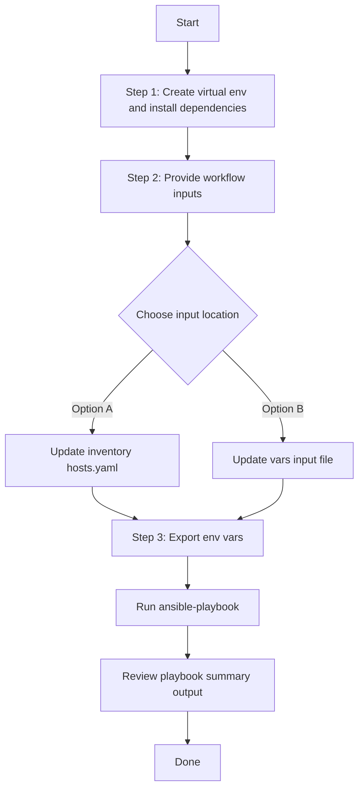

# ISE Radius Integration Config Generator

## Table of Contents

- [User Flow (3 Steps)](#user-flow-3-steps)

- [Overview](#overview)
- [Features](#features)
- [Prerequisites](#prerequisites)
- [Workflow Structure](#workflow-structure)
- [Schema Parameters](#schema-parameters)
- [Getting Started](#getting-started)
- [Operations](#operations)
- [Examples](#examples)---

## Overview

The ISE Radius Integration config generator automates YAML playbook generation for existing authentication and policy server configurations in Cisco Catalyst Center. It generates output compatible with `ise_radius_integration_workflow_manager`.

---

## Features

- **Configuration Generation**: Generate YAML configurations compatible with `ise_radius_integration_workflow_manager`.
  - Extract existing authentication policy servers.
  - Convert API responses into workflow-manager-ready YAML.
  - Reuse generated files for backup, migration, and audit.
- **Component Filtering**: Generate `authentication_policy_server` selectively.
- **Server Filtering**: Filter by `server_type` and/or `server_ip_address`.
- **Flexible Output**: Supports custom `file_path` and `file_mode` (`overwrite` / `append`).
- **Brownfield Discovery**: Omit `config` to generate all server configurations.

---

## Prerequisites

### Software Requirements

| Component | Version |
|-----------|---------|
| Ansible | 2.13+ |
| cisco.dnac collection | 6.49.0+ |
| Python | 3.9+ |
| Cisco Catalyst Center | 2.3.7.9+ |
| dnacentersdk | 2.10.10+ |

### Required Collections

```bash
ansible-galaxy collection install cisco.dnac
ansible-galaxy collection install ansible.utils
pip install dnacentersdk
pip install yamale
```

### Access Requirements

- Catalyst Center credentials with system settings API access
- Network connectivity to Catalyst Center
- Existing authentication policy server entries (for targeted export use cases)

---

## Workflow Structure

```
ise_radius_integration_config_generator/
├── playbook/
│   └── ise_radius_integration_config_generator.yml   # Main operations
├── vars/
│   └── ise_radius_integration_config_inputs.yml      # Input examples
├── schema/
│   └── ise_radius_integration_config_schema.yml      # Input validation
└── README.md
```

---

## Schema Parameters

### Top-Level Parameters

| Parameter | Type | Required | Default | Description |
|-----------|------|----------|---------|-------------|
| `file_path` | string | No | auto-generated | Output file path for generated YAML |
| `file_mode` | string | No | `overwrite` | File write mode: `overwrite` or `append` |
| `config` | dict | No | omitted | Module config dictionary passed to `ise_radius_integration_playbook_config_generator` |

### Config Filters (`config.component_specific_filters`)

| Parameter | Type | Required | Description |
|-----------|------|----------|-------------|
| `component_specific_filters` | dict | Yes (when `config` provided) | N/A | Required when `config` is provided. Filters to specify which components to include. |
| `components_list` | list[string] | No | Supported value: `authentication_policy_server` |
| `authentication_policy_server` | dict | No | Server filters (`server_type`, `server_ip_address`) |

**Component Logic Rules:**
- **No `config`**: All components are retrieved (equivalent to authentication_policy_server)
- **`config` provided**: `component_specific_filters` is mandatory
- **Component filter blocks provided** (e.g., `authentication_policy_server`): Those components are automatically added to `components_list` when missing
- **No component filter blocks**: `components_list` is required and must not be empty

**Valid Component Types:**
- `authentication_policy_server`: Authentication policy server details

### Server Type Values

- `AAA`
- `ISE`

### Authentication Policy server Configuration Filters

| Parameter | Type | Required | Description |
|-----------|--------|-------------|----------------|
| server_type | string | False | Filter by specific server type(ISE, AAA) |
| server_ip_address | string | False | Filter by specific IP address of the server |

---

## Getting Started

## Workflow Steps
## User Flow (3 Steps)



### Installation and Run (Aligned)

1. Create and activate a Python virtual environment, then install dependencies.

```bash
python3 -m venv .venv
source .venv/bin/activate
pip install -r requirements.txt
ansible-galaxy collection install cisco.dnac --force
```

2. Provide workflow inputs in either inventory (`inventory/demo_lab/hosts.yaml`) or the workflow `vars/` file.

3. Export Catalyst Center environment variables and run the playbook.

```bash
export HOSTIP=<catalyst-center-ip-or-fqdn>
export CATALYST_CENTER_USERNAME=<username>
export CATALYST_CENTER_PASSWORD='<password>'
ansible-playbook -i ./inventory/demo_lab/hosts.yaml ./workflows/ise_radius_integration_config_generator/playbook/ise_radius_integration_config_generator.yml -vvvv
```


## Operations

### 1.Generate Operations (state: gathered)

Use `ise_radius_integration_config_generator.yml` for generating YAML playbook configuration operations.

**Description**: Retrieves all policy servers config from Catalyst Center regardless of any filters.

```yaml
# No config at all - only Catalyst Center connection details
# Expected: defaults to generates all configs
 - name: No config provided
   cisco.dnac.ise_radius_integration_playbook_config_generator:
    <<: *common_config
    file_path: "generated_file/complete_policy_servers_config.yml"
```

#### 2.Component-Specific Generation

**Description**: Generates configuration for specific policy servers.

**Extract Authentication policy server**

```yaml
 - name: No config provided
   cisco.dnac.ise_radius_integration_playbook_config_generator:
    <<: *common_config
    file_path: "generated_file/policy_server_config.yml"
    component_specific_filters:
      components_list: ["authentication_policy_server"]
      authentication_policy_server:
        - server_type: "ISE"
```

**Validate and Execute:**

```bash
# Validate
./tools/validate.sh -s workflows/ise_radius_integration_config_generator/schema/ise_radius_integration_config_schema.yml \
  -d workflows/ise_radius_integration_config_generator/vars/ise_radius_integration_config_input.yml
```

Return result validate:
```bash
(pyats-rafeek) [mabdulk2@st-ds-4 dnac_ansible_workflows]$ ./tools/validate.sh -s workflows/ise_radius_integration_config_generator/schema/ise_radius_integration_config_schema.yml \
> -d workflows/ise_radius_integration_config_generator/vars/ise_radius_integration_config_input.yml
workflows/ise_radius_integration_config_generator/schema/assurance_issue_config_schema.yml
workflows/ise_radius_integration_config_generator/vars/ise_radius_integration_config_input.yml
yamale -s workflows/ise_radius_integration_config_generator/schema/assurance_issue_config_schema.yml workflows/ise_radius_integration_config_generator/vars/ise_radius_integration_config_input.yml
Validating workflows/ise_radius_integration_config_generator/vars/ise_radius_integration_config_input.yml...
Validation success! 👍
```

```bash
# Execute
ansible-playbook -i inventory/demo_lab/hosts.yaml \
  workflows/ise_radius_integration_config_generator/playbook/ise_radius_integration_config_generator.yml \
  --extra-vars VARS_FILE_PATH=./workflows/ise_radius_integration_config_generator/vars/ise_radius_integration_config_input.yml
```

Expected Terminal Output:

1. Generate All Configurations

```code
    file_path: generated_file/complete_assurance_issue_config.yml

    "msg": {
        "components_processed": 1,
        "components_skipped": 0,
        "configurations_count": 1,
        "file_mode": "overwrite",
        "file_path": "tmp/ise_radius_integration_config_without_config.yml",
        "message": "YAML configuration file generated successfully for module 'ise_radius_integration_workflow_manager'",
        "status": "success"
    },
    "response": {
        "components_processed": 1,
        "components_skipped": 0,
        "configurations_count": 1,
        "file_mode": "overwrite",
        "file_path": "tmp/ise_radius_integration_config_without_config.yml",
        "message": "YAML configuration file generated successfully for module 'ise_radius_integration_workflow_manager'",
        "status": "success"
    },
    "status": "success"
```

2. Component Specific Generation:

a. Authentication policy server Filter:

```code
  config:
    component_specific_filters:
        components_list:
            - authentication_policy_server
        authentication_policy_server:
            - server_ip_address: 204.192.1.252
  file_path: tmp/ise_radius_integration_config_with_server_ip_filter.yml
  file_mode: overwrite

    "msg": {
        "components_processed": 1,
        "components_skipped": 0,
        "configurations_count": 1,
        "file_mode": "overwrite",
        "file_path": "tmp/ise_radius_integration_config_with_server_ip_filter.yaml",
        "message": "YAML configuration file generated successfully for module 'ise_radius_integration_workflow_manager'",
        "status": "success"
    },
    "response": {
        "components_processed": 1,
        "components_skipped": 0,
        "configurations_count": 1,
        "file_mode": "overwrite",
        "file_path": "tmp/ise_radius_integration_config_with_server_ip_filter.yaml",
        "message": "YAML configuration file generated successfully for module 'ise_radius_integration_workflow_manager'",
        "status": "success"
    },
    "status": "success"
```

---

## Examples

### Example 1: Generate all authentication policy server configurations

```yaml
- name: Generate all authentication policy server configurations
  cisco.dnac.ise_radius_integration_playbook_config_generator:
     <<: *common_config
    file_path: "ise_radius_integration_config_with_server_ip_filter.yml"
    file_mode: "overwrite"
```

### Example 2: Filter by ISE server type

```yaml
ise_radius_integration_config:
  - file_path: "/tmp/ise_radius_server_type_ise.yml"
    config:
      component_specific_filters:
        components_list: ["authentication_policy_server"]
        authentication_policy_server:
          server_type: "ISE"
```

### Example 3: Filter by AAA server IP

```yaml
ise_radius_integration_config:
  - file_path: "/tmp/ise_radius_server_specific.yml"
    config:
      component_specific_filters:
        components_list: ["authentication_policy_server"]
        authentication_policy_server:
          server_type: "AAA"
          server_ip_address: "10.100.10.50"
```
---

## Notes

- `ise_radius_integration_playbook_config_generator` expects `config` as a dictionary when filters are used.
- This workflow omits `config` when filters are absent, which triggers full generation mode.
- If `authentication_policy_server` filter is provided without `components_list`, the module auto-populates `components_list` internally.
