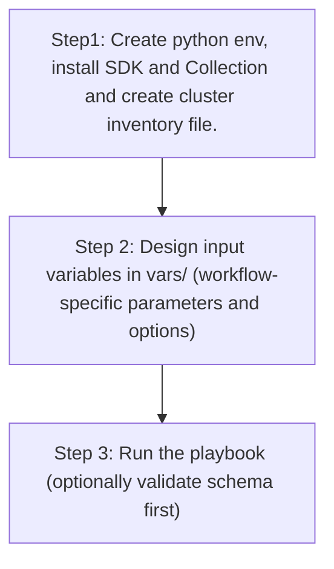

# ISE Radius Integration Config Generator

## Table of Contents

- [User Flow (3 Steps)](#user-flow-3-steps)

- [Overview](#overview)
- [Features](#features)
- [Prerequisites](#prerequisites)
- [Workflow Structure](#workflow-structure)
- [Schema Parameters](#schema-parameters)
- [Getting Started](#getting-started)
- [Operations](#operations)
- [Examples](#examples)---

## Overview

The ISE Radius Integration config generator automates YAML playbook generation for existing authentication and policy server configurations in Cisco Catalyst Center. It generates output compatible with `ise_radius_integration_workflow_manager`.

---

## Features

- **Configuration Generation**: Generate YAML configurations compatible with `ise_radius_integration_workflow_manager`.
  - Extract existing authentication policy servers.
  - Convert API responses into workflow-manager-ready YAML.
  - Reuse generated files for backup, migration, and audit.
- **Component Filtering**: Generate `authentication_policy_server` selectively.
- **Server Filtering**: Filter by `server_type` and/or `server_ip_address`.
- **Flexible Output**: Supports custom `file_path` and `file_mode` (`overwrite` / `append`).
- **Brownfield Discovery**: Omit `config` (or use workflow convenience flag) to generate all server configurations.

---

## Prerequisites

### Software Requirements

| Component | Version |
|-----------|---------|
| Ansible | 2.13+ |
| cisco.dnac collection | 6.45.0+ |
| Python | 3.9+ |
| Cisco Catalyst Center | 2.3.7.9+ |
| dnacentersdk | 2.10.10+ |

### Required Collections

```bash
ansible-galaxy collection install cisco.dnac
ansible-galaxy collection install ansible.utils
pip install dnacentersdk
pip install yamale
```

### Access Requirements

- Catalyst Center credentials with system settings API access
- Network connectivity to Catalyst Center
- Existing authentication policy server entries (for targeted export use cases)

---

## Workflow Structure

```
ise_radius_integration_config_generator/
├── playbook/
│   └── ise_radius_integration_config_generator.yml   # Main operations
├── vars/
│   └── ise_radius_integration_config_inputs.yml      # Input examples
├── schema/
│   └── ise_radius_integration_config_schema.yml      # Input validation
└── README.md
```

---

## Schema Parameters

### Basic Configuration

| Parameter | Type | Required | Default | Description |
|-----------|------|----------|---------|-------------|
| `generate_all_configurations` | boolean | No | false | Workflow convenience flag. When true, playbook omits module `config` |
| `file_path` | string | No | auto-generated | Output file path for generated YAML |
| `file_mode` | string | No | `overwrite` | File write mode: `overwrite` or `append` |
| `component_specific_filters` | dict | No | omitted | Component and filters passed to module `config` |

### Component Filters

| Parameter | Type | Required | Description |
|-----------|------|----------|-------------|
| `components_list` | list[string] | No | Supported value: `authentication_policy_server` |
| `authentication_policy_server` | dict | No | Server filters (`server_type`, `server_ip_address`) |

### Server Type Values

- `AAA`
- `ISE`

---

## Getting Started

## Workflow Steps

## User Flow (3 Steps)



### Step 1: Configure Inventory

Example `inventory/demo_lab/hosts.yml`:

```yaml
catalyst_center_hosts:
  hosts:
    catalyst_center_primary:
      catalyst_center_host: 10.0.0.0
      catalyst_center_username: admin
      catalyst_center_password: "password"
      catalyst_center_port: 443
      catalyst_center_verify: false
      catalyst_center_version: 2.3.7.9
```

### Step 2: Configure Variables

Edit:
`workflows/ise_radius_integration_config_generator/vars/ise_radius_integration_config_inputs.yml`

```yaml
ise_radius_integration_config:
  - generate_all_configurations: true
    file_path: "/tmp/ise_radius_integration_complete_config.yml"
```

### Step 3: Validate Configuration

```bash
./tools/validate.sh -s workflows/ise_radius_integration_config_generator/schema/ise_radius_integration_config_schema.yml \
  -d workflows/ise_radius_integration_config_generator/vars/ise_radius_integration_config_inputs.yml
```

### Step 4: Execute Playbook

```bash
ansible-playbook -i inventory/demo_lab/hosts.yaml \
  workflows/ise_radius_integration_config_generator/playbook/ise_radius_integration_config_generator.yml \
  --extra-vars VARS_FILE_PATH=./workflows/ise_radius_integration_config_generator/vars/ise_radius_integration_config_inputs.yml \
  -vvvv
```

---

## Operations

### Generate Operations (state: gathered)

1. **Generate all authentication policy servers**
- Set `generate_all_configurations: true`.

2. **Generate by server type**
- Set `authentication_policy_server.server_type`.

3. **Generate a specific server**
- Set `authentication_policy_server.server_ip_address`.

4. **Append generated output**
- Set `file_mode: append`.

---

## Examples

### Example 1: Generate all authentication policy server configurations

```yaml
ise_radius_integration_config:
  - generate_all_configurations: true
    file_path: "/tmp/ise_radius_integration_complete_config.yml"
```

### Example 2: Filter by ISE server type

```yaml
ise_radius_integration_config:
  - file_path: "/tmp/ise_radius_server_type_ise.yml"
    component_specific_filters:
      components_list: ["authentication_policy_server"]
      authentication_policy_server:
        server_type: "ISE"
```

### Example 3: Filter by AAA server IP

```yaml
ise_radius_integration_config:
  - file_path: "/tmp/ise_radius_server_specific.yml"
    component_specific_filters:
      components_list: ["authentication_policy_server"]
      authentication_policy_server:
        server_type: "AAA"
        server_ip_address: "10.100.10.50"
```

---

## Notes

- `ise_radius_integration_playbook_config_generator` expects `config` as a dictionary when filters are used.
- This workflow omits `config` when filters are absent, which triggers full generation mode.
- If `authentication_policy_server` filter is provided without `components_list`, the module auto-populates `components_list` internally.
