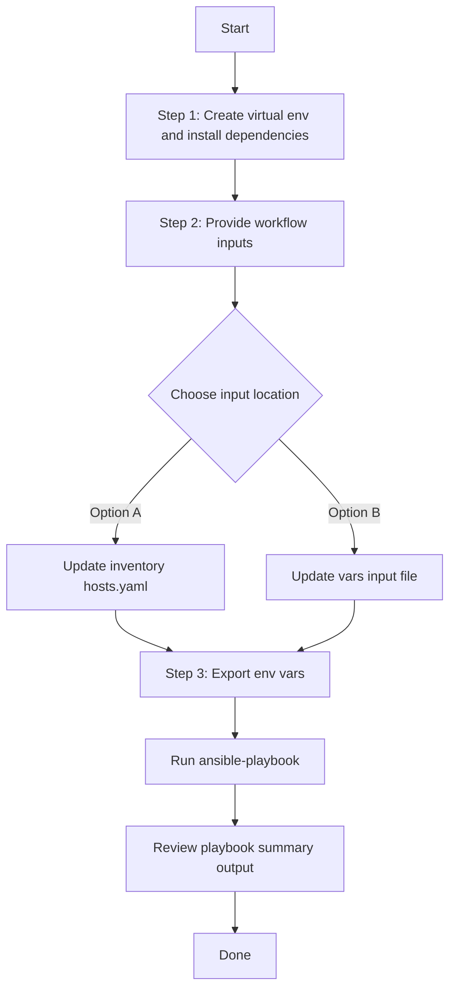

This Readme describes how to configure Security Groups, Access Contracts and Access Policies in ISE
# Identity Services Engine
    The SD-Access solution integrates Cisco TrustSec by supporting end-to-end group-based policy with Scalable Group Tags (SGTs).  Scalable Group Tags are a metadata value that is transmitted in the header of fabric-encapsulated packets.  While SGTs are administered by Cisco ISE through the tightly integrated REST APIs, Cisco DNA Center is used as the pane of glass to manage and create SGTs and define their policies.  Group and policy services are driven by ISE and orchestrated by Cisco DNA Center's policy authoring workflows.  Policy management with identity services is enabled in an SD-Access network using ISE integrated with Cisco DNA Center for dynamic mapping of users and devices to scalable groups.  This simplifies end-to-end security policy management and enforcement at a greater scale than traditional network policy implementations relying on IP access-lists.

# ISE Persona
    A Cisco ISE node can provide various services based on the persona that it assumes.  Personas are simply the services and specific feature set provided by a given ISE node.  The four primary personas are PAN, MnT, PSN, and pxGrid.

    This Playbook is best suited for the Policy Administration Node (PAN)

# Policy Administration Node (PAN)
    A Cisco ISE node with the Administration persona allows performs all administrative operations on Cisco ISE.  It handles all system-related configurations that are related to functionality such as authentication, authorization, and auditing.

    ISE supports standalone and distributed deployment models.  Multiple, distributed nodes can be deployed together to provide failover resiliency and scale.  The range of deployment options allows support for hundreds of thousands of endpoint devices. Minimally, a basic two-node ISE deployment is recommended for SD-Access single site deployments with each ISE node running all services (personas) for redundancy.

    SD-Access fabric nodes send authentication requests to the Policy Services Node (PSN) service persona running in ISE.  In the case of a standalone deployment, the PSN persona is referenced by a single IP address.  An ISE distributed model uses multiple, active PSN personas, each with a unique address.  All PSN addresses are learned by Cisco DNA Center, and the Cisco DNA Center user associates the fabric sites to the applicable PSN.

## ISE Catalyst Center Integration:
    This playbook assumes that a Catalyst Center and ISE Integration is already performed. If not yet that should be performed first. To perform Catalyst Center Ise Integration check the playbooks in [Catalyst Center ISE and AAA Servers Integration](./workflows/ise_radius_integration/#readme)
## Workflow Steps
## User Flow (3 Steps)



### Installation and Run (Aligned)

1. Create and activate a Python virtual environment, then install dependencies.

```bash
python3 -m venv .venv
source .venv/bin/activate
pip install -r requirements.txt
ansible-galaxy collection install cisco.catalystcenter:==2.6.0 --force
```

2. Provide workflow inputs in either inventory (`inventory/demo_lab/hosts.yaml`) or the workflow `vars/` file.

3. Export Catalyst Center environment variables and run the playbook.

```bash
export HOSTIP=<catalyst-center-ip-or-fqdn>
export CATALYST_CENTER_USERNAME=<username>
export CATALYST_CENTER_PASSWORD='<password>'
ansible-playbook -i ./inventory/demo_lab/hosts.yaml ./workflows/ise_sg_contracts_policies/playbook/ise_sg_contracts_policies_playbook.yml -vvvv
```
