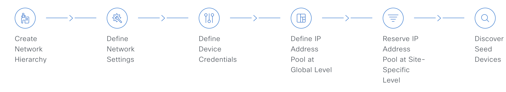
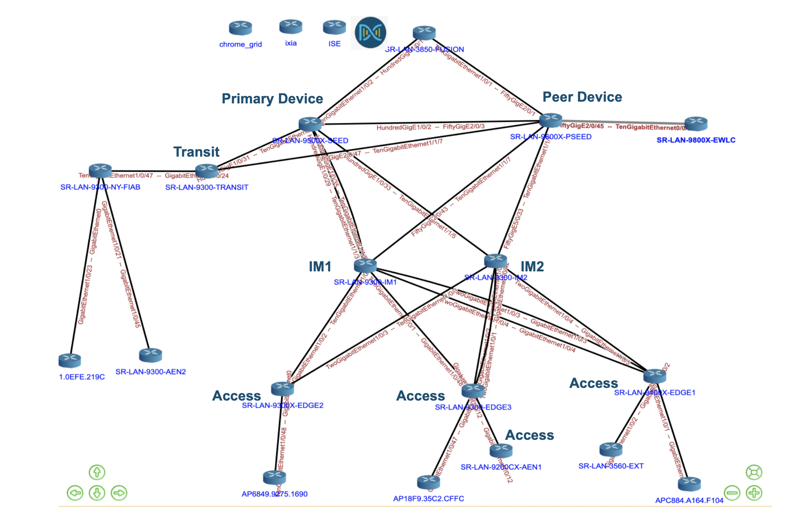
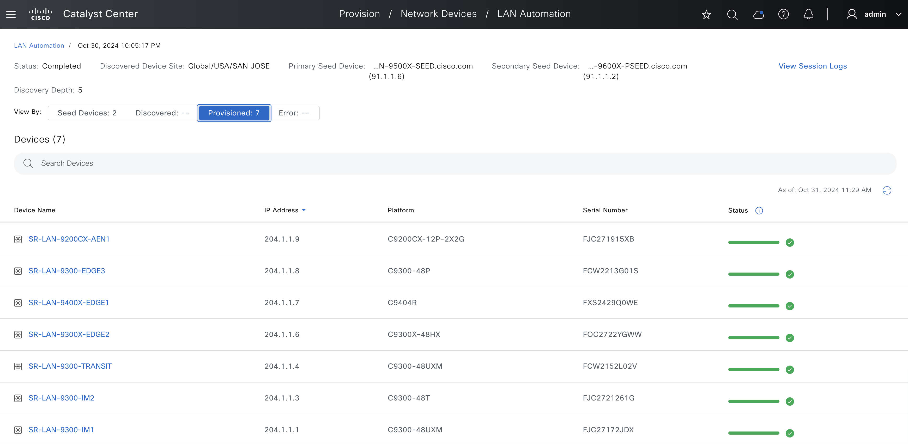

# Cisco Catalyst Center SD-Access LAN Automation

## LAN Automation and Device Update Guide

Cisco LAN automation streamlines network operations by automating the discovery, onboarding, and provisioning of new devices, which helps create a standardized, error-free underlay network. This approach leverages the IS-IS routing protocol to implement a Layer 3 routed access design, facilitating dynamic IP addressing and end-to-end routing topologies that enhance network performance and scalability.

To initiate LAN automation, the following prerequisites in Catalyst Center must be met:



Once these steps are complete, you can utilize the playbook below to **initiate LAN automation**, dynamically configuring and integrating devices into your network. This playbook offers a range of functionalities:

- **Configuring LAN Automation Sessions:** Automatically discover devices and integrate them into the Cisco Catalyst Center for seamless network management.

- **Automatic and Explicit Session Management:** Automatically stop ongoing LAN Automation sessions based on conditions such as timeout or the completion of the discovery device list. Additionally, you can explicitly stop LAN Automation sessions using the playbook when needed.

- **Updating Device Configurations:** Effortlessly update configurations for LAN automated devices, including loopback addresses, hostnames, and link settings, ensuring your network remains efficient and up-to-date.


By leveraging this playbook, you can ensure a robust, efficient, and fully integrated network environment.


## Configuration Steps to Start LAN Automation
### 1. Prepare Your Ansible Environment:
Ensure that Ansible is installed on your system. If it isn't, please refer to the official Ansible installation guide specific to your operating system for step-by-step instructions.  
Next, verify that you have stable network connectivity to your Catalyst Center instance to ensure smooth communication between Ansible and the Catalyst Center.  
Once these prerequisites are met, clone the project repository along with the necessary playbooks by executing the following command in your terminal:  
```bash
git clone git@github.com:cisco-en-programmability/catalyst-center-ansible-iac.git
```

### 2. Configure Host Inventory:

The `host_inventory_dnac1/hosts.yml` file is essential for establishing connectivity to your Catalyst Center instance, as it contains all the necessary connection details, including the IP address, credentials, and other relevant parameters. To ensure seamless operation, it is important to verify that the `dnac_version` specified in this file aligns with your actual Catalyst Center version, thereby avoiding any potential compatibility issues that could disrupt functionality.

Sample host_inventory_dnac1/hosts.yml

```bash
catalyst_center_hosts:
    hosts:
        catalyst_center220:
            dnac_host: xx.xx.xx.xx.
            dnac_password: XXXXXXXX
            dnac_port: 443
            dnac_timeout: 60
            dnac_username: admin
            dnac_verify: false
            dnac_version: 2.3.7.6
            dnac_debug: true
            dnac_log_level: INFO
            dnac_log: true
```

### 3. Define LAN Automation Playbook Input:
This example topology illustrates a setup with a primary (or seed) device and a peer device, both initially discovered in Catalyst Center. A LAN Automation session will be initiated to discover and onboard all specified devices within the topology, including transit, IM1, IM2, and four access devices. Devices are LAN automated up to the specified level below the primary seed device which in this case is 4. The default value for discovery depth is 2 and the maximum value is 5.




Based on this setup, we’ll use the input file located at *workflows/lan_automation/vars/lan_automation_workflow_inputs.yml* to launch the LAN Automation session, streamlining network configuration and onboarding.

```bash
---
#Select Catalyst Cennter version, this one overwrite the default version from host file
catalyst_center_version: 2.3.7.6
# This file contains the variables for the LAN Automation workflow

lan_automation_details:
  lan_automation_session:
    - lan_automation:
        discovered_device_site_name_hierarchy: "Global/USA/SAN JOSE"
        peer_device_management_ip_address: "91.1.1.2"
        primary_device_management_ip_address: "91.1.1.6"
        primary_device_interface_names:
          - "HundredGigE1/0/2"
          - "HundredGigE1/0/29"
          - "HundredGigE1/0/35"
          - "HundredGigE1/0/33"
          - "HundredGigE1/0/31"
        ip_pools:
          - ip_pool_name: "underlay_sub"
            ip_pool_role: "MAIN_POOL"
          - ip_pool_name: "underlay_sub_small"
            ip_pool_role: "PHYSICAL_LINK_POOL"
        multicast_enabled: true
        redistribute_isis_to_bgp: true
        host_name_prefix: null
        isis_domain_pwd: "cisco"
        discovery_level: 4
        discovery_timeout: 40
        discovery_devices:
          - device_serial_number: "FJC27172JDX"
            device_host_name: "SR-LAN-9300-IM1"
            device_site_name_hierarchy: "Global/USA/SAN JOSE/BLD23"
            device_management_ip_address: "204.1.1.3"
          - device_serial_number: "FJC2721261G"
            device_host_name: "SR-LAN-9300-IM2"
            device_site_name_hierarchy: "Global/USA/SAN JOSE/BLD20"
            device_management_ip_address: "204.1.1.1"
          - device_serial_number: "FCW2152L02V"
            device_host_name: "SR-LAN-9300-TRANSIT"
            device_management_ip_address: "204.1.1.4"
            device_site_name_hierarchy: "Global/USA/SAN JOSE/BLD23"
          - device_serial_number: "FXS2429Q0WE"
            device_host_name: "SR-LAN-9400X-EDGE1"
            device_management_ip_address: "204.1.1.6"
            device_site_name_hierarchy: "Global/USA/SAN JOSE/BLD20/BLD20_FLOOR1"
          - device_serial_number: "FOC2722YGWW"
            device_host_name: "SR-LAN-9300X-EDGE2"
            device_management_ip_address: "204.1.1.8"
            device_site_name_hierarchy: "Global/USA/SAN JOSE/BLD20/BLD20_FLOOR1"
          - device_serial_number: "FCW2213G01S"
            device_host_name: "SR-LAN-9300-EDGE3"
            device_management_ip_address: "204.1.1.7"
            device_site_name_hierarchy: "Global/USA/SAN JOSE/BLD23/FLOOR1_LEVEL1"
          - device_serial_number: "FJC271915XB"
            device_host_name: "SR-LAN-9200CX-AEN1"
            device_management_ip_address: "204.1.1.9"
            device_site_name_hierarchy: "Global/USA/SAN JOSE/BLD23/FLOOR1_LEVEL1"
        launch_and_wait: false
```
Note:
    For comprehensive instructions on the available options and the respective structure, refer to the full workflow specification at:                 
    https://galaxy.ansible.com/ui/repo/published/cisco/dnac/content/module/lan_automation_workflow_manager

### 4. Execute the playbook

To ensure a successful execution of the playbooks with your specified inputs and inventory, follow these steps:

##### Input Validation:

Before executing the playbook, it is essential to validate the input schema. This step ensures that all required parameters are included and correctly formatted. Run the following command *./tools/validate.sh -s* to perform the validation providing the schema path -d and the input path.

```bash
./tools/validate.sh -s /Users/majlona/dnac_ansible_workflows/workflows/lan_automation/schema/lan_automation_workflow_schema.yml -d /Users/majlona/dnac_ansible_workflows/workflows/lan_automation/vars/lan_automation_workflow_inputs.yml
```

##### Running the Playbook:

Once the input validation is complete and no errors are found, you can run the playbook. Provide your input file path using the --e variable as VARS_FILE_PATH:

```bash
    ansible-playbook -i host_inventory_dnac1/hosts.yml workflows/lan_automation/playbook/lan_automation_workflow_playbook.yml --e VARS_FILE_PATH=/Users/majlona/dnac_ansible_workflows/workflows/lan_automation/vars/lan_automation_workflow_inputs.yml -vvv 
```

If there is an error in the input or an issue with the API call during execution, the playbook will halt and display the relevant error details.

##### Post-Execution Monitoring:

After executing the playbook, check the Catalyst Center UI to monitor the progress of the LAN Automation session. If *debug_log* is enabled, you can also review the logs for detailed information on operations performed and any updates made.

### 5. Verify LAN Automation Session in Catalyst Center

To verify LAN Automation session was executed successfully, we can check Catalyst Center under Provision -> LAN Automation tab. 




## Configuration Steps to Stop LAN Automation
### 1. Define Stop LAN Automation Playbook Input

To stop an ongoing LAN Automation session, you’ll need to specify the IP address of the primary seed device.

Use the input file located at *workflows/lan_automation/vars/lan_automation_workflow_inputs.yml*, and provide the following sample input with the corresponding primary device IP address to initiate the stop command for the LAN Automation session. This ensures that the correct session is targeted and halted promptly.

```bash
---
#Select Catalyst Cennter version, this one overwrite the default version from host file
catalyst_center_version: 2.3.7.6
# This file contains the variables for the LAN Automation workflow

lan_automation_details:
  lan_automation_session:
    - lan_automation:
        discovered_device_site_name_hierarchy: "Global/USA/SAN JOSE"
        primary_device_management_ip_address: "91.1.1.6"
```
### 4. Execute the playbook

To ensure a successful execution of the playbooks with your specified inputs and inventory, follow these steps:

##### Running the Playbook:

To run the playbook, provide your input file path using the --e variable as VARS_FILE_PATH:

```bash
    ansible-playbook -i host_inventory_dnac1/hosts.yml workflows/lan_automation/playbook/stop_lan_automation_workflow_playbook.yml --e VARS_FILE_PATH=/Users/majlona/dnac_ansible_workflows/workflows/lan_automation/vars/lan_automation_workflow_inputs.yml -vvv 
```

If there is an error in the input or an issue with the API call during execution, the playbook will halt and display the relevant error details.

##### Post-Execution Monitoring:

After executing the playbook, check the Catalyst Center UI under Provision -> LAN Automation tab to monitor the stopping of LAN Automation session. If *debug_log* is enabled, you can also review the logs for detailed information on operations performed.

## Configuration Steps to Update LAN Automated devices

Updating LAN Automated devices should be performed only after successfully completing a LAN Automation session.

### 1. Edit Loopback IP of LAN Automated Devices

You can customize the loopback IP address of devices that are discovered through LAN automation using the reserved IP address pools of the type LAN.

Note: 
      *To edit the loopback IP address of a device on Day-n, the device must be in the Managed state in the Inventory.
      You can edit the loopback IP addresses of a maximum of 25 devices in a single Day-n workflow.*

Before you begin, discover devices thorugh LAN Automation and reserve the required IP address pools of the type LAN.

#### Define Loopback IP Update for Playbook Input

To update the loopback IP addresses of LAN Automated devices, you need to provide each device's current IP address along with the new loopback0 IP address. For updating multiple devices, supply a list of all target devices, and make sure they are in a Managed state in the Inventory.

Below is a sample input for the playbook.

```bash
lan_automation_details:  
  device_update:
    - lan_automated_device_update:
        loopback_update_device_list:
          - device_management_ip_address: "204.1.2.13"
            new_loopback0_ip_address: "204.1.1.20"
          - device_management_ip_address: "204.1.1.23"
            new_loopback0_ip_address: "204.1.1.11"

```
#### Execute the playbook

To ensure a successful execution of the playbooks with your specified inputs and inventory, follow these steps:

##### Input Validation:

Before executing the playbook, it is essential to validate the input schema. This step ensures that all required parameters are included and correctly formatted. Run the following command *./tools/validate.sh -s* to perform the validation providing the schema path -d and the input path.

```bash
./tools/validate.sh -s /Users/majlona/dnac_ansible_workflows/workflows/lan_automation/schema/lan_automation_workflow_schema.yml -d /Users/majlona/dnac_ansible_workflows/workflows/lan_automation/vars/lan_automated_device_update_inputs.yml
```

##### Running the Playbook:

Once the input validation is complete and no errors are found, you can run the playbook. Provide your input file path using the --e variable as VARS_FILE_PATH:

```bash
    ansible-playbook -i host_inventory_dnac1/hosts.yml workflows/lan_automation/playbook/lan_automation_workflow_playbook.yml --e VARS_FILE_PATH=/Users/majlona/dnac_ansible_workflows/workflows/lan_automation/vars/lan_automated_device_update_inputs.yml -vvv 
```

If there is an error in the input or an issue with the API call during execution, the playbook will halt and display the relevant error details.

##### Post-Execution Monitoring:

After executing the playbook, check the Catalyst Center UI to monitor the progress of the loopback IP updates. If *debug_log* is enabled, you can also review the logs for detailed information on operations performed and any updates made.

### 2. Edit Hostname of LAN Automated Devices
You can customize the hostname of devices that are discovered through LAN automation.

Note: 
      *To edit the loopback IP address of a device on Day-n, the device must be in the Managed state in the Inventory.*

#### Define Hostname Update Playbook Input

To update the hostname of LAN Automated devices, you need to provide each device's current IP address along with the new hostname. For updating multiple devices, supply a list of all target devices, and make sure they are in a Managed state in the Inventory.

Below is a sample input for the playbook.

```bash
lan_automation_details:  
  device_update:
    - lan_automated_device_update:
        loopback_update_device_list:
          - device_management_ip_address: "204.1.1.5"
            new_host_name: "SR-LAN-9400X-EDGE1"
          - device_management_ip_address: "204.1.1.7"
            new_host_name: "SR-LAN-9400X-EDGE2"
```
#### Execute the playbook

To ensure a successful execution of the playbooks with your specified inputs and inventory, follow these steps:

##### Input Validation:

Before executing the playbook, it is essential to validate the input schema. This step ensures that all required parameters are included and correctly formatted. Run the following command *./tools/validate.sh -s* to perform the validation providing the schema path -d and the input path.

```bash
./tools/validate.sh -s /Users/majlona/dnac_ansible_workflows/workflows/lan_automation/schema/lan_automation_workflow_schema.yml -d /Users/majlona/dnac_ansible_workflows/workflows/lan_automation/vars/lan_automated_device_update_inputs.yml
```

##### Running the Playbook:

Once the input validation is complete and no errors are found, you can run the playbook. Provide your input file path using the --e variable as VARS_FILE_PATH:

```bash
    ansible-playbook -i host_inventory_dnac1/hosts.yml workflows/lan_automation/playbook/lan_automation_workflow_playbook.yml --e VARS_FILE_PATH=/Users/majlona/dnac_ansible_workflows/workflows/lan_automation/vars/lan_automated_device_update_inputs.yml -vvv 
```

If there is an error in the input or an issue with the API call during execution, the playbook will halt and display the relevant error details.

##### Post-Execution Monitoring:

After executing the playbook, check the Catalyst Center UI to monitor the progress of the hostname updates. If *debug_log* is enabled, you can also review the logs for detailed information on operations performed and any updates made.

### 3. Add/Delete link between LAN Automated Devices

You can create or delete a link between interfaces for LAN Automated devices.

#### Define Link Create/Delete Playbook Input

To create or delete a link between LAN Automated devices, provide the management IP address and interface details for each device. When creating a link, include the IP pool name; however, this is not needed for link deletion. For creating or deleting multiple links simultaneously, supply a list of all target devices, ensuring they are in a Managed state in the Inventory.

Below is a sample input for the playbook to create a link between two devices.

```bash
lan_automation_details:  
  device_update:
    - lan_automated_device_update:
        link_add:
            source_device_management_ip_address: "204.1.1.10"
            source_device_interface_name: "TwoGigabitEthernet1/0/20"
            destination_device_management_ip_address: "204.1.1.15"
            destination_device_interface_name: "GigabitEthernet1/0/2"
            ip_pool_name: "underlay_sub"
```

Below is a sample input for the playbook to delete a link between two devices.

```bash
lan_automation_details:  
  device_update:
    - lan_automated_device_update:
        link_delete:
            source_device_management_ip_address: "204.1.1.1"
            source_device_interface_name: "TwoGigabitEthernet1/0/5"
            destination_device_management_ip_address: "204.1.1.5"
            destination_device_interface_name: "GigabitEthernet1/0/12"
```

#### Execute the playbook

To ensure a successful execution of the playbooks with your specified inputs and inventory, follow these steps:

##### Input Validation:

Before executing the playbook, it is essential to validate the input schema. This step ensures that all required parameters are included and correctly formatted. Run the following command *./tools/validate.sh -s* to perform the validation providing the schema path -d and the input path.

```bash
./tools/validate.sh -s /Users/majlona/dnac_ansible_workflows/workflows/lan_automation/schema/lan_automation_workflow_schema.yml -d /Users/majlona/dnac_ansible_workflows/workflows/lan_automation/vars/lan_automated_device_update_inputs.yml
```

##### Running the Playbook:

Once the input validation is complete and no errors are found, you can run the playbook. Provide your input file path using the --e variable as VARS_FILE_PATH:

```bash
    ansible-playbook -i host_inventory_dnac1/hosts.yml workflows/lan_automation/playbook/lan_automation_workflow_playbook.yml --e VARS_FILE_PATH=/Users/majlona/dnac_ansible_workflows/workflows/lan_automation/vars/lan_automated_device_update_inputs.yml -vvv 
```

If there is an error in the input or an issue with the API call during execution, the playbook will halt and display the relevant error details.

##### Post-Execution Monitoring:

After executing the playbook, check the Catalyst Center UI to monitor the progress of the updates. If *debug_log* is enabled, you can also review the logs for detailed information on operations performed and any updates made.


