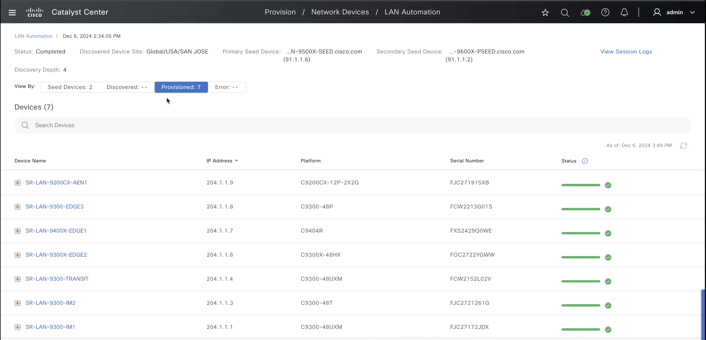
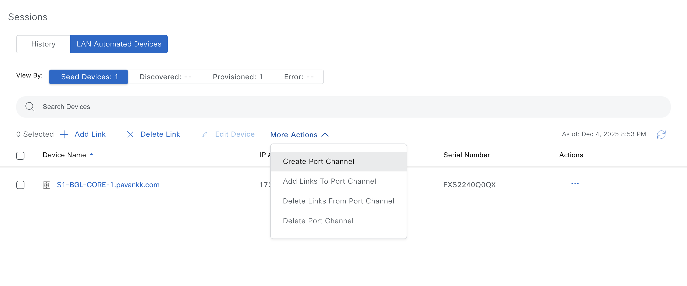
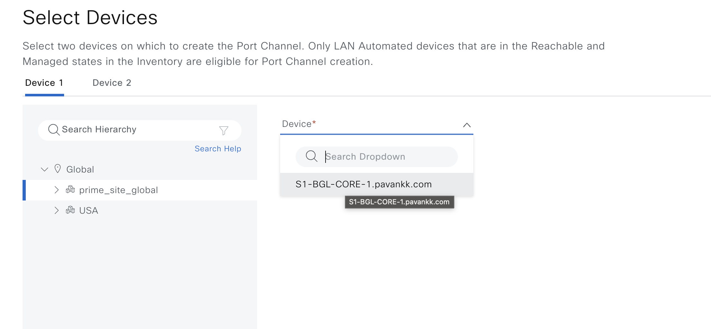
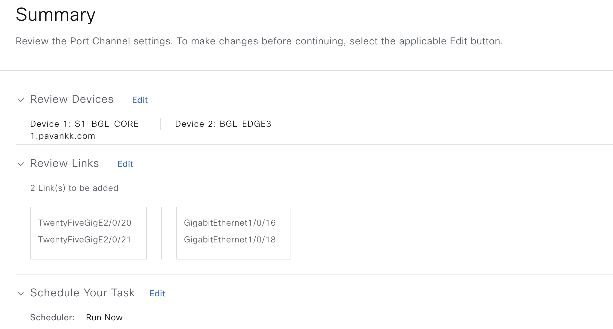
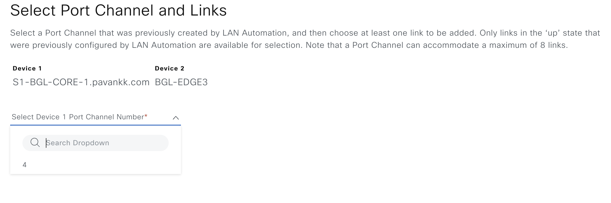
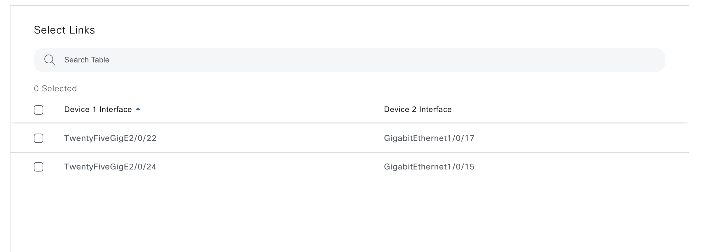
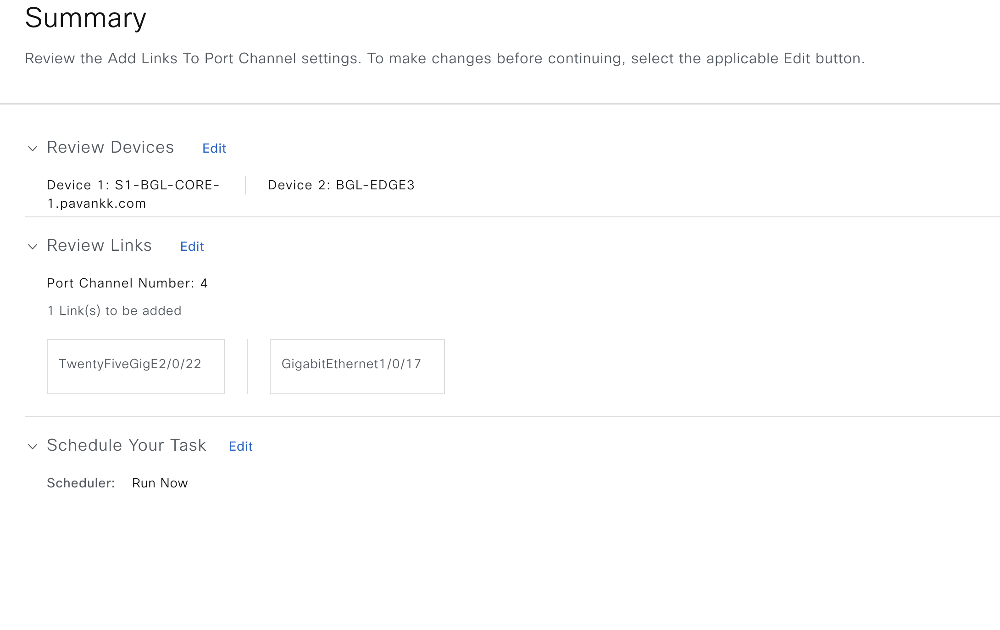
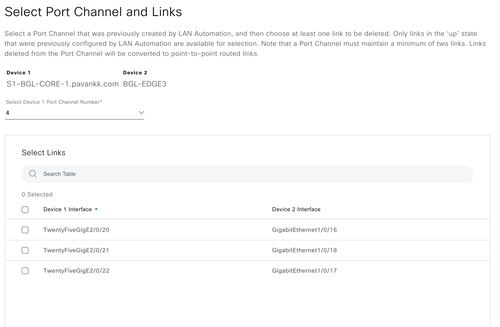

# Cisco Catalyst Center SD-Access LAN Automation Workflow Playbooks

**Overview**

This module provides a comprehensive toolkit for automating LAN network operations in *Cisco Catalyst Center*. It streamlines network operations by automating the discovery, onboarding, and provisioning of new devices, helping create a standardized, error-free underlay network. This approach leverages the IS-IS routing protocol to implement a Layer 3 routed access design, facilitating dynamic IP addressing and end-to-end routing topologies that enhance network performance and scalability. Key features include:

- **LAN Automation Session Management**:  
  - **Configure** automated discovery sessions for seamless device integration into Cisco Catalyst Center.  
  - **Support** for automatic and explicit session management with timeout and device list-based completion.

- **Device Configuration Updates**:  
  - **Update** loopback addresses, hostnames, and link configurations for LAN automated devices.  
  - **Ensure** network efficiency and keep configurations up-to-date.

- **Link Management**:  
  - **Create** and **delete** links between LAN Automated devices.  
  - **Configure** interface connections with IP pool management.

- **Port Channel Management**:  
  - **Create**, **update**, and **delete** Port Channels between LAN Automated devices.  
  - **Aggregate** multiple physical links for increased bandwidth and redundancy.

---

## Prerequisites

To initiate LAN automation, the following prerequisites in Catalyst Center must be met:


**Required Prerequisites:**
1. **Site Hierarchy**: Define site structure in Catalyst Center (Global/Area/Building/Floor)
2. **IP Address Pools**: Reserve IP pools of type LAN for device management and link addressing
3. **Network Settings**: Configure network settings including AAA, NTP, DHCP, and DNS
4. **Device Discovery**: Ensure primary/seed device is already discovered in Catalyst Center
5. **Network Credentials**: Configure valid credentials for device access

---

## Demo Video

[](http://3.136.0.140/iac_demos/lan_auto/LAN_Automation_Workflow_Manager_Demo.mp4)

---

## Getting Started

### Step 1: Prepare Your Ansible Environment

Ensure that Ansible is installed on your system. If it isn't, please refer to the [official Ansible installation guide](https://docs.ansible.com/ansible/latest/installation_guide/index.html) specific to your operating system for step-by-step instructions.

**Environment Requirements:**
- **Ansible**: Version 2.9 or later
- **Python**: Version 3.9 or later
- **cisco.dnac Collection**: Version 6.20.0 or later
- **dnacentersdk**: Version 2.9.2 or later

**Clone the Repository:**

Next, verify that you have stable network connectivity to your Catalyst Center instance to ensure smooth communication between Ansible and the Catalyst Center. Once these prerequisites are met, clone the project repository along with the necessary playbooks by executing the following command in your terminal:

```bash
git clone git@github.com:cisco-en-programmability/catalyst-center-ansible-iac.git
cd catalyst-center-ansible-iac
```

---

### Step 2: Configure Host Inventory

The `host_inventory_dnac1/hosts.yml` file is essential for establishing connectivity to your Catalyst Center instance, as it contains all the necessary connection details, including the IP address, credentials, and other relevant parameters. To ensure seamless operation, it is important to verify that the `catalyst_center_version` specified in this file aligns with your actual Catalyst Center version, thereby avoiding any potential compatibility issues that could disrupt functionality.

**Sample host_inventory_dnac1/hosts.yml:**

```yaml
catalyst_center_hosts:
  hosts:
    catalyst_center220:
      catalyst_center_host: xx.xx.xx.xx
      catalyst_center_password: XXXXXXXX
      catalyst_center_port: 443
      catalyst_center_timeout: 60
      catalyst_center_username: admin
      catalyst_center_verify: false
      catalyst_center_version: 2.3.7.6
      catalyst_center_debug: true
      catalyst_center_log_level: INFO
      catalyst_center_log: true
```

**Key Parameters:**

| **Parameter**                   | **Description**                                                           | **Required** |
|---------------------------------|---------------------------------------------------------------------------|--------------|
| `catalyst_center_host`          | IP address or hostname of Catalyst Center                                 | Yes          |
| `catalyst_center_username`      | Username for authentication                                               | Yes          |
| `catalyst_center_password`      | Password for authentication                                               | Yes          |
| `catalyst_center_version`       | Catalyst Center software version (must match actual version)              | Yes          |
| `catalyst_center_port`          | HTTPS port for API communication (default: 443)                           | No           |
| `catalyst_center_verify`        | SSL certificate verification (true/false)                                 | No           |
| `catalyst_center_debug`         | Enable debug logging (true/false)                                         | No           |
| `catalyst_center_log_level`     | Logging level (DEBUG, INFO, WARNING, ERROR, CRITICAL)                     | No           |

---

## Configuration Steps to Start LAN Automation

### Step 1: Understand the Topology

This example topology illustrates a setup with a primary (or seed) device and a peer device, both initially discovered in Catalyst Center. A LAN Automation session will be initiated to discover and onboard all specified devices within the topology, including transit, IM1, IM2, and four access devices. Devices are LAN automated up to the specified level below the primary seed device which in this case is 4. The default value for discovery depth is 2 and the maximum value is 5.


**Topology Components:**
- **Primary Seed Device**: Starting point for LAN automation (91.1.1.6)
- **Peer Device**: Secondary seed device for redundancy (91.1.1.2)
- **Discovery Devices**: 7 devices to be automatically discovered and onboarded
- **Site Hierarchy**: Devices distributed across multiple buildings and floors
- **Discovery Level**: 4 (devices discovered up to 4 hops from primary seed)

---

### Step 2: Define LAN Automation Playbook Input

Based on the topology setup, we'll use the input file located at `workflows/lan_automation/vars/lan_automation_workflow_inputs.yml` to launch the LAN Automation session, streamlining network configuration and onboarding.

**Sample Input File:**

```yaml
---
# Select Catalyst Center version, this one overwrites the default version from host file
catalyst_center_version: 2.3.7.6

# This file contains the variables for the LAN Automation workflow
lan_automation_details:
  lan_automation_session:
    - lan_automation:
        discovered_device_site_name_hierarchy: "Global/USA/SAN JOSE"
        peer_device_management_ip_address: "91.1.1.2"
        primary_device_management_ip_address: "91.1.1.6"
        primary_device_interface_names:
          - "HundredGigE1/0/2"
          - "HundredGigE1/0/29"
          - "HundredGigE1/0/35"
          - "HundredGigE1/0/33"
          - "HundredGigE1/0/31"
        ip_pools:
          - ip_pool_name: "underlay_sub"
            ip_pool_role: "MAIN_POOL"
          - ip_pool_name: "underlay_sub_small"
            ip_pool_role: "PHYSICAL_LINK_POOL"
        multicast_enabled: true
        redistribute_isis_to_bgp: true
        host_name_prefix: null
        isis_domain_pwd: "cisco"
        discovery_level: 4
        discovery_timeout: 40
        discovery_devices:
          - device_serial_number: "FJC27172JDX"
            device_host_name: "SR-LAN-9300-IM1"
            device_site_name_hierarchy: "Global/USA/SAN JOSE/BLD23"
            device_management_ip_address: "204.1.1.3"
          - device_serial_number: "FJC2721261G"
            device_host_name: "SR-LAN-9300-IM2"
            device_site_name_hierarchy: "Global/USA/SAN JOSE/BLD20"
            device_management_ip_address: "204.1.1.1"
          - device_serial_number: "FCW2152L02V"
            device_host_name: "SR-LAN-9300-TRANSIT"
            device_management_ip_address: "204.1.1.4"
            device_site_name_hierarchy: "Global/USA/SAN JOSE/BLD23"
          - device_serial_number: "FXS2429Q0WE"
            device_host_name: "SR-LAN-9400X-EDGE1"
            device_management_ip_address: "204.1.1.6"
            device_site_name_hierarchy: "Global/USA/SAN JOSE/BLD20/BLD20_FLOOR1"
          - device_serial_number: "FOC2722YGWW"
            device_host_name: "SR-LAN-9300X-EDGE2"
            device_management_ip_address: "204.1.1.8"
            device_site_name_hierarchy: "Global/USA/SAN JOSE/BLD20/BLD20_FLOOR1"
          - device_serial_number: "FCW2213G01S"
            device_host_name: "SR-LAN-9300-EDGE3"
            device_management_ip_address: "204.1.1.7"
            device_site_name_hierarchy: "Global/USA/SAN JOSE/BLD23/FLOOR1_LEVEL1"
          - device_serial_number: "FJC271915XB"
            device_host_name: "SR-LAN-9200CX-AEN1"
            device_management_ip_address: "204.1.1.9"
            device_site_name_hierarchy: "Global/USA/SAN JOSE/BLD23/FLOOR1_LEVEL1"
        launch_and_wait: false
```

> **Note**: For comprehensive instructions on the available options and the respective structure, refer to the full workflow specification at [Ansible Galaxy: LAN Automation Workflow Manager](https://galaxy.ansible.com/ui/repo/published/cisco/dnac/content/module/lan_automation_workflow_manager/)

---

### Step 3: Execute the Playbook

To ensure a successful execution of the playbooks with your specified inputs and inventory, follow these steps:

#### Input Validation

Before executing the playbook, it is essential to validate the input schema. This step ensures that all required parameters are included and correctly formatted. Run the following command to perform the validation:

```bash
./tools/validate.sh -s workflows/lan_automation/schema/lan_automation_workflow_schema.yml -d workflows/lan_automation/vars/lan_automation_workflow_inputs.yml
```

**Validation Output:**
- ✅ **Success**: "Validation passed" - proceed to playbook execution
- ❌ **Failure**: Review error messages and correct input file

#### Running the Playbook

Once the input validation is complete and no errors are found, you can run the playbook. Provide your input file path using the `--e` variable as `VARS_FILE_PATH`:

```bash
ansible-playbook -i host_inventory_dnac1/hosts.yml workflows/lan_automation/playbook/lan_automation_workflow_playbook.yml --e VARS_FILE_PATH=/path/to/workflows/lan_automation/vars/lan_automation_workflow_inputs.yml -vvv
```

> **Note**: If there is an error in the input or an issue with the API call during execution, the playbook will halt and display the relevant error details.

#### Post-Execution Monitoring

After executing the playbook, check the Catalyst Center UI to monitor the progress of the LAN Automation session. Navigate to **Provision > LAN Automation** to view session status and discovered devices.

**Monitoring Tips:**
- Enable `catalyst_center_debug: true` for detailed logs
- Review log files for troubleshooting information
- Monitor device discovery progress in real-time
- Verify device placement in correct site hierarchy

---

### Step 4: Verify LAN Automation Session

To verify the LAN Automation session was executed successfully, check Catalyst Center under **Provision > LAN Automation** tab.


**Verification Checklist:**
- ✅ Session status shows "Completed" or "In Progress"
- ✅ All expected devices are discovered
- ✅ Devices are placed in correct site hierarchy
- ✅ Device configurations are applied successfully
- ✅ No error messages in session details

---

## Configuration Steps to Stop LAN Automation

### Step 1: Define Stop LAN Automation Playbook Input

To stop an ongoing LAN Automation session, you'll need to specify the IP address of the primary seed device. Use the input file located at `workflows/lan_automation/vars/lan_automation_workflow_inputs.yml`, and provide the following sample input with the corresponding primary device IP address to initiate the stop command for the LAN Automation session.

**Sample Input for Stopping LAN Automation:**

```yaml
---
# Select Catalyst Center version, this one overwrites the default version from host file
catalyst_center_version: 2.3.7.6

# This file contains the variables for the LAN Automation workflow
lan_automation_details:
  lan_automation_session:
    - lan_automation:
        discovered_device_site_name_hierarchy: "Global/USA/SAN JOSE"
        primary_device_management_ip_address: "91.1.1.6"
```

> **Important**: Only the primary seed device IP address and site hierarchy are required to terminate the session. All other parameters are optional for stop operations.

---

### Step 2: Execute the Stop Playbook

To stop the LAN Automation session, run the stop playbook with your specified input:

#### Running the Stop Playbook

```bash
ansible-playbook -i host_inventory_dnac1/hosts.yml workflows/lan_automation/playbook/stop_lan_automation_workflow_playbook.yml --e VARS_FILE_PATH=/path/to/workflows/lan_automation/vars/lan_automation_workflow_inputs.yml -vvv
```

> **Note**: If there is an error in the input or an issue with the API call during execution, the playbook will halt and display the relevant error details.

#### Post-Execution Monitoring

After executing the playbook, check the Catalyst Center UI under **Provision > LAN Automation** tab to monitor the stopping of LAN Automation session. The session status should change to "Stopped" or "Completed".

**Stop Operation Verification:**
- Session status updates to "Stopped"
- No new devices are being discovered
- Ongoing device configurations are completed
- Session can be restarted if needed

---

## Configuration Steps to Update LAN Automated Devices

> **Important**: Updating LAN Automated devices should be performed only after successfully completing a LAN Automation session. All devices must be in **Managed** state in the Catalyst Center Inventory.

---

### 1. Edit Loopback IP of LAN Automated Devices

You can customize the loopback IP address of devices that are discovered through LAN automation using the reserved IP address pools of the type LAN.

**Prerequisites:**
- ✅ Devices must be in **Managed** state in the Inventory
- ✅ Maximum of **25 devices** can be updated in a single operation
- ✅ IP address pools of type **LAN** must be reserved in Catalyst Center
- ✅ New loopback IP addresses must be available in the LAN pool

#### Define Loopback IP Update Playbook Input

To update the loopback IP addresses of LAN Automated devices, you need to provide each device's current management IP address along with the new loopback0 IP address. For updating multiple devices, supply a list of all target devices.

**Sample Input:**

```yaml
---
catalyst_center_version: 2.3.7.6
catalyst_center_verify: false

lan_automation_details:  
  device_update:
    - lan_automated_device_update:
        loopback_update_device_list:
          - device_management_ip_address: "204.1.2.13"
            new_loopback0_ip_address: "204.1.1.20"
          - device_management_ip_address: "204.1.1.23"
            new_loopback0_ip_address: "204.1.1.11"
```

#### Execute the Playbook

##### Input Validation

Before executing the playbook, validate the input schema:

```bash
./tools/validate.sh -s workflows/lan_automation/schema/lan_automation_workflow_schema.yml -d workflows/lan_automation/vars/lan_automated_device_update_inputs.yml
```

##### Running the Playbook

Once validation is complete, run the playbook:

```bash
ansible-playbook -i host_inventory_dnac1/hosts.yml workflows/lan_automation/playbook/lan_automation_workflow_playbook.yml --e VARS_FILE_PATH=/path/to/workflows/lan_automation/vars/lan_automated_device_update_inputs.yml -vvv
```

##### Post-Execution Monitoring

After executing the playbook, verify the loopback IP updates:
- Check device configurations in Catalyst Center UI
- Verify new loopback IP addresses are applied
- Ensure devices remain in Managed state
- Review logs if `catalyst_center_debug` is enabled

---

### 2. Edit Hostname of LAN Automated Devices

You can customize the hostname of devices that are discovered through LAN automation.

**Prerequisites:**
- ✅ Devices must be in **Managed** state in the Inventory
- ✅ Hostnames must follow valid hostname conventions
- ✅ New hostnames must be unique within the network

#### Define Hostname Update Playbook Input

To update the hostname of LAN Automated devices, you need to provide each device's current management IP address along with the new hostname. For updating multiple devices, supply a list of all target devices.

**Sample Input:**

```yaml
---
catalyst_center_version: 2.3.7.6
catalyst_center_verify: false

lan_automation_details:  
  device_update:
    - lan_automated_device_update:
        hostname_update_devices:
          - device_management_ip_address: "204.1.1.5"
            new_host_name: "SR-LAN-9400X-EDGE1"
          - device_management_ip_address: "204.1.1.7"
            new_host_name: "SR-LAN-9400X-EDGE2"
```

#### Execute the Playbook

##### Input Validation

```bash
./tools/validate.sh -s workflows/lan_automation/schema/lan_automation_workflow_schema.yml -d workflows/lan_automation/vars/lan_automated_device_update_inputs.yml
```

##### Running the Playbook

```bash
ansible-playbook -i host_inventory_dnac1/hosts.yml workflows/lan_automation/playbook/lan_automation_workflow_playbook.yml --e VARS_FILE_PATH=/path/to/workflows/lan_automation/vars/lan_automated_device_update_inputs.yml -vvv
```

##### Post-Execution Monitoring

After executing the playbook, verify the hostname updates:
- Check device hostnames in Catalyst Center inventory
- Verify new hostnames are reflected in device configurations
- Ensure devices remain accessible with new hostnames
- Review logs for any update errors

---

### 3. Add/Delete Link Between LAN Automated Devices

You can create or delete a link between interfaces for LAN Automated devices.

**Prerequisites:**
- ✅ Both devices must be in **Managed** state
- ✅ Interfaces must be available and not already in use
- ✅ For link creation: IP pool of type **LAN** must be specified
- ✅ Interface names must match exact device nomenclature

#### Define Link Create Playbook Input

To create a link between LAN Automated devices, provide the management IP address and interface details for each device, along with the IP pool name for address allocation.

**Sample Input for Link Creation:**

```yaml
---
catalyst_center_version: 2.3.7.6
catalyst_center_verify: false

lan_automation_details:  
  device_update:
    - lan_automated_device_update:
        link_add:
          source_device_management_ip_address: "204.1.1.10"
          source_device_interface_name: "TwoGigabitEthernet1/0/20"
          destination_device_management_ip_address: "204.1.1.15"
          destination_device_interface_name: "GigabitEthernet1/0/2"
          ip_pool_name: "underlay_sub"
```

#### Define Link Delete Playbook Input

To delete a link between LAN Automated devices, provide the management IP address and interface details for each device. The IP pool name is not required for deletion.

**Sample Input for Link Deletion:**

```yaml
---
catalyst_center_version: 2.3.7.6
catalyst_center_verify: false

lan_automation_details:  
  device_update:
    - lan_automated_device_update:
        link_delete:
          source_device_management_ip_address: "204.1.1.1"
          source_device_interface_name: "TwoGigabitEthernet1/0/5"
          destination_device_management_ip_address: "204.1.1.5"
          destination_device_interface_name: "GigabitEthernet1/0/12"
```

#### Execute the Playbook

##### Input Validation

```bash
./tools/validate.sh -s workflows/lan_automation/schema/lan_automation_workflow_schema.yml -d workflows/lan_automation/vars/lan_automated_device_update_inputs.yml
```

##### Running the Playbook

```bash
ansible-playbook -i host_inventory_dnac1/hosts.yml workflows/lan_automation/playbook/lan_automation_workflow_playbook.yml --e VARS_FILE_PATH=/path/to/workflows/lan_automation/vars/lan_automated_device_update_inputs.yml -vvv
```

##### Post-Execution Monitoring

After executing the playbook, verify the link operations:
- Check topology view in Catalyst Center UI
- Verify links are created/deleted as expected
- Ensure interface configurations are correct
- Review logs for operation details

---

## Configuration Steps to Manage Port Channels for LAN Automated Devices

Port Channels aggregate multiple physical links between LAN Automated devices to provide increased bandwidth and redundancy. This functionality enables you to create, update, and delete Port Channel configurations between devices that have been discovered through LAN Automation.

### Prerequisites

Before managing Port Channels, ensure the following requirements are met:

- **LAN Automation Completion**: Devices must be discovered and onboarded through a successful LAN Automation session
- **Device State**: Both source and destination devices must be in **Reachable** and **Managed** state in Cisco Catalyst Center inventory
- **Device Identification**: At least one device identifier (management IP address, MAC address, or serial number) must be provided for both source and destination devices
- **Link Requirements**: Each Port Channel must maintain between **2 and 8 physical links**
- **Interface Availability**: Physical interfaces must be available and not already part of another Port Channel

**Important Notes:**
- When multiple device identifiers are provided, precedence order is: `serial_number` > `management_ip_address` > `mac_address`
- Physical links cannot be shared between multiple Port Channels
- Source and destination terminology is used for configuration consistency only; both devices function as equal peers
- Port Channel numbers are system-assigned during creation; user-provided values will be ignored

---
## Port Channel Configuration Schema

The following table outlines the parameters for Port Channel operations:

| **Parameter**                             | **Type**   | **Required** | **Default Value** | **Description**                                                                 |
|-------------------------------------------|------------|--------------|-------------------|---------------------------------------------------------------------------------|
| `port_channel`                            | List       | Yes          | `N/A`             | List of Port Channel configurations to create, update, or delete.              |

### Port Channel Configuration Parameters

| **Parameter**                               | **Type**   | **Required** | **Description**                                                                 |
|---------------------------------------------|------------|--------------|---------------------------------------------------------------------------------|
| `source_device_management_ip_address`       | String     | No*          | Management IP address of the source device. *At least one source device identifier required. |
| `source_device_mac_address`                 | String     | No*          | MAC address of the source device. *At least one source device identifier required. |
| `source_device_serial_number`               | String     | No*          | Serial number of the source device. *At least one source device identifier required. |
| `destination_device_management_ip_address`  | String     | No*          | Management IP address of the destination device. *At least one destination device identifier required for create/update. |
| `destination_device_mac_address`            | String     | No*          | MAC address of the destination device. *At least one destination device identifier required for create/update. |
| `destination_device_serial_number`          | String     | No*          | Serial number of the destination device. *At least one destination device identifier required for create/update. |
| `port_channel_number`                       | Integer    | No           | System-assigned Port Channel number. Used for update/delete operations to identify specific Port Channel. |
| `links`                                     | List       | Yes**        | List of physical interface links to include in the Port Channel. **Required for create operations. |

### Link Configuration Parameters (`links`)

| **Parameter**         | **Type**   | **Required** | **Description**                                                                 |
|-----------------------|------------|--------------|---------------------------------------------------------------------------------|
| `source_port`         | String     | Yes          | Interface name on the source device (e.g., 'GigabitEthernet1/0/1').            |
| `destination_port`    | String     | Yes          | Interface name on the destination device (e.g., 'GigabitEthernet2/0/1').       |

---

## Important Notes for Port Channel Management

### Device Requirements
- **Both devices must be LAN Automated**: Devices must have been discovered and onboarded through LAN Automation
- **Device State**: Both source and destination devices must be in **Reachable** and **Managed** state in Cisco Catalyst Center inventory
- **Device Identification**: When multiple identifiers are provided, precedence order is `serial_number` > `management_ip_address` > `mac_address`

### Port Channel Constraints
- **Link Range**: Each Port Channel must maintain between **2 and 8 physical links**
- **Link Isolation**: Physical links cannot be shared between multiple Port Channels
- **Minimum Links**: Operations that would result in fewer than 2 links will fail validation or automatically delete the Port Channel

### Identification Methods
- **For Updates**: Use either existing link specifications OR `port_channel_number` parameter
  - When both are provided, `port_channel_number` takes precedence
  - Using `port_channel_number` eliminates the need to specify existing links
- **For Deletion**: Behavior varies based on provided parameters:
  - With `port_channel_number`: Deletes only that specific Port Channel
  - With both endpoints, no `port_channel_number`: Deletes all Port Channels between those devices
  - With only source endpoint: Deletes all Port Channels from that source device

### 1. Create Port Channels

You can create Port Channels between two LAN Automated devices using different device identification methods.

#### Define Port Channel Creation Playbook Input

To create a Port Channel, provide device identifiers for both source and destination devices along with the list of physical interface links to aggregate.

##### Example 1: Create Port Channel using Management IP Addresses

```yaml



---
catalyst_center_version: 3.1.3
catalyst_center_verify: false

lan_automation_details:
  port_channel:
    - source_device_management_ip_address: "10.1.1.1"
      destination_device_management_ip_address: "20.1.1.1"
      links:
        - source_port: "GigabitEthernet1/0/1"
          destination_port: "GigabitEthernet2/0/1"
        - source_port: "GigabitEthernet1/0/2"
          destination_port: "GigabitEthernet2/0/2"
```

##### Example 2: Create Port Channel using MAC Addresses

```yaml
---
catalyst_center_version: 3.1.3
catalyst_center_verify: false

lan_automation_details:
  port_channel:
    - source_device_mac_address: "aa:bb:cc:dd:ee:01"
      destination_device_mac_address: "aa:bb:cc:dd:ee:02"
      links:
        - source_port: "TenGigabitEthernet1/0/1"
          destination_port: "TenGigabitEthernet1/0/1"
        - source_port: "TenGigabitEthernet1/0/2"
          destination_port: "TenGigabitEthernet1/0/2"
```

##### Example 3: Create Port Channel using Serial Numbers

```yaml
---
catalyst_center_version: 3.1.3
catalyst_center_verify: false

lan_automation_details:
  port_channel:
    - source_device_serial_number: "FCW2140L056"
      destination_device_serial_number: "FCW2140L057"
      links:
        - source_port: "FortyGigabitEthernet1/0/1"
          destination_port: "FortyGigabitEthernet1/0/1"
```

##### Example 4: Create Multiple Port Channels

```yaml
---
catalyst_center_version: 3.1.3
catalyst_center_verify: false

lan_automation_details:
  port_channel:
    # First Port Channel between devices A and B
    - source_device_management_ip_address: "10.1.1.1"
      destination_device_management_ip_address: "20.1.1.1"
      links:
        - source_port: "GigabitEthernet1/0/1"
          destination_port: "GigabitEthernet2/0/1"
        - source_port: "GigabitEthernet1/0/2"
          destination_port: "GigabitEthernet2/0/2"
    # Second Port Channel between devices A and C
    - source_device_management_ip_address: "10.1.1.1"
      destination_device_management_ip_address: "30.1.1.1"
      links:
        - source_port: "GigabitEthernet1/0/3"
          destination_port: "GigabitEthernet3/0/1"
        - source_port: "GigabitEthernet1/0/4"
          destination_port: "GigabitEthernet3/0/2"
```

#### Execute the Playbook

To create Port Channels, follow these steps:

##### Input Validation

Before executing the playbook, validate the input schema to ensure all required parameters are included and correctly formatted:

```bash
./tools/validate.sh -s workflows/lan_automation/schema/lan_automation_workflow_schema.yml -d workflows/lan_automation/vars/port_channel_create_inputs.yml
```

##### Running the Playbook

Once validation is complete, run the playbook with your input file:

```bash
ansible-playbook -i host_inventory_dnac1/hosts.yml workflows/lan_automation/playbook/lan_automation_workflow_playbook.yml --e VARS_FILE_PATH=/path/to/workflows/lan_automation/vars/port_channel_create_inputs.yml -vvv
```

> **Note**: If there is an error in the input or an issue with the API call during execution, the playbook will halt and display the relevant error details.

##### Post-Execution Monitoring

After executing the playbook, check the Catalyst Center UI to monitor the Port Channel creation. Navigate to **Provision > Inventory > Topology** to view the newly created Port Channel links. If `catalyst_center_debug` is enabled, you can also review the logs for detailed information on operations performed.

---

### 2. Update Port Channels

You can add new links to or remove links from existing Port Channels. There are two methods to identify the Port Channel for updates:

1. **Using Existing Links**: Provide at least one existing link that is already part of the Port Channel
2. **Using Port Channel Number**: Directly specify the Port Channel number (recommended method)

#### Define Port Channel Update Playbook Input

##### Example 1: Update Port Channel by Providing Existing Link

To add new links to an existing Port Channel, provide at least one existing link to identify the Port Channel, then specify the new links to add.

```yaml



---
catalyst_center_version: 3.1.3
catalyst_center_verify: false

lan_automation_details:
  port_channel:
    - source_device_management_ip_address: "10.1.1.1"
      destination_device_management_ip_address: "20.1.1.1"
      links:
        # Existing link - already part of the Port Channel
        - source_port: "GigabitEthernet1/0/1"
          destination_port: "GigabitEthernet2/0/1"
        # New link to be added
        - source_port: "GigabitEthernet1/0/10"
          destination_port: "GigabitEthernet2/0/10"
```

##### Example 2: Update Port Channel using Port Channel Number

When the Port Channel number is known, you can directly target the Port Channel without specifying existing links.

```yaml
---
catalyst_center_version: 3.1.3
catalyst_center_verify: false

lan_automation_details:
  port_channel:
    - source_device_management_ip_address: "10.1.1.1"
      destination_device_management_ip_address: "20.1.1.1"
      port_channel_number: 1
      links:
        # New link to be added
        - source_port: "GigabitEthernet1/0/10"
          destination_port: "GigabitEthernet2/0/10"
```

> **Note**: When `port_channel_number` is provided, it takes precedence over link-based identification. No need to specify existing links.

#### Execute the Playbook

##### Input Validation

```bash
./tools/validate.sh -s workflows/lan_automation/schema/lan_automation_workflow_schema.yml -d workflows/lan_automation/vars/port_channel_update_inputs.yml
```

##### Running the Playbook

```bash
ansible-playbook -i host_inventory_dnac1/hosts.yml workflows/lan_automation/playbook/lan_automation_workflow_playbook.yml --e VARS_FILE_PATH=/path/to/workflows/lan_automation/vars/port_channel_update_inputs.yml -vvv
```

##### Post-Execution Monitoring

After executing the playbook, verify the Port Channel updates in the Catalyst Center UI under **Provision > Inventory > Topology**. If `catalyst_center_debug` is enabled, review the logs for detailed information on the update operations.

---

### 3. Delete Port Channels

You can delete Port Channels in several ways depending on your requirements:

- Delete all Port Channels between two devices
- Delete a specific Port Channel by Port Channel number
- Delete specific links from a Port Channel
- Delete all Port Channels from a source device

#### Define Port Channel Deletion Playbook Input

##### Example 1: Delete All Port Channels Between Two Devices

Remove all Port Channel configurations between two specific devices.

```yaml
---
catalyst_center_version: 3.1.3
catalyst_center_verify: false

lan_automation_details:
  port_channel:
    - source_device_management_ip_address: "10.1.1.1"
      destination_device_management_ip_address: "20.1.1.1"
```

##### Example 2: Delete Specific Port Channel by Number

Target a specific Port Channel for deletion using its Port Channel number.

```yaml

---
catalyst_center_version: 3.1.3
catalyst_center_verify: false

lan_automation_details:
  port_channel:
    - source_device_management_ip_address: "10.1.1.1"
      destination_device_management_ip_address: "20.1.1.1"
      port_channel_number: 1
```

##### Example 3: Delete Specific Link from Port Channel

Remove a single link from a Port Channel. If this operation would result in fewer than 2 links remaining, the entire Port Channel will be automatically deleted.

```yaml

---
catalyst_center_version: 3.1.3
catalyst_center_verify: false

lan_automation_details:
  port_channel:
    - source_device_management_ip_address: "10.1.1.1"
      destination_device_management_ip_address: "20.1.1.1"
      links:
        - source_port: "GigabitEthernet1/0/1"
          destination_port: "GigabitEthernet2/0/1"
```

> **Warning**: Removing links that would result in fewer than 2 remaining links will automatically delete the entire Port Channel, as Port Channels require a minimum of 2 links for proper operation.

##### Example 4: Delete Entire Port Channel by Specifying All Links

Remove a Port Channel by explicitly listing all its member links.

```yaml
---
catalyst_center_version: 3.1.3
catalyst_center_verify: false

lan_automation_details:
  port_channel:
    - source_device_management_ip_address: "10.1.1.1"
      destination_device_management_ip_address: "20.1.1.1"
      links:
        - source_port: "GigabitEthernet1/0/1"
          destination_port: "GigabitEthernet2/0/1"
        - source_port: "GigabitEthernet1/0/2"
          destination_port: "GigabitEthernet2/0/2"
        - source_port: "GigabitEthernet1/0/3"
          destination_port: "GigabitEthernet2/0/3"
```

##### Example 5: Delete All Port Channels from Source Device

Remove all Port Channels originating from a specific source device, regardless of destination.

```yaml
---
catalyst_center_version: 3.1.3
catalyst_center_verify: false

lan_automation_details:
  port_channel:
    - source_device_management_ip_address: "10.1.1.1"
```

> **Warning**: This operation will delete every Port Channel from the source device 10.1.1.1, regardless of the destination device. Use with caution.

#### Execute the Playbook

##### Input Validation

```bash
./tools/validate.sh -s workflows/lan_automation/schema/lan_automation_workflow_schema.yml -d workflows/lan_automation/vars/port_channel_delete_inputs.yml
```

##### Running the Playbook with Delete State

**Important**: Port Channel deletion requires using the `deleted` state in the playbook execution.

```bash
ansible-playbook -i host_inventory_dnac1/hosts.yml workflows/lan_automation/playbook/lan_automation_workflow_playbook.yml --e VARS_FILE_PATH=/path/to/workflows/lan_automation/vars/port_channel_delete_inputs.yml --e state=deleted -vvv
```

##### Post-Execution Monitoring

After executing the playbook, verify the Port Channel deletion in the Catalyst Center UI under **Provision > Inventory > Topology**. The deleted Port Channels and associated links should no longer appear in the topology view. If `catalyst_center_debug` is enabled, review the logs for detailed information on the deletion operations.

---

### Best Practices
- Validate input files using the schema validator before deployment
- Test Port Channel configurations in non-production environment first
- Use `catalyst_center_debug: true` for detailed troubleshooting
- Monitor Port Channel status in Catalyst Center UI after operations
- Back up configurations before performing delete operations

### Troubleshooting
- **Device Not Found**: Verify device identifiers are correct and devices are in Managed state
- **Interface Not Available**: Ensure interfaces exist and are not already part of another Port Channel
- **Link Count Violation**: Verify Port Channel has between 2-8 links
- **Permission Denied**: Ensure user has appropriate permissions for Port Channel operations

---

## References

For comprehensive instructions on LAN Automation configuration and the complete parameter specification, refer to:
- [Cisco Catalyst Center LAN Automation Documentation](https://www.cisco.com/c/en/us/support/cloud-systems-management/dna-center/series.html)
- [Ansible Galaxy: LAN Automation Workflow Manager](https://galaxy.ansible.com/ui/repo/published/cisco/dnac/content/module/lan_automation_workflow_manager/)

**Environment Details** used for testing:

| **Component**         | **Version** |
|-----------------------|-------------|
| Python                | `3.9+`      |
| Cisco Catalyst Center | `2.3.7.6`   |
| Ansible               | `9.9.0`     |
| cisco.dnac Collection | `6.20.0+`   |
| dnacentersdk          | `2.9.2+`    |

---
