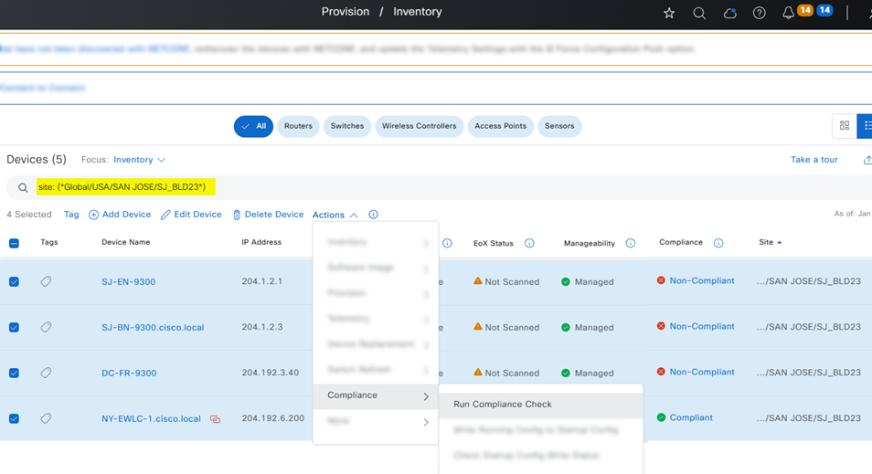

# Network Compliance Workflow Playbook

This Ansible playbook streamlines the management of device compliance within your network, offering capabilities to:

* Perform compliance checks or sync configurations on reachable devices using IP Address(s) or Site.
* Perform full compliance checks or specific category checks on reachable device(s).
* Sync device configuration on device(s), running_configuration with Startup_config, if they are out of sync.



# Procedure
1. ## Prepare your Ansible environment:

Install Ansible if you haven't already Ensure you have network connectivity to your Catalyst Center instance. Checkout the project and playbooks: git@github.com:cisco-en-programmability/catalyst-center-ansible-iac.git
2. ## Compatibility

* Catalyst Center Release version 2.3.7.6 and later

3. ## Key Concepts

Device inputs can be provided through the input file **network_compliance_workflow_input.yml**

* **network_compliance_details**: This section in your YAML input file defines the list of devices and their associated details to be processed by the playbook.
* **ip_address_list**: List of IP addresses of devices to run a compliance check on or synchronize device configurations.
* **site_name**: When "site_name" is specified, the module executes the operation on all the devices located within the specified site.
* **run_compliance**: Determines if a full compliance check should be triggered on the devices specified in the "ip_address_list" and/or "site_name".
* **run_compliance_categories**: Specifying compliance categories allows you to trigger compliance checks only for the mentioned categories.
* **sync_device_config**: Determines whether to synchronize the device configuration on the devices specified in the "ip_address_list" and/or "site_name".

4. ## Workflow Specification

For comprehensive details on input options and structure, refer to the full workflow specification: [https://galaxy.ansible.com/ui/repo/published/cisco/dnac/content/module/network_compliance_workflow_manager/](https://galaxy.ansible.com/ui/repo/published/cisco/dnac/content/module/network_compliance_workflow_manager/)

5. ## Running the Playbook

### Configure Host Inventory

- The **host_inventory_dnac1/hosts.yml** file contains connection details (IP, credentials) for your Catalyst Center instance.
- Ensure the **dnac_version** matches your Catalyst Center version.

### Configure Host Inventory
- **host_inventory_dnac1/hosts.yml**

```yaml
catalyst_center_hosts:
    hosts:
        catalyst_center220:
            dnac_host: xx.xx.xx.xx.
            dnac_password: XXXXXXXX
            dnac_port: 443
            dnac_timeout: 60
            dnac_username: admin
            dnac_verify: false
            dnac_version: 2.3.7.6
            dnac_debug: true
            dnac_log_level: INFO
            dnac_log: true
```

- User Inputs for Users and roles are stored in **workflows/network compliance/vars/network_compliance_workflow_inputs.yml**

### Prepare Input Data

- User inputs are stored in **workflows/network_compliance/vars/network_compliance_workflow_inputs.yml**.

### Validate user input before running through Ansible

command to validate:
```bash
./tools/validate.sh -s workflows/network_compliance/schema/network_compliance_workflow_schema.yml -d workflows/network_compliance/vars/network_compliance_workflow_input.yml 
```
result:
```bash
workflows/network_compliance/schema/network_compliance_workflow_schema.yml
workflows/network_compliance/vars/network_compliance_workflow_input.yml
yamale   -s workflows/network_compliance/schema/network_compliance_workflow_schema.yml  workflows/network_compliance/vars/network_compliance_workflow_input.yml
Validating /Users/pawansi/dnac_ansible_workflows/workflows/network_compliance/vars/network_compliance_workflow_input.yml...
Validation success! 👍
```

### Example run

```bash
ansible-playbook -i host_inventory_dnac1/hosts.yml workflows/network_compliance/playbook/network_compliance_workflow_playbook.yml --e VARS_FILE_PATH=../vars/network_compliance_workflow_input.yml -vvvv
```

### Important Notes
- Always validate your input YAML file before running the playbook.
- Refer to the full input specification for detailed information and examples.
- If you face issues, review the Ansible playbook output and consult Catalyst Center documentation or support.


## Execution Reference Logs

```bash
(pyats) pawansi@PAWANSI-M-81A3 dnac_ansible_workflows % ansible-playbook -i host_inventory_dnac1/hosts.yml workflows/network_compliance/playbook/network_compliance_workflow_playbook.yml --e VARS_FILE_PATH=../vars/network_compliance_workflow_input.yml -vvvv
ansible-playbook [core 2.15.3]
  config file = None
  configured module search path = ['/Users/pawansi/.ansible/plugins/modules', '/usr/share/ansible/plugins/modules']
  ansible python module location = /Users/pawansi/workspace/dnac_auto/pyats/lib/python3.11/site-packages/ansible
  ansible collection location = /Users/pawansi/.ansible/collections:/usr/share/ansible/collections
  executable location = /Users/pawansi/workspace/dnac_auto/pyats/bin/ansible-playbook
  python version = 3.11.4 (main, Jul 25 2023, 17:07:07) [Clang 14.0.3 (clang-1403.0.22.14.1)] (/Users/pawansi/workspace/dnac_auto/pyats/bin/python3.11)
  jinja version = 3.1.2
  libyaml = True
No config file found; using defaults
setting up inventory plugins
Loading collection ansible.builtin from 
host_list declined parsing /Users/pawansi/dnac_ansible_workflows/host_inventory_dnac1/hosts.yml as it did not pass its verify_file() method
script declined parsing /Users/pawansi/dnac_ansible_workflows/host_inventory_dnac1/hosts.yml as it did not pass its verify_file() method
Parsed /Users/pawansi/dnac_ansible_workflows/host_inventory_dnac1/hosts.yml inventory source with yaml plugin
Loading collection cisco.dnac from /Users/pawansi/.ansible/collections/ansible_collections/cisco/dnac
Loading callback plugin default of type stdout, v2.0 from /Users/pawansi/workspace/dnac_auto/pyats/lib/python3.11/site-packages/ansible/plugins/callback/default.py
Skipping callback 'default', as we already have a stdout callback.
Skipping callback 'minimal', as we already have a stdout callback.
Skipping callback 'oneline', as we already have a stdout callback.

PLAYBOOK: network_compliance_workflow_playbook.yml ******************************************************************************************************************************************************************************************************
Positional arguments: workflows/network_compliance/playbook/network_compliance_workflow_playbook.yml
verbosity: 4
connection: smart
timeout: 10
become_method: sudo
tags: ('all',)
inventory: ('/Users/pawansi/dnac_ansible_workflows/host_inventory_dnac1/hosts.yml',)
extra_vars: ('VARS_FILE_PATH=../vars/network_compliance_workflow_input.yml',)
forks: 5
1 plays in workflows/network_compliance/playbook/network_compliance_workflow_playbook.yml
Read vars_file '{{ VARS_FILE_PATH }}'
Read vars_file '{{ VARS_FILE_PATH }}'
Read vars_file '{{ VARS_FILE_PATH }}'

PLAY [Network Compliance on  Cisco Catalyst Center] *****************************************************************************************************************************************************************************************************
Read vars_file '{{ VARS_FILE_PATH }}'
Read vars_file '{{ VARS_FILE_PATH }}'
Read vars_file '{{ VARS_FILE_PATH }}'

TASK [Network Compliance devices on Cisco Catalyst Center] **********************************************************************************************************************************************************************************************
task path: /Users/pawansi/dnac_ansible_workflows/workflows/network_compliance/playbook/network_compliance_workflow_playbook.yml:26
ok: [catalyst_center220] => {
    "ansible_facts": {
        "long_op_start": "2024-09-06 22:48:39.695965"
    },
    "changed": false
}
Read vars_file '{{ VARS_FILE_PATH }}'

TASK [Network Compliance devices on Cisco Catalyst Center] **********************************************************************************************************************************************************************************************
task path: /Users/pawansi/dnac_ansible_workflows/workflows/network_compliance/playbook/network_compliance_workflow_playbook.yml:29
<catalyst_center220> ESTABLISH LOCAL CONNECTION FOR USER: pawansi
<catalyst_center220> EXEC /bin/sh -c 'echo ~pawansi && sleep 0'
<catalyst_center220> EXEC /bin/sh -c '( umask 77 && mkdir -p "` echo /Users/pawansi/.ansible/tmp `"&& mkdir "` echo /Users/pawansi/.ansible/tmp/ansible-tmp-1725688119.775716-79455-122732002162610 `" && echo ansible-tmp-1725688119.775716-79455-122732002162610="` echo /Users/pawansi/.ansible/tmp/ansible-tmp-1725688119.775716-79455-122732002162610 `" ) && sleep 0'
<catalyst_center220> Attempting python interpreter discovery
<catalyst_center220> EXEC /bin/sh -c 'echo PLATFORM; uname; echo FOUND; command -v '"'"'python3.11'"'"'; command -v '"'"'python3.10'"'"'; command -v '"'"'python3.9'"'"'; command -v '"'"'python3.8'"'"'; command -v '"'"'python3.7'"'"'; command -v '"'"'python3.6'"'"'; command -v '"'"'python3.5'"'"'; command -v '"'"'/usr/bin/python3'"'"'; command -v '"'"'/usr/libexec/platform-python'"'"'; command -v '"'"'python2.7'"'"'; command -v '"'"'/usr/bin/python'"'"'; command -v '"'"'python'"'"'; echo ENDFOUND && sleep 0'
<catalyst_center220> Python interpreter discovery fallback (unsupported platform for extended discovery: darwin)
Using module file /Users/pawansi/.ansible/collections/ansible_collections/cisco/dnac/plugins/modules/network_compliance_workflow_manager.py
<catalyst_center220> PUT /Users/pawansi/.ansible/tmp/ansible-local-79449tduyx5w8/tmp8tjct_x3 TO /Users/pawansi/.ansible/tmp/ansible-tmp-1725688119.775716-79455-122732002162610/AnsiballZ_network_compliance_workflow_manager.py
<catalyst_center220> EXEC /bin/sh -c 'chmod u+x /Users/pawansi/.ansible/tmp/ansible-tmp-1725688119.775716-79455-122732002162610/ /Users/pawansi/.ansible/tmp/ansible-tmp-1725688119.775716-79455-122732002162610/AnsiballZ_network_compliance_workflow_manager.py && sleep 0'
<catalyst_center220> EXEC /bin/sh -c '/Users/pawansi/workspace/dnac_auto/pyats/bin/python3.11 /Users/pawansi/.ansible/tmp/ansible-tmp-1725688119.775716-79455-122732002162610/AnsiballZ_network_compliance_workflow_manager.py && sleep 0'
<catalyst_center220> EXEC /bin/sh -c 'rm -f -r /Users/pawansi/.ansible/tmp/ansible-tmp-1725688119.775716-79455-122732002162610/ > /dev/null 2>&1 && sleep 0'
[WARNING]: Platform darwin on host catalyst_center220 is using the discovered Python interpreter at /Users/pawansi/workspace/dnac_auto/pyats/bin/python3.11, but future installation of another Python interpreter could change the meaning of that
path. See https://docs.ansible.com/ansible-core/2.15/reference_appendices/interpreter_discovery.html for more information.
changed: [catalyst_center220] => {
    "ansible_facts": {
        "discovered_interpreter_python": "/Users/pawansi/workspace/dnac_auto/pyats/bin/python3.11"
    },
    "changed": true,
    "data": {
        "204.1.2.1": [
            {
                "ackStatus": "UNACKNOWLEDGED",
                "complianceType": "RUNNING_CONFIG",
                "deviceUuid": "a2038454-9581-4ce1-a1b7-c3754061b69e",
                "lastSyncTime": 1725687776235,
                "lastUpdateTime": 1725688125876,
                "remediationSupported": true,
                "sourceInfoList": [
                    {
                        "ackStatus": "UNACKNOWLEDGED",
                        "appName": "RUNNING_CONFIG",
                        "count": 1,
                        "diffList": [
                            {
                                "ackStatus": "UNACKNOWLEDGED",
                                "businessKey": null,
                                "configuredValue": "cf89c4c8-3fbc-4be0-a174-605f41f3d871",
                                "diffModelName": null,
                                "displayName": "76137062",
                                "extendedAttributes": {},
                                "hierarchy": null,
                                "instanceUUID": "37c14b42-9ef2-42bf-bc51-0435deb092bb",
                                "intendedValue": "bd24529a-d4db-441e-ad8e-d870a66e0d2d",
                                "moveFromPath": null,
                                "op": "replace",
                                "path": "NA"
                            }
                        ],
                        "name": "ConfigVesion",
                        "sourceEnum": "RUNNING_CONFIG",
                        "type": "RUNNING_CONFIG"
                    }
                ],
                "state": "SUCCESS",
                "status": "NON_COMPLIANT"
            },
            {
                "ackStatus": "UNACKNOWLEDGED",
                "additionalDataURL": "/api/v2/device-image/device?id=a2038454-9581-4ce1-a1b7-c3754061b69e",
                "complianceType": "IMAGE",
                "deviceUuid": "a2038454-9581-4ce1-a1b7-c3754061b69e",
                "lastSyncTime": 1725084338541,
                "lastUpdateTime": 1725688125903,
                "message": "Golden image is not available",
                "remediationSupported": false,
                "sourceInfoList": [],
                "state": "SUCCESS",
                "status": "NOT_APPLICABLE"
            },
            {
                "ackStatus": "UNACKNOWLEDGED",
                "complianceType": "PSIRT",
                "deviceUuid": "a2038454-9581-4ce1-a1b7-c3754061b69e",
                "lastSyncTime": 1725084335040,
                "lastUpdateTime": 1725688126277,
                "remediationSupported": false,
                "sourceInfoList": [],
                "state": "SUCCESS",
                "status": "COMPLIANT"
            }
        ],
        "204.1.2.2": [
            {
                "ackStatus": "UNACKNOWLEDGED",
                "complianceType": "RUNNING_CONFIG",
                "deviceUuid": "0ee91efd-019d-4ce8-8c42-57dfdcf17b9d",
                "lastSyncTime": 1725084352522,
                "lastUpdateTime": 1725688125876,
                "remediationSupported": false,
                "sourceInfoList": [],
                "state": "SUCCESS",
                "status": "COMPLIANT"
            },
            {
                "ackStatus": "UNACKNOWLEDGED",
                "additionalDataURL": "/api/v2/device-image/device?id=0ee91efd-019d-4ce8-8c42-57dfdcf17b9d",
                "complianceType": "IMAGE",
                "deviceUuid": "0ee91efd-019d-4ce8-8c42-57dfdcf17b9d",
                "lastSyncTime": 1725084358562,
                "lastUpdateTime": 1725688125900,
                "message": "Golden image is not available",
                "remediationSupported": false,
                "sourceInfoList": [],
                "state": "SUCCESS",
                "status": "NOT_APPLICABLE"
            },
            {
                "ackStatus": "UNACKNOWLEDGED",
                "complianceType": "PSIRT",
                "deviceUuid": "0ee91efd-019d-4ce8-8c42-57dfdcf17b9d",
                "lastSyncTime": 1725084350319,
                "lastUpdateTime": 1725688126278,
                "remediationSupported": false,
                "sourceInfoList": [],
                "state": "SUCCESS",
                "status": "COMPLIANT"
            }
        ],
        "204.1.2.3": [
            {
                "ackStatus": "UNACKNOWLEDGED",
                "complianceType": "RUNNING_CONFIG",
                "deviceUuid": "38c65987-3d6b-4e60-a020-61836c1f0df8",
                "lastSyncTime": 1725084338109,
                "lastUpdateTime": 1725688125800,
                "remediationSupported": false,
                "sourceInfoList": [],
                "state": "SUCCESS",
                "status": "COMPLIANT"
            },
            {
                "ackStatus": "UNACKNOWLEDGED",
                "additionalDataURL": "/api/v2/device-image/device?id=38c65987-3d6b-4e60-a020-61836c1f0df8",
                "complianceType": "IMAGE",
                "deviceUuid": "38c65987-3d6b-4e60-a020-61836c1f0df8",
                "lastSyncTime": 1725084338503,
                "lastUpdateTime": 1725688125834,
                "message": "Golden image is not available",
                "remediationSupported": false,
                "sourceInfoList": [],
                "state": "SUCCESS",
                "status": "NOT_APPLICABLE"
            },
            {
                "ackStatus": "UNACKNOWLEDGED",
                "complianceType": "PSIRT",
                "deviceUuid": "38c65987-3d6b-4e60-a020-61836c1f0df8",
                "lastSyncTime": 1725084334726,
                "lastUpdateTime": 1725688125977,
                "remediationSupported": false,
                "sourceInfoList": [],
                "state": "SUCCESS",
                "status": "COMPLIANT"
            }
        ],
        "204.1.2.4": [
            {
                "ackStatus": "UNACKNOWLEDGED",
                "complianceType": "RUNNING_CONFIG",
                "deviceUuid": "84e967a0-2149-464c-88fe-98526cb47b59",
                "lastSyncTime": 1725084349447,
                "lastUpdateTime": 1725688125876,
                "remediationSupported": false,
                "sourceInfoList": [],
                "state": "SUCCESS",
                "status": "COMPLIANT"
            },
            {
                "ackStatus": "UNACKNOWLEDGED",
                "additionalDataURL": "/api/v2/device-image/device?id=84e967a0-2149-464c-88fe-98526cb47b59",
                "complianceType": "IMAGE",
                "deviceUuid": "84e967a0-2149-464c-88fe-98526cb47b59",
                "lastSyncTime": 1725084348559,
                "lastUpdateTime": 1725688125900,
                "remediationSupported": false,
                "sourceInfoList": [],
                "state": "SUCCESS",
                "status": "COMPLIANT"
            },
            {
                "ackStatus": "UNACKNOWLEDGED",
                "complianceType": "PSIRT",
                "deviceUuid": "84e967a0-2149-464c-88fe-98526cb47b59",
                "lastSyncTime": 1725084347265,
                "lastUpdateTime": 1725688126181,
                "remediationSupported": false,
                "sourceInfoList": [],
                "state": "SUCCESS",
                "status": "COMPLIANT"
            }
        ],
        "204.192.4.2": [
            {
                "ackStatus": "UNACKNOWLEDGED",
                "complianceType": "NETWORK_PROFILE",
                "deviceUuid": "69f4d234-ef93-4bb4-94a0-8dd3767b3e99",
                "lastSyncTime": 1725687007162,
                "lastUpdateTime": 1725688142768,
                "remediationSupported": false,
                "sourceInfoList": [],
                "state": "SUCCESS",
                "status": "COMPLIANT"
            },
            {
                "ackStatus": "UNACKNOWLEDGED",
                "complianceType": "RUNNING_CONFIG",
                "deviceUuid": "69f4d234-ef93-4bb4-94a0-8dd3767b3e99",
                "lastSyncTime": 1725084215347,
                "lastUpdateTime": 1725688125849,
                "remediationSupported": false,
                "sourceInfoList": [],
                "state": "SUCCESS",
                "status": "NOT_APPLICABLE"
            },
            {
                "ackStatus": "UNACKNOWLEDGED",
                "additionalDataURL": "/api/v2/device-image/device?id=69f4d234-ef93-4bb4-94a0-8dd3767b3e99",
                "complianceType": "IMAGE",
                "deviceUuid": "69f4d234-ef93-4bb4-94a0-8dd3767b3e99",
                "lastSyncTime": 1725084198387,
                "lastUpdateTime": 1725688125891,
                "message": "Golden image is not available",
                "remediationSupported": false,
                "sourceInfoList": [],
                "state": "SUCCESS",
                "status": "NOT_APPLICABLE"
            },
            {
                "ackStatus": "UNACKNOWLEDGED",
                "complianceType": "PSIRT",
                "deviceUuid": "69f4d234-ef93-4bb4-94a0-8dd3767b3e99",
                "lastSyncTime": 1725084194679,
                "lastUpdateTime": 1725688126174,
                "remediationSupported": false,
                "sourceInfoList": [],
                "state": "SUCCESS",
                "status": "COMPLIANT"
            }
        ]
    },
    "diff": [],
    "invocation": {
        "module_args": {
            "config": [
                {
                    "ip_address_list": [
                        "204.1.2.2",
                        "204.1.2.1",
                        "204.1.2.3",
                        "204.1.2.4",
                        "204.192.4.2",
                        "204.1.2.10"
                    ],
                    "run_compliance": true,
                    "run_compliance_categories": [
                        "INTENT",
                        "RUNNING_CONFIG",
                        "IMAGE",
                        "PSIRT"
                    ],
                    "site_name": "Global/USA/SAN JOSE/BLD23",
                    "sync_device_config": true
                }
            ],
            "config_verify": false,
            "dnac_api_task_timeout": 1200,
            "dnac_debug": true,
            "dnac_host": "10.195.227.14",
            "dnac_log": true,
            "dnac_log_append": true,
            "dnac_log_file_path": "dnac.log",
            "dnac_log_level": "INFO",
            "dnac_password": "VALUE_SPECIFIED_IN_NO_LOG_PARAMETER",
            "dnac_port": "443",
            "dnac_task_poll_interval": 2,
            "dnac_username": "admin",
            "dnac_verify": false,
            "dnac_version": "2.3.7.6",
            "state": "merged",
            "validate_response_schema": true
        }
    },
    "msg": "Sync Device Configuration has completed successfully on 1 device(s): 204.1.2.1",
    "response": {
        "taskId": "0191cb07-d687-7389-92e7-0d371c78dda7",
        "url": "/api/v1/task/0191cb07-d687-7389-92e7-0d371c78dda7"
    },
    "status": "success"
}
Read vars_file '{{ VARS_FILE_PATH }}'

TASK [Print the Network Compliance devices output] ******************************************************************************************************************************************************************************************************
task path: /Users/pawansi/dnac_ansible_workflows/workflows/network_compliance/playbook/network_compliance_workflow_playbook.yml:35
ok: [catalyst_center220] => {
    "msg": {
        "ansible_facts": {
            "discovered_interpreter_python": "/Users/pawansi/workspace/dnac_auto/pyats/bin/python3.11"
        },
        "changed": true,
        "data": {
            "204.1.2.1": [
                {
                    "ackStatus": "UNACKNOWLEDGED",
                    "complianceType": "RUNNING_CONFIG",
                    "deviceUuid": "a2038454-9581-4ce1-a1b7-c3754061b69e",
                    "lastSyncTime": 1725687776235,
                    "lastUpdateTime": 1725688125876,
                    "remediationSupported": true,
                    "sourceInfoList": [
                        {
                            "ackStatus": "UNACKNOWLEDGED",
                            "appName": "RUNNING_CONFIG",
                            "count": 1,
                            "diffList": [
                                {
                                    "ackStatus": "UNACKNOWLEDGED",
                                    "businessKey": null,
                                    "configuredValue": "cf89c4c8-3fbc-4be0-a174-605f41f3d871",
                                    "diffModelName": null,
                                    "displayName": "76137062",
                                    "extendedAttributes": {},
                                    "hierarchy": null,
                                    "instanceUUID": "37c14b42-9ef2-42bf-bc51-0435deb092bb",
                                    "intendedValue": "bd24529a-d4db-441e-ad8e-d870a66e0d2d",
                                    "moveFromPath": null,
                                    "op": "replace",
                                    "path": "NA"
                                }
                            ],
                            "name": "ConfigVesion",
                            "sourceEnum": "RUNNING_CONFIG",
                            "type": "RUNNING_CONFIG"
                        }
                    ],
                    "state": "SUCCESS",
                    "status": "NON_COMPLIANT"
                },
                {
                    "ackStatus": "UNACKNOWLEDGED",
                    "additionalDataURL": "/api/v2/device-image/device?id=a2038454-9581-4ce1-a1b7-c3754061b69e",
                    "complianceType": "IMAGE",
                    "deviceUuid": "a2038454-9581-4ce1-a1b7-c3754061b69e",
                    "lastSyncTime": 1725084338541,
                    "lastUpdateTime": 1725688125903,
                    "message": "Golden image is not available",
                    "remediationSupported": false,
                    "sourceInfoList": [],
                    "state": "SUCCESS",
                    "status": "NOT_APPLICABLE"
                },
                {
                    "ackStatus": "UNACKNOWLEDGED",
                    "complianceType": "PSIRT",
                    "deviceUuid": "a2038454-9581-4ce1-a1b7-c3754061b69e",
                    "lastSyncTime": 1725084335040,
                    "lastUpdateTime": 1725688126277,
                    "remediationSupported": false,
                    "sourceInfoList": [],
                    "state": "SUCCESS",
                    "status": "COMPLIANT"
                }
            ],
            "204.1.2.2": [
                {
                    "ackStatus": "UNACKNOWLEDGED",
                    "complianceType": "RUNNING_CONFIG",
                    "deviceUuid": "0ee91efd-019d-4ce8-8c42-57dfdcf17b9d",
                    "lastSyncTime": 1725084352522,
                    "lastUpdateTime": 1725688125876,
                    "remediationSupported": false,
                    "sourceInfoList": [],
                    "state": "SUCCESS",
                    "status": "COMPLIANT"
                },
                {
                    "ackStatus": "UNACKNOWLEDGED",
                    "additionalDataURL": "/api/v2/device-image/device?id=0ee91efd-019d-4ce8-8c42-57dfdcf17b9d",
                    "complianceType": "IMAGE",
                    "deviceUuid": "0ee91efd-019d-4ce8-8c42-57dfdcf17b9d",
                    "lastSyncTime": 1725084358562,
                    "lastUpdateTime": 1725688125900,
                    "message": "Golden image is not available",
                    "remediationSupported": false,
                    "sourceInfoList": [],
                    "state": "SUCCESS",
                    "status": "NOT_APPLICABLE"
                },
                {
                    "ackStatus": "UNACKNOWLEDGED",
                    "complianceType": "PSIRT",
                    "deviceUuid": "0ee91efd-019d-4ce8-8c42-57dfdcf17b9d",
                    "lastSyncTime": 1725084350319,
                    "lastUpdateTime": 1725688126278,
                    "remediationSupported": false,
                    "sourceInfoList": [],
                    "state": "SUCCESS",
                    "status": "COMPLIANT"
                }
            ],
            "204.1.2.3": [
                {
                    "ackStatus": "UNACKNOWLEDGED",
                    "complianceType": "RUNNING_CONFIG",
                    "deviceUuid": "38c65987-3d6b-4e60-a020-61836c1f0df8",
                    "lastSyncTime": 1725084338109,
                    "lastUpdateTime": 1725688125800,
                    "remediationSupported": false,
                    "sourceInfoList": [],
                    "state": "SUCCESS",
                    "status": "COMPLIANT"
                },
                {
                    "ackStatus": "UNACKNOWLEDGED",
                    "additionalDataURL": "/api/v2/device-image/device?id=38c65987-3d6b-4e60-a020-61836c1f0df8",
                    "complianceType": "IMAGE",
                    "deviceUuid": "38c65987-3d6b-4e60-a020-61836c1f0df8",
                    "lastSyncTime": 1725084338503,
                    "lastUpdateTime": 1725688125834,
                    "message": "Golden image is not available",
                    "remediationSupported": false,
                    "sourceInfoList": [],
                    "state": "SUCCESS",
                    "status": "NOT_APPLICABLE"
                },
                {
                    "ackStatus": "UNACKNOWLEDGED",
                    "complianceType": "PSIRT",
                    "deviceUuid": "38c65987-3d6b-4e60-a020-61836c1f0df8",
                    "lastSyncTime": 1725084334726,
                    "lastUpdateTime": 1725688125977,
                    "remediationSupported": false,
                    "sourceInfoList": [],
                    "state": "SUCCESS",
                    "status": "COMPLIANT"
                }
            ],
            "204.1.2.4": [
                {
                    "ackStatus": "UNACKNOWLEDGED",
                    "complianceType": "RUNNING_CONFIG",
                    "deviceUuid": "84e967a0-2149-464c-88fe-98526cb47b59",
                    "lastSyncTime": 1725084349447,
                    "lastUpdateTime": 1725688125876,
                    "remediationSupported": false,
                    "sourceInfoList": [],
                    "state": "SUCCESS",
                    "status": "COMPLIANT"
                },
                {
                    "ackStatus": "UNACKNOWLEDGED",
                    "additionalDataURL": "/api/v2/device-image/device?id=84e967a0-2149-464c-88fe-98526cb47b59",
                    "complianceType": "IMAGE",
                    "deviceUuid": "84e967a0-2149-464c-88fe-98526cb47b59",
                    "lastSyncTime": 1725084348559,
                    "lastUpdateTime": 1725688125900,
                    "remediationSupported": false,
                    "sourceInfoList": [],
                    "state": "SUCCESS",
                    "status": "COMPLIANT"
                },
                {
                    "ackStatus": "UNACKNOWLEDGED",
                    "complianceType": "PSIRT",
                    "deviceUuid": "84e967a0-2149-464c-88fe-98526cb47b59",
                    "lastSyncTime": 1725084347265,
                    "lastUpdateTime": 1725688126181,
                    "remediationSupported": false,
                    "sourceInfoList": [],
                    "state": "SUCCESS",
                    "status": "COMPLIANT"
                }
            ],
            "204.192.4.2": [
                {
                    "ackStatus": "UNACKNOWLEDGED",
                    "complianceType": "NETWORK_PROFILE",
                    "deviceUuid": "69f4d234-ef93-4bb4-94a0-8dd3767b3e99",
                    "lastSyncTime": 1725687007162,
                    "lastUpdateTime": 1725688142768,
                    "remediationSupported": false,
                    "sourceInfoList": [],
                    "state": "SUCCESS",
                    "status": "COMPLIANT"
                },
                {
                    "ackStatus": "UNACKNOWLEDGED",
                    "complianceType": "RUNNING_CONFIG",
                    "deviceUuid": "69f4d234-ef93-4bb4-94a0-8dd3767b3e99",
                    "lastSyncTime": 1725084215347,
                    "lastUpdateTime": 1725688125849,
                    "remediationSupported": false,
                    "sourceInfoList": [],
                    "state": "SUCCESS",
                    "status": "NOT_APPLICABLE"
                },
                {
                    "ackStatus": "UNACKNOWLEDGED",
                    "additionalDataURL": "/api/v2/device-image/device?id=69f4d234-ef93-4bb4-94a0-8dd3767b3e99",
                    "complianceType": "IMAGE",
                    "deviceUuid": "69f4d234-ef93-4bb4-94a0-8dd3767b3e99",
                    "lastSyncTime": 1725084198387,
                    "lastUpdateTime": 1725688125891,
                    "message": "Golden image is not available",
                    "remediationSupported": false,
                    "sourceInfoList": [],
                    "state": "SUCCESS",
                    "status": "NOT_APPLICABLE"
                },
                {
                    "ackStatus": "UNACKNOWLEDGED",
                    "complianceType": "PSIRT",
                    "deviceUuid": "69f4d234-ef93-4bb4-94a0-8dd3767b3e99",
                    "lastSyncTime": 1725084194679,
                    "lastUpdateTime": 1725688126174,
                    "remediationSupported": false,
                    "sourceInfoList": [],
                    "state": "SUCCESS",
                    "status": "COMPLIANT"
                }
            ]
        },
        "diff": [],
        "failed": false,
        "msg": "Sync Device Configuration has completed successfully on 1 device(s): 204.1.2.1",
        "response": {
            "taskId": "0191cb07-d687-7389-92e7-0d371c78dda7",
            "url": "/api/v1/task/0191cb07-d687-7389-92e7-0d371c78dda7"
        },
        "status": "success",
        "warnings": [
            "Platform darwin on host catalyst_center220 is using the discovered Python interpreter at /Users/pawansi/workspace/dnac_auto/pyats/bin/python3.11, but future installation of another Python interpreter could change the meaning of that path. See https://docs.ansible.com/ansible-core/2.15/reference_appendices/interpreter_discovery.html for more information."
        ]
    }
}
Read vars_file '{{ VARS_FILE_PATH }}'

TASK [Network Compliance devices playbook end time] *****************************************************************************************************************************************************************************************************
task path: /Users/pawansi/dnac_ansible_workflows/workflows/network_compliance/playbook/network_compliance_workflow_playbook.yml:38
ok: [catalyst_center220] => {
    "ansible_facts": {
        "long_op_end": "2024-09-06 22:49:44.336194"
    },
    "changed": false
}
Read vars_file '{{ VARS_FILE_PATH }}'

TASK [Print Network Compliance devices playbook execution time] *****************************************************************************************************************************************************************************************
task path: /Users/pawansi/dnac_ansible_workflows/workflows/network_compliance/playbook/network_compliance_workflow_playbook.yml:41
ok: [catalyst_center220] => {
    "msg": "Network Compliance devices playbook run time: 2024-09-06 22:48:39.695965, end: 2024-09-06 22:49:44.336194"
}
Read vars_file '{{ VARS_FILE_PATH }}'
Read vars_file '{{ VARS_FILE_PATH }}'
Read vars_file '{{ VARS_FILE_PATH }}'

TASK [run command module to find python version] ********************************************************************************************************************************************************************************************************
task path: /Users/pawansi/dnac_ansible_workflows/workflows/network_compliance/playbook/network_compliance_workflow_playbook.yml:45
Read vars_file '{{ VARS_FILE_PATH }}'
<catalyst_center_hosts> ESTABLISH LOCAL CONNECTION FOR USER: pawansi
<catalyst_center_hosts> EXEC /bin/sh -c 'echo ~pawansi && sleep 0'
<catalyst_center_hosts> EXEC /bin/sh -c '( umask 77 && mkdir -p "` echo /Users/pawansi/.ansible/tmp `"&& mkdir "` echo /Users/pawansi/.ansible/tmp/ansible-tmp-1725688184.457744-79572-204480087596265 `" && echo ansible-tmp-1725688184.457744-79572-204480087596265="` echo /Users/pawansi/.ansible/tmp/ansible-tmp-1725688184.457744-79572-204480087596265 `" ) && sleep 0'
<catalyst_center220> Attempting python interpreter discovery
<catalyst_center_hosts> EXEC /bin/sh -c 'echo PLATFORM; uname; echo FOUND; command -v '"'"'python3.11'"'"'; command -v '"'"'python3.10'"'"'; command -v '"'"'python3.9'"'"'; command -v '"'"'python3.8'"'"'; command -v '"'"'python3.7'"'"'; command -v '"'"'python3.6'"'"'; command -v '"'"'python3.5'"'"'; command -v '"'"'/usr/bin/python3'"'"'; command -v '"'"'/usr/libexec/platform-python'"'"'; command -v '"'"'python2.7'"'"'; command -v '"'"'/usr/bin/python'"'"'; command -v '"'"'python'"'"'; echo ENDFOUND && sleep 0'
<catalyst_center220> Python interpreter discovery fallback (unsupported platform for extended discovery: darwin)
Using module file /Users/pawansi/workspace/dnac_auto/pyats/lib/python3.11/site-packages/ansible/modules/command.py
<catalyst_center_hosts> PUT /Users/pawansi/.ansible/tmp/ansible-local-79449tduyx5w8/tmpf6o6u95m TO /Users/pawansi/.ansible/tmp/ansible-tmp-1725688184.457744-79572-204480087596265/AnsiballZ_command.py
<catalyst_center_hosts> EXEC /bin/sh -c 'chmod u+x /Users/pawansi/.ansible/tmp/ansible-tmp-1725688184.457744-79572-204480087596265/ /Users/pawansi/.ansible/tmp/ansible-tmp-1725688184.457744-79572-204480087596265/AnsiballZ_command.py && sleep 0'
<catalyst_center_hosts> EXEC /bin/sh -c '/Users/pawansi/workspace/dnac_auto/pyats/bin/python3.11 /Users/pawansi/.ansible/tmp/ansible-tmp-1725688184.457744-79572-204480087596265/AnsiballZ_command.py && sleep 0'
<catalyst_center_hosts> EXEC /bin/sh -c 'rm -f -r /Users/pawansi/.ansible/tmp/ansible-tmp-1725688184.457744-79572-204480087596265/ > /dev/null 2>&1 && sleep 0'
changed: [catalyst_center220 -> catalyst_center_hosts] => {
    "changed": true,
    "cmd": [
        "which",
        "python"
    ],
    "delta": "0:00:00.007466",
    "end": "2024-09-06 22:49:44.999933",
    "invocation": {
        "module_args": {
            "_raw_params": "which python",
            "_uses_shell": false,
            "argv": null,
            "chdir": null,
            "creates": null,
            "executable": null,
            "removes": null,
            "stdin": null,
            "stdin_add_newline": true,
            "strip_empty_ends": true
        }
    },
    "msg": "",
    "rc": 0,
    "start": "2024-09-06 22:49:44.992467",
    "stderr": "",
    "stderr_lines": [],
    "stdout": "/Users/pawansi/workspace/dnac_auto/pyats/bin/python",
    "stdout_lines": [
        "/Users/pawansi/workspace/dnac_auto/pyats/bin/python"
    ]
}
Read vars_file '{{ VARS_FILE_PATH }}'
Read vars_file '{{ VARS_FILE_PATH }}'

PLAY RECAP **********************************************************************************************************************************************************************************************************************************************
catalyst_center220         : ok=6    changed=2    unreachable=0    failed=0    skipped=0    rescued=0    ignored=0   
```
