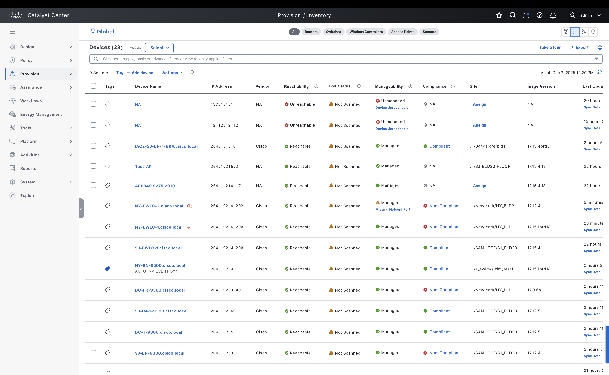

# Network Devices Info Workflow

## Overview

The Network Devices Info workflow enables automated retrieval and collection of comprehensive network device information from Cisco Catalyst Center. This workflow provides flexible filtering capabilities and supports multiple output formats for reporting and analysis purposes.

## Features

- **Flexible Device Filtering**: Query devices using multiple filter criteria including:
  - Site hierarchy
  - Device type, role, and family
  - Software version and OS type
  - Device identifiers (IP address, MAC address, serial number, hostname)

- **Comprehensive Information Retrieval**: Collect various types of device information:
  - Basic device details (hostname, model, serial number, OS version)
  - Interface information (status, speed, duplex, MAC address)
  - VLAN configuration
  - Line card and supervisor card details
  - Power over Ethernet (PoE) statistics
  - Module count
  - Connected device information
  - Device configuration
  - Device summary and polling interval
  - Stack information
  - Link mismatch details

- **Robust Operation**: Built-in retry mechanism with configurable timeout, retries, and interval settings

- **Multiple Output Formats**: Save results to JSON or YAML files with optional timestamps

- **Batch Processing**: Query multiple devices or device groups in a single workflow execution

## Directory Structure

```
network_devices_info/
├── README.md                           # This documentation file
├── playbook/
│   └── network_devices_info_playbook.yml    # Main Ansible playbook
├── vars/
│   └── network_devices_info_input.yml       # Input variables and configuration
└── schema/
    └── network_devices_info_schema.yml      # YAML schema for input validation
```

## Prerequisites

- Ansible 2.9 or higher
- Python 3.9.19 or higher
- dnacentersdk 2.9.3 or higher
- cisco.dnac Ansible collection 6.42.0 or higher
- Access to Cisco Catalyst Center with appropriate permissions
- Network connectivity to Catalyst Center

## Schema Reference

### Network Device Query Parameters

Each entry in `network_devices_info_details` contains a `network_devices` list with the following parameters:

| Parameter | Type | Required | Default | Description |
|-----------|------|----------|---------|-------------|
| `network_devices` | list | **Yes** | - | List of network device filtering criteria and information retrieval settings |

### Network Device Filtering Parameters

| Parameter | Type | Required | Default | Description |
|-----------|------|----------|---------|-------------|
| `site_hierarchy` | string | No | - | Hierarchical path of the site (e.g., "Global/USA/San Jose") |
| `device_type` | string | No | - | Filter by specific device model (see examples below) |
| `device_role` | string | No | - | Filter by network function (see examples below) |
| `device_family` | string | No | - | Filter by device category (see examples below) |
| `software_version` | string | No | - | Filter by software release version (e.g., "17.12.1") |
| `os_type` | string | No | - | Filter by operating system type (see examples below) |
| `device_identifier` | list | No | - | List of device identification criteria for granular filtering |
| `timeout` | integer | No | 120 | Maximum time in seconds to wait for operations (1-3600) |
| `retries` | integer | No | 3 | Number of retry attempts for failed operations (0-10) |
| `interval` | integer | No | 10 | Time in seconds between retry attempts (1-300) |
| `requested_info` | list | No | all | List of device information types to retrieve (see table below) |
| `output_file_info` | dict | No | - | Controls file output generation for retrieval results |

**Note**: At least one filtering criterion must be provided (site_hierarchy, device_type, device_role, device_family, software_version, os_type, or device_identifier)

### Device Identifier Parameters

When using `device_identifier`, you can specify one or more of the following:

| Parameter | Type | Required | Default | Description |
|-----------|------|----------|---------|-------------|
| `ip_address` | list | No | - | List of management IP addresses |
| `mac_address` | list | No | - | List of device MAC addresses |
| `serial_number` | list | No | - | List of device serial numbers |
| `hostname` | list | No | - | List of device hostnames |

**Note**: When multiple identification parameters are specified in the same entry, they must all refer to the same physical device.

### Output File Parameters

When using `output_file_info`, the following parameters are available:

| Parameter | Type | Required | Default | Description |
|-----------|------|----------|---------|-------------|
| `file_path` | string | **Yes** | - | Absolute path without file extension (extension added automatically) |
| `file_format` | string | No | yaml | Output format: 'json' or 'yaml' |
| `file_mode` | string | No | w | File writing mode: 'w' (overwrite) or 'a' (append) |
| `timestamp` | boolean | No | false | Include timestamp in output file |

## Available Information Types

Specify which information to retrieve using the `requested_info` parameter:

| Information Type | Description |
|-----------------|-------------|
| `all` | Retrieves all available information categories |
| `device_info` | Basic device details (hostname, model, serial number, OS version) |
| `interface_info` | Interface details (status, speed, duplex, MAC address) |
| `interface_vlan_info` | VLAN information for each interface |
| `line_card_info` | Line card details for modular devices |
| `supervisor_card_info` | Supervisor card details for modular devices |
| `poe_info` | Power over Ethernet (PoE) information |
| `module_count_info` | Count of installed modules |
| `connected_device_info` | Information about connected neighbor devices |
| `device_interfaces_by_range_info` | Interface details by specified range |
| `device_config_info` | Running configuration of the device |
| `device_summary_info` | Summary of device information |
| `device_polling_interval_info` | Polling interval configuration |
| `device_stack_info` | Stack information for stackable devices |
| `device_link_mismatch_info` | Link mismatch details (speed/duplex/VLAN) |

## Configuration

### Step 1: Update Connection Parameters

Edit the `vars/network_devices_info_input.yml` file and update the Catalyst Center connection parameters:

```yaml
# Catalyst Center Connection Parameters
catalyst_center_host: "your-catalyst-center-hostname"
catalyst_center_username: "xxxx"
catalyst_center_password: "xxxxxxx"
catalyst_center_verify: false
catalyst_center_port: 443
catalyst_center_version: "2.3.7.9"
```

### Step 2: Configure Device Queries

Define your network device queries in the `network_devices_info_details` section. You can specify multiple query configurations:

#### Basic Query Example

Query devices by site and device type:

```yaml
network_devices_info_details:
  - network_devices:
      - site_hierarchy: "Global/USA/San Jose"
        device_type: "Cisco Catalyst 9300 Switch"
        device_role: "ACCESS"
        requested_info:
          - device_info
          - interface_info
```

#### Advanced Query Example

Query specific devices with all information types:

```yaml
network_devices_info_details:
  - network_devices:
      - site_hierarchy: "Global/USA/San Jose"
        device_type: "Cisco Catalyst 9300 Switch"
        device_role: "ACCESS"
        device_family: "Switches and Hubs"
        software_version: "17.12.1"
        os_type: "IOS-XE"
        device_identifier:
          - ip_address: 
              - "204.1.2.69"
              - "204.1.2.1"             
        timeout: 120
        retries: 3
        interval: 10
        requested_info:
          - all
        output_file_info:
          file_path: "/tmp/network_devices_all_info"
          file_format: "json"
          file_mode: "w"
          timestamp: true
```

## Available Filter Options

### Site Hierarchy
Filter devices by their location in the site hierarchy:
```yaml
site_hierarchy: "Global/USA/San Jose/Building1/Floor2"
```

### Device Type
Filter by specific device models. Examples:
- "Cisco Catalyst 9300 Switch"
- "Cisco Catalyst 9400 Switch"
- "Cisco Catalyst 9500 Switch"
- "Cisco Catalyst 9800-L-C Wireless Controller"
- "Cisco Catalyst 9130AXI Unified Access Point"

See Catalyst Center API documentation for complete list.

### Device Role
Filter by network function. Examples:
- ACCESS
- DISTRIBUTION
- CORE
- WAN
- WLC
- DATA_CENTER

See Catalyst Center API documentation for complete list.

### Device Family
Filter by device category. Examples:
- "Switches and Hubs"
- "Routers"
- "Wireless Controller"
- "Unified AP"
- "Sensors"

See Catalyst Center API documentation for complete list.

### Software Version
Filter by software release version:
```yaml
software_version: "17.12.1"
```

### OS Type
Filter by operating system. Examples:
- IOS-XE
- IOS
- IOS-XR
- NX-OS
- ASA
- FTD
- IOS-XE SD-WAN

See Catalyst Center API documentation for complete list.

### Device Identifiers
Target specific devices using one or more identifiers:

```yaml
device_identifier:
  - ip_address:
      - "204.1.2.2"
  - serial_number:
      - "FCW2137L0SB"
  - hostname:
      - "switch-01.cisco.local"
  - mac_address:
      - "90:88:55:90:26:00"
```

**Note**: When multiple identification parameters are specified in the same entry, they must all refer to the same physical device.


## Retry and Timeout Configuration

Configure retry behavior for robust operation:

```yaml
timeout: 120        # Maximum time in seconds (1-3600, default: 120)
retries: 3          # Number of retry attempts (0-10, default: 3)
interval: 10        # Seconds between retries (1-300, default: 10)
```

## Output File Configuration

Save results to a file for reporting or archival:

```yaml
output_file_info:
  file_path: "/tmp/network_devices_info"    # Absolute path without extension
  file_format: "json"                        # Format: 'json' or 'yaml' (default: yaml)
  file_mode: "w"                             # Mode: 'w' (overwrite) or 'a' (append) (default: w)
  timestamp: true                            # Include timestamp (default: false)
```

**Notes**:
- File extension (.json or .yaml) is automatically appended based on `file_format`
- Directory structure is created automatically if it doesn't exist
- If `output_file_info` is omitted, results are returned in Ansible output only

## Usage Examples

The UI display (example):


### Example 1: Query All Information for Specific Devices

**Use Case**: Perform a comprehensive audit of specific network devices by retrieving all available information types. This is useful for detailed device documentation, troubleshooting, or preparing for maintenance activities.

**Key Features**:
- Targets a specific device by IP address in the San Jose site
- Retrieves all 14 information types (`all` option)
- Saves output to a JSON file with timestamp for audit trail
- Uses default retry settings (3 retries, 120-second timeout)

```yaml
network_devices_info_details:
  - network_devices:
      - site_hierarchy: "Global/USA/San Jose"
        device_identifier:
          - ip_address: ["204.1.2.3"]
        requested_info:
          - all
        output_file_info:
          file_path: "/tmp/device_full_info"
          file_format: "json"
          file_mode: "w"
          timestamp: true
```
**Expected Output**: A comprehensive JSON file containing device details, all interfaces, VLANs, line cards, supervisor cards, PoE status, module count, connected devices, configuration, stack info, and link mismatches.


---

### Example 2: Query Basic Information by Serial Number

**Use Case**: Retrieve basic device information for inventory management or asset tracking when you only have serial numbers. Ideal for verifying device deployment or generating basic inventory reports.

**Key Features**:
- Identifies devices using serial numbers (useful when IP addresses may change)
- Retrieves only essential information (device details and interface summary)
- Outputs to YAML format for easy human readability
- Reduced timeout (60 seconds) for faster execution of simple queries
- Fewer retries (2) since the query is lightweight

```yaml
network_devices_info_details:
  - network_devices:
      - device_identifier:
          - serial_number:
              - "FJC2402A0TX"
              - "FXS2502Q2HC"
        timeout: 60
        retries: 2
        interval: 5
        requested_info:
          - device_info
          - interface_info
        output_file_info:
          file_path: "/tmp/device_basic_info"
          file_format: "yaml"
```

Playbook Return:

```code
- 'The network devices filtered from the provided filters are: [''204.1.2.6'', ''204.1.2.7'']'
- - device_info:
    - device_details:
      ...
- - interface_info:
    - device_ip: 204.1.2.6
      interface_details:
      ...
    - device_ip: 204.1.2.7
      interface_details:
      - !!python/object/new:dnacentersdk.models.mydict.MyDict
        dictitems:
```


**Expected Output**: A YAML file with hostname, model, serial number, software version, and interface summary for the two specified devices.

---

### Example 3: Query Stack Information for Distribution Switches

**Use Case**: Monitor and document stack configurations for distribution layer switches. Essential for maintaining high-availability configurations and planning stack member replacements.

**Key Features**:
- Filters by site, role, and device family to target distribution switches
- Focuses on hardware-related information (stack, line cards, supervisor cards)
- No output file specified - results displayed in Ansible output for immediate review
- Extended timeout (90 seconds) and increased retries (3) for potentially slower hardware queries

```yaml
network_devices_info_details:
  - network_devices:
      - site_hierarchy: "Global/USA/New York"
        device_role: "DISTRIBUTION"
        device_family: "Switches and Hubs"
        timeout: 90
        retries: 3
        interval: 10
        requested_info:
          - device_info
          - device_stack_info
          - line_card_info
          - supervisor_card_info
```
**Expected Output**: Stack member details (switch numbers, roles, MAC addresses, priority), line card information (slot numbers, part numbers), and supervisor card details for all distribution switches in the New York site.

```code

 - 'The network devices filtered from the provided filters are: [''204.192.3.40'']'
    - - device_info:
        - device_details:
        ...
    - - line_card_info:
        - device_ip: 204.192.3.40
          linecard_details: []
    - - supervisor_card_info:
        - device_ip: 204.192.3.40
          supervisor_card_details: []
    - - device_stack_info:
        - device_ip: 204.192.3.40
          stack_details:
            deviceId: 2d940748-45a9-465a-bd2e-578bbb98089c
 
```

---

### Example 4: Check Link Mismatches on DISTRIBUTION Switches

**Use Case**: Proactively identify duplex mismatches, speed mismatches, or VLAN inconsistencies on distribution switches that could impact network performance. Critical for maintaining optimal distribution layer performance.

**Key Features**:
- Targets distribution switches using multiple filters (site, role, device type)
- Focuses on connectivity and potential issues (interfaces and link mismatches)
- Saves results to JSON for programmatic analysis or alerting
- Standard retry configuration for reliable data collection

```yaml
network_devices_info_details:
  - network_devices:
      - site_hierarchy: "Global/USA/New York"
        device_role: "DISTRIBUTION"
        device_type: "Cisco Catalyst 9300 Switch"
        requested_info:
          - device_info
          - interface_info
          - device_link_mismatch_info
        output_file_info:
          file_path: "/tmp/core_link_mismatches"
          file_format: "json"
```

**Expected Output**: JSON file showing interface details and any detected link mismatches including duplex mismatches, speed inconsistencies, or VLAN configuration issues between connected devices.

```code
[
  "The network devices filtered from the provided filters are: ['204.192.3.40']",
  [
    {
      "device_info": [
        {
          "device_ip": "204.192.3.40",
          "device_details": [
            ...
          ] } ]}       
    {
      "interface_info": [
        {
          "device_ip": "204.192.3.40",
          "interface_details": [
            ...
          ]}]
    }
    {
      "device_link_mismatch_info": [
        {
          "device_ip": "204.192.3.40",
          "vlan": [
            {
              "device_ip": "204.192.3.40",
              "link_mismatch_details": [
                ...
              ]
        } ]  }
      ] } ] ]          
```


---

### Example 5: Query All Access Switches in a Site

**Use Case**: Generate a comprehensive report of all access layer switches running a specific software version. Useful for planning software upgrades or validating standardized deployments.

**Key Features**:
- Broad filter capturing all access switches in a site with specific software version
- Includes operational information (PoE status, module count) useful for capacity planning
- Extended timeout (180 seconds) and increased retries (5) to handle large result sets
- Longer interval (15 seconds) between retries to reduce API load

```yaml
network_devices_info_details:
  - network_devices:
      - site_hierarchy: "Global/USA/SAN JOSE"
        device_role: "ACCESS"
        device_family: "Switches and Hubs"
        software_version: "17.12.5"
        timeout: 180
        retries: 5
        interval: 15
        requested_info:
          - device_info
          - poe_info
          - module_count_info
```

**Expected Output**: JSON file containing device details, PoE power allocation and consumption statistics, and module counts for all access switches running IOS-XE 17.6.1 in the Austin site.

```code

- 'The network devices filtered from the provided filters are: [''204.1.2.69'', ''204.1.2.5'']'
    - - device_info:
        - device_details:
        ..
    - - poe_info:
        - device_ip: 204.1.2.69
          poe_details:
            powerAllocated: '865'
            powerConsumed: '0'
            powerRemaining: '865'
        - device_ip: 204.1.2.5
          poe_details:
            powerAllocated: null
            powerConsumed: null
            powerRemaining: null
    - - module_count_info:
        - device_ip: 204.1.2.69
          module_count_details: 2
        - device_ip: 204.1.2.5
          module_count_details: 2
```

---

### Example 6: Query Wireless Controllers

**Use Case**: Document wireless controller configurations and connected access point information. Essential for wireless network planning, troubleshooting, and capacity management.

**Key Features**:
- Filters specifically for wireless controllers by device family
- Retrieves controller details, interfaces, connected APs, and running configuration
- Standard timeout and retry settings suitable for wireless controller queries
- No output file - intended for immediate review in Ansible output

```yaml
network_devices_info_details:
  - network_devices:
      - site_hierarchy: "Global/USA/NEW York"
        device_family: "Wireless Controller"
        requested_info:
          - device_info
          - interface_info
          - connected_device_info
          - device_config_info
```

**Expected Output**: Wireless controller details including management IP, software version, interface configurations, list of connected access points with their status, and the complete running configuration.

```code 
- 'The network devices filtered from the provided filters are: [''204.192.6.200'', ''204.192.6.202'']'
    - - device_info:
        - device_details:
        ...
    - - interface_info:
        - device_ip: 204.192.6.200
          interface_details:
          - addresses:
            ...
    - - connected_device_info:
        - connected_device_details: []
          device_ip: 204.192.6.200
          ...
    - - device_config_info:
        - device_config_details: |2-

            Building configuration...

            Current configuration : 102807 bytes
```

---

### Example 7: Multiple Query Configurations in Single Workflow

**Use Case**: Execute multiple independent queries in a single workflow run to generate separate reports for different device groups. Ideal for automated daily/weekly reporting across multiple sites or device layers.

**Key Features**:
- **Query 1**: Focuses on access layer in San Jose
  - Retrieves basic device and interface information
  - Outputs to JSON for programmatic processing
  
- **Query 2**: Focuses on core layer in Dallas
  - Includes link mismatch detection for proactive monitoring
  - Outputs to YAML for human review
  
- Each query has independent output files for easier analysis
- Demonstrates batch processing capability of the workflow

```yaml
network_devices_info_details:
  # Query 1: Access switches in San Jose
  - network_devices:
      - site_hierarchy: "Global/USA/San Jose"
        device_role: "ACCESS"
        requested_info:
          - device_info
          - interface_info
        output_file_info:
          file_path: "/tmp/sj_access_switches"
          file_format: "json"
  
  # Query 2: Core switches in Dallas
  - network_devices:
      - site_hierarchy: "Global/USA/NEW YORK"
        device_role: "CORE"
        requested_info:
          - device_info
          - device_link_mismatch_info
        output_file_info:
          file_path: "/tmp/dallas_core_switches"
          file_format: "yaml"
```

**Expected Output**: 
- `/tmp/sj_access_switches.json`: Device and interface details for all San Jose access switches
- `/tmp/dallas_core_switches.yaml`: Device details and link mismatch information for all NEW YORK core switches

**Benefits of Multiple Queries**:
- Single workflow execution reduces overhead
- Independent output files simplify data analysis
- Different output formats support various downstream tools
- Can combine different filtering criteria and information types

---

## Running the Workflow

### Step 1: Validate Configuration

The workflow includes schema validation to ensure input correctness. The schema file (`schema/network_devices_info_schema.yml`) defines:

- Required and optional parameters
- Data types and formats
- Valid value ranges
- Default values
- Parameter dependencies

To validate your configuration:

Validate your input configuration against the schema:

```bash
yamale -s workflows/network_devices_info/schema/network_devices_info_schema.yml        workflows/network_devices_info/vars/network_devices_info_input.yml
```
Return result validate:

```bash
(pyats-nalakkam) [nalakkam@st-ds-4 dnac_ansible_workflows]$ yamale -s workflows/network_devices_info/schema/network_devices_info_schema.yml        workflows/network_devices_info/vars/network_devices_info_input.yml
Validating workflows/network_devices_info/vars/network_devices_info_input.yml...
Validation success! 👍
```

### Step 2: Run the Playbook

Execute the playbook:

```bash
ansible-playbook -i inventory/demo_lab/hosts.yaml \
  workflows/network_devices_info/playbook/network_devices_info_playbook.yml \
  --extra-vars VARS_FILE_PATH=../vars/network_devices_info_input.yml
```

## Output Examples

### Ansible Output

When `output_file_info` is not specified, results are returned in the Ansible output:

```json
{
  "response": {
    "device_info": [{
      "hostname": "SJ-ACCESS-9300-01",
      "managementIpAddress": "204.1.2.2",
      "serialNumber": "FCW2137L0SB",
      "softwareVersion": "17.12.1",
      "platformId": "C9300-48UXM",
      "role": "ACCESS",
      "family": "Switches and Hubs"
    }],
    "interface_info": [{
      "portName": "GigabitEthernet1/0/1",
      "status": "up",
      "speed": "1000000",
      "duplex": "FullDuplex",
      "macAddress": "0c:75:bd:42:db:c1"
    }]
  }
}
```

### File Output (JSON)

When `file_format` is set to "json":

```json
{
  "timestamp": "2025-11-25 10:30:00",
  "device_info": [{
    "hostname": "SJ-ACCESS-9300-01",
    "managementIpAddress": "204.1.2.2",
    "serialNumber": "FCW2137L0SB",
    "softwareVersion": "17.12.1"
  }],
  "interface_info": [{
    "portName": "GigabitEthernet1/0/1",
    "status": "up",
    "speed": "1000000"
  }]
}
```

### File Output (YAML)

When `file_format` is set to "yaml":

```yaml
timestamp: '2025-11-25 10:30:00'
device_info:
  - hostname: SJ-ACCESS-9300-01
    managementIpAddress: 204.1.2.2
    serialNumber: FCW2137L0SB
    softwareVersion: 17.12.1
interface_info:
  - portName: GigabitEthernet1/0/1
    status: up
    speed: '1000000'
```

## References

1. Check the [Cisco Catalyst Center Ansible Collection Documentation](https://galaxy.ansible.com/cisco/dnac)
2. Review the [Catalyst Center API Documentation](https://developer.cisco.com/docs/dna-center/)
3. Consult the module documentation[Catalyst Center Network Devices Info Workflow Manager](https://galaxy.ansible.com/ui/repo/published/cisco/dnac/content/module/network_devices_info_workflow_manager/?keywords=workflow_manager )
