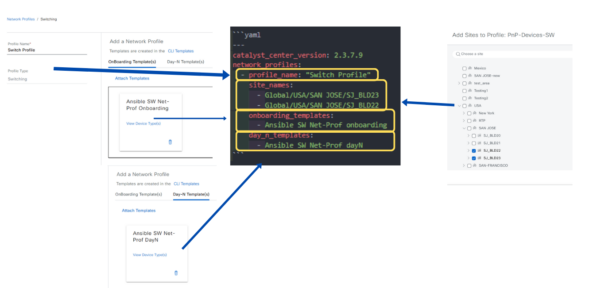

# Cisco Catalyst Center Switch Network Profile Playbooks

This module manages switch network profiles in Cisco Catalyst Center (DNAC), a platform for intent-based networking. It automates the creation, deletion, and assignment of switch profiles to sites and templates.

**Description:**
- Create and delete switch network profiles.
- Assign profiles to sites, onboarding templates, and Day-N templates.

**Version Added:**   `6.32.0`

---

This README outlines the steps to use the Ansible playbooks for managing Network Profile Switching in Cisco Catalyst Center.

## Workflow Steps

This workflow typically involves the following steps:

### Step 1: Install and Generate Inventory

Before running the playbooks, ensure you have Ansible installed and the necessary collections for Cisco Catalyst Center.

1.  **Install Ansible:** Follow the official Ansible documentation for installation instructions.
2.  **Install Cisco Catalyst Center Collection:**
    ```bash
    ansible-galaxy collection install cisco.dnac
    ```
3.  **Generate Inventory:** Create an Ansible inventory file (e.g., `hosts.yml`) that includes your Cisco Catalyst Center appliance details. You will need to define variables such as the host, username, and password (or other authentication methods).
    ```yaml
    catalyst_center_hosts:
        hosts:
            your_catalyst_center_instance_name:
                catalyst_center_host: xx.xx.xx.xx
                catalyst_center_password: XXXXXXXX
                catalyst_center_port: 443
                catalyst_center_timeout: 60
                catalyst_center_username: admin
                catalyst_center_verify: false # Set to true for production with valid certificates
                catalyst_center_version: 2.3.7.6 # Specify your DNA Center version
                catalyst_center_debug: true
                catalyst_center_log_level: INFO
                catalyst_center_log: true
    ```

### Step 2: Define Inputs and Validate

This step involves preparing the input data for creating or managing network profiles and validating your setup.

1. **Prerequisite:**
    - Need Site Hierarchy created
    - Need CLI template created

2. **Define Input Variables:** Create variable files (e.g., `vars/network_profile_switching_inputs.yml`) that define the desired state of your network switch profiles, including details for creation, deletion, and assignment. Refer to the specific playbook documentation for the required variable structure.

#### Switch Network Profile Schema

| **Parameter**          | **Type**   | **Required** | **Default Value** | **Description**                                                                 |
|------------------------|------------|--------------|-------------------|---------------------------------------------------------------------------------|
| `profile_name`         | String     | Yes          | N/A               | The name of the wireless network profile (0–255 characters, empty string allowed). |
| `day_n_templates`      | List       | No           | []                | A list of Day-N template names associated with the profile (0–500 items).       |
| `onboarding_templates` | List       | No           | []                | A list of onboarding template names associated with the profile (0–500 items).  |
| `site_names`           | List       | No           | []                | A list of site hierarchy names where the profile is applied (0–200 items).      |

#### Example Input File

1. Create Switch Network Profile in Catalyst Center

    ```yaml
    ---
    catalyst_center_version: 2.3.7.9
    network_profiles:
      - profile_name: "Switch Profile"
        site_names:
          - Global/USA/SAN JOSE/SJ_BLD23
          - Global/USA/SAN JOSE/SJ_BLD22
        onboarding_templates:
          - Ansible SW Net-Prof onboarding
        day_n_templates:
          - Ansible SW Net-Prof dayN
    ```
    

2. Update Switch Network Profile in Catalyst Center

    Users can update their profiles by modifying the configuration and input assignments. The site assignment can be changed using the following inputs:
    ```yaml
    ---
    catalyst_center_version: 2.3.7.9
    network_profiles:
      - profile_name: "Switch Profile"
        site_names:
          - Global/USA/SAN JOSE/SJ_BLD20
          - Global/USA/SAN JOSE/SJ_BLD21
        onboarding_templates:
          - Ansible SW Net-Prof onboarding
        day_n_templates:
          - Ansible SW Net-Prof dayN
    ```

3. Delete Switch Network Profile

    In Delete section, user only need to provide profile_name to delete them
    ```yaml
    ---
    catalyst_center_version: 2.3.7.9
    network_profiles:
      - profile_name: "Switch Profile"
    ```
    
---
### Step 3: Deploy and Verify

This is the final step where you deploy the configuration to Cisco Catalyst Center and verify the changes.

1. **Validate Configuration**

    Use yamale to validate the user created configurations against the playbooks required spfcification or using below command

    ``` bash
    ./tools/validate.sh -s ./workflows/network_profile_switching/schema/network_profile_switching_schema.yml -d ./workflows/network_profile_switching/vars/network_profile_switching_inputs.yml
    ```

2.  **Deploy Configuration:** 

    Run the playbook to seamlessly apply the switch network profile configuration defined in your input variables to Cisco Catalyst Center. 

    Before proceeding, ensure that the input validation step has been completed successfully, with no errors detected in the provided variables. Once validated, execute the playbook by specifying the input file path using the --e variable as VARS_FILE_PATH. The VARS_FILE_PATH must be provided as a full path to the input file.

    This ensures that the configuration is accurately deployed to Cisco Catalyst Center, automating the setup process and reducing the risk of manual errors.

    ```bash
    ansible-playbook -i ./inventory/iac2/host.yml workflows/network_profile_switching/playbook/network_profile_switching_playbook.yml --e VARS_FILE_PATH=/<full path>/dnac_ansible_workflows/workflows/network_profile_switching/vars/network_profile_switching_inputs.yml > logs/switch_profile.log -vvvvvv    
    ```

    If there is an error in the input or an issue with the API call during execution, the playbook will halt and display the relevant error details.

2.  **Verify Deployment:** 
After executing the playbook, check the Catalyst Center UI to verify switch profile has been created. If *debug_log* is enabled, you can also review the logs for detailed information on operations performed and any updates made.

    

---

### References

*Note: The environment used for the references in the above instructions is as follows:*

```yaml
python: 3.12.0
dnac_version: 2.3.7.9
ansible: 9.9.0
cisco.dnac: 6.32.0
dnacentersdk: 2.8.8
```

For detailed information on network wireless profile workflow refer to the following documentation: https://galaxy.ansible.com/ui/repo/published/cisco/dnac/content/module/network_profile_switching_workflow_manager