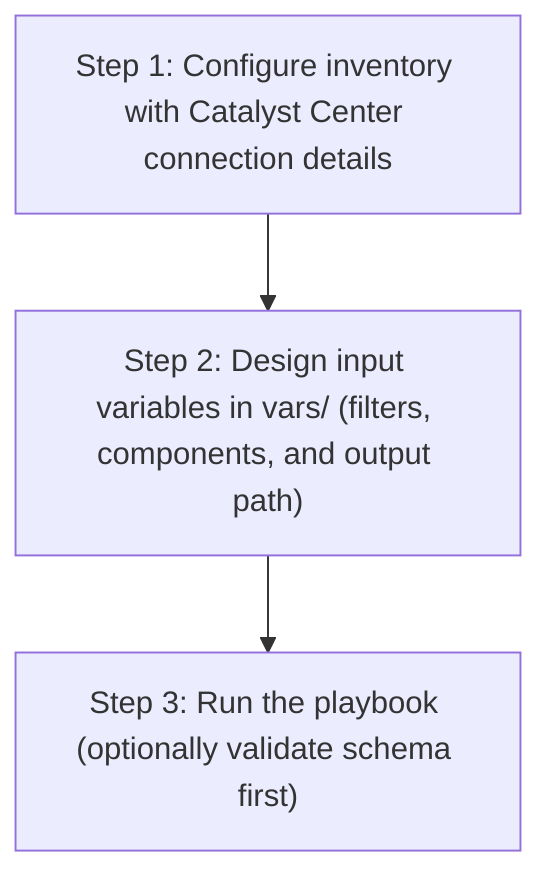

# Network Profile Switch Config Generator

## Table of Contents

- [User Flow (3 Steps)](#user-flow-3-steps)

- [Overview](#overview)
- [Features](#features)
- [Prerequisites](#prerequisites)
- [Workflow Structure](#workflow-structure)
- [Schema Parameters](#schema-parameters)
- [Getting Started](#getting-started)
- [Operations](#operations)
- [Examples](#examples)

## User Flow (3 Steps)



---

## Overview

The Network Profile Switch config generator automates the creation of YAML playbook configurations for existing switch profiles deployed in Cisco Catalyst Center. This tool reduces the effort required to manually create Ansible playbooks by programmatically generating configurations from existing switch profile infrastructure.

---

## Features

- **Configuration Generation**: Generate YAML configurations compatible with `network_profile_switching_workflow_manager` module.
Extract existing switch profiles and associated configurations from your Cisco Catalyst Center.
Convert them into properly formatted YAML files.
Generate files that are ready to use with Ansible automation.
- **Profile Filtering**: Selective generation based on profile names, Day-N templates, or site assignments
- **Combined Filtering**: Multiple filter types can be used together — all profiles matching any of the provided filters will be retrieved
- **Flexible Output**: Configurable file paths and naming conventions with timestamp support
- **Brownfield Support**: Extract configurations from existing Catalyst Center deployments
- **API Integration**: Leverages native Catalyst Center APIs for data retrieval

---

## Prerequisites

### Software Requirements

| Component | Version |
|-----------|---------|
| Ansible | 2.13+ |
| cisco.dnac collection | 6.49.0+ |
| Python | 3.9+ |
| Cisco Catalyst Center | 2.3.7.9+ |
| dnacentersdk | 2.10.10+ |

### Required Collections

```bash
ansible-galaxy collection install cisco.dnac    # >= 6.49.0
ansible-galaxy collection install ansible.utils
pip install dnacentersdk
pip install yamale
```

### Access Requirements

- Catalyst Center admin credentials
- Network connectivity to Catalyst Center API
- Switch profile infrastructure deployed and configured
- Existing switch profiles with associated templates and configurations

---

## Workflow Structure

```
network_profile_switching_config_generator/
├── playbook/
│   └── network_profile_switching_config_generator.yml          # Main operations
├── vars/
│   ├── network_profile_switching_config_inputs.yml             # Configuration examples
├── schema/
│   └── network_profile_switching_config_schema.yml             # Input validation
└── README.md                                                
```

---

## Schema Parameters

### Basic Configuration

| Parameter | Type | Required | Default | Description |
|-----------|------|----------|---------|-------------|
| generate_all_configurations | boolean | No | false | Generate all switch profiles automatically |
| file_path | string | No | auto-generated | Output file path for YAML configuration file |
| file_mode | string | No | overwrite | File write mode — `overwrite` replaces the file, `append` adds to it |
| global_filters | dict | No | none | Filters to specify which switch profiles to include |

### Global Filtering (Combined Filter Behavior)

| Parameter      | Type | Required | Processing Order | Description |
|--------------|------|----------|-------------|-----------|
| profile_name_list | list | No | **1st** | List of specific switch profile names to extract |
| day_n_template_list      | list | No | **2nd**| List of Day-N templates to filter switch profiles |
| site_list | list | No | **3rd**| List of site hierarchies to filter switch profiles |

> **Important:** If multiple filter types are provided, the module will process them in the order of `profile_name_list`, `day_n_template_list`, `site_list`. All profiles matching **any** of the provided filters will be retrieved. The results are combined (union) — not exclusive.

### Filter Specifications

#### Profile Name List
- **Type**: List of strings
- **Processing Order**: 1st
- **Case-sensitive**: Must match exact profile names in Catalyst Center
- **Example**: `["Campus_Switch_Profile", "Enterprise_Switch_Profile"]`
- **Behavior**: Module will fail if any specified profile doesn't exist

#### Day-N Template List
- **Type**: List of strings
- **Processing Order**: 2nd
- **Case-sensitive**: Must match exact template names
- **Example**: `["Periodic_Config_Audit", "Security_Compliance_Check"]`
- **Behavior**: Returns all profiles containing any of the specified templates

#### Site List
- **Type**: List of strings
- **Processing Order**: 3rd
- **Case-sensitive**: Must match exact site hierarchy paths
- **Example**: `["Global/India/Chennai/Main_Office", "Global/USA/San_Francisco/Regional_HQ"]`
- **Behavior**: Returns all profiles assigned to any of the specified sites

#### Combined Filters
- When multiple filter types are provided together, the module processes each filter in order
- Results are **combined (union)** — all profiles matching any filter are included
- Duplicate profiles are automatically de-duplicated in the output
- Example: If `profile_name_list` matches Profile A and `day_n_template_list` matches Profile B, both Profile A and Profile B will be included in the output

---

## Getting Started

### Step 1: Install Prerequisites

```bash
ansible-galaxy collection install cisco.dnac
ansible-galaxy collection install ansible.utils
pip install dnacentersdk
pip install yamale
```

### Step 2: Configure Inventory

Edit `inventory/demo_lab/hosts.yml`:

```yaml
catalyst_center_hosts:
  hosts:
    catalyst_center_primary:
      catalyst_center_host: 10.0.0.0
      catalyst_center_username: admin
      catalyst_center_password: "password"
```

### Step 3: Configure Variables

Edit `workflows/network_profile_switching_config_generator/vars/network_profile_switching_config_inputs.yml`:

```yaml
network_profile_switch_config:
  - generate_all_configurations: true
    file_path: "/tmp/complete_switch_profiles_config.yml"
```

### Step 4: Validate Configuration

```bash
./tools/validate.sh -s workflows/network_profile_switching_config_generator/schema/network_profile_switching_config_schema.yml \
     -d workflows/network_profile_switching_config_generator/vars/network_profile_switching_config_inputs.yml
```

### Step 5: Execute Playbook

The playbook supports two input methods:

#### Option A: Vars file input (recommended for version-controlled configs)

```bash
ansible-playbook -i inventory/demo_lab/hosts.yaml \
  workflows/network_profile_switching_config_generator/playbook/network_profile_switching_config_generator.yml \
  --extra-vars VARS_FILE_PATH=./workflows/network_profile_switching_config_generator/vars/network_profile_switching_config_inputs.yml \
  -vvvv
```

#### Option B: Inventory / host variable input

Omit `VARS_FILE_PATH` and define `network_profile_switch_config` directly as a host variable in your inventory file or in `host_vars`/`group_vars`.

**Example inventory snippet (`inventory/demo_lab/hosts.yaml`):**

```yaml
catalyst_center_hosts:
  hosts:
    catalyst_center_primary:
      catalyst_center_host: "{{ lookup('ansible.builtin.env', 'HOSTIP') }}"
      catalyst_center_password: "{{ lookup('ansible.builtin.env', 'CATALYST_CENTER_PASSWORD') }}"
      catalyst_center_port: 443
      catalyst_center_username: "{{ lookup('ansible.builtin.env', 'CATALYST_CENTER_USERNAME') }}"
      catalyst_center_verify: false
      catalyst_center_version: 2.3.7.9

      # Workflow data defined as host variables
      network_profile_switch_config:
        - generate_all_configurations: true
          file_path: "/tmp/complete_switch_profiles_config.yml"
```

Then run **without** `VARS_FILE_PATH`:

```bash
ansible-playbook -i inventory/demo_lab/hosts.yaml \
  workflows/network_profile_switching_config_generator/playbook/network_profile_switching_config_generator.yml \
  -vvvv
```

The playbook auto-detects the input source and prints it at the start:
- `Input source: vars file <path>` when using Option A
- `Input source: inventory / host variables (VARS_FILE_PATH not provided)` when using Option B

> **Note:** When `VARS_FILE_PATH` is provided, it takes **precedence** over inventory variables.

### Workflow Execution

The workflow follows these steps:

1. **Load input** from `VARS_FILE_PATH` (if provided) or fall back to inventory / host variables
2. **Connect** to Catalyst Center using provided credentials
3. **Extract** `file_path` and `file_mode` as top-level module parameters; pass `global_filters` inside `config`
4. **Omit** `config` entirely when `generate_all_configurations: true` (module runs in full auto-discovery mode)
5. **Retrieve** existing switch profiles and associated configurations via API calls
6. **Filter** switch profiles based on specified criteria — processing filters in order and combining results
7. **Transform** API responses into Ansible-compatible format
8. **Generate** YAML configuration file with proper structure
9. **Write** output to specified file path using configured `file_mode`

---

## Operations

### Generate Operations (state: gathered)

Use `network_profile_switching_config_generator.yml` for generating YAML playbook configuration operations.

#### Generate All Configurations

**Description**: Retrieves all switch profiles and configurations from Catalyst Center regardless of any filters.

```yaml
network_profile_switch_config:
  - generate_all_configurations: true
    file_path: "/tmp/complete_switch_profiles_config.yml"
```

#### Profile Name Based Generation

**Description**: Generates configuration for specific switch profiles only.

```yaml
network_profile_switch_config:
  - file_path: "/tmp/specific_switch_profiles_config.yml"
    global_filters:
      profile_name_list:
        - "Campus_Switch_Profile"
        - "Enterprise_Switch_Profile"
```

#### Day-N Template Based Generation

**Description**: Generates configuration for switch profiles containing specific Day-N templates.

```yaml
network_profile_switch_config:
  - file_path: "/tmp/template_based_switch_profiles_config.yml"
    global_filters:
      day_n_template_list:
        - "Periodic_Config_Audit"
        - "Security_Compliance_Check"
```

#### Site Based Generation

**Description**: Generates configuration for switch profiles assigned to specific sites.

```yaml
network_profile_switch_config:
  - file_path: "/tmp/site_based_switch_profiles_config.yml"
    global_filters:
      site_list:
        - "Global/USA/SAN JOSE/SJ_BLD21/FLOOR1"
        - "Global/India/Chennai/Main_Office"
```

#### Combined Filter Generation

**Description**: Generates configuration using multiple filter types together. All profiles matching **any** of the provided filters will be retrieved and combined.

```yaml
network_profile_switch_config:
  - file_path: "/tmp/combined_filter_profiles_config.yml"
    global_filters:
      profile_name_list:
        - "Test Profile BF1"
      day_n_template_list:
        - "static_host_offboarding_template"
```

> **Note:** In this example, the module retrieves profiles matching the profile name `Test Profile BF1` **and** profiles containing the Day-N template `static_host_offboarding_template`. Results are combined — all unique profiles from both filters are included.

**Validate and Execute:**

```bash
# Validate
./tools/validate.sh -s workflows/network_profile_switching_config_generator/schema/network_profile_switching_config_schema.yml \
                   -d workflows/network_profile_switching_config_generator/vars/network_profile_switching_config_inputs.yml
```
**Return result validate:**
```bash
(pyats-priya) [pbalaku2@st-ds-4 dnac_ansible_workflows]$ ./tools/validate.sh -s workflows/network_profile_switching_config_generator/schema/network_profile_switching_config_schema.yml \
>                    -d workflows/network_profile_switching_config_generator/vars/network_profile_switching_config_inputs.yml
workflows/network_profile_switching_config_generator/schema/network_profile_switching_config_schema.yml
workflows/network_profile_switching_config_generator/vars/network_profile_switching_config_inputs.yml
yamale   -s workflows/network_profile_switching_config_generator/schema/network_profile_switching_config_schema.yml  workflows/network_profile_switching_config_generator/vars/network_profile_switching_config_inputs.yml
Validating workflows/network_profile_switching_config_generator/vars/network_profile_switching_config_inputs.yml...
Validation success! 👍
```

```bash
# Execute
ansible-playbook -i inventory/demo_lab/hosts.yaml \
  workflows/network_profile_switching_config_generator/playbook/network_profile_switching_config_generator.yml \
  --extra-vars VARS_FILE_PATH=../vars/network_profile_switching_config_inputs.yml
```

**Expected Terminal Output:**

1. **Generate All Configurations**

```code
        file_path: /tmp/complete_switch_profiles_config.yml
        generate_all_configurations: true
   msg: 
        YAML config generation Task succeeded for module 'network_profile_switching'.:
          file_path: /tmp/complete_switch_profiles_config.yml
      response:
        YAML config generation Task succeeded for module 'network_profile_switching'.:
          file_path: /tmp/complete_switch_profiles_config.yml
      status: success
```

2. **Profile Name Based Generation:**

```code
        global_filters:
          profile_name_list:
          - Campus_Switch_Profile
          - Enterprise_Switch_Profile
        file_path: /tmp/specific_switch_profiles_config.yml
      msg: 
        YAML config generation Task succeeded for module 'network_profile_switching'.:
          file_path: /tmp/specific_switch_profiles_config.yml
      response:
        YAML config generation Task succeeded for module 'network_profile_switching'.:
          file_path: /tmp/specific_switch_profiles_config.yml
      status: success
```

3. **Day-N Template Based Generation:**

```code
        global_filters:
          day_n_template_list:
          - Periodic_Config_Audit
        file_path: /tmp/template_based_switch_profiles_config.yml
      msg: 
        YAML config generation Task succeeded for module 'network_profile_switching'.:
          file_path: /tmp/template_based_switch_profiles_config.yml
      response:
        YAML config generation Task succeeded for module 'network_profile_switching'.:
          file_path: /tmp/template_based_switch_profiles_config.yml
      status: success
```

4. **Combined Filter Generation:**

```code
        global_filters:
          profile_name_list:
          - Test Profile BF1
          day_n_template_list:
          - static_host_offboarding_template
        file_path: /tmp/combined_filter_profiles_config.yml
      msg: 
        YAML config generation Task succeeded for module 'network_profile_switching'.:
          file_path: /tmp/combined_filter_profiles_config.yml
      response:
        YAML config generation Task succeeded for module 'network_profile_switching'.:
          file_path: /tmp/combined_filter_profiles_config.yml
      status: success
```

---

## Examples

### Example 1: Generate ALL switch profiles

```yaml
network_profile_switch_config:
  - generate_all_configurations: true
    file_path: "/tmp/complete_switch_infrastructure.yml"
```
**Sample Generated Output**:

Below is a sample YAML configuration file generated by the module when `generate_all_configurations: true` is used:

```yaml
---
config:
- profile_name: Test Profile BF3
  day_n_templates:
  - evpn_l2vn_anycast_delete_template
  - static_host_offboarding_template
  - static_host_onboarding_template
  - Ans Switch DayN 2
  - Ans Switch DayN 1
  site_names:
  - Global/USA/SAN JOSE/SJ_BLD23/FLOOR2
- profile_name: Test Profile BF1
  day_n_templates:
  - Template-Switch-for-Deploy
  - evpn_l2vn_anycast_delete_template
  - Ans Switch DayN 1
- profile_name: Campus_Access_Switch1
- profile_name: Test Profile BF2
  day_n_templates:
  - evpn_l2vn_anycast_template
  - static_host_onboarding_template
  - Ans Switch DayN 1
  site_names:
  - Global/USA/SAN JOSE/SJ_BLD21/FLOOR1
  - Global/USA/SAN JOSE/SJ_BLD21/FLOOR3
  - Global/USA/SAN JOSE/SJ_BLD21
  - Global/USA/SAN JOSE/SJ_BLD21/FLOOR2
  - Global/USA/SAN JOSE/SJ_BLD21/FLOOR4
```

---

### Example 2: Specific Profile Names

Extract configurations for specific switch profiles by name.

```yaml
network_profile_switch_config:
  - file_path: "/tmp/profile_name_list.yml"
    global_filters:
      profile_name_list:
        - "Test Profile BF1"
        - "Test Profile BF2"
```
**Sample Generated Output**:

Below is a sample YAML configuration file generated by the module when `profile_name_list` filter is used with specific profile names:

```yaml
---
config:
- profile_name: Test Profile BF1
  day_n_templates:
  - Template-Switch-for-Deploy
  - evpn_l2vn_anycast_delete_template
  - Ans Switch DayN 1
- profile_name: Test Profile BF2
  day_n_templates:
  - evpn_l2vn_anycast_template
  - static_host_onboarding_template
  - Ans Switch DayN 1
  site_names:
  - Global/USA/SAN JOSE/SJ_BLD21/FLOOR1
  - Global/USA/SAN JOSE/SJ_BLD21/FLOOR3
  - Global/USA/SAN JOSE/SJ_BLD21
  - Global/USA/SAN JOSE/SJ_BLD21/FLOOR2
  - Global/USA/SAN JOSE/SJ_BLD21/FLOOR4
```

> **Note:** Only the specified profiles (`Test Profile BF1`, `Test Profile BF2`) are extracted. Each profile includes its associated Day-N templates and site assignments if configured in Catalyst Center.


### Example 3: Day-N Template Based Filtering

Extract all switch profiles that use specific Day-N templates.

```yaml
network_profile_switch_config:
  - file_path: "/tmp/day_n_template_list.yml"
    global_filters:
      day_n_template_list:
        - "Ans Switch DayN 2"
        - "static_host_offboarding_template"
```
**Sample Generated Output**:

Below is a sample YAML configuration file generated by the module when `day_n_template_list` filter is used with specific Day-N template names:

```yaml
---
config:
- profile_name: Test Profile BF3
  day_n_templates:
  - evpn_l2vn_anycast_delete_template
  - static_host_offboarding_template
  - static_host_onboarding_template
  - Ans Switch DayN 2
  - Ans Switch DayN 1
  site_names:
  - Global/USA/SAN JOSE/SJ_BLD23/FLOOR2
```

> **Note:** Only profiles containing any of the specified Day-N templates (`Ans Switch DayN 2`, `static_host_offboarding_template`) are extracted. The output includes the complete profile with all its Day-N templates and site assignments, not just the filtered templates.


### Example 4: Site-Based Filtering

Extract switch profiles assigned to specific sites.

```yaml
network_profile_switch_config:
  - file_path: "/tmp/site_specific_profiles.yml"
    global_filters:
      site_list:
        - "Global/USA/SAN JOSE/SJ_BLD21/FLOOR1"
        - "Global/USA/SAN JOSE/SJ_BLD21/FLOOR2"
```
**Sample Generated Output**:

Below is a sample YAML configuration file generated by the module when `site_list` filter is used with specific site hierarchies:

```yaml
---
config:
- profile_name: Test Profile BF2
  day_n_templates:
  - evpn_l2vn_anycast_template
  - static_host_onboarding_template
  - Ans Switch DayN 1
  site_names:
  - Global/USA/SAN JOSE/SJ_BLD21/FLOOR1
  - Global/USA/SAN JOSE/SJ_BLD21/FLOOR3
  - Global/USA/SAN JOSE/SJ_BLD21
  - Global/USA/SAN JOSE/SJ_BLD21/FLOOR2
  - Global/USA/SAN JOSE/SJ_BLD21/FLOOR4
```

> **Note:** Only profiles assigned to any of the specified sites (`Global/USA/SAN JOSE/SJ_BLD21/FLOOR1`, `Global/USA/SAN JOSE/SJ_BLD21/FLOOR2`) are extracted. The output includes the complete profile with all its Day-N templates and all site assignments, not just the filtered sites.


### Example 5: Combined Filters — Profile Names + Day-N Templates

Use multiple filter types together to retrieve all profiles matching **any** of the provided filters.

```yaml
network_profile_switch_config:
  - file_path: "/tmp/combined_profile_and_template.yml"
    global_filters:
      profile_name_list:
        - "Test Profile BF1"
      day_n_template_list:
        - "static_host_offboarding_template"
```
**Sample Generated Output**:

```yaml
---
config:
- profile_name: Test Profile BF1
  day_n_templates:
  - Template-Switch-for-Deploy
  - evpn_l2vn_anycast_delete_template
  - Ans Switch DayN 1
- profile_name: Test Profile BF3
  day_n_templates:
  - evpn_l2vn_anycast_delete_template
  - static_host_offboarding_template
  - static_host_onboarding_template
  - Ans Switch DayN 2
  - Ans Switch DayN 1
  site_names:
  - Global/USA/SAN JOSE/SJ_BLD23/FLOOR2
```

> **Note:** The module processes `profile_name_list` first (retrieving `Test Profile BF1`), then `day_n_template_list` (retrieving `Test Profile BF3` which contains `static_host_offboarding_template`). Both results are **combined** — all unique profiles matching any filter are included.

### Example 6: Multiple Generation Tasks

```yaml
network_profile_switch_config:
  # Generate all configurations
  - generate_all_configurations: true
    file_path: "/tmp/all_switch_profiles.yml"
  
  # Generate specific profiles
  - file_path: "/tmp/name_based_profiles.yml"
    global_filters:
      profile_name_list:
        - "Campus_Switch_Profile"
  
  # Generate by template
  - file_path: "/tmp/day_n_template_based_profiles.yml"
    global_filters:
      day_n_template_list:
        - "Ans Switch DayN 2"
        - "static_host_onboarding_template"

  # Generate with combined filters
  - file_path: "/tmp/combined_filters_profiles.yml"
    global_filters:
      profile_name_list:
        - "Test Profile BF1"
      day_n_template_list:
        - "static_host_offboarding_template"
      site_list:
        - "Global/USA/SAN JOSE/SJ_BLD21/FLOOR1"
```

### Example 7: Auto-generated File Path

When no file path is specified, the module auto-generates a timestamped filename.

```yaml
network_profile_switch_config:
  - global_filters:
      profile_name_list:
        - "Test Profile BF1"
        - "Test Profile BF2"
# Output: playbooks_config_2026-02-19_14-30-45.yml
```

---

## Additional Resources

- [Cisco Catalyst Center Documentation](https://www.cisco.com/c/en/us/support/cloud-systems-management/dna-center/series.html)
- [Cisco DNA Center SDK](https://dnacentersdk.readthedocs.io/)
- [Ansible Documentation](https://docs.ansible.com/)
- [Network Profile Switching Workflow Manager Module](https://galaxy.ansible.com/ui/repo/published/cisco/dnac/)
